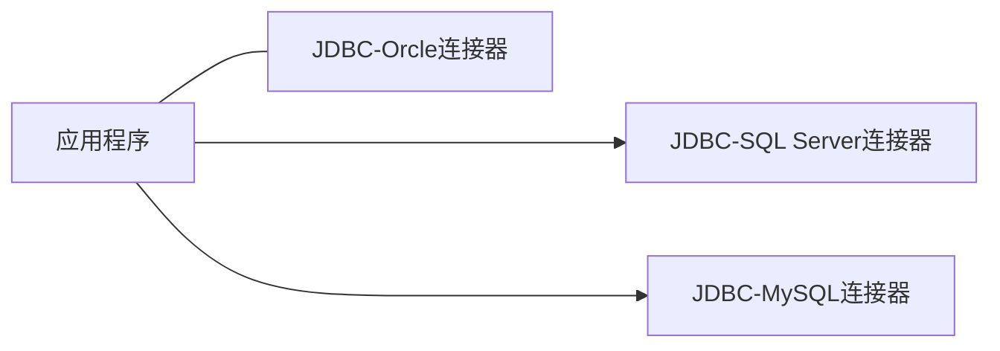
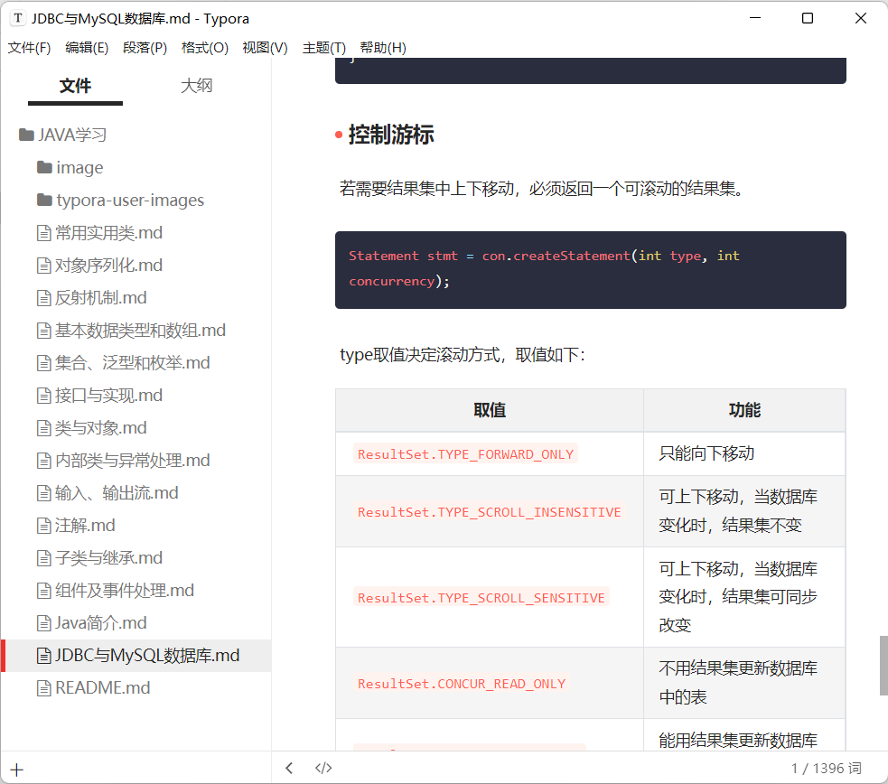

# JDBC与MySQL数据库

## MySQL数据库管理系统

MySQL数据库管理系统简称MySQL，它是世界上最流行的开源数据库管理系统。最初由瑞典的MySQL AB开发，目前由Oracle公司负责源码的维护和升级。

## MySQL客户端管理工具

通过图形用户界面管理工具在MySQL服务器进行创建数据库、在数据库建表等操作。

### 建立连接


### 建立数据库


## JDBC

为是Java编写不依赖于具体的数据库，Java提供专门用于操作数据库的API，即JDBC（Java Data Base Connectity）。JDBC操作不同的数据库仅仅为连接方式的差异，使用JDBC程序一旦和数据库建立连接，就可使用JDBC提供的API操作数据库。


程序经常使用JDBC进行如下操作：

1. 与一个数据库建立联系
2. 向已知数据库发送SQL语句
3. 处理SQL语句的返回结果

## 连接数据库

Java应用程序加载相应数据库连接器（数据库驱动）后，即可使用JDBC和数据库建立连接。



1. 下载JDBC-MySQL数据库连接器

应用程序为访问MySQL，必须保证应用程序所驻留的计算机安装相应的JDBC-MySQL数据库连接器。

https://dev.mysql.com/downloads/file/?id=514063 下载mysql-connector-java-8.0.21zip，解压至硬盘，解压到目录的jar文件即是连接JDBC数据库的JDBC-MySQL。

可将mysql-connector-java-8.0.21.jar保存到应用程序的当前目录中。

2. 加载JDBC-MySQL数据库驱动程序

   ```java
   try {
       Class.forName("com.mysql.cj.jdbc.Driver");
   } catch (ClassNotFoundException e) {
       e.printStackTrace();
   }
   ```

   MySQL数据库驱动程序被封装在Driver类中，该类的包名为`com.mysql.cj.jdbc`，该类不是运行Java运行环境类库中的类，而存在于数据库连接器中。

3. 连接数据库

   ```java
   static final String JDBC_DRIVER = "com.mysql.cj.jdbc.Driver";
   static final String DB_URL = "jdbc:mysql://localhost:3306/mysql?useSSL=false&allowPublicKeyRetrieval=true&serverTimezone=UTC";
   
   static final String USER = "root";
   static final String PASSWORD = "123321";
   
   public static void main(String[] args) {
       Connection conn = null;
       Statement state = null;
       try  {
           Class.forName(JDBC_DRIVER);
           System.out.println("连接数据库...");
           conn = DriverManager.getConnection(DB_URL, USER, PASSWORD);
       } catch (SQLException e) {
           System.out.println(e);
       }
   }
   ```

   对于MySQL 8.0版本，必须设置`serverTimezone`，比如`serverTimezone=CST`（China Standard Time）；

   MySQL 5.7之后版本建议应用程序和数据库服务器建立连接时明确设置SSL（Secure Sockets Layer），若不设置参数，程序运行时会提示进行明确设置（不影响程序运行）；

   应用程序一旦和某个数据库建立连接，就可通过SQL语句和该数据库的表交互信息，例如查询、修改、更改表中的记录。

   4. 注意汉字问题

      特别注意，若数据表中的记录含有汉字，则在建立连接时需要传递参数`characterEncoding=utf-8`。

   ## 查询操作

   和数据库建立连接后，可使用JDBC提供的API和数据库交互信息。对一个数据库中的表进行查询操作的具体步骤如下：

   1. 向数据库发送SQL语句。

      首先使用`Statement`声明SQL语句对象，让以创建连接的对象`con`调用`createStatement`方法常见SQL语句对象。

      ```java
      try {
      	Statement sql = con.createStatement();	
      } catch (SQLException e) {}
      ```

   2. 处理查询结果

      有了SQL语句对象后，即可调用相应的方法实现对数据库中表的查询和修改，并将查询结果存放在`ResultSet`类声明的对象中，`ResultSet`对象按列（字段）组织数据。

      ```java
      Result set = sql.excuteQuery("select* from students");
      ```

      `ResultSet`对象一次只可见一个数据行，需使用`next()`方法移至下个数据行，使用`get*()`方法可获得字段值。无论何种属性，均可使用`getString(columnNum/Name)`返回字段值表示该属性。

   3. 关闭连接

      ```java
      con.close();
      ```

      `一旦关闭连接，程序将无法获取该数据库的信息。

   ### 顺序查询

   顺序查询即对象一次只能看到一个数据行，使用`next`方法移到下一个数据行，向下移动游标，移动成功返回`true`，否则返回`fasle`

   ```java
   package jdbc_program;
   
   import java.sql.*;
   
   public class MySQLDemo {
       static final String JDBC_DRIVER = "com.mysql.cj.jdbc.Driver";
       static final String DB_URL = "jdbc:mysql://localhost:3306/mysql?useSSL=false&allowPublicKeyRetrieval=true&serverTimezone=UTC";
   
       static final String USER = "root";
       static final String PASSWORD = "123321";
   
       public static void main(String[] args) {
           Connection conn = null;
           Statement state = null;
           try  {
               Class.forName(JDBC_DRIVER);
               System.out.println("连接数据库...");
               conn = DriverManager.getConnection(DB_URL, USER, PASSWORD);
               System.out.println("数据库连接成功");
               System.out.println("实例化Statement对象");
               state = conn.createStatement();
               String sql;
               sql = "SELECT id, name, url FROM web";
               ResultSet rs = state.executeQuery(sql);
   
               while (rs.next()) {
                   int id = rs.getInt("id");
                   String name = rs.getString("name");
                   String url = rs.getString("url");
   
                   System.out.println("ID: " + id);
                   System.out.println(", 站点名称: " + name);
                   System.out.println(", 站点URL: " + url);
               }
               rs.close();
               state.close();
               conn.close();
           } catch (SQLException e) {
               throw new RuntimeException(e);
           } catch (ClassNotFoundException e) {
               throw new RuntimeException(e);
           } catch (Exception e) {
               e.printStackTrace();
           }
           } finally {
               try {
                   if (state != null) {
                       state.close();
                   }
               } catch(SQLException se2) {
               }
               try {
                   if (conn == null) {
                       conn.close();
                   }
               } catch (SQLException e) {
                   e.printStackTrace();
               }
           }
           System.out.println("Goodbye");
       }
   
   }
   ```

   ### 控制游标

   若需要结果集中上下移动，必须返回一个可滚动的结果集。

   ```java
   Statement stmt = con.createStatement(int type, int concurrency);
   ```

   type取值决定滚动方式，取值如下：

   | 取值                                | 功能                                         |
   | ----------------------------------- | -------------------------------------------- |
   | `ResultSet.TYPE_FORWARD_ONLY`       | 只能向下移动                                 |
   | `ResultSet.TYPE_SCROLL_INSENSITIVE` | 可上下移动，当数据库变化时，结果集不变       |
   | `ResultSet.TYPE_SCROLL_SENSITIVE`   | 可上下移动，当数据库变化时，结果集可同步改变 |
   | `ResultSet.CONCUR_READ_ONLY`        | 不用结果集更新数据库中的表                   |
   | `ResultSet.CONCUR_UPDATETABLE`      | 能用结果集更新数据库的表                     |

   

