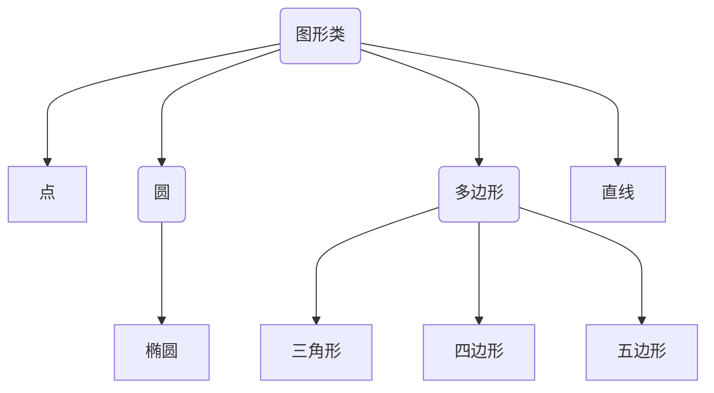

# 子类与继承

## 子类和父类

### 子类

继承是一种由已有类创建新类的机制。利用继承，可以先定义一个共有属性的一般类，根据该一般类再定义具有特殊属性的子类，子类继承一般类的属性和行为，并根据需要增加自己新的属性和行为。

在类的声明中，通过关键字`extend`定义一个子类，格式如下：

```java
class Derived extends Base {
	...
}
```

### 类的树形结构

若C是B的子类，B是A的子类，则习惯称C是A的子类。Java的类按继承关系形成树形结构，在这个树形结构中，根结点是`Object`类（`java.lang`包中的类），即`Object`使所有类的祖先类，任何类都是`Object`类的子类。

## 类的封装

封装将类的某些信息隐藏在类内部，不允许外部程序直接访问，只能通过该类提供的方法来实现对隐藏信息的操作和访问。

封装的特点：

- 只能通过规定的方法访问数据。
- 隐藏类的实例细节，方便修改和实现。

通过封装，实现了对属性的数据访问限制，满足了年龄的条件。在属性的赋值方法中可以对属性进行限制操作，从而给类中的属性赋予合理的值， 并通过取值方法获取类中属性的值。

## 子类的继承性

### 同一包中

```java
public class People {
	int leg, hand;
	String name;
	People(String s) {
		name = s;
		this.init();
	}
	void init() {
		leg = 2;
		hand = 2;
		System.out.println(name + "有" + hand + "只手" + leg + "条腿");
	}
}
```

```java
public class Student extends People {
	int number;
	Student(String s, int n) {
		super(s);
		number = n;
	}
	void tellNumber() {
		System.out.printf("学号：%d\t", number);
	}
	int add(int x, int y) {
		return x + y;
	}
}
```

```java
//import java.util.*;

public class Main {
	public static void main(String[] args) {
		Student stu = new Student(new String("乔布斯"), 20);
		System.out.println(stu.add(1, 2));
	}
}
```

### 不同包中

当子类和父类不在同一包中时，父类中的`private`和友好访问权限将不会被子类继承，子类只继承父类中的`protected`和`public`访问权限的成员作为子类的成员变量和方法。

一个类只能有一个直接父类，但是它可以有多个间接的父类。




父类和其子类间必须存在`is-a`的关系，否则不能使用继承。

- 继承是侵入性的。只要继承，就必须拥有父类的属性和方法。
- 降低代码灵活性。子类拥有父类的属性和方法后多了些约束。
- 增强代码耦合性（开发项目的原则为高内聚低耦合）。当父类的常量、变量和方法被修改时，需要考虑子类的修改，有可能会导致大段的代码需要重构。

## 子类与对象

子类创建对象时，父类的成员变量分配了空间，但只有一部分作为子类对象的变量，但可以使用方法操作未继承的变量。

如果在父类中存在有参的构造方法而并没有重载无参的构造方法，那么在子类中必须含有有参的构造方法，因为如果在子类中不含有构造方法，默认会调用父类中无参的构造方法，而在父类中并没有无参的构造方法，因此会出错。

```java
package learnJava;

public class People {
	private int averHeight = 166;
	public int getAverageHeight() {
		return averHeight;
	}
}
```

```java
package learnJava;

public class ChinaPeople extends People {
	int height;
	public void setHeight(int h) {
		height = h;
	}
	public int getHeight() {
		return height;
	}
}
```

```java
public class Test {
	public static void main(String args[]) {
		ChinaPeople zhangsan = new ChinaPeople();
		System.out.println("子类未继承的averageHeight的值是" + zhangsan.getAverageHeight());
		zhangsan.setHeight(178);
		System.out.println("子类对象的实例变量height的值是" + zhangsan.getHeight());
	}
}
```

```java
package Test;

public class People {
	public String name;
	public int age;
	public String sex;
	public String sn;
	
	public People(String name, int age, String sex, String sn) {
		this.name = name;
		this.age = age;
		this.sex = sex;
		this.sn = sn;
	}
	
	public String toString() {
		return "姓名：" + name + "\n年龄：" + age + "\n性别：" + sex + "\n身份证号：" + sn;
	}
}
```

```java
import Test.People;

public class Student extends People {
	private String stuNo;
	private String department;
	
	public Student(String name, int age, String sex, String sn, String stuno, String department) {
		super(name, age, sex, sn);
		this.stuNo = stuno;
		this.department = department;
	}
	public String toString() {
		return "姓名：" + name + "\n年龄：" + age + "\n性别：" + sex + "\n身份证号：" + sn + "\n学号：" + stuNo + "\n所学专业：" + department;
	}
	
}
```

```java
public class Test {
    public static void main(String args[]) {
    	People stu = new Student("王丽丽", 23, "女", "41052119802145589", "0001", "计算机科学与技术");
    	System.out.println("----------------------学生信息----------------------");
    	System.out.println(stu);		// 若不重写toString函数，输出结果为哈希码
    }
}
```


### `instanceof`运算符

`instanceof`是Java特有的双目运算符，左侧的操作元为对象，右侧为类，当左侧的操作元是右侧的类或其子类创建的对象时，返回`true`，否则返回`false`。

```java
ChinaPeople zhangsan = new ChinaPeople();
System.out.println(zhangsan instanceof People);
```

```java
Integer integer = new Integer(1);
System.out.println(integer instanceof  Integer);    // true
```


## 成员变量的隐藏和方法重写

### 成员变量的隐藏

当子类声明的成员变量的名字和从父类继承来的成员变量的名字相同时，子类会隐藏所继承的成员变量。

```java
public class Goods {
	public double weight;
	public void oldSetWeight(double w) {
		weight = w;
		System.out.println("double型的weight = " + weight);
	}
	public double oldGetPrice() {
		double price = weight * 10;
		return price;
	}
}
```

```java
public class CheapGoods extends Goods {
	public int weight;
	public void newSetWeight(int w) {
		weight = w;
		System.out.println("int型的weight = " + weight); 
	}
	public double newGetPrice() {
		double price = weight * 10;
		return price;
	}
}
```

```java
public class Test {
	public static void main(String args[]) {
		CheapGoods cheapGoods = new CheapGoods();
		cheapGoods.newSetWeight(198);
		System.out.println("对象cheapGoods的weight值为：" + cheapGoods.weight);
		System.out.println("对象cheapGoods用子类新增的优惠方式计算价格：" + cheapGoods.newGetPrice());
		cheapGoods.oldSetWeight(198.987);
		System.out.println("cheapGoods使用继承方法（无优惠）计算价格：" + cheapGoods.oldGetPrice());
	}
}
```

```
int型的weight = 198
对象cheapGoods的weight值为：198
对象cheapGoods用子类新增的优惠方式计算价格：1980.0
double型的weight = 198.987
cheapGoods使用继承方法（无优惠）计算价格：1989.87
```

注意：子类的继承方法只能操作子类继承和隐藏的成员变量。子类新定义的方法可以操作子类继承和子类新声明的成员变量，但无法操作子类隐藏的成员变量。

### 方法重写

子类通过方法的重写可隐藏继承的方法，将父类的状态和行为和状态改变为自身的状态和行为。重写方法的类型可以时父类方法类型的子类型，即不必完全一致。在重写方法时，需要遵循下面的规则：

- 参数列表必须完全与被重写的方法参数列表相同。
- 返回的类型必须与被重写的方法的返回类型相同（Java1.5 版本之前返回值类型必须一样，之后的 Java 版本放宽了限制，返回值类型必须小于或者等于父类方法的返回值类型）。
- 访问权限不能比父类中被重写方法的访问权限更低（`public>protected>default>private`）。
- 重写方法一定不能抛出新的检査异常或者比被重写方法声明更加宽泛的检査型异常。

```java
class A {
	Object get() {
		return null;
	}
}
class B extends A {
	Integer get() {
		return new Integer(100);
	}
}
public class Test {
	public static void main(String args[]) {
		B b = new B();
		Integer t = b.get();
		System.out.println(t.intValue());
	}
}
```

重写方法时，不允许降低访问权限，但可提高访问权限，访问权限由高到低为`public`、`protected`、友好的、`private`。

```java
class A {
    protected float f(float x, float y) {
        return x - y;
    }
}
class B extends A  {
    float f(float x, float y) {  // 非法
        return x + y;
    }
    public f(float x, float y) { // 合法
        return x - y;   
    }
}
```

## `super`关键字

使用`super`关键字可操作被隐藏的成员变量和方法。

```java
class Sum {
	int n;
	float f() {
		float sum = 0;
		for (int i = 1; i <= n; i++) {
			sum = sum + i;
		}
		return sum;
	}
}

class Average extends Sum {
	int n;
	float f() {
		float c;
		super.n = n;
		c = super.f();
		return c / n;
	}
	float g() {
		float c;
		c = super.f();
		return c / 2;
	}
}
public class Test {
	public static void main(String args[]) {
		Average aver = new Average();
		aver.n = 10;
		float resultOne = aver.f();
		float resultTwo = aver.g();
		System.out.println("resultOne = " + resultOne);
		System.out.println("resultTwo = " + resultTwo);
	}
}
```

```
resultOne = 5.5
resultTwo = 27.5
```

使用super可调用父类的构造函数：

```java
public class Student {
	int number;
	String name;
	Student() {}
	Student(int number, String name) {
		this.number = number;
		this.name = name;
		System.out.println("我的名字是：" + name + "学号是：" + number);
	}
}

class UniverStudent extends Student {
	boolean maritalStatus;
	UniverStudent(int number, String name, boolean ms) {
		super(number, name);
		maritalStatus = ms;
		System.out.println("婚否 = " + maritalStatus);
	}
}
```

```java
public class Test {
	public static void main(String args[]) {
		UniverStudent zhangsan = new UniverStudent(9901, "zhangsan", false);
	}
}
```

```java
class Person {
    void message() {
        System.out.println("This is person class");
    }
}

class HighStudent extends Person {
    void message() {
        System.out.println("This is student class");
    }

    void display() {
        message();
        super.message();
    }
}

class Test {
    public static void main(String args[]) {
        HighStudent s = new HighStudent();
        s.display();
    }
}
```

## `final`关键字

### `final`类

可使用`final`将类声明为`final`类，`final`类不允许被继承，即不存在子类。如在`java.lang`包中提供的`String`类对编译器和解释器的正常运行有重要作用，Java不允许用户将程序拓展为`String`类，故将其修饰为`final`。

### `final`方法

若用`final`修饰父类的方法，则该方法不允许子类重写。

### 常量

将成员变量或局部变量修饰为`final`，则它为常量，在运行期间不允许发生变化。

```java
class A {
	final double PI = 3.1415926;
	public double getArea(final double r) {
		// r = r + 1;  非法，不允许对final变量进行更新操作
		return PI * r * r;
	}
	public final void speak() {
		System.out.println("您好，How's everything here ?");
	}
}
public class Test {
	public static void main(String args[]) {
		A a = new A();
		System.out.println("面积：" + a.getArea(100));
		a.speak();
	}
}
```

```
面积：31415.926000000003
您好，How's everything here ?
```

## 对象的上转型对象

```java
Animal animal;
animal = new Tiger();
Tiger tiger = new Tiger();
aimal = tiger;			// 老虎是动物，上转型对象
tiger = animal; 		// error，动物是老虎
tiger = (Tiger)animal;	// 下转型对象，须进行强制类型转换
```

- 上转型对象不能操作子类新增的成员变量（丢失该部分属性），不能调用子类新增的方法
- 上转型对象可访问子类继承或隐藏的成员变量和实例方法。上转型对象操作子类继承的方法或子类重写的实例方法，其作用等价于子类对象调用该方法。
- 不可将父类创建的对象的引用赋值给子类声明的对象
- 若子类重写了父类的静态方法，则子类对象的上转型对象不能调用子类重写的静态方法，只能调用父类的静态方法

上转型更好的体现了类的多态性，增强了程序的间接性以及提高了代码的可扩展性。比如设计一个父类 `FileRead` 用来读取文件，`ExcelRead` 类和 `WordRead` 类继承 `FileRead` 类。在使用程序的时候，往往事先不知道我们要读入的是 Excel 还是 Word。所以我们向上转型用父类去接收，然后在父类中实现自动绑定，这样无论你传进来的是 Excel 还是 Word 就都能够完成文件读取。

```java
class GreatApes {
	void crySpeak(String s)
	{
		System.out.println(s);
	}
}
```

```java
class People extends GreatApes {
	void computer(int a, int b) {
		int c = a * b;
		System.out.println(c);
	}
	void crySpeak(String s) {
		System.out.println("***" + s + "***");
	}
}
```

```java
public class Test {
	public static void main(String args[]) {
		GreatApes monkey;
		People geng = new People();
		monkey = geng;  					// monkey是People对象geng的上转型
		monkey.crySpeak("I love game");
		// monkey.computer(1, 2);  error,不可调用新增的方法
		People people = (People)monkey;   	// 将上转型对象强制转化为子类的对象
		people.computer(10, 10);
	}
}
```

## 继承和多态

多态性是指父类的某个方法被子类重写后，可以产生各自功能的行为。

## `abstract`类和`abstract`方法

使用关键字`abstract`修饰的类称为`abstract`类，用`abstract`修饰的方法称为`abstract`方法（抽象方法），抽象方法只允许声明，不允许实现（没有方法体），且不允许使用`final`和`abstract`同时修饰一个类或方法，即`abstract`方法必须是实例方法。

- `abstract`类中允许有`abstract`方法，非`abstract`类中不允许有`abstract`方法。

  ```java
  abstract class A {
  	abstract int min(int x, int y);
  	int max(int x, int y) {
  		return x > y ? x : y;
  	}   // abstract类也可存在非abstract方法
  }
  ```
  
- `abstract`类不能用`new`运算符创建对象

- 如果一个非`abstract`类是`abstract`类的子类，则它必须重写父类的`abstract`方法，即去掉`abstract`关键字，并给出方法体。

- 抽象类可以抽象出重要的行为标准，该行为标准用抽象方法表示。即抽象类封装了子类必备的行为标准。

- 抽象类声明的对象可称为其子类对象的上转型对象，调用子类对象重写的方法，即体现子类根据抽象类的行为标准给出的具体行为。

```java
abstract class GirlFriend {
	abstract void speaking();
	abstract void cooking();
}

class ChinaGirlFriend extends GirlFriend {
	void speaking() {
		System.out.println("你好");
	}
	void cooking() {
		System.out.println("水煮鱼");
	}
}

class AmericanGirlFriend extends GirlFriend {
	void speaking() {
		System.out.println("Hello");
	}
	void cooking() {
		System.out.println("Roast beef");
	}
}

class Boy {
	GirlFriend friend;
	void setGirlFriend(GirlFriend f) {
		friend = f;
	}
	void showGirlFriend() {
		friend.speaking();
		friend.cooking();
	}
}
public class Test {
	public static void main(String args[]) {
		GirlFriend girl = new ChinaGirlFriend();
		Boy boy = new Boy();
		boy.setGirlFriend(girl);
		boy.showGirlFriend();
		girl = new AmericanGirlFriend();
		boy.setGirlFriend(girl);
		boy.showGirlFriend();
	}
}
```

## 面向抽象编程

在程序设计时，常使用`abstract`类，因为`abstract`类只关心操作，不关心具体实现细节。

面向抽象编程的目的是为了应对用户需求变化，将某个类中经常由于需求变化而变动的类从该类分离。其核心是让类中每种可能的变化对应交给抽象类的子类负责，从而忽略具体实现细节，避免过度依赖。

## 开-闭原则

所谓开闭原则（Open-Closed Principle）,即让设计的系统对扩展开放，对修改关闭。遵顼开闭原则，那么这个系统一定是易维护的，因为在系统中增加新模块时，不必修改系统的核心模块。