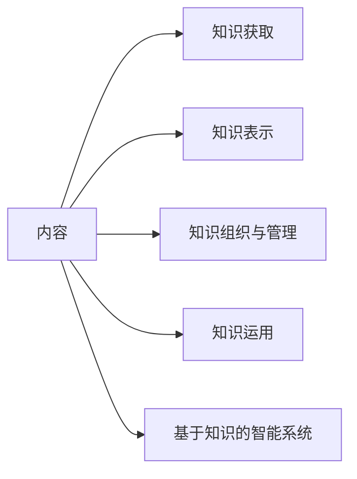

# 第1篇 概述与工具

## 什么是人工智能 

### 人工智能概念的一般描述 

- 人工智能是那些与人的思维相关的活动，诸如决策、问题求解和学习等的自动化（Bellman, 1978）；

- 人工智能是一种计算机能够思维，使机器具有智力的激动人心的新尝试（Haugeland, 1985）；

- 人工智能是研究如何让计算机做现阶段只有人才能做得好的事情（Rich Knight,1991）；
- 人工智能是那些使知觉、推理和行为成为可能的计算的研究（Winston, 1992）；
- 广义地讲，人工智能是关于人造物的智能行为，而智能行为包括知觉、推理、学习、交流和在复杂环境中的行为（Nilsson，1998）；
- Stuart Russell和Peter Norvig则把已有的一些人工智能定义分为4类：像人一样思考的系统、像人一样行动的系统、理性地思考的系统、理性地行动的系统（2003）；

> **弱人工智能和 强人工智能**
>
> 弱人工智能（weak AI）观点认为“不可能”制造出能“真正”地推理和解决问题的智能机器，这些机器只不过“看起来”像是智能的，但是并不真正拥有智能，也不会有自主意识。
>
> 强人工智（strong AI）能观点认为“有可能”制造出“真正”能推理和解决问题的智能机器，并且，这样的机器将被认为是具有知觉、有自我意识的。

### 图灵测试和中文屋子

#### 图灵测试

图灵测试（The Turing test）由艾伦·麦席森·图灵提出，指测试者与被测试者（一个人和一台机器）隔开的情况下，通过一些装置（如键盘）向被测试者随意提问。进行多次测试后，如果机器让平均每个参与者做出超过30%的误判，那么这台机器就通过了测试，并被认为具有人类智能。图灵测试一词来源于计算机科学和密码学的先驱艾伦·麦席森·图灵写于1950年的一篇论文《计算机器与智能》，其中30%是图灵对2000年时的机器思考能力的一个预测，我们已远远落后于这个预测。

#### 中文屋子

中文屋子naozhineng（Chinese room，the Chinese room argument）又称作华语房间，是由美国哲学家约翰·塞尔（John Searle）在1980年设计的一个思维试验以推翻强人工智能（机能主义）提出的过强主张：只要计算机拥有了适当的程序，理论上就可以说计算机拥有它的认知状态以及可以像人一样地进行理解活动。

“中文房间”最早由美国哲学家John Searle于20世纪80年代初提出。这个实验要求你想象一位只说英语的人身处一个房间之中，这间房间除了门上有一个小窗口以外，全部都是封闭的。他随身带着一本写有中文翻译程序的书。房间里还有足够的稿纸、铅笔和橱柜。写着中文的纸片通过小窗口被送入房间中。根据Searle，房间中的人可以使用他的书来翻译这些文字并用中文回复。虽然他完全不会中文，Searle认为通过这个过程，房间里的人可以让任何房间外的人以为他会说流利的中文。

### 脑智能和群智能

**脑智能**（Brain Intelligence, BI）就是脑（主要指人脑）的宏观心理层次的智能表现。

由群体行为所表现出的智能称为**群智能**（Swarm Intelligence, SI）。

脑智能是一种**个体智能**（Individual Intelligence, II）；群智能是一种**社会智能**（Social Intelligence, SI），或 者说**系统智能**（System Intelligence, SI）。

### 符号智能和计算智能

#### 符号智能

符号智能就是符号人工智能，它是模拟脑智能的人工智能，也就是所说的传统人工智能或**经典**人工智能。

符号智能以符号形式的知识和信息为基础，主要通过逻辑推理，运用知识进行问题求解。符号智能的主要内容包括知识获取（knowledge acquisition）、知识表示（knowledge representation）、知识组织与管理和知识运用等技术（这些构成了所谓的知识工程（Knowledge Engineering, KE））以及基于知识的智能系统等。

#### 计算智能

计算智能就是计算人工智能，它是模拟群智能的人工智能。计算智能以**数值数据**为基础，主要通过数值计算，运用算法进行问题求解。例如进化计算。

### 统计智能和交互智能

**统计智能**（Statistical Intelligence）

​      利用样例数据并采用统计、概率和其他数学方法而实现的人工智能称为统计智能。

**交互智能**（Interactional Intelligence）

​      通过交互方式而实现的人工智能称为交互智能。

## 为什么要研究人工智能

### 研究人工智能的意义

- 使当前的电脑更好用，更有用，以扩大和延伸人类智能；
- 信息化社会的迫切要求；
- 自动化发展的必然趋势；
- 有益于探索人类自身智能的奥秘。

### 人工智能的研究目标和策略

研究目标就是制造智能机器和智能系统，实现智能化社会。

v研究策略则是先部分地或某种程度地实现机器的智能，逐步扩展和不断延伸人的智能，逐步实现智能化。

## 人工智能的相关学科 

人工智能实际上是一门综合性的交叉学科和边缘学科。

## 人工智能的研究内容 

- **搜索与求解**：图（或空间）搜索与问题求解

- **知识与推理**：知识表示与机器推理

- **学习与发现**：机器学习与知识发现

- **发明与创造**：机器的自主发明与创造

- **感知与响应**：机器感知与响应

- **理解与交流**：机器的自然语言理解与交流

- **记忆与联想**：机器的记忆与联想机制

- **竞争与协作**：智能体（如智能机器人）之间的竞争与协作

- **系统与建造**：智能系统的设计和实现技术

- **应用与工程**：人工智能的应用和工程技术

这十个方面也就是人工智能的十个主题或者说十个分支领域，它们构成了**人工智能学科的总体架构**。

## 人工智能的研究途径与方法 

- 心理模拟，符号推演
- 生理模拟，神经计算
- 行为模拟，控制进化
- 群体模拟，仿生计算
- 博采广鉴，自然计算
- 着眼数据，统计建模

## 人工智能的应用

## 人工智能的分支领域与研究方向

## 人工智能学科发展概况