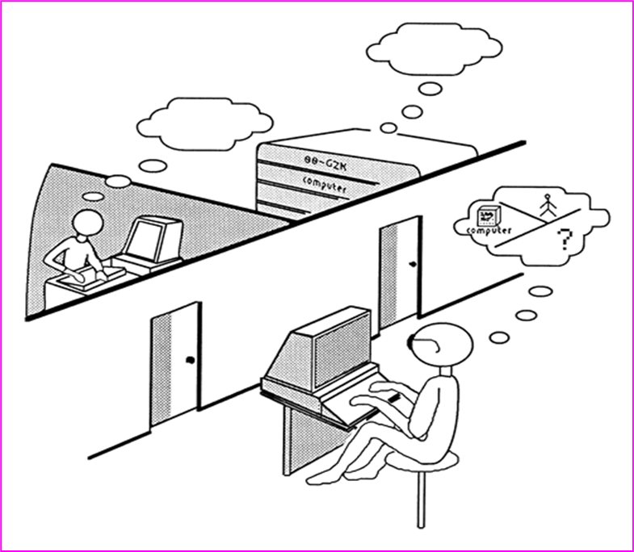
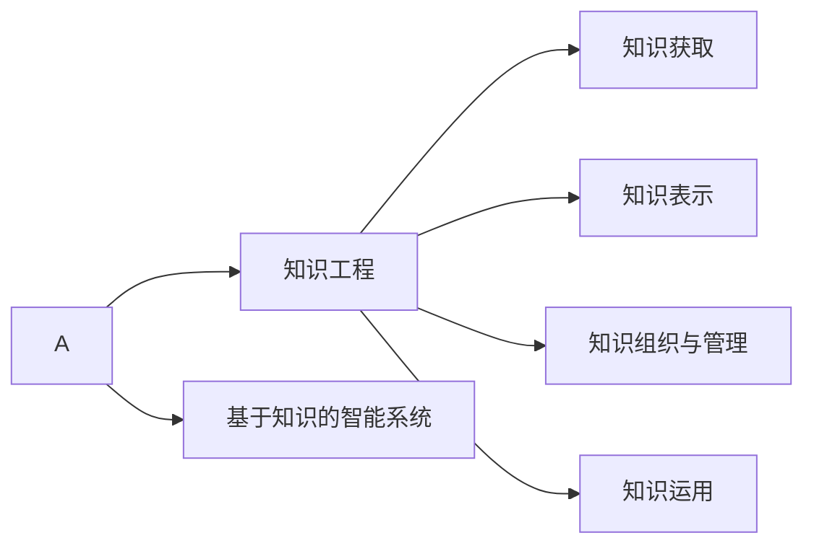

# 第1篇 概述与工具

## 什么是人工智能 

### 人工智能概念的一般描述 

- 人工智能是那些与人的思维相关的活动，诸如决策、问题求解和学习等的自动化（Bellman, 1978）；

- 人工智能是一种计算机能够思维，使机器具有智力的激动人心的新尝试（Haugeland, 1985）；

- 人工智能是研究如何让计算机做现阶段只有人才能做得好的事情（Rich Knight,1991）；
- 人工智能是那些使知觉、推理和行为成为可能的计算的研究（Winston, 1992）；
- 广义地讲，人工智能是关于人造物的智能行为，而智能行为包括知觉、推理、学习、交流和在复杂环境中的行为（Nilsson，1998）；
- Stuart Russell和Peter Norvig则把已有的一些人工智能定义分为4类：像人一样思考的系统、像人一样行动的系统、理性地思考的系统、理性地行动的系统（2003）；

> **弱人工智能和 强人工智能**
>
> 弱人工智能（weak AI）观点认为“不可能”制造出能“真正”地推理和解决问题的智能机器，这些机器只不过“看起来”像是智能的，但是并不真正拥有智能，也不会有自主意识。
>
> 强人工智（strong AI）能观点认为“有可能”制造出“真正”能推理和解决问题的智能机器，并且，这样的机器将被认为是具有知觉、有自我意识的。

### 图灵测试和中文屋子

#### 图灵测试

图灵测试（The Turing test）由艾伦·麦席森·图灵提出，指测试者与被测试者（一个人和一台机器）隔开的情况下，通过一些装置（如键盘）向被测试者随意提问。进行多次测试后，如果机器让平均每个参与者做出超过30%的误判，那么这台机器就通过了测试，并被认为具有人类智能。图灵测试一词来源于计算机科学和密码学的先驱艾伦·麦席森·图灵写于1950年的一篇论文《计算机器与智能》，其中30%是图灵对2000年时的机器思考能力的一个预测，我们已远远落后于这个预测。

#### 中文屋子

中文屋子naozhineng（Chinese room，the Chinese room argument）又称作华语房间，是由美国哲学家约翰·塞尔（John Searle）在1980年设计的一个思维试验以推翻强人工智能（机能主义）提出的过强主张：只要计算机拥有了适当的程序，理论上就可以说计算机拥有它的认知状态以及可以像人一样地进行理解活动。

“中文房间”最早由美国哲学家John Searle于20世纪80年代初提出。这个实验要求你想象一位只说英语的人身处一个房间之中，这间房间除了门上有一个小窗口以外，全部都是封闭的。他随身带着一本写有中文翻译程序的书。房间里还有足够的稿纸、铅笔和橱柜。写着中文的纸片通过小窗口被送入房间中。根据Searle，房间中的人可以使用他的书来翻译这些文字并用中文回复。虽然他完全不会中文，Searle认为通过这个过程，房间里的人可以让任何房间外的人以为他会说流利的中文。

### 脑智能和群智能

**脑智能**（Brain Intelligence, BI）就是脑（主要指人脑）的宏观心理层次的智能表现。

由群体行为所表现出的智能称为**群智能**（Swarm Intelligence, SI）。

脑智能是一种**个体智能**（Individual Intelligence, II）；群智能是一种**社会智能**（Social Intelligence, SI），或 者说**系统智能**（System Intelligence, SI）。

### 符号智能和计算智能

#### 符号智能

符号智能就是符号人工智能，它是模拟脑智能的人工智能，也就是所说的传统人工智能或**经典**人工智能。

符号智能以符号形式的知识和信息为基础，主要通过逻辑推理，运用知识进行问题求解。符号智能的主要内容包括知识获取（knowledge acquisition）、知识表示（knowledge representation）、知识组织与管理和知识运用等技术（这些构成了所谓的知识工程（Knowledge Engineering, KE））以及基于知识的智能系统等。

#### 计算智能

计算智能就是计算人工智能，它是模拟群智能的人工智能。计算智能以**数值数据**为基础，主要通过数值计算，运用算法进行问题求解。例如进化计算。

### 统计智能和交互智能

**统计智能**（Statistical Intelligence）

​      利用样例数据并采用统计、概率和其他数学方法而实现的人工智能称为统计智能。

**交互智能**（Interactional Intelligence）

​      通过交互方式而实现的人工智能称为交互智能。

## 为什么要研究人工智能

### 研究人工智能的意义

- 使当前的电脑更好用，更有用，以扩大和延伸人类智能；
- 信息化社会的迫切要求；
- 自动化发展的必然趋势；
- 有益于探索人类自身智能的奥秘。

### 人工智能的研究目标和策略

研究目标就是制造智能机器和智能系统，实现智能化社会。

v研究策略则是先部分地或某种程度地实现机器的智能，逐步扩展和不断延伸人的智能，逐步实现智能化。

## 人工智能的相关学科 

人工智能实际上是一门综合性的交叉学科和边缘学科。

## 人工智能的研究内容 

- **搜索与求解**：图（或空间）搜索与问题求解

- **知识与推理**：知识表示与机器推理

- **学习与发现**：机器学习与知识发现

- **发明与创造**：机器的自主发明与创造

- **感知与响应**：机器感知与响应

- **理解与交流**：机器的自然语言理解与交流

- **记忆与联想**：机器的记忆与联想机制

- **竞争与协作**：智能体（如智能机器人）之间的竞争与协作

- **系统与建造**：智能系统的设计和实现技术

- **应用与工程**：人工智能的应用和工程技术

这十个方面也就是人工智能的十个主题或者说十个分支领域，它们构成了**人工智能学科的总体架构**。

## 人工智能的研究途径与方法 

- 心理模拟，符号推演
- 生理模拟，神经计算
- 行为模拟，控制进化
- 群体模拟，仿生计算
- 博采广鉴，自然计算
- 着眼数据，统计建模

## 人工智能的应用

### 难题求解

这里的难题，主要指那些没有算法解，或虽有算法解但在现有机器上无法实施或无法完成的困难问题，包括智力性问题中的难题和现实中复杂的实际问题和工程问题。

### 自动规划、调度与配置

在难题求解中，规划、调度与配置问题是实用性、工程性最强的一类问题。规划一般指设计制定一个行动序列，例如机器人行动规划、交通路线规划。

### 机器博弈

机器博弈是人工智能最早的研究领域之一，而且经久不衰。

### 机器翻译与机器写作

近年来，神经网络机器学习的再度兴起，又给机器翻译带来了新的繁荣。据报道，在新闻稿的英-汉互译翻译方面，机器翻译现已达到甚至超过人类专家水平。

### 机器定理证明

机器定理证明也是人工智能的也是最早的研究领域之一。定理证明是最典型的逻辑推理问题之一，很多非数学领域的任务如医疗诊断、信息检索、规划制定和难题求解，都可以转化成一个定理证明问题。

机器定理证明的方法主要有四类：

- 自然演绎法
- 判定法
- 定理证明器
- 计算机辅助证明

### 自动程序设计

自动程序设计就是让计算机设计程序。具体来讲，就是只要给出关于某程序要求的非常高级的描述，计算机就会自动生成一个能完成这个要求目标的具体程序。

> ChatGPT是由人工智能研究实验室OpenAI在2022年11月30日发布的全新聊天机器人模型，一款人工智能技术驱动的自然语言处理工具。它能够通过学习和理解人类的语言来进行对话，还能根据聊天的上下文进行互动，真正像人类一样来聊天交流，甚至能完成撰写邮件、视频脚本、文案、翻译、代码等任务。同时也引起无数网友沉迷与ChatGPT聊天，成为大家讨论的火爆话题。

### 智能控制

智能控制就是把人工智能技术引入控制领域，建立智能控制系统。

### 智能管理

智能管理就是把人工智能技术引入管理领域，建立智能管理系统。智能管理系统是在管理信息系统、办公自动化系统等的功能集成和技术集成的基础上，应用专家系统、知识工程、模式识别、神经网络等方法和技术，进行智能化、集成化、协调化，而实现的新型管理系统。

### 智能决策

智能决策就是把人工智能技术引入决策过程，建立智能决策支持系统。智能决策支持系统由传统决策支持系统再加上相应的智能部件而构成。智能部件可以有多种模式，例如知识库系统模式。在这种情况下，决策支持系统就是由模型库、方法库、数据库、知识库组成的四库系统。

### 数据挖掘与知识发现

就是从数据中挖掘、发现有用的信息和知识。狭义讲，就是数据挖掘（Data Mining，DM）与数据库中的知识发现（Knowledge Discovery in Databases, KDD）。

## 人工智能的分支领域与研究方向

从研究内容来看，人工智能可分为搜索与求解、知识与推理、学习与发现等十大分支领域（构成了人工智能学科的总体架构）。这十大领域各自又有一些子领域和研究方向。

从研究途径和智能层次来看，人工智能可分为符号智能、计算智能、统计智能和交互智能等四大分支领域。

从所模拟的脑智能或脑功能来看，AI中有机器学习、机器感知、机器联想、机器推理、机器行为等分支领域。

## 人工智能学科发展概况

### 孕育与诞生

人工智能学科正式诞生于1956年在美国达特莫斯（Dartmouth）大学召开的一次学术研讨会。

### 符号主义先声夺人

1956年之后的几十年间，符号人工智能的研究取得了许多引人瞩目的成就。

1956年~1965年为**推理期**，主要研究符号推理和问题求解算法；

1965年~1990年代为**知识期**，主要研究专家系统和知识工程。

### 连接主义不畏坎坷

20 世纪 50 年代末到 60年代初，开始了人工智能意义下的神经网络系统的研究。但70年代神经网络的研究进入低谷。

80年代末又进入高潮。90年代末又再次降温。

2006年，基于深度神经网络的“深度学习”技术获得突破。到2012年后被学术界承认，引起了巨大轰动。深度学习再一次掀起了神经网络的研究热潮，也掀起了机器学习乃至人工智能的研究热潮。

### 计算智能异军突起

1962年进化程序设计或进化规划被提出，开创了从脑和神经系统以外的生命世界中寻找智慧机理之先河。1964年进化策略的搜索算法被提出。1967年遗传算法（被提出，1975年付诸了实际应用。至此，现在称为进化计算的研究方向基本形成。

1994年，关于神经网络、进化程序设计和模糊系统的三个IEEE国际会议联合举行了首届计算智能大会。标志着一个有别于符号智能的人工智能新领域──**计算智能**正式形成。

### 统计智能奉献默默

1960年后，计算机进入统计学研究。

20世纪60年代后期，为了克服模式识别问题中的“维数 灾难”， VC理论被提出。

20世纪60年代末70年代初 经验风险最小化（Empirical Risk Minimization, ERM）原则被提出，建立了模式识别问题的ERM理论。

1995年Cortes与Vapnik提出支持向量机（Support Vector Machine, SVM），这一统计学习新方法。

 20世纪70年代，统计方法被引入自然语言处理，出现了统计语言学，有力地推动了自然语言处理的进展。

### 智能主体一统江湖，Agent & Robot

20世纪80年代中期，Agent（智能体）的概念被引入人工智能领域，形成了基于Agent的人工智能新理念。Agent指的是一种具有智能的实体。它可以是智能软件、智能设备、智能机器人（Robot）或智能计算机系统等等。Agent是多种智能技术之集大成，人们试图用Agent技术统一和发展人工智能技术。

### 知识工程东山再起，机器学习领衔高歌

 2010年代后，得益于大数据和计算机的算力的不断提升，深度学习迅速占领了机器学习领域的制高点。在深度学习的带动下，强化学习也越来越受到人们的重视，而成为机器学习的另一个热点。

自2012年Google将“知识图谱”技术引入其搜索引擎后，进一步提高了搜索质量和效率。随后其他网站便纷纷效仿，从而引领和掀起了知识图谱的研究和应用热潮，使其成为人工智能的又一个热门领域，进而也使知识工程甚至符号智能也再度活跃起来。