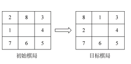
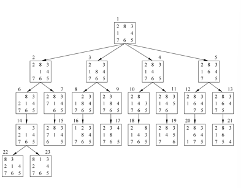
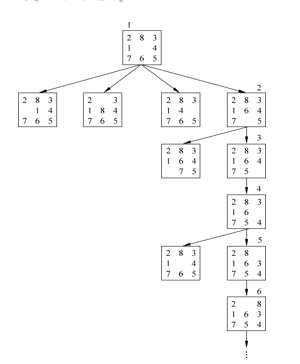
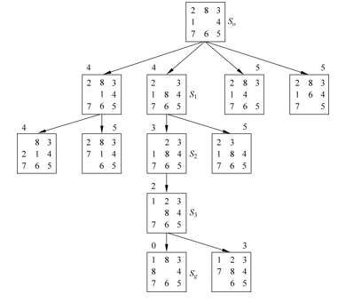
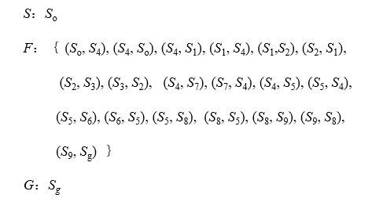
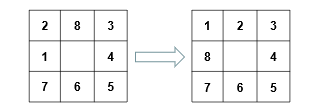
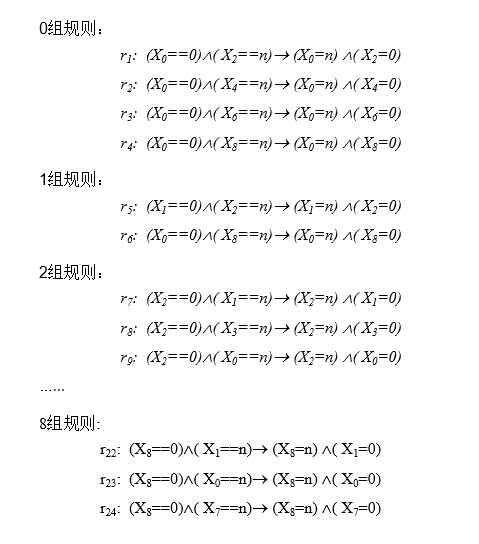
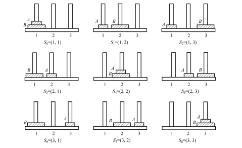
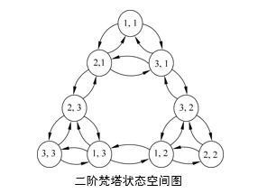
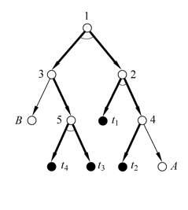

# 第3章 图搜索与问题求解

搜索就是寻找一条从初始问题到问题解的路径。

搜索是AI技术中问题求解的基本技术。

> **符号智能搜索**
>
> 也称为图搜索技术，将问题空间表示为**状态图（空间）**或**与或图**，运用领域知识，通过**符号推演**，顺序地在问题空间进行。
>
> **计算智能的搜索**
>
> 以数值数据为基础，通过数值计算，运用算法进行问题求解。以计算的方法，步进或随机地在问题的解空间进行。

问题求解式人工智能的核心问题之一。

早期搜索算法包括梯度下降（上升）算法，模拟退火算法。

后期仿生优化算法包括遗传算法，进化算法，蚁群算法，免疫算法，粒子群算法等。这些称为**智能算法**的研究方向。

## 搜索的概念

利用已有知识，按照问题的实际情况，不断寻找可利用知识，从而**构造一条代价最小的推理路线**，使问题得以解决的过程。

适用情况：

- 不良结构或非结构化问题。
- 难以获得求解所需的全部信息。
- 没有现成的算法可供求解使用。

#### 搜索方式

- **树式搜索** 形象地讲就是以“画树”的方式进行搜索。即从树根（初始节点）出发，一笔一笔地描出一棵树来。准确地讲，树式搜索就是在搜索过程中记录所经过的所有节点和边。所以，树式搜索所记录的轨迹始终是一棵“树”，这棵树也就是搜索过程中所产生的搜索树。

- **线式搜索** 形象地讲就是以“画线”的方式进行搜索。准确地讲，线式搜索在搜索过程中只记录那些当前认为是处在所找路径上的节点和边。所以，线式搜索所记录的轨迹始终是一条“线”（折线）。

#### 搜索策略

- **盲目搜索** 就是无“向导”的搜索。树式盲目搜索就是穷举式搜索，即从初始节点出发，沿连接边逐一考察各个节点（看是否为目标节点），或者反向进行；而线式盲目搜索，对于不回溯的就是随机碰撞式搜索，对于回溯的则也是穷举式的搜索。

- **启发式搜索** 利用“启发性信息”引导的搜索。所谓“启发性信息”就是与问题有关的有利于尽快找到问题解的信息或知识。启发式搜索又可分为许多不同的策略，如<u>全局择优</u>、<u>局部择优</u>（瞎子爬山法）、<u>最佳图搜索</u>等等。

-  按搜索范围的扩展顺序的不同，搜索又可分为广度优先和深度优先两种类型。  

## 状态图搜索

### 状态图

状态图(Statechart Diagram)是描述一个实体基于事件反应的动态行为，显示了该实体如何根据当前所处的状态对不同的事件做出反应。状态图由**结点**和**边**组成。

例如迷宫中入口、出口和格子作为节点，通道作为边。在八数码问题中，初始、目标器棋局作为节点，移动规则的一次执行作为边。

Ø许多实际问题和智力问题均可归结为在某一状态图中**寻找目标或路径的问题**。**搜索**是在状态图中寻找目标或路径的**基本方法。**

### 状态图搜索的基本思想

- 将问题的初始状态作为当前节点进行扩展，生成一组子节点。
- 检查问题的目标状态（节点）是否出现在这些节点中。
  - 若出现，则找到问题的解。
  - 若未出现，则从已生成的子节点中选择一个节点作为当前节点进行扩展。
- 重复上述过程，直到目标状态出现在子节点中，或无可操作节点为止。

> 节点的扩展是指对该节点进行**可用的操作**，生成该节点的一组子节点。

### 状态图搜索

#### 搜索算法

状态空间搜索算法的数据结构和符号约定：

- OPEN表：记录未扩展（待考察的节点），存放刚（新生成）的节点。
- CLOSED表：记录已扩展（考察过）的节点，存放已扩展的节点。
- S：问题的初始状态（起始节点）。
- G：搜索过程所得的搜索图。
- M：当前扩展节点新生成的、且不是自己先辈的**子节点集合。**

**树式搜索算法**

1. 将初始节点S放入OPEN表，并建立当前仅包含S的图G；

2. 若OPEN表为空，则搜索失败退出；否则：

3. 将OPEN表的**第一个节点**放入CLOSED表，并冠以顺序编号n。

4. 若节点n为目标节点，则搜索成功退出。（解为沿着指针从n到初始节点S的路径）否则：

5. 扩展节点n生成一组子节点。把这些子节点中不是节点n先辈的子节点记入集合M，并把这些子节点作为节点n的子节点加入G中。

6. . 针对M中子节点的不同情况，分别处理如下：

   - 对没有在G中出现过的子节点，设置一个指向其父节点(即节点n)的指针，并把它放入OPEN表。（新生成的） 

   - 对原来已在G中出现过，但还没有被扩展的子节点，确定是否需要修改它指向父节点(n)的指针。(已生成但未扩展的)

   - 对原来已在G中出现过，并已扩展的子节点，确定是否需要修改其后继节点指向父节点的指针。(已生成也扩展过的)

7. 按某种策略，对OPEN表中的节点进行**排序**。

8. 转到2步。

### 状态图的搜索策略

- 盲目搜索
  - 广度优先搜索
  - 深度优先搜索
  - 有界深度优先搜索
- 启发式搜索
  - 启发信息和估价函数
  - $A$算法和$A^*$算法

### 盲目搜索

#### 广度优先搜索

**基本思想**

- 从初始节点S开始逐层向下扩展。

- 在第n层节点还未全部搜索完之前，不进入第n+1层节点的搜索。

- OPEN（未扩展节点）表中的节点，按进入的先后排序，先进的节点排在前，后进的节点排在后（模拟队列）。

**算法流程**

1. 将初始节点S放入OPEN表中；

2. 若OPEN表为空则无解退出，否则继续。

3. 把第一个节点（节点n）从OPEN表移出，并把它放入CLOSED的扩展节点表中。

4. 扩展节点n。若无后继节点，则转第(2)步。
5. 扩展n，并把其所有后继节点放到OPEN表的末端，**并提供返回节点n的指针。**

6. 如果n的任一个后继节点是个目标节点，则找到一个解答，成功退出；否则转第2步。　

例八数码问题：

> 对任意一个可扩展的节点，总按固定的操作符顺序对其进行扩展（空格左移、上移、右移、下移）。
>
> 对任一节点进行扩展时，若某个子节点（状态）前面已出现过（先辈节点），则立即将其放弃，不再重复画出（不送入OPEN表）。

广度优先搜索的本质为以初始节点为根节点，在状态空间图中按照广度优先的原则，生成一颗搜索树。

优点：只要有解，总可以得到解，且得到路径最短的解。

缺点：盲目性较大；当目标节点距初始节点较远时，会产生许多无用节点，搜索效率低。　

#### 深度优先搜索

**基本思想**

- 从初始节点S开始，在其子节点中选择一个最新生成的节点进行考察。
- 若该子节点不是目标节点且可扩展，则扩展该子节点。然后在此子节点的子节点中，选择一个最新生成的节点进行考察。
- 依次向下搜索，直到某子节点既非目标节点，又不能继续扩展时，才选择其兄弟节点进行考察（模拟栈）。　

**算法流程**

1. 将起始节点S放到OPEN表中。若S为目标节点，则得到解；否则，转向(2)。
2. 若OPEN为一空表，则问题无解，失败退出。
3. 否则，把第一个节点（节点n）从OPEN表移到CLOSED表。
4. 若节点n的深度等于最大深度，则转向2。
5. 否则，扩展节点n，把其全部后裔放入OPEN表的前头。若没有后裔，则转向(2)。 
6. 若后继节点中有任一个为目标节点，则求得一个解，成功退出；否则，转向2。　

例八数码问题：

搜索一旦进入某分支，将沿该分支一直向下搜索。若目标节点恰好在此分支上，则可较快地得到解。

最差情况：若目标节点不在此分支上，而该分支又是一个无穷分支，则就不可能得到解。因此，深度优先搜索是不完备的，即使有解也不一定能求得解。 

**深度优先与广度优先的区别**

- 广度优先搜索：将节点n的子节点放入到OPEN表的尾部（队结构）。

- 深度优先搜索：把节点n的子节点放入到OPEN表的首部（栈结构）。

#### 有界深度优先搜索

为防止搜索沿无益的路径扩展下去，而给出一个节点扩展的最大深度，即深度界限。

对深度优先搜索引入搜索**深度界限**，设为dm。当搜索达到深度界限，而仍未出现目标节点时，则换其他分支搜索。

> 恰当地给出dm的值是比较困难的。否则即使能求出解，其也不一定是最优解。

#### 总结

以初始节点为根节点，按照既（预）定的策略对状态空间图进行遍历，并希望能够尽早发现目标节点。 遍历策略是既定的，因此称为盲目搜索。ü产生的无用节点较多，效率低，易产生**组合爆炸**。

### 启发式搜索

启发式搜索是具体问题领域的信息可简化搜索。假设初始状态和目标状态都是完全确定的，从初始状态到目标状态有一个给定空间。这种搜索需要某些有关具体问题领域特性的信息，把这类特性信息称为**启发信息**。利用启发信息的搜索方法叫做启发式搜索方法。

启发性信息与具体问题的求解过程有关，搜索朝着最有希望前进的方向控制信息。启发信息的启发能力越强，扩展无用的节点就越少，但有可能找不到最有解。

启发性信息分为扩展结点选择，生成结点选择，删除结点选择。

为评估结点重要性，需要借助估价函数。一般形式为：$f(x)=g(x)+h(x)$

其中，$g(x)$为从初始结点$S_0$到结点$x$的代价；$h(x)$为启发函数，从结点$x$到目标结点$S_g$的最优路径的代价估计。

启发式搜索算法分为全局择优搜索和局部择优搜索。

全局择优：寻找OPEN表中**全部节点**里代价最小的节点进行扩展。

局部择优：仅寻找**当前扩展节点的子节点**中代价最小的节点进行扩展。 

#### $A$算法

图搜索算法中，如果搜索的每一步都利用估价函数$f(n)=g(n)+h(n)$对OPEN表中的节点排序，则该搜索算法为$A$算法。 估价函数带有问题自身的启发性信息，故$A$算法称为启发式搜索算法。

#### $A^*$算法

对$A$算法的估价函数$f(n)=g(n)+h(n)$加上某些限制后得到的一种启发式搜索算法。 

假设$f^*(n)$是从初始节点S出发经过节点n达到目标节点的最小代价，估价函数$f(n)$是对$f^*(n)$的估计值。且$f^*(n)=g^*(n)+h^*(n)$

$A^*$算法对$A$算法（全局择优的启发式搜索）中的$g(n)$和$h(n)$分别提出如下限制：

- $g(n)$是对最小代价$g^*(n)$的估计，且$g(n)>0$；

- $h(n)$是最小代价$h^*(n)$的下界，即对任意节点$n$均有$h(n)\leq h^*(n)$。

即：满足上述两条限制的$A$算法称为$A^*$算法。

## 状态图搜索问题求解

**状态**

问题在任一确定时刻的状况,表征了问题特征和结构等。在状态图中表示为**节点**，常用一组数据表示。

**状态转换规则**

使问题状态改变的某种操作、规则、行为、变换、函数、过程等。即操作，问题状态只能经定义在其上的操作而改变。在状态图表示为边。

问题的状态图是一个三元组：$(S,F,G)$

- S：问题的**初始状态**集合
- F：问题的**状态转换规则**集合
- G：问题的**目标状态**集合

问题的全部状态及其关系构成一个空间，称为**状态空间**。

迷宫问题的状态图表示：

八数码难题的状态图表示：

棋局用向量$A$表示：

$A=(X_0,X_1,X_2,X_3,X_4,X_5,X_6,X_7,X_8)$

则初始状态集合和目标状态集合分别为：

$S_0=(0,2,8,3,4,5,6,7,1)$

$S_g=(0,1,2,3,4,5,6,7,8)$

则八数码问题状态图可表示为：

$$(\{S_0\},\{r_1,r_2,\dots,r_{24}\},\{S_g\})$$

二阶汉诺塔问题：

有三根杆，1号杆上有A、B两个盘，A小于B，A位于B上。

用二元组$(S_A,S_B)$表示问题的状态：

$S_A$表示盘A所在的杆号，$S_B$表示盘*B*所在的杆号。全部可能的状态有9种，可表示为：

 

状态转换规则就是盘子的搬动规则，用$A(i,j)$及$B(i,j)$表示。

共有12个操作，分别是：

$A(1,2) \quad A(1,3) \quad A(2,1) \quad A(2,3) \quad A(3,1) \quad A(3,2)$

$B(1,2) \quad B(1,3) \quad B(2,1) \quad B(2,3) \quad B(3,1) \quad B(3,2)$

问题初始状态为$(1, 1)$，问题目标为$(3,3)$，则二阶汉诺塔问题的状态图为：

$(\{(1,1)\},\{A(1,2),\dots,B(3,2)\},\{(3,3)\})$

## 与或图搜索

### 与或图 

弧线所连边为“与”关系，不带弧线的边为“或”关系既有与关系又有或关系的图，称为与或图。

下图为特殊的与或图，称为与或树。

从与或关系看，上节状态图实际是或图。与或图是状态图的推广，状态图是与或图的特例。

初始节点—待解原问题，目标节点—原问题分解或变换后可直接求解的简单问题。

问题求解：在与或图中寻找一个从初始节点到目标节点的路径问题。

直接可解的简单问题：本原问题——终止节点；

无子节点的节点——端节点，终止节点一定是端节点，端节点不一定为终止节点。

> 终止节点为可解的叶节点，端节点不一定为可解的叶节点。

### 可解性判别

可解节点需满足下列条件之一：

- 终止节点是可解节点。
- 一个与节点可解，当且仅当其子节点全都可解。
- 一个或节点可解，只要其子节点至少有一个可解。

不可解节点需满足下列条件之一：

- 非终止节点的端节点是不可解节点。

- 一个与节点不可解，只要其子节点至少有一个不可解。

- 一个或节点不可解，当且仅当其子节点全都不可解。 

### 与或图的树式搜索算法

1. 把初始结点$Q_0$放入OPEN表。

2. 移出*OPEN*表的第一个节点*N*放入*CLOSED*表，并冠以序号*n*

3. 若节点N可扩展, 则：

   ①扩展N，将其子节点配上指向父节点的指针后放入OPEN表。

   ②考察子节点中是否有终止节点：

   - 若有, 则标记为可解节点, 并将其也放入CLOSED表。

   - 然后，由其反向推断其先辈节点的可解性, 并对其中的可解节点进行标记。

   - 若**初始节点**也被标记为可解节点, 则搜索成功结束。

   ③删去OPEN表中那些具有可解先辈的节点(因为其先辈节点已经可解, 故已无再考察该节点的必要), 转步2。 

4. 若N不可扩展，则：

    ①标记*N*为不可解节点， 然后反向推断其先辈节点的可解性，并对其中的不可解节点进行标记。如果初始节点$S_0$也被标记为不可解节点, 则搜索失败, 退出。

    ②删去OPEN表中那些具有不可解先辈的节点(因为其先辈节点已不可解,故已无再考察这些节点的必要), 转步2。

例：与或树如下所示，其中1号节点为初始节点，*t*1、*t*2、*t*3、*t*4均为终止节点，A和B是不可解节点。 采用广度优先搜索策略，搜索过程如下： 

1. 扩展1号节点，得到2、3号节点，依次放入OPEN表中，由于均为非终止节点，所以接着扩展2号节点，此时OPEN表中只有3号结点。
2. 扩展2号结点，得4号节点和$t_1$节点，此时OPNE表中依次有3、4和$t_1$号节点。由于$t_1$为终止节点，故将其标记为可解节点，并将其放入CLOSED表中。再判断其父辈节点2的可解性。2为与节点，故仅当$t_1$可解还不能确定2是否可解。故继续搜索。
3. 扩展节点3，得节点5和节点B。两者均非终止节点，所以继续扩展4号节点。
4. 扩展节点4后得节点*A*和$t_2$。$t_2$是终止节点，标记为可解节点并放入CLOSED表。故依次推得其先辈节点4、2均为可解节点。因为节点1的左分支结果未知，故节点1不能确定。从OPEN表中**删去**节点*A**（*因其父节点4已经可解）。
5. 扩展节点5得$t_3$和$t_4$。由于$t_3$和$t_4$都为终止节点（放入CLOSED表)，故依次推得节点5、3、1均为可解节点。搜索成功，结束。
6. 由CLOSED表便得到由节点1、2、3、4、5和$t_1$、$t_2$、 *t*3、$t_4$构成的解树，由粗线所示。 

## 与或图搜索问题求解

## 博弈搜索