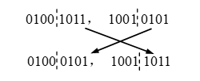
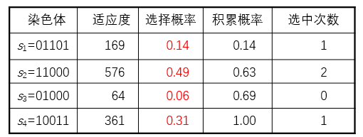
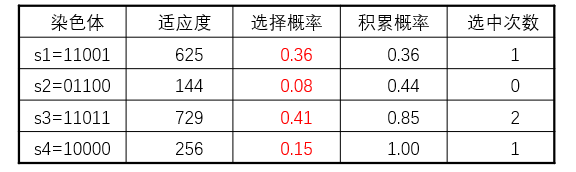
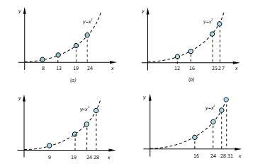

# 第4章 基于遗传算法的随机优化搜索

## 基本概念

**染色体及其编码**

以染色体(chromosome)**代表个体对象**，通常用**字符串**表示。

基因：染色体（字符串）中的一个个字符。

**适应度与适应度函数**

适应度(fitness)：求解问题中对象（即染色体）的一种表征**优劣的测度**。

适应度函数(fitness function)：问题中的全体对象与其适应度之间的一个**对应关系**。即**对象集合**到**适应度集合**的一个**映射**。

**种群**

模拟生物种群，而由若干个体对象（染色体）组成的群体。ü通常为整个论域空间的一个很小的子集。遗传算法就是通过在种群上实施相应的遗传操作，使其不断更新换代（迭代），以实现**对整个论域空间的搜索。**

**遗传操作**

有三种关于染色体的运算，即遗传操作或遗传算子(genetic operator)：

- 选择-复制
- 交叉
- 变异

### 选择复制

模拟生物界优胜劣汰的自然选择法则的一种染色体运算。

选择原则：

选择种群中**适应度较高**的个体(染色体)进行复制，以生成下一代种群。

规模为$N$的种群$S$，按每个染色体$x_i\in S$的选择概率$P(x_i)$，分$N$次从$S$中随机选定N个染色体，并进行复制。$P(x_i)$的计算为：

$$P(x_i)=\frac{f(x_i)}{\sum_{j=1}^{N}f(x_j)}$$

可用**赌轮法**实现上述按概率选择的方法。

赌轮选择法可模拟为：

  ① 在[0,1]区间内产生一个均匀分布的伪随机数*r*；

  ② 若$r≤q_1$，则染色体$x_1$被选中；

  ③ 若$q_{k-1}<r≤q_k (2≤k≤N)$，则染色体$x_k$被选中。

其中$q_i$为染色体$x_i (i=1, 2, …, n)$的**积累概率**，其计算公式为：

$q_i=\sum_{j=1}^i P(x_j)$

一个染色体$x_i$被选中的次数，可使用期望值$e(x_i)$确定。

$e(x_i)=P(x_i)\times N\\=\frac{f(x_i)}{\sum_{j=1}^{N}f(x_j)}\times N=\frac{f(x_i)}{\overline{f}}$

其中，$\overline{f}$为种群$S$中全体染色体的平均适应度。

### 交叉

交叉(crossover)：也称交换(交配或杂交)，即互换两个染色体（个体）某些位上的基因。如：

### 变异

变异(Mutation)：也称突变，即改变染色体某个(些)位上的基因。

## 基本遗传算法

遗传算法思想：

对种群中的染色体反复做3种遗传操作。

使其朝着**适应度增高的方向**不断更新换代（优化）。

直至出现了**适应度满足目标条件**的染色体为止。

## 遗传算法应用举例

利用遗传算法，求区间$[0,31]$上二次函数$y=x^2$的最大值。

> 区间中的点*x*就是个体，函数值*f*(*x*)可作为*x*的适应度，区间［0, 31］就是一个(解)空间 。

解：

(1) 定义适应度函数，编码染色体： 

取适应度函数：$f(x)=x^2$

5位二进制数可表示[0,31]全部整数，故使用5位二进制编码染色体。

(2) 设定种群规模，产生初始种群：

将初始规模设定为N=4；

取下列个体组成初始种群$S_1$：

$s_1=01101(13)\qquad s_2=11000(24)$

$s_3=01000(08)\qquad s_4=10011(19)$

(3) 计算各代种群中染色体的适应度，对其进行遗传操作，直到适应度最高的个体出现。

各个体的适应度

$            f (s_1) = f(13) = 13^2 = 169\quad f (s_2) = f(24) = 24^2 = 576$

​         $f(s_3)=f(8)=8^2=64\quad f(s_4)=f(19)=19^2=361$

各个体的选择概率：

$P(s_1) = P(13) = 0.14\quad   P(s_2) = P(24) = 0.49$ 

​           $P(s_3) = P(8) = 0.06\quad P(s_4) = P(19) = 0.31$

按赌轮法，s1, s2, s3, s4被选中的次数依次为：1, 2, 0, 1。

选择-复制，得到群体：

​           s1’=11000（24）   s2’=01101（13）

​           s3’=11000（24）   s4’=10011（19）

交叉：设交叉率pc=100%，即S1中所有染色体（**部体基因）**都参加交叉运算。

分别将*s*1*’*与*s*2*’**、**s*3*’*与*s*4*’*配对，并交换后两位基因，得到新个体：

   s1’’=11001（25）      s2’’=01100（12）

  s3’’=11011（27）      s4’’=10000（16）

变异：设变异率pm=0.001，则S1中共有5*4*0.001=0.02位基因可变异。0.02<<1，所以本轮无变异，得到第二代种群*S*2：

​              *s*1=11001（25）       *s*2=01100（12）

​                *s*3=11011（27）       *s*4=10000（16）

遗传算法终止条件通常有以下几种：

- 达到最大的进化代数；

- 所求的解达到可接受的范围；

- 连续几代最佳解无变化或变化非常微小；

- 达到最大的运算时间。

## 遗传算法的特点与优势

### 遗传算法与图搜索的区别

- 搜索空间

  - 遗传算法通常直接在**解空间搜索。**
  - 图搜索通常在**问题空间搜索**，若搜索成功最后才找到解。

- 搜索起始点

  - 遗传算法的搜索随机始于搜索空间的一个点集（随机搜索算法）。
  - 图搜索固定始于搜索空间的初始节点或终止节点。

- 解的性质

  - 遗传算法是**优化搜索算法**，总是在寻找优解（最优解或次优解）。
  - 图搜索通常是设法**尽快找到解**（不一定是最优或次优解）。

- 搜索过程

  - 遗传算法的搜索是从空间一个**点集**（种群）到另一个**点集**（种群）。

  - 图搜索的搜索是从空间的一个**点**到另一个**点**。

  - 遗传算法实际是并行搜索，**适合大规模并行计算。**

  - 遗传算法是**种群到种群**的搜索，有能力**跳出局部最优解。**

### 遗传算法优势

- 遗传算法的**适应性强**，除需知**适应度函数外**，几乎不需要其他的先验知识。

- 遗传算法**长于全局搜索**，不受搜索空间的限制性假设的约束。

- 不要求连续性

- 能以很大的概率从离散的、多极值的、含有噪声的高维问题中找到全局最优解。