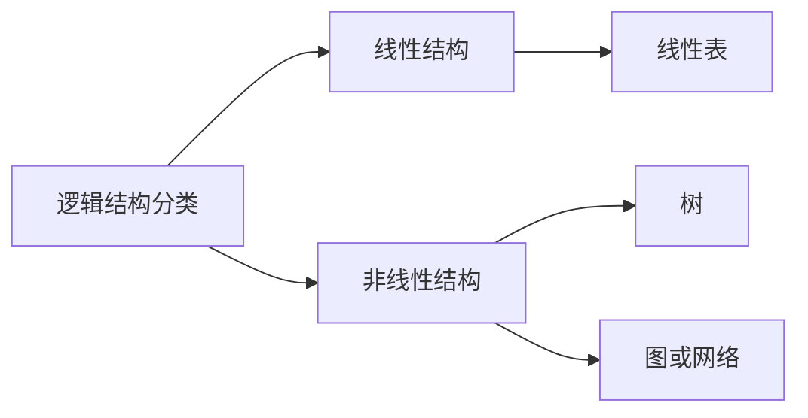
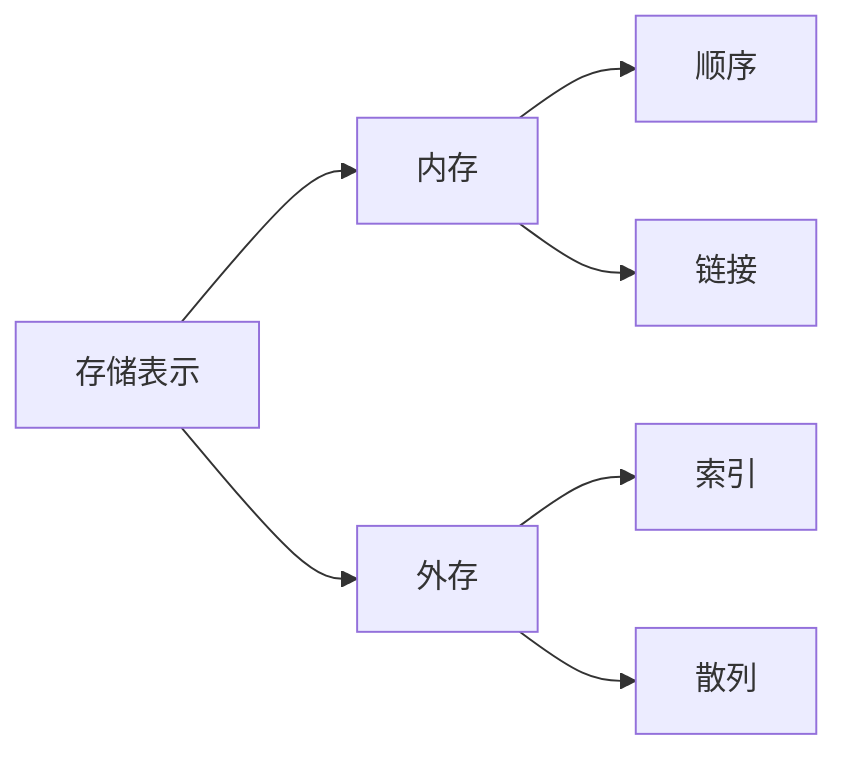

# 第1章 数据结构概念

## 什么是数据结构

数据是**信息**的载体，是描述客观事物的数、字符、以及所有能输入到计算机中，被计算机程序识别和处理的符号的集合。

数据的分类：

- 数值性数据

- 非数值性数据

数据元素是数据的基本单位。在计算机程序中常作为一个整体进行考虑和处理。

数据结构：

由某一数据元素的集合以及该集合中所有数据元素之间的关系组成。记为：

​      $Data\_Structure = {D, R}$

   其中，$D$ 是某一数据元素的集合，$R$ 是该集合中所有数据元素之间的**关系**的有限集合。

数据结构是数据的组织形式，包括：

- 数据元素间的逻辑关系，即数据的**逻辑结构**；

- 数据元素及其关系在计算机存储内的表示，即数据的**存储表示**；

- 数据的运算，即对数据元素施加的**操作**；

### 逻辑结构



### 存储结构




## 抽象数据类型及面向对象概念

### 抽象数据类型

抽象数据类型是由用户定义，用以表示应用问题的数据模型。

特点是：信息隐蔽和数据封装，使用与实现相分离。

抽象数据类型可用（$D$, $S$, $P$）三元组表示，其中，$D$ 是数据元素的集合（简称数据对象），$S$ 是 $D$上的**关系**集合，$P$ 是对 $D$ 的**基本操作**集合。 

### 面向对象的概念

面向对象 = 对象＋类＋继承＋通信

## 算法定义

### 定义

一个**有穷的指令集**，这些指令为解决某一特定任务规定了一个运算序列。

### 特性

- **输入** 有0个或多个输入
- **输出** 有一个或多个输出(处理结果)
- **确定性** 每步定义都是确切无歧义的
- **有穷性** 算法应在执行有穷步后结束
- **有效性** 每一条运算应足够基本

### 算法设计

> **自顶向下，逐步求精**  

## 模板

适合多种数据类型的类定义或算法，在特定环境下通过简单地代换，变成针对具体某种数据类型的类定义或算法。

## 算法简单性能分析与度量

### 算法的性能标准

- **正确性** (Correctness )  算法应满足具体问题的需求。

- **可读性**(Readability)  算法应该容易阅读。以有利于阅读者对程序的理解。

- **效率** 效率指的是算法执行的时间和空间利用率。通常这两者与问题的规模有关。

- **健壮性** (Robustness)   算法应具有容错处理的功能。当输入非法数据时，算法应对其作出反应，而不应产生莫名其妙的输出结果。

### 算法的后期测试

对一个算法要作出全面的分析可分成两个阶段进行，即事前分析和事后测试。

事后测试则要求在算法执行后通过算法执行的时间和实际占用空间的统计资料来分析。

事后分析要求在算法中的某些部位插装时间函数 `time()`，测定算法完成某一功能所花费时间。

```c++
double start, stop;
time(&start);
int k = seqSearch(a, n, x);
time(&stop);
double runTime = stop - start;
```

> 事实上，算法运行时间要受输入规模、利用编译程序生成的目标代码的质量、计算机程序指令系统的品质和速度等制约。

### 算法的事前估计

算法的事前估计主要包括时间复杂性和空间复杂性的分析：

问题的规模：如：矩阵的阶数、图的结点个数、被分类序列的正整数个数等。

时间复杂性：算法所需时间和问题规模的函数，记为 $T(n)$。当 $n\rightarrow\infty$ 时的时间复杂性，称为渐进时间复杂性。

空间复杂性：算法所需空间和问题规模的函数。记为 $S(n)$。当 $n\rightarrow\infty$时的时间复杂性，称为渐进空间复杂性。

#### 空间复杂度度量

**存储的固定部分**

程序指令代码的空间，常数、简单变量、定长成分(如数组元素、结构成分、对象的数据成员等)变量所占空间。

**存储的可变部分**

尺寸与**实例特性**有关的成分变量所占空间、引用变量所占空间、<u>递归栈</u>所用空间、通过`new`和`delete`命令动态使用空间。

#### 时间复杂度度量

**编译时间**

**运行时间**

程序步：语法上或语义上有意义的一段指令序列，执行时间与问题规模无关。

> 声明语句：程序步数为0;
>
> 表达式：程序步数为1

确定程序步的方法：

- 插入计数全局变量
- 建表，列出哥哥语句的程序步

```C++
// 在求累加和程序中加入 count 语句
float sum (float a[ ], int n) 
{
    float s = 0.0;
    count++;	     // count 统计执行语句条数
    for (int i = 0; i < n; i++) {
        count += 2;   //针对 for 语句
        s += a[i];
        count++;       //	针对赋值语句
    }	
    count += 2;	    //针对 for 的最后一次
    count++;	    //针对 return 语句
    return s;
}       
```

##### 时间复杂度的渐进表示法

算法中所有语句的频度之和是矩阵阶数$n$的函数

$$T(n)=3n^3+5n^2+4n+2$$

一般地，称$n$ 是问题的规模。则时间复杂度 $T(n)$ 是问题规模 $n$ 的函数。

当$n$趋于无穷大时，把时间复杂度的数量级（阶）称为算法的渐进时间复杂度：$T(n)=O(n^3)$（大$O$表示法）

加法规则  针对并列程序段：

$$T(m,n)=T_1(n)+T_2(m)=O(max(f(n),g(m)))$$

> 各种函数的增长趋势：
>
> $c<log_2n<n<nlog_2n<n^2<n^3<2^n<3^n<n!$
