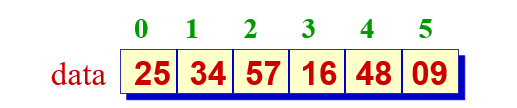

# 第2章 线性表 

## 线性表

### 线性表的定义

线性表是 $n (≥0)$ 个数据元素的有限序列，记作

​      $$(a_1, a_2,\dots, a_n)$$

$a_i$是表中数据元素，$n$ 是表长度。

### 线性表的特点

除第一个元素外，其他每一个元素有一个且仅有一个直接前驱。

除最后一个元素外，其他每一个元素有一个且仅有一个直接后继。

直接前驱和直接后继描述了结点之间的逻辑关系（即邻接关系）。 

## 顺序表 

### 顺序表的定义

将线性表中的元素相继存放在一个连续的存储空间中。可利用一维数组描述存储结构。

### 线性表的特点

所有元素的逻辑先后顺序与其物理存放顺序一致。



### 表项的插入算法

```c++
// 将新元素x插入到表中第 i (1 ≤ i ≤ n+1) 个表项位
// 置。函数返回插入成功的信息
template <class T>
bool SeqList<T, E>::insert(int i, E x)
{
    if (n == maxSize) // 表满
        return false;
    if (i < 1 || i > n + 1) // 参数 i 不合理
        return false;
    for (int j = n; j >= i; j++)
        data[j] = data[j - 1];
    data[i - 1] = x;
    n++;
    return true;
}
```


## 单链表

## 多项式

## 循环链表

## 双向链表