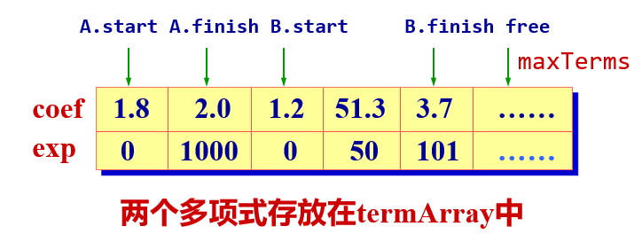

# 第2章 线性表 

## 线性表

### 线性表的定义

线性表是 $n (≥0)$ 个数据元素的有限序列，记作

​      $$(a_1, a_2,\dots, a_n)$$

$a_i$是表中数据元素，$n$ 是表长度。

### 线性表的特点

除第一个元素外，其他每一个元素有一个且仅有一个直接前驱。

除最后一个元素外，其他每一个元素有一个且仅有一个直接后继。

直接前驱和直接后继描述了结点之间的逻辑关系（即邻接关系）。 

## 顺序表 

### 顺序表的定义

将线性表中的元素相继存放在一个连续的存储空间中。可利用一维数组描述存储结构。

### 线性表的特点

所有元素的逻辑先后顺序与其物理存放顺序一致。


### 表项的插入


```c++
// 将新元素x插入到表中第 i (1 ≤ i ≤ n+1) 个表项位
// 置。函数返回插入成功的信息
bool SeqList::insert(int i, int x)
{
    if (n == maxSize) // 表满
        return false;
    if (i < 1 || i > n + 1) // 参数 i 不合理
        return false;
    for (int j = n; j >= i; j++)
        data[j] = data[j - 1]; // //依次后移
    data[i - 1] = x;
    n++;
    return true;
}
```

### 表项的删除


```c++
// 从表中删除第 i (1≤i≤n) 个表项，通过引用型参
// 数 x 返回被删元素。函数返回删除成功信息
template <class T>
bool SeqList::remove(int i, int& x)
{
    if (n == 0)
        return false;
    if (i < 1 || i > n)
        return false;
    x = data[i - 1];
    for (int j = i; j <= n; j++) // 依次前移，填补
        data[j - 1] = data[j];
    n--;
    return true;
}
```

## 单链表

### 单链表特点

- 每个元素(表项)由结点(Node)构成。


-  线性结构

  

- 结点之间可以连续，可以不连续存储

- 结点的逻辑顺序与物理顺序可以不一致

- 表可扩充

### 无表头结点的单链表

#### 表项的插入

- 在链表最前端插入

  

- 在链表中间插入

  

- 在链表末尾插入

  

```c++
// 将新元素 x 插入到第 i 个结点之后。i 从1开始，
// i = 0 表示插入到首元结点之前。
bool List:insert(int i, int x) 
{
    if (first == nullptr || i == 0) {
        LinkNode* newNode = new LinkNode(x);
        newNode->next = first; // 头插
        first = newNode; // 当前为头结点
    } else {
        LinkNode* current = first;
        int k = 1;
        while (k < i && current != nullptr) { // 寻找 i 结点
            current = current->next;
            k++;
        }
        if (current == nullptr) { // 链短
            cerr << "无效插入位置" << endl;
            return false;
        } else { 
            LinkNode* newNode = new LinkNode(x);
            newNode->next = current->next;
            current->next = newNode;
        }
        return true;        
    }
}
```

#### 表项的删除


```c++
// 将链表中的第 i 个元素删去, i 从1开始。
bool List::remove(int i, int& x)
{
    LinkNode* del;
    if (i <= 1) {
        del = first;
        first = first->next;
    } else {
        LinkNode* current = first;
        int k = 1;
        while (k < i - 1&& current != nullptr) {
            current = current->next;
            k++;
        }
        if (current == nullptr || current->next == nullptr) {
            cerr << "无效删除位置" << endl;
            return false;
        }
        del = current->next;
        current->next = del->next;
    }
    x = del->data;
    delete del;
    return true;
}
```

### 带表头结点的单链表

表头结点位于表的最前端，本身不带数据，仅标志表头。

设置表头结点的目的是统一空表与非空表的操作，简化链表操作的实现。


#### 插入算法改进

```cpp
//将新元素 x 插入在链表中第 i 个结点之后。
bool List::insert(int i, int x)
{
    LinkNode* current = first;
    int k = 0; // 差异性
    while (current != nullptr && i < k) {
    	current = current->next;
        k++;
    }
    if (current == nullptr) 
        return false;
    LinkNode* newNode = new LinkNode(x);
    newNode->next = current->next;
    current->next = newNode;
    return true;
}
```

#### 删除算法改进

```c++
bool List::remove(int i, int& x)
{
    LinkNode* current = first;
    int k = 0;
    while (current != nullptr && i < k - 1) {
        current = current->next;
        k++;
    }
    if (current == nullptr || current->next == nullptr)
        return false;
    LinkNode* del = current->next;
    current->next = del->next;
    x = del->data;
    delete del;
    return true;
}
```

#### 前插法建立单链表

从一个空表开始，重复读入数据。生成新结点，将读入数据存放到新结点的数据域中。将该新结点插入到链表的前端直到读入结束符为止。


```C++
// 头插法
void insertFront(int endTag, List& l) 
{
    newfirst = new LinkNode();
    l.first = newfirst;
    cin >> val;
    while (val != endTag) {
        newNode = new LinkNode(val);
        newNode->next = newfirst->next;
        newfirst->next = newNode;
        cin >> val;
    }
}
```

#### 后插法建立单链表

每次将新结点加在插到链表的表尾；设置一个尾指针`last`，总是指向表中最后一个结点，新结点插在它的后面；尾指针 `last` 初始时置为指向表头结点地址。


```c++
// 后插法
void insertRear(int endTag, List& l)
{
    LinkNode* newNode, *last;
    int val;
    last = new LinkNode();
    l.first = last;
    cin >> val;
    while (val != endTag) {
        newNode = new LinkNode(val);
        last->next = newNode;
        last = newNode;
        cin >> val;
    }
    last->next = nullptr; // 表收尾
}
```

## 多项式

$$P_n(x)=a_0+a_1x+a_2x^2+\dots+a_nx^n=\sum_{i=0}^na_ix^i$$

### 多项式的顺序存储表示


```c++
// 多项式的项定义
struct Term {
	float coef; // 系数
    int exp; // 指数
};
class Polynomial {
public:
    ....
private:
    int start, int end;
    Term termArray[maxTerm];
	int free, maxTerm;
}
```

$A(x)=2.0x^{1000}+1.8$

$B(x)=1.2+51.3^{50}+3.7x^{101}$



### 多项式的链式结构

```C++
struct Term {
    float coef;
    int exp;
    Term* link;
    Term(float x, int e, Term* next = nullptr)
    {
        coef = c;
        exp = e;
        link = next;
    }
}
class Polynomial {
public:
    Polynomial() { first = new Term(0, -1); }
private:
    Term* first;
};
```

#### 输入运算符重载

```c++
istream& operator>>(istream& in, Polynomal& x)
{
    Term* rear = x.first;
    int c, e;
    while (1) {
    	cout << "Input a term(coef, exp):" << endl;
        in >> c >> e;
        if (e < 0) // 用e < 0控制输入结束
            break;
        Term* newTerm = new Term(c, e)
        rear->link = newTerm;
        rear = newTerm;
    }
    return in;
}
```

#### 输出运算符重载

```C++
istream& operator<<(istream& out, const Term& x)
{
	if (x.coef == 0.0) 
        return out;
    out << x.coef; // 输出系数
    switch (x.exp) {
        case 0: break;
        case 1: out << "x"; break;
        default: out << "x^" << x.exp; break;
    }
    return out;
}
```

#### 多项式相加

```C++
void add(Polynomal& A, Polynomal& B, Polynomal& C)
{
    Term* pa, *pb, *pc, *p;
    float temp;
    pc = c.first;
    pa = a.first->link;
    pb = b.first->link;
    while (pa != nullptr && pb != nullptr) {
        if (pa->exp == pb->exp) {
            temp = pa->coef + pb->coef;
            if (fabs(temp) > 0.001) {
                Term* newTerm = new Term(temp, pa->exp);
                pc->link = newTerm;
                pc = newTerm;
                pa = pa->link;
                pb = pb->link;
            } else if (pa->exp < pb->exp) {
                Term* newTerm = new Term(pa->coef, pa->exp);
                pc->link = newTerm;
                pc = newTerm;
                pa = pa->link;
            } else {
            	Term* newTerm = new Term(pb->coef, pb->exp);
                pc->link = newTerm;
                pc = newTerm;
                pb = pb->link;
            }
        }
    }
    p = (pa != nullptr) ? pa : pb; // p指示剩余链
    while (p != nullptr) {
    	Term* newTerm = new Term(p->coef, p->exp);
         pc->link = newTerm;
         pc = newTerm;
         p = p->link;
    }
};
```

## 循环链表

## 双向链表