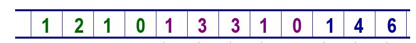

# 第3章 栈与队列

## 栈

- 只允许在一端插入和删除的线性表。

- 允许插入和删除的一端称为栈顶(top)，另一端称为栈底(bottom)。

-  后进先出 (LIFO)。


### 顺序栈

#### 入栈算法

```c++
void SeqStack::oveflowProcess()
{
    int* newArray = new int[2 * maxSize];
    for (int i = 0; i <= top; i++)
        newArray[i] = elements[i];
    maxSize += maxSize;
    delete[] elements;
    elements = newArray; // 改变elements指针
}
// 若栈不满, 则将元素x插入该栈栈顶, 否则溢出处理
void SeqStack::push(int x)
{
    if (top == maxSize - 1)
        overflowProcess();
    elements[++top] = x;
}
```

#### 出栈算法

```c++
// 函数退出栈顶元素并返回栈顶元素的值
bool seqStack::pop(int& x)
{
	if (top == -1)
        return false;
    x = elements[top--];
    return true;
}
```

### 链式栈

- 链式栈无栈满问题，空间可扩充；
- 插入与删除仅在栈顶处执行；
- 链式栈的栈顶在链头；
- 适合于多栈操作；

#### 置空栈

```c++
LinkedStack::makeEmpty()
{
    StackNode* p;
    while (top != nullptr) {
        p = top;
        top = p->link;
        delete p;
    }
}
```

#### 入栈算法

```c++
void LinkedStack::push(int x)
{
    top = new StackNode(x, top);
    assert(top != nullptr);
}
```

#### 出栈算法

```c++
bool LinkedStack::pop(int& x)
{
    if (top == nullptr) // 栈空
        return false;
    StackNode* p = top;
    top = top->link;
    x = p->data;
    delete p;
    return true;
}
```

> 当进栈元素的编号为$1, 2,\dots, n$时，可能的出栈序列有多少种？
>
> - $n=0,m_0=1$：出栈序列$\{\}$
> - $n=1,m_1=1$：出栈序列$\{1\}$
> - $n=2,m_2=2$： $=m_0*m_1+m_1*m_0$
>   - 出栈1在第1位：1进1出，2进2出
>   - 出栈1在第2位：1进2进，2出1出
> - $n=3,m_3=5$：$=m_0*m_2+m_1*m1+m_2*m_0$
>   -  出栈1在第1位：后面两个元素有$m_2$个出栈序列：$\{1,2,3\}, \{1, 3,2\}=m_0*m_2=2$
>   - 出栈1在第2位：1前有2后有3，出栈序列为：$\{2,3,1\}=m_1*m_1=1$\
>   - 出栈1在第3位：前面两个元素有$m_2$个出栈序列：$\{2,3,1\},\{3,2,1\}=m_2*m_0=2$
>
> ü一般地，设有 $n$ 个元素按序号$1, 2,\dots, n$ 进栈，轮流让 1在出栈序列的第1, 第2, …第n位，则可能的出栈序列数为：
>
> $$\sum_{i=0}^{n-1}m_i*m_{n-i-1}=\frac{1}{n+1}C_{2n}^{n}$$

## 队列


- 队列是只允许在一端删除，在另一端插入的线性表。

- 允许删除的一端叫做队头(front)，允许插入的一端叫做队尾(rear)。
- 先进先出(FIFO, First In First Out)

### 顺序队列

> 为解决假溢出的现象，将队列元素存放数组首尾相接，形成循环（环形）队列。


#### 判空判满

```c++
bool isFull() const { return (rear + 1) % maxSize == front; }
bool isEmpty() const { return rear == front; }
```

#### 入队算法

```c++
// 若队列不满, 则将x插入到该队列队尾, 否则返回      
bool SeqQueue::enQueue(int x)
{
	if (isFull())
        return false;
    elements[rear] = x;
    rear = (rear + 1) % maxSize;
    return true;
}
```

#### 出队算法

```c++
// 若队列不空则函数退队头元素并返回其值
bool SeqQueue:deQueue(int& x)
{
    if (isEmpty())
        return false;
    x = elements[front];
    front = (front + 1) % maxSize;
    return true;
}
```

### 链式对列

链式队列在进队时无队满问题，但有队空问题，队空条件为`front == nullptr`

#### 入队算法

```c++
LinkedQueue::enQueue(int x)
{
    if (front == nullptr) { // 创建第一个结点 
        front = rear = new QueueNode(x);
        if (front == nullptr)
            return false;
    else {
        rear->link = nww QueueNode(x);
        if (rear->link == nullptr) 
            return false;
        rear = rear->link;
    }
    return true;
}
```

#### 出队算法

```c++
bool LinkedQueue::deQueue(int& x)
{
    if (front == nullptr)
        return false;
    QueueNode* p = front;
    x = front->data;
    front = front->link;
    delete p;
    return true;
}
```

## 栈的应用：表达式求值

算术表达式有三种表示：

- 中缀(infix)表示

  <操作数> <操作符> <操作数>，如 A+B；

- 前缀(prefix)表示

   <操作符> <操作数> <操作数>，如 +AB；

- 后缀(postfix)表示

  <操作数> <操作数> <操作符>，如 AB+；

```c++
#include <iostream>
#include <string>
using namespace std;

const int maxSize = 100;

template <class T>
class Stack {
public:
    Stack() 
    {
        elements = new T[maxSize];
        if (elements == nullptr) {
            cerr << "内存分配异常" << endl;
            exit(1);
        }
        top = -1;
    }

    ~Stack() { delete[] elements; }

    T getTop()
    {
        if (top == -1)
            exit(1);
        return elements[top];
    } 

    void push(T x)
    {
        if (top == maxSize - 1)
            exit(1);
        elements[++top] = x;
    }

    bool pop(T& x)
    {
        if (top == -1)
            return false;
        x = elements[top--];
        return true;
    }

private:
    T* elements; 
    int top;
};

const string op("+-*/()#");

bool isOperator(char c)
{
    for (auto iter = op.begin(); iter != op.end(); ++iter)
        if (*iter == c)
            return true;
    return false;
}

int getPriority(char c)
{
    switch (c) {
        case '#': 
            return 0;
        case ')': 
            return 1;
        case '+':
            return 2;
        case '-':
            return 2;
        case '*':
            return 3;
        case '/':
            return 3;
        case '(':
            return 4;
        default:
            return -1;
    }
}

int getCurrentPrecede(char top, char c)
{
    int gradeTop = getPriority(top);
    int gradeC = getPriority(c);

    if (gradeTop >= gradeC) {
        if (top == '(' && c != ')')
            return -1;
        else if (top == '(' && c == ')')
            return 0;
        else
            return 1;
    } else if (top == '#' && c == '#') {
        return 0;
    } else 
        return -1;
}

int calculate(int a, char sign, int b)
{
    if (sign == '+')
        return a + b;
    else if (sign == '-')
        return a - b;
    else if (sign == '*')
        return a * b;
    else if (sign == '/')
        return a / b;
    return 0;
}

int evaluateExpression(Stack<char>& optr, Stack<int>& opnd)
{
    int a = 0, b = 0, n = 0;
    char x;
    char sign;
    string c;

    cin >> c;
    optr.push('#'); // 不可少
    while (c[0] != '#' || optr.getTop() != '#') {
        if (!isOperator(c[0])) {
            n = atoi(&c[0]);
            opnd.push(n);
            cin >> c;
        } else {
            switch (getCurrentPrecede(optr.getTop(), c[0])) {
                case -1:
                    optr.push(c[0]);
                    cin >> c;
                    break;
                case 0:
                    optr.pop(x);
                    cin >> c;
                    break;
                case 1: // 立即运算
                    optr.pop(sign);
                    opnd.pop(b);
                    opnd.pop(a);
                    opnd.push(calculate(a, sign, b));
                    break;
            }
        }
    }

    return opnd.getTop();
}

int main(void)
{
    Stack<char> optr;
    Stack<int> opnd;
    
    cout << "输出表达式，以#结束" << endl;

    int result = evaluateExpression(optr, opnd);
    cout << result << endl;

    return 0;
}
```

```
输出表达式，以#结束
( 
5 
*  
3
+ 
2
)
/
4
#
4
```

## 栈的应用：递归

若一个对象部分地包含它自己，或用它自己给自己定义, 则称这个对象是递归的；若一个过程直接地或间接地调用自己, 则称这个过程是递归的过程。

以下三种情况常常用到递归方法。

- 定义是递归的
- 数据结构是递归的
- 问题的解法是递归的

### 定义是递归的

$$n!=\begin{cases}1, n=0\\n*(n-1)!,n\geq1\end{cases}$$ 

```c++
long factorial(long n)
{
    if (n == 0)
        return 1;
    else
        return n * factorial(n - 1);
}
```


### 数据结构是递归的

例如单链表：

- 一个结点，它的指针域为`nullptr`，是一个单链表。

- 一个结点，它的指针域指向单链表，仍是一个单链表。

```c++
void print(LinkedNode* f)
{
	if (f->link == nullptr)
        cout << f->data << endl;
    else
        print(f->link);
}
```

### 问题的解法是递归的

例，汉诺塔(Tower of Hanoi)问题的解法：

 如果 n = 1，则将这一个盘子直接从 A 柱移到 C 柱上。否则，执行以下三步：

1. 用 C 柱做过渡，将 A 柱上的 (n-1) 个盘子移到 B 柱上；

2. 将 A 柱上最后一个盘子直接移到 C 柱上；

3. 用 A 柱做过渡，将 B 柱上的 (n-1) 个盘子移到 C 柱上。


```c++
void HanoiTower(int n, char A, char B, char C)
{
	if (n == 1)
        cout << "move " << A << " to " << C << endl;
    else {
        HanoiTower(n - 1, A, C, B); // A --> B
        cout << "move " << A << " to " << C << endl;
        HanoiTower(n - 1, B, A, C); // B --> C
    }
}
```

> **自顶向下，逐步分解**

### 递归过程与递归工作栈

每一次递归调用时，需要为过程中使用的参数、局部变量等另外分配存储空间。

每层递归调用需分配的空间形成递归工作记录，按后进先出的栈组织。 


函数递归的活动记录包括：返回地址（下一条指令）、局部变量、参数。

- 递归过程简洁、易编、易懂
- 递归过程效率低，重复计算多
- 改为非递归过程的目的是提高效率
- 单向递归和尾递归可直接用迭代实现其非递归过程

计算斐波那契数列的函数$Fib(n)$的定义

$$Fib(n)=\begin{cases}n, \quad n=0,1\\Fib(n-1)+Fib(n-2), \quad n>1\end{cases}$$

```c++
// 递归
long Fib(long n)
{
    if (n <= 1)
        return n;
    else 
        return Fib(n - 1) + Fib(n - 2);
}
```


```c++
// 单向递归迭代实现
long Fib(long n)
{
    if (n <= 1)
        return n;
    long twoBack = 0, oneBack = 1, current;
    for (int i = 2; i <= n; i++) {
        current = twoBack + oneBack;
        twoBack = oneBack;
        oneBack = current;
    }
    return current;
}
```

### 递归与回溯

#### n皇后问题

n在 n 行 n 列的国际象棋棋盘上，若两个皇后位于同一行、同一列、同一对角线上，则称为它们为互相攻击。n 皇后问题是指找到这 n 个皇后的互不攻击的布局。

```c++
#include <iostream>
#include <string>
using namespace std;

const int N = 100;
int col[N];
int md[2 * N - 1]; // 主对角线
int sd[2 * N - 1]; // 副对角线
int q[N]; 
void nQueue(int n, int i)
{
    for (int j = 0; j < n; j++) {
        if (!col[j] && !md[n + i - j - 1] && !sd[i + j]) {
            col[j] = md[n + i - j - 1] = sd[i + j] = 1;
            q[i] = j;
            if (i == n - 1) {
                for (int k = 0; k < n; k++) 
                    cout << "(" << k << ", " <<  q[k] << ") ";
                cout << endl;
            } else {
                nQueue(n, i + 1);
            }
            col[j] = md[n + i - j - 1] = sd[i + j] = 0;
            q[i] = 0;
        }
    }
}

int main(void)
{
    nQueue(4, 0);

    return 0;
}
```

#### 迷宫问题

```c++
#include <iostream>
#include <string>
using namespace std;

const int M = 5, N = 5;

struct Direction {
    int incX;
    int incY;
};

const Direction directions[4] = {{0, 1},{1, 0},{0, -1},{-1, 0}};

struct Box {
    int x, y;
    int dirct;
    Box(int aX = 0, int aY = 0, int aDirct = 0): x(aX), y(aY), dirct(aDirct) {}
};

const char* DIRECT[4] = {"E", "S", "W", "N"};
class Stack {
public:
    Stack() 
    {
        paths = new Box[M * N];
        if (paths == nullptr) {
            cerr << "内存分配异常" << endl;
            exit(1);
        }
        top = -1;
    }

    ~Stack() { delete[] paths; }

    Box getTop()
    {
        if (top == -1)
            exit(1);
        return paths[top];
    } 

    void push(Box x)
    {
        if (top == M * N - 1)
            exit(1);
        paths[++top] = x;
    }

    Box pop()
    {
        if (top == -1)
            exit(1);
        return paths[top--];
    }

    bool isEmpty()
    {
        return top == -1;
    }

    void displayPath()
    {
        int i = 0;

        if (top == -1)
            exit(1);

        while (top != -1 && i < top) {
            cout << "("<< paths[i].x << ", " << paths[i].y << ")" <<"  "<< DIRECT[paths[i].dirct] << endl;
            i++;
        }
    }

private:
    Box* paths; 
    int top;
};


bool findPath(int maze[M + 2][N + 2], Stack& s)
{
    int x, y, dir;
    int row, col;
    
    Box temp;
    maze[1][1] = -1;
    temp = Box(1, 1, -1);
    s.push(temp);
    while (!s.isEmpty()) {
        temp = s.pop();
        x = temp.x;
        y = temp.y;
        dir = temp.dirct + 1;
        while (dir < 4) {
            row = x + directions[dir].incX;
            col = y + directions[dir].incY;
            if (maze[row][col] == 0) {
                temp = Box(row, col, dir);
                s.push(temp);
                x = row;
                y = col;
                maze[row][col] = -1;
                if (x == M && y == N) {
                    temp = Box(x, y, dir);
                    s.push(temp);
                    return true;
                }
                else 
                    dir = 0;
            } else {
                dir++;
            }
        }
    }

    return false;
}

int main(void)
{
    int maze[M + 2][N + 2] =
    {
        {1,1,1,1,1,1,1},
        {1,0,0,1,0,0,1},
        {1,1,0,1,0,1,1},
        {1,0,0,0,0,0,1},
        {1,0,1,1,1,1,1},
        {1,0,0,0,0,0,1},
        {1,1,1,1,1,1,1}
    };

    Stack s;

    if (findPath(maze, s)) { 
        cout << "Find path" << endl;
        s.displayPath();
    }
    else cout<<"DON'T FIND"<<endl;

    return 0;
}
```

## 队列的应用：打印杨辉三角形




```c++
#include <iostream>
#include <string>
using namespace std;

const int maxSize = 100;
class Queue {
public:
    Queue(int n = maxSize)
    {
        elements = new int[n];
        rear = front = -1;
    }

    ~Queue() { delete[] elements; }

    bool isFull() const { return (rear + 1) % maxSize == front; }

    bool isEmpty() const { return rear == front; }

    bool enQueue(int x)
    {
        if (isFull())
            return false;
        elements[rear] = x;
        rear = (rear + 1) % maxSize;
        return true;
    }

    bool deQueue(int& x)
    {
        if (isEmpty())
            return false;
        x = elements[front];
        front = (front + 1) % maxSize;
        return true;
    }

private:
    int front, rear;
    int* elements;
};

void yangHuiTriangle(int n)
{
    Queue q(n + 3);
    q.enQueue(1);
    q.enQueue(1);

    int s = 0, t;
    for (int i = 1; i <= n; i++) {
        cout << endl;
        q.enQueue(0);
        for (int j = 1; j <= i + 2; j++) {
            q.deQueue(t);
            q.enQueue(s + t);
            s = t;
            if (j != i + 2)
                cout << s << ' ';
        }
    }
}

int main(void)
{
    yangHuiTriangle(5);

    return 0;
}
```

## 优先级队列

每次从队列中取出的是具有最高优先权的元素。

### 插入算法

```c++
bool PriorityQueue::insert(int x)
{
	if (count == maxSize)	
        return false;
    pqelements[count++] = x;
    adjust();
    return true;
}
```

### 调整算法

```c++
// 将最后元素暂存再从后向前找插入位置
void PriorityQueue::adjust()
{
	int temp = pqelements[count - 1];
    for (int j = count - 2; j >= 0; j--) {
        if (pqelements[j] <= temp)
            break;
        else
            pqelements[j + 1] = pqelements[j];
    }
    pqelements[j + 1] = temp;
}
```

