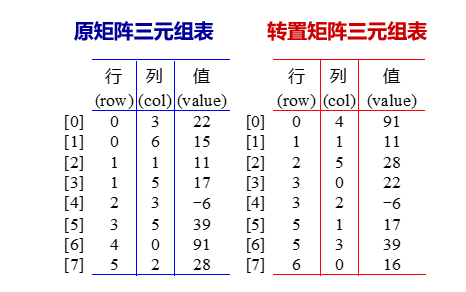

# 第4章 数组、串和广义表

## 一维数组与多维数组

### 一维数组

数组是相同类型的数据元素的集合，而一维数组的每个数组元素是一个序对，由下标（index）和值（value）组成。 

### 多维数组

多维数组是一维数组的推广。

多维数组的特点是每一个数据元素可以有多个直接前驱和多个直接后继。


三维数组下标为$i_1,i_2,i_3$的数组元素的存储地址：

$Loc(i_1,i_2,i_3)=a+(i_1*m_2*m_3+i_2*m_3+i_3)$

n维数组：各维元素个数为$m_1,m_2,m_3,\dots,m_n$

下标为$i_1,i_2,i_3,\dots,i_n$的数组元素的存储地址：

$Loc(i_1,i_2,\dots,i_n)\\=a+(i_1*m_2*m_3*\dots *m_n+i_2*m_3*m_4*\dots *m_n+\dots+i_{n-1}*m_n+i_n)\\=a+(\sum_{j=1}^{n-1}i_j*\prod_{k=j+1}^n+i_n)*l$

## 特殊矩阵

特殊矩阵是指非零元素或零元素的分布有一定规律的矩阵。

特殊矩阵的压缩存储主要是针对阶数很高的特殊矩阵。为节省存储空间，对可以不存储的元素，如零元素或对称元素，不再存储。

### 对称矩阵

对称矩阵中的元素关于主对角线对称，$a_{ij}=a_{ji},0\leq i,j\leq n-1$

### 三角矩阵

#### 上下三角矩阵

把它们按行存放于一个一维数组$B$中，称之为对称矩阵$A$的压缩存储方式。

数组$B$共有$n + ( n - 1 ) + \dots + 1 =\frac{n(n+1)}{2}$个元素。

若$i\geq j$，矩阵为下三角矩阵，数组元素$A[i][j]$在数组$B$的存储位置为$1+2\dots +i+j=\frac{i(i+1)}{2}+j$。

若$i\leq j$，矩阵为上三角矩阵，数组元素$A[i][j]$在数组$B$的存储位置为$n+n-1\dots +(n-i+1)+j-i=\frac{i(2n-i+1)}{2}+j-i$。

#### 三对角矩阵


三对角矩阵中除主对角线及在主对角线上 下最临近的两条对角线上的元素外，所有其它元素均为0。总共有3n-2个非零元素。

n在三条对角线上的元素$a_{ij}$ 满足 

​       $0\leq i\leq n-1, i-1\leq j \leq i+1$

n在一维数组$B$中 $A[i][j]$ 在第 $i$ 行，它前面有 $3i-1$ 个非零元素, 在本行中第 $j$ 列前面有$ j-i+1$ 个，所以元素$A[i][j]$ 在 $B$ 中位置为 $k = 2i + j$。

若已知三对角矩阵中某元素 A[i][j] 在数组 B[ ] 存放于第 k 个位置，则有：$i=\frac{(k+1)}{3}, j = k - 2 * i$。

## 稀疏矩阵 

设矩阵$A$中有$ s$ 个非零元素，若 $s$ 远远小于矩阵元素的总数（即$s\leq m×n$），则称 $A$为稀疏矩阵。

设矩阵$A$ 中有 $s$ 个非零元素。令 $e = s/(m*n)$，称 $e$ 为矩阵的稀疏因子。$e\leq 0.05$ 时称之为稀疏矩阵。

每一个三元组 $(i, j, a_{ij})$ 唯一确定了矩阵A的一个非零元素。因此，稀疏矩阵可由表示非零元的一系列三元组及其行列数唯一确定。

### 转置算法

  

```c++
void SparaseMatrix::transpos(SparseMatrix& b)
{
	b.rows = cols;
    b.cols = rows;
    if (Terms > 0) {
        int currentB = 0;
        int i, k;
        for (k = 0; k < cols; k++) { // 处理所有列号
            for (i = 0; i < Terms; i++) {
                if (smArray[i].col == k) {
                    b.smArray[currentB].row = k;
                    b.smArray[currentB].col = smArray[i].row;
                    b.smArray[currentB].value = smArray[i].value;
                    currentB++;
                }
            }
        }
    }
};
```

### 快速转置算法

设矩阵三元组表总共有 $t$ 项，上述算法的时间代价为 $O( n* t )$。当非零元素的个数 $t$ 和 $m*n$ 同数量级时，算法`transmatrix`的时间复杂度为$O(m*n^2)$。

为加速转置速度，建立辅助数组`rowSize`和`rowStart`：

`rowSize`记录矩阵转置前各列，即转置矩阵各行非零元素个数；

`rowStart`记录各行非零元素在转置三元组表中开始存放位置。


```c++
void SparseMatrix::fastTranspos(SparseMatrix& b)
{
    b.rows = cols;
    b.cols = rows;
    b.terms = terms;
    int* rowSize = new int[cols];
    int* rowStart = new int[cols];
    if (terms > 0) {
        int i, j;
        for (i = 0; i < cols; i++)
            rowSize[i] = 0;
        for (i = 0; i < terms; i++)
            rowSize[smArry[i].col]++;
        rowStart[0] = 0;
        for (i = 0; i < cols; i++) 
            rowStart[i] = rowStart[i - 1] + rowSize[i - 1];
        for (i = 0; i < terms; i++) {
		    j = rowStart[smArray[i].col];
        	b.smArray[j].row = smArray[i].col;
            b.smArray[i].col = smArray[i].row;
            b.smArray[j].value = smArray[i].value;
            rowStart[smArray[i].col]++;
        }
        delete[] rowSize;
        delete[] rowStart;
        
    }
}
```


## 字符串

### 串的模式匹配

#### 朴素的模式匹配算法

```c++
// 在当前串中从第 k 个字符开始寻找模式 pat 在当
// 前串中匹配的位置。若匹配成功, 则函数返回首
// 次匹配的位置, 否则返回-1
int String::find(String& pat, int k) const
{
    int n = length, m = pat.length;
	for (int i = k; i <= n - m; i++) {
        for (int j = 0; j < m; j++) {
            if (ch[i + j] != pat.ch[j])
                break;
            if (j == m)
                return i;
        }
    }
    return -1;
}
```

#### 改进的模式匹配算法

只要消除了每趟失配后为实施下一趟比较时目标指针的回退，可以提高模式匹配效率。

这种处理思想是由D.E.Knuth、J.H.Morris和V.R.Pratt同时提出来的，故称为KMP算法。

```c++
int String::fastFind(String& pat, int k, int next[]) const
{
    int posP = 0, posT = k;
    int lengthP = pat.length;
    int lengthT = length;
    while (posP < lengthP && posT < lengthT) {
        if (posP == -1 || pat.ch[posP] == ch[posT]) {
            posP++;
            posT++; // 对应字符匹配
        } else {
            posP = next[posP];
        }
        if (posP < lengthP)
            return -1;
        else
            return posT - lengthP;
    }
}

// 对当前串计算next特征向量的算法
void String::getNext(int next[])
{
    int j = 0, k = -1;
    lengthP = length;
	while (j < lengthP) {
        if (k == -1 || ch[j] == ch[k]) {
            j++;
            k++;
            next[j] = k;
        } else {
            k = next[k];
        }
    }
}
```


## 广义表

