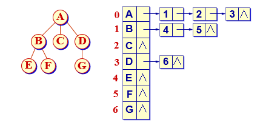

# 第5章 树与二叉树

## 树和森林的概念

### 树的分类

**自由树**

一棵自由树 $T_f$ 可定义为一个二元组

  $T_f = (V,E)$

 其中$V = {v1,\dots, v_n}$ 是由 $n$ ($n＞0$) 个元素组成的有限非空集合，称为顶点集合。$E = \{(v_i,v_j)|v_i,v_j\in V, 1≤i, j≤n\}$是$n-1$个序对的集合，称为边集合，$E$ 中的元素$(v_i,v_j)$称为边或分支。


**有根树**

一棵有根树$T$，简称为树，它是$n$ (n≥0) 个结点的有限集合。当$n=0$时，$T$称为空树；否则，$T$是非空树，记作：

$T=\begin{cases}\phi,\quad n=0\\\{r,T_1,T_2,\dots,T_m\},\quad n\geq 0\end{cases}$

$r$是一个特定的称为根(root)的结点，它只有直接后继，但没有直接前驱；根以外的其他结点划分为 $m$ ($m\geq  0$) 个互不相交的有限集合$T_1, T_2, \dots, T_m$，每个集合又是一棵树，并且称之为根的子树。

### 树的基本术语

子女：若结点的子树非空，结点子树的根即为该结点的子女。

双亲：若结点有子女，该结点是子女双亲。

度：结点的子女个数即为该结点的度；树中各个结点的度的最大值称为树的度。

分支结点：度不为0的结点即为分支结点，亦称为非终端结点。

叶结点：度为0的结点即为叶结点，亦称为终端结点。

祖先：某结点到根结点的路径上的各个结点都是该结点的祖先。

子孙：某结点的所有下属结点，都是该结点的子孙。

结点的层次：规定根结点在第一层，其子女结点的层次等于它的层次加一。以下类推。

深度：结点的深度即为结点的层次；离根最远结点的层次即为树的深度。

高度：规定叶结点的高度为1，其双亲结点的高度等于它的高度加1。

树的高度：等于根结点的高度，即根结点所有子女高度的最大值加1。

森林：森林是$m(m≥0)$棵树的集合。

## 二叉树 

### 二叉树的定义

一棵二叉树是结点的一个有限集合，该集合或者为空，或者是由一个根结点加上两棵分别称为左子树和右子树的、互不相交的二叉树组成。

### 二叉树的性质

1. 若二叉树结点的层次从 1 开始, 则在二叉树的第 i 层最多有 $2^{i-1}$个结点。

2. 深度为 *k* 的二叉树最少有 *k* 个结点，最多有 $2_{k-1}$个结点。( $k≥1$ )

   因为每一层最少要有1个结点，因此，最少结点数为 *k*。最多结点个数借助性质1：用求等比级数前*k*项和的公式：

   ​      $2^0 +2^1 +2^2 + \dots+2^{k-1} = 2^k-1$

3. 对任何一棵二叉树，如果其叶结点有 $n_0$ 个, 度为 2 的非叶结点有$n_2$个,  则有：

   $n_0=n_2+1$

   若设度为 1 的结点有 *n*1 个，总结点数为*n*，总边数为e，则根据二叉树的定义，

   ​           $n = n_0+n_1+n_2\qquad e = 2n_2+n_1 = n-1$

   因此，有$2n_2+n_1=n_0+n_1+n_2-1$

   $n_2=n_0-1$

   

4. 具有 $n(n≥0)$ 个结点的完全二叉树的深度为 $\log_2(n+1)$  


### 二叉树的顺序表示


### 二叉树的链式表示


### 二叉树的静态结构


## 二叉树遍历


### 中序遍历

遍历结果：`a+b*c-d-e/f`

#### 递归算法

```c++
void BinaryTree::inOrder(BinTreeNode* subTree)
{
    if (subTree != nullptr) {
        inOrder(subTree->left);
        printf("%d ", subTree->data);
        inOrder(subTree->right);
    }
}
```

#### 非递归算法

```c++
void BinaryTree::inOrder(BinTreeNode* subTree)
{
    stack<BinTreeNode*> s;
	BinTreeNode* p = root;
    do {
        while (p != nullptr) { // 遍历指针向左下移动
            s.push(p);
            p = p->left;
        }
        if (!s.empty()) { // 栈不空时退栈
            s.pop(p); // 退栈访问
            printf("%d ", p->data);
            p = p->right; // 遍历指针指向右子女
        }
    } while (p != nullptr || !s.empty());
}
```

### 前序遍历

遍历结果：`-+a*b-cd/ef`

#### 递归算法

```c++
void BinaryTree::preOrder(BinTreeNode* subTree)
{
    if (subTree != nullptr) {
        printf("%d ", subTree->data);
        preOrder(subTree->left);
        preOrder(subTree->right);
    }
}
```

#### 非递归算法

```c++
void BinaryTree::preOrder(BinTreeNode* subTree)
{
    stack<BinTreeNode*> s;
    BinTreeNode* p = root;
    s.push(nullptr);
    
    while (p != nullptr) {
        printf("%d ", p->data); // 第一次先遍历根节点
        if (p->right != nullptr) 
            s.push(p->right);
        if (p->left != nullptr)
            p = p->left; // 进入左子树
        else // 左子树为空，遍历父结点
            s.pop(p);
    }
}
```

### 后序遍历

遍历结果：`abcd-*+ef/-`

#### 递归算法

```c++
void BinaryTree::postOrder(BinTreeNode* subTree)
{
    if (subTree != nullptr) {
        postOrder(subTree->left);
        postOrder(subTree->right);
        printf("%d ", subTree->data);
    }
}
```

#### 非递归算法

```c++
struct StkNode {
    BinTreeNode* ptr;
    enum tag {L, R};
    StkNode(BinTreeNode* p = nullptr):
    	ptr(p), tag(L) {}
};
// tag = L,  表示从左子树退回还要遍历右子树; tag = R，表示从右子树退回要访问根结点。 
void BinaryTree::postOrder(BinTreeNode* t)
{
    stack<StkNode*> s;
    StkNode w;
    BinTreeNode* p = root;
    
    do {
        while (p != nullptr) {
            w.ptr = p;
            w.tag = L;
            s.push(w);
            p = p->left;
        }
        int continued = 1; // 继续循环的标记，用于R的左子树
        while (continued && !s.empty()) {
            s.pop(w);
            p = w.ptr;
            switch (w.tag) { // 判断栈顶tag标记
                case L: // 退回还要遍历右子树
                    w.tag = R;
                    s.push(w);
                    continued = 0;
                    p = p->right;
                    break;
                case R: // 从右子树退回要访问根结点
                    printf("%d ", p->data);
                    break;
            }
        } while (!s.empty());
    }
}
```

### 层次遍历

#### 非递归算法

```c++
void BinaryTree::levelOrder(BinTreeNode* t)
{
    if (root == nullptr)
        return;
    queue<BinTreeNode*> q;
    BinTreeNode* p = root;
    printf("%d ", p->data);
    q.enqueue(p);
    while (!q.empty()) {
        q.deque(p);
        if (p->left != nullptr) {
            printf("%d ", p->left->data);
            q.enqueue(p->left);
        }
        if (p->right != nullptr) {
            printf("%d ", p->right->data);
            q.enqueue(p->right);
        }
    }
}
```

### 应用二叉树遍历实例

```c++
// 利用二叉树后序遍历算法计算二叉树的结点个数
int BinaryTree::size(BinTreeNode* subTree) const
{
    if (subTree == nullptr)
        return 0;
    else
        return 1 + size(subTree->leftChild) 
                 + size(subTree->rightChild);
}
```

```c++
int BinaryTree::height(BinTreeNode* subTree) const
{
    if (suTree == nullptr)
        return 0;
    else {
        int i = height(subTree->leftChild);
        int j = height(subTree->rightChild);
        return max(i, j) + 1;
    }
}
```

## 二叉树的计数

二叉树遍历的结果是将一个非线性结构中的数据通过访问排列到一个线性序列中。

前序序列：*a b d c e*  特点是第一个访问的*a*一定是树根，只要左子树非空，后面紧跟的*b* 一定是根的左子女。

中序序列：*b d a e c* 特点是树根 *a* 把整个中序分成两部分， *a* 左侧子序列是根的左子树上的结点数据，右侧子序列是根的右子树上的结点数据。

由二叉树的前序序列和中序序列可唯一地确定一棵二叉树。

例, 前序序列 $\{A B H F D E C K G\}$ 和中序序列 $\{H B D F A E K C G\}$, 构造二叉树过程如下：


## 线索化二叉树

线索二叉树又称为穿线树。通过二叉树的遍历，可将二叉树中所有结点的数据排列在一个线性序列中，可以找到某数据在这种排列下它的前驱和后继。希望不必每次都通过遍历找出这样的线性序列。只要事先做预处理，将某种遍历顺序下的前驱、后继关系记在树的存储结构中，以后就可以高效地找出某结点的前驱、后继。


这种设计的缺点是每个结点增加两个指针，当结点数很大时存储消耗较大。

改造树结点，将`pred`指针和`succ`指针压缩到`left `和`right` 的空闲指针中，并增设两个标志`ltag `和 `rtag`，指明指针是指示子女还是前驱／后继。后者称为线索。


### 建立中序线索化二叉树

```c++
void TreadTree::createInThread() 
{
    ThreadTree* pre = nullptr;
    if (root != nullptr) {
        createInTread(root, pre);
        pre->right = nullptr;
        pre->rtag = 1;
    }
}

void TreadTree::createInThread(ThreadNode* current, ThreadNode*& pre)
{
    if (current == nullptr) 
        return;
    // 递归, 左子树线索化
    createInThread(current->left, pre);
    if (current->left == nullptr) {
        // 建立当前结点的前驱线索
        current->left = pre;
        current->ltag = 1;
    }
    if (pre != nullptr && pre->right == nullptr) {
        // 建立当前结点的后继线索
        pre->right = current;
        pre->rtag = 1;
    }
    pre = current;
    // 递归, 右子树线索化            
    createInThread(current->right, pre);
}
```

## 树与森林

### 树的存储表示

#### 广义表表示


#### 双亲表示

树中结点的存放顺序一般不做特殊要求，但为了操作实现的方便，有时也会规定结点的存放顺序。例如，可以规定按树的前序次序存放树中的各个结点，或规定按树的层次次序安排所有结点。 


#### 子女链表表示



#### 子女-兄弟表示


`firstChild`指向该结点的第一个子女结点。无序树时，可任意指定一个结点为第一个子女。

`nextSibling`指向该结点的下一个兄弟。任一结点在存储时总是有顺序的。

```c++
struct TreeNode {
    int data;
    TreeNode* firstNode, *nextSibling;
}
```

### 树的遍历

#### 先根次序遍历

遍历结果：`ABCDEFGHIKJ`

```c++
void Tree::preOrder(BinTreeNode* current)
{
    // 以当前指针current为根, 先根次序遍历
    if (current != nullptr) {
        cout << curent->data << " ";
        TreeNode* p = current;
        current = current->firstChild;
        while (current != nullptr) {
            preOrder(current);
            current = current->nextSibling;
        }
        current = p; // 恢复当前指针
    }
}
```

#### 后根次序遍历

遍历结果：`BCEDAGFUJH`

```c++
void Tree::postOrder(BinTreeNode* current)
{
	if (current != nullptr) {
        TreeNode* p = current;
        curent = current->firstChild;
        while (current != nullptr) {
            postOrder(current);
            current = current->nextSibling;
        }
        current = p;
        cout << current->data << " "; // 访问根结点
    }
}
```

#### 广度优先遍历

若森林 *F* 为空，返回；否则

依次遍历各棵树的

 根结点；

依次遍历各棵树根结点的所有子女；

依次遍历这些子女结点的子女结点；

遍历结果：`AFHBCDGIJEK`

### 森林与二叉树的转换


## 堆

每次出队列的是优先权最高的元素。用堆实现其存储表示，能够高效运作。

由于堆存储在下标从 0 开始计数的一维数组中，因此在堆中给定下标为 *i* 的结点时：

- 如果 *i* = 0，结点 *i* 是根结点，无双亲；否则结点 *i* 的父结点为结点 (i-1)/2； 

- 如果 2*i*+1＞n-1，则结点 *i* 无左子女；否则结点 *i* 的左子女为结点 2*i*+1； 

- 如果 2*i*+2＞n-1，则结点 *i* 无右子女；否则结点 *i* 的右子女为结点 2*i*+2。

### 下滑调整算法

```c++
// 从结点start开始到m为止, 自上向下比较, 如果子女的值小于父结点的值,  则关键码小的上浮, 
// 继续向下层比较, 将一个集合局部调整为最小堆
void MinHeap::shiftDown(int start, int m)
{
	int i = start, j = 2 * i + 1; // j是i的左子女
    int temp = heap[i];
    while (i <= m) {
        if (i < m && heap[j] > heap[j + 1])
            j++; // 让j指向两子女中的小者            
        if (temp <= heap[j]) // 小不做调整
            break;
        else {
            heap[i] = heap[j]; // 向上放
            i = j;
            j = 2 * j + 1; // 否则小的上移，i，j下降
        }
    }
    heap[i] = temp;
}
```

### 上滑调整算法

```c++
void MinHeap::filterUp(int start)
{
	int j = start, i = (j - 1) / 2;
    int temp = heap[j];
    while (j > 0) {
        if (heap[i] <= temp) 
            break;
        else {
            heap[j] = heap[i]; // 相下放
            j = i;
            i = (i - 1) / 2;
        }
    }
    heap[j] = temp; // 回送
}
```

### 插入算法

```c++
bool MinHeap::insert(const int& x)
{
    if (currentSize == maxHeapSize)
        return false;
    heap[currentSize] = x;
    siftUp(currentSize);
    currentSize++;
    return true;
}
```

### 删除算法

```c++
bool MinHeap::remove(int& x)
{
    if (currentSize <= 0)
        return false;
    x = heap[0];
    heap[0] = heap[currentSize - 1];
    currentSize--;
    shiftDown(0, currentSize - 1); // 自上向下调整为堆
    return true;
}
```

## Huffman树

带权路径长度达到最小的扩充二叉树即为Huffman树。

在Huffman树中，**权值大**的结点离根最近。

### Huffman树构造过程


### 建立Huffman树算法

```c++
HuffmanTree::HuffmanTree(double[] weight, int n) 
{
	priority_queue<int, vector<int>, greater<int> > hp;  // 小顶堆   
    HuffmanNode* parent, &first, &second;
    HuffmanNode* nodeList = new HuffmanNode[n];
    
    for (int i = 0; i < n; i++) {
        nodeList[i].data = w[i];
        nodeList[i].left = nullptr;
        nodeList[i].right = nullptr;
        hp.push(nodeList[i]);
    }
    for (int i = 0; i < n - 1; i++) {
        first = hp.top();
        hp.pop();
        second = hp.top();
        hp.pop();
        mergeTree(first, second, parent);
        hp.push(parent);
        root = parent; // 建立根结点
};
    
void HuffmanTree::mergeTree(HuffmanNode& bt1, HuffmanNode& bt2, HuffmanNode*& parent)
{
    parent = new int();
    parent->left = &bt1;
    parent->right = &bt2;
    parent->data = bt1->data + bt2->data;
    bt1.parent = bt2.parent = parent;
}
```

