# 第6章 集合与字典

## 集合及其表示

集合是成员(元素)的一个群集。集合中的成员可以是原子(单元素)，也可以是集合。集合的成员必须**互不相同**。

### 位向量

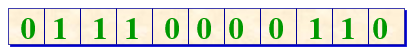

当集合是全集合 { 0, 1, 2, …, n } 的一个子集，且 *n* 是不大的整数时，可用位(0, 1)向量来实现集合。

当全集合是由有限个可枚举的成员组成时，可建立全集合成员与整数 0, 1, 2, …的一一对应关系，用位向量来表示该集合的子集。一个二进位两个取值1或0，分别表示在集合与不在集合。

#### 映射函数实现

```c++
// 读取集合元素x
BitSet::getMember(const int x)
{
    int ad = x / 16, id = x % 16;
    unsigned short elem = bitVector[ad];
    
    return int((elem >> (15 - id)) % 2);
}
```

```c++
// 将值v送入集合元素x，v取0或1
void BitSet::putMember(const int x, int v)
{
    int ad = x / 16, id = x % 16;
    unsigned short elem = bitVector[ad];
    
    int temp = elem >> (15  - id); // 右移,该位移至末尾
    elem = elem << (id + 1); // 修改位为最低为
    if (temp % 2 == 0 && v == 1)
        elem = elem + 1;
    else if (temp % 2 == 1 && v == 0) 
        elem = elem - 1;
    bitVector[ad] = (temp << (15 - id)) | (elem >> (id + 1)); // 送回
}
```

#### 集合运算算法

```c++
// 求集合this与r的并
BitSet BitSet::operator+(const BitSet& r)
{
    assert(vectorSize == r.vectorSize);
	Set temp(vectorSize);
    
    for (int i = 0; i < vectorSize; i++)
        temp.bitVector[i] = vectorVector[i] | r.bitVector[i];
    
    return temp;
}
```

```c++
// 求集合this与r的交
BitSet BitSet::operator*(const BitSet& r)
{
    assert(vectorSize == r.vectorSize);
	Set temp(vectorSize);
    
    for (int i = 0; i < vectorSize; i++)
        temp.bitVector[i] = vectorVector[i] & r.bitVector[i];
    
    return temp;
}
```

```c++
// 求集合this与r的差
BitSet BitSet::operator-(const BitSet& r)
{
    assert(vectorSize == r.vectorSize);
	Set temp(vectorSize);
    
    for (int i = 0; i < vectorSize; i++)
        temp.bitVector[i] = vectorVector[i] & !r.bitVector[i];
    
    return temp;
}
```

### 有序链表

用有序链表来表示集合时，链表中的每个结点表示集合的一个成员。

各结点所表示的成员$e_0, e_1,\dots, e_n$ 在链表中按升序排列，即 $e_0<e_1<\dots<e_n$。

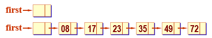

#### 集合运算算法

```c++
// 求集合this与r的并
LinkedSet LinkedSet::operator+(LinkedSet& r)
{
    SetNode* pb = r.first->link;
    SetNode* pa = first->link;
    LinkedSet temp;
    SetNode* p, *pc = temp.first;
    
    while (pa != nullptr && pb != nullptr) {
        if (pa->data == pb->data) {
            pc->link = new SetNode(pa->data);
            pa = pa->link;
            pb = pb->link;
        } else if (pa->data < pb->data) {
            pc->link = new SetNode(pa->data);
            pa = pa->link;
        } else {
            pc->link = new SetNode(pb->data);
            pb = pb->link;
        }
        pc = pc->link;
    }
    
    if (pa != nullptr)
        p = pa;
    else
        p = pb;
    while (p != nullptr) {
        pc->link = new SetNode(p->data);
        pc = pc->link;
        p = p->link;
    }
    pc->link = nullptr;
    temp.last = pc; // 链表收尾
}
```

## 并查集与等价类

### 等价类

在求解实际应用问题时常会遇到等价类问题。

从数学上看，等价类是对象（或成员）的集合，在此集合中所有对象应满足等价关系。

若用符号"≡"表示集合上的等价关系，则对于该集合中的任意对象*x*, *y*, *z*，下列性质成立：

自反性：*x* ≡ *x* (即等于自身)。

对称性：若 *x* ≡ *y*, 则 *y* ≡ *x*。

传递性：若 *x* ≡ *y*且 *y* ≡ *z*, 则 *x* ≡ *z*。

确定等价类的方法：

1. 读入并存储所有的等价类对$(i,j)$

2. 标记和输出所有等价类

给定集合 S = { 0, 1, 2, 3, 4, 5, 6, 7, 8, 9, 10, 11 },及如下等价对:  0 º 4, 3 º 1, 6 º 10, 8 º 9, 7 º 4,  6 º 8, 3 º 5, 2 º 11, 11 º 0

进行归并的过程为：

```asciiarmor
iniialzie: t {0},{1},{2},{3},{4},{5},{6},{7},{8},{9},{10},{11}

0 ≡ 4 {0,4},{1},{2},{3},{5},{6},{7},{8},{9},{10},{11}

3 ≡ 1  {0,4},{1,3},{2},{5},{6},{7},{8},{9},{10},{11}

6 ≡ 10 {0,4},{1,3},{2},{5},{6,10},{7},{8},{9},{11}

8 ≡ 9  {0,4},{1,3},{2},{5},{6,10},{7},{8,9},{11}

7 ≡ 4  {0,4,7},{1,3},{2},{5},{6,10},{8,9},{11}

       {0,4,7},{1,3},{2},{5},{6,10},{8,9},{11}

6 ≡ 8   {0,4,7},{1,3},{2},{5},{6,8,9,10},{11}

3 ≡ 5   {0,4,7},{1,3,5},{2},{6,8,9,10},{11}

2 ≡ 11 {0,4,7},{1,3,5},{2,11},{6,8,9,10}

11 ≡ 0 {0,2,4,7,11},{1,3,5},{6,8,9,10}
```

### 等价类链表表示

设等价对个数为m, 对象个数为n。一种可选的存储表示为单链表。

可为集合的每一对象建立一个带表头结点的单链表，并建立一个一维的指针数组`seq[n]`作为各单链表的表头结点向量。`seq[i]` 是第 *i* 个单链表的表头结点, 第 *i* 个单链表中所有结点的 *data* 域存放在等价对中与 *i* 等价的对象编号。

在输出时设置一个布尔数组 `out[n]`，用 `out[i]` 标记第 *i* 个单链表是否已经输出。

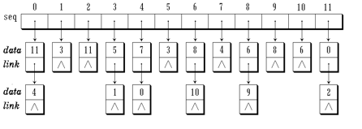

### 并查集

并查集（Union-Find Sets）支持以下三种操作：

```c++
 Union (Root1, Root2)  //合并操作
 Find (x)             //查找操作
 UFSets (s)           //构造函数
```

对于并查集来说，每个集合用一棵树表示。

为此，采用树的双亲表示作为集合存储表示。集合元素的编号从0到 *n*-1。其中 *n* 是最大元素个数。

在双亲表示中，第 *i* 个数组元素代表包含集合元素 *i* 的树结点。初始时，根结点的双亲为-1，表示集合中的元素个数。

在同一棵树上所有结点所代表的集合元素在同一个子集合中。

为此，需要有两个映射：

- 集合元素到存放该元素名的树结点间的对应；

- 集合名到表示该集合的树的根结点间的对应。

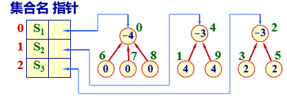

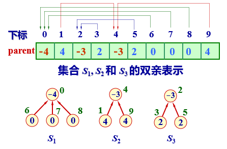

#### 构造函数

```c++
UFSets::UFSets(int sz)
{
    size = sz;
    parent = new int[size];
    for (int i = 0; i < size; i++)
        parent[i] = -1; //每个自成单元素集合
}
```

#### 查找算法

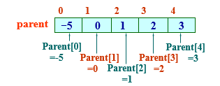

```c++
int UFSets::find(int x)
{
	if (parent[x] < 0)
        return x;
    else
        return find(parent[x]);
}
```

#### 合并算法

```c++
void UFSets::union(int root1, int root2)
{
    parent[root1] += parent[2];
    parent[root2] = root1; // 将Root2连接到Root1下面
}
```

> `find` 和 `union` 操作性能不好。假设最初 n 个元素构成 n 棵树组成的森林，parent[i] = -1。做处理Union(n-2, n-1), …, union(1, 2), Union(0, 1)后，将产生退化的树。
>
> 改进方法：
>
> - 按数的结点个数合并
> - 按树的高度合并
> - 压缩元素路径长度

```c++
// 按union的加权规则改进的算法
void UFSets::weightUnion(int root1, int root2)
{
    int temp = parent[root1] + parent[root2];
    if (parent[root1] < parent[root2]) {
        parent[root1] = root2;
        parent[root2] = temp;
    } else {
        parent[root2] = root1;
        parent[root1] = temp;
    }
}
```

## 字典

字典是一些元素的集合，每个元素有一个称作关键码（key）的域，不同元素的关键码互不相同。

在讨论字典抽象数据类型时，把字典定义为<名字-属性>对的集合。根据问题的不同，可以为名字和属性赋予不同的含义。

n字典可以保存在线性序列$(e_1,e_2,\dots)$ 中，其中$e_i$ 是字典中的元素，其**关键码**从左到右依次增大。为了适应这种描述方式，可以定义有序顺序表和有序链表。

### 折半搜索算法

```c++
int SortedList::binarySearch(int k, int low, int high)
{
    int mid = 0;
    if (low <= high) {
        mid = (low + high) / 2;
        if (data[mid - 1] < k)
            mid = binarySearch(k, mid + 1, high);
        else
            mid = binarySearch(k, low, mid - 1);
    }
    return mid;
}
```

## 跳表

由前面讨论可知，在一个有序顺序表中进行折半搜索，时间效率很高。但是在有序链表中进行搜索，只能顺序搜索，需要执行$O(n)$次关键码比较。

如果在链表中部结点中增加一个指针，则比较次数可以减少到 *n*/2+1。在搜索时，首先用要搜索元素与中间元素进行比较，如果要搜索元素小于中间元素，则仅需搜索链表的前半部分，否则只要在链表的后半部分进行比较即可。

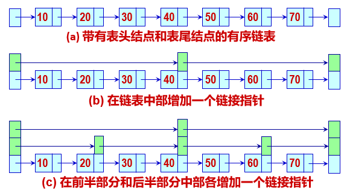

在上面跳表的例子中有三条链：0 级链就是图(a)中的初始链表，包括了所有 7个元素。1 级链包括 2、4、6 三个元素。2 级链只包括第 4 个元素。

为了搜索值为 30 的元素，首先搜索 2 级链，与中间元素 40 进行比较，在 2 级链中只需比较1次。由于30 < 40，下一步将搜索链表前半部分的中间元素，在 1 级链也仅需比较 1 次。由于30 > 20，可到 0 级链继续搜索，与链表中元素进行比较。 搜索时间代价为$O(\log2n)$。

跳表如图(c)所示，有一组**分层的链**，0级链是包含所有元素的有序链表，有*n*个元素。

0 级链的第21, 2´21, 3´21, ¼个结点链接起来形成1级链，故1级链是0级链的子集。

1 级链的第22, 2´22, 3´22, ¼个结点链接起来形成2级链，依此类推，第*i*级链所包含的元素是第*i*-1级链的子集。

### 构造函数

```c++
struct SKipNode {
    int data;
    SKipNode** link;
    SkipNode(int sz = defaultSize)
    {
        link = new SkipNode*[sz];
        if (link == nullptr) {
            cerr << "存储分配失败" << endl;
            exit(1);
        }
    }
    ~SkipNode() { delete[] link; } 
};

SkipList::SkipList(int large, int maxLevl): maxLevel(maxLevel), tailKey(large)
{
    levels = 0; // 当前非空链级数仅0级
	head = new SkipNode(maxLevel + 1);
    tail = new SkipNode(0);
    last = new SkipNode*[maxLevel + 1]; // 跳表的多级链的头指针
    tail->data = large;
    for (int i = 0; i <= maxLevel; i++)
        head->link[i] = tail; // 各级链皆为空链
};
```

### 析构函数

```c++
SkipNode::~SkipList()
{
    SkipNode* next;
    while (head != tail) {
        next = head->link[0];
        delete head;
        head = next;
    }
    delete tail;
    delete[] last;
}
```

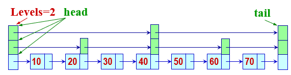

### 搜索算法

`search`函数从最高级链（`Levels`级，仅含一个元素）的表头结点开始，沿着链搜索，遇到某一关键码大于或等于要搜索的关键码，则下降到下一级，沿较低级链的指针搜索，逐步逼近要搜索的元素，一直到0级链。

当从循环退出时，正处于要找元素左边。与0级链下一元素比较，就可知元素是否在表中。  

```c++
bool SkipList::search(int k1, int e1)
{
    if (k1 > tailKey) // 要找元素太大
        return false;
    SkipNode* p = head;
    
    for (int i = levels, i >= 0; i--) 
        while (p->link[i]->key < k1)
            p = p->link[i];
    
    int e2 = p->link[0]->val;
    return e1 == e2;
}
```

```c++
// saveSearch不仅包含了Search的功能，而且可把每一级中遇到的最后一个结点存放到指针数组last中。
SkipNode* SkipList::saveSearch(int k1)
{
    if (k1 > tailKey)
        return nullptr;
    SkipNode* p = head;
    for (int i = levels; i >= 0; i--) {
        while (p->link[i]->data < k1)
            p = p->link[i];
        last[i] = p; // 记下最后比较结点
    }
    return p->link[0];
}
```

### 插入算法

```c++
// 产生一个随机的级别，该级别 < maxLevel
int SkipList::level()
{
    int lev = 0;
    while (rand() <= RAND_MAX / 2)
        lev++;
    return (lev < maxLevel) ? lev : maxLevel; 
};
```

```c++
bool SkipList::insert(int k1, int e1)
{
	if (k1 >= tailKey) {
        cerr << "关键码太大" << endl;
        return false;
    }
    SkipNode* p = saveSearch(k1);
    if (p->data == e1) {
        cerr << "关键码重复" << endl;
        return false;
    } 
    int lev = level();
    if (lev > levels) {
        lev = ++levels;
        last[lev] = head;
    }
    SkipNode* newNode = new SkipNode(lev + 1);
    newNode->data = e1;
    for (int i = 0; i <= lev; i++) {
        newNode->link[i] = last[i]->link[i];
        last[i]->link[i] = newNode;
    }
    return true;
}
```

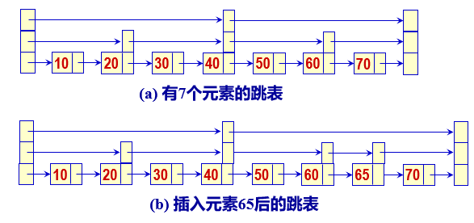

### 删除算法

```c++
bool SkipList::remove(int k1)
{
    if (k1 > tailKey) {
        cerr << "关键码过大" << endl;
        return false;
    }
    SkipNode* p = saveSearch(k1);
    
    if (p->data != k1) {
        cout << "不存在" << endl;
        return false;
    }
    for (int i = 0; i <= levels && last[i]->link[i] == p; i++)
        last[i]->link[i] = p->link[i]; //逐级链摘下该结点
    
    while (levels > 0 && head->link[levels] == tail)
        levels--; // 修改级数，以找到一个至少包含一个元素的级别（除跳表为空）
    delete p;
    return true;
}
```

## 散列

理想的搜索方法是可以不经过比较，一次直接从字典中得到要搜索的元素。

如果在元素存储位置与其关键码之间建立一个确定的对应函数关系Hash()， 使得每个关键码与结构中一个唯一的存储位置相对应：

$Address=Hash(key)$

在插入时依此函数计算存储位置并按此位置存放。在搜索时对元素的关键码进行同样的计算，把求得的函数值当做元素存储位置， 在结构中按此位置搜索。这就是散列方法。 

在散列方法中所用转换函数叫做散列函数。按此方法构造出来的表叫做散列表。

### 散列函数

散列函数是一个**压缩映象**函数。关键码集合比散列表地址集合大得多。因此有可能经过散列函数的计算，把不同的关键码映射到同一个散列地址上，这就产生了冲突。

构造散列函数时的几点要求：

- 散列函数应是简单的，能在较短的时间内计算出结果。

- 散列函数的定义域必须包括需要存储的全部关键码，如果散列表允许有 *m* 个地址时，其值在0到m-1之间。
- 散列函数计算出来的地址应能均匀分布在整个地址空间中。

**直接定址法**

此类函数取关键码的某个线性函数值作为散列地址：

$Hash(key)=a*key+b$

**数字分析法**

设有 *n* 个 *d* 位数,  每一位可能有 *r* 种不同的符号。这 *r* 种不同符号在各位上出现的频率不一定相同。根据散列表的大小, 选取其中各种符号分布均匀的若干位作为散列地址。

$\lambda_k=\sum_{i=1}^r(\alpha_i^k-n/r)^2$

其中，$\alpha_i^k$表示第$i$个符号在第$k$位出现的次数，$n/r$表示各种符号在$n$个数均匀出现的期望。

计算出的$\lambda_k$值越小，表明在该位 (第 *k* 位) 各种符号分布得越均匀。


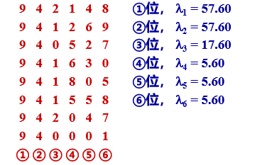

若散列表地址范围有 3 位数字, 取各关键码的 ④⑤⑥ 位做为记录的散列地址。

**除留余数法**

设散列表中允许地址数为*m*，取一个不大于 *m*，但最接近于或等于 *m* 的质数 *p* 作为除数，用以下函数把关键码转换成散列地址：

$hash(key)=key\%p\qquad p\leq m$

**平方取中法**

它首先计算构成关键码的标识符的内码的平方, 然后按照散列表的大小取中间的若干位作为散列地址。

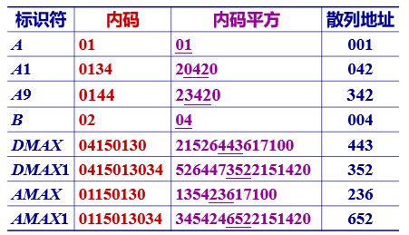

### 闭散列方法

闭散列也叫做开地址法。在闭散列情形，所有的桶都直接放在散列表数组中。

在存放时发现此桶已被另一个表项 *R*1 占据，发生了冲突, 必须处理冲突。为此, 需把 *R*2 存放到表中“下一个”空桶中。如果表未被装满, 则在允许的范围内必定还有空桶。

### 线性勘察法

一旦发生冲突，在表中顺次向后寻找“下一 个”空桶 $H_i$ 的递推公式为： 

$H_i=(H_{i-1}+1) \% m\qquad i =1, 2,\dots, m-1$

#### 类定义

```c++
const int defaultSize = 100;
enum KindOfSatus {Active, Empty, Deleted};

class HashTable {
private:
    int n, tableSize;
    int* ht;
    KindOfStatusA* info;
    int hash(int k1) const;
}
```

#### 搜索算法

```c++
int HasTable::findPos(int val) const
{
    int i = val % tablesize;
    int j = i; // 检测下一空桶下标
    
    do {
        if (info[j] == Empty || info[j] == Active && ht[j] == val)
            return j;
        j = (j + 1) % tableSize;
    } while (j != i);  // 转一圈回到开始点, 表已满, 失败
    return j;
}

bool HashTable::search(int val)
{
    int i = findPos(val);
    if (info[i] != Active || ht[i] != val)
        return false;
    return true;
}
```

> 在闭散列情形下不能真正删除表中已有表项。删除表项会影响其他表项的搜索。
>
> 例如，若把关键码为相同的一个表项删除，其余表项将查找失败。
>
> 若想删除一个表项, 只能给它做一个删除标记`Deleted`进行逻辑删除, 不能把它真正删去。逻辑删除的副作用是：在执行多次删除后, 表面上看起来散列表很满, 实际上有许多位置没有利用。

#### 插入算法

```c++
bool HashTable::insert(int val)
{
    int i = findPos(val);
    if (info[i] != Active) {
        ht[i] = val;
        info[i] = Active;
        n++;
        return true;
    }
    if (info[i] == Active && ht[i] == val) 
        cout << "表中已有此元素，不能插入\n";
    else
        cout << "表已满，不能插入！\n";
    return false;
}
```

#### 删除算法

```c++
bool HashTable::remove(int val)
{
    int i = findPos(val);
    if (info[o] == Active) {
        info[i] = Deleted;
        n--;
        return true;
    }
    return false;
}
```

### 二次探查法

使用二次探查法在表中寻找“下一个”空桶，其公式为：

$H_i=(H_0+i^2) \% m, H_i = (H_0-i^2)\% m,i=1,2,3,\quad,(m-1)/2$

二次探查法的探查序列形如 $H_0,H_0+1,H_0-1,H_0+4,H_0-4$

### 双散列表法

使用双散列方法时, 需要两个散列函数。

第一个散列函数 *Hash*() 按表项的关键码 *key* 计算表项所在的桶号 $H0=Hash(key)$。

一旦冲突，利用第二个散列函数 $ReHash()$ 计算该表项到达“下一个”桶的移位量。它的取值与 *key* 的值有关, 要求它的取值应是**小于**地址空间大小 TableSize, 且与 TableSize **互质**的正整数。

若设表的长度为 *m =* TableSize，则在表中寻找“下一个”桶的公式为：

$H_0 = Hash(key),\qquad p = ReHash(key)$

$H_i = (H_{i-1}+ )\% m$

### 开散列方法

开地址方法又称链地址法，开散列方法首先对关键码集合用某一个散列函数计算它们的存放位置。若设散列表地址空间的位置从 0～*m*-1, 则关键码集合中的所有关键码被划分为 *m* 个子集，具有相同地址的关键码归于同一子集。我们称同一子集中的关键码互为同义词。每一个子集称为一个桶。

通常各个桶中的表项通过一个单链表链接起来，称之为同义词子表。

#### 类定义

```c++
struct ChainNode {
    int key;
    int val;
    ChainNode* link;
    ChainNode(int key = 0, int val = 0, ChainNode* link = nullptr): key(key), val(val), link(link) {}
};

class HashTable {
private:
    ChainNode* ht;
    ChainNode* findPos(int val);
};
```

#### 插入算法

```c++
void HashTable::insert(int key. int val)
{
	int i = val % tableSize;
    if (ht[i] == nullptr) 
		ht[i] = new ChainNode();
    if (ht[i]->link == nullptr)
        ht[index]->link = new ChainNode(key, val);
    else {
        ChainNode* temp = ht[i]->link;
        while (temp != nullptr) {
            if (temp->key == key) {
                temp->val = val;
                return;
            }
            temp = temp->next;
        }
        // 开散列冲突
        temp = ht[i]=>next;
        ht[i]->next = new ChainNode(key, val, temp);
    }
}
```

#### 删除算法

```c++
bool HashTable::remove(int key)
{
    int i = key % tableSize;
    ChainNode* p = ht[i];
    if (e == nullptr || e->next == nullptr)
        return false;
    ChainNode* pre;
    while (p->next != nullptr) {
        pre = p;
        p = p->next;
        if (p->key == key) {
            pre->next = p->next;
            delete p;
            return true;
        }   
    }
    return true;
}
```

> 应用开散列法处理冲突, 需要增设链接指针，似乎增加了存储开销。事实上, 由于闭散列法必须保持大量的空闲空间以确保搜索效率，如二次探查法要求装填因子a≤0.5，而表项所占空间又比指针大得多，所以使用开散列法反而比闭散列法节省存储空间。

通过统计数据，开散列法优于闭散列法；在散列函数中，用除留余数法作散列函数优于其他类型的散列函数，最差的是折叠法。

若设$\alpha$为散列表的装载因子，$\alpha=$表中记录数/预设最大记录数=m/n。

散列表的装填因子 a 表明了表中的装满程度。越大, 说明表越满, 再插入新元素时发生冲突的可能性就越大。

散列表的搜索性能, 即平均搜索长度依赖于散列表的装填因子, 不直接依赖于 *n* 或 *m*。

不论表的长度有多大, 我们总能选择一个合适的装填因子, 以把平均搜索长度限制在一定范围内。