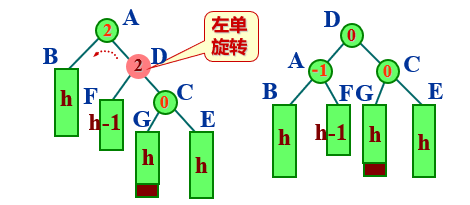
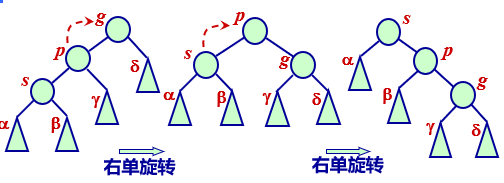
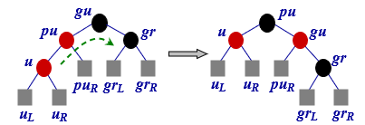

# 第7章 搜索结构

## 静态搜索表

所谓搜索，就是在数据集合中寻找满足某种条件的数据对象。

实施搜索时有两种不同的环境。

静态环境，搜索结构在插入和删除等操作的前后不发生改变。

动态环境，为保持较高的搜索效率, 搜索结构在执行插入和删除等操作的前后将自动进行调整，结构可能发生变化。

### 使用监视哨的顺序搜索算法 

```c++
int seqSearch(const int x)
{
    int i = 0;
    
    while (i < length) {
        if (elements[i] == x)
        	return i;
     	return i + 1;
    }
    return -1;
}

int seqSearch(const int x, int i)
{
    if (i >= length)
        return -1;
    else if (element[i] == x)
        return i + 1;
    else 
        return seqSearch(x, i + 1);
}
```

### 折半搜索算法

```c++
int binarySearch(const int x)
{
    int high = length - 1, low = 0, mid;

    while (low <= high) {
        mid = (low + high) / 2;
        if (x > elements[mid])
            low = mid + 1;
        else if (x < elements[mid])
            high = mid - 1;
        else
            return mid + 1;
    }
    return -1
};
```

## 二叉搜索树

二叉搜索树或者是一棵空树，或者是具有下列性质的二叉树：

每个结点都有一个作为搜索依据的关键码(key)，所有结点的关键码互不相同。

- 左子树（如果非空）上所有结点的关键码都小于根结点的关键码。

- 右子树（如果非空）上所有结点的关键码都大于根结点的关键码。

左子树和右子树也是二叉搜索树。


### 搜索算法

在二叉搜索树上进行搜索，是一个从根结点开始，沿某一个分支逐层向下进行比较判等的过程。它可以是一个递归的过程。

```c++
BSTNode* BSTree::search(const int x, BSTNode* ptr)
{
    if (ptr == nullptr)
        return nullptr;
    else if (x < ptr->data)
        return search(x, ptr->left);
    else if (x > ptr->data)
        return search(x, ptr->right);
    else
        return ptr;
}
```

### 插入算法

```c++
bool BSTree::insert(const int& val, BSTNode* ptr)
{
    if (ptr == nullptr) {
        ptr = new BSTNode(val);
        if (ptr == nullptr) {
            cerr << "Out of space" << endl;
            exit(1);
        }
        return true;
    } else if (val < ptr->data)
        insert(val, ptr->left);
    else if (val > ptr->data)
        insert(val, ptr->right);
    else
        return false;
}
```


### 删除算法


```c++
bool BSTree::remove(const int x, BSTNode*& ptr)
{
	BSTNode* temp;
    if (ptr != nullptr) {
        if (x < ptr->data)
            remove(x, ptr->left);
        else if (x > ptr->data)
            remove(x, ptr->right);
        else if (ptr->left != nullptr && ptr->right != nulptr) { // ptr指示关键码为x的结点，它有两个子女
        	temp = ptr->right;
            while (temp->left != nullptr) {
                temp = temp->left;
            }
            ptr->data = temp->data; // 用该结点数据代替根结点数据
            remove(ptr->data, ptr->right);
        } else { // ptr指示关键码为x的结点有一个子女
            temp = ptr;
            if (ptr->left == nullptr)
                ptr = ptr->right;
            else
                ptr = ptr->left;
            delete temp;
            return true;
        }
    }
    return false;
}
```

## 最优二叉搜索树

### 判定树


在判定树中， ○表示内部结点，包含了关键码集合中的某一个关键码；□表示外部结点，代表各关键码间隔中的不在关键码集合中的关键码。

一棵判定树上的搜索成功的平均搜索长度*ASL**succ*可以定义为该树所有内部结点上的搜索概率*p*[*i*]与搜索该结点时所需的关键码比较次数*c*[*i*] (= *l*[*i*], 即结点所在层次) 乘积之和：

$ASL_{succ}=\sum_{i=1}^np[i]l[i]$

### 最优二叉搜索树

在相等搜索概率的情形下，因为所有内、外部结点的搜索概率都相等，把它们的权值都视为1。有 *n* 个内部结点的最优二叉搜索树应为完全二叉树或理想平衡树。


## AVL树

一棵 AVL 树或者是空树，或者是具有下列性质的二叉搜索树：它的左子树和右子树都是 AVL 树，且左子树和右子树的高度之差的绝对值不超过1。

### 结点的平衡因子

每个结点附加一个数字，给出该结点右子树的高度减去左子树的高度所得的高度差，这个数字即为结点的平衡因子bf。 

AVL树任一结点平衡因子只能取 -1, 0, 1。

如果一个结点的平衡因子的绝对值大于1，则这棵二叉搜索树就失去了平衡，不再是AVL树。

### 类定义

```c++
struct AVLNode {
    int bf;
    int data;
    AVLNode* left, *right;
    AVLNode(int data, AVLNode* l = nullptr, AVLNode* r = nullptr): data(data), left(l), right(r) {}
};
```

### 平衡化旋转

如果在一棵平衡的二叉搜索树中插入一个新结点，造成了不平衡。此时必须调整树的结构，使之平衡化。

平衡化旋转有两类：单旋转 (左旋和右旋)和双旋转 (左平衡和右平衡)。

每插入一个新结点时, AVL 树中相关结点的平衡状态会发生改变。因此,  在插入一 个新结点后，需要从插入位置沿通向根的路径回溯，检查各结点的平衡因子。


#### 左单旋转RR


```c++
// 右子树比左子树高: 做左单旋转后新根在ptr
void AVLTree::rotateL(AVLNode*& ptr)
{
   AVLNode* subL = ptr;
    ptr = subL->right;
    ptr->left = subL;
   	subL->right = ptr->left;
    ptr->bf = subL->bf = 0;
}
```

#### 右单旋转LL


```c++
void AVLTree::rotateR(AVLNode*& ptr)
{
    AVLNode* subR = ptr;
    ptr = subR->left;
    subR->left = ptr->right;
    ptr->right = subR;
    ptr->bf = subR->bf = 0;
}
```

#### 先左单后右单旋转RL


```c++
void AVLTree::rotateLR(AVLTree*& ptr)
{
	ptr->left = rotateL(ptr->left);
    ptr = rotateR(ptr);
}
```

#### 先右单后左单旋转LR




```c++
void AVLTree::rotateRL(AVLNode** ptr)
{
    ptr->right = rotateR(r->right);
    ptr = rotateL(ptr);
}
```

### 插入算法

结点pr的平衡因子的绝对值|bf| = 2。说明新结点在较高的子树上插入，造成了不平衡，需要做平衡化旋转。此时可进一步分2种情况讨论：

1. 结点pr的平衡因子为0。说明刚才是在pr的较矮的子树上插入了新结点，此时不需做平衡化处理，返回主程序。子树的高度不变。
2. 结点pr的平衡因子的绝对值|bf| = 1。说明插入前pr的平衡因子是0，插入新结点后，以pr为根的子树不需平衡化旋转。但该子树高度增加，还需从结点pr向根方向回溯，继续考查结点pr双亲(pr = Parent(pr))的平衡状态。
3. 若结点pr的bf = 2，说明右子树高，结合其右子女q 的bf分别处理：

- 若q的bf为1，执行左单旋转。

  

- 若q的bf为-1，执行先右后左双旋转。

  

3. 若结点pr的bf = -2，说明左子树高，结合其左子女q 的bf分别处理：

- 若q的bf为-1，执行右单旋转。

- 若q的bf为1，执行先左后右双旋转。


### 删除算法

1. 如果被删结点*x*最多只有一个子女，可做简单删除:

   - 将结点*x*从树中删去。

   - 因为结点*x*最多有一个子女，可以简单地把*x*的双亲中原来指向*x*的指针改指到这个子女结点；

   - 如果结点*x*没有子女，*x*双亲原来指向*x*的指针置为NULL。

   - 将原来以结点*x*为根的子树的高度减1。

   

   

2. 如果被删结点 *x* 有两个子女：

   搜索 *x* 在中序次序下的直接前驱 *y* (同样可以找直接后继)。

   把结点 *y* 的内容传送给结点 *x*，现在问题转移到删除结点 *y*。把结点 *y* 当作被删结点*x*。

   由于结点 *y* 最多有一个子女，可以简单地用 给出的方法进行删除。必须沿结点 *x* 通向根的路径反向追踪高度的变化对路径上各个结点的影响。

   

> 二叉搜索树适合于组织在内存中的较小的索引(或目录)。对于存放在外存中的较大的文件系统，用二叉搜索树来组织索引不太合适。
>
> 在文件检索系统中大量使用的是用B树或B+树做文件索引。


在AVL树删除一个结点并做平衡化旋转所需时间为 $O(log_2n)$。

## 伸展树

伸展树、AVL树、并查集的用双亲表示的树，都属于自调整数据结构（self-adjusting data structure）。

### 基本思想

- 单一旋转，即将经常访问的结点最终上移到靠近根的地方，使以后的访问更快。
- 移动到根部：假设正访问的结点将以很高的概率再次被访问，对它反复进行子女―父结点旋转，直到被访问的结点位于根部为止。

### 旋转方式

1. 被访问结点 *s* 的父结点 *p* 是根结点。此时执行单旋转。在保持二叉搜索树特性的情况下，结点 *s* 成为新的根，原来的根 *p* 成为它的子女结点。

   

2. 同构形状（homogeneous configuration）。结点 *s* 是其父结点 *p* 的左子女，结点 *p* 又是其父结点 *g* 的左子女(／)。或者结点 *s* 是其父结点 *p* 的右子女，结点 *p* 又是其父结点*g* 的右子女(＼)。此时执行一字形旋转 (zigzig rotation)。

   

3. 异构的形状（heterogeneous configuration）。结点 *s* 是其父结点 *p* 的左子女，结点 *p* 又是其父结点 *g* 的右子女(＞)。或结点 *s* 是其父结点 *p* 的右子女，结点 *p* 又是其父结点 *g* 的左子女(＜)。此时执行之字形旋转(zigzag rotation)。

   


> 从伸展树中删除一个结点的操作也与二叉搜索树相同，但需要把被删结点的父结点展开到根结点。
>
> 伸展树与AVL树在操作上稍有不同。伸展树的调整与结点被访问（包括搜索、插入、删除）的频率有关，能够进行更合理的调整。而AVL树的结构调整只与插入、删除的顺序有关，与访问的频率无关。

## 红黑树

红黑树是一棵二叉搜索树：树中的每一个结点的颜色不是黑色就是红色。可以把一棵红黑树视为一棵扩充二叉树，用外部结点表示空指针。其特性描述如下：

特性1：根结点和所有外部结点的颜色是黑色。

特性2：从根结点到外部结点的途中没有连续两个结点的颜色是**红色**。

特性3：所有从根到外部结点的路径上都有相同数目的黑色结点。 

从红黑树中任一结点 *x* 出发(不包括结点 *x* )，到达一个外部结点的任一路径上的黑结点个数叫做结点 *x* 的黑高度，称为结点的阶(rank)，记作 *bh*(*x*)。红黑树的黑高度定义为其根结点的黑高度。


2  设 *h* 是一棵红黑树的高度( 不包括外部结点)，*n* 是树中内部结点的个数，*r* 是根结点的黑高度，则以下关系式成立：

- $h\leq 2r$
- $n\geq 2^r-1$
- $h\leq 2log_2(n+1)$

> 由于红黑树的高度最大为$2log_2(n+1)$，所以搜索、插入、删除操作的时间复杂性为$O(log2_n)$。注意，最差情况下的红黑树的高度大于最差情况下具有相同结点个数的AVL树的高度（近似于$1.44*log_2(n+2))$。

### 搜索算法

由于每一棵红黑树都是二叉搜索树，可以使用二叉搜索树的算法进行搜索。在搜索过程中不需使用颜色信息。

对普通二叉搜索树进行搜索的时间复杂性为O(*h*)，对于红黑树则为$O(log_2n)$。因为在搜索二叉搜索树、AVL树和红黑树时使用了相同算法。在最差情况下AVL树的高度最小，因此，在那些以搜索操作为主的应用程序中，最差情况下AVL树能获得最优时间复杂性。 

### 插入算法

1. 如果插入前是空树，则那么新元素将成为根结点，根据特征1，根结点必须染成黑色。

   

2. 如果插入前树非空，若新结点被染成黑色，将违反红黑树的特性3，所有从根到外部结点的路径上的黑色结点个数不等。因此，新插入的结点将染成红色，但这又可能违反红黑树的特性2，出现连续两个红色结点，因此需要重新平衡。

   

   设新插入的结点为*u*，它的父结点和祖父结点分别是*pu*和*gu*，现在来考查不平衡的类型。若*pu*是黑色结点，则特性2没有破坏，结束重新平衡的过程。若*pu*是红色结点，则出现连续两个红色结点的情形，这时还要考查*pu*的兄弟结点。

   - 如果*pu*的兄弟结点*gr*是红色结点，此时结点*pu*的父结点*gu*是黑色结点，它有两个红色子女结点。交换结点*gu*和它的子女结点的颜色，将可能破坏红黑树特性2的红色结点上移。

     

   - 如果*pu*的兄弟结点*gr*是黑色结点，此时又有两种情况。

     - *u*是*pu*的左子女，*pu*是*gu*的左子女。在这种情况下只要做一次**右单旋转**，交换一下*pu*和*gu*的颜色，就可恢复红黑树的特性，并结束重新平衡过程。

       

     -  *u*是*pu*的右子女，*pu*是*gu*的左子女。在这种情况下做一次**先左后右**的双旋转，再交换一下*u*与*gu*的颜色，就可恢复红黑树的特性，结束重新平衡过程。 

       

针对上述两种情况，还有镜像情况，即*pu*是*gu*的右子女时，当*u*是*pu*的右子女则做左单旋转，当*u*是*pu*的左子女则做先右后左的双旋转。

### 删除算法

在红黑树中真正删除的结点应是叶结点或只有一个子女的结点。

1. 如果被删结点*p*是红色的，删去它树中各结点的黑高度都没有改变，也不会出现连续两个红色结点，红黑树的特性仍然保持，不需执行重新平衡过程。

   

2. 如果被删结点*p*是**黑**色的，一旦删去它，红黑树将不满足特性3的要求，因为在这条路径上黑色结点少了一个，从根到外部结点的黑高度将会降低。

   - 设*u*是被删结点*p*的唯一子女结点。如果结点*u*是**红**色结点，可以把*u*染成黑色，从而恢复红黑树的特性。 

     

   - 如果被删结点*p*是**黑**色结点，它的唯一的子女结点*u*也是黑色结点，可先将*p*从链中摘下，将结点*u*链到其祖父*g*的下面。

     结点*v*是黑色结点，若设结点*v*的左子女结点为*w*。根据*w*的颜色分别讨论： 

     - 结点*w*是**红**色结点，作一次右单旋转，将*w*、*g*染成黑色，*v*染成红色，就可消除结点*u*的双重黑色，恢复红黑树的性质。

       

     - 结点*w*是**黑**色结点，还要看结点*w*的右兄弟结点*r*。根据*r*的颜色，分两种情况：

       - 结点*r*是红色结点，可通过一次先左后右的双旋转，并将*g*染成黑色，就可消除*u*的双重黑色，恢复红黑树的特性。

         

       - 结点*r*是黑色结点，这时还要看结点*g*的颜色。

         - 如果*g*是红色结点，只要交换结点*g*和其子女结点*v*的颜色就能恢复红黑树的特性。

           

         - 如果*g*是黑色结点，可做一次右单旋转，将结点*v*上升并染成双重黑色，从而消除结点*u*的双重黑色，将双重黑色结点向根的方向转移。

           

3. 结点*v*是红色结点。考查*v*的右子女结点*r*。根据红黑树的特性2，*r*一定是黑色结点。再看结点*r*的左子女结点*s*。根据*s*的颜色，可以分为两种情况讨论。

   - 结点*s*是红色结点。通过一次先左后右双旋转，让*r*上升，使包含*u*的路径的黑高度增1，从而消除结点*u*的双重黑色，恢复红黑树的特性。 

     

   - 结点*s*是黑色结点，再看结点s的右兄弟结点*t*。根据结点*t*的颜色又可分为两种情况进行讨论。

     - 若结点*t*为红色结点，先以*t*为旋转轴，做左单旋转，以*t*替补*r*的位置；然后再以*t*为旋转轴，做一次先左后右的双旋转，可消除结点*u*的双重黑色，恢复红黑树特性。 

       

     - 若结点*t*为黑色结点，以*v*为旋转轴，做一次右单旋转，并改变*v*和*r*的颜色，即可消除结点*u*的双重黑色，恢复红黑树的特色。

       