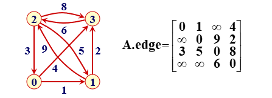
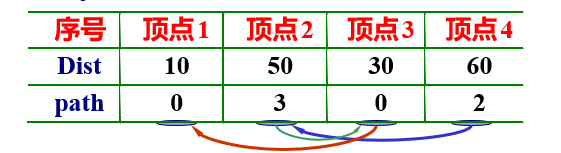

# 第8章 图

## 图的基本概念

图是由顶点集合(vertex)及顶点间的关系集合组成的一种数据结构：

$Graph=(V,E)$

其中$V=\{x|x\in Object\}$是顶点的有穷非空集合。

$E=\{<x,y>|x,y\in V,Path(x,y)\}$是顶点之间关系的有穷集合，也叫做边(edge)集合。*Path* (*x*, *y*)表示从 *x* 到 *y* 的一条单向通路, 它是有方向的。

**有向图与无向图**  在有向图中，顶点对 <x, y> 是有序的。在无向图中，顶点对(x, y)是无序的。

**完全图**  若有 *n* 个顶点的无向图有 *n*(*n*-1)/2（$C_n^2$） 条边, 则此图为完全无向图。有 *n* 个顶点的有向图有*n*(*n-*1) 条边, 则此图为完全有向图。


**邻接顶点**   如果 (*u*, *v*) 是 *E*(G) 中的一条边，则称 *u* 与 *v* 互为邻接顶点。

**子图**  设有两个图G＝(*V*, *E*) 和G'＝(*V*', *E*')。若*V* '∈ *V* 且*E*'∈*E*, 则称图G'是图G的子图。

**权**  某些图的边具有与它相关的数, 称之为权。这种带权图叫做**网络**。

**路径长度**  非带权图的路径长度是指此路径上边的条数。带权图的路径长度是指路径上各边的权之和。

**简单路径**  若路径上各顶点 *v*1, *v*2, ..., *v*m 均不 互相重复, 则称这样的路径为简单路径。

**回路**  若路径上第一个顶点 *v*1 与最后一个顶点*vm* 重合, 则称这样的路径为回路或环。

**连通图与连通分量**  在**无向图**中, 若从顶点*v*1到顶点*v*2有路径, 则称顶点*v*1与*v*2是连通的。如果图中任意一对顶点都是连通的, 则称此图是连通图。非连通图的**极大连通子图**叫做连通分量。

**强连通图与强连通分量**  在**有向图**中, 若对于每一对顶点*v*i和*v*j, 都存在一条从*v*i到*v*j和从*v*j到*v*i的路径, 则称此图是强连通图。非强连通图的极大强连通子图叫做强连通分量。

**生成树**  一个连通图的生成树是其极小连通子图，在 *n* 个顶点的情形下，有 *n*-1 条边。

## 图的存储表示

### 模板基类定义

```c++
class Graph {
protected:
    int maxVertices;
    int numEdges;
    int numVertices;
public:
    Graph (int sz = DefaultVertices);  	//构造函数
    ～Graph();				//析构函数
    bool GraphEmpty () const 		//判图空否
    { return numEdges == 0; }	
    int NumberOfVertices () { return numVertices; }
    //返回当前顶点数
    int NumberOfEdges () { return numEdges; }
    //返回当前边数
    virtual T getValue (int i);		//取顶点 i 的值
    virtual E getWeight (int v1, int v2);  //取边上权值
    virtual int getFirstNeighbor (int v);
    //取顶点 v 的第一个邻接顶点
    virtual int getNextNeighbor (int v, int w);
    //取邻接顶点 w 的下一邻接顶点
    virtual bool insertVertex (const int vertex);
    //插入一个顶点vertex
    virtual bool insertEdge (int v1, int v2, int cost);
    //插入边(v1,v2), 权为cost
    virtual bool removeVertex (int v);	
    //删去顶点 v 和所有与相关联边
    virtual bool removeEdge (int v1, int v2);	
    //在图中删去边(v1,v2)
};
```

### 邻接矩阵

在图的邻接矩阵表示中，有一个记录各个顶点信息的顶点表，还有一个表示各个顶点之间关系的邻接矩阵。

设图$A=(V,E)$是一个有$n$个顶点的图，图的邻接矩阵是一个二维数组`A.edge[n][n]`，定义：

$$A.edge[i][i]=\begin{cases}1,\qquad if <i,j>\in E \quad or (i,j) \in E\\0,\qquad else\end{cases}$$


无向图的邻接矩阵是对称的;

有向图的邻接矩阵可能是不对称的。

网络的邻接矩阵：




#### 类定义

```c++
class Graphmtx {
private:
    int* verticesList;
    int** edge;
    int getVertexPos(int vertex) 
    {
        for (int i = 0; i < numVerticrs; i++)
            if (verticrsList[i] == vertex)
                return i;
        return -1;
    }
};
```

#### 构造函数

```c++
Graphmtx::Graphmtx(int sz)
{
    maxVertices = sz;
    numVertices = numEdge = 0;
    int i, j;
    verticesList = new int[maxVertices];
    edge = (int**)new int*[maxVertices];
    for (i = 0; i < maxVertices; i++)
        edge[i] = new int[maxVertices];
    for (i = 0; i < maxVertices; i++)
        for (j = 0; j < maxVertices; j++)
            edge[i][j] == (i == j) ? 0 : maxWeight;
};
```

#### 查找算法

```c++
// 给出顶点位置为v的第一个邻接顶点的位置, 如果找不到, 则函数返回-1
int Graphmtx::getFirstNeighbor(int v) 
{
    if (v != -1) {
 	   for (int col = 0; col < numVertices; col++)
           if (edge[v][col] && edge[v][col] < maxWeight)   
               return col;
   	}
   	return -1;
};

// 给出顶点v和某邻接顶点w的下一个邻接顶点
int Graphmtx::getNextNeighbor(int v, int w)
{
    if (v != -1 && w != -1) {
        for (int col = w + 1; col < numVertices; col++)
            if (edge[v][col] && edge[v][col] < maxWeight)
                return col;
    }
    return -1;
}
```

### 邻接表

邻接表是邻接矩阵的改进形式。为此需要把邻接矩阵的各行分别组织为一个单链表。

在邻接表中，同一个顶点发出的边链接在同一个边链表中，每一个链结点代表一条边（边结点），结点中有另一顶点的下标`dest`和指针`link`。对于带权图，边结点中还要保存该边的权值`cost`。

#### 无向图的邻接表


统计某顶点对应边链表中结点个数，可得该顶点的度。

某条边(vi, vj)在邻接表中有两个边结点，分别在第 i 个顶点和第 j 个顶点对应的边链表中。

#### 有向图的邻接表和逆邻接表


#### 网络的邻接表


当 *e* 远远小于 *n*2 时，可以节省大量的存储空间。此外，把同一个顶点的所有边链接在一个单链表中，也使得图的操作更为便捷。 

#### 类定义

```c++
// 边结点定义
struct Edge {
    int dest;
    int cost;
    Edge* link;
    Edge() {}
    Edge(int num, int cost): dest(num), weight(cost), link(nullptr) {}
    bool operator!=(Edge& r) const
    {
        return dest != r.dest;
    }
};

// 顶点定义
struct Vertex {
    int data;
    Edge* adj; // 边链表的头指针
};

class GrapLink {
private:
    Vertex* nodeTable;
    int getVertexPos (const T vertx) {	
        //给出顶点vertex在图中的位置
	    for (int i = 0; i < numVertices; i++)
	        if (NodeTable[i].data == vertx) return i;
 	    return -1; 
};
```

#### 构造函数

```c++
GraphLink::GrapLink(int sz) {
    maxVertices = sz;
    numVertices = 0;  
    numEdges = 0;
    NodeTable = new Vertex[maxVertices]; //创建顶点表数组
    if (NodeTable == NULL) {
        cerr << "存储分配错！" << endl;  exit(1); 
    }
    for (int i = 0; i < maxVertices; i++) 
        NodeTable[i].adj = nullptr;
}
```

#### 析构函数

```c++
GraphLink::~Graphlnk()
{
    for (int i = 0; i < numVertices; i++) {
        Edge* p = nodeTable[i].adj;
        while (p != nullptr) {
            nodeTable[i].adj = p->link;
            delete p;
            p = nodeTable[i].adj;
        }
    }
    delete[] nodeTable;
}
```

#### 查找算法

```c++
//给出顶点位置为 v 的第一个邻接顶点的位置, 如果找不到, 则函数返回-1
int GraphLink::getFirsrNeighbor(int v)
{
    if (v != -1) {
        Edge* p = nodeTable[i].adj;
        if (p != nullptr)
            return p->dest;
    }
    return -1;
};

//给出顶点v的邻接顶点w的下一个邻接顶点的位置,若没有下一个邻接顶点, 则函数返回-1
int GraphLink::getNextNeighbor(int v, int w)
{
    if (v != -1) {
        Edge* p = nodeTable[v].adj;
        while (p != nullptr && p->dest != w) 
            p = p->link;
        if (p != nullptr && p->link != nullptr)
            return p->link->dest;
    }
    return -1;
}
```

### 邻接多重表

在邻接多重表中, 每一条边只有一个边结点。为有关边的处理提供了方便。

#### 无向图的情形


其中, `mark`是记录是否处理过的标记；`vertex1`和`vertex2`是该边两顶点位置。`path1`域是链接指针, 指向下一条依附顶点`vertex1`的边；`path2` 是指向下一条依附顶点`vertex2`的边链接指针。


#### 有向图的情形


## 图的遍历与连通性

从已给的连通图中某一顶点出发，沿着一些边访遍图中所有的顶点，且使每个顶点仅被访问一次，就叫做图的遍历 (Graph Traversal)。

图中可能存在回路，且图的任一顶点都可能与其它顶点相通，在访问完某个顶点之后可能会沿着某些边又回到了曾经访问过的顶点。为了避免重复访问，可设置一个标志顶点是否被访问过的辅助数组 `visited[]`。辅助数组visited[ ]的初始状态为 0, 在图的遍历过程中, 一旦某一个顶点 *i* 被访问, 就立即让visited[i]为 1, 防止它被多次访问。

### 深度优先搜索


```c++
// 从顶点v出发对图G进行深度优先遍历的主过程
void dfs(Grap& g, const int& v)
{
    int i, loc, n = g.numberOfVertices();
    bool* visit = new bool[n];
    for (i = 0; i < n; i++)
        visit[i] = false;
    loc = g.getVertexPos(v);
    dfs(g, loc, visited);
    delete[] visited;
}

void dfs(Graph& g, int v, bool visited[])
{
    cout << g.getValue() << ' ';
    visit[v] = true;
    int w = g.getFirstNeighbor(v);
    
    while (w != -1) { // 若邻接顶点w存在
        if (!visit[w])
            dfs(g, w, visited);
        w = w.getNextNeighbor(v, w);
    }
};
```

### 广度优先搜索


```c++
void bfs(Graph& g, const int& v)
{
    int i, n = g.getNumberOfVertices();
    bool* visited = new bool[n];
    
    for (i = 0; i < n; i++)
        visited[i] = false;
    int loc = g.getValue(v);
    cout << g.getValue(loc) << ' ';
    
    queue<int> q;
    q.enqueue(loc);
    while (!q.isEmpty()) {
        q.deQueue(loc);
        w = g.getFirstNeighbor(loc);
        while (w != -1) {
            if (!visited[w]) {
                cout << g.getValue[w] << ' ';
                visited[w] = true;
                q.enQueue(w); // 顶点w进入队列
            }
        	w = g.getNextWeight(loc, w); // 找顶点loc的下一个邻接顶点
        }
    }
    delete[] visited;
}
```

### 连通分量

当无向图为非连通图时，从图中某一顶点出发，利用深度优先搜索算法或广度优先搜索算法不可能遍历到图中的所有顶点，只能访问到该顶点所在最大连通子图（连通分量）的所有顶点。


```c++
// 通过DFS，找出无向图的所有连通分量
void Components(Graph* g)
{
    int i, n = g.NumberOfVertices();
    bool* visited = new bool[n];
    
    for (i = 0; i < n; i++)
        visited[i] = false;
    for (i = 0; i < n; i++)
        if (!visited[i]) {
            dfs(g, i, visited);
            outputNewComponent();
        }
    delete[] visited;
}
```

### 深度优先生成森林算法


```c++
void dfsForest(Grap& g, Tree& f)
{
	TreeNode* root, *subT;
    int n = g.getNumberOfVerteces();
    static int* visited = new int[n];
    
    for (int i = 0; i < n; i++)
        visited[i] = 0;
    for (int i = 0; i < n; i++)
        if (!visited[i]) {
            if (f.isEmpty())
                subT = rt = r.buildRoot(g.getValue(i));
            else 
                subT = f.insertRightSibling(subT, g.getValue(i));
            dfsTree(g, f, subT, visited);
        }
}

void dfsTree(Graph& g, Tree& f, TreeNodee* rt, int v, int visited[])
{
    TreeNode* p; 
    visited[v] = 1; // 顶点v作访问过标志
    int w = g.getFirstNeighbor(v); // 取顶点v的第一个邻接顶点w
    int firstChild = 1; // 第一个未访问子女是v的左子女
    while (w != -1) { 
        if (!visited[w]) { // w未访问过, 将成为v的子女
            if (firstChild) {
                p = f.insertleftChild(rt, g.getValue(w)); // p插入为rt的左子女
                firstChild = 0;
            } else // p插入rt的右子树
            p = f.insertRightSibling(p, g.getValue(w)); // 建右兄弟
            dfsTree(g, f, p, w, visited);
        } 
     	w = g.getNextNeighbor(v, w);
    } // 回到 while 判邻接顶点 w 存在
}
```

### 重连通分量

在无向连通图G中, 当且仅当删去G中的顶点*v*及所有依附于*v*的所有边后, 可将图分割成两个或两个以上的连通分量，则称顶点*v*为关节点。

没有关节点的连通图叫做重连通图。在重连通图上, 任何一对顶点之间至少存在有两条路径, 在删去某个顶点及与该顶点相关联的边时, 也不破坏图的连通性。

深度优先生成树的根是关节点的充要条件是它至少有两个子女。

其它顶点 *u* 是关节点的充要条件是它至少有一个子女 *w*, 从 *w* 出发, 不能通过 *w*、*w* 的子孙及一条回边所组成的路径到达 *u* 的祖先。


## 最小生成树

使用不同的遍历图的方法，可以得到不同的生成树；从不同的顶点出发，也可能得到不同的生成树。

**构造最小生成树的准则**

- 必须使用且仅使用该网络中的 *n*-1 条边来联结网络中的 *n* 个顶点；

- 不能使用产生回路的边；

- 各边上的权值的总和达到最小。

### Kruskal算法

#### 基本思想

 设有一个有 *n* 个顶点的连通网络 $N = \{ V,E \}$, 最初先构造一个只有 *n* 个顶点, 没有边的非连通图 $T = \{V,\phi\}$, 图中每个顶点自成一个连通分量。当在 *E* 中选到一条具有**最小权值**的边时, 若该边的两个顶点落在不同的连通分量上，则将此边加入到 *T* 中; 否则将此边舍去，重新选择一条权值最小的边。如此重复下去, 直到所有顶点在同一个连通分量上为止。

#### 算法框架

利用最小堆(MinHeap)和并查集(DisjointSets)来实现克鲁斯卡尔算法。

1. 利用最小堆来存放E中的所有的边, 堆中每个结点的格式为：


2. 在构造最小生成树过程中, 利用并查集的运算检查依附一条边的两顶点`tail`、`head` 是否在同一连通分量 (即并查集的同一个子集合) 上, 是则舍去这条边；否则将此边加入*T*, 同时将这两个顶点放在同一个连通分量上。
3. 随着各边逐步加入到最小生成树的边集合中,  各连通分量也在逐步合并,  直到形成一个连通分量为止。

#### 构造过程


#### 类定义

```c++
struct MSTEdgeNode {
    int tail, head; // 两顶点位置
    int cost; // 边的权值
    MSTEdgeNode(): tail(-1), head(-1), cost(0) {}
};

class MinSpanTree {
protected:
    MSTEdgeNode* edges;
    int maxSize, n;
};
```

#### 算法实现

```c++
void Kruskal(Graph& g, MinSpanTree& MST)
{
	MSTEdgeNode ed;
    int u, v, count;
    int n = g.numberOfVertices();
    int m = g.numberOfEdges();
    
    MinHeap<MSTNode> heap(m);
    UFSets f(n);
    
    for (u = 0; u < n; u++)
        for (v = u + 1; v < n; v++) 
            if (g.getWeight(u, v) != maxValue) { // 连通
                ed.tail = u;
                ed.head = v;
                ed.cost = g.getWeight(u, v);
                heap.insert(ed);
            }
    count = 1; // 最小生成树边数计数
    while (count < n) { // 反复执行, 取n-1条边
        h.remove(ed);
        u = f.find(ed.tail);
        v = f.find(ed.head);
        if (u != v) { // 不是同一集合,不连通
            f.union(u, v); // 合并,连通 
            MST.insert(ed);
            count++;
        }
    }
};
```

### Prim算法

#### 基本思想

从连通网络 $N=\{V,E\}$中的某一顶点 $u_0$ 出发, 选择与它关联的具有最小权值的边 $(u_0, v)$, 将其顶点加入到生成树顶点集合*U*中。

 以后每一步从一个顶点在集合*U*中, 而另一个顶点不在集合*U*中的各条边中选择权值最小的边(*u*, *v*), 把它的顶点加入到集合*U*中。如此继续下去, 直到网络中的所有顶点都加入到生成树顶点集合*U*中为止。

#### 算法流程


#### 算法实现

```c++
void Prim(Graph& g, const int u0, MinSpanTree& MST)
{
    MSTEdgeNode* ed;
    int i, u, v, count;
    int n = g.numberOfVertices();
    int m = g.numberOfEdges();
    int u = g.getVertexPos(u0); // 起始顶点号
    MinHeap<MSTNode(m);
    bool vmst = new bool[n];
    
    for (i = 0; i < n; i++)
        vmst[i] = false;
    vmst[u] = true; // 将u加入生成树
    count = 1;
    do {
        v = g.getFirstNeighbor(u);
        while (v != -1) { // 检测u所有邻接顶点
            if (!vmst[v]) { // v不在mst中
                ed.tail = u;
                ed.head = v;
                ed.cost = g.getWeight(u, v);
                h.insert(ed);
            } // 堆中存所有u在mst中, v不在mst中的边
            v.getNextNeighbor(u, v);
        }
        while (!h.isEmpty() && count < n) {
            h.remove(ed);
            if (!vmst[ed.head]) {
                MST.insert(ed);
                u = ed.head;
                vmst[u] = true;
                count++;
                break;
            }
        }
    } while (count < n);
}
```

Prim算法适用于边稠密的网络。

Kruskal算法不仅适合于边稠密的情形，也适合于边稀疏的情形。

注意：当各边有相同权值时，由于选择的随意性，产生的生成树可能不唯一。

## 最短路径

最短路径问题：如果从图中某一顶点（称为源点）另一顶点（称为终点）的路径可能不止一条，如何找到一条路径使得沿此路径上各边上的权值总和达到最小。

问题解法：

 边上权值**非负**情形的**单源**最短路径问题

​        — Dijkstra算法  

 边上权值为**任意**值的**单源**最短路径问题

​        — Bellman和Ford算法 

所有顶点之间的最短路径

​        — Floyd算法  

### Dijkstra算法  

问题的提法：给定一个带权有向图*D*与源点 *v*，求从*v*到*D*中其他顶点的最短路径。限定各边上的权值大于或等于0。

为求得这些最短路径, Dijkstra提出按路径长度的递增次序,  逐步产生最短路径的算法。首先求出长度最短的一条最短路径，再参照它求出长度次短的一条最短路径，依次类推，直到从顶点v到其它各顶点的最短路径全部求出为止。


引入辅助数组`dist`。它的每一个分量`dist[i]`表示当前找到的从源点$v_0$到终点 $v_i$ 的最短路径的长度。初始状态：

- 若从$v_0$到顶点$v_i$有边, 则`dist[i]`为该边的权值；

- 若从$v_0$到顶点$v_i$无边, 则`dist[i]`为$\infty$ 。

#### 算法流程

1. 初始化：

   $dist[j]=edge[0][j],\quad j=1,2,\dots,n-1$

2. 求出最短路径长度：

   $dist[k]=\min\{dist[i]\},i\in V-S$

3. 修改：$dist[i]=\min\{dist[i],dist[k]+edge[k][i],\quad i\in V-s\}$

4. 判断：

5. 若$S=V$，算法结束，否则转向2。

#### 算法实现

```c++
// Graph是一个带权有向图。dist[j], 0≤j<n, 是当前求到的从顶点v到顶点j的最短路径长度, path[j],0≤j<n, 存放求到的最短路径
void shortestPath(Graph& g, int v, int dist[], int path[])
{
    int n = g.numberOfVertices;
    bool* s = new bool[n]; // 最短路径的顶点集
    int i, j, k, w, min;
    
    for (i = 0; i < n; i++) {
        dist[i] = g.getWeight(v, i);
        s[i] = false;
        if (i != v && dist[i] < maxValue)
            path[i] = v;
        else
            path[i] = -1;
    }
    s[v] = true, dist[v] = 0;
    for (i = 0; i < n - 1; i++) { // 求解各顶点最短路径
        min = maxValue;
        int u = v; // 选不在S中具有最短路径的顶点u
        for (j = 0; j < n; j++)
            if (!s[j] && dist[j] < min) {
                u = j;
                min = dist[j];
            }
        	s[u] = true; // 将顶点u加入集合S
        for (k = 0; k < n; k++) {
            w = g.getWeight(u, k);
            if (!s[k] && w < maxValue && dist[u] + w < distl[k]) {
                dist[k] = dist[u] + w;
                path[k] = u;
            }
        }
    }
}
```


Dijkstra算法中各辅助数组的最终结果：



从表中读取源点0到终点*v*的最短路径的方法 : 举顶点4为例

 path[4] = 2 → path[2] = 3→path[3] = 0，反过来排列，得到路径 0, 3, 2, 4，这就是源点0到终点4的最短路径。

### Bellman-Ford算法

Bellman和Ford提出了从源点逐次绕过其他顶点，以缩短到达终点的最短路径长度的方法。该方法有一个限制条件，即要求图中不能包含有由带负权值的边组成的回路。


Bellman-Ford方法构造一个最短路径长度数组序列$dist^1[u], dist^2[u],\dots, dist^{n-1}[u]$。其中，

$dist^1[u]$是从源点*v*到终点*u*的只经过一条边的最短路径的长度，

​      $dist^1 [u]=edge[v][u]$

dist2 [*u*]是从源点*v*出发最多经过两条边到达终点*u*的最短路径长度。

算法的最终目的是计算出 $dist^{n-1}[u]$。可以用递推方式计算 $dist^k[u]$。

```c++
// 在有向带权图中有的边具有负的权值。从顶点v找到所有其他顶点的最短路径
void Bellman-Ford(& g, int v, int dist[], int path[]) 
{
    int w;  
    int i, k, u, n = g.NumberOfVertices();
    for (i = 0; i < n; i++) {        //计算dist1[i]
        dist[i] = g.getWeight(v, i);
        if (i != v && dist[i] < maxValue) path[i] = v;
        else path[i] = -1;
            for (k = 2; k < n; k++)     //计算dist2[i]到distn-1[i]
        		for (u = 0; u < n; u++)
                    if (u != v)
                        for (i = 0; i < n; i++) {
                            w = g.getWeight(i, u);
                      			if (w > 0 && w < maxValue &&
                                      dist[u] > dist[i]+w) {
                                dist[u] = dist[i]+w;
                                path[u] = i;
                            }
                        }
    }
}  
```

### Floyd算法

#### 基本思想

  定义一个n阶方阵序列：

​       $A^{(-1)}, A^{(0)},\dots, A^{(n-1)}$

  其中 $A^{(-1) }[i][j] = edge[i][j]$

​      $A^{(k)}[i][j] = \min\{A^{(k-1)}[i][j]\}$，

$A^{(0)} [i][j]$是从顶点$v_i$到$v_j$ , 中间顶点是$v_0$的最短路径长度;

$A^{(k)} [i][j]$是从顶点$v_i$ 到$v_j$ , 中间顶点的序号不大于$k$的最短路径的长度;

$A^{(n-1)}[i][j]$是从顶点$v_i$到$v_j$的最短路径长度。

#### 算法实现

```c++
//a[i][j]是顶点i和j之间的最短路径长度。path[i][j]是相应路径上顶点j的前一顶点的顶点号
void Floyd (Graph& g, iny a[][], int path[][]) 
{
    for (i = 0; i < n; i++)    	//矩阵a与path初始化
            for (j = 0; j < n; j++) {
                a[i][j] = g.getWeight(i, j);
                    if (i != j && a[i][j] < maxValue) 
                        path[i][j] = i;
                    else path[i][j] = 0;
            }
    for (k = 0; k < n; k++)
        // 针对每一个k, 产生a(k)及path(k)        
        for (i = 0; i < n; i++)
            for (j = 0; j < n; j++)
                if (a[i][k] + a[k][j] < a[i][j]) { 
                    a[i][j] = a[i][k] + a[k][j];   
                    path[i][j] = path[k][j]; 
                    //缩短路径长度, 绕过 k 到 j
                }
};        
```

> Floyd算法允许图中有带负权值的边，但不许有包含带负权值的边组成的回路。 

## 活动网络

计划、施工过程、生产流程、程序流程等都是“工程”。除了很小的工程外，一般都把工程分为若干个叫做“活动”的子工程。完成了这些活动，这个工程就可以完成。

### AOV网络

可以用有向图表示一个工程。在这种有向图中，用顶点表示活动，用有向边$<V_i,V_j>$表示活动$V_i$ 必须先于活动$V_j$ 进行。这种有向图叫做顶点表示活动的AOV网络 (Activity On Vertices)。 

在AOV网络中不能出现有向回路, 即有向环。如果出现了有向环，则意味着某项活动应以自己作为先决条件。

检测有向环的一种方法是对AOV网络构造它的拓扑有序序列。即将各个顶点 (代表各个活动)排列成一个**线性有序**的序列，使得AOV网络中所有应存在的前驱和后继关系都能得到满足。 


这种构造AOV网络全部顶点的拓扑有序序列的运算就叫做拓扑排序。如果通过拓扑排序能将AOV网络的所有顶点都排入一个拓扑有序的序列中, 则该网络中必定不会出现有向环。

### 拓扑排序

#### 算法流程

① 输入AOV网络。令 *n* 为顶点个数。 

② 在AOV网络中选一个没有直接前驱的顶点, 并输出之;

③ 从图中删去该顶点, 同时删去所有它发出的有向边;

④ 重复以上 ②、③步, 直到

- 全部顶点均已输出，拓扑有序序列形成，拓扑排序完成；或

- 图中还有未输出的顶点, 但已跳出处理循环。说明图中还剩下一些顶点, 它们都有直接前驱。这时网络中必存在有向环。


在邻接表中增设一个数组`count[]`，记录各顶点入度。入度为零的顶点即无前驱顶点。

在输入数据前, 顶点表`nodeTable[]`和入度数组`count[]`全部初始化。在输入数据时, 每输入一条边`<j, k>`, 就需要建立一个边结点, 并将它链入相应边链表中, 统计入度信息：

```c++
Edge* p = new Edge(k); // 建立边结点, dest 域赋为 k
p->link = nodeTable[j].adj;
nodeTable[j].adj = p; // 链入顶点j的边链表的前端
count[k]++; // 入度+1
```

#### 算法实现

```c++
void topologicalSort(Graph& g)
{
    int i, j, w, v;
    int top = -1;
    int n = g.numberOfVertices();
    int* count = new int[n];
    
    for (int i = 0; i < n; i++)
        count[i] = 0;
    cin >> i >> j;
    while (i > -1 && i < n && j > -1 && j < n) {
        g.insertEdge(i, j);
        count[j]++;
        cin >> i >> j;
    }
	for (i = 0; i < n; i++)
        if (count[i] == 0) { // 入度为零的顶点进栈
            count[i] = top; // 原栈顶在count[i]中
            top = i; // top 保存向新的栈顶
        }
    
    for (i = 0; i < n; i++) {
       	if (top == -1) {
            cout << "网络有回路" << endl;
            return;
        } else {
            v = top; // 出栈
            top = count[top]; // 转到次栈顶
            cout << g.getValue(v) << " " << endl;
            w = g.getFirstNeighnor(v);
            while (w != -1) {
                count[w]--;
                if (!count[w]) {
                    count[w] = top;
                    top = w;
                }
                w = g.getNextNeighbor(v, w);
            } // 一个顶点输出后，调整其邻接顶点入度
        } // 一个顶点输出后，调整其他邻接顶点的入度
    }
}
```

### AOE网络

如果在无有向环的带权有向图中, 用有向边表示一个工程中的活动 (Activity), 用边上权值表示活动持续时间 (Duration), 用顶点表示事件 (Event), 则这样的有向图叫做用边表示活动的网络, 简称 AOE ( Activity On Edges ) 网络。

AOE网络在某些工程估算方面非常有用。从源点到各个顶点, 以至从源点到汇点的有向路径可能不止一条。 这些路径的长度也可能不同。 完成不同路径的活动所需的时间虽然不同, 但只有各条路径上所有活动都完成了, 整个工程才算完成。

因此, 完成整个工程所需的时间取决于从源点到汇点的最长路径长度, 即在这条路径上所有活动的持续时间之和。这条路径长度最长的路径就叫做关键路径(Critical Path)。


#### 算法流程

- 事件$V_i$ 的最早可能开始时间*Ve*(*i*) ，是从源点$V_0$ 到顶点$V_i$ 的最长路径长度。

- 事件*Vi* 的最迟允许开始时间*Vl*[*i*]，是在保证汇点$V_{n-1}$ 在*Ve*[*n*-1] 时刻完成的前提 下，事件$V_i$ 的允许的最迟开始时间。

- 活动$a_k$的最早可能开始时间 *e*[*k*]，活动$a_k$ 的最迟允许开始时间 *l*[*k*]  。
- 时间余量：$l[k]-e[k]$

为求得*e*[*k*]与*l*[*k*], 需要先求得从源点*V*0到各个顶点*Vi* 的*Ve*[*i*]和*Vl*[*i*]。

从 *Ve*[0] = 0 开始，向前递推：

$Ve[j]=\max\{Ve[i]+dur(<V_i,V_j>)\}$


从Vl[n-1] = Ve[n-1]开始，反向递推：

$Vl[j]=\min\{Vl[k]-dur(<V_j.V_k>)\}$


#### 算法实现

```c++
void CriticalPath(graph& g) 
{
    int i, j, k;   
    int Ae, Al, dur;
    int n = g.NumberOfVertices();
    int *Ve = new int[n];  
    int *Vl = new int[n];
    for (i = 0; i < n; i++) Ve[i] = 0;
	for (i = 0; i < n; i++) {       	//正向计算Ve[]
        j = g.getFirstNeighbor(i);
        while (j != -1) {
            dur = g.getWeight (i, j);
            if (Ve[i]+dur > Ve[j]) 
                Ve[j] = Ve[i]+dur; 
            j = g.getNextNeighbor(i, j);
        }
    }
    Vl[n-1] = Ve[n-1];
    for (j = n-2; j > 0; j--) {       //逆向计算Vl[]
        k = g.getFirstNrighbor(j);
        while (k != -1) {
	        dur = G.getWeight (j, k); 
            if (Vl[k]-dur < Vl[j]) 
                Vl[j] = Vl[k]-dur;
            k = G.getNextNeighbor(j, k);        
	    }
    }
        for (i = 0; i < n; i++) {		//求各活动的e, l
        j = G.getFirstNeighbor (i);
        while (j != -1) {
            Ae = Ve[i];  Al = Vl[k]-G.getWeight(i, j);
	        if (Al == Ae) 
                cout << "<" << G.getValue(i) << ","
		              << G.getValue(j) << “>” 
                        << "是关键活动" << endl;
	   	  j = G.getNextNeighbor (i, j);
        }
    }
	delete [] Ve;  delete [] Vl;
}
```

