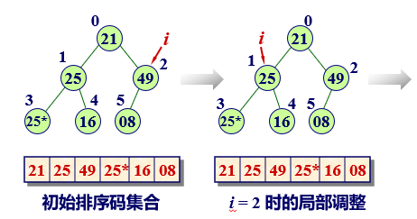
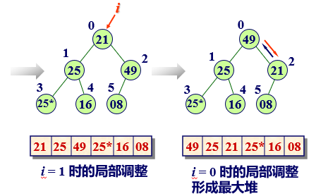
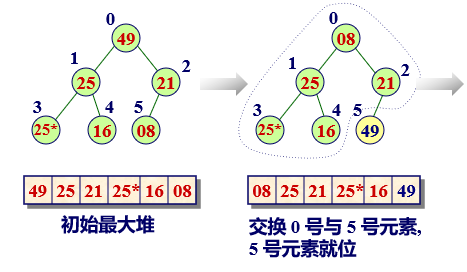
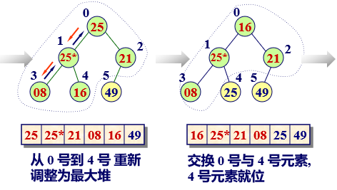
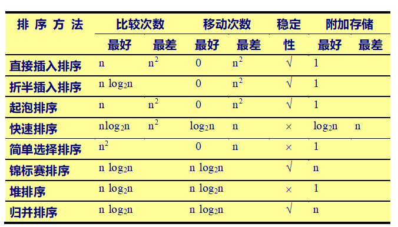

# 第9章 排序

## 概述

**排序**  将一组杂乱无章的数据按一定的规律顺次排列起来。

**数据表**(datalist)  它是待排序数据元素的有限集合。

**排序码**(key) 通常数据元素有多个属性域, 即多个数据成员组成, 其中有一个属性域可用来区分元素, 作为排序依据。该域即为排序码。每个数据表用哪个属性域作为排序码，要视具体的应用需要而定。

**排序算法的稳定性**  如果在元素序列中有两 个元素*r*[*i*]和*r*[*j*], 它们的排序码 *k*[*i*] *== k*[*j*] , 且在排序之前, 元素*r*[*i*]排在*r*[*j*]前面。如果在排序之后, 元素*r*[*i*]仍在元素*r*[*j*]的前面, 则称这个排序方法是稳定的, 否则称这个排序方法是不稳定的。

**内排序与外排序**  内排序是指在排序期间数据元素全部存放在内存的排序；外排序是指在排序期间全部元素个数太多，不能同时存放在内存，必须根据排序过程的要求，不断在内、外存之间移动的排序。

## 插入排序

基本方法是：每步将一个待排序的元素，按其排序码大小，插入到前面已经排好序的一组元素的适当位置上, 直到元素全部插入为止。

### 直接插入排序

基本思想是 : 当插入第*i* (*i*≥1) 个元素时，前面的V[0], V[1], …, V[*i*-1]已经排好序。这时，用V[*i*]的排序码与V[*i*-1], V[*i*-2], …的排序码顺序进行比较，插入位置即将V[*i*]插入，原来位置上的元素向后顺移。

#### 算法实现

```c++
void insertSort(int[] a, int left, int right)
{
    int i, j;
    int pivot;
    for (i = left + 1, i <= right; i++)
        if (a[i] < a[i - 1]) {
            pivot = a[i];
            j = i - 1;
            do {
                a[j + 1] = a[j];
                j--;
            } while (pivot < a[j] && j >= left);
            a[j + 1] = pivot;
        }
}
```

#### 算法分析

平均情况下排序的时间复杂度为 $O(n^2)$。

直接插入排序是一种稳定的排序方法。

### 折半插入排序

基本思想是 : 设在顺序表中有一 个元素序列 V[0], V[1], …, V[*n*-1]。其中, V[0], *V*[1], …, V[*i*-1] 是已经排好序的元素。在插入V[*i*] 时, 利用折半搜索法寻找V[*i*] 的插入位置。

#### 算法实现

```c++
void binaryInsertSort(int[] data, int left, int right)
{
    int pivot;
    int i, low, high, mid, k;
    for (i = left + 1; i <= right; i++) {
        pivot = a[i];
        low = left;
        high = i - 1;
        while (low <= high) {
            mid = (low + high) / 2;
            if (pivot < a[mid]) // 向左缩小区间
                high = mid - 1;
            else // 向右缩小区间
                low = mid + 1;
        }
        for (k = i - 1; k >= low; k--)
            a[k + 1] = a[k]; // 成块移动，空出插入位置
        a[low] = pivot;
    }
}
```

### 链表插入排序

#### 算法实现

```c++
ListNode* List::locate(int i)
{
    ListNode* current = first;
    int count = 0;
    while (count < i) {
        current = current->link;
        ++count;
    }
    return current;
}

int insertSort(LinkedList& l)
{
	ListNode* pre = first;
    ListNode* p, *current, *pre;
    for (int i = 2; i <= n; i++) {
        p = first->link;
        current = l.locate(i);
        int pre = 0;
        while (p->data <= current->data) {
            pre = p;
            p = p->link;
        }
        p->link = current;
        pre->link = p;
    }
}
```

### 希尔排序

希尔排序方法又称为缩小增量排序。该方法的基本思想是 : 设待排序元素序列有 n 个元素, 首先取一个整数 `gap` < n 作为间隔，将全部元素分为 `gap` 个子序列，所有距离为 `gap` 的元素放在同一个子序列中，在每一个子序列中分别 施行直接插入排序。然后缩小间隔 `gap`, 例如取 `gap = gap/2`，重复上述的子序列划分和排序工作。直到最后取 gap *==* 1，将所有元素放在同一个序列中排序为止。

开始时 `gap` 的值较大，子序列中的元素较少，排序速度较快; 随着排序进展，`gap` 值逐渐变小, 子序列中元素个数逐渐变多，由于前面工作的基础，大多数元素已基本有序，所以排序速度仍然很快。

#### 算法实现

```c++
void shellSort(int[] data, int left, int right)
{
    int i, j, gap = right - left + 1;
    int pivot;
    do {
        gap = gap / 3 + 1;
        for (i = left + gap; i <= left; i++) 
            if (a[i] < a[i - gap]) {
                pivot = a[i]; 
                j = i - gap;
                do {
                    a[j + gap] = a[j];
                    j = j - gap;
                } while (j >= left && pivot < a[j]);
                a[j + gap] = pivot;
            }
    } while (gap > 1);
}
```

希尔排序是一种不稳定的排序方法。算法复杂度近似$O(n^2)$。

## 交换排序

基本思想是两两比较待排序元素的排序码，如果发生逆序(即排列顺序与排序后的次序正好相反)，则交换之。直到所有元素都排好序为止。

### 冒泡排序

#### 单向冒泡排序

基本方法是：设待排序元素序列中的元素个数为 *n*。最多作 *n*-1 趟，*i* = 1, 2, ... , *n*-1。在第 *i* 趟中从后向前，*j* = *n*-1, *n*-2, ¼, *i*，顺次两两比较V[j-1].key和V[j].key。如果发生逆序，则交换V[j-1]和V[j]。

```c++
void bubbleSort(int[] a, int left, int right)
{
    int i, j;
	for (i = left, i < right, i++) {
        for (j = left; j < right - i + 1; j++) 
            if (a[j] > a[j + 1])
                swap(a[j], a[j + 1]);
    }
}
```

#### 双向冒泡排序

双向冒泡排序算法的运作如下：

1. 传统冒泡气泡排序的双向进行，先让气泡排序由左向右进行，再来让气泡排序由右往左进行，如此完成一次排序的动作

2.  使用left与right两个旗标来记录左右两端已排序的元素位置。

```c++
void twoBubbleSort(int[] a, int left, int right)
{
    int shift = 1;
    
    while (left <= right) {
        for (int i = 0; i < right; i++) {
            if (a[i] > a[i + 1]) {
                swap(a[i], a[i + 1]);
                shift = i;
            }
        }
        right = shift;
        for (int j = right - 1; j >= left; j--) {
            if (a[j] >= a[j + 1]) {
                swap(a[j], a[j + 1]);
                shift = i + 1;
            }
        }
        left = shift;
    }
}
```

#### 单链表冒泡排序

```c++
ListNode* bubbleSort(ListNode* head)
{
    ListNode* p, *q; *tail = nullptr;
	
    while (head->link != tail) {
        p = head;
        q = p->link;
        while (q->link != tail) {
            if (p->link->data > q->link->data) {
                p->link = q->link;
                q->link = q->link->link;
                p->link->link = q;
                p = p->link;
            } else {
                p = p->link;
                q = q->link;
            }
        }
        tail = q;
    }
    return head;
}
```


### 快速排序

基本思想是任取待排序元素序列中的某个元素 (例如取第一个元素) 作为基准，按照该元素的排序码大小，将整个元素序列划分为左右两个子序列：

- 左侧子序列中所有元素的排序码都小于或等于基准元素的排序码 
- 右侧子序列中所有元素的排序码都大于基准元素的排序码

基准元素则排在这两个子序列中间(这也是该元素最终应安放的位置)。

然后分别对这两个子序列重复施行上述方法，直到所有的元素都排在相应位置上为止。

```c++
void quickSort(int[] a, int left, int right)
{
    if (left < right) {
        int pivot = partation(a, left, right);
        quickSort(a, left, pivot - 1);
        quickSort(a, pivot + 1, right);
    }
}

int partition(int[] a, int low, int high)
{
    int pivot = left;
    while (left < right) {
        while (left < right && a[right] >= a[pivot])
            right--;
        while (left < right && a[left] <= a[pivot])
            left++;
        swap(a[left], a[right]);
    } 
    swap(a[left], a[pivot]);
    
    return left;
}
```

快速排序是一种不稳定的排序方法。因为基准数字时随机选择可能导致相同数字位置改变。例如对序列{21, 25, 13, 13\*, 8}进行排序后序列为{8, 13*, 13,  21, 25}位置发生了改变。

对于 *n* 较大的平均情况而言, 快速排序是“快速”的, 但是当 *n* 很小时, 这种排序方法往往比其它简单排序方法还要慢。

因此，当n很小时可以用直接插入排序方法。

## 选择排序

基本思想是: 每一趟 (例如第 *i* 趟, *i* = 0, 1, …, *n*-2) 在后面 *n*-*i* 个待排序元素中选出排序码最小的元素，作为有序元素序列的第 *i* 个元素。待到第 *n-*2 趟作完，待排序元素只剩下1个, 就不用再选了。

### 直接选择排序

#### 算法实现

```c++
void selectedSort(int[] data, int left, int right)
{
    for (int i = left; i < right - 1; i++) {
        int k = i; // 记录此时最小元素
        for (int j = i + 1; j < right; j++) 
            if (a[j] < a[k])
                k = j;
        if (k != j)
            swap(a[i], a[k]);
    }
}
```

### 链表直接选择排序

若待排序的数据元素顺序存放于单链表中，每一趟排序先在链表中选择关键码值最大的元素，将它从链中摘下，再插入一个初始为空的新链表的首部。

当所有元素都从原链表中摘下并插入到新链表中，则新链表中元素已经有序链接起来。

```c++
int selectSort(LinkedList& l)
{
    ListNode* current = first->link;
    first->link = nullptr;
    ListNode* re = first;
    ListNode* min;
    while (current != nullptr) {
        ListNode* p = current;
        while (p != nullptr && p->link != nullptr) {
            if (p->data <= p->link->data) 
            	min = p;
            else
                min = p->link;
            p = p->link;
        }
        re->link = min;
        current = current->link;
    }
}
```

## 堆排序

利用堆及其运算, 可以很容易地实现选择排序的思路。

堆排序分为两个步骤：

- 根据初始输入数据，利用堆的调整算法`siftDown()`形成初始堆;

- 通过一系列的元素交换和重新调整堆进行排序。

为了实现元素按排序码从小到大排序，要求建立**最大堆**。 





### 最大堆向下调整算法

```c++
void shiftDown(int[] a, int start, int m)
{
    int i = start;
    int j = 2 * j + 1; // j是i的左子女
    int temp = a[i];
    
    while (j <= m) {
        if (j < m && a[j] < a[j + 1])
            j++; // j指向两子女的大者
        if (temp >= a[j])
            break;
        else {
            a[i] = a[j];
            i = j; 
            j = 2 * i + 1; // 下滑
        }
    }
    a[i] = temp;
}
```

### 基于初始堆进行堆排序

最大堆堆顶`a[0]`具有最大的排序码，将`a[0]`与`a[n-1]`对调,  把具有最大排序码的元素交换到最后，再对前面的*n*-1个元素, 使用堆的调整算法`siftDown(a, 0, n-2)`，重新建立最大堆，具有次最大排序码的元素又上浮到`a[0]`位置。

再对调`a[0]`和`a[n-2]`，再调用`siftDown(a, 0, n-3)`, 对前面的*n*-2个元素重新调整。



### 算法实现

```c++
void heapSort(int[] a)
{
    int i, n = sizeof(a) / sizeof(int);
    
    for (i = (n - 2) / 2; i >= 0; i--) // 将表转换为堆
        siftDown(a, i, n - 1);
    for (i = n - 1; i >= 0; i--) {
        swap(a[0], a[i]);
        siftDown(a, 0, i - 1);
    }
}
```

## 归并排序

归并是将两个或两个以上的有序表合并成一个新的有序表。

### 直接归并排序

```c++
void merge(int a[], int left, int mid, int right, int temp)
{
    int i = left, j = mid + 1;
    int m = mid, n = right - 1;
    int k = 0;
    
    while (i <= m && j <= n) {
        if (a[i] < a[j])
            temp[k++] = a[i++];
        else
            temp[k++] = a[j++];
    }
    while (i <= m)
        temp[k++] = a[i++];
    while (j <= n)
        temp[k++] = a[j++];
    
    for (i = 0; i < k; i++)
        a[left + i] = temp[i];
}

void mergeSort(int a[], int left, int right, int temp[])
{
    if (left < right) {
        int mid = (left + right) / 2;
        mergeSort(a, left, mid, temp);
        mergeSort(a, mid + 1, right, temp);
        merge(a, left, mid, right, temp);
    }
}
```

### 链表归并排序

#### 算法实现

```c++
ListNode* merge(ListNode *left, ListNode *right)
{
    if (left == nullptr)
        return right;
    if (right == nullptr)
        return left;
    ListNode *temp = new ListNode(0), *first = tmp;
    
    while(left && right) {
        if(left->val < right->val) { 
            temp->link = left;
            left = left->link;
        } else {
            temp->next = right;
            right = right->link;
        }
        temp = temp->link;
    }
    if (left)
        temp->link = left;
    if (right)
        temp->link = right;
    
    return head->link;
}

ListNode *mergeSort(ListNode *head) 
{
    if(!head || !head->link)
        return head;
    ListNode* fast = head->link, *slow = head;
    
    while(fast && fast->link) {
        fast = fast->link->link;
        slow = slow->link;
    }
    
    ListNode *right = mergesort(slow->link);
    slow->link = nullptr;
    ListNode *left = mergesort(link);

    return merge(left,right);
}
```

## 基数排序

基数排序是采用“分配”与“收集”的办法，用对多排序码进行排序的思想实现对单排序码进行排序的方法。

### 多排序码排序

排序后形成的有序序列叫做词典有序序列。

一般情况下，假定有一个 n 个元素的序列 $\{V_0, V_1,\dots, V_{n-1}\}$，且每个元素$V_i$ 中含有 d 个排序码：

$(K_i^1,K^2_i,\dots,K_i^d)$

若对任意$V_i,V_j$均满足$(K_i^1,K_i^2,\dots,K_i^d)>(K_j^1,K_j^2,\dots,K_j^d)$，则称$(K_i^1,K^2_i,\dots,K_i^d)$有序。

实现多排序码排序有两种常用的方法：

- 最高位优先MSD(Most Significant Digit first )

  先根据最高位排序码 *K*1排序, 得到若干元素组, 元素组中各元素都有相同排序码*K*1。

  再分别对每组中元素根据排序码 *K*2 进行排序, 按 *K*2 值的不同, 再分成若干个更小的子组, 每个子组中的元素具有相同的 *K*1和 *K*2值。

- 最低位优先**LSD**(Least Significant Digit first)

  首先依据最低位排序码*K*d*对所有元素进行一趟排序，再依据次低位排序码*Kd*-1对上一趟排序的结果再排序，依次重复，直到依据排序码*K1最后一趟排序完成，就可以得到一个有序的序列。使用这种排序方法对每一个排序码进行排序时，不需要再分组，而是整个元素组都参加排序。

### 链式基数排序

基数排序是典型的LSD排序方法, 利用“分配”和“收集”对单排序码进行排序。在这种方法中，把单排序码 *K*i 看成是一个*d*元组：

分量$K_i^j$有*radix*种取值, 称*radix*为基数。例如，排序码984可以看成是一个3元组(9, 8, 4), 每一位有 0, 1, …, 9 等10种取值，基数*radix* = 10。

