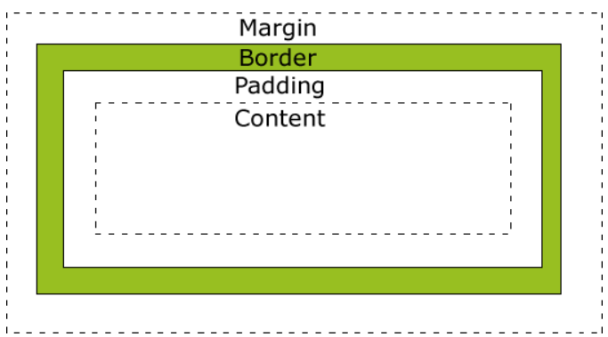
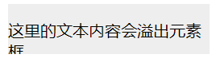
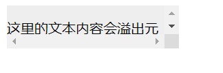

# CSS教程

CSS（Cascading Style Sheets，层叠样式表），是一种用来为结构化文档（如 HTML 文档或 XML 应用）添加样式（字体、间距和颜色等）的计算机语言，CSS文件扩展名为 **`.css`**。

HTML 标签原本被设计为用于定义文档内容，如下实例：

```html
<h1>这是一个标题</h1>
<p>这是一个段落。</p>
```

样式表定义如何显示 HTML 元素，就像 HTML 中的字体标签和颜色属性所起的作用那样。样式通常保存在外部的 .css 文件中。我们只需要编辑一个简单的 CSS 文档就可以改变所有页面的布局和外观。

打开 `index.html` 文件，然后将下面一行粘贴到文档头（也就是 `<head>` 和 `</head>` 标签之间）

```html
<link href="styles/style.css" rel="stylesheet">
```

## CSS语法

CSS 规则由两个主要的部分构成：选择器，以及一条或多条声明：

```css
h1 {
    color: blue; 
    font-size: 12px
};
```

选择器通常是您需要改变样式的 HTML 元素。

每条声明由一个属性和一个值组成。

属性（property）是希望设置的样式属性（style attribute）。每个属性有一个值,属性和值被冒号分开。

一般而言，所有的样式会根据下面的规则层叠于一个新的虚拟样式表中，其中数字 4 拥有最高的优先权。

1. 浏览器缺省设置
2. 外部样式表
3. 内部样式表（位于 `<head>` 标签内部）
4. 内联样式（在 HTML 元素内部）

## id和Class

### id选择器

CSS 中 id 选择器以 "#" 来定义。

以下的样式规则应用于元素属性 id="para1"

```css
#para1 {
	text-align:center;
    color:red;
}
```

### class选择器

class 选择器用于描述一组元素的样式，class 选择器有别于id选择器，class可以在多个元素中使用。

class 选择器在 HTML 中以 class 属性表示, 在 CSS 中，类选择器以一个点 `.` 号显示：

```css
.center {text-align:center;}
```

```html
<!DOCTYPE html>
<html>

<head>
    <meta charset="GBK">
    <title>html教程</title>
    <style type="text/css">
        .center {
            text-align: center;
        }
    </style>

<body>
    <h1 class="center">标题居中</h1>
    <p class="center">段落居中。</p>
</body>
</head>

</html>
```

也可指定特定HTML元素使用`class`：

```css
p.class {text-align:center}
```

```html
<!DOCTYPE html>
<html>

<head>
    <meta charset="GBK">
    <title>html教程</title>
    <style type="text/css">
        p.center {
            text-align: center;
        }
    </style>

<body>
    <h1 class="center">标题居中</h1>
    <p class="center">段落居中。</p>
</body>
</head>

</html>
```

> 实际开发过程中，类选择器用的最多，id 一般配合 js 使用 ，除非特殊情况否则不要使用 ，除非特殊情况否则不要使用。

### 标签选择器

除了提到的 id 和 class 选择器外，第三种选择器为标签选择器，即以 HTML 标签作为 CSS 修饰所用的选择器。

```html
<style>
    h3 {
        color: red;
    }
</style>
```

### 内联选择器

内联选择器即直接在标签内部写 CSS 代码。

```html
<h3 style="color:red;">
    Hello World!
</h3>
```

### 伪类选择器

特定状态下的特定元素（比如鼠标悬停）

```css
a:hover {
	color: red;
}
```

### 属性选择器

对拥有特定属性的元素进行选择。

```css
img[src] {
	border: 20px;
}

li[class] {
    font-size: 200%;
}

li[class="a"] {
    background-color: yellow;
}

li[class~="a"] { /* 所有子元素（包括非直接）*/
    color: red;
}
<h1>Attribute presence and value selectors</h1>
<ul>
    <li>Item 1</li>
    <li class="a">Item 2</li>
    <li class="a b">Item 3</li>
    <li class="ab">Item 4</li>
</ul>
```

### 全局选择器

全局选择器，也称为通配符选择器，是由一个星号（`*`）代指的，它选中了文档中的所有内容（或者是父元素中的所有内容。

```css
* {
	margin: 0;
}
```

## CSS创建

插入样式表方式：

- 外部样式表
- 内部样式表（全局）
- 内联样式

优先级：内联样式>内部样式>外部样式。

### 多重样式

例如，外部样式表拥有针对 H3 选择器的三个属性：

```css
h3 {
	color:red;        
	text-align:left;     
	font-size:8pt;     
}
```

而内部样式表拥有针对 H3 选择器的两个属性：

```css
h3 {
    text-align:right;
    font-size:20pt;
}
```

H3最终样式为：

```css
color:red; text-align:right;        
font-size:20pt;
```

> 当 `!important` 规则被应用在一个样式声明中时，该样式声明会覆盖 CSS 中任何其他的声明，无论它处在声明列表中的哪里。

权值计算：

- 内联样式表的权值最高 1000
- ID 选择器的权值为 100
- Class 类选择器的权值为 10
- HTML 标签选择器的权值为 1

```html
<!DOCTYPE html>
<html>

<head>
    <style type="text/css">
        #redP p {
            /* 权值 = 100+1=101 */
            color:#F00;  /* 红色 */
        }
        #redP .red em {
            /* 权值 = 100+10+1=111 */
            color:#00F; /* 蓝色 */
        }
        #redP p span em {
            /* 权值 = 100+1+1+1=103 */
            color:#FF0;/*黄色*/
        }
    </style>
</head>

<body>
<div id="redP">
    <p class="red">red
        <span><em>em red</em></span>
    </p>
    <p>red</p>
</div>
</body>
</html>
```

## 背景

### 背景颜色

```html
<!DOCTYPE html>
<html>

<head>
    <meta charset="GBK">
    <title>html教程</title>
    <style type="text/css">
        body {
            background-color: #b04cde;
        }
    </style>

<body>
    <p>背景颜色</p>
</body>
</head>

</html>
```

### 背景图片

而图片是**内联**元素，不具备块级元素的一些功能。若保证图像有外边距，使用`display: block` 给予其**块级行为**。

默认情况下，背景图像进行平铺重复显示，以覆盖整个元素实体：

```html
<!DOCTYPE html>
<html>

<head>
    <meta charset="GBK">
    <title>html教程</title>
    <style type="text/css">
        body {
            background-image: url('https://static.runoob.com/images/mix/paper.gif');
            background-color: #b04cde;
        }
    </style>

<body>
    <p>Hello, World</p>
</body>
</head>

</html>
```

#### 在水平方向平铺

```css
body {
    background-image: url('https://static.runoob.com/images/mix/gradient2.png');
    background-repeat: repeat-x;
}
```

#### 定位与不平铺

```css
body {
    background-image: url('https://static.runoob.com/images/mix/img_tree.png');
    background-repeat: no-repeat;
    background-position: right top;
    margin-right: 200px;
}
```

#### 简写属性

```css
body {
    background: #ffffff url('img_tree.png') no-repeat right top;
}
```

| Property                | 描述                                               |
| :---------------------- | :------------------------------------------------- |
| `background`            | 简写属性，作用是将背景属性设置在一个声明中。       |
| `background-attachment` | 背景图像是否固定或者随着页面的其余部分滚动。       |
| `background-color`      | 设置元素的背景颜色。                               |
| `background-image`      | 把图像设置为背景。                                 |
| `background-position`   | 设置背景图像的起始位置。`left top`、`x% y%`        |
| `background-repeat`     | 设置背景图像是否及如何重复。`repeat-x`、`repeat-y` |

## 文本格式

- 文本颜色

```html
<!DOCTYPE html>
<html>

<head>
    <meta charset="GBK">
    <title>html教程</title>
    <style>
        body {
            color: red
        }
        h1 {
            color: #00ff00;
        }
        p.ex {
            color: rgb(0, 0, 255);
        }
    </style>
<body>
    <h1>这是一个标题</h1>
    <p>这是一个普通段落</p>
    <p class="ex">这是一个类为"ex"的段落</p>
</body>
</head>

</html>
```

- 文本对齐方式

文本可居中或对齐到左或右,两端对齐。

```css
h1 {
    text-align: right;
}
p.date {
    text-align: right;
}
p.main {
    /* 左，右外边距对齐 */
    text-align: justify;
}
```

`text-align`设置为`justify`，每一行被展开为宽度相等，左，右外边距对齐。

- 文本修饰

`text-decoration`属性用于设置或山粗文本装饰，从设计角度看，`text-decoration`属性主要用于删除链接的下划线：

```html
<!DOCTYPE html>
<html>

<head>
    <meta charset="GBK">
    <title>html教程</title>
    <style>
        a {
            text-decoration: none;
        }
        h1 {
            text-decoration: overline;
        }
        h2 {
            text-decoration: line-through;
        }
        h3 {
            text-decoration: underline;
        }
    </style>
<body>
    <a href="https://www.nwafu.edu.cn/">https://www.nwafu.edu.cn/</a>
    <h1>一级标题</h1>
    <h2>二级标题</h2>
    <h3>三级标题</h3>
</body>
</head>
</html>
```


- 文本转换

文本转换属性是用来指定在一个文本中的大写和小写字母。

```css
p.uppercase {
    text-transform: uppercase;
}
p.lowercase {
    text-transform: lowercase;
}
p.capitialize {
    text-transform: capitalize;
}
```

- 文本缩进

```css
p {text-indent:50px;}
```

- 字符间的空间

```css
h1 {
    letter-spacing: 2px;
}
h2 {
    letter-spacing: -3px;
}
```

- 行距

```css
p.small {
    line-height: 70%;
}

p.big {
    line-height: 200%;
}
```

- 文本方向

```css
div.exl {
    direction: rtl;
}
```

- 文本阴影

```css
h1 {
    text-shadow: 2px 2px #ff010f;
}
```

| 属性              | 描述                     |
| :---------------- | :----------------------- |
| `color`           | 设置文本颜色             |
| `direction`       | 设置文本方向。           |
| `letter-spacing`  | 设置字符间距             |
| `line-height`     | 设置行高                 |
| `text-align`      | 对齐元素中的文本         |
| `text-decoration` | 向文本添加修饰           |
| `text-indent`     | 缩进元素中文本的首行     |
| `text-shadow`     | 设置文本阴影             |
| `text-transform`  | 控制元素中的字母         |
| `unicode-bidi`    | 设置或返回文本是否被重写 |
| `vertical-align`  | 设置元素的垂直对齐       |
| `white-space`     | 设置元素中空白的处理方式 |
| `word-spacing`    | 设置字间距               |

## 字体


在计算机屏幕上，sans-serif（无衬线）字体被认为是比serif（衬线）字体容易阅读。

### CSS字型

在css中，有两种类型的字体系列名称：

- 通用字体系列 - 拥有相似外观的字体系统组合（如 "Serif" 或 "Monospace"）
- 特定字体系列 - 一个特定的字体系列（如 "Times" 或 "Courier"）

| Generic family | 字体系列                   | 说明                                        |
| :------------- | :------------------------- | :------------------------------------------ |
| Serif          | Times New Roman Georgia    | Serif字体中字符在行的末端拥有额外的装饰     |
| Sans-serif     | Arial Verdana              | "Sans"是指无 - 这些字体在末端没有额外的装饰 |
| Monospace      | Courier New Lucida Console | 所有的等宽字符具有相同的宽度                |

### 字体系列

`font-family`设置文本字体系列。

`font-family`属性应该设置几个字体名称作为一种"**后备**"机制，如果浏览器不支持第一种字体，他将尝试下一种字体。

```css
p.serif {
    font-family: "Times New Roman", Time serif;
}

p.sansserif {
    font-family: Arial, Helvetica, sans-serif;
}
```

### 字体样式

主要是用于指定斜体文字的字体样式属性。

这个属性有三个值：

- 正常 - 正常显示文本
- 斜体 - 以斜体字显示的文字
- 倾斜的文字 - 文字向一边倾斜

```css
p.normal {
    font-style: normal;
}

p.italic {
    font-style: italic;
}

p.oblique {
    font-style: oblique;
}
```

> - 斜体（italic）是一种简单的字体风格，对每个字母的结构有一些小改动，来反映变化的外观。
> - 倾斜（oblique）文本是正常竖直文本的一个倾斜版本。
>
> 通常情况下，italic 和 oblique 文本在 web 浏览器中看上去完全一样。

#### 字体大小

`font-size`属性设置文本的大小。

绝对大小：

- 设置一个指定大小的文本
- 不允许用户在所有浏览器中改变文本大小
- 确定了输出的物理尺寸时绝对大小很有用

相对大小：

- 相对于周围的元素来设置大小
- 允许用户在浏览器中改变文字大小

1. 设置字体像素大小

设置文字的大小与像素，让您完全控制文字大小：

```css
h1 {
    font-size: 40px;
}
h2 {
    font-size: 30px;
}
h3 {
    font-size: 14px;
}
```

> px表示像素（pixels），基础字号为10像素。

2. 用`em`设置字体大小

为了避免Internet Explorer 中无法调整文本的问题，许多开发者使用 `em` 单位代替像素。

`em`的尺寸单位由W3C建议。

1em和当前字体大小相等。在浏览器中默认的文字大小是16px。

因此，1em的默认大小是16px。可以通过下面这个公式将像素转换为em：px/16=em

```css
h1 {
    font-size: 2.5em;
}

/* 40px/16=2.5em */
h2 {
    font-size: 1.875em;
}

/* 30px/16=1.875em */
p {
    font-size: 0.875em;
}

/* 14px/16=0.875em */
```

在所有浏览器的解决方案中，设置 `<body>`元素的默认字体大小的是百分比：

```
body {
font-size: 100%; 
}
h1 {
	font-size: 2.5em; 
}
h2 {
	font-size: 1.875em; 
}
p {
	font-size: 0.875em;
}
```

#### 字体粗细

```css
p.normal {
    font-weight: normal;
}

p.light {
    font-weight: lighter;
}

p.thick {
    font-weight: bold;
}

p.ticker {
    font-weight: 900;
}
```

#### 小型大写字母

```css
p.normal {
    font-variant: normal;
}
p.small {
    font-variant: small-caps;
}
```


## 链接

### 链接样式

这四个链接状态是：

- `a:link` - 正常，未访问过的链接
- `a:visited` - 用户已访问过的链接
- `a:hover` - 当用户鼠标放在链接上时
- `a:active` - 链接被点击的那一刻

```css
a:link {
    color: lightblue;
}
/* 未访问 */
a:visited {
    color: grey;
}
/* 已访问 */
a:hover {
    color: lightsalmon;
}
/* 移动到链接 */
a:active {
    color: aquamarine
}
/* 点击 */
```

### 文本修饰

`text-decoration` 属性主要用于删除链接中的下划线。

```css
a:link {
    text-decoration: none;
}
a:visited {
    text-decoration: none;
}
a:hover {
    text-decoration: underline;
}
a:active {
    text-decoration: underline;
}
```

### 背景颜色

```css
a:link {
    background-color: #B2FF99;
}
a:visited {
    background-color: #FFFF85;
}
a:hover {
    background-color: #FF704D;
}
a:active {
    background-color: #FF704D;
}
```

### 鼠标形状

| 属性值      | 描述               |
| :---------- | :----------------- |
| `default`   | 默认光标，箭头     |
| `pointer`   | 超链接的指针，手型 |
| `wait`      | 指示程序正在忙     |
| `help`      | 指示可用的帮忙     |
| `text`      | 指示文本           |
| `crosshair` | 鼠标呈现十字状     |

## 列表

### 不同列表标记项

```html
<!DOCTYPE html>
<html>

<head>
    <meta charset="gbk">
    <title>菜鸟教程(runoob.com)</title>
    <style>
        ul.a {
            list-style-type: circle;
        }
        ul.b {
            list-style-type: square;
        }
        ol.c {
            list-style-type: upper-roman;
        }
        ol.d {
            list-style-type: lower-alpha;
        }
    </style>
</head>

<body>
    <p>无序列表实例:</p>

    <ul class="a">
        <li>Coffee</li>
        <li>Tea</li>
        <li>Coca Cola</li>
    </ul>

    <ul class="b">
        <li>Coffee</li>
        <li>Tea</li>
        <li>Coca Cola</li>
    </ul>

    <p>有序列表实例:</p>

    <ol class="c">
        <li>Coffee</li>
        <li>Tea</li>
        <li>Coca Cola</li>
    </ol>

    <ol class="d">
        <li>Coffee</li>
        <li>Tea</li>
        <li>Coca Cola</li>
    </ol>
</body>

</html>
```

下列是对 `list-style-type` 属性的常见属性值的描述：

- `none`：不使用项目符号
- `disc`：实心圆
- `circle`：空心圆
- `square`：实心方块
- `decimal`：阿拉伯数字 
- `lower-alpha`：小写英文字母 
- `upper-alpha`：大写英文字母 
- `lower-roman`：小写罗马数字 
- `upper-roman`：大写罗马数字

### 作为列表项标记的图像

```css
ul {
    list-style-image: url('./redvelvet.jpg');
}
```

### 简写属性

```css
ul {
    list-style: circle url('./redvelvet.jpg');
}
```

## 表格

### 表格边框

```css
table,
th,
td {
    border: 2px solid black;
}
```

### 边框折叠

为了显示一个表的单个边框，使用 `border-collapse`属性。

```html
<!DOCTYPE html>
<html>

<head>
    <meta charset="gbk">
    <title>My Web(runoob.com)</title>
    <style>
        table {
            border-collapse: collapse;
        }
        table,
        th,
        td {
            border: 1px solid black;
        }
    </style>
</head>

<body>
    <table>
        <tr>
            <th>First name</th>
            <th>Second name</th>
        </tr>
        <tr>
            <td>Peter</td>
            <td>Griffin</td>
        </tr>
        <tr>
            <td>Lois</td>
            <td>Griffin</td>
        </tr>
    </table>
</body>

</html>
```

### 表格宽度

```css
table {
    width: 100%;
}
th {
    height: 50px;
}
```

### 表格文字对齐

`text-align`属性设置水平对齐方式，向左、右或中心：

```css
td {
    text-align: right;
}
```

`vertical-align`属性设置垂直对齐，比如顶部，底部或中间：

```css
td {
	height: 50px;
	vertical-align: bottom;
}
```

### 表格填充

如需控制边框和表格内容之间的间距，应使用td和th元素的填充属性：

```css
td {
	padding: 15px;
}
```

### 表格颜色

```html
<!DOCTYPE html>
<html>

<head>
    <meta charset="gbk">
    <title>Test</title>
    <style>
        table {
            width: 40%;
        }
        table,
        td,
        th {
            border: 1px solid black;
            text-align: center;
            border-collapse: collapse;
        }
        th {
            background-color: green;
            color: white;
            padding: 10px;
        }
    </style>
</head>
<body>
    <table>
        <tr>
            <th>Firstname</th>
            <th>Lastname</th>
            <th>Savings</th>
        </tr>
        <tr>
            <td>Peter</td>
            <td>Griffin</td>
            <td>$100</td>
        </tr>
        <tr>
            <td>Lois</td>
            <td>Griffin</td>
            <td>$150</td>
        </tr>
        <tr>
            <td>Joe</td>
            <td>Swanson</td>
            <td>$300</td>
        </tr>
        <tr>
            <td>Cleveland</td>
            <td>Brown</td>
            <td>$250</td>
        </tr>
    </table>
</body>

</html>
```

```html
<!DOCTYPE html>
<html>
	<head>
		<meta charset="utf-8">
		<title>自定义表格</title>
		<style>
			#customers {
				font-family: "Trebuchet MS", Arial, Helvetica, sans-serif;
				width: 100%;
				border-collapse: collapse;
			}
			#customers td, #customers th {
				font-size: 1em;
				border: 1px solid #98bf21;
				padding: 3px 7px 2px 7px;;
			}
			#customers th {
				font-size: 1.1em;
				text-align: left;
				padding-top: 5px;
				padding-bottom: 4px;
				background-color: #A7C942;
				color: #fff;
			}
			#customers tr.alt td {
				color: #000;
				background-color: #EAF2D3;
			}
		</style>
	</head>
	<body>
		<table id="customers">
		    <tbody>
		        <tr>
		            <th>2020年11月</th>
		            <th>2019年11月</th>
		            <th>程序语言</th>
		            <th>等级</th>
		            <th>更改</th>
		        </tr>
		        <tr class="alt">
		            <td>1</td>
		            <td>2</td>
		            <td>
		                <a href="https://www.w3cschool.cn/c/" target="_blank">C</a>
		            </td>
		            <td>16.21%</td>
		            <td>+0.17%</td>
		        </tr>
		        <tr>
		            <td>2</td>
		            <td>3</td>
		            <td>
		                <a href="https://www.w3cschool.cn/python3/" target="_blank">Python</a>
		            </td>
		            <td>12.12%</td>
		            <td>+2.27%</td>
		        </tr>
		        <tr class="alt">
		            <td>3</td>
		            <td>1</td>
		            <td>
		                <a href="https://www.w3cschool.cn/java/" target="_blank">Java</a>
		            </td>
		            <td>11.68%</td>
		            <td>-4.57%</td>
		        </tr>
		        <tr>
		            <td>4</td>
		            <td>5</td>
		            <td>
		                <a href="https://www.w3cschool.cn/cpp/" target="_blank">C++</a>
		            </td>
		            <td>7.60%</td>
		            <td>+1.99%</td>
		        </tr>
		        <tr class="alt">
		            <td>5</td>
		            <td>5</td>
		            <td>
		                <a href="https://www.w3cschool.cn/csharp/" target="_blank">C#</a>
		            </td>
		            <td>4.67%</td>
		            <td>+0.36%</td>
		        </tr>
		        <tr>
		            <td>6</td>
		            <td>6</td>
		            <td>
		                <a href="https://www.w3cschool.cn/csharp/" target="_blank">Visual Basic</a>
		            </td>
		            <td>4.01%</td>
		            <td>-0.22%</td>
		        </tr>
		        <tr class="alt">
		            <td>7</td>
		            <td>7</td>
		            <td>
		                <a href="https://www.w3cschool.cn/javascript/" target="_blank">JavaScript</a>
		            </td>
		            <td>2.03%</td>
		            <td>+0.10%</td>
		        </tr>
		        <tr>
		            <td>8</td>
		            <td>8</td>
		            <td>
		                <a href="https://www.w3cschool.cn/php/" target="_blank">PHP</a>
		            </td>
		            <td>1.79%</td>
		            <td>0.07%</td>
		        </tr>
		        <tr class="alt">
		            <td>9</td>
		            <td>16</td>
		            <td>
		                <a href="https://www.w3cschool.cn/r/" target="_blank">R</a>
		            </td>
		            <td>1.64%</td>
		            <td>+0.66%</td>
		        </tr>
		        <tr >
		            <td>10</td>
		            <td>9</td>
		            <td>
		                <a href="https://www.w3cschool.cn/sql/" target="_blank">SQL</a>
		            </td>
		            <td>1.54%</td>
		            <td>+0.15%</td>
		        </tr>
		    </tbody>
		</table>
	</body>
</html>
```


## 盒子模型

所有HTML元素可以看作盒子，在CSS中，box model这一术语是用来设计和布局时使用。

CSS盒模型本质上是一个盒子，封装周围的HTML元素，它包括：边距，边框，填充，和实际内容。

盒模型允许我们在其它元素和周围元素边框之间的空间放置元素。

一个被定义成块级的（block）盒子会表现出以下行为：

- 盒子会在内联的方向上扩展并占据父容器在该方向上的所有可用空间，在绝大数情况下意味着盒子会和父容器一样宽
- 每个盒子都会换行
- `width` 和 `height` 属性可以发挥作用
- 内边距（padding）, 外边距（margin）和 边框（border）会将其他元素从当前盒子周围推开

下面的图片说明了盒子模型(Box Model)：



- Margin(外边距) - 清除边框外的区域，外边距是透明的。
- Border(边框) - 围绕在内边距和内容外的边框。
- Padding(内边距) - 清除内容周围的区域，内边距是透明的。
- Content(内容) - 盒子的内容，显示文本和图像。

### 元素高度和宽度

当您指定一个 CSS 元素的宽度和高度属性时，你只是设置内容区域的宽度和高度。

```css
div {
    background-color: lightgrey;
    width: 300px;
    border: 25px solid green;
    padding: 25px;
    margin: 25px;
}
```


> 总元素的宽度=宽度+左填充+右填充+左边框+右边框+左边距+右边距

## 边框

### 边框属性

CSS边框属性允许你指定一个元素边框的样式和颜色。

### 边框样式

```css
p.none {
    border-style: none;
    /* 无边框 */
}
p.dotted {
    border-style: dotted;
    /* 虚线边框 */
}
p.dash {
    border-style: dashed;
    /* 虚线边框 */
}
p.solid {
    border-style: solid;
    /* 实线边框 */
}
p.double {
    border-style: double;
    /* 双边框 */
}
p.groove {
    border-style: groove;
    /* 凹槽边框 */
}
p.ridge {
    border-style: ridge;
    /* 垄状边框 */
}
p.inset {
    border-style: inset;
    /* 嵌入边框 */
}
p.outset {
    border-style: outset;
    /* 外凸边框 */
}
p.hidden {
    border-style: hidden;
    /* 隐藏边框 */
}
p.mix {
    border-style: dotted dashed solid double;
    /* 混合边框 */
}
```

###   边框宽度

```
p.one {
    border-style: solid;
    border-width: 5px;
}
p.two {
    border-style: solid;
    border-width: medium;
}
```

### 边框颜色

```css
p.one {
    border-style: solid;
    border-color: red;
}
p.two {
    border-style: solid;
    border-color: #98bf21;
}
```

### 单独设置各边

```css
p {
    border-top-style: dotted;
    border-right-style: solid;
    border-bottom-style: dotted;
    border-left-style: solid;
}
```

### 简写属性

```css
p {
    border:5px solid red;
}
```

## 轮廓

与边框基本一致。


```
p {
    border: dotted thick;
    outline: dotted thick;
}
```

## 外边框

### 单边外边距属性

```css
p {
    background-color: yellow;
}

p.margin {
    margin-top: 100px;
    margin-bottom: 100px;
    margin-right: 50px;
    margin-left: 50px;
}
```


### 简写属性

`margin`属性可以有一到四个值。

- `margin:25px 50px 75px 100px;` 上右下左
- `margin:25px 50px 75px;` 上（左右）下
- `margin:25px 50px;`（上下）（左右）
- `margin:25px;`（上下左右）

## 填充


### 单边内边距属性

```css
p {
    background-color: yellow;
}
p.padding {
    padding-top: 25px;
    padding-bottom: 25px;
    padding-right: 50px;
    padding-left: 50px;
}
```

```html
<!DOCTYPE html>
<html>
	<head>
	<meta charset="utf-8"> 
	<title>W3Cschool教程(w3cschool.cn)</title>
	<style>
		p {
			background-color:yellow;
		}
		p.padding {
			padding-top:25px;
			padding-bottom:25px;
			padding-right:50px;
			padding-left:50px;
		}
		p.margin {
			margin: 20px;
			background-color: rebeccapurple;
		}
	</style>
	</head>
	<body>
		<p>这是一个没有指定填充的段落。</p>
		<p class="padding">这是一个有指定填充的段落。</p>
		<p class="margin">这是一个有外边框的段落。</p>
	</body>
</html>
```


### 简写属性

```css
p {
    background-color: yellow;
}
p.padding {
    padding: 25px 50px;
}
```

```css
.box {
  margin-top: -40px;
  margin-right: 30px;
  margin-bottom: 40px;
  margin-left: 4em;
}
```

```html
<div class="container">
  <div class="box">Change my margin.</div>
</div>
```


## 分组和嵌套选择器

### 分组选择器

```css
h1, h2, p {
    color: green;
}
```

### 嵌套选择器

- `p{ }`: 为所有 `p` 元素指定一个样式。
- `.marked{ }`: 为所有 `class="marked"` 的元素指定一个样式。
- `.marked p{ }`: 为所有 `class="marked"` 元素内的 `p` 元素指定一个样式。
- `p.marked{ }`: 为所有 `class="marked"` 的 `p` 元素指定一个样式。

```css
p {
    color: blue;
    text-align: center;
    font-family: 'Courier New', Courier, monospace;
    font-size: large;
}
.marked {
    background-color: red;
    font-family: 'Franklin Gothic Medium', 'Arial Narrow', Arial, sans-serif;
    font-size: medium;
}
/* 所有class="marked"元素内的p元素 */
.marked p {
    color: white;
    font-family: 'Segoe UI', Tahoma, Geneva, Verdana, sans-serif;
    font-size: small;
}

/* 所有class="marked"元素内的p元素指定一个样式 */
p.marked {
    text-decoration: underline;
    font-family: 'Franklin Gothic Medium', 'Arial Narrow', Arial, sans-serif;
    font-size: smaller;
}
```

## 尺寸

| 属性          | 描述                 |
| :------------ | :------------------- |
| `height`      | 设置元素的高度。     |
| `line-height` | 设置行高。           |
| `max-height`  | 设置元素的最大高度。 |
| `max-width`   | 设置元素的最大宽度。 |
| `min-height`  | 设置元素的最小高度。 |
| `min-width`   | 设置元素的最小宽度。 |
| `width`       | 设置元素的宽度。     |

```css
p.min {
    min-height: 100px;
    background-color: yellow;
}
p.max {
    max-height: 10px;
    background-color: yellow;
}
```


## 显示与可见性

`display`属性设置一个元素应如何显示，`visibility`属性指定一个元素应可见还是隐藏。

### 隐藏元素

隐藏一个元素可以通过把`display`属性设置为`none`，或把`visibility`属性设置为`hidden`。但是请注意，`hidden`可以隐藏某个元素，仍然会**影响布局**。

### 块和内联元素

块元素是一个元素，占用了全部宽度，在前后都是换行符。

内联元素只需要必要的宽度，不强制换行。

下面的示例把列表项显示为内联元素，将`span`显示为块元素：

```css
li {
	display: inline;
}
span {
	display: block;
}
```

## 定位

position 属性指定了元素的定位类型。

position 属性的五个值：

- `static`
- `relative`
- `fixed`
- `absolute`
- `sticky`

### `static`定位

HTML 元素的**默认值**，即没有定位，遵循正常的文档流对象。

静态定位的元素不会受到 `top`, `bottom`, `left`, `right`影响。

```css
div.static {
    position: static;
    border: 3px solid #73ad21;
}
```

### `fixed`定位

元素的位置相对于浏览器窗口是固定位置，即使窗口是滚动的它也不会移动：

```css
p.pos_fixed {
    position: fixed;
    top: 30px;  /* 固定位置 */
    right: 50px;
}
```

### `relative`定位

```css
h2.pos_left {
    position: relative;
    left: -20px;  /* 相对正常元素的位置 */
}
h2.pos_right {
    position: relative;
    left: 20px;
}
```

相对定位元素经常被用来作为绝对定位元素的容器块。

### `absolute` 定位

绝对定位的元素的位置相对于**最近**的已定位父元素，如果元素没有已定位的父元素，那么它的位置相对于`<html>`：

```css
h2 {
    position: absolute;
    left: 100px;
    top: 150px;
    /* 使用绝对定位，一个元素可放在页面的任何位置 */
}
```

### `sticky`定位

sticky 英文字面意思是粘，粘贴，所以可以把它称之为粘性定位。

`position: sticky;` 基于用户的滚动位置来定位。

粘性定位的元素是依赖于用户的滚动，在 **position:relative** 与 **position:fixed** 定位之间切换。

它的行为就像 `position:relative;` 而当页面滚动超出目标区域时，它的表现就像 `position:fixed;`，它会固定在目标位置。

元素定位表现为在跨越特定阈值前为相对定位，之后为固定定位。

```css
div.sticky {
    position: sticky;
    top: 0;
    padding: 5px;
    background-color: #cae8ca;
    border: 2px solid #4caf50;
}
```

### 重叠元素

`z-index`属性指定了一个元素的堆叠顺序（哪个元素应该放在前面，或后面）

一个元素可以有正数或负数的堆叠顺序：

```css
img {
    position: absolute;
    left: 0px;
    top: 0px;
    z-index: -1;
}
```


## 溢出

CSS `overflow` 属性用于控制内容溢出元素框时显示的方式。

`overflow`属性有以下值：

| 值        | 描述                                                     |
| :-------- | :------------------------------------------------------- |
| `visible` | 默认值。内容不会被修剪，会呈现在元素框之外。             |
| `hidden`  | 内容会被修剪，并且其余内容是不可见的。                   |
| `scroll`  | 内容会被修剪，但是浏览器会显示滚动条以便查看其余的内容。 |
| `auto`    | 如果内容被修剪，则浏览器会显示滚动条以便查看其余的内容。 |
| `inherit` | 规定应该从父元素继承 `overflow` 属性的值。               |

### `visible`

默认情况下，`overflow` 的值为 `visible`， 内容溢出元素框：

```css
div {
    background-color: #eee;
    width: 200px;
    height: 50px;
    border: 1px dotted black;
    overflow: visible;
}
```


### `hidden`



### `auto`


### `scroll`



## 浮动

浮动使元素向左或向右移动，其周围的元素也会重新排列，往往是用于图像。

```css
.thumbnail {
    float: left;
    /* 向左浮动 */
    width: 50px;
    height: 50px;
    margin: 5px;
}
```


### 清除浮动

| 属性    | 描述                               | 值                             | CSS  |
| :------ | :--------------------------------- | :----------------------------- | :--- |
| `clear` | 指定不允许元素周围有浮动元素。     | `left right both none inherit` | 1    |
| `float` | 指定一个盒子（元素）是否可以浮动。 | `left right none inherit`      | 1    |

## 对齐

### 居中对齐

#### 元素

要水平居中对齐一个元素(如 `<div>`), 可以使用 `margin: auto;`

#### 文本

如果仅仅是为了文本在元素内居中对齐，可以使用 `text-align: center;`

#### 图片

要让图片居中对齐, 可以使用 `margin: auto;` 并将它放到块元素中。

### 左右对齐

#### 定位方式

```css
.right {
    position: absolute;
    right: 0px;
    width: 300px;
    border: 3px solid #73AD21;
    padding: 10px;
}
```

#### 浮动方式

```css
.right {
    float: right;
    width: 300px;
    border: 3px solid #73AD21;
    padding: 10px;
}
```

若子元素高度大于父元素，可在父元素上添加 `overflow: auto;` 来解决子元素溢出的问题。如果子元素的高度大于父元素，且子元素设置了浮动，那么子元素将溢出，这时候你可以使用 "`clearfix`(清除浮动)" 来解决该问题。

### 垂直居中

#### `padding`方式

```css
.center {
    padding: 70px 0;
    border: 3px solid green;
}
```

如果要水平和垂直都居中，可以使用`padding`和`text-align: center`：

```css
.center {
	padding: 70px 0;
	border: 3px solid green;
	text-align: center;
}
```

#### `line-height`方式

```css
.center {
    line-height: 200px;
    height: 200px;
    border: 3px solid green;
    text-align: center;
}
```

## 组合选择符

CSS组合选择符包括各种简单选择符的组合方式。

在 CSS3 中包含了四种组合方式：

- 后代选取器(以空格分隔)
- 子元素选择器(以大于号分隔）
- 相邻兄弟选择器（以加号分隔）
- 普通兄弟选择器（以波浪号分隔）

### 后代选取器

后代选取器匹配所有指定元素的后代元素。

后代选择器——典型用单个空格（" "）字符——组合两个选择器，比如，第二个选择器匹配的元素被选择，如果他们有一个祖先（父亲，父亲的父亲，父亲的父亲的父亲，等等）元素匹配第一个选择器。选择器利用后代组合符被称作后代选择器。

以下实例选取所有` <p>` 元素插入到 `<div>` 元素中：

```css
div p {
    background-color: aqua;
}
```

### 子元素选择器

与后代选择器相比，子元素选择器（Child selectors）只能选择作为某元素子元素的元素，即初代子元素。子代关系选择器是个大于号（`>`），只会在选择器选中直接子元素的时候匹配。继承关系上更远的后代则不会匹配。

```css
ul > li {
    border-top: 5px solid red;
}  
```


```css
ul li {
    border-top: 5px solid red;
}  
```


### 相邻兄弟选择器

相邻兄弟选择器（Adjacent sibling selector）可选择紧接在另一元素后的元素，且二者有相同父元素。邻接兄弟选择器（`+`）用来选中恰好处于另一个在继承关系上同级的元素旁边的物件。

如果需要选择紧接在另一个元素后的元素，而且二者有相同的父元素，可以使用相邻兄弟选择器（Adjacent sibling selector）。

```css
h1 + p {
    font-weight: bold;
    background-color: #333;
    color: #fff;
    padding: .5em;
} 
```

```html
<article>
    <h1>A heading</h1>
    <p>Veggies es bonus vobis, proinde vos postulo essum magis kohlrabi welsh onion daikon amaranth tatsoi tomatillo
            melon azuki bean garlic.</p>

    <p>Gumbo beet greens corn soko endive gumbo gourd. Parsley shallot courgette tatsoi pea sprouts fava bean collard
            greens dandelion okra wakame tomato. Dandelion cucumber earthnut pea peanut soko zucchini.</p>
</article>
```


### 通用相邻兄弟选择器

普通兄弟选择器选取所有指定元素的相邻兄弟元素。

如果你想选中一个元素的兄弟元素，即使它们不直接相邻，你还是可以使用通用兄弟关系选择器（`~`）。

```css
h1 ~ p {
    font-weight: bold;
    background-color: #333;
    color: #fff;
    padding: .5em;
}
```

```html
<article>
    <h1>A heading</h1>
    <p>I am a paragraph.</p>
    <div>I am a div</div>
    <p>I am another paragraph.</p>
</article>
```


## 伪类

CSS 伪类是用来添加一些选择器的特殊效果。

由于状态的变化是非静态的，所以元素达到一个特定状态时，它可能得到一个伪类的样式；当状态改变时，它又会失去这个样式。由此可以看出，它的功能和 class 有些类似，但它是基于文档之外的抽象，所以叫伪类。

伪类的语法：

```css
selector: pseudo-class {property:value;}
```

在支持 CSS 的浏览器中，链接的不同状态都可以以不同的方式显示：

```css
a:link {color:#FF0000;} /* 未访问的链接 */
a:visited {color:#00FF00;} /* 已访问的链接 */
a:hover {color:#FF00FF;} /* 鼠标划过链接 */
a:active {color:#0000FF;} /* 已选中的链接 */
```

伪类可以与 CSS 类配合使用：

```css
a.red:visited {color:#FF0000;}       
<a class="red" href="css-syntax.html">CSS Syntax</a>
```

您可以使用 `:first-child` 伪类来选择元素的第一个子元素：

```css
p > i:first-child {
color:blue;
}
```


### 简单伪类

```css
article p:first-child {
    font-size: 120%;
    font-weight: bold;
}   
```

```html
<article>
    <p>Veggies es bonus vobis, proinde vos postulo essum magis kohlrabi welsh onion daikon amaranth tatsoi tomatillo
            melon azuki bean garlic.</p>

    <p>Gumbo beet greens corn soko endive gumbo gourd. Parsley shallot courgette tatsoi pea sprouts fava bean collard
            greens dandelion okra wakame tomato. Dandelion cucumber earthnut pea peanut soko zucchini.</p>
</article>
```


### 用户行为伪类

一些伪类只会在用户以某种方式和文档交互的时候应用。这些**用户行为伪类**，有时叫做**动态伪类**，表现得就像是一个类在用户和元素交互的时候加到了元素上一样。

- `:hover`——上面提到过，只会在用户将指针挪到元素上的时候才会激活，一般就是链接元素。
- `:focus`——只会在用户使用键盘控制，选定元素的时候激活。

## 伪元素

CSS 伪元素是用来添加一些选择器的特殊效果。伪元素开头为双冒号`::`。

CSS 伪元素控制的内容和元素是没有差别的，但是它本身只是基于元素的抽象，并不存在于文档中，所以称为伪元素。

> 一些早期的伪元素曾使用单冒号的语法，所以你可能会在代码或者示例中看到。现代的浏览器为了保持后向兼容，支持早期的带有单双冒号语法的伪元素。
>
> 伪类是一种状态，可以看看做是选择器。
>
> 伪元素 是 元素， 简单来说，就是用css 模拟出来了一个盒子。

### `::first-line`伪元素

"first-line" 伪元素用于向文本的首行设置特殊样式。

```css
p::first-line {
	color:#ff0000;
	font-variant:small-caps;
}
```

### `::first-letter`伪元素

```html
p:first-letter {
    color:#ff0000;
    font-size:xx-large;
}
```

### `::before`伪元素

":before" 伪元素可以在元素的内容前面插入新内容。

```css
h1:before {
	content:url(smiley.gif);
}
```


### `::after`伪元素

":after" 伪元素可以在元素的内容之后插入新内容。

```css
h1:after {
	content:url(smiley.gif);
}
```

### 伪元素和 CSS 类

伪元素可以结合 CSS 类： 

```html
p.article:first-letter {
	color:#ff0000;
}       
<p class="article">A paragraph in an article</p>
```

## 导航栏

```css
ul {
	list-style-type:none; /* 移出列表前的标志 */
	margin:0;
 	padding:0;
}
```

上面的例子中的代码是垂直和水平导航栏使用的标准代码。

### 垂直导航栏

```css
<head>
<style>
    ul {
        list-style-type:none;	
        margin:0;
        padding:0;
    }
    a {
        display:block; /* 显示块元素的链接，让整体变为可点击链接区域（不只是文本），它允许我们指定宽度 */
        width:60px;
        background-color:#dddddd;
    }
</style>
</head>
<body>
    <ul>
    <li><a href="#home">Home</a></li>
    <li><a href="#news">News</a></li>
    <li><a href="#contact">Contact</a></li>
    <li><a href="#about">About</a></li>
</ul>
```


### 水平导航栏

有两种方法创建横向导航栏。使用**内联**或**浮动**的列表项。

这两种方法都很好，但如果你想链接到具有相同的大小，你必须使用浮动的方法。

#### 内嵌列表项

建立一个横向导航栏的方法之一是指定元素， 上述代码是标准的内嵌:

```css
li { 
    display: inline; 
}
```

> 默认情况下，`<li>` 元素是块元素。在这里，我们删除换行符之前和之后每个列表项，以显示一行。

#### 浮动列表项

在上面的例子中链接有不同的宽度。对于所有的链接宽度相等，浮动元素，并指定为 元素的宽度：

```css
li {
	float: left;
}
a {
    display: block;
    width: 60px;
}
```

## 下拉菜单

```html
<!DOCTYPE html>
<html>
<head>
<title>下拉菜单实例|W3Cschool教程(w3cschool.cn)</title>
<meta charset="utf-8">
<style>
.dropbtn {
    background-color: #4CAF50;
    color: white;
    padding: 16px;
    font-size: 16px;
    border: none;
    cursor: pointer;
}

.dropdown {
    position: relative;
    display: inline-block;
}

.dropdown-content {
    display: none;
    position: absolute;
    background-color: #f9f9f9;
    min-width: 160px;
    box-shadow: 0px 8px 16px 0px rgba(0,0,0,0.2);
}

.dropdown-content a {
    color: black;
    padding: 12px 16px;
    text-decoration: none;
    display: block;
}

.dropdown-content a:hover {
    background-color: #f1f1f1
    
}

.dropdown:hover .dropdown-content {
    display: block;
}

.dropdown:hover .dropbtn {
    background-color: #3e8e41;
}
</style>
</head>
<body>

<h2>下拉菜单</h2>
<p>鼠标移动到按钮上打开下拉菜单。</p>

<div class="dropdown">
  <button class="dropbtn">下拉菜单</button>
  <div class="dropdown-content">
    <a href="http://www.w3cschool.cn">W3Cschool教程 1</a>
    <a href="http://www.w3cschool.cn">W3Cschool教程 2</a>
    <a href="http://www.w3cschool.cn">W3Cschool教程 3</a>
  </div>
</div>

</body>
</html>
```


## 图片廊

```html
<!DOCTYPE html>
<html>
<head>
<meta charset="utf-8"> 
<title>W3Cschool教程(w3cschool.cn)</title> 
<style>


    div.img {
      margin: 2px;
      border: 1px solid #000000;
      height: auto; /* 居中 */
      width: auto;
      float: left;
      text-align: center;
    }    
    div.img img {
      display: inline;
      margin: 3px;
      border: 1px solid #fff;
    }
    div.img a:hover img {
        border: 1px solid #0000ff;
    }
    div.desc {
      text-align: center;
      font-weight: normal;
      width: 120px;
      margin: 2px;
    }
</style>
</head>


<body>
    <div class="img">
         <a target="_blank" href="javascript;:"></a>
         <div class="desc">Add a description of the image here</div>
    </div>
    <div class="img">
         <a target="_blank" href="javascript;:"></a>
         <div class="desc">Add a description of the image here</div>
    </div>
    <div class="img">
         <a target="_blank" href="javascript;:"></a>
         <div class="desc">Add a description of the image here</div>
    </div>
    <div class="img">
         <a target="_blank" href="javascript;:"></a>
         <div class="desc">Add a description of the image here</div>
    </div>
</body>
```


## 透明度

### 透明图像

```css
img {
    opacity: 0.4;
    filiterL alpha(opacity=40); /* IE8及更早版本 */
}
```

图片悬停效果：

```css
img:hover { 
	opacity:1.0;
}
```

## 边框

### 圆角

在 CSS3 中`border-radius`属性被用于创建圆角：

```html
<!DOCTYPE html>
<html>
	<head>
		<meta charset="utf-8">
		<title></title>
		<style>
			#example1 {
				border: 2px solid #a1a1al1;
				padding: 10px 40px;
				background: #ddd;
				width: 300px;
				border-radius: 25px;
			}
			#example2 {
				border: 2px solid red;
				padding: 10px;
				border-radius: 50px 20px;
			}
		</style>
	</head>
	<body>
		<div id="example1">
			Hello World
		</div>
		<br/><br/>
		<div id="example2">
			Hello World
		</div>
	</body>
</html>
```

### 盒阴影

`box-shadow`属性被用来添加阴影:

```html
div {
	box-shadow: 10px 10px 5px #8888;
	/* 长 高 大小 */
}
```

### 边界图片

`border-image`属性允许你指定一个图片作为边框：

```css
#round
{
	-webkit-border-image:url(border.png) 30 30 round; /* Safari 5 and older */
}

#stretch
{
	-webkit-border-image:url(border.png) 30 30 stretch; /* Safari 5 and older */
}
```

## 背景

通过`background-image`属性添加背景图片。不同的背景图像和图像用逗号隔开，所有的图片中显示在最顶端的为第一张。

```css
#example1 { 
    background-image: url(img_flwr.gif), url(paper.gif); 
    background-position: right bottom, left top; 
    background-repeat: no-repeat, repeat; 
}
```

CSS3中可以指定背景图片，让我们重新在不同的环境中指定背景图片的大小。

```css
div {
    background:url(img_flwr.gif);
    background-size:80px 60px;
    background-repeat:no-repeat;
}
```

`background-origin`属性指定了背景图像的位置区域。


```css
div {
    background:url(img_flwr.gif);
    background-repeat:no-repeat;
    background-size:100% 100%;
    background-origin:content-box;
}
```

CSS3允许你在元素上添加多个背景图像。

```css
#example3 {
	background-image: url(图片/follow.png), url(图片/play.png);
	min-height: 200px;
}
```

`background-clip`背景剪裁属性是从指定位置开始绘制。

```css
#example1 {
    border: 10px dotted black;
    padding:35px;
    background: yellow;
}

#example2 {
    border: 10px dotted black;
    padding:35px;
    background: yellow;
    background-clip: padding-box;
}

#example3 {
    border: 10px dotted black;
    padding:35px;
    background: yellow;
    background-clip: content-box;
}
```

## 渐变

渐变（gradients）可以让你在两个或多个指定的颜色之间显示平稳的过渡。

### 线性渐变

线性渐变-从上到下（默认渐变）

```css
#grad {
	background-image: liner-gradient(color1, color2);
}
```

从左到右：`to right`，对角：`to bottom right`

### 使用角度

```css
background-image: linear-gradient(angle, color-stop1, color-stop2);
```


```css
background: linear-gradient(red 10%, green 85%, blue 90%);
/* 10% 表示 red 的颜色中心线在线性渐变方向的 10% 的位置。
   85% 表示 green 的颜色中心线在线性渐变方向的 85% 的位置。*/
```

### 径向渐变

为了创建一个径向渐变，你也必须至少定义两种颜色节点。颜色节点即你想要呈现平稳过渡的颜色。同时，你也可以指定渐变的中心、形状（圆形或椭圆形）、大小。

```css
background-image: radial-gradient(circle, red, yellow, green);
```

重复渐变：`repeating-radial-gradient`。

## 文本效果

- 文本阴影

`text-shadow`属性适用于文本阴影。

```css
h1 {
	text-shadow: 5px 5px 5px #FF0000;
}
```

- 盒子阴影

```css
h1 {
	text-shadow: 5px 5px 5px #FF0000;
    /* 位置 模糊效果 */
}
```

- `text-overflow`

```css
p.test1 {
    white-space: nowrap; 
    width: 200px; 
    border: 1px solid #000000;
    overflow: hidden;
    text-overflow: clip; 
}
 
p.test2 {
    white-space: nowrap; 
    width: 200px; 
    border: 1px solid #000000;
    overflow: hidden;
    text-overflow: ellipsis; 
}
```

- 换行

```css
p {
    word-wrap: break-word;
}
```

- 单词拆分换行

```css
p.test1 {
    word-break: keep-all;
}
 
p.test2 {
    word-break: break-all;
}
```

## CSS3字体

在新的 `@font-face` 规则中，您必须首先定义字体的名称，然后指向该字体文件。

```css
@font-face {
	font-family: myfont;
	src: url('Sansation_Light.ttf')
		,url('Sansation_Light.eot'); /* IE9 */
}
```

## 2D 转换

### translate方法

```css
div {
    -webkit-transport: translate(50px, 100px);
}
```

### rotate方法

```css
div {
    -webkit-transform: rotate(30deg);
}
```

### scale方法

```css
div {
    -webkit-transform: scale(2, 3);
}
```

### skew方法

包含两个参数值，分别表示X轴和Y轴倾斜的角度，如果第二个参数为空，则默认为0，参数为负表示向相反方向倾斜。

```css
div {
    -webkit-transform: skew(30deg,20deg);
}
```

### matrix方法

```css
div {
	-webkit-transform:matrix(0.866,0.5,-0.5,0.866,0,0);
}
```

## 3D转换

### rotateX方法

`rotateX()`方法，围绕其在一个给定度数X轴旋转的元素。

```css
div {
    -webkit-transform: rotateX(120deg); /* Safari 与 Chrome */
}
```

### rotateY方法

`rotateY()`方法，围绕其在一个给定度数Y轴旋转的元素。

```css
div {
    -webkit-transform: rotateY(130deg); /* Safari 与 Chrome */
}
```

## 过渡

CSS3中，我们为了添加某种效果可以从一种样式转变到另一个的时候，无需使用Flash动画或JavaScript。

> 如果未指定的期限，transition将没有任何效果，因为默认值是0。

CSS3 过渡是元素从一种样式逐渐改变为另一种的效果。

要实现这一点，必须规定两项内容：

- 指定要添加效果的CSS属性
- 指定效果的持续时间。

```css
#example7 {
    width: 100px;
    height: 100px;
    background-color: cadetblue;
    -webkit-transition: width 2s;
}
#example7:hover {
    width: 300px;
}
```

要添加多个样式的变换效果，添加的属性由逗号分隔：

```css
div {
    -webkit-transition: width 2s, height 2s, -webkit-transform 2s;
}
```

## 动画

`@keyframes` 规则内指定一个 CSS 样式和动画将逐步从目前的样式更改为新的样式。

```css
@keyframes myfirst {
    from {background: red;}
    to {background: yellow;}    
}

div {
    -webkit-animation: myfirst 5s;
}
```

```css
@keyframes identifier {
    0% {
        background:red; 
        left:0px; 
        top:0px;
    }
    25% {
        background:yellow; 
        left:200px; 
        top:0px;
    }
    50% {
        background:blue; 
        left:200px; 
        top:200px;
    }
    75% {
        background:green; 
        left:0px; 
        top:200px;
    }
    100% {
        background:red; 
        left:0px; 
        top:0px;
    }
}
#example8 {
    -webkit-animation: identifier 5s;
    width:100px;
    height:100px;
    background:red;
    position:relative;
}
```

## 多列属性

`column-count` 属性指定了需要分割的列数。

```css
div {
    -webkit-column-count: 3;
    -webkit-column-gap: 40px;  /* 列与列间的间隙 */
    -webkit-column-rule-style: solid; /* 边框样式 */
    -webkit-column-rule-width: 1px; /* 边框厚度 */
    -webkit-column-rule-color: lightblue; /* 边框颜色 */
    -webkit-column-rule: 1px solid lightblue;
}
```

实例指定 `<h2>`元素跨越所有列：

```css
h2 {
	-webkit-column-span: all;
}
```

```css
div {
    -webkit-column-width: 100px;
}
```

## 用户界面

### 调整尺寸

`resize`属性指定一个元素是否应该由用户去调整大小。

```css
div {
    resize: both;
    overflow: auto;
}
```

### 方框大小调整

`box-sizing`属性允许您以确切的方式定义适应某个区域的具体内容。

```css
div {
    box-sizing:border-box;
    -moz-box-sizing:border-box; /* Firefox */
    width:50%;
    float:left;
}
```

```css
#example1 {
  box-sizing: content-box;  
  width: 300px;
  height: 100px;
  padding: 30px;  
  border: 10px solid blue;
}

#example2 {
  box-sizing: border-box;
  width: 300px;
  height: 100px;
  padding: 30px;  
  border: 10px solid blue;
}
```


### 外形修饰

`outline-offset `属性对轮廓进行偏移，并在超出边框边缘的位置绘制轮廓。

轮廓与边框有两点不同：

- 轮廓不占用空间
- 轮廓可能是非矩形

```css
div {
    border:2px solid black;
    outline:2px solid red;
    outline-offset:15px;
}
```

## 图片

### 圆角图片

```css
img {
    border-radius: 50%;
}
```

### 缩略图

```css
img {
    border: 1px solid #ddd;
    border-radius: 4px;
    padding: 5px;
}
```

### 响应式图片

响应式图片会自动适配各种尺寸的屏幕。

```css
img {
    max-width: 100%;
    height: auto;
}
```

### 图片滤镜

CSS `filter` 属性用为元素添加可视效果：

```css
img {
			    width: 33%;
			    height: auto;
			    float: left; 
			    max-width: 235px;
			}
			.blur {
				-webkit-filter: blur(4px);
				filter: blur(4px);
			}
			.brightness {
				-webkit-filter: brightness(250%);
				filter: brightness(250%);
			}
			.contrast {
				-webkit-filter: contrast(180%);
				filter: contrast(180%);
			}
			.grayscale {
				-webkit-filter: grayscale(100%);
				filter: grayscale(100%);
			}
			.huerotate {-webkit-filter: hue-rotate(180deg);
				filter: hue-rotate(180deg);
			}
			.invert {
				-webkit-filter: invert(100%);
				filter: invert(100%);
			}
			.opacity {
				-webkit-filter: opacity(50%);
				filter: opacity(50%);
			}
			.saturate {
				-webkit-filter: saturate(7); 
				filter: saturate(7);
			}
			.sepia {
				-webkit-filter: sepia(100%);
				filter: sepia(100%);
			}
			.shadow {
				-webkit-filter: drop-shadow(8px 8px 10px green);
				filter: drop-shadow(8px 8px 10px green);
			}
```


## 按钮

```css
.button {
  background-color: #4CAF50; /* Green */
  border: none;
  color: white;
  padding: 15px 32px;
  text-align: center;
  text-decoration: none;
  display: inline-block;
  font-size: 16px;
}
```


### 悬停按钮

```css
.button {
    -webkit-transition-duration: 0.4s; /* Safari */
    transition-duration: 0.4s;
}
 
.button:hover {
    background-color: #4CAF50; /* Green */
    color: white;
}
```

### 按钮阴影

```css
.button1 {
    box-shadow: 0 8px 16px 0 rgba(0,0,0,0.2), 0 6px 20px 0 rgba(0,0,0,0.19);
}
 
.button2:hover {
    box-shadow: 0 12px 16px 0 rgba(0,0,0,0.24), 0 17px 50px 0 rgba(0,0,0,0.19);
}
```

### 禁用按钮

```css
.disabled {
    opacity: 0.6;
    cursor: not-allowed;
}
```

### 按钮动画

鼠标移动到按钮上后添加箭头标记：

```css
.button {
	display: inline-block;
    border-radius: 4px;
    background-color: #006400;
    border: none;
    color: #fff;
    text-align: center;
    font-size: 28px;
    padding: 20px;
    width: 200px;
    transition: all 0.5s;
    cursor: pointer;
    margin: 5px;
}

.button span {
    cursor: pointer;
    display: inline-block;
    position: relative;
    transition: 0.5s;
}

.button span::after {
    content: '»';
    position: absolute;
    opacity: 0;
    top: 0;
    right: -20px;
    transition: 0.5s;
}

.button:hover span {
	padding-right: 25px; /* Hover移动 */
}
```


## 分页

```css
ul.pagination {
    display: inline-block;
    padding: 0;
    margin: 0;
}

ul.pagination li {
	display: inline;
}

ul.pagination li a {
    color: black;
    float: left;
    padding: 8px 16px;
    text-decoration: none;
}
```

```css
<ul class="pagination">
  <li><a href="#">«</a></li>
  <li><a href="#">1</a></li>
  <li><a class="active" href="#">2</a></li>
  <li><a href="#">3</a></li>
  <li><a href="#">4</a></li>
  <li><a href="#">5</a></li>
  <li><a href="#">6</a></li>
  <li><a href="#">7</a></li>
  <li><a href="#">»</a></li>
</ul>
```

##  框大小

盒子的大小还要加上边框和内边距，这样很麻烦。 因为这个原因，css 还有一个替代盒模型。


> width(宽) + padding(内边距) + border(边框) = 元素实际宽度
>
> height(高) + padding(内边距) + border(边框) = 元素实际高度

```css
.box {
  border: 5px solid rebeccapurple;
  background-color: lightgray;
  padding: 40px;
  margin: 40px;
  width: 400px;
  height: 150px;
}

.alternate {
  box-sizing: border-box;
}
```

```html
<div class="box">I use the standard box model.</div>
<div class="box alternate">I use the alternate box model.</div>
```


`box-sizing: border-box;` 效果更好，也正是很多开发人员需要的效果。

## 弹性盒子

CSS3 弹性盒（ Flexible Box 或 flexbox），是一种当页面需要适应不同的屏幕大小以及设备类型时确保元素拥有恰当的行为的布局方式。

引入弹性盒布局模型的目的是提供一种更加有效的方式来对一个容器中的子元素进行排列、对齐和分配空白空间。

弹性盒子由弹性容器(Flex container)和弹性子元素(Flex item)组成。

弹性容器通过设置 `display` 属性的值为 `flex` 或 `inline-flex`将其定义为弹性容器。弹性容器内包含了一个或多个弹性子元素。

```css
.flex-container {
    display: -webkit-flex;
    width: 400px;
    height: 250px;
    background-color: lightblue;
}
.flex-item {
    background-color: lightcoral;
    width: 100px;
    height: 100px;
    margin: 10px;
}
```

### `flex`盒子

#### `flex-direction` 属性

主轴由 `flex-direction` 定义，`flex-direction` 属性指定了弹性子元素在父容器中的位置。

```css
flex-direction: row | row-reverse | column | column-reverse
```

- `row`：横向从左到右排列（左对齐），默认的排列方式。
- `row-reverse`：反转横向排列（右对齐，从后往前排，最后一项排在最前面。
- `column`：纵向排列。
- `column-reverse`：反转纵向排列，从后往前排，最后一项排在最上面。

#### `flex-wrap`属性

`flex-wrap`属性用于指定弹性盒子的子元素换行方式。

```css
flex-wrap: nowrap|wrap|wrap-reverse|initial|inherit;
```

- `nowrap`： 默认， 弹性容器为单行。该情况下弹性子项可能会溢出容器。
- `wrap`： 弹性容器为多行。该情况下弹性子项溢出的部分会被放置到新行，子项内部会发生断行
- `wrap-reverse`：反转 wrap 排列。

#### `flex-flow`属性

你可以将两个属性 `flex-direction` 和 `flex-wrap` 组合为简写属性 `flex-flow`。

```css
.box {
	display: flex;
	flex-flow: row wrap;
}
```

```html
<div class="box">
    <div>One</div>
    <div>Two</div>
    <div>Three</div>
</div>
```

### 弹性子元素属性

#### `flex-basis`属性

`flex-basis` 定义了该元素的空间大小。flex 容器里除了元素所占的空间以外的富余空间就是可用空间 available space。该属性的默认值是 `auto` 。

#### `flex-grow`属性

`flex-grow` 若被赋值为一个正整数，flex 元素会以 `flex-basis` 为基础，沿主轴方向增长尺寸。这会使该元素延展，并占据此方向轴上的可用空间。

如果我们给上例中的所有元素设定 `flex-grow` 值为 1，容器中的可用空间会被这些元素平分。它们会延展以填满容器主轴方向上的空间。

#### `flex-shrink`属性

`flex-grow`属性是处理 flex 元素在主轴上增加空间的问题，相反`flex-shrink`属性是处理 flex 元素收缩的问题。如果我们的容器中没有足够排列 flex 元素的空间，那么可以把 flex 元素`flex-shrink`属性设置为正整数来缩小它所占空间到`flex-basis`以下。

#### `flex`简写属性

 `Flex` 简写形式允许你把三个数值按这个顺序书写 — `flex-grow`，`flex-shrink`，`flex-basis`。

```css
.box {
    display: flex;
}

.one {
    flex: 2 1 auto;
}

.two {
    flex: 1 2 auto;
}

.three {
    flex: 1 4 auto;
}
```

- `flex: initial` 是把 flex 元素重置为 Flexbox 的初始值，它相当于 `flex: 0 1 auto`。在这里 `flex-grow` 的值为 0，所以 flex 元素不会超过它们 `flex-basis` 的尺寸。`flex-shrink` 的值为 1, 所以可以缩小 flex 元素来防止它们溢出。`flex-basis` 的值为 `auto`. Flex 元素尺寸可以是在主维度上设置的，也可以是根据内容自动得到的。

- `flex: auto` 等同于 `flex: 1 1 auto`；和上面的 `flex:initial` 基本相同，但是这种情况下，flex 元素在需要的时候既可以拉伸也可以收缩。

- `flex: none` 可以把 flex 元素设置为不可伸缩。它和设置为 `flex: 0 0 auto` 是一样的。元素既不能拉伸或者收缩，但是元素会按具有 `flex-basis: auto` 属性的 flexbox 进行布局。

### 元素间对齐和空间分配

#### `align-items` 属性

`align-items` 设置或检索弹性盒子元素在侧轴（纵轴）方向上的对齐方式。

```css
align-items: flex-start | flex-end | center | baseline | stretch
```

- `flex-start`：弹性盒子元素的侧轴（纵轴）起始位置的边界紧靠住该行的侧轴起始边界。
- `flex-end`：弹性盒子元素的侧轴（纵轴）起始位置的边界紧靠住该行的侧轴结束边界。
- `center`：弹性盒子元素在该行的侧轴（纵轴）上居中放置。（如果该行的尺寸小于弹性盒子元素的尺寸，则会向两个方向溢出相同的长度）。
- `baseline`：如弹性盒子元素的行内轴与侧轴为同一条，则该值与'flex-start'等效。其它情况下，该值将参与基线对齐。
- `stretch`：如果指定侧轴大小的属性值为`auto`，则其值会使项目的边距盒的尺寸尽可能接近所在行的尺寸，但同时会遵照**'min/max-width/height**'属性的限制。


#### `justify-content` 属性

内容对齐（justify-content）属性应用在弹性容器上，把弹性项沿着弹性容器的主轴线（main axis）对齐。

```css
justify-content: flex-start | flex-end | center | space-between | space-around
```

- `flex-start`：

  弹性项目向行头紧挨着填充。这个是默认值。第一个弹性项的main-start外边距边线被放置在该行的main-start边线，而后续弹性项依次平齐摆放。

- `flex-end`：

  弹性项目向行尾紧挨着填充。第一个弹性项的main-end外边距边线被放置在该行的main-end边线，而后续弹性项依次平齐摆放。

- `center`：

  弹性项目居中紧挨着填充。（如果剩余的自由空间是负的，则弹性项目将在两个方向上同时溢出）。

- `space-between`：

  弹性项目平均分布在该行上。如果剩余空间为负或者只有一个弹性项，则该值等同于flex-start。否则，第1个弹性项的外边距和行的main-start边线对齐，而最后1个弹性项的外边距和行的main-end边线对齐，然后剩余的弹性项分布在该行上，相邻项目的间隔相等。

- `space-around`：

  弹性项目平均分布在该行上，两边留有一半的间隔空间。如果剩余空间为负或者只有一个弹性项，则该值等同于center。否则，弹性项目沿该行分布，且彼此间隔相等（比如是20px），同时首尾两边和弹性容器之间留有一半的间隔（1/2*20px=10px）。


#### `align-content` 属性

`align-content` 属性用于修改 `flex-wrap` 属性的行为。类似于 `align-items`, 但它不是设置弹性子元素的对齐，而是设置各个行的对齐。

```css
align-content: flex-start | flex-end | center | space-between | space-around | stretch
```

- `stretch` - 默认。各行将会伸展以占用剩余的空间。
- `flex-start` - 各行向弹性盒容器的起始位置堆叠。
- `flex-end` - 各行向弹性盒容器的结束位置堆叠。
- `center` -各行向弹性盒容器的中间位置堆叠。
- `space-between` -各行在弹性盒容器中平均分布。
- `space-around` - 各行在弹性盒容器中平均分布，两端保留子元素与子元素之间间距大小的一半。

#### 排序

`order` 属性设置弹性容器内弹性子元素的属性：

```css
.first {
	-webkit-order: -1;	
}
```

### 对齐方式

设置"margin"值为"auto"值，自动获取弹性容器中剩余的空间。所以设置垂直方向margin值为"auto"，可以使弹性子元素在弹性容器的两上轴方向都完全居中。

```css
.flex-item {
    background-color: cornflowerblue;
    width: 75px;
    height: 75px;
    margin: auto;
}
```

#### 侧轴对齐

`align-self` 属性用于设置弹性元素自身在侧轴（纵轴）方向上的对齐方式。

```css
align-self: auto | flex-start | flex-end | center | baseline | stretch
```


#### 分配空间

`flex` 属性用于指定弹性子元素如何分配空间。

```css
flex: auto | initial | none | inherit |  [ flex-grow ] || [ flex-shrink ] || [ flex-basis ]
```

## 网格布局

网格是一组相交的水平线和垂直线，它定义了网格的列和行。

CSS 提供了一个基于网格的布局系统，带有行和列，可以让我们更轻松地设计网页，而无需使用浮动和定位。

以下是一个简单的网页布局，使用了网格布局，包含六列和三行：

```css
.item1 { grid-area: header; }
.item2 { grid-area: menu; }
.item3 { grid-area: main; }
.item4 { grid-area: right; }
.item5 { grid-area: footer; }

.grid-container {
  display: grid;
  grid:
  'header header header header header header'
  'menu main main main right right'
  'menu footer footer footer footer footer';
  grid-gap: 10px;
  background-color: #2196F3;
  padding: 10px;
}

.grid-container > div {
  background-color: rgba(255, 255, 255, 0.8);
  text-align: center;
  padding: 20px 0;
  font-size: 30px;
}
```


### 网格元素

网格布局由一个父元素及一个或多个子元素组成。

```css
<div class="grid-container">
  <div class="grid-item">1</div>
  <div class="grid-item">2</div>
  <div class="grid-item">3</div>
  <div class="grid-item">4</div>
  <div class="grid-item">5</div>
  <div class="grid-item">6</div>
  <div class="grid-item">7</div>
  <div class="grid-item">8</div>
  <div class="grid-item">9</div>
</div>
```

### 网格轨道

通过 grid-`template-columns` 和 `grid-template-rows` 属性来定义网格中的行和列。

```css
.grid-container {
  display: grid;
  grid-template-columns: auto auto auto auto;
}
```

```css
.grid-container {
  display: grid;
  grid-template-rows: 100px 300px;
}
```


网格引入了 `fr` 单位来帮助我们创建灵活的网格轨道。一个 fr 单位代表网格容器中可用空间的一等份。

```css
.grid-container {
  display: grid;
  grid-template-columns: 1fr 1fr 1fr;
}
```

### 网格单元

使用以下属性来调整间隙大小：

- grid-column-gap
- grid-row-gap
- grid-gap

### 网格线

设置一个网格元素的网格线从第一行开始，第三行结束：

```css
.item1 {
  grid-column-start: 1;
  grid-column-end: 3;
}
```


要使 HTML 元素变成一个网格容器，可以将 `display` 属性设置为 `grid`或 `inline-grid`。

`grid-column`属性定义了网格元素列的开始和结束位置。

`grid-column`是 grid-column-start 和 grid-column-end 属性的简写属性。

`grid-area` 属性可以对网格元素进行命名。

```css
.item1 {
  grid-area: myArea;
}
.grid-container {
  grid-template-areas: 'myArea myArea myArea myArea myArea';
}
```

