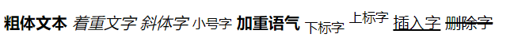
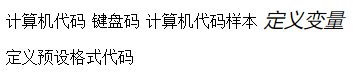
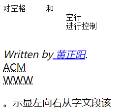
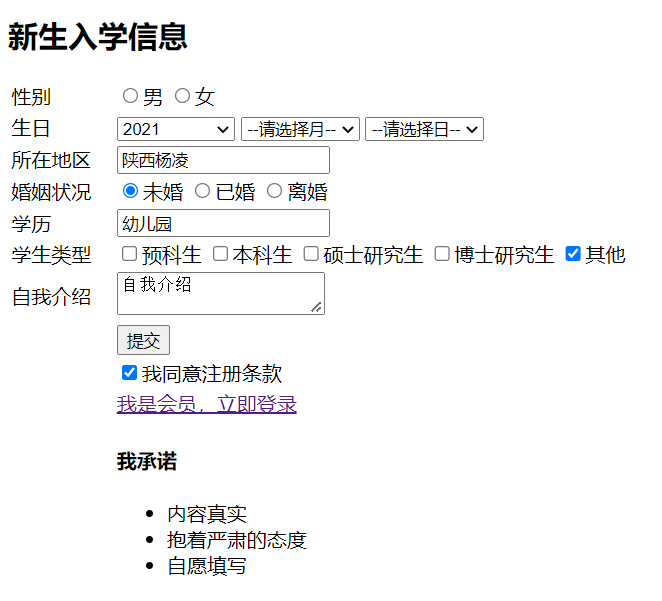
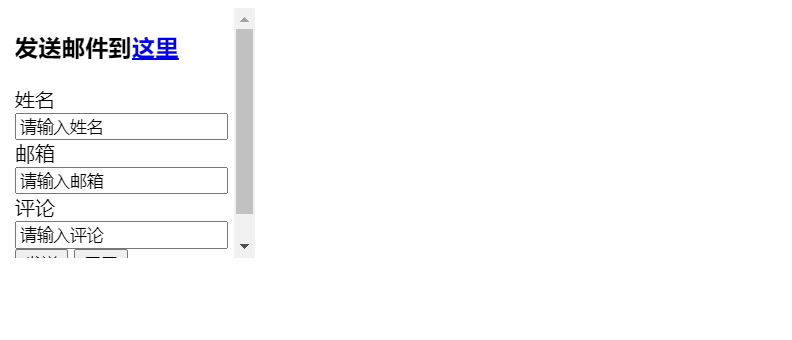

# HTML教程

## 基础认知

### 浏览器

#### 常用浏览器

PC端五大浏览器： `IE`、`Chrome`、`Firefox`、`Safari`、`Opera`

#### 浏览器内核

**渲染引擎**：浏览器专门对代码进行解析渲染的部分，导致解析相同代码的速度、效率、效果不同。

目前国内浏览器一般都采用 Webkit / Blink 内核。

### Web标准

**W3C：** 万维网联盟，国际最著名的标准化组织之一。

**Web 标准：**W3C 组织和其他标准化组织为 Web 开发制定的一系列标准的集合。

**Web 标准提出的最佳体验方案：** 结构、样式、行为相互分离。

| 构成 | 语言       | 说明                     |
| ---- | ---------- | ------------------------ |
| 结构 | HTML       | 页面元素和内容           |
| 表现 | CSS        | 网页页面样式             |
| 行为 | JavaScript | 页面模型的定义和界面交互 |

## HTML语法规范

**HTML：**超文本标记语言（Hyper Text Markup Language）是一种用于创建网页的标准标记语言。

### 基本语法概述

HTML 标签是由**尖括号**包围的关键字词，例如：`<html>`。

HTML 标签通常是成对出现的，例如：`<html>` 和 `</html>`，我们称为**双标签**。标签对中的第一个标签是**开始标签**，第二个标签是**结束标签**。大多数 HTML 元素可拥有**属性**。

有些特殊标签为单个标签，如`<br />`，称为**单标签**，注意其前有空格。`/`代表结束符。

> 在 XHTML、XML 以及未来版本的 HTML 中，所有元素都必须被关闭，即使是空元素。

#### 标签关系 

- **包含关系**

```html
<html>
    <title></title>
</html>
```

- **并列关系**

  ```html
  <head>
  </head>
  <body>
  </body>
  ```

#### HTML基本结构标签

每个网页均含有基本结构标签（骨架），其基本格如下：

```html
<html>
    <head>
        <title></title>
    </head>
    <body>
    </body>
</html>
```

| 标签名             | 定义     | 说明                                               |
| ------------------ | -------- | -------------------------------------------------- |
| `<html> </html`    | 根标签   | 最基本的标签                                       |
| `<head> </head>`   | 头部标签 | 设置标题等必需项，标签包含了文档的元数据（`meta`） |
| `<title> </title>` | 标题标签 | 网页标题                                           |
| `<body> </body>`   | 主体标签 | 包含文档所有内容                                   |

#### 常见属性

|  属性   |                             描述                             |
| :-----: | :----------------------------------------------------------: |
| `class` | 为html元素定义一个或多个类名（classname）(类名从样式文件引入) |
|  `id`   |                       定义元素的唯一id                       |
| `style` |              规定元素的行内样式（inline style）              |
| `title` |            描述了元素的额外信息 (作为工具条使用)             |

### 网页开发工具

- `WebStorm`（生态、智能、收费）
- `VSCode`（免费、插件、轻量）
- `HBuilderX`（国产、跨端开发）
- `Sublime Text`（插件、轻量、收费）
- `Atom`（免费、插件、轻量）
- `Dreamweaver`（可视化、智能、收费）
- `Notepad++`（免费、轻量）

#### 文档类型声明标签

`<!doctype>`文档类型声明，声明浏览器使用哪种HTML版本解析渲染网页。

```html
<!doctype html>
<!-- 当前网页采用HTML5版本 -->
```

#### `lang`语言种类

定义为 `en` 就是面向英文用户的网页，定义为 `zh` 就是面向中国大陆用户的网页。

`en-GB` 英文（英国）

`en-US` 英文（美国）

`zh-CN` 中文（简体，中国大陆）

`zh-SG` 中文（简体，新加坡）

`zh-HK` 中文（繁体，香港）

`zh-MO` 中文（繁体，澳门）

`zh-TW` 中文（繁体，台湾）

```html
<html lang="zh-CN">
</html>
```

语言的设置是为了方便浏览器搜索推荐以及触发 浏览器翻译功能。

#### 字符集

 **字符集：**多个字符的集合，以便计算机能够识别和储存各种文字。

在 `<head>` 标签内，可以通过 `<meta>` 标签的 `charset` 属性来规定 HTML 文档使用的字符编码。

```html
<meta charset="UTF-8">
```

`charset` 常用的值有：`GB2312`、`BIG5`、`GBK`、`UTF-8`，其中 `UTF-8` 也被称为：万国码，基本包含了全世界所有国家需要用到的字符。

#### HTML版本

从初期的网络诞生后，已经出现了许多HTML版本:

| 版本      | 发布时间 |
| :-------- | :------- |
| HTML      | 1991     |
| HTML+     | 1993     |
| HTML 2.0  | 1995     |
| HTML 3.2  | 1997     |
| HTML 4.01 | 1999     |
| XHTML 1.0 | 2000     |
| HTML5     | 2012     |
| XHTML5    | 2013     |

```html
<!DOCTYPE html>
<html>
    <head>
        <meta charset="UTF-8">
        <title>页面标题</title>
    </head>

    <body>
        <h1>我的第一个标题</h1>
        <p>我的第一个段落</p>
    </body>
</html>
```

HTML

## HTML常用标签

### 标题标签

为了使网页更具有语义化，我们经常会在页面中用到标题标签。

HTML 标题（Heading）是通过`<h1> - <h6>` 标签来定义。

```html
<h1>这是一个标题</h1>
<h2>这是一个标题</h2>
<h3>这是一个标题</h3>
```

> 在可用的六个标题级别中，您应该保证每个页面中标题级别的使用不超过三个，除非您认为有必要使用更多。具有许多标题级别的文档会变得难以操作并且难以导航。

### 段落和换行标签

HTML 段落是通过标签 `<p>` 来定义。

```html
<p>这是一个段落。</p>
<p>这是另外一个段落。</p>
```

如果希望某段文本强制换行显示，就需要使用换行标签 `<br>`。

- `<br>` 是个单标签
- `<br/>` 标签只是简单地开始新的一行，跟段落不一样，所以不会产生段间距

`<hr/>` 元素可用于分隔内容，使用该元素产生的水平线可以在视觉上将文档分隔成各个部分。

### 文本格式化标签

| 标签       | 描述         |
| :--------- | :----------- |
| `<b>`      | 定义粗体文本 |
| `<em>`     | 定义着重文字 |
| `<i>`      | 定义斜体字   |
| `<small>`  | 定义小号字   |
| `<strong>` | 定义加重语气 |
| `<sub>`    | 定义下标字   |
| `<sup>`    | 定义上标字   |
| `<ins>`    | 定义插入字   |
| `<del>`    | 定义删除字   |

```html
<!DOCTYPE html>
<html>
    <head>
        <meta charset="UTF-8">
        <title>页面标题</title>
    </head>

    <body>
    <body>
        <b>粗体文本</b>
        <em>着重文字</em>
        <i>斜体字</i>
        <small>小号字</small>
        <strong>加重语气</strong>
        <sub>下标字</sub>
        <sup>上标字</sup>
        <ins>插入字</ins>
        <del>删除字</del>
    </body>
    </body>
</html>
```



#### 计算机输出标签

| 标签     | 描述               |
| :------- | :----------------- |
| `<code>` | 定义计算机代码     |
| `<kbd>`  | 定义键盘码         |
| `<samp>` | 定义计算机代码样本 |
| `<var>`  | 定义变量           |
| `<pre>`  | 定义预格式文本     |

```html
<!DOCTYPE html>
<html>
    <head>
        <meta charset="UTF-8">
        <title>页面标题</title>
    </head>

    <body>
        <code>计算机代码</code>
        <kbd>键盘码</kbd>
        <samp>计算机代码样本</samp>
        <var>定义变量</var>
        <pre>定义预设格式代码</pre>
    </body>
</html>
```



> 这些标签常用于显示计算机/编程代码。

#### 引文引用及标签定义

`<q>`用于短的引用，`<blockquote>`用于长的引用。

```html
<p>WWF 的目标是：<q>构建人与自然和谐共存的世界。</q></p>
<p>以下内容引用自 WWF 的网站：</p>
<blockquote cite="http://www.worldwildlife.org/who/index.html">
    五十年来，WWF 一直致力于保护自然界的未来。
    世界领先的环保组织，WWF 工作于 100 个国家，
    并得到美国一百二十万会员及全球近五百万会员的支持。
</blockquote>
```

HTML `<abbr>` 元素定义缩写或首字母缩略语。

```html
<p><abbr title="World Health Organization">WHO</abbr> 成立于 1948 年。</p>
```

如果设置了 `<dfn>` 元素的 title 属性，则定义项目：

```html
<p><dfn title="World Health Organization">WHO</dfn> 成立于 1948 年。</p>
```

如果 `<dfn>` 元素包含具有标题的 `<abbr>` 元素，则 title 定义项目：

```html
<p><dfn><abbr title="World Health Organization">WHO</abbr></dfn> 成立于 1948 年。</p>
```

HTML `<address>` 元素定义文档或文章的联系信息（作者/拥有者）。

此元素通常以斜体显示。大多数浏览器会在此元素前后添加折行。

```html
<address>
    Written by Donald Duck.<br> 
    Visit us at:<br>
    Example.com<br>
    Box 564, Disneyland<br>
    USA
</address>
```

HTML `<cite>` 元素定义著作的标题。

浏览器通常会以斜体显示 `<cite>` 元素。

```html
<p><cite>The Scream</cite> by Edward Munch. Painted in 1893.</p>
```

HTML `<bdo>` 元素定义双流向覆盖（bi-directional override），用于覆盖当前文本方向。

```html
<bdo dir="rtl">This text will be written from right to left</bdo>
```

| 标签           | 描述             |
| :------------- | :--------------- |
| `<abbr>`       | 定义缩写         |
| `address>`     | 定义地址         |
| `<bdo>`        | 定义文字方向     |
| `<blockquote>` | 定义长的引用     |
| `<q>`          | 定义短的引用语   |
| `<cite>`       | 定义引用、引证   |
| `<dfn>`        | 定义一个定义项目 |

```html
<body>
    <pre>对空格     和
            空行
            进行控制
        </pre>
    <address>
        Written by<a href="https//huangzy@nwafu.edu.cn"> 黄正阳</a>.<br>
    </address>
    <abbr title="Association for Computing Machinery">ACM</abbr>
    <br />
    <abbr title="Word Wide Web">WWW</abbr>
    <p><bdo dir="rtl">该段文字从右向左显示。</bdo></p> 
</body>
```



```html
<!-- 在新窗口打开 -->
<a href="https://www.w3cschool.cn/" target="_blank\">访问W3Cschool教程!</a> 
<!-- 跳出框架 -->
<a href="https://www.w3cschool.cn/" target="_top\">访问W3Cschool教程!</a> 
```

###  图像标签

#### 图像的语法格式

HTML 图像是通过标签 `` 来定义。

```html

```

图像的名称和尺寸是以属性的形式提供。

`src`为``标签的必须属性，它用于指定图像文件的路径和文件名。

`URL`是统一资源定位符（网址）。

``标签有两个必需的属性：`src`和`alt`。

#### 图像标签的属性

| 属性     | 属性值   | 说明                                                         |
| -------- | -------- | ------------------------------------------------------------ |
| `src`    | 图片路径 | 必须属性                                                     |
| `alt`    | 文本     | 替换文本，图像显示失败时显示（为了提高 SEO 及适配屏幕阅读器，建议都把 alt 写上） |
| `title`  | 文本     | 提示文本，鼠标放到图片上，显示的提示文字                     |
| `width`  | 像素     | 设置图像的宽度（一般通过 CSS 设置）                          |
| `height` | 像素     | 设置图像的高度（一般通过 CSS 设置）                          |
| `border` | 像素     | 设置图像的边框粗细（一般通过 CSS 设置）`                     |

>  假如某个 HTML 文件包含十个图像，那么为了正确显示这个页面，需要加载 11 个文件。加载图片是需要时间的，所以我们的建议是：慎用图片。

### `<div>`和`<span>`标签

`div` 是 division 的缩写表示：分割、分区。

`span` 意为：跨度、跨距。

- `<div>` 标签用来布局，一行只能放一个 `<div>`，**大盒子**
- `<span>` 标签用来布局，一行上可以放多个 `<span>`，**小盒子**

```html
<p>我有一双
<span style="color:gold">金色</span> 的
<span style="font-size:50px">大眼睛</span>和
<span style="color:blue">蓝色的头发</span>。
</p> 
```

```html
<p>这是一些文本。</p>
<div style="color:#00FFFF">
<h3>这是一个在 div 元素中的标题。</h3>
<p>这是一个在 div 元素中的文本。</p>
</div>
```

### 超链接标签

#### 链接的语法格式

```html
<a href="跳转目标" target="目标窗口的弹出方式">文本、图像或其他内容</a>
```

| 属性     | 作用                                                         |
| -------- | ------------------------------------------------------------ |
| `href`   | 用于指定链接目标的 url 地址，（必须属性）当标签应用 href 属性时，它就具有了超链接的功能 |
| `target` | 用于指定链接页面的打开方式，其中 `_self` 在当前页面打开的方式（为默认值），`_blank` 在新窗口中打开的方式 |

### HTML id

HTML `id` 属性用于 为HTML 元素指定唯一的 id。

```html
<!DOCTYPE html>
<html>
<head>
<style>
#myHeader {
  background-color: lightblue;
  color: black;
  padding: 40px;
  text-align: center;
}
</style>
</head>
<body>

<h1 id="myHeader">My Header</h1>

</body>
</html>
```

> id 名称对大小写敏感。

同一个类名可以由多个 HTML 元素使用，而一个 id 名称只能由页面中的一个 HTML 元素使用：

```html
<style>
/* 设置 id 为 "myHeader" 的元素的样式 */
#myHeader {
  background-color: lightblue;
  color: black;
  padding: 40px;
  text-align: center;
}

/* 设置类名为 "city" 的所有元素的样式 */
.city {
  background-color: tomato;
  color: white;
  padding: 10px;
}
</style>

<!-- 拥有唯一 id 的元素 -->
<h1 id="myHeader">My Cities</h1>

<!-- 拥有相同类名的多个元素 -->
<h2 class="city">London</h2>
<p>London is the capital of England.</p>

<h2 class="city">Paris</h2>
<p>Paris is the capital of France.</p>

<h2 class="city">Tokyo</h2>
<p>Tokyo is the capital of Japan.</p>
```

通过 ID 和链接实现 HTML 书签：

```html
<h2 id="C4">第四章</h2>
<a href="#C4">跳转到第四章</a>
<a href="html_demo.html#C4">Jump to Chapter 4</a>
```

### HTML注释和特殊字符

#### 注释

在HTML中，注释以`<!--`开头，以`-->`结束。

```html
<!-- comments -->
```

#### 特殊字符

在 HTML 页面中，一些特殊的符号很难或者不方便直接使用，此时我们就可以使用下面的字符来替代。

| 特殊字符 | 描述   | 字符的代码 |
| -------- | ------ | ---------- |
| ``       | 空格符 | ` `        |
| `<`      | 小于号 | `<`        |
| `>`      | 大于号 | `>`        |
| `&`      | 和号   | `&`        |
| `±`      | 正负号 | `±`        |
| `×`      | 乘号   | `×`        |
| `÷`      | 除号   | `÷`        |
| `²`      | 上标   | `²`        |

注意：下标请使用：`<sub>2</sub>`，同时上标也建议使用：`<sup>2</sup>`。

### HTML 头部

HTML 头部元素包含关于文档的概要信息，也被称为元信息（meta-information）。

####  `<head>` 元素

`<head>`元素包含了所有的头部标签元素。在 `<head>`元素中你可以插入脚本（scripts）, 样式文件（CSS），及各种 meta 信息。

#### `<title>` 元素

title 在 HTML/XHTML 文档中是必须的。

title 元素:

- 定义了浏览器工具栏的标题
- 当网页添加到收藏夹时，显示在收藏夹中的标题
- 显示在搜索引擎结果页面的标题

#### `<base>`元素

`<base>`标签描述了基本的链接地址/链接目标，该标签作为 HTML 文档中所有的链接 规定默认地址或**默认目标**（target）:

```html
<head>       
	<base href="//www.w3cschool.cn/images/" target="_blank">      
</head>
```

#### `<link>`元素

`<link>`标签定义了文档与外部资源之间的关系。

`<link>` 标签通常用于链接到样式表：

```html
<head>       
	<link rel="stylesheet" type="text/css" href="mystyle.css">   
</head>
```

#### `<style>`元素

`<style>`标签定义了HTML文档的样式文件引用地址。

在`<style>` 元素中你需要指定样式文件来渲染HTML文档：

```html
<head>        
<style type="text/css">        
body {background-color:yellow}        
p {color:blue}        
</style>        
</head>
```

#### `<meta>`元素

`<meta>`标签提供关于 HTML 文档的元数据。元数据不会显示在页面上，但是对于机器是可读的。

典型的情况是，meta元素被用于规定页面的描述、关键词、文档的作者、最后修改时间以及其他元数据。

meta 元素定义页面的描述：

```
<meta name="description" content="Free Web tutorials on HTML, CSS, XML" />
```

meta 元素定义页面的关键词：

```html
<meta name="keywords" content="HTML, CSS, XML" />
```

#### `<script>`元素

`<script>`标签用于加载脚本文件，如JavaScript。

### 表格标签

#### 表格的作用

表格主要用于显示、展示数据。表格可让数据显示得非常的规整，可读性好。

注：表格是用于表单数据的"布局"，而不是页面的布局。

#### 表格的基本语法

```html
<table>
    <tr>
        <td>单元格</td>
        ...
    </tr>
    ...
</table>
```

- `<table>` `</table>` 是用于定义表格的标签

- `<tr>` `</tr>` 用于定义表格中的行，必须嵌套在 `<table>` `</table>` 标签中

- `<td>` `</td>` 用于定义表格中的单元格，必须嵌套在 `<tr>` `</tr>` 标签中。

- `<caption></ caption>`标签作为标题，并在表的顶部显示出来。

  > 此标签在较新版本的HTML / XHTML中已弃用

#### 表格单元格标签

一般表头单元格位于表格的第一行或第一列，作用是：突出重要性，表头单元格里面的文本内容**默认加粗居中**显示。

```html
<table>
    <tr>
        <th>姓名</th>
        <th>性别</th>
        <th>年龄</th>
        ...
    </tr>
</table>
```

#### 表格属性

表格标签的属性在实际开发中并不常用，而是通过后面的 CSS 来设置，这里了解即可。

| 属性名        | 属性值                    | 描述                                                         |
| ------------- | ------------------------- | ------------------------------------------------------------ |
| `align`       | `left`、`center`、`right` | 规定表格相对周围元素的对齐方式（默认` left`），注意指的是整个表格的对齐方式（表格是在父盒子中默认往左靠，还是居中或是往右靠），而不是指单元格内容的对齐方式（单元格内容对齐可以通过：`style="text-align: center;"` 设置） |
| `border`      | `1` 或 `""`               | 规定表格单元是否拥有边框，默认为` ""`，表示没有边框          |
| `cellpadding` | 像素值                    | 规定单元边沿与其内容之间的空白，默认 1 像素                  |
| `cellspacing` | 像素值                    | 规定单元格之间的空白，默认 2 像素                            |
| `width`       | 像素值 或 百分比          | 规定表格的宽度                                               |
| `height`      | 像素值 或 百分比          | 规定表格的高度                                               |
| `bgcolor`     | 颜色值                    | 设置背景颜色                                                 |
| `background`  | 图片文件                  | 设置背景图像                                                 |

#### 表格结构标签

因为表格可能很长，为了更好的表示表格的语义，可以将表格分割成：`表格头部` 和 `表格主体` 两大部分。

在表格标签中，分别用：`<thead>` 标签表示表格的头部区域，`<tbody>` 标签表示表格的主体区域，这样可以更好的分清表格结构。

- `<thead>` `</thead>`：用于定义表格的头部，`<thead>` 内部必须拥有 `<tr>` 标签，一般是位于第一行，且一般 `<tr>` 标签中推荐放置 `<th>` 标签
- `<tbody>` `</tbody>`：用于定义表格的主体，主要用于放数据本体
- 以上标签都是放在 `<table>` `</table>` 标签中

```html
<table align="center" border="" cellpadding="1" cellspacing="2" width="200" height="50">
    <!-- 头部区域 -->
    <thead>
        <tr>
            <th>姓名</th>
            <th>性别</th>
            <th>年龄</th>
        </tr>
    </thead>
    <tbody>
        <tr>
            <td>黄正阳</td>
            <td>男</td>
            <td>18</td>
        </tr>
    </tbody>
</table>
```

#### 合并单元格

##### 合并单元格的方式

- 跨行合并（上下合并）：`rowspan="n"`
- 跨列合并（左右合并）：`colspan="n"`

##### 合并单元格步骤

- 先确定是跨行还是跨列合并
- 找到目标单元格，写上 `合并方式=合并的单元格数量`，比如：`<td colspan="2">` `</td>`
- 删除多余单元格

```html
    <table width="500" height="249" border="1" cellspacing="0">
        <tr>
            <td rowspan="2">工程信息</td>
            <td>工程单号</td>
            <td>客户工单</td>
            <td>条码 </td>
        </tr>
        <tr>
            <td>JC2012160685</td>
            <td>AST20123561</td>
            <td rowspan="3">图片</td>
        </tr>
        <tr>
            <td rowspan="2">物流信息</td>
            <td>物流编号</td>
            <td>物流名称</td>
        </tr>
        <tr>
            <td>京东京造/呈意</td>
            <td>呈意</td>
        </tr>
    </table>
```

### 列表标签

表格是用来显示数据的，那么**列表就是用来布局的**。

列表最大的特点就是：整齐、整洁、有序、它作为布局会更加自由和方便。

在实际开发中凡是遇到排列整齐的简洁内容，都可以使用列表来进行布局。

#### 无序列表

`<ul>` 标签表示 HTML 页面中项目的无序列表，一般会以项目符号呈现列表项，而列表项使用 `<li>` 标签定义。

无序列表的基本语法格式如下：

```html
<ul>
    <li>item1</li>
    <li>item2</li>
    <li>item3</li>
</ul>
```

不同类型的无序列表：

```html

<ul type="list-style-type:disc"> <!-- 
    <li>Coffee</li>
    <li>Milk</li>
</ul>
<ul type="list-style-type:circle">
    <li>Coffee</li>
    <li>Milk</li>
</ul>
<ul type="list-style-type:square">
    <li>Coffee</li>
    <li>Milk</li>
</ul>
```

#### 有序列表

```html
<ol>
    <li>item1</li>
    <li>item2</li>
    <li>item3</li>
</ol>
```

不同类型的有序列表：

```html
 <ol type="A">
        <li>Coffee</li>
        <li>Milk</li>
    </ol>
    <ol type="i">
        <li>Apples</li>
        <li>Bananas</li>
        <li>Lemons</li>
        <li>Oranges</li>
    </ol>
```

#### 自定义列表

自定义列表常用于对术语或名词进行解释、描述和展开，定义列表的列表项前没有任何项目符号。

在 HTML 标签中，`<dl>` 标签用于定义描述列表（或定义列表），该标签会与 `<dt>`（定义项目/名字）和 `<dd>`（描述每一个项目/名字）一起使用。

```html
<dl>
    <dt>名词1</dt>
    <dd>名词1解释1</dd>
    <dd>名词1解释2</dd>
</dl>
```

### 表单标签

#### 表单的作用

使用表单的目的是收集用户信息。

在网页中，需要跟用户进行交互，收集用户资料，此时就需要表单。

#### 表单的组成

在 HTML 中，一个完整的表单通常由 表单域、表单控件（表单元素）和 提示信息 3 个部分构成。

#### 表单域

在 HTML 标签中，`<form>` 标签用于定义表单域，以实现用户信息的收集和传递。

`<form>` 会把它范围内的表单元素信息提交给服务器。

```html
<form action="url地址" method="提交方式" name="表单域名称">
    <!-- 各种表单元素控件 -->
</form>
```

| 属性名   | 属性值         | 作用                                               |
| -------- | -------------- | -------------------------------------------------- |
| `action` | `url` 地址     | 用于指定接收并处理表单数据的服务器程序的 url 地址  |
| `method` | `get` / `post` | 用于设置表单数据的提交方式，其取值为 get 或 post   |
| `name`   | 名称           | 用于指定表单的名称，以区分同一个页面中的多个表单域 |

> method 方法规定如何发送表单数据（form data）（表单数据会被发送到在 action 属性中规定的页面中）。
>
> 表单数据可被作为 URL 变量的形式来发送（`method="get"`）或者作为 HTTP post 事务的形式来发送（`method="post"`）。
>

**关于 GET 的注释：**

- 将表单数据以名/值对的形式附加到 URL 中
- URL 的长度是**有限**的（大约 3000 字符）
- 绝不要使用 `GET` 来发送敏感数据！（在 URL 中是可见的，且浏览器会缓存 URL）
- 可加入浏览器书签的表单
- `GET` 更适用于非安全数据，比如在 Google 中查询字符串

```html
<form action="http://127.0.0.1:8080/" method="GET">
        姓名：<input type="text" name="name">
        <input type="submit">
</form>
```

**关于 POST 的注释：**

- 将表单数据附加到 HTTP 请求的 `body` 内（数据不显示在 URL 中）
- 没有长度限制
- 通过 `POST` 提交的表单不能加入书签
- POST 数据也是不安全的，但起码不会明目张胆的直接把数据显示在地址栏 URL 上，且不会缓存数据

```html
<form action="http://127.0.0.1:8080/" method="GET">
        姓名：<input type="text" name="name">
        <input type="submit">
    </form>
```

#### 表单元素

##### `<input>`表单元素

| 属性值     | 描述                                                         |
| ---------- | ------------------------------------------------------------ |
| `button`   | 定义可点击按钮（多数情况下，用于通过 JavaScript 启动脚本）   |
| `checkbox` | 定义复选框，即：多选框，在一组多选中，要求它们必须拥有相同的 name |
| `file`     | 定义输入字段和 “浏览” 按钮，供文件上传                       |
| `hidden`   | 定义隐藏的输入字段                                           |
| `image`    | 定义图像形式的提交按钮                                       |
| `password` | 定义密码字段，该字段中的字符被掩码                           |
| `radio`    | 定义单选按钮，在一组单选按钮中，要求它们必须拥有相同的 name  |
| `reset`    | 定义重置按钮，重置按钮会清除表单中的所有数据                 |
| `submit`   | 定义提交按钮，提交按钮会把表单数据发送到服务器               |
| `text`     | 定义单行的输入字段，用户可在其中输入文本，默认宽度为 20 个字符 |

- `name` 和 `value` 是每个表单元素都有的属性值，主要给后台人员使用，`value`即默认显示文本
- `name` 表单元素的名字，要求：单选按钮和复选框要有相同的 name 值
- `checked` 属性主要针对于单选按钮和复选框，主要作用：打开页面时默认选中某个表单元素
- `maxlength` 是用户可以在表单元素输入的最大字符数，一般很少使用

1. **文本域**

文本域通过 `<input type="text">`标签来设定：

```html
<body>
    <form action="">
        First name: <input type="text" , name="'first"><br>
        Last name: <input type="text" name="lastname">
    </form>
</body>
```

2. **密码字段**

密码字段通过标签` <input type="password">`来定义：

```html
<body>
    <form action="">
        Password: <input type="password" , name="'psw"><br>
    </form>
</body>
```

3. **单选按钮**

`<input type="radio">`标签定义了表单的单选框选项：

```html
<body>
    <form action="http://127.0.0.1:8080/" method="POST">
        <input type="radio" name="sex" value="男" checked="checked" />男
        <input type="radio" name="sex" value="女" >女
    </form>
</body>
```

4. **复选框**

`<input type="checkbox">` 定义了复选框：

```html
<body>
    <form action="">
        <input type="checkbox" , name="'vehicle" value="Bike" checked="checked">自行车<br>
        <input type="checkbox" , name="'vehicle" value="Car">小汽车
    </form>
</body>
```

5. **提交按钮**

`<input type="submit">` 定义了提交按钮。

当用户单击确认按钮时，表单的内容会被传送到服务器。表单的动作属性`action`定义了服务端的文件名。

```html
<body>
    <form name="input" action="未命名1.cpp" method="get">
        Username: <input type="text" , name="'name"><br>
        <input type="submit" , value="Submit">
    </form>
</body>

```

6. **标签**

   `<label>` 标签用于绑定一个表单元素，当点击 `<label>` 标签内的文本时，浏览器就会自动将焦点（光标）转到或者选择对应的表单元素上，用来增加用户体验。

   ```html
   <label for="sex">
   	男<input type="radio" name="sex" id="sex" />
   </label>
   ```

7. **按钮**

      ```html
      <body>
          <form action="">
              <input type="button" value="Hello world!">
          </form>
      </body>
      ```


##### `<select>`表单元素

如果有多个选项让用户选择，并且想要节约页面空间时，我们可以使用 `<select>` 标签控件定义下拉列表。

**语法：**

```html
<select>
    <option>选项1</option>
    <option>选项2</option>
    <option>选项3</option>
    ...
</select>
```

每个 `<option>` 元素都应该有一个` value` 属性，其中包含选择该选项时要提交给服务器的数据值。如果不包含` value `属性，则 `value` 默认为元素内包含的文本。可以在 `<option>` 元素上包含 `selected` 属性，以使其在页面首次加载时默认选中。

```html
    <form action="">
        <select name="cars">
            <option value="volvo">Volve</option>
            <option value="saab">Saab</option>
            <option value="fiat">Fiat</option>
            <option value="audi" selected>Audi</option>
        </select>
```

##### `<textarea>`表单元素

当用户输入内容较多的情况下，我们就不能使用文本框表单了，此时我们可以使用 `<textarea>` 标签

在表单元素中，`<textarea>` 标签是用于定义多行文本输入的控件。

**语法：**

```html
<textarea rows="3" cols="20">
	文本内容
</textarea>
```

如果要禁止拉伸文本框大小，则：`style="resize: none"`

```html
<body>
    <form action="">
        <textarea rows="10" cols="30">
        这是一个文本域
        </textarea>
    </form>
</body>
```

```html
<!doctype html>
<html lang="zh-CN">

<head>
    <meta charset="UTF-8">
    <meta content="IE=edge" http-equiv="X-UA-Compatible">
    <meta content="width=device-width, initial-scale=1.0" name="viewport">
    <title>NWAFU学生-注册页面</title>
</head>

<body>
<!-- 标题 -->
<h2>新生入学信息</h2>

<!-- 表单域 -->
<!-- <form action="" method="" name="lovetable"> -->

<!-- 注册表 -->
<table width="600">
    <!-- 第一行 -->
    <tr>
        <td>性别</td>
        <td>
            <label for="man">
                <input id="man" name="sex" type="radio"/>男
            </label>
            <label for="women">
                <input id="women" name="sex" type="radio"/>女
            </label>
        </td>
    </tr>

    <!-- 第二行 -->
    <tr>
        <td>生日</td>
        <td>
            <select>
                <option>--请选择年--</option>
                <option selected="selected">2021</option>
                <option>2002</option>
                <option>2003</option>
                <option>2004</option>
            </select>
            <select>
                <option>--请选择月--</option>
                <option>1</option>
                <option>2</option>
                <option>3</option>
                <option>4</option>
            </select>
            <select>
                <option>--请选择日--</option>
                <option>1</option>
                <option>2</option>
                <option>3</option>
                <option>4</option>
            </select>
        </td>
    </tr>

    <!-- 第三行 -->
    <tr>
        <td>所在地区</td>
        <td>
            <input type="text" value="陕西杨凌"/>
        </td>
    </tr>

    <!-- 第四行 -->
    <tr>
        <td>婚姻状况</td>
        <td>
            <label for="weihun">
                <input checked="checked" id="weihun" name="marry" type="radio"/>未婚
            </label>
            <label for="yihun">
                <input id="yihun" name="marry" type="radio"/>已婚
            </label>
            <label for="lihun">
                <input id="lihun" name="marry" type="radio"/>离婚
            </label>
        </td>
    </tr>

    <!-- 第五行 -->
    <tr>
        <td>学历</td>
        <td>
            <input type="text" value="幼儿园"/>
        </td>
    </tr>

    <!-- 第六行 -->
    <tr>
        <td>学生类型</td>
        <td>
            <input name="love" type="checkbox"/>预科生
            <input name="love" type="checkbox"/>本科生
            <input name="love" type="checkbox"/>硕士研究生
            <input name="love" type="checkbox"/>博士研究生
            <input checked="checked" name="love" type="checkbox"/>其他
        </td>
    </tr>

    <!-- 第七行 -->
    <tr>
        <td>自我介绍</td>
        <td>
            <textarea>自我介绍</textarea>
        </td>
    </tr>

    <!-- 第八行 -->
    <tr>
        <td></td>
        <td>
            <input type="submit" value="提交"/>
        </td>
    </tr>

    <!-- 第九行 -->
    <tr>
        <td></td>
        <td>
            <input checked="checked" type="checkbox"/>我同意注册条款
        </td>
    </tr>

    <!-- 第十行 -->
    <tr>
        <td></td>
        <td>
            <a href="#">我是会员，立即登录</a>
        </td>
    </tr>

    <!-- 第十一行 -->
    <tr>
        <td></td>
        <td>
            <h4>我承诺</h4>
            <ul>
                <li>内容真实</li>
                <li>抱着严肃的态度</li>
                <li>自愿填写</li>
            </ul>
        </td>
    </tr>
</table>
<!-- </form> -->
</body>

</html>
```



### 内联框架

`<iframe>` 标签规定一个内联框架。

一个内联框架被用来在当前 HTML 文档中嵌入另一个文档。

通过使用框架，你可以在同一个浏览器窗口中显示不止一个页面。

#### `iframe`语法

```html
<iframe src="URL"></iframe>
```

#### `iframe`设置高度和宽度

`height` 和 `width` 属性用来定义 iframe 标签的高度与宽度。

属性默认以像素为单位，但是你可以指定其按比例显示。

```html
<iframe height="500px" src="https://www.bilibili.com/" width="70%"></iframe>
```

`<frameset>`标签在一个页面中设置一个或多个框架，用`<frameset></frameset>`代替了`<body>``</body>`，不能出现在`body`标签里。

`<frame>`标签中我们使用`noresize`设置禁止用户拖拉框架大小；`scrolling`用于设置滚动条是否显示。

### SEO优化

SEO（Search Engine Optimization）：汉译为**搜索引擎优化**。是一种方式：利用搜索引擎的规则提高网站在有关搜索引擎内的自然排名。目的是让其在行业内占据领先地位，获得品牌收益。很大程度上是网站经营者的一种商业行为，将自己或自己公司的排名前移。

外链：链接到外部网页的链接，外链不是越多越好，而是外链的质量越高、越合理、越方便越好。

反链：被其他页面链接，反链的源头质量越高、链接次数越高越好。

### 头部

`<head>`元素包含了所有的头部标签元素。在 `<head>`元素中你可以插入脚本（scripts）, 样式文件（CSS），及各种meta信息。

#### `<head>`元素

`<title>` 标签定义了不同文档的标题。

 `<title>`在 HTML/XHTML 文档中是必需的。

- 定义了浏览器工具栏的标题
- 当网页添加到收藏夹时，显示在收藏夹中的标题
- 显示在搜索引擎结果页面的标题

#### `<base>`元素

`base`标签描述了基本的链接地址/链接目标，该标签作为HTML文档中所有的链接标签的默认链接：

#### `<link>` 元素

`<link>` 标签定义了文档与外部资源之间的关系；

`<link>` 标签通常用于链接到样式表：

```html
<head>
<link rel="stylesheet" type="text/css" href="mystyle.css">
</head>
```

#### `<style>` 元素

`<style>`标签定义了HTML文档的样式文件引用地址

在`<style>` 元素中你也可以直接添加样式来渲染 HTML 文档：

```html
<!DOCTYPE html>
<html>
    <head>
        <style type="text/css">
        body {
            background-color:yellow;
        }
        p {
            color:blue
        }
        </style>
        </head>
    <body>
        <h1>这是一个标题</h1>
        <p>这是一个标题</p>
    </body>
</html>
```

#### `<meta>`元素

meta标签描述了一些基本的元数据。

`<meta>`标签提供了元数据.元数据也不显示在页面上，但会被浏览器解析。

`<meta>` 元素通常用于指定网页的描述，关键词，文件的最后修改时间，作者，和其他元数据。

- 为搜索引擎定义关键词：

```html
<meta name="keywords" content="HTML, CSS, XML, HTML">
```

- 为网页定义描述内容：

```html
<meta name="description" content="RedVelvet">
```

- 定义网页作者：

```html
<meta name="author" content="HZY">
```

- 每30s刷新当前界面：

```html
<meta http-equiv="refresh" content="30">
```

#### `<script>`元素

`<script`标签用于加载脚本文件，如： JavaScript。

### 样式CSS

设计无下划线的链接：

```html
<!DOCTYPE html>
<html>
    <head>
        <meta charset="UTF-8">
        <title>我的网页</title>
    </head>
    <body>
        <a href="https://www.nwafu.edu.cn/" style="text-decoration:none;">访问西北农林科技大学官网</a> 
    </body>
</html>
```

链接外部样式表：

```html
<!DOCTYPE html>
<html>
    <head>
        <meta charset="UTF-8">
        <title>我的网页</title>
        <link rel="stylesheet" type="text/css" href="styls.css">
    </head>
    <body>
        <h1>使用外部样式文件格式化文本</h1>
        <p>使用外部样式文件格式化文本</p>
    </body>
</html>
```

CSS 是在 HTML 4 开始使用的,是为了更好的渲染HTML元素而引入的。

CSS 可以通过以下方式添加到HTML中：

- 内联样式：在HTML元素中使用"`style`" 属性
- 内部样式表：在HTML文档头部 `<head>` 区域使用`<style>` 元素包含CSS
- 外部引用：使用外部 CSS 文件

#### 内联样式

当特殊的样式需要应用到个别元素时，就可以使用内联样式。

##### 背景颜色

```html
<body style="background-color:yellow;">
<h1 style="background-color: red;">这是一个标题</h1>
<p style="color:blue;margin: left 20px;background-color: blueviolet;">这是一个段落</p>
</body>
```

##### 字体

```html
<body style="background-color:yellow;">
<h1 style="font-family:Verdana;font-size:huge">这是一个标题</h1>
<p style="font-family:arial;color:red;font: size 20ptx;">这是一个段落</p>
</body>
```

##### 文字对齐方式

```html
<body style="background-color:yellow;font-size:50pt">
    <h1 style="text-align:center;">RedVelvet回归大发</h1>
</body>
```

#### 内部样式表

当单个文件需要特别样式时，可使用内部样式表。可在`<head>` 部分通过 `<style>`标签定义内部样式表：

```html
<!DOCTYPE html>
<html>
    <head>
        <meta charset="UTF-8">
        <title>我的网页</title>
        <style type="text/css">
            body {
                background-color:yellow;
            }
            p {
                color:blue;
            }
        </style>
    </head>
    <body>
        <h1>这是一个标题</h1>
    </body>
</html> 
```

### 布局

```html
<!DOCTYPE html>
<html>

<head>
    <meta charset="GBK">
    <title>html教程</title>
</head>

<body>
    <div id="container" style="width:500px">
        <div id="header" style="background-color:#FFA550;">
            <h1 style="margin-bottom:0;">主要页面布局</h1>
        </div>
        <div id="menu" style="background-color:#FFD700;height:200px;width:100px;float:left">
            <b>菜单</b><br>
            HTML<br>
            CSS<br>
            JavaScript<br>
        </div>
        <div id="container" style="background-color:#EEEEEE" ;height:200px;width:400px;float:left>
            内容
        </div>
        <div id="footer" style="background-color:#FFA550;clear:both;text-align:center;">
            版权 HZY
        </div>
    </div>
</body>

</html>
```

若将 CSS 代码存放到外部样式表中，那么站点会更易于维护。

```html
<body>
    <iframe loading="lazy" src="test.html" width="200" height="200" frameborder="0"></iframe>
</body>
```



### 颜色

HTML 颜色由一个十六进制符号来定义，这个符号由红色、绿色和蓝色的值组成（RGB）。

每种颜色的最小值是0（十六进制：#00）。最大值是255（十六进制：#FF）

### 脚本

#### `<script>` 标签

`<script>`元素既可包含脚本语句，也可通过`src`属性指向外部脚本文件。

JavaScript 最常用于图片操作、表单验证以及内容动态更新。

```html
<body>
    <script>
        document.write("Hello, world");
    </script>
</body>
```

#### `<noscript>`标签

`<noscript>`标签提供无法使用脚本时代替的内容，比如当浏览器禁用脚本时，或浏览器不支持脚本。

```html
<body>
    <script>
        document.write("Hello, world");
    </script>
    <noscript>抱歉，你的浏览器不支持JS</noscript>
</body>
```

### 字符实体

HTML 中的预留字符必须被替换为字符实体。

#### 实体

如果希望正确地显示预留字符，我们必须在 HTML 源代码中使用字符实体（character entities）：

```html
&entity_name;
&#entity_number;
```

#### 不间断空格

HTML 中的常用字符实体是不间断空格（`&nbsp`）；

| 显示结果 | 描述        | 实体名称  | 实体编号 |
| :------- | :---------- | :-------- | :------- |
|          | 空格        | `&nbsp`   | `&#160`  |
| <        | 小于号      | `&lt`;    | `&#60`   |
| >        | 大于号      | `&gt`     | `&#62`   |
| &        | 和号        | `&amp`    | `&#38`   |
| "        | 引号        | `&quot`   | `&#34`   |
| '        | 撇号        | `&apos`   | `&#39`   |
| ￠       | 分          | `&cent`   | `&#162`  |
| £        | 镑          | `&pound`  | `&#163`  |
| ¥        | 人民币/日元 | `&yen`    | `&#165`  |
| €        | 欧元        | `&euro`   | `&#8364` |
| §        | 小节        | `&sect`   | `&#167`  |
| ©        | 版权        | `&copy`   | `&#169`  |
| ®        | 注册商标    | `&reg`    | `&#174`  |
| ™        | 商标        | `&trade`  | `&#8482` |
| ×        | 乘号        | `&times`  | `&#215`  |
| ÷        | 除号        | `&divide` | `&#247   |

### 统一资源定位器

URL 是一个网页地址。

URL可以由字母组成，如"nwafu.edu.cn"，或互联网协议（IP）地址： 202.117.179.201。

一个网页的语法规则：

```html
scheme://host.domin:port/path/filename
```

- scheme - 定义因特网服务的类型。最常见的类型是 http
- host - 定义域主机（http 的默认主机是 www）
- domain - 定义因特网域名，比如 runoob.com
- :port - 定义主机上的端口号（http 的默认端口号是 80）
- path - 定义服务器上的路径（如果省略，则文档必须位于网站的根目录中）。
- filename - 定义文档/资源的名称

以下是一些URL scheme：

| Scheme | 访问               | 用于...                             |
| :----- | :----------------- | :---------------------------------- |
| http   | 超文本传输协议     | 以 http:// 开头的普通网页。不加密。 |
| https  | 安全超文本传输协议 | 安全网页，加密所有信息交换。        |
| ftp    | 文件传输协议       | 用于将文件下载或上传至网站。        |
| file   |                    | 您计算机上的文件。                  |

### 标签缩写及全称

| 标签          | 英文全称                  | 中文说明                       |
| :------------ | :------------------------ | :----------------------------- |
| `a`           | Anchor                    | 锚                             |
| `abbr`        | Abbreviation              | 缩写词                         |
| `acronym`     | Acronym                   | 取首字母的缩写词               |
| `address`     | Address                   | 地址                           |
| `alt`         | alter                     | 替用(一般是图片显示不出的提示) |
| `b`           | Bold                      | 粗体（文本）                   |
| `bdo`         | Direction of Text Display | 文本显示方向                   |
| `big`         | Big                       | 变大（文本）                   |
| `blockquote`  | Block Quotation           | 区块引用语                     |
| `br`          | Break                     | 换行                           |
| `cell`        | cell                      | 巢                             |
| `cellpadding` | cellpadding               | 巢补白                         |
| `cellspacing` | cellspacing               | 巢空间                         |
| `center`      | Centered                  | 居中（文本）                   |
| `cite`        | Citation                  | 引用                           |
| `code`        | Code                      | 源代码（文本）                 |
| `dd`          | Definition Description    | 定义描述                       |
| `del`         | Deleted                   | 删除（的文本）                 |
| `dfn`         | Defines a Definition Term | 定义定义条目                   |
| `div`         | Division                  | 分隔                           |
| `dl`          | Definition List           | 定义列表                       |
| `dt`          | Definition Term           | 定义术语                       |
| `em`          | Emphasized                | 加重（文本）                   |
| `font`        | Font                      | 字体                           |
| `h1~h6`       | Header 1 to Header 6      | 标题1到标题6                   |
| `hr`          | Horizontal Rule           | 水平尺                         |
| `href`        | hypertext reference       | 超文本引用                     |
| `i`           | Italic                    | 斜体（文本）                   |
| `iframe`      | Inline frame              | 定义内联框架                   |
| `ins`         | Inserted                  | 插入（的文本）                 |
| `kbd`         | Keyboard                  | 键盘（文本）                   |
| `li`          | List Item                 | 列表项目                       |
| `nl`          | navigation lists          | 导航列表                       |
| `ol`          | Ordered List              | 排序列表                       |
| `optgroup`    | Option group              | 定义选项组                     |
| `p`           | Paragraph                 | 段落                           |
| `pre`         | Preformatted              | 预定义格式（文本 ）            |
| `q`           | Quotation                 | 引用语                         |
| `rel`         | Reload                    | 加载                           |
| `s/strike`    | Strikethrough             | 删除线                         |
| `samp`        | Sample                    | 示例（文本                     |
| `small`       | Small                     | 变小（文本）                   |
| `span`        | Span                      | 范围                           |
| `src`         | Source                    | 源文件链接                     |
| `strong`      | Strong                    | 加重（文本）                   |
| `sub`         | Subscripted               | 下标（文本）                   |
| `sup`         | Superscripted             | 上标（文本）                   |
| `td`          | table data cell           | 表格中的一个单元格             |
| `th`          | table header cell         | 表格中的表头                   |
| `tr`          | table row                 | 表格中的一行                   |
| `tt`          | Teletype                  | 打印机（文本）                 |
| `u`           | Underlined                | 下划线（文本）                 |
| `ul`          | Unordered List            | 不排序列表                     |
| `var`         | Variable                  | 变量（文本）                   |
