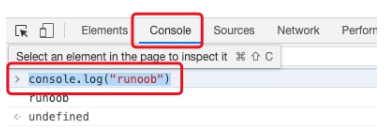
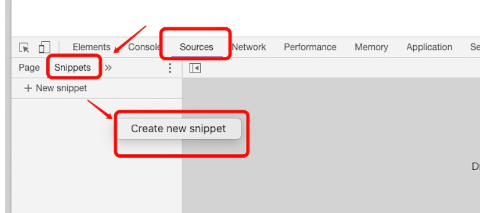
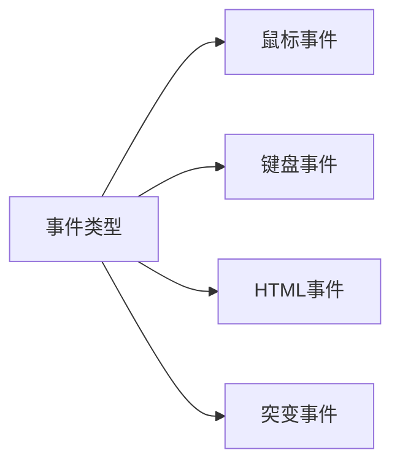

# JavaScript教程

## JavaScript简介

JavaScript 是互联网上最流行的脚本语言，这门语言可用于 HTML 和 web，更可广泛用于服务器、PC、笔记本电脑、平板电脑和智能手机等设备。

HTML 中的 Javascript 脚本代码必须位于 `<script>` 与 `</script>` 标签之间。

Javascript 脚本代码可被放置在 HTML 页面的 `<body>` 和 `<head>` 部分中。

### `<script>`标签

```html
<script>
	alert("我的第一个 JavaScript");
</script>
```

### `<body>`标签

```html
<!DOCTYPE html>
<html>
<body>
    .
    .
    <script>
    document.write("<h1>这是一个标题</h1>");
    document.write("<p>这是一个段落</p>");
    </script>
    .
    .
</body>
</html>
```

### 函数和事件

通常，我们需要在某个事件发生时执行代码，比如当用户点击按钮时。

如果我们把 JavaScript 代码放入函数中，就可以在事件发生时调用该函数。

### `<head>`中的函数

```html
<!DOCTYPE html>
<html>
<head>
<script>
	function myFunction() {
		document.getElementById("demo").innerHTML="我的第一个 JavaScript 函数";
	}
</script>
</head>
<body>
	<h1>我的 Web 页面</h1>
	<p id="demo">一个段落</p>
	<button type="button" onclick="myFunction()">尝试一下</button>
</body>
</html>
```

### `<body>`中的函数

```html
<!DOCTYPE html>
<html>
<body>
	<script>
        function myFunction() {
            document.getElementById("demo").innerHTML="我的第一个 JavaScript 函数";
        }
</script>
	<h1>我的 Web 页面</h1>
	<p id="demo">一个段落</p>
	<button type="button" onclick="myFunction()">尝试一下</button>
</body>
</html>
```

### 外部的JavaScript

```html
<script type="text/javascript" src="demo.js">
    document.write("这条语句没有执行");
</script>
```

## Chrome 浏览器中执行 JavaScript

Chrome 是由 Google 开发的免费网页浏览器，对于前端开发来说（尤其是调试代码）非常方便。

我们在 Chrome 浏览器中可以通过按下 `F12` 按钮或者右击页面，选择**"检查"**来开启开发者工具。

### Console 窗口调试 JavaScript 代码

打开开发者工具后，我们可以在 Console 窗口调试 JavaScript代码：



### Chrome snippets 小脚本



## 输出

1. 使用 `window.alert()` 弹出警告框。

   ```html
   <script>
   	window.alert(5 + 6);
   </script>
   ```

2. 使用 `document.write()` 方法将内容写到 HTML 文档中。

   出于测试目的，您可以将JavaScript直接写在HTML 文档中：

   ```html
   <script>
   	document.write(Date());
   </script>
   ```

   ```
   Fri Mar 17 2023 00:32:59 GMT+0800 (中国标准时间)
   ```

3. 使用 `innerHTML` 写入到 HTML 元素。

   使用 "id" 属性来标识 HTML 元素，并 innerHTML 来获取或插入元素内容：

   ```html
   <p id="demo">我的第一个段落。</p>
   <script>
       document.getElementById("demo").innerHTML = "段落已修改。";
   </script>
   ```

4. 使用 `console.log` 写入到浏览器的控制台。

   若浏览器支持调试，可在调试窗口点击Console菜单。

   ```html
   <script>
       a = 5;
       b = 6;
       c = a + b;
       console.log(c);
   </script>
   ```

## 语法

JavaScript是一个轻量级，但功能强大的编程语言。

JavaScript 使用关键字 `var` 来定义变量， 使用等号来为变量赋值：

```javascript
var x, length
x = 5
length = 6
```

JavaScript使用`//`作为注释符。

JavaScript 有多种数据类型：数字，字符串，数组，对象等等：

```javascript
		var length = 16;                                  // Number 通过数字字面量赋值
		var points = x * 10;                              // Number 通过表达式字面量赋值
		var lastName = "Johnson";                         // String 通过字符串字面量赋值
		var cars = ["Saab", "Volvo", "BMW"];              // Array  通过数组字面量赋值
		var person = {firstName:"John", lastName:"Doe"};  // Object 通过对象字面量赋值
```

## 数据类型

在 JavaScript 中有 6 种不同的数据类型：

- `string`
- `number`
- `boolean`
- `object`
- `function`
- `symbol`

3 种对象类型：

- `Object`
- `Date`
- `Array`

2 个不包含任何值的数据类型：

- `null`
- `undefined`

值类型（基本类型）：字符串（String）、数字(Number)、布尔(Boolean)、空（Null）、未定义（Undefined）、Symbol。

引用数据类型（对象类型）：对象(Object)、数组(Array)、函数(Function)，还有两个特殊的对象：正则（RegExp）和日期（Date）。

变量的数据类型可以使用 `typeof` 操作符来查看：

```javascript
typeof "John"                // 返回 string
typeof 3.14                  // 返回 number
typeof false                 // 返回 boolean
typeof [1,2,3,4]             // 返回 object
typeof {name:'John', age:34} // 返回 object
```

### 字符串

在字符串中使用引号，只要不匹配包围字符串的引号即可：

```javascript
var answer = "He is called 'Johnny'";
var answer = 'He is called "Johnny"';
```

字符串可以是对象：

```javascript
var y = new String("John");
typeof y;
```

> 不要创建 String 对象。它会拖慢执行速度，并可能产生其他副作用。

#### 字符串属性

| 属性          | 描述                       |
| :------------ | :------------------------- |
| `constructor` | 返回创建字符串属性的函数   |
| `length`      | 返回字符串的长度           |
| `prototype`   | 允许您向对象添加属性和方法 |

```javascript
function my_function() {
    var x = new String("John");
    return x.constructor + " " + x.prototype;
}
```

```
function String() { [native code] } undefined
```

#### 字符串方法

| 方法              | 描述                                               |
| :---------------- | :------------------------------------------------- |
| `charAt()`        | 返回指定索引位置的字符                             |
| `concat()`        | 连接两个或多个字符串，返回连接后的字符串           |
| `indexOf()`       | 返回字符串中检索指定字符第一次出现的位置           |
| `lastIndexOf()`   | 返回字符串中检索指定字符最后一次出现的位置         |
| `localeCompare()` | 用本地特定的顺序来比较两个字符串                   |
| `match()`         | 找到一个或多个正则表达式的匹配                     |
| `replace()`       | 替换与正则表达式匹配的子串                         |
| `search()`        | 检索与正则表达式相匹配的值                         |
| `slice()`         | 提取字符串的片断，并在新的字符串中返回被提取的部分 |
| `split()`         | 把字符串分割为子字符串数组                         |
| `substr()`        | 从起始索引号提取字符串中指定数目的字符             |
| `substring()`     | 提取字符串中两个指定的索引号之间的字符             |
| `toLowerCase()`   | 把字符串转换为小写                                 |
| `toString()`      | 返回字符串对象值                                   |
| `toUpperCase()`   | 把字符串转换为大写                                 |
| `trim()`          | 移除字符串首尾空白                                 |
| `valueOf()`       | 返回某个字符串对象的原始值                         |

### 数字

```javascript
var x1 = 34.00;      //使用小数点来写
var x2 = 34;         //不使用小数点来写
```

### 布尔

```javascript
var x = true;
var y = false;
```

### 数组

```javascript
var cars = new Array();
cars[0] = "Saab";
cars[1] = "Volvo";
cars[2] = "BMW";

var cars = new Array("Saab", "Volvo", "BMW");

var cars = ["Saab", "Volvo", "BMW"];
```

### 对象

对象由花括号分隔。在括号内部，对象的属性以名称和值对的形式 (name : value) 来定义。属性由逗号分隔：

```javascript
var person = {firstname: "John", lastname = "Doe", id = 5566};
```

对象属性有两种寻址方式：

```javascript
name = person.lastname;
name = person["lastname"];
```

`Undefined`和`Null`

```javascript
var carname = new String;
var x = new Number;
var person = new Object;
```

>  JavaScript 变量均为对象。当您声明一个变量时，就创建了一个新的对象。

### 声明提升

JavaScript 中，函数及变量的声明都将被提升到函数的最顶部。

JavaScript 中，变量可以在使用后声明。

## 对象

### 对象定义

对象也是一个变量，但对象可以包含多个值（多个变量），每个值以 `name:value` 对呈现。

```javascript
var car = {name:"Fliat", model=500, color:"white"};
```

> JavaScript 对象是变量的容器。

### 对象方法

对象的方法定义了一个函数，并作为对象的属性存储。

```javascript
name = person.fullName();	// 方法
name = person.fullName;		// 属性
```

使用以下语法创建对象方法：

```javascript
methodName : function() {
	// ...
}
```

## 函数

函数是由事件驱动的或者当它被调用时执行的可重复使用的代码块。

### 常用系统函数

```java
// eval(string): 计算表达式结果
document.write("1+2=" + eval("1+2") + "<br/>");
// escape(string): 编码字符串
document.write(escape("?") + "</br>");
// unescape(string): 解码字符串
document.write(unescape("%3F") + "</br>");
// parsexx(string): 解析字符串
document.write(parseFloat("3.1321") + "<br/>");
document.write(parseInt("332") + "<br/>");
// isNaN(string): 判断是否为非数值型
document.write(isNaN(12 * 3) + "</br>");
// toString(radix): 将对象转化为radix(2-36)进制
var a = 12;
document.write(a.toString(2) + "</br>");
// 将浮点数转为固定位
var b = Math.PI;
document.write(b.toFixed(3) + "</br>");
var s = "12341234";
// indexOf(val, fromIndex): 查找首次出现位置
document.write(s.indexOf("12"));
// lastIndexOf(val, fronIndex): 查找最后一次出现位置
document.write(s.lastIndexOf("12") + "</br>");
// charAt(index): 指定位置字符
document.write(s.charAt(2) + "<br/>");
// substring(start, stop): 截取字符串
document.write(s.substring(1, 2) + "</br>");
```

### 函数语法

函数就是包裹在花括号中的代码块，前面使用了关键词 `function`：

```javascript
// 无参
function functionname() {
    // 执行代码
}
// 有参
function functionname(var1, var2) {
    // 执行代码
}
// 带返回值
function functionname(var1, var2) {
    var x = 5;
    return x;
}
```

把值赋给尚未声明的变量，该变量将被自动作为 `window` 的一个属性。

所有数据变量都属于`window`对象。

```javascript
var var1 = 1;			 // 不可配置全局属性
var2 = 2;				 // 没有使用 var 声明，可配置全局属性
console.log(this.var1);	 // 1
console.log(window.var1);// 1
console.log(window.var2);// 2

delete var1;			 // false 无法删除
console.log()
```

`javascript:void(0)`指定要计算一个表达式但是不返回值。

语法格式为：

```javascript
void func()
javascript:void func()

void(func())
javascript:void(func())
```

```javascript
<p>点击以下链接查看结果：</p>
<a href="javascript:void(alert('Warning!!!'))">点我!</a>
```

> `href="#"`：`#` 包含了一个位置信息，默认的锚是`#top` 也就是网页的上端。
>
> `javascript:void(0)`：死链接。

### 构造函数

```javascript
var myFunction = new Function("a", "b", "return a * b");

var x = myFunction(4, 3);
```

### 函数提升

函数可以在声明之前调用：

```javascript
myFunction(5);

function myFunction(y) {
    return y * y;
}
```

### 自调用函数

如果表达式后面紧跟 `()` ，则会自动调用。不能自调用声明的函数。

通过添加括号，来说明它是一个函数表达式：

```javascript
(function () {
    var x = "Hello!!";      // 我将调用自己
})();
```

### 箭头函数

ES6 新增了箭头函数。

箭头函数表达式的语法比普通函数表达式更简洁。

```javascript
// ES5
var x = function(x, y) {
     return x * y;
}
 
// ES6
const x = (x, y) => x * y;
```

使用 `const` 比使用 `var` 更安全，因为函数表达式始终是一个常量。

### 隐式参数

ES6 支持函数带有默认参数：

```javascript
function myFunction(x, y = 10) {
    // y is 10 if not passed or undefined
    return x + y;
}
 
myFunction(0, 2) // 输出 2
myFunction(5); // 输出 15, y 参数的默认值
```

### arguments 对象

JavaScript 函数有个内置的对象 `arguments` 对象。`arguments` 对象包含了函数调用的参数数组。

```javascript
x = findMax(1, 123, 500, 115, 44, 88);
 
function findMax() {
    var i, max = arguments[0];
    
    if(arguments.length < 2) return max;
 
    for (i = 0; i < arguments.length; i++) {
        if (arguments[i] > max) {
            max = arguments[i];
        }
    }
    return max;
}
```

### 内嵌函数

JavaScript 支持嵌套函数。嵌套函数可以访问上一层的函数变量。

```javascript
function add() {
    var counter = 0;
    function plus() {
        counter += 1;
    }
    plus();
    return counter;
}
```

### 闭包

自我调用函数只执行一次。设置计数器为 0。并返回函数表达式。闭包使得函数拥有私有变量变成可能。

```javascript
var add = (function() {
    counter = 0;
    return function() {
        return counter += 1;
    }
})();
```

## 事件

HTML 事件可以是浏览器行为，也可以是用户行为。



```html
<button onclick="getElementById('demo').innerHTML=Date()">现在的时间是?</button>

<button onclick="this.innerHTML=Date()">现在的时间是?</button>
```

下面是一些常见的HTML事件的列表：

| 事件          | 描述                                 |
| :------------ | :----------------------------------- |
| `onchange`    | HTML 元素改变                        |
| `onclick`     | 用户点击 HTML 元素                   |
| `onmouseover` | 鼠标指针移动到指定的元素上时发生     |
| `onmouseout`  | 用户从一个 HTML 元素上移开鼠标时发生 |
| `onkeydown`   | 用户按下键盘按键                     |
| `onload`      | shi浏览器已完成页面的加载            |

### 事件句柄

事件句柄又称事件处理函数，是指事件发生时要进行的操作。

```html
<mark handle="code"></mark>
```

### 事件处理

#### 静态指定

```html
<form action="" method="post">
    <input type="button" value="通过JS输出信息" onclick="window.alert('你好')">
</form>
```

#### 动态指定

基本语法：

```javascript
Object.onclick=function() {
    // 事件处理函数
}
```


## 条件语句

### 比较运算符

| 运算符 | 描述                                               |
| :----- | :------------------------------------------------- |
| `===`  | 绝对等于（值和类型均相等）                         |
| `!==`  | 不绝对等于（值和类型有一个不相等，或两个都不相等） |

### `if`语句

```javascript
if (time < 10) {
    document.write("<b>早上好</b>");
} else if (time >= 10 && time<20) {
    document.write("<b>今天好</b>");
} else {
    document.write("<b>晚上好!</b>");
}
```

### `switch`语句

```javascript
var d = new Date().getDay(); 
switch (d) { 
    case 0:
        x = "今天是星期日"; 
        break; 
    case 1:
        x = "今天是星期一"; 
        break; 
    case 2:
        x = "今天是星期二"; 
        break; 
    case 3:
        x = "今天是星期三"; 
        break; 
    case 4:
        x = "今天是星期四"; 
        break; 
    case 5:
        x = "今天是星期五"; 
        break; 
    case 6: 
        x = "今天是星期六"; 
        break;
    default:
        x = "今天是星期天";
}
```

## 循环语句

### `for`循环

```javascript
for (var i = 0; i < cars.length; i++) {
	documents.write(cars[i] + "<br>");
}
for (car in cars) {
	documents.write(car + "<br>");   
}
```

### `while`循环

```javascript
while (i < 5) {
    x = x + "The number is " + i + "<br>";
    i++;
}
```

### `do-while`循环

```javascript
do {
    x = x + "The number is " + i + "<br>";
    i++;
} while (i < 5);
```

### 标签

```javascript
cars = ["BMW", "Volvo", "Saab", "Ford"];
list: {
    document.write(cars[0] + "<br>"); 
    document.write(cars[1] + "<br>"); 
    document.write(cars[2] + "<br>"); 
    break list;
    document.write(cars[3] + "<br>"); 
    document.write(cars[4] + "<br>"); 
    document.write(cars[5] + "<br>"); 
}
```

### 正则表达式

正则表达式（Regular Expression）使用单个字符串来描述、匹配一系列符合某个句法规则的字符串搜索模式。

## 语法

```javascript
/正则表达式主体[/修饰符]
```

在 JavaScript 中，正则表达式通常用于两个字符串方法 : `search()`和 `replace()`。

```javascript
var str = "Visit Runoob!"; 
var n = str.search(/Runoob/i);
```

```javascript
var str = document.getElementById("demo").innerHTML; 
var txt = str.replace("Microsoft","Runoob");
```

### 正则表达式修饰符

| 修饰符 | 描述                                                     |
| :----- | :------------------------------------------------------- |
| `i`    | 执行对大小写不敏感的匹配。                               |
| `g`    | 执行全局匹配（查找所有匹配而非在找到第一个匹配后停止）。 |
| `m`    | 执行多行匹配。                                           |

## 正则表达式模式

| 表达式  | 描述                       |
| :------ | :------------------------- |
| `[abc]` | 查找方括号之间的任何字符。 |
| `[0-9]` | 查找任何从 0 至 9 的数字。 |
| `(x|y)` | 查找任何以 \| 分隔的选项。 |

| 元字符   | 描述                                        |
| :------- | :------------------------------------------ |
| `\d`     | 查找数字。                                  |
| `\s`     | 查找空白字符。                              |
| `\b`     | 匹配单词边界。                              |
| `\uxxxx` | 查找以十六进制数 xxxx 规定的 Unicode 字符。 |

| 量词 | 描述                                      |
| :--- | :---------------------------------------- |
| `n+` | 匹配任何包含**至少一个** *n* 的字符串。   |
| `n*` | 匹配任何包含**零个或多个** *n* 的字符串。 |
| `n?` | 匹配任何包含**零个或一个** *n* 的字符串。 |

### 使用 `test()`

```javascript
var pat = /e/;
pat.test("The best friend"); // true

/e/.test("The best friend"); // true
```

### 使用 `exec()`

`exec()` 方法用于检索字符串中的正则表达式的匹配。

该函数返回一个数组，其中存放匹配的结果。如果未找到匹配，则返回值为 `null`。

```
function isValid(str) { 
  var pat = /\d+/;
  return pat.exec(str);
}

str = "1234abd__"
document.write(isValid(str));
document.write("<br>");

str2 = "$32343#"
document.write(isValid(str2));
document.write("<br>");
```

```
1234
32343
```

## 错误

### `try-catch`语句

```javascript
try {
    ...    //异常的抛出
} catch (e) {
    ...    //异常的捕获与处理
} finally {
    ...    //结束处理
}
```

### `throw`语句

```javascript
function myFunction() {
    var message, x;
    message = document.getElementById("message");
    message.innerHTML = "";
    x = document.getElementById("demo").value;
    try { 
        if(x == "") {
            throw "值为空";
        }
        if(isNaN(x)) {
            throw "不是数字";
        }
        x = Number(x);
        if(x < 5) {
            throw "太小";
        }
        if(x > 10) {
            throw "太大";
        }
    }
    catch(err) {
        message.innerHTML = "错误: " + err;
    }
}
```

## 调试

### `console.log()`方法

```javascript
a = 5;
b = 6;
c = a + b;
console.log(c);
```

### 设置断点

在调试窗口中，你可以设置 JavaScript 代码的断点。

在每个断点上，都会停止执行 JavaScript 代码，以便于我们检查 JavaScript 变量的值。

### `debugger`关键字

`debugger` 关键字用于停止执行 JavaScript，并调用调试函数。

这个关键字与在调试工具中设置断点的效果是一样的。

```javascript
var x = 15 * 5;
debugger;
document.getElementbyId("demo").innerHTML = x;
```

## 严格模式

JavaScript 严格模式（strict mode）即在严格的条件下运行。

`use strict`指令在 JavaScript 1.8.5 (ECMAScript5) 中新增。目的是指定代码在严格条件下执行。严格模式下你不能使用未声明的变量。

### 严格模式的限制

1. 不允许使用未声明的变量
2. 不允许删除变量或对象
3. 不允许删除函数
4. 不允许变量重名
5. 不允许使用转义字符
6. 不允许对只读属性赋值
7. 不允许对一个使用getter方法读取的属性进行赋值
8. 不允许删除一个不允许删除的属性
9. 变量名不能使用eval字符串，必须指定`""`
10. 禁止`this`关键字指向全局对象

### 保留关键字

- `implements`
- `interface`
- `let`
- `package`
- `private`
- `protected`
- `public`
- `static`
- `yield`

## 使用误区

### 浮点问题

JavaScript 中的所有数据都是以 64 位浮点型数据(float) 来存储。

所有的编程语言，包括 JavaScript，对浮点型数据的精确度都很难确定：

```javascript
var x = 0.1;
var y = 0.2;
var z = x + y            // z 的结果为 0.30000000000000004
if (z == 0.3)            // 返回 false

var z = (x * 10 + y * 10) / 10;     // z 的结果为 0.3
```

### 字符串分行

在字符串中直接使用回车换行报错：

```javascript
var x = "Hello
World!";

var x = "Hello \
World!";
```

### Undefined 不是 Null

对象只有被定义才有可能为`null`，否则为 `undefined`。

## 表单

HTML 表单验证可以通过 JavaScript 来完成。

```javascript
<!DOCTYPE html>
<html>
<head>
<meta charset="utf-8">
<title>菜鸟教程(runoob.com)</title>
<script>	
	function validate_form() {
		var x = document.forms["my-form"]["fname"].value;
		if (x == null || x == "") {
			alert("请输入姓名");
			return false;
		}
	}
</script>
</head>
<body>
	<form name="my-form" action="demo_form.php" onsubmit="return validate_form()" method="post">
		姓名：<input type="text" name="fname"/>
	</form>

</body>
</html>
```

如果表单字段 (fname) 的值为空，`required` 属性会阻止表单提交：

```html
<form action="demo_form.php" method="post">
    <input type="text" name="fname" required="required"/>
    <input type="submit" value="提交">
</form>
```

> Internet Explorer 9 及更早 IE 浏览器不支持表单自动验证。

### 数据验证

典型的数据验证有：

- 必需字段是否有输入
- 用户是否输入了合法的数据
- 在数字字段是否输入了文本

### HTML 约束验证

HTML5 新增了 HTML 表单的验证方式：约束验证（constraint validation）。

约束验证是表单被提交时浏览器用来实现验证的一种算法。

- HTML 输入属性
- CSS 伪类选择器
- DOM 属性和方法

## 表单验证

### 必填项

```html
<form name="my-form" action="demo_form.php" onsubmit="return validate_form()" method="post">
    姓名：<input type="text" name="fname"/>
</form>
```

```javascript
function validate_form() {
    var x = document.forms["my-form"]["fname"].value;
    if (x == null || x == "") {
        alert("请输入姓名");
        return false;
    }
}
```

### 格式化验证

```html
<form name="my-form" action="demo-form.php" onsubmit="return validate_e()" method="post">
    Email: <input type="text" name="email"/>
    <input type="submit" value="提交"/>
</form>
```

```javascript
function validate_e-mail() {
    var x = document.fonts["my-form"]["email"].value;
    var atpos = x.indexOf('@');
    var dotpos = x.lastIndexOf('.');
    if (atpos < 1 || dotpos < atpos + 2 || dotpos + 2 >= x.length) {
        alert("不是一个有效的e-mail地址");
        return false;
    }
}
```

### 验证API

```html
	<input id="id1" type="number" min="100" max="300" required/>
	<button onclick="myfunction()">验证</button>
	<p id="demo"></p>
```

```javascript
<script>
    function myfunction() {
    var inputObj = document.getElementById("id1");
    if (inputObj.checkValidity() == false) {
        document.getElementById("demo").innerHTML = inputObj.validationMessage;
    } else {
        document.getElementById("demo").innerHTML = "输入正确";
    }
} 
</script>
```

#### 约束验证 DOM 属性

| 属性                | 描述                                  |
| :------------------ | :------------------------------------ |
| `validity`          | 布尔属性值，返回 input 输入值是否合法 |
| `validationMessage` | 浏览器错误提示信息                    |
| `willValidate`      | 指定 input 是否需要验证               |

## `let` 和 `const`

ES2015(ES6)新增加了两个重要的 JavaScript 关键字: `let` 和 `const`。

### `let`

let 声明的变量只在 let 命令所在的代码块内有效。

const 声明一个只读的常量，一旦声明，常量的值就不能改变。

使用 var 关键字重新声明变量可能会带来问题。

在块中重新声明变量会重新声明块外的变量：

```javascript
var x = 10;
// x = 10
{ 
    var x = 2;
    // x = 2 
}
// x = 2
```

在 JavaScript 中, 全局作用域是针对 JavaScript 环境。

在 HTML 中, 全局作用域是针对 window 对象。

使用 `var` 关键字声明的全局作用域变量属于 window 对象：

```javascript
var carName = "Volvo";
// 可以使用 window.carName 访问变量
let carName = "Volvo";
// 不能使用 window.carName 访问变量
```

### `const`

const 的本质: const 定义的变量并非常量，并非不可变，它定义了一个常量引用一个值。使用 const 定义的对象或者数组，其实是可变的。下面的代码并不会报错：

```javascript
// 创建常量对象
const car = {type:"Fiat", model:"500", color:"white"};
// 修改属性
car.color = "red";
// 添加属性
car.owner = "Johnson";
```

但是我们不能对常量对象重新赋值：

```javascript
const car = {type:"Fiat", model:"500", color:"white"}; car = {type:"Volvo", model:"EX60", color:"red"};    // 错误
```

## JSON

JSON（JavaScript Object Notation）是一种轻量级的数据交换格式，独立于语言，通常用于服务端向网页传递数据 。

JSON 格式在语法上与创建 JavaScript 对象代码是相同的。

### JSON对象

```json
{"name":"Google", "url":"www.google.com"}
```

### JSON数组

```json
"sites":[
    {"name":"Runoob", "url":"www.runoob.com"}, 
    {"name":"Google", "url":"www.google.com"},
    {"name":"Taobao", "url":"www.taobao.com"}
]
```

### JSON 转换

```javascript
var text = '{"sites" : [' +
'{"name":"Runoob" , "url":"www.runoob.com"},' +
'{"name":"Google" , "url":"www.google.com"},' +
'{"name":"Taobao" , "url":"www.taobao.com"} ]}';
var obj = JSON.parse(text);
```

## 异步编程

### 回调函数

```javascript
function print() {
   document.getElementById("demo").innerHTML="RUNOOB!";
}
setTimeout(print, 3000);
```

执行之后会产生一个子线程，子线程会等待 3 秒，然后执行回调函数 "print"，在命令行输出 "RUNOOB!"。

### 异步 AJAX

XMLHttpRequest 常常用于请求来自远程服务器上的 XML 或 JSON 数据。一个标准的 XMLHttpRequest 对象往往包含多个回调：

```javascript
var xhr = new XMLHttpRequest();
 
xhr.onload = function () {
    // 输出接收到的文字数据
    document.getElementById("demo").innerHTML=xhr.responseText;
}
 
xhr.onerror = function () {
    document.getElementById("demo").innerHTML="请求出错";
}
 
// 发送异步 GET 请求
xhr.open("GET", "https://www.runoob.com/try/ajax/ajax_info.txt", true);
xhr.send();
```

XMLHttpRequest 的 onload 和 onerror 属性都是函数，分别在它请求成功和请求失败时被调用。

## 类

类是用于创建对象的模板。

```javascript
class Coder {
	constructor(name, age) {
        this.name = name;
        this.age = age;
    }
    method1() {
        statements;
    }
}
let coder = new Coder("HZy", 20);
```

### 类表达式

```javascript
// 匿名类
let coder = class {
    constructor(name, age) {
        this.name = name;
        this.age = age;
    }
};

// 命名类
let coder = class Coder {
	constructor(name, age) {
        this.name = name;
        this.age = age;
    }
};
```

类声明和类表达式的主体都执行在严格模式下。比如，构造函数，静态方法，原型方法，getter 和 setter 都在严格模式下执行。

### 子类

```javascript
代码如下：

// 基类
class Animal {
    // eat() 函数
    // sleep() 函数
};
 
 
//派生类
class Dog extends Animal {
    // bark() 函数
};
```

### getter 和 setter

```javascript
class Runoob {
  constructor(name) {
    this.sitename = name;
  }
  get s_name() {
    return this.sitename;
  }
  set s_name(x) {
    this.sitename = x;
  }
}
```

在属性名称前使用下划线字符 **_** 将 getter/setter 与实际属性分开：

```javascript
class Runoob {
  constructor(name) {
    this._sitename = name;
  }
  set sitename(x) {
    this._sitename = x;
  }
  get sitename() {
    return this._sitename;
  }
}
 
let noob = new Runoob("菜鸟教程");
noob.sitename = "RUNOOB";
document.getElementById("demo").innerHTML = noob.sitename;
```

类声明不会提升。

### 静态方法

```javascript
class Runoob {
  constructor(name) {
    this.name = name;
  }
  static hello(x) {
    return "Hello " + x.name;
  }
}
let noob = new Runoob("菜鸟教程");
document.getElementById("demo").innerHTML = Runoob.hello(noob);
```

## 原型对象

所有的 JavaScript 对象都会从一个 prototype（原型对象）中继承属性和方法。

所有的 JavaScript 对象都会从一个 prototype（原型对象）中继承属性和方法，例如`Date`对象从`Date.prototype`继承。

所有 JavaScript 中的对象都是位于原型链顶端的 Object 的实例。

使用 prototype 属性就可以给对象的构造函数添加新的属性：

```javascript
function Person(first, last, age, eyecolor) {
  this.firstName = first;
  this.lastName = last;
  this.age = age;
  this.eyeColor = eyecolor;
}
 
Person.prototype.nationality = "English";
```

可以使用 prototype 属性就可以给对象的构造函数添加新的方法：

```javascript
function Person(first, last, age, eyecolor) {
  this.firstName = first;
  this.lastName = last;
  this.age = age;
  this.eyeColor = eyecolor;
}
 
Person.prototype.name = function() {
  return this.firstName + " " + this.lastName;
};
```

