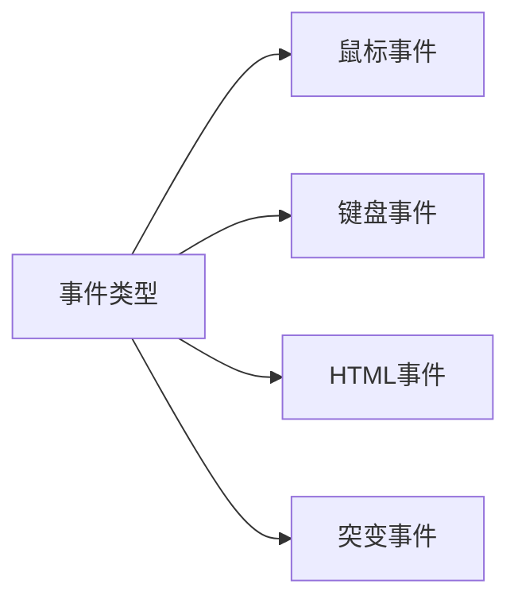

# JavaScript教程

## JavaScript简介

JavaScript 是互联网上最流行的脚本语言，这门语言可用于 HTML 和 web，更可广泛用于服务器、PC、笔记本电脑、平板电脑和智能手机等设备。

HTML 中的 Javascript 脚本代码必须位于 `<script>` 与 `</script>` 标签之间。

Javascript 脚本代码可被放置在 HTML 页面的 `<body>` 和 `<head>` 部分中。

### `<script>`标签

```html
<script>
	alert("我的第一个 JavaScript");
</script>
```

### `<body>`标签

```html
<!DOCTYPE html>
<html>
<body>
    .
    .
    <script>
    document.write("<h1>这是一个标题</h1>");
    document.write("<p>这是一个段落</p>");
    </script>
    .
    .
</body>
</html>
```

## JavaScript引入方式

### 内部脚本

```html
<!DOCTYPE html>
<html>
<head>
<script>
	function myFunction() {
		document.getElementById("demo").innerHTML="我的第一个 JavaScript 函数";
	}
</script>
</head>
<body>
	<h1>我的 Web 页面</h1>
	<p id="demo">一个段落</p>
	<button type="button" onclick="myFunction()">尝试一下</button>
</body>
</html>
```

```html
<!DOCTYPE html>
<html>
<body>
	<script>
        function myFunction() {
            document.getElementById("demo").innerHTML="我的第一个 JavaScript 函数";
        }
</script>
	<h1>我的 Web 页面</h1>
	<p id="demo">一个段落</p>
	<button type="button" onclick="myFunction()">尝试一下</button>
</body>
</html>
```

### 外部脚本

```html
<script type="text/javascript" src="demo.js">
</script>
```

## Chrome 浏览器中执行 JavaScript

Chrome 是由 Google 开发的免费网页浏览器，对于前端开发来说（尤其是调试代码）非常方便。

我们在 Chrome 浏览器中可以通过按下 `F12` 按钮或者右击页面，选择**"检查"**来开启开发者工具。

### Console 窗口调试 JavaScript 代码

打开开发者工具后，我们可以在 Console 窗口调试 JavaScript代码：


### Chrome snippets 小脚本


## 基本语法

### 输出语句

1. 使用 `window.alert()` 弹出警告框。

   ```html
   <script>
   	window.alert(5 + 6);
   </script>
   ```

2. 使用 `document.write()` 方法将内容写到 HTML 文档中。

   出于测试目的，您可以将JavaScript直接写在HTML 文档中：

   ```html
   <script>
   	document.write(Date());
   </script>
   ```

   ```
   Fri Mar 17 2023 00:32:59 GMT+0800 (中国标准时间)
   ```

3. 使用 `innerHTML` 写入到 HTML 元素。

   使用 "id" 属性来标识 HTML 元素，并 innerHTML 来获取或插入元素内容：

   ```html
   <p id="demo">我的第一个段落。</p>
   <script>
       document.getElementById("demo").innerHTML = "段落已修改。";
   </script>
   ```

4. 使用 `console.log` 写入到浏览器的控制台。

   若浏览器支持调试，可在调试窗口点击Console菜单。

   ```html
   <script>
       a = 5;
       b = 6;
       c = a + b;
       console.log(c);
   </script>
   ```

### 变量

JavaScript是一个轻量级，但功能强大的编程语言。

js 中的变量名命名也有如下规则，和java语言基本都相同

* 组成字符可以是任何字母、数字、下划线（_）或美元符号（$）
* 数字不能开头
* 建议使用驼峰命名

JavaScript 使用关键字 `var` 来定义变量， 使用等号来为变量赋值：

```javascript
var x, length
x = 5
length = 6
```

JavaScript使用`//`作为注释符。

JavaScript 有多种数据类型：数字，字符串，数组，对象等等：

```javascript
		var length = 16;                                  // Number 通过数字字面量赋值
		var points = x * 10;                              // Number 通过表达式字面量赋值
		var lastName = "Johnson";                         // String 通过字符串字面量赋值
		var cars = ["Saab", "Volvo", "BMW"];              // Array  通过数组字面量赋值
		var person = {firstName:"John", lastName:"Doe"};  // Object 通过对象字面量赋值
```

针对如上的问题，ECMAScript 6 新增了 `let `关键字来定义变量。它的用法类似于 `var`，但是所声明的变量，只在 `let` 关键字所在的代码块内有效，且不允许重复声明。

### 数据类型

JavaScript 中提供了两类数据类型：原始类型 和 引用类型。

>  NaN是一个特殊的number类型的值

在 JavaScript 中有 6 种不同的数据类型：

- `string`
- `number`
- `boolean`
- `object`
- `function`
- `symbol`

3 种对象类型：

- `Object`
- `Date`
- `Array`

2 个不包含任何值的数据类型：

- `null`
- `undefined`

> `null`返回`Object`实际是JavaScript中的一个错误。如今`null`被认为是对象的占位符，从而解释这一矛盾。

当声明的变量未初始化时，该变量的默认值是 `undefined`。

JavaScript 中的所有数据都是以 64 位浮点型数据(float) 来存储。

所有的编程语言，包括 JavaScript，对浮点型数据的精确度都很难确定：

```javascript
var x = 0.1;
var y = 0.2;
var z = x + y            // z 的结果为 0.30000000000000004
if (z == 0.3)            // 返回 false

var z = (x * 10 + y * 10) / 10;     // z 的结果为 0.3
```

### 字符串分行

在字符串中直接使用回车换行报错：

```javascript
var x = "Hello
World!";

var x = "Hello \
World!";
```

### `let` 和 `const`

ES2015（ES6）新增加了两个重要的 JavaScript 关键字: `let` 和 `const`。

`let` 声明的变量只在 `let` 命令所在的代码块内有效。

const 声明一个只读的常量，一旦声明，常量的值就不能改变。

使用 `var` 关键字重新声明变量可能会带来问题。

在块中重新声明变量会重新声明块外的变量：

```javascript
var x = 10;
// x = 10
{ 
    var x = 2;
    // x = 2 
}
// x = 2
```

在 JavaScript 中, 全局作用域是针对 JavaScript 环境。

在 HTML 中, 全局作用域是针对 window 对象。

使用 `var` 关键字声明的全局作用域变量属于 window 对象：

```javascript
var carName = "Volvo";
// 可以使用 window.carName 访问变量
let carName = "Volvo";
// 不能使用 window.carName 访问变量
```

const 的本质：`const` 定义的变量并非常量，并非不可变，它定义了一个常量**引用一个值**。使用 const 定义的对象或者数组，其实是可变的。下面的代码并不会报错：

```javascript
// 创建常量对象
const car = {type:"Fiat", model:"500", color:"white"};
// 修改属性
car.color = "red";
// 添加属性
car.owner = "Johnson";
```

但是我们不能对常量对象重新赋值：

const car = {type:"Fiat", model:"500", color:"white"}; car = {type:"Volvo", model:"EX60", color:"red"};    // 错误

```js
const car = {type:"Fiat", model:"500", color:"white"}; car = {type:"Volvo", model:"EX60", color:"red"};    // 错误
```

### 运算符

#### ==和===

* ==：
  1. 判断类型是否一样，如果不一样，则进行类型转换

  2. 再去比较其值

* ===：js 中的全等于：
  1. 判断类型是否一样，如果不一样，直接返回false
  2. 再去比较其值

值类型（基本类型）：字符串（String）、数字(Number)、布尔(Boolean)、空（Null）、未定义（Undefined）、Symbol。

引用数据类型（对象类型）：对象(Object)、数组(Array)、函数(Function)，还有两个特殊的对象：正则（RegExp）和日期（Date）。

变量的数据类型可以使用 `typeof` 操作符来查看：

```javascript
typeof "John"                // 返回 string
typeof 3.14                  // 返回 number
typeof false                 // 返回 boolean
typeof [1,2,3,4]             // 返回 object
typeof {name:'John', age:34} // 返回 object
```

#### 类型转换

```js
var str = + "20";
alert(str + 1) // 21
```

建议使用 `parseInt()` 函数进行转换。

### 流程控制语句

#### 比较运算符

| 运算符 | 描述                                               |
| :----- | :------------------------------------------------- |
| `===`  | 绝对等于（值和类型均相等）                         |
| `!==`  | 不绝对等于（值和类型有一个不相等，或两个都不相等） |

#### `if`语句

```javascript
if (time < 10) {
    document.write("<b>早上好</b>");
} else if (time >= 10 && time<20) {
    document.write("<b>今天好</b>");
} else {
    document.write("<b>晚上好!</b>");
}
```

#### `switch`语句

```javascript
var d = new Date().getDay(); 
switch (d) { 
    case 0:
        x = "今天是星期日"; 
        break; 
    case 1:
        x = "今天是星期一"; 
        break; 
    case 2:
        x = "今天是星期二"; 
        break; 
    case 3:
        x = "今天是星期三"; 
        break; 
    case 4:
        x = "今天是星期四"; 
        break; 
    case 5:
        x = "今天是星期五"; 
        break; 
    case 6: 
        x = "今天是星期六"; 
        break;
    default:
        x = "今天是星期天";
}
```

#### `for`循环

```javascript
for (var i = 0; i < cars.length; i++) {
	documents.write(cars[i] + "<br>");
}
for (car in cars) {
	documents.write(car + "<br>");   
}
```

#### `while`循环

```javascript
while (i < 5) {
    x = x + "The number is " + i + "<br>";
    i++;
}
```

#### `do-while`循环

```javascript
do {
    x = x + "The number is " + i + "<br>";
    i++;
} while (i < 5);
```

#### 标签

```javascript
cars = ["BMW", "Volvo", "Saab", "Ford"];
list: {
    document.write(cars[0] + "<br>"); 
    document.write(cars[1] + "<br>"); 
    document.write(cars[2] + "<br>"); 
    break list;
    document.write(cars[3] + "<br>"); 
    document.write(cars[4] + "<br>"); 
    document.write(cars[5] + "<br>"); 
}
```

## 函数

### 定义格式

函数定义格式有两种：

* 方式1

  ```js
  function 函数名(参数1,参数2..) {
      要执行的代码
  }
  ```

* 方式2

  ```js
  var 函数名 = function (参数列表) {
      要执行的代码
  }
  ```

### 函数调用

```javascript
let result = add(10,20);
```

把值赋给尚未声明的变量，该变量将被自动作为 `window` 的一个属性。

所有数据变量都属于`window`对象。

```javascript
var var1 = 1;			 // 不可配置全局属性
var2 = 2;				 // 没有使用 var 声明，可配置全局属性
console.log(this.var1);	 // 1
console.log(window.var1);// 1
console.log(window.var2);// 2

delete var1;			 // false 无法删除
console.log()
```

`javascript:void(0)`指定要计算一个表达式但是不返回值。

语法格式为：

```javascript
void func()
javascript:void func()

void(func())
javascript:void(func())
```

```javascript
<p>点击以下链接查看结果：</p>
<a href="javascript:void(alert('Warning!!!'))">点我!</a>
```

> `href="#"`：`#` 包含了一个位置信息，默认的锚是`#top` 也就是网页的上端。
>
> `javascript:void(0)`：死链接。

### 构造函数

```javascript
var myFunction = new Function("a", "b", "return a * b");

var x = myFunction(4, 3);
```

### 函数提升

函数可以在声明之前调用：

```javascript
myFunction(5);

function myFunction(y) {
    return y * y;
}
```

### 自调用函数

如果表达式后面紧跟 `()` ，则会自动调用。不能自调用声明的函数。

通过添加括号，来说明它是一个函数表达式：

```javascript
(function () {
    var x = "Hello!!";      // 我将调用自己
})();
```

### 箭头函数

ES6 新增了箭头函数。箭头函数表达式的语法比普通函数表达式更简洁。

```javascript
// ES5
var x = function(x, y) {
     return x * y;
}
 
// ES6
const x = (x, y) => x * y;
```

使用 `const` 比使用 `var` 更安全，因为函数表达式始终是一个常量。

### 隐式参数

ES6 支持函数带有默认参数：

```javascript
function myFunction(x, y = 10) {
    // y is 10 if not passed or undefined
    return x + y;
}
 
myFunction(0, 2) // 输出 2
myFunction(5); // 输出 15, y 参数的默认值
```

### arguments 对象

JavaScript 函数有个内置的对象 `arguments` 对象。`arguments` 对象包含了函数调用的参数数组。

```javascript
x = findMax(1, 123, 500, 115, 44, 88);
 
function findMax() {
    var i, max = arguments[0];
    
    if(arguments.length < 2) {
        return max;
    }
 
    for (i = 0; i < arguments.length; i++) {
        if (arguments[i] > max) {
            max = arguments[i];
        }
    }
    return max;
}
```

### 内嵌函数

JavaScript 支持嵌套函数。嵌套函数可以访问上一层的函数变量。

```javascript
function add() {
    var counter = 0;   \                       
    function plus() {
        counter += 1;
    }
    plus();
    return counter;
}
```

### 闭包

自我调用函数只执行一次。设置计数器为 0。并返回函数表达式。闭包使得函数拥有私有变量变成可能。

```javascript
var add = (function() {
    counter = 0;
    return function() {
        return counter += 1;
    }
})();

var ret = function add() {
    counter = 0;
    return function() {
        return counter += 1;
    }
};
```

## JavaScript常用对象

### Array对象

#### 定义格式

* 方式1

```js
var 变量名 = new Array(元素列表); 
```

* 方式2

```js
var 变量名 = [元素列表];
```

JavaScript 中的数组相当于 Java 中集合。数组的长度是可以变化的，而 JavaScript 是弱类型，所以可以存储任意的类型的数据。

#### 属性

```js
var arr = [1,2,3];
for (let i = 0; i < arr.length; i++) {
    alert(arr[i]);
}
```

#### 方法

* push 函数：给数组添加元素，也就是在数组的末尾添加元素

  参数表示要添加的元素

```js
// push:添加方法
var arr5 = [1,2,3];
arr5.push(10);
alert(arr5);  //数组的元素是 {1,2,3,10}
```

* splice 函数：删除元素

  参数1：索引。表示从哪个索引位置删除

  参数2：个数。表示删除几个元素

```js
// splice:删除元素
var arr5 = [1,2,3];
arr5.splice(0,1); //从 0 索引位置开始删除，删除一个元素 
alert(arr5); // {2,3}
```

### 字符串对象

在字符串中使用引号，只要不匹配包围字符串的引号即可：

```javascript
var answer = "He is called 'Johnny'";
var answer = 'He is called "Johnny"';
```

字符串可以是对象：

```javascript
var y = new String("John");
typeof y;
```

> 不要创建 String 对象。它会拖慢执行速度，并可能产生其他副作用。

#### 字符串属性

| 属性          | 描述                       |
| :------------ | :------------------------- |
| `constructor` | 返回创建字符串属性的函数   |
| `length`      | 返回字符串的长度           |
| `prototype`   | 允许您向对象添加属性和方法 |

```javascript
function my_function() {
    var x = new String("John");
    return x.constructor + " " + x.prototype;
}
```

```
function String() { [native code] } undefined
```

#### 字符串方法

| 方法              | 描述                                               |
| :---------------- | :------------------------------------------------- |
| `charAt()`        | 返回指定索引位置的字符                             |
| `concat()`        | 连接两个或多个字符串，返回连接后的字符串           |
| `indexOf()`       | 返回字符串中检索指定字符第一次出现的位置           |
| `lastIndexOf()`   | 返回字符串中检索指定字符最后一次出现的位置         |
| `localeCompare()` | 用本地特定的顺序来比较两个字符串                   |
| `match()`         | 找到一个或多个正则表达式的匹配                     |
| `replace()`       | 替换与正则表达式匹配的子串                         |
| `search()`        | 检索与正则表达式相匹配的值                         |
| `slice()`         | 提取字符串的片断，并在新的字符串中返回被提取的部分 |
| `split()`         | 把字符串分割为子字符串数组                         |
| `substr()`        | 从起始索引号提取字符串中指定数目的字符             |
| `substring()`     | 提取字符串中两个指定的索引号之间的字符             |
| `toLowerCase()`   | 把字符串转换为小写                                 |
| `toString()`      | 返回字符串对象值                                   |
| `toUpperCase()`   | 把字符串转换为大写                                 |
| `trim()`          | 移除字符串首尾空白                                 |
| `valueOf()`       | 返回某个字符串对象的原始值                         |

### 自定义对象

在 JavaScript 中自定义对象特别简单，下面就是自定义对象的格式：

```javascript
var 对象名称 = {
    属性名称1:属性值1,
    属性名称2:属性值2,
    ...,
    函数名称:function (形参列表){},
	...
};
```

## BOM

BOM（Browser Object Model）即浏览器对象模型。也就是 JavaScript 将浏览器的各个组成部分封装为对象。

若将浏览器地址栏的地址改为 `https://www.itheima.com` 就可以通过使用 BOM 中定义的 `Location` 对象的 `href` 属性，代码： `location.href = "https://itheima.com";` 

 BOM 中包含了如下对象：

* Window：浏览器窗口对象
* Navigator：浏览器对象
* Screen：屏幕对象
* History：历史记录对象
* Location：地址栏对象


### Window对象

window 对象是 JavaScript 对浏览器的窗口进行封装的对象。

该对象不需要创建直接使用 `window`，其中 `window. ` 可以省略。比如我们之前使用的 `alert()` 函数，其实就是 `window` 对象的函数，在调用是可以写成如下两种

* 显式使用 `window` 对象调用

```js
  window.alert("abc");
```

* 隐式调用

```javascript
alert("abc");
```

使用 `Location` 对象的话，就可以使用 `window` 对象获取；写成 `window.location`，而 `window.` 可以省略，简化写成 `location` 来获取 `Location` 对象。

- `setTimeout(function,毫秒值)` : 在一定的时间间隔后执行一个function，只执行一次
- `setInterval(function,毫秒值)` :在一定的时间间隔后执行一个function，循环执行

comfirm代码演示：

```javascript
// confirm()，点击确定按钮，返回true，点击取消按钮，返回false
var flag = confirm("确认删除？");
alert(flag);
```

```javascript
setInterval(function (){
    alert("hehe");
}, 2000);
```

```js
setInterval(function (){
    alert("hehe");
}, 2000);
```

### History对象

History 对象是 JavaScript 对历史记录进行封装的对象。

使用 `window.history`获取history，其中`window.` 可以省略。

History对象函数：

- `back`：获取`history`列表前一个URL
- `forward`：获取`history`列表的下一个URL

### Location对象

Location 对象是 JavaScript 对地址栏封装的对象。可以通过操作该对象，跳转到任意页面。

```js
alert("跳转至百度");
location.href = "https://www.baidu.com";
```

在点击了 确定 就会跳转到 百度 的首页。

## DOM

DOM（Document Object Model） 文档对象模型。也就是 JavaScript 将 HTML 文档的各个组成部分封装为对象。

* Document：整个文档对象
* Element：元素对象
* Attribute：属性对象
* Text：文本对象
* Comment：注释对象

DOM 是 W3C（万维网联盟）定义了访问 HTML 和 XML 文档的标准。该标准被分为 3 个不同的部分：

1. 核心 DOM：针对任何结构化文档的标准模型。 XML 和 HTML 通用的标准

   * Document：整个文档对象

   * Element：元素对象

   * Attribute：属性对象

   * Text：文本对象

   * Comment：注释对象

2. XML DOM： 针对 XML 文档的标准模型

3. HTML DOM： 针对 HTML 文档的标准模型

   该标准是在核心 DOM 基础上，对 HTML 中的每个标签都封装成了不同的对象

   * 例如：`` 标签在浏览器加载到内存中时会被封装成 `Image` 对象，同时该对象也是 `Element` 对象。
   * 例如：`<input type='button'>` 标签在浏览器加载到内存中时会被封装成 `Button` 对象，同时该对象也是 `Element` 对象。

### 获取 Element对象

HTML 中的 Element 对象可以通过 `Document` 对象获取，而 `Document` 对象是通过 `window` 对象获取。

`Document` 对象中提供了以下获取 `Element` 元素对象的函数

* `getElementById()`：根据id属性值获取，返回单个Element对象
* `getElementsByTagName()`：根据标签名称获取，返回Element对象数组
* `getElementsByName()`：根据name属性值获取，返回Element对象数组
* `getElementsByClassName()`：根据class属性值获取，返回Element对象数组

1. 根据 `id` 属性值获取上面的 `img` 元素对象，返回单个对象：

```js
var img = document.getElementById("light");
alert(img);
```

2. 根据标签名称获取所有的 `div` 元素对象


```javascript
var divs = document.getElementsByTagName("div");// 返回一个数组，数组中存储的是 div 元素对象
// alert(divs.length);  //输出 数组的长度
//遍历数组
for (let i = 0; i < divs.length; i++) {
    alert(divs[i]);
}
```

3. 获取所有的满足 `name = 'hobby'` 条件的元素对象，返回`Collecion`对象

```js
//3. getElementsByName：根据name属性值获取，返回Element对象数组
var hobbys = document.getElementsByName("hobby");
for (let i = 0; i < hobbys.length; i++) {
    alert(hobbys[i]);
}
```

4. 获取所有的满足 `class='cls'` 条件的元素对象

```js
//4. getElementsByClassName：根据class属性值获取，返回Element对象数组
var clss = document.getElementsByClassName("cls");
for (let i = 0; i < clss.length; i++) {
    alert(clss[i]);
}
```

```js
/* 更换css */
// 1，根据 id='light' 获取 img 元素对象
var img = document.getElementById("light");
// 2，修改 img 对象的 src 属性来改变图片
img.src = "../imgs/on.gif";

/* 设置元素内容 */
// 1. 获取所有的 div 元素对象
var divs = document.getElementsByTagName("div");
/**
 *  style:设置元素css样式
 *  innerHTML：设置元素内容
*/
// 2. 遍历数组，获取到每一个 div 元素对象，并修改元素内容
for (let i = 0; i < divs.length; i++) {
    //divs[i].style.color = 'red';
    divs[i].innerHTML = "呵呵";
}

/* 使所有的复选框呈现被选中的状态 */
// 1. 获取所有的 复选框 元素对象
var hobbys = document.getElementsByName("hobby");
// 2. 遍历数组，通过将 复选框 元素对象的 checked 属性值设置为 true 来改变复选框的选中状态
for (let i = 0; i < hobbys.length; i++) {
    hobbys[i].checked = true;
}
```

> `querySelectorAll()` 返回 `NodeList` 对象，包含属性节点和文本节点。

### DOM事件

#### onload 事件

`onload` 和 `onunload` 事件会在用户进入或离开页面时被触发。

```html
<body onload="checkCookies()">
```

#### onchange 事件

`onchange` 事件常结合对输入字段的验证来使用。

```html
<!-- 当用户改变输入字段的内容时，会调用 upperCase() 函数。-->
<input type="text" id="fname" onchange="upperCase()">
```

#### onmouseover 事件

`onmouseover` 和 `onmouseout` 事件可用于在用户的鼠标移至 HTML 元素上方或移出元素时触发函数。

### DOM EventListener

`addEventListener()` 方法用于向指定元素添加事件句柄，所添加的事件句柄不会覆盖已存在的事件句柄。

```js
element.addEventListener(event, function, useCapture);
```

> 不要使用 on 前缀。 例如，使用click ,而不是使用 onclick。

```js
document.getElementById("myBtn").addEventListener("click", function() {
    alert("Hello World!");
```

第三个参数是个布尔值用于描述事件是冒泡或是捕获。该参数为可选参数。

在 冒泡 中，内部元素的事件会先被触发，然后再触发外部元素，即： `<p>` 元素的点击事件先触发，然后会触发 `<div>` 元素的点击事件。

在 捕获 中，外部元素的事件会先被触发，然后才会触发内部元素的事件，即： `<div>` 元素的点击事件先触发 ，然后再触发 `<p>` 元素的点击事件。

`removeEventListener()` 方法移除由 `addEventListener()` 方法添加的事件句柄:

```js
element.removeEventListener("mousemove", myFunction);
```

### DOM元素

- `appendChild`

创建新的 HTML 元素 （节点）需要先创建一个元素，然后在已存在的元素中添加。

```html
<div id="div1">
<p id="p1">这是一个段落。</p>
<p id="p2">这是另外一个段落。</p>
</div>
 
<script>
<!-- 创建<p>元素 -->
var para = document.createElement("p");
<!-- 为<p>元素创建新的文本节点 -->
var node = document.createTextNode("这是一个新的段落。");
<!-- 将文本节点添加到<p>
para.appendChild(node);
 
var element = document.getElementById("div1");
element.appendChild(para);
</script>
```

-  `insertBefore()`

```html
<div id="div1">
<p id="p1">这是一个段落。</p>
<p id="p2">这是另外一个段落。</p>
</div>
 
<script>
var para = document.createElement("p");
var node = document.createTextNode("这是一个新的段落。");
para.appendChild(node);
 
var element = document.getElementById("div1");
var child = document.getElementById("p1");
element.insertBefore(para, child);
</script>
```

- `removeChild`

```js
var parent = document.getElementById("div1");
var child = document.getElementById("p1");
parent.removeChild(child);
```

- `replaceChild`

```js
var child = document.getElementById("p1");
parent.replaceChild(para, child);
```


## 事件监听



### 事件绑定

JavaScript 提供了两种事件绑定方式：

方式一：通过 HTML标签中的事件属性进行绑定：

```html
<input type="button" onclick='on()'>
<script>
	function on() {
	alert("我被点了");
}
</script>
```

方式二：通过 DOM 元素属性绑定

```js
document.getElementById("btn").onclick = function (){
    alert("我被点了");
}
```

### 常见事件

| 事件          | 描述                                 |
| :------------ | :----------------------------------- |
| `onchange`    | HTML 元素改变                        |
| `onclick`     | 用户点击 HTML 元素                   |
| `onmouseover` | 鼠标指针移动到指定的元素上时发生     |
| `onmouseout`  | 用户从一个 HTML 元素上移开鼠标时发生 |
| `onkeydown`   | 用户按下键盘按键                     |
| `onload`      | 浏览器已完成页面的加载               |

```js
// 1. 验证用户名是否符合规则
// 1.1 获取用户名的输入框
var usernameInput = document.getElementById("username");

// 1.2 绑定onblur事件 失去焦点
usernameInput.onblur = function () {
    // 1.3 获取用户输入的用户名
    var username = usernameInput.value.trim();

    // 1.4 判断用户名是否符合规则：长度 6~12
    if (username.length >= 6 && username.length <= 12) {
        // 符合规则
        document.getElementById("username_err").style.display = 'none';
    } else {
        // 不合符规则
        document.getElementById("username_err").style.display = '';
    }
}

// 1. 验证密码是否符合规则
// 1.1 获取密码的输入框
var passwordInput = document.getElementById("password");

// 1.2 绑定onblur事件 失去焦点
passwordInput.onblur = function() {
    // 1.3 获取用户输入的密码
    var password = passwordInput.value.trim();

    // 1.4 判断密码是否符合规则：长度 6~12
    if (password.length >= 6 && password.length <= 12) {
        //符合规则
        document.getElementById("password_err").style.display = 'none';
    } else {
        //不合符规则
        document.getElementById("password_err").style.display = '';
    }
}

// 1. 验证手机号是否符合规则
// 1.1 获取手机号的输入框
var telInput = document.getElementById("tel");

// 1.2 绑定onblur事件 失去焦点
telInput.onblur = function() {
    // 1.3 获取用户输入的手机号
    var tel = telInput.value.trim();

    // 1.4 判断手机号是否符合规则：长度 11
    if (tel.length == 11) {
        // 符合规则
        document.getElementById("tel_err").style.display = 'none';
    } else {
        // 不合符规则
        document.getElementById("tel_err").style.display = '';
    }
}
```

## 正则表达式

### 正则表达式修饰符

| 修饰符 | 描述                                                     |
| :----- | :------------------------------------------------------- |
| `i`    | 执行对大小写不敏感的匹配。                               |
| `g`    | 执行全局匹配（查找所有匹配而非在找到第一个匹配后停止）。 |
| `m`    | 执行多行匹配。                                           |

| 表达式  | 描述                       |
| :------ | :------------------------- |
| `[abc]` | 查找方括号之间的任何字符。 |
| `[0-9]` | 查找任何从 0 至 9 的数字。 |
| `(x|y)` | 查找任何以 \| 分隔的选项。 |

| 元字符   | 描述                                        |
| :------- | :------------------------------------------ |
| `\d`     | 查找数字。                                  |
| `\s`     | 查找空白字符。                              |
| `\b`     | 匹配单词边界。                              |
| `\uxxxx` | 查找以十六进制数 xxxx 规定的 Unicode 字符。 |

| 量词 | 描述                                      |
| :--- | :---------------------------------------- |
| `n+` | 匹配任何包含**至少一个** *n* 的字符串。   |
| `n*` | 匹配任何包含**零个或多个** *n* 的字符串。 |
| `n?` | 匹配任何包含**零个或一个** *n* 的字符串。 |

在 JavaScript 中，正则表达式通常用于两个字符串方法 : `search()`和 `replace()`。

```javascript
/正则表达式主体[/修饰符] /
```

```javascript
var str = "Visit Runoob!"; 
var n = str.search(/Runoob/i);
```

```javascript
var str = document.getElementById("demo").innerHTML; 
var txt = str.replace("Microsoft","Runoob");
```

### 使用 `test()`

```javascript
var pat = /e/;
pat.test("The best friend"); // true

/e/.test("The best friend"); // true
```

### 使用 `exec()`

`exec()` 方法用于检索字符串中的正则表达式的匹配。

该函数返回一个数组，其中存放匹配的结果。如果未找到匹配，则返回值为 `null`。

```
function isValid(str) { 
  var pat = /\d+/;
  return pat.exec(str);
}

str = "1234abd__"
document.write(isValid(str));
document.write("<br>");

str2 = "$32343#"
document.write(isValid(str2));
document.write("<br>");
```

```
1234
323
```

## 错误

### `try-catch`语句

```javascript
try {
    ...    //异常的抛出
} catch (e) {
    ...    //异常的捕获与处理
} finally {
    ...    //结束处理
}
```

### `throw`语句

```javascript
function myFunction() {
    var message, x;
    message = document.getElementById("message");
    message.innerHTML = "";
    x = document.getElementById("demo").value;
    try { 
        if(x == "") {
            throw "值为空";
        }
        if(isNaN(x)) {
            throw "不是数字";
        }
        x = Number(x);
        if(x < 5) {
            throw "太小";
        }
        if(x > 10) {
            throw "太大";
        }
    }
    catch(err) {
        message.innerHTML = "错误: " + err;
    }
}
```

## 调试

### `console.log()`方法

```javascript
a = 5;
b = 6;
c = a + b;
console.log(c);
```

### 设置断点

在调试窗口中，你可以设置 JavaScript 代码的断点。

在每个断点上，都会停止执行 JavaScript 代码，以便于我们检查 JavaScript 变量的值。

### `debugger`关键字

`debugger` 关键字用于停止执行 JavaScript，并调用调试函数。

这个关键字与在调试工具中设置断点的效果相同。

```javascript
var x = 15 * 5;
debugger;
document.getElementbyId("demo").innerHTML = x;
```

## 严格模式

JavaScript 严格模式（strict mode）即在严格的条件下运行。

`use strict`指令在 JavaScript 1.8.5 (ECMAScript5) 中新增。目的是指定代码在严格条件下执行。严格模式下你不能使用未声明的变量。

### 严格模式的限制

1. 不允许使用未声明的变量
2. 不允许删除变量或对象
3. 不允许删除函数
4. 不允许变量重名
5. 不允许使用转义字符
6. 不允许对只读属性赋值
7. 不允许对一个使用getter方法读取的属性进行赋值
8. 不允许删除一个不允许删除的属性
9. 变量名不能使用eval字符串，必须指定`""`
10. 禁止`this`关键字指向全局对象

### 保留关键字

- `implements`
- `interface`
- `let`
- `package`
- `private`
- `protected`
- `public`
- `static`
- `yield`

## 表单

HTML 表单验证可以通过 JavaScript 来完成。

```javascript
<!DOCTYPE html>
<html>
<head>
<meta charset="utf-8">
<title>菜鸟教程(runoob.com)</title>
<script>	
	function validate_form() {
		var x = document.forms["my-form"]["fname"].value;
		if (x == null || x == "") {
			alert("请输入姓名");
			return false;
		}
	}
</script>
</head>
<body>
	<form name="my-form" action="demo_form.php" onsubmit="return validate_form()" method="post">
		姓名：<input type="text" name="fname"/>
	</form>

</body>
</html>
```

如果表单字段 (fname) 的值为空，`required` 属性会阻止表单提交：

```html
<form action="demo_form.php" method="post">
    <input type="text" name="fname" required="required"/>
    <input type="submit" value="提交">
</form>
```

> Internet Explorer 9 及更早 IE 浏览器不支持表单自动验证。

### 数据验证

典型的数据验证有：

- 必需字段是否有输入
- 用户是否输入了合法的数据
- 在数字字段是否输入了文本

### HTML 约束验证

HTML5 新增了 HTML 表单的验证方式：约束验证（constraint validation）。

约束验证是表单被提交时浏览器用来实现验证的一种算法。

- HTML 输入属性
- CSS 伪类选择器
- DOM 属性和方法

## 表单验证

### 必填项

```html
<form name="my-form" action="demo_form.php" onsubmit="return validate_form()" method="post">
    姓名：<input type="text" name="fname"/>
</form>
```

```javascript
function validate_form() {
    var x = document.forms["my-form"]["fname"].value;
    if (x == null || x == "") {
        alert("请输入姓名");
        return false;
    }
}
```

### 格式化验证

```html
<form name="my-form" action="demo-form.php" onsubmit="return validate_e()" method="post">
    Email: <input type="text" name="email"/>
    <input type="submit" value="提交"/>
</form>
```

```javascript
function validate_e-mail() {
    var x = document.fonts["my-form"]["email"].value;
    var atpos = x.indexOf('@');
    var dotpos = x.lastIndexOf('.');
    if (atpos < 1 || dotpos < atpos + 2 || dotpos + 2 >= x.length) {
        alert("不是一个有效的e-mail地址");
        return false;
    }
}
```

### 验证API

```html
	<input id="id1" type="number" min="100" max="300" required/>
	<button onclick="myfunction()">验证</button>
	<p id="demo"></p>
```

```javascript
<script>
    function myfunction() {
    var inputObj = document.getElementById("id1");
    if (inputObj.checkValidity() == false) {
        document.getElementById("demo").innerHTML = inputObj.validationMessage;
    } else {
        document.getElementById("demo").innerHTML = "输入正确";
    }
} 
</script>
```

#### 约束验证 DOM 属性

| 属性                | 描述                                  |
| :------------------ | :------------------------------------ |
| `validity`          | 布尔属性值，返回 input 输入值是否合法 |
| `validationMessage` | 浏览器错误提示信息                    |
| `willValidate`      | 指定 input 是否需要验证               |

## JSON

JSON（JavaScript Object Notation）是一种轻量级的数据交换格式，独立于语言，通常用于服务端向网页传递数据 。

JSON 格式在语法上与创建 JavaScript 对象代码是相同的。

### JSON对象

```json
{"name":"Google", "url":"www.google.com"}
```

### JSON数组

```json
"sites":[
    {"name":"Runoob", "url":"www.runoob.com"}, 
    {"name":"Google", "url":"www.google.com"},
    {"name":"Taobao", "url":"www.taobao.com"}
]
```

### JSON 转换

```javascript
var text = '{"sites" : [' +
'{"name":"Runoob" , "url":"www.runoob.com"},' +
'{"name":"Google" , "url":"www.google.com"},' +
'{"name":"Taobao" , "url":"www.taobao.com"} ]}';
var obj = JSON.parse(text);
```

## 异步编程

### 回调函数

```javascript
function print() {
   document.getElementById("demo").innerHTML="RUNOOB!";
}
setTimeout(print, 3000);
```

执行之后会产生一个子线程，子线程会等待 3 秒，然后执行回调函数 "print"，在命令行输出 "RUNOOB!"。

### 异步 AJAX

XMLHttpRequest 常常用于请求来自远程服务器上的 XML 或 JSON 数据。一个标准的 XMLHttpRequest 对象往往包含多个回调：

```javascript
var xhr = new XMLHttpRequest();
 
xhr.onload = function () {
    // 输出接收到的文字数据
    document.getElementById("demo").innerHTML = xhr.responseText;
}
 
xhr.onerror = function () {
    document.getElementById("demo").innerHTML="请求出错";
}
 
// 发送异步 GET 请求
xhr.open("GET", "https://www.runoob.com/try/ajax/ajax_info.txt", true);
xhr.send();
```

XMLHttpRequest 的 onload 和 onerror 属性都是函数，分别在它请求成功和请求失败时被调用。

## 类

类是用于创建对象的模板。

```javascript
class Coder {
	constructor(name, age) {
        this.name = name;
        this.age = age;
    }
    method1() {
        statements;
    }
}
let coder = new Coder("HZy", 20);
```

### 类表达式

```javascript
// 匿名类
let coder = class {
    constructor(name, age) {
        this.name = name;
        this.age = age;
    }
};

// 命名类
let coder = class Coder {
	constructor(name, age) {
        this.name = name;
        this.age = age;
    }
};
```

类声明和类表达式的主体都执行在严格模式下。比如，构造函数，静态方法，原型方法，getter 和 setter 都在严格模式下执行。

### 子类

```javascript
代码如下：

// 基类
class Animal {
    // eat() 函数
    // sleep() 函数
};
 
 
//派生类
class Dog extends Animal {
    // bark() 函数
};
```

### getter 和 setter

```javascript
class Runoob {
  constructor(name) {
    this.sitename = name;
  }
  get s_name() {
    return this.sitename;
  }
  set s_name(x) {
    this.sitename = x;
  }
}
```

在属性名称前使用下划线字符 `_` 将 getter/setter 与实际属性分开：

```javascript
class Runoob {
  constructor(name) {
    this._sitename = name;
  }
  set sitename(x) {
    this._sitename = x;
  }
  get sitename() {
    return this._sitename;
  }
}
 
let noob = new Runoob("菜鸟教程");
noob.sitename = "RUNOOB";
document.getElementById("demo").innerHTML = noob.sitename;
```

类声明不会提升。

### 静态方法

```javascript
class Runoob {
  constructor(name) {
    this.name = name;
  }
  static hello(x) {
    return "Hello " + x.name;
  }
}
let noob = new Runoob("菜鸟教程");
document.getElementById("demo").innerHTML = Runoob.hello(noob);
```

## 原型对象

所有的 JavaScript 对象都会从一个 prototype（原型对象）中继承属性和方法。

**所有**的 JavaScript 对象都会从一个 prototype（原型对象）中继承属性和方法，例如`Date`对象从`Date.prototype`继承。

所有 JavaScript 中的对象都是位于原型链顶端的 Object 的实例。

使用 prototype 属性就可以给对象的构造函数添加新的属性：

```javascript
function Person(first, last, age, eyecolor) {
  this.firstName = first;
  this.lastName = last;
  this.age = age;
  this.eyeColor = eyecolor;
}
 
Person.prototype.nationality = "English";
```

可以使用 prototype 属性就可以给对象的构造函数添加新的方法：

```javascript
function Person(first, last, age, eyecolor) {
  this.firstName = first;
  this.lastName = last;
  this.age = age;
  this.eyeColor = eyecolor;
}
 
Person.prototype.name = function() {
  return this.firstName + " " + this.lastName;
};
```

## jQuery

jQuery使用 CSS 选择器来访问和操作网页上的 HTML 元素（DOM 对象）。

jQuery 同时提供 companion UI（用户界面）和插件。

如需测试 JavaScript 库，需要在网页中引用。

```js
<script src="https://cdn.staticfile.org/jquery/1.8.3/jquery.min.js">
```

### jQuery语法

jQuery 语法是通过选取 HTML 元素，并对选取的元素执行某些操作。

基础语法： `$(selector).action()`

```js
$(this).hide() // 隐藏当前元素
$("p").hide()  // 隐藏所有 <p> 元素
$("p.test").hide() // 隐藏所有 class="test" 的 <p> 元素
$("#test").hide() // 隐藏 id="test" 的元素
```

### jQuery事件

常见 DOM 事件：

| 鼠标事件     | 键盘事件   | 表单事件 | 文档/窗口事件 |
| :----------- | :--------- | :------- | :------------ |
| `click`      | `keypress` | `submit` | `load`        |
| `dblclick`   | `keydown`  | `change` | `resize`      |
| `mouseenter` | `keyup`    | `focus`  | `scroll`      |
| `mouseleave` |            | `blur`   | `unload`      |
| `hover`      |            |          |               |

- `$(document).ready()`

`$(document).ready() `方法允许我们在文档完全加载完后执行函数。

```js
$(document).ready(function() {
   // 开始写 jQuery 代码..
});
```

简洁写法如下：

```js
$(function() {
   // 开始写 jQuery 代码..
});
```

### jQuery效果

- 隐藏和显示

```js
$(selector).hide(speed, callback);
// slow / fast / ms
$(selector).show(speed, callback);
```

```js
$("#hide").click(function() {
  $("p").hide();
});
 
$("#show").click(function() {
  $("p").show();
});
```

通过 jQuery，您可以使用 `toggle()` 方法来切换 `hide()` 和 `show()` 方法。

- 淡入淡出

```js
// 淡入
$(selector).fadeIn(speed,callback);
// 淡出
$(selector).fadeOut(speed,callback);
// 切换淡入淡出
$(selector).fadeToggle(speed,callback);
//设置渐变透明度（淡出）
$(selector).fadeTo(speed,opacity,callback);
```

- 滑动

```js
// 向下滑动元素
$(selector).slideDown(speed,callback);
// 向上滑动元素
$(selector).slideUp(speed,callback);
// 在 slideDown() 与 slideUp() 方法之间进行切换
$(selector).slideToggle(speed,callback);
```

- 动画

```js
$(selector).animate({params},speed,callback);
```

```js
// 使用相对值
$("button").click(function(){
  $("div").animate({
    left:'250px',
    height:'+=150px',
    width:'+=150px'
  });
});
// 使用预设值
$("button").click(function(){
  $("div").animate({
    height:'toggle'
  });
});
```

使用队列功能：

```js
$("button").click(function(){
  var div=$("div");
  div.animate({height:'300px',opacity:'0.4'},"slow");
  div.animate({width:'300px',opacity:'0.8'},"slow");
  div.animate({height:'100px',opacity:'0.4'},"slow");
  div.animate({width:'100px',opacity:'0.8'},"slow");
});
```

- 停止动画

```js
$(selector).stop(stopAll,goToEnd);
```

可选的 `stopAll` 参数规定是否应该清除动画队列。默认是 `false`，即仅停止活动的动画，允许任何排入队列的动画向后执行。

可选的 `goToEnd` 参数规定是否立即完成当前动画。默认是 `false`。

通过 jQuery，可以把动作方法链接在一起。

```js
$("#p1").css("color","red")
  .slideUp(2000)
  .slideDown(2000);
```

### jQuery HTML

#### 设置元素

4个简单实用的用于 DOM 操作的 jQuery 方法：

- `text()` ： 设置或返回所选元素的文本内容
- `html()` ： 设置或返回所选元素的内容（包括 HTML 标签）
- `val()` ： 设置或返回表单字段的值
- `attr()`：获取属性值

```js
// 获取文本
$("#btn1").click(function(){
  alert("Text: " + $("#test").text());
});
// 获取文本（包括HTML标签）
$("#btn2").click(function(){
  alert("HTML: " + $("#test").html());
});
// 获取表单数据
$("#btn1").click(function(){
  alert("值为: " + $("#test").val());
});
// 获取属性值
$("button").click(function(){
  alert($("#runoob").attr("href"));
});
```

`text()`、`html()` 以及 `val()`，同样拥有回调函数。回调函数有两个参数：被选元素列表中当前元素的下标，以及原始（旧）值。然后以函数新值返回您希望使用的字符串。

```js
$("#btn1").click(function() {
    $("#test1").text(function(i, origText) {
        return "旧文本: " + origText + " 新文本: Hello world! (index: " + i + ")"; 
    });
});
 
$("#btn2").click(function() {
    $("#test2").html(function(i, origText) {
        return "旧 html: " + origText + " 新 html: Hello <b>world!</b> (index: " + i + ")"; 
    });
});
```

`attr()`方法也允许您同时设置多个属性：

```js
$("button").click(function(){
    $("#runoob").attr({
        "href" : "http://www.runoob.com/jquery",
        "title" : "jQuery 教程"
    });
});
```

#### 添加元素

- `append()` ：在被选元素的结尾插入内容
- `prepend()` ： 在被选元素的开头插入内容
- `after()` ：在被选元素之后插入内容
- `before()` ： 在被选元素之前插入内容
