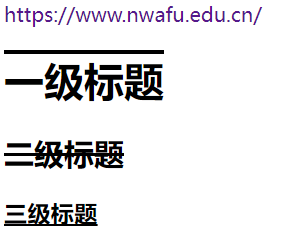
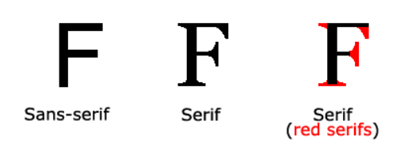

# CSS教程

CSS（Cascading Style Sheets，层叠样式表），是一种用来为结构化文档（如 HTML 文档或 XML 应用）添加样式（字体、间距和颜色等）的计算机语言，CSS文件扩展名为 **`.css`**。

HTML 标签原本被设计为用于定义文档内容，如下实例：

```html
<h1>这是一个标题</h1>
<p>这是一个段落。</p>
```

样式表定义如何显示 HTML 元素，就像 HTML 中的字体标签和颜色属性所起的作用那样。样式通常保存在外部的 .css 文件中。我们只需要编辑一个简单的 CSS 文档就可以改变所有页面的布局和外观。

## CSS语法

CSS 规则由两个主要的部分构成：选择器，以及一条或多条声明：

```css
h1 {color: blue; font-size: 12px};
```

选择器通常是您需要改变样式的 HTML 元素。

每条声明由一个属性和一个值组成。

属性（property）是希望设置的样式属性（style attribute）。每个属性有一个值,属性和值被冒号分开。

## Id和Class

### id选择器

CSS 中 id 选择器以 "#" 来定义。

以下的样式规则应用于元素属性 id="para1"

```css
#para1
{
	text-align:center;
    color:red;
}
```

### class选择器

class 选择器用于描述一组元素的样式，class 选择器有别于id选择器，class可以在多个元素中使用。

class 选择器在 HTML 中以 class 属性表示, 在 CSS 中，类选择器以一个点 `.` 号显示：

```css
.center {text-align:center;}
```

```html
<!DOCTYPE html>
<html>

<head>
    <meta charset="GBK">
    <title>html教程</title>
    <style type="text/css">
        .center {
            text-align: center;
        }
    </style>

<body>
    <h1 class="center">标题居中</h1>
    <p class="center">段落居中。</p>
</body>
</head>

</html>
```

也可指定特定HTML元素使用`class`：

```css
p.class {text-align:center}
```

```html
<!DOCTYPE html>
<html>

<head>
    <meta charset="GBK">
    <title>html教程</title>
    <style type="text/css">
        p.center {
            text-align: center;
        }
    </style>

<body>
    <h1 class="center">标题居中</h1>
    <p class="center">段落居中。</p>
</body>
</head>

</html>
```

## 创建

插入样式表方式：

- 外部样式表
- 内部样式表（全局）
- 内联样式

优先级：内联样式>内部样式>外部样式

## 背景

### 背景颜色

```html
<!DOCTYPE html>
<html>

<head>
    <meta charset="GBK">
    <title>html教程</title>
    <style type="text/css">
        body {
            background-color: #b04cde;
        }
    </style>

<body>
    <p>背景颜色</p>
</body>
</head>

</html>
```

### 背景图片

默认情况下，背景图像进行平铺重复显示，以覆盖整个元素实体：

```html
<!DOCTYPE html>
<html>

<head>
    <meta charset="GBK">
    <title>html教程</title>
    <style type="text/css">
        body {
            background-image: url('https://static.runoob.com/images/mix/paper.gif');
            background-color: #b04cde;
        }
    </style>

<body>
    <p>Hello, World</p>
</body>
</head>

</html>
```

#### 在水平方向平铺

```css
body {
    background-image: url('https://static.runoob.com/images/mix/gradient2.png');
    background-repeat: repeat-x;
}
```

#### 定位与不平铺

```css
body {
    background-image: url('https://static.runoob.com/images/mix/img_tree.png');
    background-repeat: no-repeat;
    background-position: right top;
    margin-right: 200px;
}
```

#### 简写属性

```css
body {
    background: #ffffff url('img_tree.png') no-repeat right top;
}
```

| Property                | 描述                                               |
| :---------------------- | :------------------------------------------------- |
| `background`            | 简写属性，作用是将背景属性设置在一个声明中。       |
| `background-attachment` | 背景图像是否固定或者随着页面的其余部分滚动。       |
| `background-color`      | 设置元素的背景颜色。                               |
| `background-image`      | 把图像设置为背景。                                 |
| `background-position`   | 设置背景图像的起始位置。`left top`、`x% y%`        |
| `background-repeat`     | 设置背景图像是否及如何重复。`repeat-x`、`repeat-y` |

## 文本格式

### 文本颜色

```html
<!DOCTYPE html>
<html>

<head>
    <meta charset="GBK">
    <title>html教程</title>
    <style>
        body {
            color: red
        }

        h1 {
            color: #00ff00;
        }

        p.ex {
            color: rgb(0, 0, 255);
        }
    </style>

<body>
    <h1>这是一个标题</h1>
    <p>这是一个普通段落</p>
    <p class="ex">这是一个类为"ex"的段落</p>
</body>
</head>

</html>
```

### 文本对齐方式

文本可居中或对齐到左或右,两端对齐。

```css
h1 {
    text-align: right;
}

p.date {
    text-align: right;
}

p.main {
    text-align: justify;
}

```

`text-align`设置为`justify`，每一行被展开为宽度相等，左，右外边距对齐。

### 文本修饰

`text-decoration`属性用于设置或山粗文本装饰，从设计角度看，`text-decoration`属性主要用于删除链接的下划线：

```html
<!DOCTYPE html>
<html>

<head>
    <meta charset="GBK">
    <title>html教程</title>
    <style>
        a {
            text-decoration: none;
        }

        h1 {
            text-decoration: overline;
        }

        h2 {
            text-decoration: line-through;
        }

        h3 {
            text-decoration: underline;
        }
    </style>

<body>
    <a href="https://www.nwafu.edu.cn/">https://www.nwafu.edu.cn/</a>
    <h1>一级标题</h1>
    <h2>二级标题</h2>
    <h3>三级标题</h3>
</body>
</head>

</html>
```



### 文本转换

文本转换属性是用来指定在一个文本中的大写和小写字母。

```css
p.uppercase {
    text-transform: uppercase;
}

p.lowercase {
    text-transform: lowercase;
}

p.capitialize {
    text-transform: capitalize;
}
```

### 文本缩进

```css
p {text-indent:50px;}
```

### 字符间的空间

```css
h1 {
    letter-spacing: 2px;
}

h2 {
    letter-spacing: -3px;
}
```

### 行距

```css
p.small {
    line-height: 70%;
}

p.big {
    line-height: 200%;
}
```

### 文本方向

```css
div.exl {
    direction: rtl;
}
```

### 文本阴影

```css
h1 {
    text-shadow: 2px 2px #ff010f;
}
```

| 属性              | 描述                     |
| :---------------- | :----------------------- |
| `color`           | 设置文本颜色             |
| `direction`       | 设置文本方向。           |
| `letter-spacing`  | 设置字符间距             |
| `line-height`     | 设置行高                 |
| `text-align`      | 对齐元素中的文本         |
| `text-decoration` | 向文本添加修饰           |
| `text-indent`     | 缩进元素中文本的首行     |
| `text-shadow`     | 设置文本阴影             |
| `text-transform`  | 控制元素中的字母         |
| `unicode-bidi`    | 设置或返回文本是否被重写 |
| `vertical-align`  | 设置元素的垂直对齐       |
| `white-space`     | 设置元素中空白的处理方式 |
| `word-spacing`    | 设置字间距               |

## 字体

### serif和sans-serif字体之间的区别



在计算机屏幕上，sans-serif字体被认为是比serif字体容易阅读。

### CSS字型

在css中，有两种类型的字体系列名称：

- 通用字体系列 - 拥有相似外观的字体系统组合（如 "Serif" 或 "Monospace"）
- 特定字体系列 - 一个特定的字体系列（如 "Times" 或 "Courier"）

| Generic family | 字体系列                   | 说明                                        |
| :------------- | :------------------------- | :------------------------------------------ |
| Serif          | Times New Roman Georgia    | Serif字体中字符在行的末端拥有额外的装饰     |
| Sans-serif     | Arial Verdana              | "Sans"是指无 - 这些字体在末端没有额外的装饰 |
| Monospace      | Courier New Lucida Console | 所有的等宽字符具有相同的宽度                |

### 字体系列

`font-family`设置文本字体系列。

`font-family`属性应该设置几个字体名称作为一种"后备"机制，如果浏览器不支持第一种字体，他将尝试下一种字体。

```css
p.serif {
    font-family: "Times New Roman", Time serif;
}

p.sansserif {
    font-family: Arial, Helvetica, sans-serif;
}
```

### 字体样式

主要是用于指定斜体文字的字体样式属性。

这个属性有三个值：

- 正常 - 正常显示文本
- 斜体 - 以斜体字显示的文字
- 倾斜的文字 - 文字向一边倾斜

```css
p.normal {
    font-style: normal;
}

p.italic {
    font-style: italic;
}

p.oblique {
    font-style: oblique;
}
```

### 字体大小

`font-size`属性设置文本的大小。

绝对大小：

- 设置一个指定大小的文本
- 不允许用户在所有浏览器中改变文本大小
- 确定了输出的物理尺寸时绝对大小很有用

相对大小：

- 相对于周围的元素来设置大小
- 允许用户在浏览器中改变文字大小

#### 设置字体像素大小

设置文字的大小与像素，让您完全控制文字大小：

```css
h1 {
    font-size: 40px;
}

h2 {
    font-size: 30px;
}

h3 {
    font-size: 14px;
}
```

#### 用`em`设置字体大小

为了避免Internet Explorer 中无法调整文本的问题，许多开发者使用 em 单位代替像素。

em的尺寸单位由W3C建议。

1em和当前字体大小相等。在浏览器中默认的文字大小是16px。

因此，1em的默认大小是16px。可以通过下面这个公式将像素转换为em：px/16=em

```css
h1 {
    font-size: 2.5em;
}

/* 40px/16=2.5em */
h2 {
    font-size: 1.875em;
}

/* 30px/16=1.875em */
p {
    font-size: 0.875em;
}

/* 14px/16=0.875em */
```

### 设置字体粗细

```css
p.normal {
    font-weight: normal;
}

p.light {
    font-weight: lighter;
}

p.thick {
    font-weight: bold;
}

p.ticker {
    font-weight: 900;
}
```

### 设置小型大写字母

```css
p.normal {
    font-variant: normal;
}

p.small {
    font-variant: small-caps;
}
```


## 链接

### 链接样式

这四个链接状态是：

- `a:link` - 正常，未访问过的链接
- `a:visited` - 用户已访问过的链接
- `a:hover` - 当用户鼠标放在链接上时
- `a:active` - 链接被点击的那一刻

```css
a:link {
    color: lightblue;
}

/* 未访问 */
a:visited {
    color: grey;
}

/* 已访问 */
a:hover {
    color: lightsalmon;
}

/* 移动到链接 */
a:active {
    color: aquamarine
}

/* 点击 */
```

### 文本修饰

`text-decoration` 属性主要用于删除链接中的下划线。

```css
a:link {
    text-decoration: none;
}

a:visited {
    text-decoration: none;
}

a:hover {
    text-decoration: underline;
}

a:active {
    text-decoration: underline;
}
```

### 背景颜色

```css
a:link {
    background-color: #B2FF99;
}

a:visited {
    background-color: #FFFF85;
}

a:hover {
    background-color: #FF704D;
}

a:active {
    background-color: #FF704D;
}
```

## 列表

### 不同列表标记项

```html
<!DOCTYPE html>
<html>

<head>
    <meta charset="gbk">
    <title>菜鸟教程(runoob.com)</title>
    <style>
        ul.a {
            list-style-type: circle;
        }

        ul.b {
            list-style-type: square;
        }

        ol.c {
            list-style-type: upper-roman;
        }

        ol.d {
            list-style-type: lower-alpha;
        }
    </style>
</head>

<body>
    <p>无序列表实例:</p>

    <ul class="a">
        <li>Coffee</li>
        <li>Tea</li>
        <li>Coca Cola</li>
    </ul>

    <ul class="b">
        <li>Coffee</li>
        <li>Tea</li>
        <li>Coca Cola</li>
    </ul>

    <p>有序列表实例:</p>

    <ol class="c">
        <li>Coffee</li>
        <li>Tea</li>
        <li>Coca Cola</li>
    </ol>

    <ol class="d">
        <li>Coffee</li>
        <li>Tea</li>
        <li>Coca Cola</li>
    </ol>
</body>

</html>
```

### 作为列表项标记的图像

```css
ul {
    list-style-image: url('./redvelvet.jpg');
}
```

### 简写属性

```css
ul {
    list-style: circle url('./redvelvet.jpg');
}
```

## 表格

### 表格边框

```css
table,
th,
td {
    border: 2px solid black;
}
```

### 边框折叠

为了显示一个表的单个边框，使用 `border-collapse`属性。

```html
<!DOCTYPE html>
<html>

<head>
    <meta charset="gbk">
    <title>My Web(runoob.com)</title>
    <style>
        table {
            border-collapse: collapse;
        }

        table,
        th,
        td {
            border: 1px solid black;
        }
    </style>
</head>

<body>
    <table>
        <tr>
            <th>First name</th>
            <th>Second name</th>
        </tr>
        <tr>
            <td>Peter</td>
            <td>Griffin</td>
        </tr>
        <tr>
            <td>Lois</td>
            <td>Griffin</td>
        </tr>
    </table>
</body>

</html>
```

### 表格宽度

```css
table {
    width: 100%;
}

th {
    height: 50px;
}
```

### 表格文字对齐

`text-align`属性设置水平对齐方式，向左、右或中心：

```css
td {
    text-align: right;
}
```

`vertical-align`属性设置垂直对齐，比如顶部，底部或中间：

```css
td {
	height: 50px;
	vertical-align: bottom;
}
```

### 表格填充

如需控制边框和表格内容之间的间距，应使用td和th元素的填充属性：

```css
td {
	padding: 15px;
}
```

### 表格颜色

```html
<!DOCTYPE html>
<html>

<head>
    <meta charset="gbk">
    <title>Test</title>
    <style>
        table {
            width: 40%;
        }

        table,
        td,
        th {
            border: 1px solid black;
            text-align: center;
            border-collapse: collapse;
        }

        th {
            background-color: green;
            color: white;
            padding: 10px;
        }
    </style>
</head>

<body>
    <table>
        <tr>
            <th>Firstname</th>
            <th>Lastname</th>
            <th>Savings</th>
        </tr>
        <tr>
            <td>Peter</td>
            <td>Griffin</td>
            <td>$100</td>
        </tr>
        <tr>
            <td>Lois</td>
            <td>Griffin</td>
            <td>$150</td>
        </tr>
        <tr>
            <td>Joe</td>
            <td>Swanson</td>
            <td>$300</td>
        </tr>
        <tr>
            <td>Cleveland</td>
            <td>Brown</td>
            <td>$250</td>
        </tr>
    </table>
</body>

</html>
```

## 盒子模型

所有HTML元素可以看作盒子，在CSS中，box model这一术语是用来设计和布局时使用。

CSS盒模型本质上是一个盒子，封装周围的HTML元素，它包括：边距，边框，填充，和实际内容。

盒模型允许我们在其它元素和周围元素边框之间的空间放置元素。

下面的图片说明了盒子模型(Box Model)：


- Margin(外边距) - 清除边框外的区域，外边距是透明的。
- Border(边框) - 围绕在内边距和内容外的边框。
- Padding(内边距) - 清除内容周围的区域，内边距是透明的。
- Content(内容) - 盒子的内容，显示文本和图像。

### 元素高度和宽度

当您指定一个 CSS 元素的宽度和高度属性时，你只是设置内容区域的宽度和高度。

```css
div {
    background-color: lightgrey;
    width: 300px;
    border: 25px solid green;
    padding: 25px;
    margin: 25px;
}
```


## 边框

### 边框属性

CSS边框属性允许你指定一个元素边框的样式和颜色。

### 边框样式

```css
p.none {
    border-style: none;
    /* 无边框 */
}

p.dotted {
    border-style: dotted;
    /* 虚线边框 */
}

p.dash {
    border-style: dashed;
    /* 虚线边框 */
}

p.solid {
    border-style: solid;
    /* 实线边框 */
}

p.double {
    border-style: double;
    /* 双边框 */
}

p.groove {
    border-style: groove;
    /* 凹槽边框 */
}

p.ridge {
    border-style: ridge;
    /* 垄状边框 */
}

p.inset {
    border-style: inset;
    /* 嵌入边框 */
}

p.outset {
    border-style: outset;
    /* 外凸边框 */
}

p.hidden {
    border-style: hidden;
    /* 隐藏边框 */
}

p.mix {
    border-style: dotted dashed solid double;
    /* 混合边框 */
}
```

###   边框宽度

```
p.one {
    border-style: solid;
    border-width: 5px;
}

p.two {
    border-style: solid;
    border-width: medium;
}
```

### 边框颜色

```css
p.one {
    border-style: solid;
    border-color: red;
}

p.two {
    border-style: solid;
    border-color: #98bf21;
}
```

### 单独设置各边

```css
p {
    border-top-style: dotted;
    border-right-style: solid;
    border-bottom-style: dotted;
    border-left-style: solid;
}
```

### 简写属性

```css
p {
    border:5px solid red;
}
```

## 轮廓

与边框基本一致。

```
p {
    border: dotted thick;
    outline: dotted thick;
}
```

## 外边框

### 单边外边距属性

```css
p {
    background-color: yellow;
}

p.margin {
    margin-top: 100px;
    margin-bottom: 100px;
    margin-right: 50px;
    margin-left: 50px;
}
```


### 简写属性

`margin`属性可以有一到四个值。

- `margin:25px 50px 75px 100px;` 上右下左
- `margin:25px 50px 75px;` 上（左右）下
- `margin:25px 50px;`（上下）（左右）
- `margin:25px;`（上下左右）

## 填充


### 单边内边距属性

```css
p {
    background-color: yellow;
}

p.padding {
    padding-top: 25px;
    padding-bottom: 25px;
    padding-right: 50px;
    padding-left: 50px;
}
```

### 简写属性

```css
p {
    background-color: yellow;
}

p.padding {
    padding: 25px 50px;
}
```

## 分组和嵌套选择器

### 分组选择器

```css
h1, h2, p {
    color:green;
}
```

### 嵌套选择器

- `p{ }`: 为所有 `p` 元素指定一个样式。
- `.marked{ }`: 为所有 `class="marked"` 的元素指定一个样式。
- `.marked p{ }`: 为所有 `class="marked"` 元素内的 `p` 元素指定一个样式。
- `p.marked{ }`: 为所有 `class="marked"` 的 `p` 元素指定一个样式。

```css
p {
    color: blue;
    text-align: center;
    font-family: 'Courier New', Courier, monospace;
    font-size: large;
}

.marked {
    background-color: red;
    font-family: 'Franklin Gothic Medium', 'Arial Narrow', Arial, sans-serif;
    font-size: medium;
}
/* 所有class="marked"元素内的p元素 */
.marked p {
    color: white;
    font-family: 'Segoe UI', Tahoma, Geneva, Verdana, sans-serif;
    font-size: small;
}

/* 所有class="marked"元素内的p元素指定一个样式 */
p.marked {
    text-decoration: underline;
    font-family: 'Franklin Gothic Medium', 'Arial Narrow', Arial, sans-serif;
    font-size: smaller;
}
```

## 尺寸

| 属性          | 描述                 |
| :------------ | :------------------- |
| `height`      | 设置元素的高度。     |
| `line-height` | 设置行高。           |
| `max-height`  | 设置元素的最大高度。 |
| `max-width`   | 设置元素的最大宽度。 |
| `min-height`  | 设置元素的最小高度。 |
| `min-width`   | 设置元素的最小宽度。 |
| `width`       | 设置元素的宽度。     |

```css
p.min {
    min-height: 100px;
    background-color: yellow;
}

p.max {
    max-height: 10px;
    background-color: yellow;
}
```


## 显示与可见性

`display`属性设置一个元素应如何显示，`visibility`属性指定一个元素应可见还是隐藏。

### 隐藏元素

隐藏一个元素可以通过把`display`属性设置为`none`，或把`visibility`属性设置为`hidden`。但是请注意，`hidden`可以隐藏某个元素，仍然会影响布局。

### 块和内联元素

块元素是一个元素，占用了全部宽度，在前后都是换行符。

内联元素只需要必要的宽度，不强制换行。

下面的示例把列表项显示为内联元素，将`span`显示为块元素：

```css
li {
	display: inline;
}
span {
	display: block;
}
```

## 定位

position 属性指定了元素的定位类型。

position 属性的五个值：

- `static`
- `relative`
- `fixed`
- `absolute`
- `sticky`

### `static`定位

HTML 元素的默认值，即没有定位，遵循正常的文档流对象。

静态定位的元素不会受到 `top`, `bottom`, `left`, `right`影响。

```css
div.static {
    position: static;
    border: 3px solid #73ad21;
}
```

### `fixed`定位

元素的位置相对于浏览器窗口是固定位置，即使窗口是滚动的它也不会移动：

```css
p.pos_fixed {
    position: fixed;
    top: 30px;  /* 固定位置 */
    right: 50px;
}
```

### `relative`定位

```css
h2.pos_left {
    position: relative;
    left: -20px;  /* 相对正常元素的位置 */
}

h2.pos_right {
    position: relative;
    left: 20px;
}
```

相对定位元素经常被用来作为绝对定位元素的容器块。

### `absolute` 定位

绝对定位的元素的位置相对于最近的已定位父元素，如果元素没有已定位的父元素，那么它的位置相对于`<html>`：

```css
h2 {
    position: absolute;
    left: 100px;
    top: 150px;
    /* 使用绝对定位，一个元素可放在页面的任何位置 */
}
```

### sticky 定位

sticky 英文字面意思是粘，粘贴，所以可以把它称之为粘性定位。

`position: sticky;` 基于用户的滚动位置来定位。

粘性定位的元素是依赖于用户的滚动，在 **position:relative** 与 **position:fixed** 定位之间切换。

它的行为就像 `position:relative;` 而当页面滚动超出目标区域时，它的表现就像 `position:fixed;`，它会固定在目标位置。

元素定位表现为在跨越特定阈值前为相对定位，之后为固定定位。

```css
div.sticky {
    position: sticky;
    top: 0;
    padding: 5px;
    background-color: #cae8ca;
    border: 2px solid #4caf50;
}
```

### 重叠元素

```css
img {
    position: absolute;
    left: 0px;
    top: 0px;
    z-index: -1;
}
```


## 溢出

CSS `overflow` 属性用于控制内容溢出元素框时显示的方式。

`overflow`属性有以下值：

| 值        | 描述                                                     |
| :-------- | :------------------------------------------------------- |
| `visible` | 默认值。内容不会被修剪，会呈现在元素框之外。             |
| `hidden`  | 内容会被修剪，并且其余内容是不可见的。                   |
| `scroll`  | 内容会被修剪，但是浏览器会显示滚动条以便查看其余的内容。 |
| `auto`    | 如果内容被修剪，则浏览器会显示滚动条以便查看其余的内容。 |
| `inherit` | 规定应该从父元素继承 overflow 属性的值。                 |

### `visible`

默认情况下，`overflow` 的值为 `visible`， 内容溢出元素框：

```css
div {
    background-color: #eee;
    width: 200px;
    height: 50px;
    border: 1px dotted black;
    overflow: visible;
}
```


### `hidden`


### `auto`


### `scroll`


## 浮动

浮动使元素向左或向右移动，其周围的元素也会重新排列，往往是用于图像。

```css
.thumbnail {
    float: left;
    /* 向左浮动 */
    width: 50px;
    height: 50px;
    margin: 5px;
}
```


### 清除浮动

| 属性    | 描述                               | 值                             | CSS  |
| :------ | :--------------------------------- | :----------------------------- | :--- |
| `clear` | 指定不允许元素周围有浮动元素。     | `left right both none inherit` | 1    |
| `float` | 指定一个盒子（元素）是否可以浮动。 | `left right none inherit`      | 1    |

## 对齐

### 居中对齐

#### 元素

要水平居中对齐一个元素(如 <div>), 可以使用 `margin: auto;`

#### 文本

如果仅仅是为了文本在元素内居中对齐，可以使用 `text-align: center;`

#### 图片

要让图片居中对齐, 可以使用 `margin: auto;` 并将它放到块元素中。

### 左右对齐

#### 定位方式

```css
.right {
    position: absolute;
    right: 0px;
    width: 300px;
    border: 3px solid #73AD21;
    padding: 10px;
}
```

#### 浮动方式

```css
.right {
    float: right;
    width: 300px;
    border: 3px solid #73AD21;
    padding: 10px;
}
```

若子元素高度大于父元素，可在父元素上添加 `overflow: auto;` 来解决子元素溢出的问题。如果子元素的高度大于父元素，且子元素设置了浮动，那么子元素将溢出，这时候你可以使用 "`clearfix`(清除浮动)" 来解决该问题。

### 垂直居中

#### `padding`方式

```css
.center {
    padding: 70px 0;
    border: 3px solid green;
}
```

如果要水平和垂直都居中，可以使用`padding`和`text-align: center`：

```css
.center {
	padding: 70px 0;
	border: 3px solid green;
	text-align: center;
}
```

### `line-height`方式

```css
.center {
    line-height: 200px;
    height: 200px;
    border: 3px solid green;
    text-align: center;
}

```

