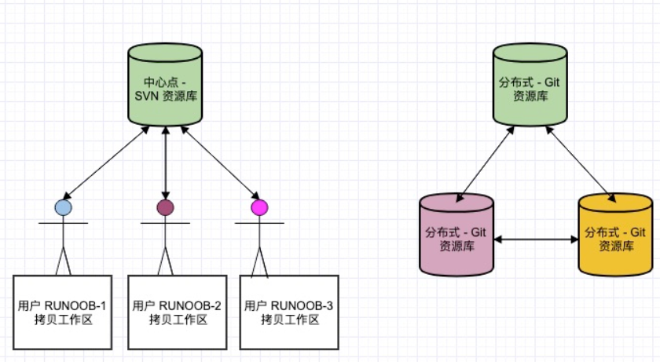
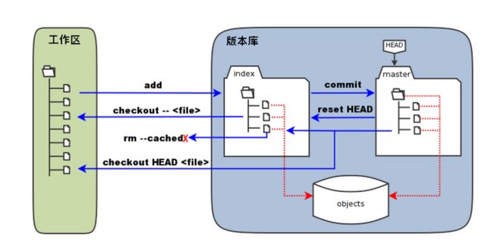
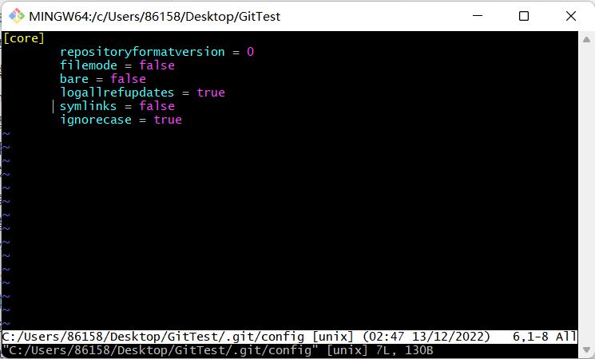
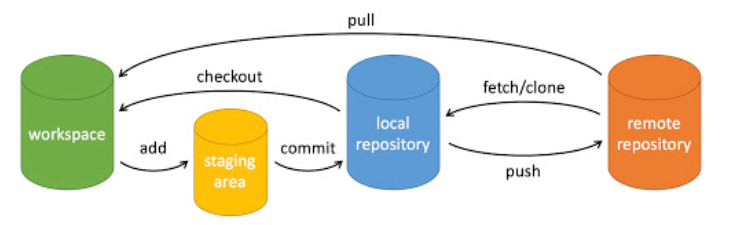
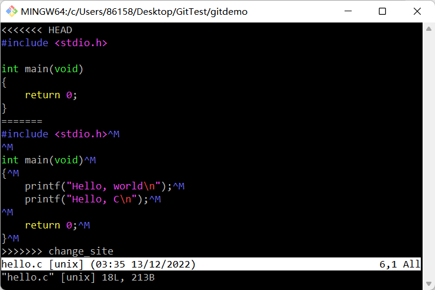
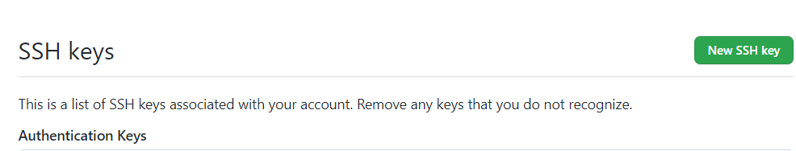
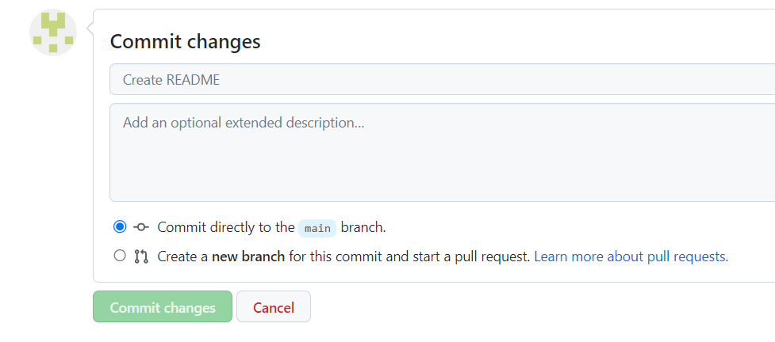

# Git教程

## Git教程

Git 是一个开源的分布式版本控制系统，用于敏捷高效地处理任何或小或大的项目。

Git 是 Linus Torvalds 为了帮助管理 Linux 内核开发而开发的一个开放源码的版本控制软件。

Git 与常用的版本控制工具 CVS, Subversion 等不同，它采用了分布式版本库的方式，不必服务器端软件支持。

### Git与SVN区别

Git 不仅仅是个版本控制系统，它也是个内容管理系统(CMS)，工作管理系统等。

- Git 是分布式：这是 Git 和其它非分布式的版本控制系统，例如 SVN，CVS 等，最核心的区别。

- Git 把内容按元数据方式存储，而 SVN 是按文件：所有的资源控制系统都是把文件的元信息隐藏在一个类似 .svn、.cvs 等的文件夹里。

- Git 分支和 SVN 的分支不同：分支在 SVN 中一点都不特别，其实它就是版本库中的另外一个目录。
- Git 没有一个全局的版本号，而 SVN 有：目前为止这是跟 SVN 相比 Git 缺少的最大的一个特征。
- Git 的内容完整性要优于 SVN：Git 的内容存储使用的是 SHA-1 哈希算法。这能确保代码内容的完整性，确保在遇到磁盘故障和网络问题时降低对版本库的破坏。



## Git安装教程

Git 各平台安装包下载地址为：http://git-scm.com/downloads

### Windows 平台上安装

安装包下载地址：https://gitforwindows.org/

官网慢，可以用国内的镜像：https://npm.taobao.org/mirrors/git-for-windows/。

完成安装之后，就可以使用命令行的 git 工具（已经自带了 ssh 客户端）了，另外还有一个图形界面的 Git 项目管理工具。

在开始菜单里找到"Git"->"Git Bash"，会弹出 Git 命令窗口，你可以在该窗口进行 Git 操作。

### Git配置

Git 提供了一个叫做 git config 的工具，专门用来配置或读取相应的工作环境变量。

- `/etc/gitconfig` 文件：系统中对所有用户都普遍适用的配置。若使用 `git config` 时用 `--system` 选项，读写的就是这个文件。
- `~/.gitconfig` 文件：用户目录下的配置文件只适用于该用户。若使用 `git config` 时用 `--global` 选项，读写的就是这个文件。
- 当前项目的 Git 目录中的配置文件（也就是工作目录中的 `.git/config` 文件）：这里的配置仅仅针对当前项目有效。每一个级别的配置都会覆盖上层的相同配置，所以 `.git/config` 里的配置会覆盖 `/etc/gitconfig` 中的同名变量。

#### 用户信息

配置个人的用户名称和电子邮件地址：

```shell
$ git config --global user.name=huangzy1218
$ git config --global email=2691386627@qq.com
```

#### 文本编辑器

设置Git默认使用的文本编辑器, 一般可能会是 Vi 或者 Vim。如果你有其他偏好，比如 Emacs 的话，可以重新设置：

```shell
$ git config --global core.editor emacs
```

#### 差异分析工具

还有一个比较常用的是，在解决合并冲突时使用哪种差异分析工具。

```shell
$ git config --global merge.tool vimdiff
```

Git 可以理解 kdiff3，tkdiff，meld，xxdiff，emerge，vimdiff，gvimdiff，ecmerge和 opendiff 等合并工具的输出信息。

#### 查看配置信息

要检查已有的配置信息，可以使用 `git config --list` 命令：

```shell
$ git config --list
credential.https://dev.azure.com.usehttppath=true
init.defaultbranch=master
user.name=huangzy1218
user.email=2691386627@qq.com
use.email=2691386627@qq.com
```

## Git工作流程

一般工作流程如下：

- 克隆 Git 资源作为工作目录
- 在克隆的资源上添加或修改文件
- 如果其他人修改了，你可以更新资源
- 在提交前查看修改
- 提交修改
- 在修改完成后，如果发现错误，可以撤回提交并再次修改并提交

## Git 工作区、暂存区和版本库

### 基本概念

我们先来理解下 Git 工作区、暂存区和版本库概念：

- 工作区：就是你在电脑里能看到的目录。
- 暂存区：英文叫 stage 或 index。一般存放在 `.git `目录下的 `index` 文件（`.git/index`）中，所以我们把暂存区有时也叫作索引（index）。
- 版本库：工作区有一个隐藏目录`.git`，这个不算工作区，而是 Git 的版本库。



- 图中左侧为工作区，右侧为版本库。在版本库中标记为 "index" 的区域是暂存区（stage/index），标记为 "master" 的是 master 分支所代表的目录树。
- 图中我们可以看出此时 "HEAD" 实际是指向 master 分支的一个游标。所以图示的命令中出现 HEAD 的地方可以用 master 来替换。
- 图中的 objects 标识的区域为 Git 的对象库，实际位于 ".git/objects" 目录下，里面包含了创建的各种对象及内容。
- 当对工作区修改（或新增）的文件执行 `git add` 命令时，暂存区的目录树被更新，同时工作区修改（或新增）的文件内容被写入到对象库中的一个新的对象中，而该对象的ID被记录在暂存区的文件索引中。
- 当执行提交操作（`git commit`）时，暂存区的目录树写到版本库（对象库）中，master 分支会做相应的更新。即 master 指向的目录树就是提交时暂存区的目录树。
- 当执行 `git reset HEAD` 命令时，暂存区的目录树会被重写，被 master 分支指向的目录树所替换，但是工作区不受影响。
- 当执行 `git rm --cached <file>` 命令时，会直接从暂存区删除文件，工作区则不做出改变。
- 当执行 `git checkout .` 或者 `git checkout -- <file>` 命令时，会用**暂存区**全部或指定的文件替换**工作区**的文件。这个操作很危险，会清除工作区中未添加到暂存区中的改动。
- 当执行 `git checkout HEAD .` 或者 `git checkout HEAD <file>` 命令时，会用 HEAD 指向的 master **分支**中的全部或者部分文件替换**暂存区**和**工作区**中的文件。这个命令也是极具危险性的，因为不但会清除工作区中未提交的改动，也会清除暂存区中未提交的改动。

## Git创建仓库

### `git init`

Git 使用 `git init` 命令来初始化一个 Git 仓库。在执行完成 `git init` 命令后，Git 仓库会生成一个 .git 目录，该目录包含了资源的所有元数据，其他的项目目录保持不变。

```shell
$ git init
Initialized empty Git repository in C:/Users/86158/Desktop/GitTest/.git/
```

该命令执行完后会在当前目录生成一个 .git 目录，所有 Git 需要的数据和资源都存放在这个目录中。

如果当前目录下有几个文件想要纳入版本控制，需要先用 `git add` 命令告诉 Git 开始对这些文件进行跟踪，然后提交：

```shell
$ git add *.c
$ git add READMEA.txt
$ git commit -m '初始化版本项目'
[master (root-commit) 3ce8ce0] 初始化版本项目
 2 files changed, 9 insertions(+)
 create mode 100644 READMEA.txt
 create mode 100644 hello.c
```

### `git clone`

克隆仓库的命令格式为：

```shell
git clone <repo>
```

如果我们需要克隆到指定的目录，可以使用以下命令格式：

```shell
git clone <repo> <directory>
```

```shell
$ git clone https://github.com/JERRY-Z-J-R/I-love-you-3-thousand.git
Cloning into 'I-love-you-3-thousand'...
remote: Enumerating objects: 96778, done.
remote: Counting objects: 100% (370/370), done.
remote: Compressing objects: 100% (239/239), done.
remote: Total 96778 (delta 145), reused 328 (delta 125), pack-reused 96408
Receiving objects: 100% (96778/96778), 804.71 MiB | 13.07 MiB/s, done.
Resolving deltas: 100% (37178/37178), done.
Updating files: 100% (9789/9789), done.
```

执行该命令后，会在当前目录下创建一个名为的目录，其中包含一个`I-love-you-3-thousand.git `的目录，用于保存下载下来的所有版本记录。

如果要自己定义要新建的项目目录名称，可以在上面的命令末尾指定新的名字：

```shell
$ git clone git://github.com/schacon/grit.git mygrit
```

### `git config`

编辑 git 配置文件:

```shell
$ git config -e    # 针对当前仓库 
```

或者：

```shell
$ git config -e --global   # 针对系统上所有仓库
```



## Git基本操作

Git 的工作就是创建和保存你项目的快照及与之后的快照进行对比。



- `git init` - 初始化仓库。
- `git add`. - 添加文件到暂存区。
- `git commit` - 将暂存区内容添加到仓库中。

### 创建仓库

| 命令        | 说明                                   |
| :---------- | :------------------------------------- |
| `git init`  | 初始化仓库                             |
| `git clone` | 拷贝一份远程仓库，也就是下载一个项目。 |

### 提交与修改

#### 基本提交

| 命令         | 说明                                     |
| :----------- | :--------------------------------------- |
| `git add`    | 添加文件到暂存区                         |
| `git status` | 查看仓库当前的状态，显示有变更的文件。   |
| `git diff`   | 比较文件的不同，即暂存区和工作区的差异。 |
| `git commit` | 提交暂存区到本地仓库。                   |
| `git reset`  | 回退版本。                               |
| `git rm`     | 将文件从暂存区和工作区中删除。           |
| `git mv`     | 移动或重命名工作区文件。                 |

#### 提交日志

| 命令               | 说明                                 |
| :----------------- | :----------------------------------- |
| `git log`          | 查看历史提交记录                     |
| `git blame <file>` | 以列表形式查看指定文件的历史修改记录 |

#### 远程操作

| 命令         | 说明               |
| :----------- | :----------------- |
| `git remote` | 远程仓库操作       |
| `git fetch`  | 从远程获取代码库   |
| `git pull`   | 下载远程代码并合并 |
| `git push`   | 上传远程代码并合并 |

## Git分支管理

几乎每一种版本控制系统都以某种形式支持分支，一个分支代表一条独立的开发线。

使用分支意味着你可以从开发主线上分离开来，然后在不影响主线的同时继续工作。


Git 分支实际上是指向更改快照的指针。

开始前先创建测试目录：

```shell
$ mkdir gitdemo
$ cd gitdemo/
$ git init
Initialized empty Git repository in 
$ touch README # 创建README文件
$ git add README
$ git commit -m "第一次版本提交"
[master (root-commit) 0f6636d] 第一次版本提交
 1 file changed, 0 insertions(+), 0 deletions(-)
 create mode 100644 README
```

### 列出分支

```shell
$ git branch
* master
```

此例的意思就是，我们有一个叫做`master`的分支，并且该分支是当前分支。

当你执行`git init`的时候，默认情况下 Git 就会为你创建`master` 分支。

如果我们要手动创建一个分支。执行`git branch (branchname) `即可。

```shell
$ git branch dev
$ git branch
  dev
* master
```

使用`git checkout(branch)`切换到指定分支。

```shell
$ echo "Hello, Git" > text.txt
$ ls
README  text.txt
$ git add .
$ git commit -m "add test.txt"
[master 7d36841] add test.txt
 1 file changed, 1 insertion(+)
 create mode 100644 text.txt
86158@DESKTOP-LNI7PS9 MINGW64 ~/Desktop/GitTest/gitdemo (master)
$ git checkout dev
Switched to branch 'dev'
86158@DESKTOP-LNI7PS9 MINGW64 ~/Desktop/GitTest/gitdemo (dev)
$ ls
README
86158@DESKTOP-LNI7PS9 MINGW64 ~/Desktop/GitTest/gitdemo (dev)
$ git checkout master
Switched to branch 'master'
86158@DESKTOP-LNI7PS9 MINGW64 ~/Desktop/GitTest/gitdemo (master)
$ ls
README  text.txt
```

我们也可以使用`git checkout -b (branchname) `命令来创建新分支并立即切换到该分支下，从而在该分支中操作。

```shell
$ git checkout -b newdev
Switched to a new branch 'newdev'
$ ls
README  text.txt
$ git rm text.txt
rm 'text.txt'
$ ls
README
$ touch hello.c
$ git add .
$ git commit -am "remove test.txt, add hello.c"
[newdev db48d65] remove test.txt, add hello.c
 2 files changed, 1 deletion(-)
 create mode 100644 hello.c
 delete mode 100644 text.txt
$ ls
README  hello.c
$ git checkout master
Switched to branch 'master'
$ ls
README  text.txt
```

使用分支将工作切分开来，从而让我们能够在不同开发环境中做事，并来回切换。

### 删除分支

```shell
git branch -d (branch name)
```

```shell
$ git branch
  dev
* master
  newdev
$ git branch -d dev
Deleted branch dev (was 0f6636d).
$ git branch
* master
  newdev
```

### 合并分支

一旦某分支有了独立内容，你终究会希望将它合并回到你的主分支。 你可以使用以下命令将任何分支合并到当前分支中去：

```shell
git merge
```

```shell
$ git merge newDev
Updating 7d36841..db48d65
Fast-forward
 hello.c  | 0
 text.txt | 1 -
 2 files changed, 1 deletion(-)
 create mode 100644 hello.c
 delete mode 100644 text.txt
$ ls
README  hello.c
```

合并完后就可以删除分支：

```shell
$ git branch -d newDev
Deleted branch newDev (was db48d65).
```

### 合并冲突

合并并不仅仅是简单的文件添加、移除的操作，Git 也会合并修改。

```shell
$ git checkout -b change_site
Switched to a new branch 'change_site'
$ vim hello.c
$ head -10 hello.c
#include <stdio.h>

int main(void)
{
    printf("Hello, world\n");
    printf("Hello, C\n");

    return 0;
}
$ git commit -am "change the hello.c"
[change_site b0e9de9] change the hello.c
 1 file changed, 9 insertions(+)
$ git checkout master # 切换到master
Switched to branch 'master'
$ cat hello.c # 内容恢复到修改前的空文件
$ vim hello.c
$ cat hello.c
#include <stdio.h>

int main(void)
{
    return 0;
}
$ git diff
diff --git a/hello.c b/hello.c
index e69de29..1e562d6 100644
--- a/hello.c
+++ b/hello.c
@@ -0,0 +1,6 @@
+#include <stdio.h>
+
+int main(void)
+{
+    return 0;
+}
$ git commit -am "修改代码"
[master be5baae] 修改代码
 1 file changed, 6 insertions(+)
$ git merge change_site
Auto-merging hello.c # 自动合并代码
CONFLICT (content): Merge conflict in hello.c
Automatic merge failed; fix conflicts and then commit the result.
$ cat hello.c
<<<<<<< HEAD
#include <stdio.h>

int main(void)
{
    return 0;
}
=======
#include <stdio.h>

int main(void)
{
    printf("Hello, world\n");
    printf("Hello, C\n");

    return 0;
}
>>>>>>> change_site
$ vim hello.c
$ git diff
diff --cc hello.c
index 1e562d6,145f3aa..0000000
--- a/hello.c
+++ b/hello.c
@@@ -1,6 -1,9 +1,9 @@@
 -#include <stdio.h>
 -
 -int main(void)
 -{
 -    printf("Hello, world\n");
 -    printf("Hello, C\n");
 -
 -    return 0;
 -}
 +#include <stdio.h>
 +
 +int main(void)
 +{
++    printf("Hello, world\n");
[master 2e3f895] Merge branch 'change_site'
```



### 查看状态

如果在 `git status` 命令后面加上 `--ignored`选项，还会列出被忽略的文件。

还有一种简洁的输出格式，即添加 `--short` 选项，例如

```shell
$ git status -s
A  banana.txt
?? peach.txt
```

- `’ ’ = unmodified`
- `M = modified`
- `A = added`
- `D = deleted`
- `R = renamed`
- `C = copied`
- `U = updated but unmerged`

## Git 查看提交历史

### `git log`

使用 `git log` 命令列出历史提交记录如下：

```shell
$ git log
commit 2d9bab1dcfb94e3262a4666e36e1045a504e3a8b (HEAD -> master)
Author: huangzy1218 <2691386627@qq.com>
Date:   Tue Dec 13 03:57:06 2022 +0800

    commit apple

commit 2e3f895e308dcf04bdd690ae35e9e8bd7192ca30
Merge: be5baae b0e9de9
Author: huangzy1218 <2691386627@qq.com>
Date:   Tue Dec 13 03:38:40 2022 +0800

    Merge branch 'change_site'
```

使用`--oneline`用选项来查看历史记录的简洁的版本。

```shell
$ git log --oneline
2d9bab1 (HEAD -> master) commit apple
2e3f895 Merge branch 'change_site'
be5baae 修改代码
b0e9de9 (change_site) change the hello.c
db48d65 remove test.txt, add hello.c
7d36841 add test.txt
0f6636d 第一次版本提交
```

使用 `--graph` 选项，查看历史中什么时候出现了分支、合并。以下为相同的命令，开启了拓扑图选项：

```shell
$ git log --graph
* commit 2d9bab1dcfb94e3262a4666e36e1045a504e3a8b (HEAD -> master)
| Author: huangzy1218 <2691386627@qq.com>
| Date:   Tue Dec 13 03:57:06 2022 +0800
|
|     commit apple
|
*   commit 2e3f895e308dcf04bdd690ae35e9e8bd7192ca30
|\  Merge: be5baae b0e9de9
| | Author: huangzy1218 <2691386627@qq.com>
| | Date:   Tue Dec 13 03:38:40 2022 +0800
| |
| |     Merge branch 'change_site'
| |
| * commit b0e9de97f758b0eb56db2817b1ebc9bed8cff72c (change_site)
| | Author: huangzy1218 <2691386627@qq.com>
| | Date:   Tue Dec 13 03:32:08 2022 +0800
| |
| |     change the hello.c
| |

```

使用`--reverse`参数来逆向显示所有日志。

```shell
$ git log --reverse --oneline
0f6636d 第一次版本提交
7d36841 add test.txt
db48d65 remove test.txt, add hello.c
b0e9de9 (change_site) change the hello.c
be5baae 修改代码
2e3f895 Merge branch 'change_site'
2d9bab1 (HEAD -> master) commit apple
```

查找指定用户的提交日志可以使用命令：`git log --author `

```shell
$ git log --author=huangzy1218 --oneline -5
2d9bab1 (HEAD -> master) commit apple
2e3f895 Merge branch 'change_site'
be5baae 修改代码
b0e9de9 (change_site) change the hello.c
db48d65 remove test.txt, add hello.c
```

若要指定日期，可以执行几个选项：`--since` 和 `--before`或`--until`和 `--after`。

### `git blame`

如果要查看指定文件的修改记录可以使用 `git blame `命令，格式如下：

```shell
git blame <filename>
```

```shell
$ git blame hello.c
be5baaeb (huangzy1218 2022-12-13 03:35:08 +0800 1) #include <stdio.h>
be5baaeb (huangzy1218 2022-12-13 03:35:08 +0800 2)
be5baaeb (huangzy1218 2022-12-13 03:35:08 +0800 3) int main(void)
be5baaeb (huangzy1218 2022-12-13 03:35:08 +0800 4) {
2e3f895e (huangzy1218 2022-12-13 03:38:40 +0800 5)     printf("Hello, world\n");
2e3f895e (huangzy1218 2022-12-13 03:38:40 +0800 6)     printf("Hello, C\n");
2e3f895e (huangzy1218 2022-12-13 03:38:40 +0800 7)
be5baaeb (huangzy1218 2022-12-13 03:35:08 +0800 8)     return 0;
be5baaeb (huangzy1218 2022-12-13 03:35:08 +0800 9) }
```

## Git标签

如果你达到一个重要的阶段，并希望永远记住那个特别的提交快照，你可以使用`git tag`给它打上标签。

```shell
$ git tag -a v1.0 # 为最新一次提交打上（HEAD）"v1.0"的标签
```

注意：当我们执行`git log --decorate`时，即可看见所打标签。

```shell
$ git log --decorate --oneline
4f88ff4 (HEAD -> master, tag: v1.0) comit all
2d9bab1 commit apple
2e3f895 Merge branch 'change_site'
be5baae 修改代码
b0e9de9 (change_site) change the hello.c
db48d65 remove test.txt, add hello.c
7d36841 add test.txt
0f6636d 第一次版本提交
```

同时Git支持追加标签：

```shell
$ git tag -a v2.0 2d9bab1 -m "2nd tag"
$ git log --decorate --oneline
4f88ff4 (HEAD -> master, tag: v1.0) comit all
2d9bab1 (tag: v2.0) commit apple
2e3f895 Merge branch 'change_site'
be5baae 修改代码
b0e9de9 (change_site) change the hello.c
db48d65 remove test.txt, add hello.c
7d36841 add test.txt
0f6636d 第一次版本提交
```

查看所有标签可以使用以下命令：

```shell
$ git tag
v1.0
v2.0
```

## Git远程仓库

Git 并不像 SVN 那样有个中心服务器。

目前我们使用到的 Git 命令都是在本地执行，如果你想通过 Git 分享你的代码或者与其他开发人员合作。 你就需要将数据放到一台其他开发人员能够连接的服务器上。

github是一个基于`git`的代码托管平台，付费用户可以建私人仓库，我们一般的免费用户只能使用公共仓库，也就是代码要公开。

### 添加远程库

要添加一个新的远程仓库，可以指定一个简单的名字，以便将来引用，命令格式如下：

```shell
git remote add [shortname] [url]
```

由于你的本地 Git 仓库和 GitHub 仓库之间的传输是通过SSH加密的，所以我们需要配置验证信息：

使用以下命令生成 SSH Key：

```shell
$ ssh-keygen -t rsa -C "youremail@example.com"
```

成功的话会在 `~/` 下生成 `.ssh` 文件夹，进去，打开 `id_rsa.pub`，复制里面的 `key`。

```shell
$ ssh-keygen -t rsa -C "2691386627@qq.com"
Generating public/private rsa key pair.
Enter file in which to save the key (/c/Users/86158/.ssh/id_rsa):
/c/Users/86158/.ssh/id_rsa already exists.
Overwrite (y/n)? y
Enter passphrase (empty for no passphrase):
Enter same passphrase again:
Your identification has been saved in /c/Users/86158/.ssh/id_rsa
Your public key has been saved in /c/Users/86158/.ssh/id_rsa.pub
The key fingerprint is:
SHA256:oT31M595fYN8O9VTWHflXZ3jTR0y2nS0VPOoFNIss7g 2691386627@qq.com
The key's randomart image is:
+---[RSA 3072]----+
|          .o.+.*@|
|          o.*.==&|
|        ...=..o=O|
|       o.o.o ...o|
|      . S.  =   o|
|        E.  .+.++|
|             o+o*|
|              .o+|
|               ..|
+----[SHA256]-----+
```



为了验证是否成功，输入以下命令：

```shell
$ ssh -T git@github.com
Hi huangzy1218! You've successfully authenticated, but GitHub does not provide shell access.
```

### 查看当前远程仓库

要查看当前配置有哪些远程仓库，可以用命令：`git remote`

```sh
$ git remote
origin
$ git remote -v
origin  git@github.com:huangzy1218/Algorithm.git (fetch)
origin  git@github.com:huangzy1218/Algorithm.git (push)
```

### 提取远程仓库

Git 有两个命令用来提取远程仓库的更新。

1. 从远程仓库下载新分支与数据：

   ```shell
   git fetch
   ```

   该命令执行完后需要执行`git merge` 远程分支到你所在的分支。

2. 从远端仓库提取数据并尝试合并到当前分支：

   ```shell
   git merge
   ```

该命令就是在执行 `git fetch` 之后紧接着执行 `git merge` 远程分支到你所在的任意分支。

在Github在线修改：



在本地更新修改：

```shell
$ git fetch origin
remote: Enumerating objects: 5, done.
remote: Counting objects: 100% (5/5), done.
remote: Compressing objects: 100% (2/2), done.
remote: Total 3 (delta 0), reused 0 (delta 0), pack-reused 0
Unpacking objects: 100% (3/3), 707 bytes | 141.00 KiB/s, done.
From github.com:huangzy1218/Algorithm
   33bfed1..d9bf70b  main       -> origin/main
```

`33bfed1..d9bf70b  main       -> origin/main`表明`main`分支已被更新。

我们可以使用以下命令将更新同步到本地：

```shell
$ git merge origin/main
Updating 33bfed1..d9bf70b
Fast-forward
 README | 1 +
 1 file changed, 1 insertion(+)
```

查看README文件内容：

```shell
$ cat README
README
Hello, world
修改
```

### 推送到远程仓库

推送新分支与数据到某个远程仓库：

```shell
$ git push origin main
Enumerating objects: 4, done.
Counting objects: 100% (4/4), done.
Delta compression using up to 8 threads
Compressing objects: 100% (2/2), done.
Writing objects: 100% (3/3), 354 bytes | 354.00 KiB/s, done.
Total 3 (delta 0), reused 0 (delta 0), pack-reused 0
To github.com:huangzy1218/Algorithm.git
   d9bf70b..cb2597e  main -> main
```

### 删除远程仓库

```shell
$ git remote -v
origin  git@github.com:huangzy1218/Algorithm.git (fetch)
origin  git@github.com:huangzy1218/Algorithm.git (push)
$ git remote add origin2  git@github.com:huangzy1218/Algorithm.git
$ git remote -v
origin  git@github.com:huangzy1218/Algorithm.git (fetch)
origin  git@github.com:huangzy1218/Algorithm.git (push)
origin2 git@github.com:huangzy1218/Algorithm.git (fetch)
origin2 git@github.com:huangzy1218/Algorithm.git (push)
$ git remote rm origin2
```

默认的`clone`后出现的`origin` 代表的是远程仓库 , origin是远程仓库在本地的别名。