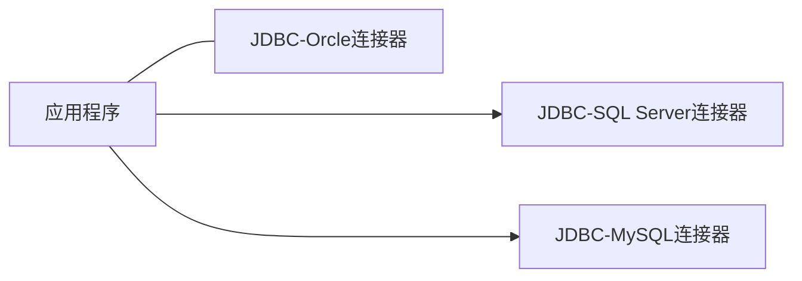
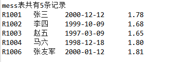

# JDBC与MySQL数据库

## JDBC概述

JDBC（Java DataBase Connection）是Java操作数据库的应用程序接口，不依赖具体数据库。相关类和接口在`java.sql.*`和`javax.sql.*`包中。

JDBC 驱动程序使用 Java 编写，它调用数据库厂商提供的本地 API。在这种方式下需要在客户的机器上加载本地 JDBC 驱动程序和安装特定数据库厂商的本地 API。

JDBC是一系列的接口，它使得应用程序能够进行数据库联接，执行SQL语句，并且得到返回结果。在java.sql包中提供所有JDBC开发类的支持。

- `java.sql.DriverManager`类用来装载驱动程序，获取数据库连接；

- `java.sql.Connection`接口完成对某一指定数据库的连接；

- `java.sql.Statement`接口在一个给定的连接中作为SQL执行声明的容器；


为是Java编写不依赖于具体的数据库，Java提供专门用于操作数据库的API，即JDBC（Java Data Base Connectity）。JDBC操作不同的数据库仅仅为连接方式的差异，使用JDBC程序一旦和数据库建立连接，就可使用JDBC提供的API操作数据库。


程序经常使用JDBC进行如下操作：

1. 与一个数据库建立联系
2. 向已知数据库发送SQL语句
3. 处理SQL语句的返回结果

## MySQL数据库管理系统

MySQL数据库管理系统简称MySQL，它是世界上最流行的开源数据库管理系统。最初由瑞典的MySQL AB开发，目前由Oracle公司负责源码的维护和升级。

## MySQL客户端管理工具

通过图形用户界面管理工具在MySQL服务器进行创建数据库、在数据库建表等操作。

### 建立连接


### 建立数据库

## 连接数据库

Java应用程序加载相应数据库连接器（数据库驱动）后，即可使用JDBC和数据库建立连接。



1. **下载JDBC-MySQL数据库连接器**

	应用程序为访问MySQL，必须保证应用程序所驻留的计算机安装相应的JDBC-MySQL数据库连接器。

	https://dev.mysql.com/downloads/file/?id=514063 下载mysql-connector-java-8.0.21zip，解压至硬盘，解压到目录的jar文件即是连接JDBC数据库的JDBC-MySQL。

	可将`mysql-connector-java-8.0.21.jar`保存（导入）到应用程序的当前目录中。

2. **加载JDBC-MySQL数据库驱动程序**

   ```java
   try {
       Class.forName("com.mysql.cj.jdbc.Driver"); // 注意cj
   } catch (ClassNotFoundException e) {
       e.printStackTrace();
   }
   ```

   MySQL数据库驱动程序被封装在Driver类中，该类的包名为`com.mysql.cj.jdbc`，该类不是运行Java运行环境类库中的类，而存在于数据库连接器中。

3. **连接数据库**

   ```java
   static final String JDBC_DRIVER = "com.mysql.cj.jdbc.Driver";
   static final String DB_URL = "jdbc:mysql://localhost:3306/mysql?useSSL=false&allowPublicKeyRetrieval=true&serverTimezone=UTC";
   
   static final String USER = "root";
   static final String PASSWORD = "123321";
   
   public static void main(String[] args) {
       Connection conn = null;
       Statement state = null;
       try  {
           Class.forName(JDBC_DRIVER);
           System.out.println("连接数据库...");
           conn = DriverManager.getConnection(DB_URL, USER, PASSWORD);
       } catch (SQLException e) {
           System.out.println(e);
       }
   }
   ```

   对于MySQL 8.0版本，必须设置`serverTimezone`，比如`serverTimezone=CST`（China Standard Time）；

   MySQL 5.7之后版本建议应用程序和数据库服务器建立连接时明确设置SSL（Secure Sockets Layer），若不设置参数，程序运行时会提示进行明确设置（不影响程序运行）；

   应用程序一旦和某个数据库建立连接，就可通过SQL语句和该数据库的表交互信息，例如查询、修改、更改表中的记录。

4. **注意汉字问题**

      特别注意，若数据表中的记录含有汉字，则在建立连接时需要传递参数`characterEncoding=utf-8`。

## 查询操作

   和数据库建立连接后，可使用JDBC提供的API和数据库交互信息。对一个数据库中的表进行查询操作的具体步骤如下：

   1. 向数据库发送SQL语句。

      首先使用`Statement`声明SQL语句对象，让以创建连接的对象`con`调用`createStatement`方法常见SQL语句对象。

      ```java
      try {
      	Statement sql = con.createStatement();	
      } catch (SQLException e) {}
      ```

   2. 处理查询结果

      有了SQL语句对象后，即可调用相应的方法实现对数据库中表的查询和修改，并将查询结果存放在`ResultSet`类声明的对象中，`ResultSet`对象按列（字段）组织数据。

      ```java
      Result set = sql.excuteQuery("select* from students");
      ```

      `ResultSet`对象一次只可见一个数据行，需使用`next()`方法移至下个数据行，使用`get*()`方法可获得字段值。无论何种属性，均可使用`getString(columnNum/Name)`返回字段值表示该属性。

   3. 关闭连接

      ```java
      con.close();
      ```

      一旦关闭连接，程序将无法获取该数据库的信息。

   ### 顺序查询

   顺序查询即对象一次只能看到一个数据行，使用`next`方法移到下一个数据行，向下移动游标，移动成功返回`true`，否则返回`fasle`

   ```java
   package jdbc_program;
   
   import java.sql.*;
   
   public class MySQLDemo {
       static final String JDBC_DRIVER = "com.mysql.cj.jdbc.Driver";
       static final String DB_URL = "jdbc:mysql://localhost:3306/mysql?useSSL=false&allowPublicKeyRetrieval=true&serverTimezone=UTC";
   
       static final String USER = "root";
       static final String PASSWORD = "123321";
   
       public static void main(String[] args) {
           Connection conn = null;
           Statement state = null;
           try  {
               Class.forName(JDBC_DRIVER);
               System.out.println("连接数据库...");
               conn = DriverManager.getConnection(DB_URL, USER, PASSWORD);
               System.out.println("数据库连接成功");
               System.out.println("实例化Statement对象");
               state = conn.createStatement();
               String sql;
               sql = "SELECT id, name, url FROM web";
               ResultSet rs = state.executeQuery(sql);
   
               while (rs.next()) {
                   int id = rs.getInt("id");
                   String name = rs.getString("name");
                   String url = rs.getString("url");
   
                   System.out.println("ID: " + id);
                   System.out.println(", 站点名称: " + name);
                   System.out.println(", 站点URL: " + url);
               }
               rs.close();
               state.close();
               conn.close();
           } catch (SQLException e) {
               throw new RuntimeException(e);
           } catch (ClassNotFoundException e) {
               throw new RuntimeException(e);
           } catch (Exception e) {
               e.printStackTrace();
           }
           } finally {
               try {
                   if (state != null) {
                       state.close();
                   }
               } catch(SQLException se2) {
               }
               try {
                   if (conn == null) {
                       conn.close();
                   }
               } catch (SQLException e) {
                   e.printStackTrace();
               }
           }
           System.out.println("Goodbye");
       }
   
   }
   ```

   ### 控制游标

   若需要结果集中上下移动，必须返回一个可滚动的结果集。

   ```java
   Statement stmt = con.createStatement(int type, int concurrency);
   ```

   type取值决定滚动方式，取值如下：

   | 取值                                | 功能                                         |
   | ----------------------------------- | -------------------------------------------- |
   | `ResultSet.TYPE_FORWARD_ONLY`       | 只能向下移动                                 |
   | `ResultSet.TYPE_SCROLL_INSENSITIVE` | 可上下移动，当数据库变化时，结果集不变       |
   | `ResultSet.TYPE_SCROLL_SENSITIVE`   | 可上下移动，当数据库变化时，结果集可同步改变 |
   | `ResultSet.CONCUR_READ_ONLY`        | 不用结果集更新数据库中的表                   |
   | `ResultSet.CONCUR_UPDATETABLE`      | 能用结果集更新数据库的表                     |

```java
import java.sql.Connection;
import java.sql.Date;
import java.sql.DriverManager;
import java.sql.ResultSet;
import java.sql.SQLException;
import java.sql.Statement;

public class Example_01 {
	final static String url = "jdbc:mysql://localhost:3306/mysql";
	final static String user = "root";
	final static String password = "123321";
	public static void main(String[] args) {
		try {
			Class.forName("com.mysql.cj.jdbc.Driver");
		} catch (ClassNotFoundException e) {
			System.out.println(e.toString());
		}
		try {
			Connection con = DriverManager.getConnection(url, user, password);
			Statement sql = con.createStatement(ResultSet.TYPE_SCROLL_INSENSITIVE, ResultSet.CONCUR_READ_ONLY);
			ResultSet rs = sql.executeQuery("select * from mess");
			rs.last();
			int max = rs.getRow(); // 获取记录数
			System.out.println("mess表共有" + max + "条记录");
			for (int i = 1; i <= max; i++) {
				rs.absolute(i); // 游标移至第i行
				String number = rs.getString(1);
				String name = rs.getString(2);
				Date date = rs.getDate(3);
				float h = rs.getFloat(4);
				System.out.printf("%s\t%s\t%s\t%.2f\n", number, name, date, h);
			}
			con.close();
		} catch (SQLException e) {}
	} 
}
```



## 更新、添加与删除操作

`Statement`对象调用方法：

```java
public int executeUpdate(String sqlStatement);
```

```java
public class Example_02 {
	final static String url = "jdbc:mysql://localhost:3306/mysql";
	final static String user = "root";
	final static String password = "123321";
	public static void main(String[] args) {
		try {
			Class.forName("com.mysql.cj.jdbc.Driver");
		} catch (ClassNotFoundException e) {
			System.out.println(e.toString());
		}
		try {
			Connection con = DriverManager.getConnection(url, user, password);
			if (con == null) return;
			Statement stm = con.createStatement();
			String jiLiu = "('R1011', '将三', '2000-10-23', 1.66)," + "('R1010', '李武', '1989-7-22', 1.76)";
			String sql = "insert into mess values " + jiLiu;
			int ok = stm.executeUpdate(sql);
			ResultSet rs = stm.executeQuery("select * from mess");
			while (rs.next()) {
				System.out.printf("%s\t%s\t%s\t%s\n", rs.getString(1), rs.getString(2),
						         rs.getString(3), rs.getString(4));
			}
			con.close();
		} catch (SQLException e) {}
	} 
}
```

## 使用预处理语句

### 预处理的优点

若不断向数据库提交SQL语句，势必会增加数据库SQL解释器的负担，影响执行效率。若应用程序对连接的数据库事先将SQL语句解释为数据库底层的内部命令，然后直接让数据库执行该命令，这样不但减轻数据库的负担，而且提高访问数据库的速度。

若使用`Connection`和某个数据库建立了连接对象`con`，那么`con`就可用`prepareStatement(String sql)`方法对参数`sql`指定的SQL语句进行预编译，生成数据库底层内部命令。

### 使用通配符

```java
String str = "select * from mess where height < ? and name = ?";
PreparedStatement sql = con.prepareStatement(str);
sql.setFloat(1, 1.76f);
sql.setString(2, "武泽");
```

```java
public class Example_03 {
	final static String url = "jdbc:mysql://localhost:3306/mysql";
	final static String user = "root";
	final static String password = "123321";
	public static void main(String[] args) {
		try {
			Class.forName("com.mysql.cj.jdbc.Driver");
		} catch (ClassNotFoundException e) {
			System.out.println(e.toString());
		}
		try {
			Connection con = DriverManager.getConnection(url, user, password);
			if (con == null) return;
			String sqlStr = "insert into mess values(?, ?, ?, ?)";
			PreparedStatement stm = con.prepareStatement(sqlStr);
			stm.setString(1, "A001");
			stm.setString(2, "李伟");
			stm.setString(3, "1999-9-10");
			stm.setFloat(4, 1.77f);
			stm.executeUpdate();
			sqlStr = "select * from mess where name like ?";
			stm = con.prepareStatement(sqlStr);
			stm.setString(1, "张%");
			ResultSet rs = stm.executeQuery();
			while (rs.next()) {
				System.out.printf("%s\t%s\t%s\t%s\n", rs.getString(1), rs.getString(2),
				         rs.getString(3), rs.getString(4));
			}
			con.close();
		} catch (SQLException e) {}
	} 
}
```

## 通用查询

结果集`ResultSet`对象`rs`调用`getMetaData()`方法返回一个`ResultSetMetaData`对象（结果集的元数据对象）：

```java
ResultSetMetaData metaData = rs.getMetaData();
```

常用方法：

```java
int columnCount = metaData.getColumnCount(); // 返回列数
String columnName = metaData.getColumnName(i); // 返回列名（字段数目）
```


```java
private void startQuery() {
	      Connection con;
	      Statement sql;
	      ResultSet rs;
	      String url = "jdbc:mysql://localhost:3306/" + databaseName;
	      try {
	         con = DriverManager.getConnection(url, "root", "123321");
	         sql = con.createStatement(ResultSet.TYPE_SCROLL_SENSITIVE,
	               ResultSet.CONCUR_READ_ONLY);
	         rs = sql.executeQuery(SQL);
	         java.sql.ResultSetMetaData metaData = rs.getMetaData(); // 返回一个元数据对象
	         int columnCount = metaData.getColumnCount();// 字段数目
	         columnName = new String[columnCount];
	         for (int i = 1; i <= columnCount; i++) {
	            columnName[i - 1] = metaData.getColumnName(i);
	         }
	         rs.last();
	         int recordAmount = rs.getRow(); // 结果集中的记录数目
	         record = new String[recordAmount][columnCount];
	         int i = 0;
	         rs.beforeFirst();
	         while (rs.next()) {
	            for (int j = 1; j <= columnCount; j++) {
	               record[i][j - 1] = rs.getString(j); // 第i条记录，放入二维数组的第i行
	            }
	            i++;
	         }
	         con.close();
	      } catch (SQLException e) {
	         System.out.println("请输入正确的表名" + e);
	      }
	   }
```

