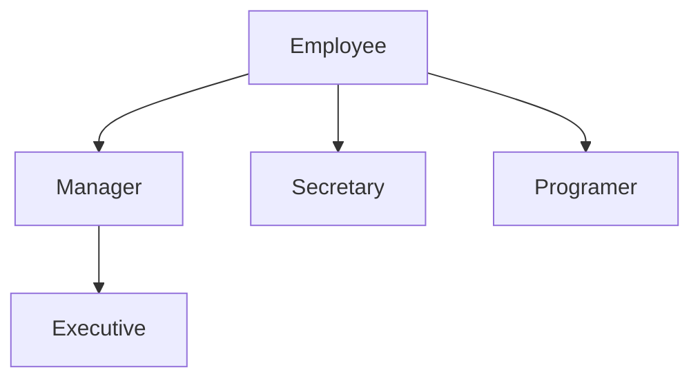

# 第5章 继承

继承已存在的类就是复用（继承）这些类的方法和域。在此基础上，还可以添加一些新的方法和域，以满足新的需求。这是Java程序设计中的一项核心技术。

## 类、超类和子类

### 继承层次

> Java与C++定义继承类的方式刊相似。Java用关键字`extends`代替了C++中的`:`。在Java 中，所有的继承都是公有继承，而没有C++中的私有继承和保护继承。同时Java不支持多继承。

`super`不像`this`关键字一样是一个对象的引用，不能将`super`赋给另一个对象变量，它只是一个指示编译器调用超类方法的特有关键字。

如果子类的构造器没有显式地调用超类的构造器，则将自动地调用超类默认构造器。如果超类没有不带参数的构造器，并且在子类的构造器中又没有显式地调用超类的其他构造器，贝编译器将报告错误。

一个对象变量可以引用多种实际类型的现象被称为多态（polymorphism）。在运行时能够自动地选择调用哪个方法的现象称为动态绑定（dynamic binding）。

继承并不仅限于一个层次。例如，可以由`Manager`类派生`Exeutive`类。由一个公共超类派生出来的所有类的集合被称为继承层次（inheritance hierarchy）。在继承层次中，从某个特定的类到其祖先的路径被称为该类的继承链（inheritance chain）。




### 多态

”is-a“规则的另一种表述法是置换法则。它表明程序中出现超类对象的任何地方都可以用子类对象置换，即可以将一个子类的对象赋给超类变量。

```java
Employee e;
e = new Employee();
e = new Manager();
```

在Java 中，子类数组的引用可以转换成 超类数组的引用， 而不需要采用强制扭转换。

```java
Manager[] managers = new Manager[10];
Employee[] staffs = managers; // OK
staffs[0] = new Manager(); // OK，但调用不存在的实例域
```

### 动态绑定

动态绑定调用过程：

- 编译器查看对象的声明类型和方法名。编译器将会一一列举所有类中名为`f`的方法和其超类中访问属性为`public`且名为`f`的方法。
- 编译器查看调用方法时提供的参数类型。如果在所有名为f的方法中存在一个与提供的参数类型完全匹配，就选择这个方法。这个过程被称为重载解析（overloadingresolution）。由于允许类型转换，故过程可能更复杂。
- 如果是`private`方法、`static`方法、`final`方法或者构造器，那么编译器将可以明确所调用的方法。这种方式称为静态绑定（static binding）。与此对应的是，调用的方法依赖于隐式参数的实际类型，并且在运行时实现动态绑定。
- 当程序运行，并且采用动态绑定调用方法肘，虚拟机一定调用与`x`所引用对象的实际类型最合适的类的方法。

每次调用方法都要进行搜索，时间开销相当大。因此，虚拟机预先为每个类创建了一个方法（method table），其中列出了所有方法的签名和实际调用的方法。

> 动态绑定有一个非常重要的特性：无需对现存的代码进行修改，就可以对程序进行扩展。
>
> 覆盖一个方法的时候，子类方法不能低于制方法的可见性。特别是，如果超类的方法是`public` ，子类方法一定要卢明为`public` 。否则编译器将会把它解释为试图降低访问权限。

### 阻止继承：`final`类和方法

将方法或类声明为`final`主要鉴于以下原因： 确保它们不会在子类中改变语义。例如`Calendar`类中的`getTime`和`setTime`方法都声明为`final` 。

> 如果将一个类卢明为`final` ，只有其中的方法自动地成为`final` ，而不包括域。

在早期的Java中，有些程序员为了避免动态绑定带来的系统开销而使用`final`关键字。如果一个方能没有被覆盖并且很短，编译器就能够对它进行优化处理，这个过程为称为内联（inlining）。

虚拟机中的即时编译器比传统编译器的处理能力强得多。这种编译器可以准确地知道类之间的继承关系，并能够检测出类中是否真正地存在覆盖给定的方法。如果方法很简短、被频繁调用且没有**真正**地被覆盖，那么即时编译器就会将这个方法进行内联处理。如果虚拟机加载了另外一个子类，而在这个子类中包含了对内联方法的覆盖，那么优化器将取消对覆盖方法的内联。这个过程很慢，但却很少发生。

### 强制类型转换

进行类型转化的唯一原因是：在暂时忽视对象的实际类型之后，使用对象的全部功能。

在进行类型转换之前，应当先查看一下是否能够成功地转换。

```java
if (a instanceof b) {
	b = (A) a;
}
```

> Java使用的类型转换语法来源于C语言"糟糕的旧时期"，但处理过程类似于C++的dynamic_cast操作，例如：
>
> ```java
> Manager boss = (Manager) staff; 
> ```
>
> 等价于：
>
> ```C++
> Manager boss = dynamic_cast<Manager>(staff);
> ```

### 抽象类

```java
abstract class Person {
	public abstract String getDescription();
    public Person(String n) {
        name  = n;
    }
}
```

> 在抽象类中尽量不要包含具体方法。

### 受保护访问

Java中的受保护部分对所有子类及同一个包中的其他类均可见，相较于C++的`protected`安全性差。

归纳Java控制可见性的4个访问修饰符：

- `private`：对本类可见
- `public`：对所有类可见
- `protected`：对本包和所有子类可见、
- 默认：对本包可见，不太受欢迎的形式

## `Object`：所有类的超类

`Object`类是Java中所有类的最终祖先，在Java中每个类都是由它扩展而来的。

可以使用`Object`类型的变量引用任何类型的对象：

```java
Object obj = new Employee();
```

### `equals`方法

在`Object`类中，`equals`方法将判断两个对象是否具有相同的引用。如果两个对象具有相同的引用，它们一定相等。

在子类中定义`equals`方法时，应当先调用超类的`equals`方法。

### 相等测试与继承

编写`equals`方法的建议：

- 显式参数命名为`otherObject`

- 检测`this`与`otherObject`是否引用同一个对象

- 检测`otherObject`是否为`null`

- 比较是否属于一个类：

  - 如果`equals`的语义在每个子类中有所改变，使用`getClass`检测：

    ```java
    if (getClass() != otherObject.getClass()) {
        return false;
    }
    ```

  - 如果所有的子类都拥有统一的语义，使用`instanceof`检测：

    ```jav
    if (!otherObject instanceof ClassName)
    	return false;
    ```

- 将`otherObject`转换为相应类型的变量：

- 对域进行比较

### `hashCode`方法

散列码（hash code）是由对象导出的一个整型值。散列码是没有规律的。如果`x`和`y`是两个不同的对象， `x.hashCode()`与`y.hashCode()`基本上不会相同。

相同字符串具有相同的散列码，因为字符串的散列码根据内容导出。而字符缓冲却具有不同的哈希码，因为`StringBuffer`类没有定义`hashCode`方法。它的散列码是由`Object`类的默认`hashCode`方法导出的对象**存储地址**。

`hashCode`方法应该返回一个整型数值（也可以是负数），井合理地组合实例域的散列码，
以便能够让各个不同的对象产生的散列码更加均匀。

```java
class Employee {
	public int hashCode() {
		return 7 * name.hashCode()
		      + 11 * new Double(salary).hashCode()
		      + 13 * hireDay.hashCode();
	}
}
```

`equals`与`hashCode`的定义必须一致：如果`x.equals(y)`返回`true`，那么`x.hashCode()`就必须与`y.hashCode()`具有相同的值。

### `toString`方法

绝大多数的`toString`方法遵循如下格式：类名，随后是一对方括号括起来的域值。

```java
public String toString() {
	return getClass().getName()
        + "[name=" + name
        + ",salary=" + salary
        + ",hireDay=" + hireDay
        + "]";
}
```

> 若想打印多维数组，可调用`Arrays.deepToString();`
>
> 强烈建议为自定义的每一个类增加`toString`方法。

## 泛型数组列表

Java SE 5.0中，`ArrayList`是采用类型类型参数的泛型类。具有自动调节容量的功能。

> Java SE 5.0以前没有提供泛型类，而是有一个ArrayList 类，其中保存类型为`Object`的元素。

一旦能够确认数组列表的大小不再发生变化，就可以调用`trimToSize`方法。

## 对象包装类与自动打包

对象包装器类是**不可变**的，即一旦构造了包装器，就不允许更改包装在其中的值。同时，对象包装器类还是`final`，因此不能定义它们的子类。

```java
ArrayList<Integer> list = new ArrayList<Integer>();
list.add(3); // 自动打包为 list.add(new Integer(3));
```

> 自动打包（autowrapping）指将基本类型自动转化为包装类的变换。而“装箱”（boxing）来源于C##。

相反地，当将一个`Integer`对象赋给一个`int`值时，将会自动地拆包。

打包和拆包时**编译器**认可的，而非虚拟机。编译器在生成类的字节码时，插入必要的方法调用（如`new Integer(3)`），虚拟机只是执行这些字节码。

## 参数数量可变的方法

`printf`方法定义如下：

```java
public class PrintStream {
    public PrintStream printf(String fmt, Object... args);
}
```

## 枚举类

```java
public enum Size {
    SMALL, MEDIUM, LARGE, EXTRA_LARGE
};
```

实际上，这个声明定义的类型为一个类，恰好有4个实例，在此尽量不要构造新对象。

在比较枚举类型的值时，直接使用`==`即可。

```java
enum Size {
	SMALL("S"), MEDIUM("M"), LARGE("L"), "EXTRA_LARGE("XL");
	
	private Size(String abbreviation) { 
        this.abbreviation = abbreviation; 
    }
    public String getAbbreviation() { 
        return abbreviation; 
    }
    
    public String abbreviation;
}
```

所有枚举类型都是`Enum`的子类，它们继承了这个类的许多方法。其中最有用的一个是`toString` ，这个方法能够返回枚举常量名。例如`Size.SMALL.toString()`返回“SMALL”。

`toString`的逆方法是静态方法`valueOf`。例如，语句：`Size s = (Size)Enum.valueOf(Size.class, "SMALL")`。将`s`设置为`Size.SMALL`。

每个枚举类型都有一个静态的`values`方法。返回一个包含全部枚举值的数组。

`ordinal`方法返回`enum`声明中枚举常量的位置，位置从`0`开始计数。

```java
public class EnumTest {
	public static void main(String[] args) {
		Scanner in = new Scanner(System.in);
		System.out.println("Enter a size:");
		String input = in.next().toUpperCase();
		Size size = Enum.valueOf(Size.class, input);
		System.out.println("size=" + size);
        if (size == Size.EXTRA_LARGE) {
            System.out.println("Good job--you paid attenion to the -");
        }
	}
}
```

## 反射

反射库（reflection library）提供一个工具箱，以便编写能够动态操纵Java代码的程序。这项功能被大量地应用于JavaBeans中，它是Java组件的体系结构。

能够分析类能力的程序被称为为反射（reflective）。反射机制的应用如下：

- 在运行中分析类的能力
- 在运行中查看对象，例如编写`toString`方法供所有类使用
- 实现数组的操作代码
- 利用`Method`对象，这个对象C++中的函数指针

反射是一种功能强大且复杂的机制。使用它的主要对象是工具构造者，而不是应用程序员。

### `Class`类

在程序运行期间， Java运行时系统始终为所有的对象维护一个被称为运行时的**类型标识**。这个信息保存着每个对象所属的类足迹。虚拟机利用运行时信息选择相应的方法执行。

获取对象实例的方法：

- `getClass()`

- `forName(ClassName)`

- `.class`：仅针对Java类型，如`int.class`

  > 鉴于历史原因，`getName`方法在应用于数纽类型的时候会返回一个很奇怪的名字：
  >
  > - `Double[].class.getName()` 返回`java.lang.Double`

虚拟机为每个类型管理一个`Class`对象，可通`==`实现两个对象比较的操作。

使用`newInstance()`快速创建一个实例。例如

```java
e.getClass().newInstance();
forName(ClassName).newInstance();
```

`newInstance`方法调用默认的构造器。若这个类没有默认构造器，则会抛出异常。

### 捕获异常

检查类名是否存在：

```java
try {
	String name = "...";
    Class cl = Class.forNaem(name);
} catch(Exception e) {
    e.printSatckTrace(); // 将 Throwable 对象和栈的轨迹输出到标准错误流
}
```

### 利用反射分析类的能力

在`java.lang.reflect`包中的三个类的`Field`、`Method`和`Constuctor`分别用于描述类的的域、方法和构造器。

- `getName`：返回项目名称
- `getModifers`：返回整型数值，使用不同位开关描述修饰符使用情况

```java
public class ReflectionTest {
   public static void main(String[] args)
         throws ReflectiveOperationException {
      // read class name from command line args or user input
      String name;
      if (args.length > 0) {
         name = args[0];
      } else {
         var in = new Scanner(System.in);
         System.out.println("Enter class name (e.g. java.util.Date): ");
         name = in.next();
      }

      // print class modifiers, name, and superclass name (if != Object)
      Class cl = Class.forName(name);
      String modifiers = Modifier.toString(cl.getModifiers());
      if (modifiers.length() > 0)
         System.out.print(modifiers + " ");
      if (cl.isSealed())
         System.out.print("sealed ");
      if (cl.isEnum())
         System.out.print("enum " + name);
      else if (cl.isRecord())
         System.out.print("record " + name);
      else if (cl.isInterface())
         System.out.print("interface " + name);
      else
         System.out.print("class " + name);
      Class supercl = cl.getSuperclass();
      if (supercl != null && supercl != Object.class)
         System.out.print(" extends "
               + supercl.getName());

      printInterfaces(cl);
      printPermittedSubclasses(cl);

      System.out.print("\n{\n");
      printConstructors(cl);
      System.out.println();
      printMethods(cl);
      System.out.println();
      printFields(cl);
      System.out.println("}");
   }

   public static void printConstructors(Class cl) {
      Constructor[] constructors = cl.getDeclaredConstructors();

      for (Constructor c : constructors) {
         String name = c.getName();
         System.out.print("   ");
         String modifiers = Modifier.toString(c.getModifiers());
         if (modifiers.length() > 0)
            System.out.print(modifiers + " ");
         System.out.print(name + "(");

         Class[] paramTypes = c.getParameterTypes();
         for (int j = 0; j < paramTypes.length; j++) {
            if (j > 0)
               System.out.print(", ");
            System.out.print(paramTypes[j].getName());
         }
         System.out.println(");");
      }
   }

   public static void printMethods(Class cl) {
      Method[] methods = cl.getDeclaredMethods();

      for (Method m : methods) {
         Class retType = m.getReturnType(); // 获取返回类型
         String name = m.getName();

         System.out.print("   ");
         String modifiers = Modifier.toString(m.getModifiers()); // 获取限定符
         if (modifiers.length() > 0) {
         	System.out.print(modifiers + " ");
         }
         System.out.print(retType.getName() + " " + name + "("); // 输出
		
         // 获取参数类型
         Class[] paramTypes = m.getParameterTypes(); 
         for (int j = 0; j < paramTypes.length; j++) {
            if (j > 0)
               System.out.print(", ");
            System.out.print(paramTypes[j].getName()); // 输出参数类型
         }
         System.out.println(");");
      }
   }

   public static void printFields(Class cl) {
      Field[] fields = cl.getDeclaredFields();

      for (Field f : fields) {
         Class type = f.getType();
         String name = f.getName();
         System.out.print("   ");
         String modifiers = Modifier.toString(f.getModifiers());
         if (modifiers.length() > 0)
            System.out.print(modifiers + " ");
         System.out.println(type.getName() + " " + name + ";");
      }
   }

   public static void printPermittedSubclasses(Class cl) {
      if (cl.isSealed()) {
         Class<?>[] permittedSubclasses = cl.getPermittedSubclasses();
         for (int i = 0; i < permittedSubclasses.length; i++) {
            if (i == 0)
               System.out.print(" permits ");
            else
               System.out.print(", ");
            System.out.print(permittedSubclasses[i].getName());
         }
      }
   }
    
   public static void printInterfaces(Class cl) {
      Class<?>[] interfaces = cl.getInterfaces();
      for (int i = 0; i < interfaces.length; i++) {
         if (i == 0)
            System.out.print(cl.isInterface() ? " extends " : " implements ");
         else
            System.out.print(", ");
         System.out.print(interfaces[i].getName());
      }
   }
}
```

### 在运行时使用反射分析对象

查看对象域的关键方法是`Field`类中的`get`方法，其返回一个当前值的域对象。

```java
Employee harry = new Employee("Harry Hacker", 35000, 10, 1, 1989);
Class cl = harry.getClass();
Field f = cl.getDeclaredField("name");
Object v = f.get(harry);
```

由于`name`是一个私有域，所以`get`方法将会抛出一个`IllegalAccessException`。

反射机制的默认行为受限于Java的访问控制。如果一个Java程序没有受到安全管理器的控制，就可以覆盖访问控制。

```java
f.getAccessible(true);
```

`setAccessible`为`AccessibleObject`类中的一个方法，它是`Field` 、`Method`和`Constructor`类
的公共超类。这个特性是为调试、持久存储和相似机制提供的。

```java
public class ObjectAnalyzerTest {
    public static void main(String[] args)
            throws ReflectiveOperationException {
        ArrayList<Integer> squares = new ArrayList<Integer>();
        for (int i = 1; i <= 5; i++)
            squares.add(i * i);
        int[] array = new int[]{1, 2, 3, 4, 5};
        System.out.println(new ObjectAnalyzer().toString(array));
        System.out.println(new ObjectAnalyzer().toString(squares));
    }
}

class ObjectAnalyzer {
    private ArrayList<Object> visited = new ArrayList<>();
    public String toString(Object obj)
            throws ReflectiveOperationException {
        if (obj == null)
            return "null";
        if (visited.contains(obj))
            return "...";
        visited.add(obj);
        Class cl = obj.getClass(); // 获取 class 实例
        if (cl == String.class) //为字符串类型，这届返回
            return (String) obj;
        if (cl.isArray()) { // 为数组类型
            String r = cl.getComponentType() + "[]{"; // 返回数组中元素的Class对象，类似于int[]{1, 2, 3};
            for (int i = 0; i < Array.getLength(obj); i++) { // 注意为 reflect.Array 类
                if (i > 0)
                    r += ",";
                Object val = Array.get(obj, i);
                if (cl.getComponentType().isPrimitive()) // 判断是否基本类型
                    r += val;
                else
                    r += toString(val);
            }
            return r + "}";
        }

        String r = cl.getName(); // 获取类名
        do {
            r += "[";
            Field[] fields = cl.getDeclaredFields(); // 获取当前类的所有字段 / 域
            AccessibleObject.setAccessible(fields, true);
            // 获取域名和值
            for (Field f : fields) {
                if (!Modifier.isStatic(f.getModifiers())) { // 域修饰为静态
                    if (!r.endsWith("["))
                        r += ",";
                    r += f.getName() + "="; // 输出域名
                    Class t = f.getType();
                    Object val = f.get(obj); // 获取值
                    if (t.isPrimitive()) // 为基本类型
                        r += val;
                    else // 为引用类型
                        r += toString(val);
                }
            }
            r += "]";
            cl = cl.getSuperclass(); // 获取父类
        } while (cl != null);
        return r;
    }
}
```

```java
class Employee {
    public Employee() {}

    public Employee(int id, String name) {
        this.id = id;
        this.name = name;
    }

    @Override
    public String toString() {
        return "Employee" + "[]";
    }

    int id;
    String name;
}
public class Reflect {
    public static void main(String[] args) {
        // 获取类型
        Employee e = new Employee();
        System.out.println(e.getClass().toString());

        // 构造对象
        String className = "chap5.Employee";
        try {
            Employee e2 = (Employee) forName(className).newInstance();
            System.out.println(e2);
        } catch (Exception ex) {
            ex.printStackTrace();
        }

        // 反射
        // 构造方法
        Class c = null;
        try {
            c = forName(className);
            System.out.println(c.getSuperclass());
            Constructor[] constructors = c.getDeclaredConstructors();
            for (Constructor constructor : constructors) {
                System.out.println(constructor);
            }
        } catch (Exception ex) {
            ex.printStackTrace();
        }

        Employee harry = new Employee(123, "Huang");
        Class c1 = harry.getClass();
        try {
            Field field = c1.getDeclaredField("id");
            Object value = field.get(harry);
            System.out.println((Integer) value);
        } catch (Exception ex) {
            ex.printStackTrace();
        }
    }
}
```

### 方法指针

> 方法指针是很危险的，并且常常会带来隐患。

Java没有提供方法指针，即将一个方法的存储地址传给另一个方法，以便其他方法调用。

`Method`类中有一个`invoke`方法，允许调用包装在当前`Method`对象的方法。

```java
Object invoke(Object obj, Object... args);
returnType ret = (returnType) method.invoke(obj);
```

获取`Method`对象可通过`getMethod`方法。

```java
Method getMetod(String name, Class... parameterType);
Method m1 = Employee.class.getMethod("getName");
Method m2 = Employee.class.getMethod("raiseSalary", double.class);
```

```java
public class MethodPointerTest {
    public static void main(String[] args) throws Exception {
        Method square = MethodPointerTest.class.getMethod("square", double.class);
        Method sqrt = Math.class.getMethod("sqrt", double.class);

        printTable(1, 10, 10, square);
        printTable(1, 10, 10, sqrt);
    }

    public static double square(double x) {
        return x * x;
    }
    public static void printTable(double from, double to, int n, Method f) {
        System.out.println(f);
        double dx = (to - from) / (n - 1);
        for (double x = from; x <= to; x += dx) {
            try {
                double y = (Double) f.invoke(null, x);
                System.out.printf("%10.4f | %10.4f%n", x, y);
            } catch (Exception e) {
                e.printStackTrace();
            }
        }
    }
}
```

```
public static double chap5.MethodPointerTest.square(double)
    1.0000 |     1.0000
    2.0000 |     4.0000
    3.0000 |     9.0000
    4.0000 |    16.0000
    5.0000 |    25.0000
    6.0000 |    36.0000
    7.0000 |    49.0000
    8.0000 |    64.0000
    9.0000 |    81.0000
   10.0000 |   100.0000
public static double java.lang.Math.sqrt(double)
    1.0000 |     1.0000
    2.0000 |     1.4142
    3.0000 |     1.7321
    4.0000 |     2.0000
    5.0000 |     2.2361
    6.0000 |     2.4495
    7.0000 |     2.6458
    8.0000 |     2.8284
    9.0000 |     3.0000
   10.0000 |     3.1623
```

> 建议仅在必要的时候才使用`Method`对象，而最好使用接口和内部类

```java
public class InvokeTest {
    public static double square(double x) {
        return x * x;
    }

    public static void printTable(double a, Method f) {
        try {
            double y = (Double) f.invoke(null, a);
            System.out.println(y);
        } catch (Exception e) {
            e.printStackTrace();
        }
    }

    public static void main(String[] args) {
        try {
            Method square = InvokeTest.class.getMethod("square", double.class);

            printTable(2.0, square);
        } catch (NoSuchMethodException e) {
            e.printStackTrace();
        }
    }
}
```

## 继承设计技巧

- 将公用操作或域放在超类

- 不要使用受保护的域

  > `protected`机制并不能带来更好的保护：
  >
  > - 子类集合是无限制的，任何人可以派生子类从而访问实例域
  > - 在同一包中所有类均可以访问`protected`域

- 使用继承实现`is-a`的关系

- 除非所有继承的方法有意义，否则不使用继承

- 在覆盖方法时，不要改变预期的行为

- 使用多态，而非类型信息

- 不要过多使用反射


