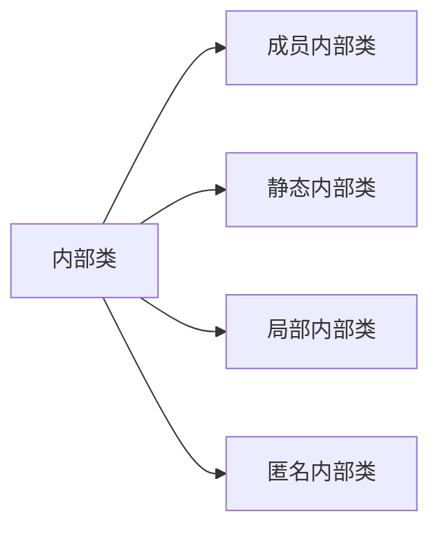

# 第6章 接口、lambda 表达式与内部类

## 接口

在Java中，接口不是类，而是对类的一组需求的描述，这些类要遵从接口描述的统一格式进行定义。

> 在Java SE 5.0中，`Comparable`接口已改进为泛型类型
>
> ```java
> public interaface Comparable<T> {
> 	int compareTo(T other);
> }
> ```

接口中的所有方法自动地属于`public`。

`Employee`类compareTo方法的实现：

```java
public class Employee implements Comparable<Employee> {
    public Employee(int id, String name, double salary) {
        this.id = id;
        this.name = name;
        this.salary = salary;
    }

    @Override
    public String toString() {
        return String.format("%s[id=%d,name=%s,salary=%f", getClass().getName(), id, name, salary);
    }

    @Override
    public int compareTo(Employee o) {
        return Double.compare(salary, ((Employee) o).salary);
    }

    int id;
    String name;
    int age;
    double salary;

    public static void main(String[] args) {
        Employee[] employees = new Employee[2];
        employees[0] = new Employee(1, "Tom", 2303);
        employees[1] = new Employee(2, "Tiffy", 2300);

        Arrays.sort(employees);
        for (int i = 0; i < employees.length; i++) {
            System.out.println(employees[i]);
        }
    }
}
```

### 接口的特性

有些接口只定义常量，而无方法。例如在标准库中的`SwingConstants`接口，只包含了`NORTH`、`SOUTH`和`HORIZONAL`等常量。

尽量每个类只能有一个超类，但可实现多个接口。如某个类实现了`Cloneable`接口，`Object`类中的`clone`方法可创建类对象的一个拷贝。

### 接口与抽象类

Java设计者选择不支持多继承，主要原因为多继承会使语言本身非常复杂，同时效率也会降低。Java利用接口机制实现多继承的大部分功能。

### 静态方法和私有方法

在Java 8 中，允许在接口中增加静态方法。理论上讲，没有任何理由认为这是不合法的。只是这有违于将接口作为抽象规范的初衷。

目前为止，通常的做法都是将静态方法放在伴随类中。在标准库中，你会看到成对出现的接口和实用工具类，如`Collection`/`Collections` 或`Path`/`Paths` 。

可以由一个URI或者字符串序列构造一个文件或目录的路径，如`Paths.get("jdk-11", "conf ", "security")` 。在Java11中，Path 接口提供了等价的方法：

```java
public interface Path {
    public static Path of(URL url) {}
    public static Path of(String first, String... more) {}
}
```

这样一来， `Paths` 类就不再是必要的了。

`private` 方法可以是静态方法或实例方法。由于私有方法只能在接口本身的方法中使用，所以它们的用法很有限，只能作为接口中其他方法的辅助方法。

### 默认方法

可以为接口方法提供一个默认实现。

```java
public interface Comparable<T> {
    // 默认情况下，所有元素相等
    default int compareTo(T other) { return 0; }
}
```

默认方法的一个重要用法是“接口演化”（interface evolution）。假设`stream`方法不是一个默认方法，那么Bag 类将不能编译，因为它没有实现这个新方法。为接口增加一个非默认方法不能保证“源代码兼容”（source compatible）。

#### 解决默认冲突

1. 超类优先。如果超类提供了一个具体方法， 同名而且有相同参数类型的默认方法会被忽略。

2. 接口冲突。如果一个接口提供了一个默认方法，另一个接口提供了一个同名而且参数类型（不论是否是默认参数）相同的方法，必须覆盖这个方法来解决冲突。

   ```java
   class Student implements Person, Named {
       public String getName() {
           return Person.super.getName();
       }
   }
   ```

### 对象克隆

当拷贝一个变量时， 原始变量与拷贝变量引用同一个对象。

`clone`方法是`Object`类的一个`protected`方法。即用户编写的代码不能直接调用它，而要通过对象的子类实现`clone`方法。

默认的克隆操作是**浅拷贝**，并未克隆包含在对象中的内部对象。若原始对象与浅克隆对象共享的子对象不可变，则可使用默认拷贝方法。

`Cloneable`接口时Java提供的标记接口，其不含有方法，唯一的目的是可使用`instanceof`进行类型检查。

对于每一个类，需要确定：

1. 默认的`clone`方法是否满足要求；
2. 是否可以在可变的子对象上调用`clone`来修补默认的`clone`方法；
3.  是否不该使用`clone`。

> 在Java SE 5.0之前版本中，`clone`方法返回`Object`类型，在其之后允许克隆方法返回指定类型。

在标准类库中，只有不到5% 的类实现了`clone`。

```java
public Employee clone() throws CloneNotSupportedException {
    // 调用Object.clone()
    Employee cloned = (Employee) super.clone();
    cloned.hireDay = (Date) hireDay.clone();
    
    return cloned;
}
```

### 接口与回调

回调（callback）是一种常见的程序设计模式。在这种模式中，可以指出某个特定事件发生时应该采取的动作。

```java
public class TimerTest {
    public static void  main(String[] args) {
        ActionListener listener = new TimePrinter();
        Timer t = new Timer(1000, listener); // 构造定时器，隔 interval 通知 listener
        t.start(); // 启动定时器
        JOptionPane.showMessageDialog(null, "Quit program");
        System.exit(0);
    }
}

class TimePrinter implements ActionListener {
    public void actionPerformed(ActionEvent event) {
        Date now = new Date();
        System.out.println("At the tone, the time is " + now);
        Toolkit.getDefaultToolkit().beep(); // 发出响铃 
        // 获取默认工具箱（GUI 环境信息）
    }
}
```

### Comparator接口

现在假设我们希望按长度递增的顺序对字符串进行排序，而不是按字典顺序进行排序。肯定不能让`String`类用两种不同的方式实现`compareTo`方法。

比较器实现了`Comparator`口的类的实例。

```java
public interface Comparator<T> {
    int compare(T first, T second);
}
```

```java
import java.util.Arrays;
import java.util.Comparator;

public class ComparatorTest {
    public static void main(String[] args) {
        String[] friends = {"Peter", "Paul", "Mary"};
        Arrays.sort(friends, new LengthComparator());

        for (String frind : friends) {
            System.out.println(frind);
        }
    }
}

class LengthComparator implements Comparator<String> {
    public int compare(String first, String second) {
        return first.length() - second.length();
    }
}
```

## lambda表达式

### lambda表达式语法

lambda 表达式是一个可传递的代码块，可以在以后执行一次或多次。

如果可以推导出一个lambda 表达式的参数类型， 则可以忽略其类型。如：

```java
Comparator<String> comp =  (first, second) -> first.length() - second.length();
```

```java
public class LambdaTest {

    public static void main(String[] args) {
        Timer timer = new Timer(1000, event ->
                System.out.println("This time is " + new Date()));
        timer.start();

        JOptionPane.showMessageDialog(null, "Quit program?");
        System.exit(0);

        String[] friends = {"Peter", "Paul", "Mary"};
        Arrays.sort(friends, (String first, String second) -> first.length() - second.length());

        for (String frind : friends) {
            System.out.println(frind);
        }
    }
}
```

### 函数式接口

对于只有一个抽象方法的接口，需要这种接口的对象时，就可以提供一个lambda 表达式。这种接口称为函数式接口（functional interface）。

实际上，在Java 中，对lambda 表达式所能做的也只是转换为函数式接口。在其他支持函数字面量的程序设计语言中，可以声明函数类型， 声明这些类型
的变量，还可以使用变量保存函数表达式。不过， Java 设计者还是决定保持我们熟悉的接口概念，没有为Java 语言增加函数类型。

### 方法引用

```java
Timer timer = new Timer(1000, event -> System.out.println(event));

Timer timer = new Timer(1000, System.out::println)
```

表达式`System.out::println`是一个方法引用（method reference），它指示编译器生成一个函数式接口的实例，覆盖这个接口的抽象方法来调用给定的方法。

注意，只有当lambda表达式的体只调用一个方法而不做其他操作时， 才能把lambda 表达式重写为方法引用。

| 方法引用            | 等价lambda表达式               |
| ------------------- | ------------------------------ |
| `separator::equals` | `x -> separator.equals(x)`     |
| `String::trim`      | `x -> x.trim()`                |
| `String::concat`    | `x -> x.concat`                |
| `Integer::valueOf`  | `x -> Integer.valueOf(x)`      |
| `Integer::sum`      | `(x, y) -> Integer::sum(x, y)` |

### 构造器引用

构造器引用与方法引用很类似，只不过方法名为`new`。具体使用哪个构造器取决于上文。

Java 有一个限制，无法构造泛型类型T 的数组。数组构造器引用对于克服这个限制很有用。可以把`Person[]::new`传人`toArray`方法：

```java
import java.util.ArrayList;
import java.util.List;
import java.util.stream.Collectors;
import java.util.stream.Stream;

public class StreamTest {
    public static void main(String[] args) {
        ArrayList<String> names = new ArrayList<>();
        names.add("Harry");
        names.add("Peter");
        Stream<Person> stream = names.stream().map(Person::new);
        List<Person> people = stream.collect(Collectors.toList());

        for (Person p : people) {
            System.out.println(p.name);
        }
    }
}

class Person {
    public Person(String name) {
        this.name = name;
    }

    String name;
}
```

### 变量作用域

lambda 表达式可以捕获外围作用域中变量的值。在Java 中，要确保所捕获
的值是明确定义的， 这里有一个重要的限制。在lambda 表达式中，只能引用值不会改变的变量。

在一个lambda 表达式中使用`this`关键字时，是指创建这个lambda 表达式的方法的`this`参数。

```java
public class Application {
    public void init() {
        ActionListener listener = event -> {
            System.out.println(this.toString());
        }
    }
}
```

### 处理lambda表达式

使用lambda 表达式的重点是延迟执行（deferred execution）。

使用情景如：

- 在一个单独的线程中运行代码；
- 多次运行代码；
- 在算法的适当位置运行代码（如排序的比较）；
- 发生某种情况时执行的代码；

### 再谈Comparator

```java
public class ComparatorTest {
    public static void main(String[] args) {
        Person[] persons = new Person[3];
        persons[0] = new Person("H", "ZY");
        persons[1] = new Person("W", "RY");
        persons[2] = new Person("Q", "WD");

        Arrays.sort(persons, Comparator.comparing(Person::getFirstName)
                .thenComparing(Person::getLastName));

        for (Person person : persons) {
            System.out.println(person.toString());
        }
    }
```

实现逆序：

```java
public static void main(String[] args) {
    Integer[] a = {1, 2, 3, 4, 5};
    Arrays.sort(a, Collections.reverseOrder());
    Arrays.sort(a, (i, j) -> { return j - i; });
}
```

## 内部类

内部类（inner class）是定义在另一个类中的类。使用内部类，主要原因有三：

- 内部类方能可以访问该类定义所在的作用域中的数据，包括私有的数据。
- 内部类可以对同一个包中的其他类隐藏起来。
- 当想要定义一个回调函数且不想编写大量代码，可使用匿名匿名（anonymous）内部类。

### 使用内部类访问对象状态

内部类既可以访问自身的数据域，也可以访问创建它的外围类对象的数据域。内部类的对象总有一个隐式引用，它指向了创建它的外部类的对象 。

### 内部类的特殊语法规则

使用外部类引用的正规语法：`OuterClass.this`

可以通过`outerObject.new InnerClass()`编写内部对象的构造器。

```java
public class InnerClassTest {
    int n = 5;
    void welcome() {
        System.out.println("Hello, World");
    }
    class InnerClass {
        void timesOfWelcome() {
            for (int i = 0; i < InnerClassTest.this.n; i++) {
                InnerClassTest.this.welcome();
            }
        }
    }

    public static void main(String[] args) {
        InnerClass inner = new InnerClassTest().new InnerClass();
        inner.timesOfWelcome();
    }
}
```

### 内部类是否有用、必要和安全

内部类是一种**编译器现象**，与虚拟机无关。编译器将会把内部类翻译成用`$`分隔外部类名与内部类名的常规类文件，而虚拟机则对此一无所知。例如类文件`outerClass$innerClass.class`文件。

为引用外围类，编译器生成一个附加的实例域`this$0`。为管理额外的访问权限编译器在外围添加静态方法`access$0`，它将返回作为参数传递给对象域。

### 局部内部类

若内部类只在方法中使用一次，可定义局部内部类。<u>局部类</u>不能使用`public`或`private`访问说明符进行说明。它的作用域被限定在声明这个局部类的块中。

### 由外部类访问`final`方法

 局部类的方法只可以引用定义为`final`的局部变量。它们不仅能够访问包含它们的外部类，还可以访问被`final`修饰局部变量。在创建一个对象时，局部变量传递给构造器，存储在`val$value`与中（备份）。

如果需更新一个封闭作用域内的计数器，可使用长度为1的数组。

```java
final int[] counter = new int[1];
for (int i = 0; i < dates.length; i++) {
    date[i] = new Date() {
        public int compareTo(Date other) {
            counter[0]++;
            return super.compareTo(other);
        }
    };
}
```

### 匿名内部类

通常的语法格式为：

```java
new SuperType(construction parameters) {
	inner class method and data
}
```

```java
public class AnonymousInnerClassTest {
    public static void main(String[] args) {
        TalkingClock clock = new TalkingClock();
        clock.start(1000, true);
        JOptionPane.showMessageDialog(null, "Quit program?");
        System.exit(0);
    }
}

class TalkingClock {
    public void start(int interval, final boolean beep) {
        ActionListener listener = new ActionListener() {
            @Override
            public void actionPerformed(ActionEvent e) {
                Date now = new Date();
                System.out.println("At the tone, the time is " + now);
                if (beep) {
                    Toolkit.getDefaultToolkit().beep();
                }
            }
        };
        Timer t = new Timer(interval, listener);
        t.start();
    }
}
```

### 静态内部类

有时候，使用内部类只是为了将一个类隐藏在另一个类的内部，并不需要内部类引用外部对象。此时，可将内部类声明为`static`，<u>取消产生的引用</u>。

```java
class ArrayAlg {
    public static class Pair {
        public Pair(double f, double s) {
            first = f;
            second = s;
        }
        public double getFirst() {
            return first;
        }
        public double getSecond() {
            return second;
        }
        private double first;
        private double second;
    }
    public static Pair minmax(double[] values) {
        double min = Double.MAX_VALUE;
        double max = Double.MIN_VALUE;
        for (double v : values) {
            if (min > v)
                min = v;
            if (max < v)
                max = v;
        }
        return new Pair(min, max);
    }
}
```



> **双括号初始化**
>
> ```java
> public class DoubleBraceTest {
>     public static void main(String[] args) {
>         invite(new ArrayList<String>() {{
>             add("Harry");
>             add("Tony");
>         }});
> 
>         invite(List.of("Harry", "Tony"));
>     }
> 
>     static void invite(List<String> friends) {
>         for (String friend : friends) {
>             System.out.println("Invite " + friend);
>         }
>     }
> }
> ```

## 代理

代理（proxy）是Java SE 1.3新增的特性。利用代理可以在运行时创建一个实现了一组给定接口的新类。该功能在编译时无法确定接口的具体实现时十分必要。

代理类可以在运行时创建全新的类。这样的代理类能够实现指定的接口。同时，它具有指定接口的全部方法以及`Object`类的全部方法。

然而，不能在运行时定义这些方法的新代码。而是要提供一个调用处理器（invocation hanler）。调用处理器实现了`InvocationHandler`接口的类对象。该接口只含有一个方法`invoke`。

无论何时调用代理对象的方法，调用处理器的`invoke`方法都会被调用，井向其传递`Method`对象和原始的调用参数。调用处理器必须给出处理调用的方式。

创建一个代理对象，需使用`Proxy`类的`newProxyInstance`方法，该方法有三个参数：

- 一个类加载器（class loader）。作为Java安全模型的一部分。
- 一个Class对象数组，每个元素都是需要实现的接口。
- 一个调用处理器。

```java
public class ProxyTest {
    public static void main(String[] args) {
        Object[] elements = new Object[1000];
        for (int i = 0; i < elements.length; i++) {
            Integer value = i + 1;
            InvocationHandler handler = new TraceHandler(value);
            // 创建代理对象（类加载器 + 实现接口元素的数组 + 调用处理器）
            Object proxy = Proxy.newProxyInstance(
                    ClassLoader.getSystemClassLoader(),
                    new Class[] { Comparable.class }, handler);
            elements[i] = proxy; // 代理该对象
        }
        Integer key = (int)(Math.random() * elements.length) + 1;
        int result = Arrays.binarySearch(elements, key);
        if (result >= 0) {
            System.out.println(elements[result]);
    }
}

class TraceHandler implements InvocationHandler {
    public TraceHandler(Object t) {
        target = t;
    }
    @Override
    public Object invoke(Object proxy, Method method, Object[] args) throws Throwable {
        // 输出隐式参数
        System.out.print(target);
        // 输出方法名
        System.out.print("." + method.getName() + "(");
        // 输出显式参数
        if (args != null) {
            for (int i = 0; i < args.length; i++) {
                System.out.print(args[i]);
                if (i < args.length - 1)
                    System.out.print(", ");
            }
        }
        System.out.println(")");
        // 调用实际函数
        return method.invoke(target, args);
    }
    private Object target;
}
```

```
500.compareTo(692)
750.compareTo(692)
625.compareTo(692)
687.compareTo(692)
718.compareTo(692)
702.compareTo(692)
694.compareTo(692)
690.compareTo(692)
692.compareTo(692)
692.toString()
692
```

> 及时不属于`Comparable`接口，`toString`方法也会被代理。

### 代理类的特性

代理类是在程序运行过程中创建的。所有的代理类都扩展于`Proxy`类。一个代理类只有一个实例域——调用处理器， 它定义在`Proxy`的超类中。为履行代理对象的职责，所需要的任何附加数据都必须存储在调用处理器中。。

所有的代理类都覆盖了`Object`类中的方法，如`toString`，`equals`和`hashCode` 。这些方法仅仅调用了调用处理器的`invoke`方法。

代理是一项工具构造者感兴趣的高级技术，对应用程序员来说，井不十分重要。