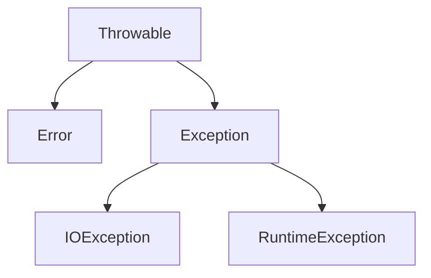
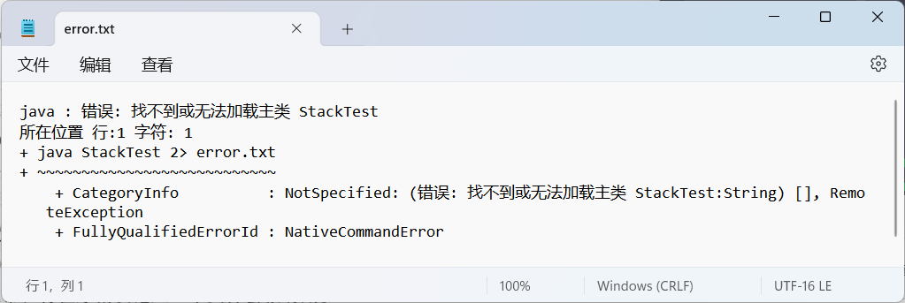

# 第11章 异常、断言和日志

## 处理错误

用户期望在出现错误时，程序能够采取合理的行为。如果由于出现错误而使得某些操作没有完成，程序应该：

- 返回到一种安全状态，并能够让用户执行其他的命令；或者
- 允许用户保存所有工作的结果，并以妥善的方式终止程序。

为了能够处理程序中的异常情况，必须考虑到程序中可能会出现的错误和问题。

- 用户输入错误
- 设备错误
- 物理限制
- 代码错误

对于方法中的错误，传统的做法是返回一个特殊的错误码，由调用方法分析。遗憾的是，并不是任何情况下都能够返回一个错误码。有可能无法明确地将有效数据与无效数据加以区分。异常处理机制开始搜索能够处理这种异常状况的异常处理器（exception handler）。

### 异常分类

在Java 程序设计语言中，异常对象都是派生于`Throwable` 类的一个类实例。

所有的异常都是由`Throwable` 继承而来，但在下一层立即分解为两个分
支： `Error`和`Exception`。



`Error`类层次结构描述了Java 运行时系统的内部错误和资源耗尽错误。

在设计Java 程序时，要重点关注Exception 层次结构。这个层次结构又分解为两个分支：一个分支派生于`RuntimeException` ； 另一个分支包含其他异常。一般规则是： 由编程错误导致的异常属于`RuntimeException` ； 如果程序本身没有问题，但由于像I/0 错误这类问题导致的异常属于其他异常。

派生于`RuntimeException` 的异常包括以下问题：

- 错误的强制类型转换。
- 数组访问越界。
- 访问`null` 指针。

不是派生于`RuntimeException` 的异常包括：

- 试图超越文件末尾继续读取数据。
- 试图打开一个不存在的文件。
- 试图根据给定的字符串查找Class 对象，而这个字符串表示的类并不存在。

> “如果出现RuntimeException 异常，那么就一定是你的问题”，这个规则很有道理。应该通过检测数组下标是否越界来避`ArraylndexOutOfBoundsException` 异常； 应该在使用变量之前通过检测它是否为`null`来杜绝`NullPointerException` 异常的发生。

Java 语言规范将派生于`Error`类或`RuntimeException` 类的所有异常称为非检查型（unchecked）异常。所有其他的异常称为检查型（checked）异常。

### 声明检查型异常

如果遇到了无法处理的情况， Java 方法可以抛出一个异常。这个道理很简单： 方法不仅需要告诉编译器将要返回什么值，还要告诉编译器有可能发生什么错误。

```java
public FileInputStream(String name) throws FileNotFoundException {
	if (file == null) {
        throw new FileNotFoundException();
    }
}
```

如果一个方法有可能抛出多个检查型异常类型，那么就必须在方法的首部列出所有的异常类。如果一个方法有可能抛出多个检查型异常类型，那么就必须在方法的首部列出所有的异常类。同样，也不应该声明从`RuntimeException` 继承的那些非检查型异常。

```java
class MyAnimation {
    public Image lodaImage(String s) throws FileNotFoundException, EOFException {
     	...   
    }
}
```

### 创建异常类

自定义的这个类应该包含两
个构造器，一个是默认的构造器，另一个是包含详细描述信息的构造器（超类`Throwable` 的`toString` 方法会返回一个字符串，其中包含这个详细信息，这在调试中非常有用）。

```java
class FileFormatException extends IOException {
	public FileFormatException() {}
    public FileFormatException(String grip) {
        super(grip);
    }
}
```

## 捕获异常

捕获异常需要做更多规划。

### 捕获异常

如果发生了某个异常，但没有在任何地方捕获这个异常，程序就会终止，并在控制台上打印一个消息，其中包括这个异常的类型和一个堆栈轨迹。

要想捕获一个异常， 需要设置`try`/`catch`语句块。

```java
try {
    code
} catch (ExceptionType e) {
    handler for this type
}
```

> 捕获那些你知道如何处理的异常，而继续传播那些你不知道怎样处理的异常。

### 捕获多个异常

在一个`try`语句块中可以捕获多个异常类型，并对不同类型的异常做出不同的处理。

```java
try {
    code that might throw excepitons
} catch (FileNotFoundException e) {
    
} catch (UnknowHostException e) {
    
} catch (IOException e) {
    
}
```

异常对象可能包含有关异常性质的信息。要想获得这个对象的更多信息，可使用`getMessage()`方法。

```java
int[] a = new int[5];

try {
	System.out.println(a[5]);
} catch (IndexOutOfBoundsException e) {
	System.out.println(e.getClass().getName());
	System.out.println(e.getMessage());
}
```

```
java.lang.ArrayIndexOutOfBoundsException
Index 5 out of bounds for length 5
```

在Java 7 中，同一个`catch`子句中可以捕获多个异常类型。例如，假设对应缺少文件和未知主机异常的动作是一样的，就可以合并`catch`子句：

```java
try {
    code that might throw excepitons
} catch (FileNotFoundException | UnkonwHostException e) {
	emergency action for missing卢／es and unknown hosts 
}
```

只有当捕获的异常类型彼此之间不存在子类关系时才需要这个特性。

> 捕获多个异常时，异常变量隐含为`final`变量。

### 再次抛出异常与异常链

可以在`catch` 子句中抛出一个异常。通常，希望改变异常的类型时会这样做。

```java
try {
	access the database
} catch (SQLException e) {
    throw new SevletException("database error: " + 	e.getMessage());
}
```

```java
public static void main(String[] args) throws SQLException {
    int[] a = new int[5];

    try {
        System.out.println(a[5]);
    } catch (IndexOutOfBoundsException original) {
        var e = new SQLException("a test of exception");
        e.initCasuse(original);
        System.out.println(original);
        throw e;
    }
}
```

强烈建议使用这种包装技术。这样可以在子系统中抛出高层异常，而不会丢失原始异常的细节。

```java
/* 合法，抛出高级异常 */
public static void main(String[] args) throws IndexOutOfBoundsException {
    int[] a = new int[5];

    try {
        System.out.println(a[5]);
    } catch (Exception e) {
        throw e;
    }
}
```

### finally子句

代码抛出一个异常时，就会停止处理这个方法中剩余的代码，并退出这个方法。如果这个方法已经获得了只有它自己知道一些本地资源，而且这些资源必须清理，这就会有问题。一种解决方案是捕获所有异常， 完成资源的清理，再重新抛出异常。但是，这种解决方案比较烦琐，这是因为需要在两个地方清理资源分配。一个在正常的代码中； 另一个在异常代码中。`finally` 子句可以解决这个问题。

不管是否有异常被捕获， `finally` 子句中的代码都会执行。在下面的示例中，所有情况下程序都将关闭输入流。

```java
FileInputStream in = new FileInputStream();
try {
    ...
} catch (IOException e) {
    show some message
}  finally {
    in.close();
}
```

内层的`try`语句块只有一个职责，就是确保关闭输入流。外层的`try`语句块也只有一个职责，就是确保报告出现的错误。这种解决方案不仅清楚， 而且功能更强： 将会报告`finally`子句中出现的错误。

```java
try {
    try {
        code that might throw exceptions 
    } finally {
        in.close();
    }
} catch (IOException e) {
    show some message
}
```

> 当`finally`子句包含`return`语句时，有可能产生意想不到的结果。
>
> ```java
> public static void parseInt(String s) {
>     try {
>         return Integer.parseInt(s);
>     } finally {
>         return 0; // 始终返回0
>     }
> }
> ```
>
> finally 子句的体要用于清理资源。不要把改变控制流的语句（ `return`， `throw`， `break`，`continue`）放在`finally`子句中。

### try-with-resources语句

假设资源属于一个实现了`AutoCloseable` 接口的类， Java 7 为这种代码模式提供了一个很有用的快捷方式。`AutoCloseable` 接口有一个方法：

```java
void close() throws Exception
```

假设资源属于一个实现了`AutoCloseable` 接口的类， Java 7 为这种代码模式提供了一个很有用的快捷方式。`AutoCloseable` 接口有一个方法：

```java
try (Resourse res = ) {
    work with res
}
```

try块退出时， 会自动调用`res.close()` 。

```java
try (Scanner scan = new Scanner(System.in)) {
    while (scan.hasNext()) {
    	System.out.println(scan.next());
    }
}
```

这个块正常退出时，或者存在一个异常时，都会调用`in.close()`方法，就好像使用了`finally` 块相同。

还可以指定多个资源，例如：

```java
try (var in = new Scanner(System.in),
     var out = new PrintWriter(System.out) {
    while (in.hasNext()) {
        out.println(in.next());
    }
}
```

如果try 块抛出一个异常， 而且close方法也抛出一个异常，这就会带来一个难题。trywith-resources 语句可以很好地处理这种情况。

### 分析堆栈轨迹元素

堆裁轨迹（stack trace）是程序执行过程中某个特定点上所有挂起的方法调用的一个列表。当Java 程序因为一个未捕获的异常而终止时，就会显示堆栈轨迹。

```java
StackWalker walker = StackWalker.getInstance();
walker.forEach(frame -> analyze frame);
```

> 在Java 9 之前，`Throwable. getStackTrace` 方法会生成一个`StackTraceElement`数组，其中包含与`StackWalker.StackFrame` 实例流类似的信息。不过，这个调用的效率不高，因为它要得到整个堆栈，即使调用者可能只需要几个我帧。另外它只九许访问挂起方法的类名，而不能访问类对象。

```java
public class StackTraceTest {
    public static int factorial(int n) {
        System.out.println("factorial(" + n + "):");
        var walker = StackWalker.getInstance();
        walker.forEach(System.out::println);
//        walker.forEach(frame -> System.out.println(frame));
        int r;
        if (n <= 1) {
            r = 1;
        } else {
            r = n * factorial(n - 1);
        }
        System.out.println("return  " + r);
        return r;
    }

    public static void main(String[] args) {
        try (var in = new Scanner(System.in)) {
            System.out.print("Enter n: ");
            int n = in.nextInt();
            factorial(n);
        }
    }
}
```

## 使用异常的技巧

1. 异常处理不能代替简单的测试

   与完成简单的测试相比，捕获异常所花费的时间大大超过了前者，因此使用异常的基本规则是：只在异常情况下使用异常。

2. 不要过分地细化异常

   将正确处理与错误分开。

   ```java
   for (i = 0; i < 100; i++) {
   	try {
           n = s.pop();
       } catch (EmptyStackException e) {
           // stack was empty
       } 
       try {
           out.writteInt(n);
       } catch (IOException e) {
           // promblem writing to file 
       }
   }
   
   /* proper version */
   for (i = 0; i < 100; i++) {
   	try {
           n = s.pop();
           out.writteInt(n);
       } catch (EmptyStackException e) {
           // stack was empty
       } catch (IOException e) {
           // promblem writing to file 
       }
   }
   ```

3. 充分利用异常层次结构

   不要只抛出`RuntimeException` 异常。应该寻找一个适合的子类或创建自己的异常类。不要只捕获`Throwable` 异常，否则，这会使你的代码更难读、更难维护。

4. 不要压制异常

   如果你认为异常都非常重要，就应该适当地进行处理而不是忽略。

5. 不要羞于传递异常

   ```java
   public void readStuff(String fileName) throws IOException {
       var in = new FileInputStream(fileName, StandardCharsets.UTF_8);
   }
   ```

   更高层的方法通常可以更好地通知用户发生了错误， 或者放弃不成功的命令。

## 使用断言

在一个具有自我保护能力的程序中，断言很常用。

断言机制允许在测试期间向代码中插入一些检查，而在生产代码中会自动删除这些检查。

Java 语言引人了关键字assert 。这个关键字有两种形式：

```java
assert condition;

assert condition : expression;
```

这两个语句都会计算条件，如果结果为`false` ，则抛出一个`AssertionError` 异常。

```java
// 断言x为非负数
assert x >= 0;
assert x >= 0 : x;
```

在默认情况下，断言是禁用的。可以在运行程序时用－ enableasse 「tions 或－ea 选项启用断言：

```shell
java -enableassertions MyApp
```

启用或禁用断言是类加载器(class loader）的 功能。禁用断言时， 类加载器会去除断言代码， 因此，不会降低程序运行的速度。

断言失败是致命的、不可恢复的错误。断言检查只是在开发和测试阶段打开。

断言是一种测试和调试阶段使用的战术性工具。

## 日志

日志API优点：

- 可以很容易地取消全部日志记录，或者仅仅取消某个级别以下的日志，而且可以很容易地再次打开日志开关。
- 可以很简单地禁止日志记录，因此，将这些日志代码留在程序中的开销很小。
- 日志记录可以被定向到不同的处理器，如在控制台显示、写至文件等。
- 日志记录器和处理器都可以对记录进行过滤。过滤器可以根据过滤器实现器指定的标准丢弃那些无用的记录项。
- 日志记录可以采用不同的方式格式化，例如，纯文本或XML 。
- 应用程序可以使用多个日志记录器，它们使用与包名类似的有层次结构的名字。
- 日志系统的配置由配置文件控制。

### 基本日志

```java
Logger.getGlobal().info("File-Open menu item selected");
// 关闭日志
Logger.getGlobal().setLevel(Level.OFF);
```

### 高级日志

调用`getLogger` 方法创建或获取日志记录器：

```java
private static fianl Logger myLogger = Logger.getLogger("com.mycompany.myapp");
```

> 未被任何变量引用的日志记录器可能会被垃圾回收。故使用静态变量存储日记记录器的引用。

与包相比，日志记录器的层次性更强。对于包来说，包与父包之间没有语义关系，但是日志记录器的父与子之间将共享某些属性。

通常，有以下7个日志级别：

- SEVERE
- WARNING
- INFO
- CONFIG
- FINE
- FINER
- FINEST

在默认情况下，实际上只记录前3个级别。

所有级别都有日志记录方法，如：

```java
logger.warning(message);
logger.fine(message);
```

或者使用`log`方法指定级别：

```java
logger.log(Level.FINE, message);
```

> 默认的日志配置会记录INFO 或更高级别的所有日志，因此，应该使用CONFIG、FINE 、FINER 和FINEST 级别来记录那些有助于诊断但对用户意义不大的调试信息。

默认的日志记录将显示根据调用堆栈得出的包含日志调用的类名和方法名。不过，如果虚拟机对执行过程进行了优化，就得不到准确的调用信息。此时，可以使用`logp`方法获得调用类和方法的确切位置甸这个方法的签名为：

```java
void logp(Level l, String className, String methodName, String message)
```

有一些用来跟踪执行流的便利方法：

```java
void entering(String className, String methodName, Object[] params);
void exiting(String className, String methodName, Object result);
```

```java
int read(String file, String pattern) {
	logger.entering("com.mycompany.mylib.Reader", "read", new Object[] {file, pattern});
    logger.exiting("com.mycompany.mylib.Reader", "read", count);
    return count;
}
```

## 日志技巧

1. 对一个简单的应用，选择一个日志记录器。可以把日志记录器命名为与主应用包一样的名字。为方便起见，你可能希望为有大量日志记录活动的类增加静态字段：

   ```java
   private static final Logger logger = Logger.getLogger("com.mycompany.myprog");
   ```

2. 默认的日志配置会把级别等于或高于INFO 的所有消息记录到控制台。用户可以覆盖这个默认配置。但是正如前面所述，改变配置的过程有些复杂。因此，最好在你的应用中安装一个更合适的默认配置。

3. 记录消息将被转发到已注册的Handler对象，该对象可以将消息转发到各种目的地，包括控制台，文件，操作系统日志等。

```java
public class LoggerImageViewer {
    public static void main(String[] args) {
        // 获取指定键指示的系统属性
        if (System.getProperty("java.util.logging.config.class") == null
            && System.getProperty("java.util.logging.config.file") == null) {
            try {
                Logger.getLogger("chap11").setLevel(Level.ALL);
                final int LOG_ROTATION_COUNT = 10;
                // "％h"的“user.home”系统属性的值
                Handler handler = new FileHandler("%h/LoggingImageViewer.log", 0, LOG_ROTATION_COUNT);
                // 查找或创建一个命名子系统的记录器
                // 添加日志处理程序以接收日志消息
                Logger.getLogger("chap11").addHandler(handler);
            } catch (IOException e) {
                Logger.getLogger("chap11").log(Level.SEVERE, "Can't create log file handler", e);
            }
        }

        // EventQueue是一个独立于平台的类，用于从底层对等类和可信应用程序类排队事件
        // 导致 runnable在 dispatch thread的 dispatch thread中调用其 run方法
    }
}
```

## 调试技巧

1. 可以用下面的方法打印或记录任意变量的值：

   ```java
   System.out.println("x=" + x);
   
   Logger.getGlobal().info("x=" + x);
   ```

2. 以在每一个类中放置一个单独的main方法。这样就可以提供一个单元测试桩（stub），能独立测试类。

3. 日志代理（logging proxy）是一个子类的对象，它可以解惑方法调用，记录日志。

   ```java
   var generator = new Randow() {
       public double nextDouble() {
           double result = super.nextDouble();
           Logger.getGlobal().info("nextDouble: " + result);
           return result;
       }
   }
   ```

4. 利用`Throwable` 类的`PrintStackTrace` 方法。

   ```java
   try {
       
   } catch (Throwable t) {
       t.printStackTrace();
       throw t;
   }
   
   // 将当前线程的堆栈跟踪打印到标准错误流
   Thread.dumpStack();
   ```

5. 堆枝轨迹显示在`System.err`上。如果想要记录或显示堆战轨迹，可以如下将它捕获到一个字符串中：

   ```java
   System.out.println("Hello World");
   Writer out = new StringWriter();
   new Throwable().printStackTrace(new PrintWriter(out));
   
   System.out.println(out);
   ```

6. 通常，将程序错误记人一个文件会很有用。不过，错误会发送到`System.err`，而不是System.out。因此，通过运行下面的命令来获取：

   ```shell
   java MyProgram 2> error.txt
   ```

   

   要想在同一个文件中同时捕获`System.err`和`System.out`，需要使用以下命令

   ```shell
   java MyProgram 1> error.txt 2>&1
   ```

   