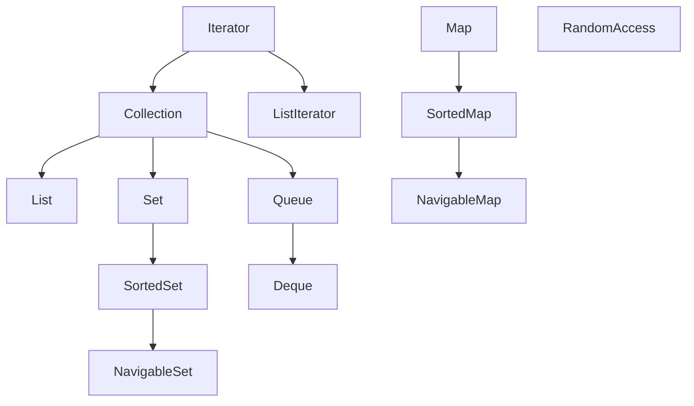

# 第9章 集合

## Java 集合框架

Java 最初的版本只为最常用的数据结构提供了很少的一组类： `Vector`、`Stack` 、`Hashtable` 、`BitSet` `与Enumeration` 接口。其中的`Enumeration` 接口提供了一种用于访问任意容器中各个元素的抽象机制.

#### 集合接口与实现分离

与现代的数据结构类库的常见做法一样， Java 集合类库也将接口（interface）与实现（implementation）分离。

队列接口的最简形式可能类似下面这样：

```java
public interface Queue<E> {
    void add(E element);
    E remove();
    int size();
}
```

队列通常有两种实现方式： 一种是使用循环数组；另一种是使用链表。

```java
public class CircularArrayQueue<E> implements Queue<E> {
    private int head;
    private int tail;
    CircularArrayQueue(int capacity) { ... }
}
```

```java
public class LinkedListQueue<E> implements Queue<E> {
	private Link head;
    private Link tail;
}
```

#### `Collection`接口

集合类的基本接口是Collection 接口。这个接口有两个基本方法：

```java
public interface Collection<E> {
    // 向集合中添加元素
    boolean add(E element);
    // 返回一个实现了Iterator接口的对象。可以使用这个迭代器对象依次访问集合中的元素
    Iterator<E> iterator();
}
```

#### 迭代器

`Iterator`接口包含4 个方法：

```java
public interface Iterator<E> {
    // 逐个访问
    E next();
    // 判断是否含下一个元素
    boolean hasNext();
    void remove();
    default void forEachRemaining(Consumer<? super E> action);
}
```

```java
ArrayList<Integer> list = new ArrayList<>();
for (int i = 1; i <= 10; i++) {
	list.add(i);
}
Iterator<Integer> iterator = list.iterator();
while (iterator.hasNext()) {
	System.out.println(iterator.next());
}
list.forEach(System.out::println);
```

更重要的是， `next` 方法和`remove` 方法调用之间存在依赖性。如果调用`remove` 之前没有调用`next `， 将是不合法的。如果这样做，将会抛出一个`IllegalStateException` 异常。

```java
iterator.next();
iterator.remove();
iterator.next();
iterator.remove();
list.forEach(System.out::println);
// 3 ... 10
```

#### 泛型的实用方法

- `int size()`
- `boolean isEmpty()`
- `boolean contains(Object obj)`
- `boolean containsAll(Collection<?> c)`
- `boolean addAll(Collection<? extends E> from)`
- `boolean remove(Object obj)`
- `boolean removeAll(Collection<?> c)`
- `void clear()`
- `boolean retainAll(Collection<?> other)`
- `Object[] toArray(T[] arrayToFill)`

##  集合框架中的接口

集合有两个基本接口： `Collection`和`Map`。衍生接口如下



### 具体集合

### 链表

```java
var staff = new LinkedList<String>();
staff.add("Anny");
staff.add("Bob");
staff.add("Cart");
Iterator<String> iter = staff.iterator();
String first = iter.next();
String second = iter.next();
// 删除第三个
iter.remove();
```

链表与泛型集合之间有一个重要的区别。链表是一个有序集合（ordered collection），每个对象的位置十分重要。

所以这种依赖于位置的`add `方法将由迭代器负责。只有对自然有序的集合使用迭代器添加元素才有实际意义。例如，
下一节将要讨论的集（set）数据类型中，元素是完全无序的。因此， `Iterator `接口中没有`add`方法。实际上，集合类库提供了一个子接口`ListIterator`，其中包含`add`方法：

```java
interface ListIterator<E> extends Iterator<E> {
    // 它假定add 操作总会改变链表，故返回void而非boolean
    void add(E element);
}
```

```java
ListIterator<String> iter = staff.listIterator();
iter.next();
iter.add("Dony");
for (var s : staff) {
    System.out.println(s);
}
```

为了避免发生并发修改异常，请遵循这样一个简单的规则： 可以根据需要为一个集合关联多个迭代器，前提是这些迭代器只能读取集合。或者，可以再关联一个能同时读写的迭代器。

> `get`方法做了一个微小的优化：如果索引大于等于`size() / 2` ，就从列表尾端开始搜索元素。

列表迭代器接口还有一个方法，可以告诉你当前位置的索引。实际上，从概念上讲，由于Java 迭代器指向两个元素之间的位置，所以可以有两个索引： `nextIndex` 方法返回下一次调用`next`方法时所返回元素的整数索引；`previousIndex` 方法返回下一次调用`previous`方法时所返回元素的整数索引。`list.listiterator(n)` 将返回一个迭代器，这个迭代器指向索引为`n`的元素前面的位置。

### 数组列表

对于一个经验丰富的Java 程序员来说，在需要动态数组时，可能会使用`Vector`类。 `Vector`类的所有方法都是同步的。可以安全地从两个线程访问一个`Vector`对象。但是，如果只从一个线程访问`Vector`（这种情况更为常见），代码就会在同步操作上白白浪费大量的时间。而与之不同， `ArrayList` 方法不是同步的，因此，建议在不需要同步时使用`ArrayList`。

### 散列集

散列表为每个对象计算一个整数，称为散列码（hash code） 。散列码是由对象的实例字段得出的一个整数。

在Java 中，散列表用链表数组实现。每个列表被称为桶（bucket） 。要想
查找表中对象的位置，就要先计算它的散列码，然后与桶的总数取余，所得到的结果就是保存这个元素的桶的索引。

有时候会遇到桶已经被填充的情况。这种现象被称为散列冲突（hash collision） 。这时，需要将新对象与桶中的所有对象进行比较，查看这个对象是否已经存在。如果散列码合理地随机分布，桶的数目也足够大，需要比较的次数就会很少。

如果大致知道最终会有多少个元素要插入到散列表中， 就可以设置桶数。通常，将桶数设置为预计元素个数的75% ～ 150%。有些研究人员认为：最好将桶数设置为一个素数，以防止键的聚集。

的集。可以用`add` 方法添加元素。`contains` 方法已经被重新定义，用来快速查找某个元素是否已经在集中。它只查看一个桶中的元素，而不必查看集合中的所有元素。

```java
public class SetTest {
    public static void main(String[] args) {
        var words = new HashSet<String>();
        long totalTime = 0;

        try (var in = new Scanner(System.in)) {
            while (in.hasNext()) {
                String word = in.next();
                long callTime = System.currentTimeMillis();
                words.add(word);
                callTime = System.currentTimeMillis() - callTime;
                totalTime += callTime;
            }
        }

        Iterator<String> iter = words.iterator();
        for (int i = 1; i <= 20 && iter.hasNext(); i++) {
            System.out.println(iter.next());
        }
        System.out.println(". . .");
        System.out.println(words.size() + " distinct words. " + totalTime + " milliseconds.");
    }
}
```

### 树集

TreeSet 类与散列集十分类似，不过，它比散列集有所改进。树集是一个有序集合（sorted collection） 。可以以任意顺序将元素插入到集合中。在对集合进行遍历时，值将自动地按照排序后的顺序呈现。

```java
TreeSet<String> sorter = new TreeSet<>();
sorter.add("Bob");
sorter.add("Alice");
sorter.add("Carter");
sorter.forEach(System.out::println);
```

将一个元素添加到树中要比添加到散列表中慢，但是，与检查数组或链表中的重复元素相比，使用树会快很多。如果树中包含n 个元素，查找新元素的正确位置平均需要log2n 次比较。

```java
public class TreeTest {
    public static void main(String[] args) {
        TreeSet<Item> sorter = new TreeSet<>();
        sorter.add(new Item("Toster", 1234));
        sorter.add(new Item("Widget", 4567));
        sorter.add(new Item("Moderm", 9912));
        System.out.println(sorter);

        var sortedByDescription = new TreeSet<Item>(Comparator.comparing(Item::getDescription));
        sortedByDescription.addAll(sorter);
        System.out.println(sortedByDescription);
    }
}

class Item implements Comparable<Item> {
    private String description;
    private int partNumber;

    /**
     * Constructs an item.
     * @param aDescription the item's description
     * @param aPartNumber the item's part number
     */
    public Item(String aDescription, int aPartNumber) {
        description = aDescription;
        partNumber = aPartNumber;
    }

    /**
     * Gets the description of this item.
     * @return the description
     */
    public String getDescription()
    {
        return description;
    }

    public String toString() {
        return "[description=" + description + ", partNumber=" + partNumber + "]";
    }

    public boolean equals(Object otherObject) {
        if (this == otherObject) {
            return true;
        }
        if (otherObject == null) {
            return false;
        }
        if (getClass() != otherObject.getClass()) {
            return false;
        }
        var other = (Item) otherObject;
        return Objects.equals(description, other.description) && partNumber == other.partNumber;
    }

    public int hashCode() {
        return Objects.hash(description, partNumber);
    }

    public int compareTo(Item other) {
        int diff = Integer.compare(partNumber, other.partNumber);
        return diff != 0 ? diff : description.compareTo(other.description);
    }
}
```

```
[[description=Toster, partNumber=1234], [description=Widget, partNumber=4567], [description=Moderm, partNumber=9912]]

[[description=Moderm, partNumber=9912], [description=Toster, partNumber=1234], [description=Widget, partNumber=4567]]
```

### 优先队列

优先队列（priority queue） 中的元素可以按照任意的顺序插入，但会按照有序的顺序进行检索。

与`TreeSet` 一样，优先队列既可以保存实现了`Camparable` 接口的类对象，也可以保存构造器中提供的`Comparator`对象。

优先队列的典型用法是任务调度。每一个任务有一个优先级，任务以随机顺序添加到队列中。每当启动一个新的任务时，都将优先级最高的任务从队列中删除。

```java
var pq = new PriorityQueue<LocalDate>();
pq.add(LocalDate.of(1996, 12, 9));
pq.add(LocalDate.of(1815, 1, 2));
pq.add(LocalDate.of(1983, 6, 22));
pq.add(LocalDate.of(1910, 6, 22));

for (LocalDate date : pq) {
    System.out.println(date);
}
while (!pq.isEmpty()) {
    System.out.println(pq.remove());
}
```

## 映射

### 基本映射操作

Java 类库为映射提供了两个通用的实现： `HashMap` 和`TreeMap`。这两个类都实现了`Map` 接口。

与集一样， 散列稍微快一些， 如果不需要按照有序的顺序访问键，最好选择散列映射。

每当往映射中添加一个对象时，必须同时提供一个键。

如果映射中没有存储与给定键对应的信息， `get` 将返回`null` 。
`null `返回值可能并不方便。有时对应没有出现在映射中的键，可以使用一个好的默认值。然后使用`getOrDefault` 方法。

```java
HashMap<String, Integer> staff = new HashMap<>(10);
staff.put("123", 98);
staff.put("456", 97);
staff.put("981", 56);
staff.put("345", 72);

System.out.println(staff);
staff.remove("123");
System.out.println(staff.get("123"));
int score = staff.getOrDefault("222", 100);
System.out.println(score);
staff.forEach((k, v) ->
              System.out.println("key=" + k + ", value=" + v));
```

### 更新映射条目

处理映射的一个难点就是更新映射条目。正常情况下，可以得到与一个键关联的原值，完成更新，再放回更新后的值。不过，必须考虑一个特殊情况， 即键第一次出现。

```java
counts.put(word, counts.get(word) + 1);
```

这是可以的，不过有一种情况除外：就是第一次看到`word` 时。在这种情况下， `get`会返回`null` ，因此会出现一个`NullPointerException` 异常。

一种简单的补救是使用`getOrDefault` 方法：

```java
counts.put(word, counts.getOrDefault(word, 0) + 1);
```

另一种方法是首先调用`putIfAbsent` 方法。只有当键原先存在（或者映射到`null` ） 时才会放入一个值。

```java
staff.putIfAbsent("123", 98);
```

### 映射视图

集合框架不认为映射本身是一个集合。（其他数据结构框架认为映射是一个键／ 值对集合，或者是按键索引的值集合）不过，可以得到映射的视图（view） 一一这是实现了`Collection` 接口或某个子接口的对象。

有3 种视图：键集、值集合（不是一个集） 以及键／ 值对集。键和键／ 值对可以构成一个集，因为映射中一个键只能有一个副本。下面的方法：

```java
Set<K> keySet();
Collection<V> values();
Set<Map.Entry<K, V>> entrySet();
```

需要说明的是， `keySet` 不是`HashSet` 或`TreeSet` ，而是实现了`Set `接口的另外某个类的对象。
`Set` 接口扩展了`Collection` 接口。因此，可以像使用任何集合一样使用`keySet `。

遍历键值对：

```java
for (Map.Entry<String, Integer> entry : staff.entrySet()) {
    String k = entry.getKey();
    Integer v = entry.getValue();
    System.out.println(k + ": " + v);
}
```

如果在键集视图上调用迭代器的`remove` 方法，实际上会从映射中删除这个键和与它关联的值。不过，不能向键集视图中添加元素。另外，如果添加一个键而没有同时添加值也是没有意义的。如果试图调用`add` 方法，它会抛出一个`UnsupportedOperationException`。

### 弱散列映射

垃圾回收器会跟踪活动的对象。只要映射对象是活动的，其中的所有桶也是活动的，它们不能被回收。因此，需要由程序负责从长期存活的映射表中删除那些无用的值。或者，你可以使用`WeakHashMap`。当

`WeakHashMap` 使用弱引用（weak references）保存键。`WeakReference` 对象将包含另一个对象的引用，在这里，就是一个散列表键。对于这种类型的对象，垃圾回收器采用一种特有的方式进行处理。正常情况下，如果垃圾回收器发现某个特定的对象已经没有他人引用了，就将其回收。。然而，如果某个对象只能由`WeakReference`引用，垃圾回收器也会将其回收， 但会将引用这个对象的弱引用放入一个队列。`WeakHashMap` 将周期性地检查队列，以便找出新添加的弱引用。一个弱引用进人队列意味着这个键不再被他人使用，并且已经回收。于是， `WeakHashMap`将删除相关联的映射条目。

```java
WeakHashMap<Integer, Integer> weakMap = new WeakHashMap<>(10);
weakMap.put(1, 2);
weakMap.put(2, 3);
weakMap.forEach((k, v) ->
                System.out.println(k + ": " + v));
```

### 链接散列集与映射

`LinkedHashSet` 和`LinkedHashMap` 类会记住插人元素项的顺序。这样就可以避免散列表中的项看起来顺序是随机的。

```java
LinkedHashMap<Integer, Integer> map = new LinkedHashMap<>();
map.put(1, 2);
map.put(3, 4);
map.put(2, 3);

Iterator<Integer> iterator = map.keySet().iterator();
while (iterator.hasNext()) {
    int k = iterator.next();
    System.out.println(k + ": " + map.get(k));
}
```

```
1: 2
3: 4
2: 3
```

链接散列映射可以使用访问顺序而不是插入顺序来迭代处理映射条目。每次调用`get` 或`put` 时，受到影响的项将从当前的位置删除， 并放到项链表的尾部（只影响项在链表中的位置，而散列表的桶不会受影响。映射条目总是在键散列码对应的桶中） 。

### 枚举集和映射

`EnumSet` 是一个枚举类型元素集的高效实现。由于枚举类型只有有限个实例，所以`EnumSet`内部用位序列实现。如果对应的值在集中，则相应的位被置为1。

```java
enum Weekday {
            MONDAY, TUESDAY, WEDNESDAY, THURSDAY, 
            FRIDAY, STATUARY, SUNDAY 
        };
EnumSet<Weekday> always = EnumSet.allOf(Weekday.class);
EnumSet<Weekday> never = EnumSet.noneOf(Weekday.class);
EnumSet<Weekday> workday = EnumSet.range(Weekday.MONDAY, Weekday.FRIDAY);
EnumSet<Weekday> mwf = EnumSet.of(Weekday.FRIDAY, Weekday.MONDAY, Weekday.STATUARY);
```

`EnumMap` 是一个键类型为枚举类型的映射。它可以直接且高效地实现为一个值数组。需要在构造器中指定键类型：

```java
var personInCharge = new EnumMap<Weekday, Integer>(Weekday.class);
personInCharge.put(Weekday.MONDAY, 1);
personInCharge.put(Weekday.FRIDAY, 5);
```

### 标识散列映射

类`IdentityHashMap` 有特殊的用途。在这个类中，键的散列值不是用`hashCode`函数计算的，而是用`System.identityHashCode` 方法计算。这是`Object.hashCode` 根据对象的内存地址计算散列码时所使用的方法。而且，在对两个对象进行比较时， `IdentityHashMap` 类使用`==`，而不使用`equals`。

也就是说， 不同的键对象即使内容相同，也被视为不同的对象。在实现对象遍历算法（如对象串行化）时，这个类非常有用，可以用来跟踪哪些对象已经遍历过。

## 视图和包装类

### 小集合

Java 9 引入了一些静态方法，可以生成给定元素的集或列表，以及给定键／值对的映射。

```java
List<String> names = List.of("Peter", "Paul", "Mary");
Set<Integer> numbers = Set.of(2, 3, 4);

Map<String, Integer> scores = Map.of("Peter", 2, "Paul", 3, "Mary", 5);
```

对于Map 接口，则无法提供一个参数可变的版本，因为参数类型会在键和值类型之间交替。不过它有一个静态方法`ofEntries` ，能接受任意多个`Map.Entry<K, V>`对象。

```java
import static java.util.Map.*;

Map<String, Integer> scores = ofEntries(
                entry("Peter", 2),
                entry("Paul", 3),
                entry("Mary", 5));

scores.forEach((k, v) ->
	System.out.println(k + ":" + v));
```

这些集合对象是不可修改的。如果试图改变它们的内容，会导致一个`UnsupportedOperationException`异常。

如果需要一个可更改的集合，可以把这个不可修改的集合传递到构造器：

```java
var names = new ArrayList<>(List.of("Peter", "Paul", "Mary"));
```

以下方法调用

```java
List<String> settings = Collections.nCopies(100, "DEFAULT");
```

这样存储开销很小。对象只存储一次。

### 子范围

可以为很多集合建立子范围（subrange）视图。

```java
List<String> names = new ArrayList<>(List.of("Tim", "Mary", "John", "Wendy"));
// 不包括endIndex，下标从0开始
List<String> subNames = names.subList(1, 3);
subNames.forEach(System.out::println);
subNames.clear();
// 1, 2被删除
names.forEach(System.out::println);
```

对于有序集和映射，可以使用排序顺序而不是元素位置建立子范围。`SortedSet`接口声明了3 个方法：

```java
SortedSet<E> subSet(E from, E to)
SortedSet<E> headSet(E to)
SortedSet<E> tail Seit (E from)
```

这些方法将返回大于等于`from` 且小于`to` 的所有元素构成的子集。有序映射也有类似的方法：

```java
SortedMap<K, V> subMap(K from, K to)
SortedMap<K, V> headMap(K to)
SortedMap<K, V> tailMap(K from)
```

Java 6 引人的`NavigableSet` 接口允许更多地控制这些子范围操作。可以指定是否包括边界：

```java
NavigableSet<E> subSet(E from, boolean fromInclusive, E to, boolean toInclusive)
NavigableSet<E> headSet(E to, boolean toInclusive)
NavigableSet<E> tailSet(E from, boolean fromInclusive)
```

### 不可修改的视图

`Collections` 类还有几个方法，可以生成集合的不可修改视图（unmodifiable view）。如果发现试图对集合进行修改，就抛出一个异常，集合仍保持不变。

可以使用下面8 个方法来获得不可修改视图：

```java
Collections.unmodifiableCollection
```

每个方法都定义处理一个接口。例如， `Collections.unmodifiableList` 处理`ArrayList` 、`LinkedList`
或者实现了`List` 接口的其他类。

`Collections.unmodifiableList` 方法将返回一个实现`List` 接口的类对象。

```java
LinkedList<String> list = new LinkedList<>();
list.add("Hello");
list.add("World");
List<String> readList = Collections.unmodifiableList(list);
```

### 同步视图

如果从多个线程访问集合，就必须确保集合不会被意外地破坏。

```java
var map = Collections.synchronizedMap(new HashMap<String, Employee<>());
```

### 检查型视图

“检查型”视图用来对泛型类型可能出现的问题提供调试支持。

```java
ArrayList<String> strings = new ArrayList<>();
ArrayList rawList = strings;
rawList.add(new Date());
```

这个错误的`add`命令在运行时检测不到。实际上，只有当另一部分代码调用`get`方法，并将结果强制转换为`String` 时，才会出现一个类强制转换异常。

```java
ArrayList<String> strings = new ArrayList<>();
List<String> safeStrings = Collections.checkedList(strings, String.class);
// 报错
ArrayList rawList = safeStrings;
```

### 关于可选操作的说明

通常，视图有一些限制，可能只读，可能无法改变大小，或者可能只支持删除而不支持插入（如映射的键视图） 。如果试图执行不恰当的操作，受限制的视图就会抛出一个`UnsupportedOperationException` 。

一个更好的解决方案是为只读视图和不能改变集合大小的视图建立单独的接口。不过，这将会使接口的数量增至原来的三倍，这让类库设计者无法受。

## 算法

### 为什么使用泛型算法

泛型集合接口有一个很大的优点，即算法只需要实现一次。

```java
public static <T extends Comparable> T max(Collection<T> c) {
    if (c.isEmpty()) {
        throw new NoSuchElementException();
    }
    Iterator<T> iterator = c.iterator();
    T largest = iterator.next();
    while (iterator.hasNext()) {
        T next = iterator.next();
        if (largest.compareTo(next) < 0) {
            largest = next;
        }
    }
    return largest;
}
```

### 排序和混排

`sort`方法假设列表元素实现`Comparable`接口。

```java
List<Employee> staff = new ArrayList<>();
staff.add(new Employee(123, "Day", 10232));
staff.add(new Employee(124, "Sed", 1346));
staff.add(new Employee(125, "Wed", 2345));

staff.sort(Comparator.comparingDouble(Employee::getSalary));
staff.forEach(System.out::println);
```

```java
chap13.Employee[id=124,name=Sed,salary=1346.0]
chap13.Employee[id=125,name=Wed,salary=2345.0]
chap13.Employee[id=123,name=Day,salary=10232.0]
```

集合类库中使用的排序算法比快速排序要慢一些，快速排序（QuickSort）是通用排序算法的传统选择。但是，归并排序有一个主要的优点： 归并排序是稳定的，也就是说，它不会改变相等元素的顺序。

`Collections` 类有一个算法`shuffle` ， 其功能与排序刚好相反，它会随机地混排列表中元素的顺序。

如果提供的列表没有实现`RandomAccess`接口， shuffle 方法会将元素复制到数组中，然后打乱数组元素的顺序，最后再将打乱顺序后的元素复制回列表。

```java
List<Integer> list = new ArrayList<>(List.of(1, 2, 3, 4, 5, 6, 7, 8, 9, 10));
Collections.shuffle(list);
list.forEach(System.out::println);
```

> `Collections`则是集合类的一个工具类/帮助类，其中提供了一系列静态方法，用于对集合中元素进行排序、搜索以及线程安全等各种操作。
>
> `Collection`是各种集合接口的父接口，继承它的接口主要有Set和List，提供了关于集合的一些操作，如删除，插入，判断一个元素是否是其成员，遍历等。

### 二分查找

`Collections`类的`binarySearch`方法实现了这个算法。注意，集合必须是有序的，否则算法会返回错误的答案。

```java
i = Collections.bianrySearch(c, element);
i = Collection.binarySearch(c, element, comparator);
```

### 简单算法

```java
List<String> words = new ArrayList<>();
words.add("Hello");
words.add("Hi");
words.add("World");
words.add("yep");
words.removeIf(w -> w.length() <= 3);
words.replaceAll(String::toUpperCase);
words.forEach(System.out::println);
```

```
HELLO
WORLD
```

### 批操作

很多操作会“成批”复制或删除元素。

- `removeAll`
- `retainAll`
- `addAll`
- `clear`

### 集合与数组的转换

```java
String[] values = (String[]) staff.toArray(); // ERROR
```

提供一个指定类型而且长度为0 的数组。这样一来，返回的数组就会创建为相同的数纽类型：

```java
String[] values = {"hello", "word", "orange", "apple"};
var words = new ArrayList<String>(List.of(values));
String[] values2 = words.toArray(new String[0]);
```

## 遗留的集合

### `HashTable`类

经典的`Hashtable` 类与`HashMap `类的作用一样， 实际上，接口也基本相同。与`Vector`类的方法一样， `Hashtable` 方法也是同步的。如

### 枚举

遗留的集合使用`Enumeration`接口遍历元素序列。`Enumeration `接口有两个方法，即`hasMoreElements`和`nextElements`。这两个方法完全类似于`Iterator` 接口的`hasNext`方法和`next`方法。

### 属性映射

属性映射（property map） 是一个特殊类型的映射结构。它有下面3 个特性：

- 键与值都是字符串。

- 这个映射可以很容易地保存到文件以及从文件加载。

- 有一个二级表存放默认值。

实现属性映射的Java 平台类名为`Properties`。属性映射对于指定程序的配置选项很有用。

```java
var settings = new Properties();
settings.setProperty("width", "200.0");
settings.setProperty("filename", "/home/cay/books");
FileOutputStream out = new FileOutputStream("hello.txt");
settings.store(out, "Program Properties");
FileInputStream in = new FileInputStream("hello.txt");
settings.load(in);
```

`System.getProperties` 方法会生成`Properties` 对象描述系统信息。

属性是没有层次结构的简单表格。通常会用类似`window.main.color` 、`window.main.title` 等引入一个假想的层次结构。不过`Properties`类没有方法来帮助组织这样一个层次结构。

### 栈

标准类库中就包含了`Stack` 类，其中有大家熟悉的`push`方法和`pop`方法。
但是， `Stack`类扩展了`Vector` 类，从理论角度看， `Vector`类并不太令人满意，你甚至可以使用并非战操作的`insert`和`remove` 方法在任何地方插入和删除值，而不只是在找顶。

- `E peek()`

  返回枝顶元素，但不弹出。如果找为空，不要调用这个方法。

### 位集

Java 平台的BitSet 类用于存储一个位序列。如果需要高效地存储位序列（例如，标志），就可以使用位集。由于位集将位包装在字节里，所以使用位集要比使用`Boolean` 对象的`ArrayList` 高效得多。

如果第`i`位处于“开”状态，就返回`true` ； 否则返回`false`。

```java
BitSet buckOfBits = new BitSet();
buckOfBits.set(1);
// true
System.out.println(buckOfBits.get(1));
```

- `void or(BitSet set)`
- `void and(BitSet set)`
- `void xor(BitSet set)`