# 第11章 Swing用户界面组件

## 事件处理基础

任何支持GUI的操作环境都要不断地监视敲击键盘或点击鼠标这样的事件。操作环境将这些事件报告给正在运行的应用程序。

在AWT所知的事件范围内，完全可以控制事件从事件源（event source）到事件监听器（event listener）的传递过程， 并将任何对象指派给事件监听器。不过事实上，应该选择一个能够便于响应事件的对象。这种事件委托模型（event delegation model）与Visual Basic那种预定义监听器模型比较起来更加灵活。

综上所述，下面给出AWT事件处理机制的概要：

- 监听器对象是一个实现了特定监听器接口（listener interface）的类的实例。
- 事件源是一个能够注册监听器对象井发送事件对象的对象。
- 当事件发生时，事件源将事件对象传递给所有注册的监听器。
- 监听器对象将利用事件对象中的信息决定如何对事件做出晌应。

为了实现`ActionListener`接口，监听器类必须有一个被称为`actionPerformed`的方法，该方法接收一个`ActionEvent`对象参数。

```java
class MyListener implements ActionListener {
	public void actionPerformed(ActionEvent e) {
        // 事件处理
        ...
    }
}
```

只要用户激活事件源， 事件源对象就会创建一个`ActionEvent`对象，然后调用`listener.actionPerformed(event)`传递事件对象。可以可将多个监听器对象添加到一个像按钮这样的事件源中。

### 实例：处理按钮点击事件

```java
public class ButtonTest {
    public static void main(String[] args) {
        EventQueue.invokeLater(new Runnable() {
            @Override
            public void run() {
                ButtonFrame frame = new ButtonFrame();
                frame.setDefaultCloseOperation(JFrame.EXIT_ON_CLOSE);
                frame.setVisible(true);
            }
        });
    }
}

class ButtonFrame extends JFrame {
    public ButtonFrame() {
        setTitle("ButtonTest");
        setSize(DEFAULT_WIDTH, DEFAULT_HEIGHT);

        JButton yellowButton = new JButton("Yellow");
        JButton blueButton = new JButton("Blue");
        JButton redButton = new JButton("Red");
        buttonPanel = new JPanel();
        buttonPanel.add(yellowButton);
        buttonPanel.add(blueButton);
        buttonPanel.add(redButton);
        add(buttonPanel);
        ColorAction yellowAction = new ColorAction(Color.YELLOW);
        ColorAction blueAction = new ColorAction(Color.BLUE);
        ColorAction redAction = new ColorAction(Color.RED);
        yellowButton.addActionListener(yellowAction);
        blueButton.addActionListener(blueAction);
        redButton.addActionListener(redAction);
    }

    private class ColorAction implements ActionListener {
        public ColorAction(Color c) {
            backgroundColor = c;
        }
        public void actionPerformed(ActionEvent event) {
            buttonPanel.setBackground(backgroundColor);
        }
        private Color backgroundColor;
    }
    private JPanel buttonPanel;
    public static final int DEFAULT_WIDTH = 300;
    public static final int DEFAULT_HEIGHT = 200;
}
```


### 建议使用内部类

在前面列举的示例中，三个按钮共享同一个监听器类。

可以设计一个辅助方法简化按钮处理的操作：

```java
public void makeButton(String name, Color backgroundColor) {
	JButton button = new JButton(name);
	buttonPanel.add(button);
	ColorAction action = new ColorAction(backgroundColor);
	button.addActionListener(button);
}
makeButton("yellow", Color.YELLOW);
makeButton("blue", Color.BLUE);
makeButton("red", Color.RED);
```

### 创建包含一个方法调用的监听器

在Java SE 1.4中引入了不用内部类来定义简单的事件监听器的机制。例如，假设有一个标签为`Load`的按钮，它的事件处理只包含下面一个方法调用：

```java
frame.loadData();
```

当然可使用匿名内部类：

```java
loadButton.addActionListener(new ActionListener() {
    public void actionPerformed(ActionEvent e) {
        frame.loadData();
    }
});
```

`EventHandler`类可以使用下列调用，自动地创建这样一个监听器：

```java
loadButton.addActionListner(
	EventHandler.create(ActionListener.class, frame, "loadData"));
```

如果事件监听器调用的方法只包含一个从事件处理器继承来的参数，就可以使用另外一种形式的`create`方法。例如，调用：

```java
new ActionListener() {
	public void actionPerformed(ActionEvent event) {
        frame.loadData(((JTextField) event.getSource()).getText());
    }
}
EventHandler.create(ActionListener.class, frame, "loadData", "source.text"); // 需要将属性source和text的名字转换成方法调用getSource和getText
```

### 实例：改变观感

在默认情况下， Swing程序使用Metal观感，可以采用两种方式改变观感。第一种方式是在Java安装的子目录`jre/lib`下有一个文件`swing.properties`。在这个文件中，将属性`swing.defaultlaf`设置为所希望的观感类名。例如，

```java
swing.defaultlaf = com.sum.java.swing.plat.motif.MotifLookAndFeel;
```

> 鉴于版权的原因， Windows和Mac的观感包，只与Windows和Mac版本的Java运行时环境一起发布。

第二种方式是动态地改变观感。这需要调用静态的`UIManager.setLookAndFeel`方法。并提供所想要的观感类名，然后再调用静态方法`SwingUtilities.updateComponentTreeUI`来刷新全部的组件集。

```java
String modifPlaf = "com.sun.java.swing.plaf.motif.MotifLookAndFeel";
private String windowsPlaf = "com.sun.java.swing.plaf.windows.WindowsLookAndFeel";
try {
    UIManager.setLookAtFeel(windowsPlaf);
    SwingUtilities.updateComponentTreeUI(panel); // 刷新全部组件集
} catch (Exception e) {
    e.printStackTrace();
}
```

为了列举安装的所有观感实现，可以调用:

```java
UIManager.LookAndFeelInfo[] infos = UIManager.getInstalledLookAndFeels();
String name = infos[i].getName();
String className = infos[i].getClassName();
```

```java
public class PlafTest {
    public static void main(String[] args) {
        EventQueue.invokeLater(new Runnable() {
            @Override
            public void run() {
                PlafFrame frame = new PlafFrame();
                frame.setDefaultCloseOperation(JFrame.EXIT_ON_CLOSE);
                frame.setVisible(true);
            }
        });
    }
}

class PlafFrame extends JFrame {
    public PlafFrame() {
        setTitle("PlafTest");
        setSize(DEFAULT_WIDTH, DEFAULT_HEIGHT);
        buttonPanel = new JPanel();
        UIManager.LookAndFeelInfo[] infos = UIManager.getInstalledLookAndFeels();
        for (UIManager.LookAndFeelInfo info : infos)
            makeButton(info.getName(), info.getClassName());
        add(buttonPanel);
    }
    void makeButton(String name, final String plafName) {
        JButton button = new JButton(name);
        buttonPanel.add(button);

        button.addActionListener(new ActionListener() {
            @Override
            public void actionPerformed(ActionEvent e) {
                try {
                    UIManager.setLookAndFeel(plafName);
                    System.out.println(plafName);
                    SwingUtilities.updateComponentTreeUI(PlafFrame.this);
                } catch (Exception ex) {
                    ex.printStackTrace();
                }
            }
        });
    }
    private JPanel buttonPanel;
    public static final int DEFAULT_WIDTH = 300;
    public static final int DEFAULT_HEIGHT = 200;
}
```

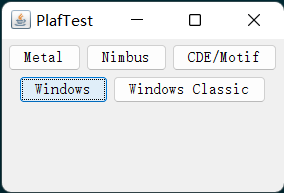

### 适配器

当程序用户试图关闭一个框架窗口时， `JFrame`对象就是`Window Event`的事件源。如果希望捕获这个事件，就必须有一个合适的监听器对象，并将它添加到框架的窗口监听器列表中。

在`WindowListener`接口中包含7个方法。当发生窗口事件时，框架将调用这些方法响应7个不同的事件。

> 是在Windows下，通常将iconified称为minimized。

```java
public interface WindowListener {
    void windowOpened(WindowEvent e);
    void windowClosing(WindowEvent e);
    void windowClosed(WindowEvent e);
    void windowIconified(WindowEvent e);
    void windowDeiconified(WindowEvent e);
  	void windowActivate(WindowEvent e);
    void windowDeactivate(WindowEvent e);
}
```

> 了能够查看窗口是否被最大化，需要安装`WindowStateListener`

鉴于简化的目的，每个含有多个方法的AWT监听器接口都配有一个过配器（adapter）类，这个类实现了接口中的所有方法，但每个方法没有做任何事情。这意味着适配器类自动地满足了Java实现相关监听器接口的技术需求。可以通过扩展适配器类来指定对某些事件的响应动作，而不必实现接口中的每个方法。

```java
class Terminator extends WindowAdapter {
    public void windowClosing(WindowEvent e) {
        if (user agrees) 
            System.exit(0);
    }
} 
WindowListner listener = new Terminator();
frame.addWindowListener(listener);
```

可进行进一步简化：

```java
frame.addWindowListener(new 
	WindowAdapter() {
		public void windowClosing(WindowEvent e) {
		if (user argees) 
			System.exit(0);
		}
	});
```

## 动作

通常，激活一个命令可以有多种方式。用户可以通过菜单、击键或工具栏上的按钮选择特定的功能。

Swing包提供了一种非常实用的机制来封装命令，井将它们连接到多个事件源，这就是`Action`接口。一个动作是一个封装下列内容的对象：

- 命令的说明
- 执行命令所需要的参数

`Action`接口包含下列方法：

```java
void actionPerformed(ActionEvent event);
void setEnable(boolean b);
boolean isEnable();
void putValues(String key, Object value);
Object getValue(String key);
void addPropertyChangeListener(PropertyChangeListener listener);
void removePropertyChangeListener(PropertyChangeListener listener);
```

`putValue`和`getvalue`方法允许存储和检索动作对象中的任意名／值。有两个重要的预定义字符串： `Action.NAME`和`Action.SMALL_ICON` ，用于将动作的名字和图标存储到一个动作对象中：

```java
action.putValue(Acton.Name, "Blue");
action.putValue(Action.SMALL_ICON, new ImageIcon("blue-ball.gif"));
```

`Action`接口的最后两个方法能够让其他对象在动作对象的属性发生变化时得到通告，尤其是菜单或工具栏触发的动作。

`AbstractAction`类实现了这个接口除`actionPerformed`方法之外的所有方法。

```java
public class ColorAction extends AbstractAction {
	public ColorAction(String name, Icon icon, Color c) {
        putValue(Action.NAME, name);
        putValue(Action.SMALL_ICON, icon);
        putValue("color", c);
        putValue(Action.SHORT_DESCRIPTION, "Set panel to" + name.toLowerCase());
    }
    public void actionPerformed(ActionEvent event) {
        Color c = (Color)getValue("color");
        buttonPanel.setBackground(c);
    }
}
```

为了将动作与击键关联起来，首先需要生成`KeyStroke`类对象，它封装了对键的说明。要想生成一个KeyStroke对象，需要调用`KeyStroke`类中的`getKeyStroke`方法：

```java
KeyStroke ctrlBKey = KeyStroke.getKeyStroke("ctrl B");
```

在Java观感中，具有焦点的按钮在按钮文本周围有一个细的矩形边框。用户可以使用TAB键在组件之间移动焦点。当按下SPACE键时，就点击了拥有焦点的按钮。

在实际情况中，并不希望将击键发送给拥有焦点的组件。否则，每个按钮都需要知道如何处理CTRL+Y 、CTRL+B 和CTRL+R这些组合键。

这是一个常见的问题， Swing设计者给出了一种很便捷的解决方案。每个`JComponent`有三个输入映射（imput maps），每一个映射的`KeyStroke`对象都与动作关联。三个输入映射对应着三个不同的条件。

| 标志                                 | 激活动作                                         |
| ------------------------------------ | ------------------------------------------------ |
| `WHEN_FOCUSED`                       | 当这个组件拥有键盘焦点时                         |
| `WHEN_ANCESTOR_OF FOCUSED_COMPONENT` | 当这个组件包含了拥有键盘焦点的组件时             |
| `WHEN_ IN_FOCUSED_ WINDOW`           | 当这个组件被包含在一个拥有键维焦点组件的窗口中时 |

可以使用`getInputMap`方能从组件中得到输入映射。例如：

```java
InputMap imap = panel.getInputMap(JComponent.WHEN_FOUCUS); // 在当前组件拥有键盘焦点时会查看这个映射
```

用同一个动作响应按钮、菜单项或击键的方式：

- 实现一个扩展于`AbstractAction`类，多个相关的动作可使用同一个类。
- 构造一个动作对象。
- 使用动作对象创建按钮或菜单项。构造器将从动作对象中读取标签文本和图标。
- 为了能够通过击键触发动作，必须额外地执行几步操作。首先定位顶层窗口组件，例如，包含所有其他组件的面板。
- 将得到顶层组件`WHEN_ANCESTOR_OF_FOCUS_COMPONENT`输入映射。为需要的击键创建一个`KeyStrike`对象。创建一个描述动作字符串这样的动作键对象。将（击键，动作键）对添加到输入映射中。
- 最后，得到顶层组件的动作映射。将（动作键，动作对象）添加到映射中。

```java
public class ActionTest {
    public static void main(String[] args) {
        EventQueue.invokeLater(() -> {
            ActionFrame frame = new ActionFrame();
            frame.setTitle("ActionTest");
            frame.setDefaultCloseOperation(JFrame.EXIT_ON_CLOSE);
            frame.setVisible(true);
        });
    }
}

class ActionFrame extends JFrame {
    private JPanel buttonPanel;
    private static final int DEFAULT_WIDTH = 300;
    private static final int DEFAULT_HEIGHT = 200;
    private String plafName = "com.sun.java.swing.plaf.windows.WindowsLookAndFeel";

    public ActionFrame() {
        setSize(DEFAULT_WIDTH, DEFAULT_HEIGHT);

        buttonPanel = new JPanel();
        try {
            UIManager.setLookAndFeel(plafName);
            SwingUtilities.updateComponentTreeUI(ActionFrame.this);
        } catch (Exception ex) {
            ex.printStackTrace();
        }
        // 构造动作对象
        // 使用动作对象创建按钮
        ColorAction yellowAction = new ColorAction("Yellow", new ImageIcon("img\\yellow-ball.gif"),
                Color.YELLOW);
        ColorAction blueAction = new ColorAction("Blue", new ImageIcon("img\\blue-ball.gif"), Color.BLUE);
        ColorAction redAction = new ColorAction("Red", new ImageIcon("img\\red-ball.gif"), Color.RED);

        buttonPanel.add(new JButton(yellowAction));
        buttonPanel.add(new JButton(blueAction));
        buttonPanel.add(new JButton(redAction));
        add(buttonPanel);

        // 定位顶部窗口组件，将（击键，动作键）添加至输入映像
        // WHEN_ANCESTOR_OF_FOCUSED_COMPONENT 条件意味着当这个组件包含了拥有键盘焦点的组件时会查看这个映射
        InputMap inputMap = buttonPanel.getInputMap(JComponent.WHEN_ANCESTOR_OF_FOCUSED_COMPONENT);
        inputMap.put(KeyStroke.getKeyStroke("ctrl Y"), "panel.yellow");
        inputMap.put(KeyStroke.getKeyStroke("ctrl B"), "panel.blue");
        inputMap.put(KeyStroke.getKeyStroke("ctrl R"), "panel.red");

        // 得到顶层组件的动作映射，将（动作键，动作对象）添加至映像
        ActionMap actionMap = buttonPanel.getActionMap();
        actionMap.put("panel.yellow", yellowAction);
        actionMap.put("panel.blue", blueAction);
        actionMap.put("panel.red", redAction);
    }

    class ColorAction extends AbstractAction {
        public ColorAction(String name, Icon icon, Color c) {
            putValue(Action.NAME, name);
            putValue(Action.SMALL_ICON, icon);
            putValue(Action.SHORT_DESCRIPTION, "Set panel color to " + name.toLowerCase());
            putValue("color", c);
        }

        public void actionPerformed(ActionEvent event) {
            Color color = (Color) getValue("color");
            buttonPanel.setBackground(color);
        }
    }
}
```


## 鼠标事件

如果只希望用户能够点击按钮或菜单，那么就不需要显式地处理鼠标事件。鼠标操作将由用户界面中的各种组件内部处理。

当用户点击鼠标按钮时，将会调用三个监听器方法：鼠标
第一次被按下时调用`mousePressed`， 鼠标被辑放时调用
`mouseReleased`， 最后调用`mouseCiicked`。 如果只对最终的点
击事件感兴趣，就可以忽略前两个方法。

用`MouseEvent`类对象作为参数，调用`getX`和`getY` 方法可以获得鼠标被按下时鼠标指针所在的x和y坐标。要想区分单击、双击和三击，需要使用`getClickCount`方法。

可以使用下列代码检测鼠标右键是否被按下：

```java
if ((event.getModifersEx() & InputEvent.BUTTON3_DOWN_MASK) != 0)
	// code for right click
```

可设置鼠标形状，实现这项操作需要使用`Cursor`类中的`getPredefinedCursor`方法。

- `DEFAULT_CURSOR` 箭头
- `CROSSHAIR_CURSOR` 十字
- `HAND_CURSOR` 手
- `MOVE_CURSOR` 方向十字
- `WAIT_CURSOR` 等待
- `N_RESIZE_CURSOR` 北方向箭头
- ...

```java
public void mouseMoved(MouseEvent event) {
	if (find(event.getPoint()) == null) 
		setCursor(Cursor.getDefaultCursor());
	else 
		setCursor(Cursor.getPredefinedCursor(Cursor.CROSSHAIR_CURSOR));
}
```

> 可以利用`Toolkit`中的`createCustomCursor`时的定义光标类型：
>
> ```java
> Toolkit tk = ToolKit.getDefaultToolkit();
> Image img = tk.getImage("dynamite.gif");
> Cursor dynamiteCursor = tk.createCustomCursor(img, new Point(10, 10), 10), "dynamite stick");
> // 光标的“ 热点” 偏移  描述尤标的字符亭。这个字符串可以用于访问性支持
> ```

还有两个鼠标事件方法：`mouseEntered`和`mouseExited`。这两个方能是在鼠标进入或移出组件时被调用。

```java
public class MouseTest {
    public static void main(String[] args) {
        EventQueue.invokeLater(() -> {
            MouseFrame frame = new MouseFrame();
            frame.setTitle("MouseTest");
            frame.setDefaultCloseOperation(JFrame.EXIT_ON_CLOSE);
            frame.setVisible(true);
        });
    }
}

class MouseFrame extends JFrame {
    public MouseFrame() {
        add(new MouseComponent());
        pack();
    }
}

class MouseComponent extends JComponent {
    private static final int DEFAULT_WIDTH = 300;
    private static final int DEFAULT_HEIGHT = 200;

    private static final int SIDELENGTH = 20;
    private ArrayList<Rectangle2D> squares;
    private Rectangle2D current; // 包含鼠标光标的正方形

    public MouseComponent() {
        squares = new ArrayList<>();
        current = null;

        addMouseListener(new MouseHandler());
        addMouseMotionListener(new MouseMotionHandler());
    }

    public Dimension getPreferredSize() {
        return new Dimension(DEFAULT_WIDTH, DEFAULT_HEIGHT);
    }

    public void paintComponent(Graphics g) {
        Graphics2D g2 = (Graphics2D) g;

        // 绘制方格
        for (Rectangle2D r : squares)
            g2.draw(r);
    }

    // 寻找方形
    public Rectangle2D find(Point2D p) {
        for (Rectangle2D r : squares) {
            if (r.contains(p)) // 方块包含该点
                return r;
        }
        return null;
    }

    // 在集合加入方形
    public void add(Point2D p) {
        double x = p.getX();
        double y = p.getY();

        current = new Rectangle2D.Double(x - SIDELENGTH / 2, y - SIDELENGTH / 2,
                SIDELENGTH, SIDELENGTH);
        squares.add(current);
        repaint(); // 刷新
    }
    // 移除方块
    public void remove(Rectangle2D s) {
        if (s == null)
            return;
        if (s == current)
            current = null;
        squares.remove(s);
        repaint();
    }

    private class MouseHandler extends MouseAdapter {
        public void mousePressed(MouseEvent event) {
            // 添加方块如果光标名不在方块
            current = find(event.getPoint()); // 获取光标位置（二维点）
            if (current == null)
                add(event.getPoint()); // 添加
        }

        public void mouseClicked(MouseEvent event) {
            // 双击删除当前方块
            current = find(event.getPoint()); // 寻找当前位置是否存在方块
            if (current != null && event.getClickCount() >= 2) // 存在且双击
                remove(current);
        }
    }

    private class MouseMotionHandler implements MouseMotionListener {
        public void mouseMoved(MouseEvent event) {
            // 如果鼠标光标位于矩形内，则将其设置为十字准线
            if (find(event.getPoint()) == null)
                setCursor(Cursor.getDefaultCursor());
            else
                setCursor(Cursor.getPredefinedCursor(Cursor.CROSSHAIR_CURSOR));
        }

        public void mouseDragged(MouseEvent event) { // 拖拽鼠标
            if (current != null) {
                int x = event.getX(); // 获取鼠标 x 坐标
                int y = event.getY(); // 获取鼠标 y 坐标

                // 拖拽当前方块到 (x, y)
                current.setFrame(x - SIDELENGTH / 2, y - SIDELENGTH / 2, SIDELENGTH, SIDELENGTH);
                repaint();
            }
        }
    }
}
```


## AWT事件继承层次

所有的事件都是由`java.util`包中的`EventObject`类扩展而来。`EventObject`类有一个子类`AWTEvent` ，它是所有AWT事件类的父类。

在必要的时候，可以对传递给监听器对象的事件对象进行分析。可借助`getSource`和`getActionCommand`方法实现对象分析。

### AWT的语义事件和低级事件

AWT将事件分为低级（low-level）事件和语义（semantic）事件。语义事件是表示用户动作的事件，例如，点击按钮。因此，`ActionEvent`是一种语义事件。低级事件是形成那些事件的事件。在点击按钮肘，包含了按下鼠标、连续移动鼠标、抬起鼠标（只有鼠标在按钮区中抬起才引发）事件。

```mermaid
graph LR
A[AWT事件]-->D[低级事件]
A-->Y[语义事件]
D-->KeyEvent
D-->MouseEvent
D-->MouseWheelEvent
D-->FoucsEvent
D-->WindowEvent
Y-->ActionEvent
Y-->AdjustmentEvent
Y-->ItemEvent
```


## Swing和模型-视图-控制器设计模式

### 设计模式

设计模式就是一种方法，这种方法以一种结构化的方式展示专家们的心血。在“模型-视图-控制器”模式中，背景是显示信息和接收用户输入的用户界面系统。对于同一数据来说，可能需要同时更新多个可视化表示。解决方案是将这些功能分布到三个独立的交互组件：模型、视图和控制器。

模型-视图-控制器模式并非AWT和Swing设计中使用的唯一模式。下列是另外几种模式：

- 容器和组件**组合**模式
- 带滚动条的面板是**装饰**模式
- 布局管理器是**策略**模式

### 模式-视图-控制器模式

每个组件都有三个要素：

- 内容
- 外观
- 行为（对事件的反应）

模式-视图-控制器模式遵循面向对象的一个基本原则：限制一个对象拥有的功能数量。MVC模式实现三个独立的类：

- 模型（model）：存储内容。
- 视图（view）：显示内容。
- 控制器（control）：处理用户输入。

模型必须实现改变内容和查找内容的方法。模型是完全不可见的。显示存储在模型中的数据是视图的工作。

模型-视图-控制器模式的一个优点是一个模型可以有多个视图，其中每个视图可以显示全部内容的不同部分或不同形式。

控制器负责处理用户输入事件，如点击鼠标和敲击键盘。然后决定是否把这些事件转化成对模型或视图的改变。

在程序员使用Swing组件时，通常不需要考虑MVC体系结构。每个用户界面元素都有一个**包装器类**（如`JButton`或`JTextField` ）来保存模型和视图。

### Swing按钮的模型-视图-控制器分析

对于大多数组件来说，模型类将实现一个名字以`Model`结尾的接口，实现了此接口的类可以定义各种按钮的状态。例如，按钮实现`ButtonModel`接口。

```java
JButton button = new JButton("Blue");
ButtonModel model = button.getModel();
```

> 当使用Metal观感时， `JButton`类用`BasicButtonUl`类作为其视图，用`ButtonUIListener类`作为其控制器。通常，每个Swing组件都有一个相关的后缀为Ul的视图对象，但并不是所有的Swing组件都有专门的控制器对象。
>
> `JButton`仅仅是一个继承了`JComponent`的包装器，`JComponent`包含了一个`DefaultButtonModel`对象，一些视图数据（例如按钮标签和图标）和一个负责按钮视图的`BasicButtonUI`对象。

## 布局管理器概述

流布局管理器（flow layout manager）是**面板**的默认布局管理器。

通常，组件放置在容器中，布局管理器决定容器中的组件具体放置的位置和大小。由于`Container`类继承于`Component`类，所以容器也可以放置在另一个容器中。

```java
FlowLayout(int align, int hgap, int vgap);
```

### 边框布局

边框布局管理器（border layout manager）是每个`JFrame`的内容
窗格的默认布局管理器。

先放置边缘组件，剩余的可用空间由中间组件占据。当容器被缩放时，边缘组件的厚度不会改变，而中部组件的大小会发生变化。

与流布局不同，边框布局会扩展所有组件的尺寸以便填满可用空间
件的最佳尺寸）。解决这个问题的常见方法是使用另外一个面板（ panel）。

```java
JPanel panel = new JPanel();
panel.add(yellowButton);
panel.add(blueButton);
panel.add(redButton);
frame.add(panel, BorderLayout.SOUTH);
```

### 网格布局

网格布局像电子数据表一样，按行列排列所有的组件。不过，它的每个单元大小相同。

```java
import javax.swing.*;
import java.awt.*;
import java.awt.event.ActionEvent;
import java.awt.event.ActionListener;

public class Calculator 
{
    public static void main(String[] args) 
    {
        EventQueue.invokeLater(() -> 
        {
            CalculatorFrame frame = new CalculatorFrame();
            frame.setTitle("Calculator");
            frame.setDefaultCloseOperation(JFrame.EXIT_ON_CLOSE);
            frame.setVisible(true);
        });
    }
}
class CalculatorFrame extends JFrame 
{
    public CalculatorFrame() 
    {
        add(new CalculatorPanel());
        pack(); // 缩放窗口时，将组件调整至最佳尺寸
        try 
        { // 设置观感
            UIManager.setLookAndFeel(plafName);
            SwingUtilities.updateComponentTreeUI(CalculatorFrame.this);
        } catch (Exception ex) 
        {
            ex.printStackTrace();
        }
    }
    private String plafName = "com.sun.java.swing.plaf.windows.WindowsLookAndFeel";
}

class CalculatorPanel extends JPanel 
{
    private JButton display;
    private JPanel panel;
    private double result;
    private String lastCommand;
    private boolean start;

    public CalculatorPanel() {
        setLayout(new BorderLayout());

        result = 0;
        lastCommand = "=";
        start = true;

        display = new JButton("0");
        display.setEnabled(false);
        display.setFont(new Font("Arial", Font.BOLD, 24));
        add(display, BorderLayout.NORTH);

        InsertAction insert = new InsertAction();
        CommandAction command = new CommandAction();

        // 在 4 * 4 网格布局按钮
        panel = new JPanel();
        panel.setLayout(new GridLayout(4, 4));

        addButton("7", insert);
        addButton("8", insert);
        addButton("9", insert);
        addButton("/", command);

        addButton("4", insert);
        addButton("5", insert);
        addButton("6", insert);
        addButton("*", command);

        addButton("1", insert);
        addButton("2", insert);
        addButton("3", insert);
        addButton("-", command);

        addButton("0", insert);
        addButton(".", insert);
        addButton("=", command);
        addButton("+", command);

        add(panel, BorderLayout.CENTER);
    }

    private void addButton(String label, ActionListener listener) 
    {
        JButton button = new JButton(label);
        button.addActionListener(listener);
        button.setFont(new Font("Arial", Font.BOLD, 20));
        panel.add(button);
    }

    private class InsertAction implements ActionListener 
    {
        public void actionPerformed(ActionEvent event) 
        {
            String input = event.getActionCommand();
            if (start) 
            {
                display.setText("");
                start = false;
            }
            display.setText(display.getText() + input);
        }
    }

    private class CommandAction implements ActionListener 
    {
        public void actionPerformed(ActionEvent event) 
        {	
            if (event.getSource() == end)
            String command = event.getActionCommand();
            // System.out.println(command);
            if (start) 
            {
                if (command.equals("-"))  // 负数
                { 
                    display.setText(command);
                    start = false;
                } 
                else
                    lastCommand = command;
            } else 
            {
                calculate(Double.parseDouble(display.getText())); // 处理负数
                lastCommand = command;
                start = true; // 可获取命令状态
            }
        }
    }

    public void calculate(double x) 
    {
        if (lastCommand.equals("+"))
            result += x;
        else if (lastCommand.equals("-"))
            result -= x;
        else if (lastCommand.equals("*"))
            result *= x;
        else if (lastCommand.equals("/"))
            result /= x;
        else if (lastCommand.equals("="))
            result = x;
        display.setText("" + result);
    }
}
```


## 文本输入

文本域（`JTextField`）和文本区（`JTextArea`）组件用于获取文本输入．文本域只能接收单行文本的输入，而文本区能够接收多行文本的输入。`JPassword`也只能接收单行文本的输入，但不会将输入的内容显示出来。

### 文本域

把文本域添加到窗口的常用办法是将它添加到面板或者其他容器中。

> 使用`setColumns`方法改变了一个文本域的大小之后，需要调用包含这个文本框的容器的`revalidate`方法。
>
> ```java
> textField.setColumn(10);
> panel.revalidate();
> ```
>
> `revalidate`方法会重新计算容器内所有组件的大小，并且对它们重新进行布局。

### 标签和标签组件

标签是容纳文本的组件，它们没有任何的修饰（例如没有边缘），也不能响应用户输入。可以利用标签标识组件。

```java
JLabel(Icon icon);
JLabel label = new JLabel("User name: ", SwingConstants.RIGHT); // JLabel.RIGHT
```

> 从JDKl.3 开始， 可以在按钮、标签和菜单项土使用无格式丈本或HTML文本。但会影响观感，不建议使用。

### 密码域

密码域采用与常规的文本域相同的模型来存储数据，但是，它的视图却改为显示回显字符，而不是实际的字符。

```java
void setEchoChar(char echo);
char[] getPassword();
```

### 文本区

如果文本区的文本超出显示的范围，那么剩下的文本就会被剪裁掉。可以通过开启换行特性来避免裁剪过长的行：

```java
textArea.setLineWrap(true);
```

换行只是视觉效果：文档中的文本没有改变，在文本中并没有插入`\n`字符。

### 滚动窗格

在Swing中，文本区没有滚动条。如果需要滚动条，可以将文本区插入到滚动窗格。

```java
textArea = new JTextArea(8, 40);
JScrollPane scrollPane = new JSrcollPane(textArea);
```

```java
import javax.swing.*;
import java.awt.*;

public class TextComponentTest {
    public static void main(String[] args) {
        EventQueue.invokeLater(() -> {
            TextComponentFrame frame = new TextComponentFrame();
            frame.setTitle("TextComponentTest");
            frame.setDefaultCloseOperation(JFrame.EXIT_ON_CLOSE);
            frame.setVisible(true);
        });
    }
}

class TextComponentFrame extends JFrame {
    public static final int TEXTAREA_ROWS = 8;
    public static final int TEXTAREA_COLUMNS = 20;

    public TextComponentFrame() {
        JTextField textField = new JTextField();
        JPasswordField passwordField = new JPasswordField();

        JPanel northPanel = new JPanel();
        northPanel.setLayout(new GridLayout(2, 2));
        northPanel.add(new JLabel("User name: ", SwingConstants.RIGHT));
        northPanel.add(textField);
        northPanel.add(new JLabel("Password: ", SwingConstants.RIGHT));
        northPanel.add(passwordField);

        add(northPanel, BorderLayout.NORTH);

        JTextArea textArea = new JTextArea(TEXTAREA_ROWS, TEXTAREA_COLUMNS);
        JScrollPane scrollPane = new JScrollPane(textArea);

        add(scrollPane, BorderLayout.CENTER);

        JPanel southPanel = new JPanel();
        JButton insertButton = new JButton("Insert");
        southPanel.add(insertButton);
        insertButton.addActionListener(event -> textArea.append("User name: " + textField.getText() + "\nPassword: "
                + new String(passwordField.getPassword()) + "\n"));

        add(southPanel, BorderLayout.SOUTH);
        pack();
    }
}
```

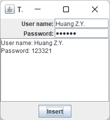

## 选择组件

### 复选框

复选框自动地带有标识标签。用户通过点击某个复选框来选择相应的选项，再点击则取消选取。

```java
import javax.swing.*;
import java.awt.*;
import java.awt.event.ActionListener;

public class CheckBoxTest {
    public static void main(String[] args) {
        EventQueue.invokeLater(() -> {
            CheckBoxFrame frame = new CheckBoxFrame();
            frame.setTitle("CheckBoxTest");
            frame.setDefaultCloseOperation(JFrame.EXIT_ON_CLOSE);
            frame.setVisible(true);
        });
    }
}
class CheckBoxFrame extends JFrame {
    private JLabel label;
    private JCheckBox bold;
    private JCheckBox italic;
    private static final int FONTSIZE = 24;
    private String plafName = "com.sun.java.swing.plaf.windows.WindowsLookAndFeel";
    public CheckBoxFrame() {
        try {
            UIManager.setLookAndFeel(plafName);
            SwingUtilities.updateComponentTreeUI(CheckBoxFrame.this);
        } catch (Exception ex) {
            ex.printStackTrace();
        }
        label = new JLabel("The quick brown fox jumps over the lazy dog.");
        label.setFont(new Font("Serif", Font.BOLD, FONTSIZE));
        add(label, BorderLayout.CENTER);

        ActionListener listener = event -> { // 匿名函数
            int mode = 0;
            if (bold.isSelected())
                mode += Font.BOLD; // 添加模式
            if (italic.isSelected())
                mode += Font.ITALIC;
            label.setFont(new Font("Serif", mode, FONTSIZE));
        };

        JPanel buttonPanel = new JPanel();

        bold = new JCheckBox("Bold");
        bold.addActionListener(listener);
        bold.setSelected(true);
        buttonPanel.add(bold);

        italic = new JCheckBox("Italic");
        italic.addActionListener(listener);
        buttonPanel.add(italic);

        add(buttonPanel, BorderLayout.SOUTH);
        pack();
    }
}
```


### 单选按钮

为单选按钮组构造一个`ButtonGroup`的对象。然后，再将`JRadioButton`类型的对象添加到按钮组中。按钮组负责在新按钮被按下时，取消前一个被按下的按钮的选择状态。

```java
ButtonGroup group = new ButtonGroup();
JRadioButton smallButton = new JRadioButton("small", false);
group.add(smallButton);
JRadioButton mediumButton = ne JRadioButton("medium", true);
group.add(mediumButton);
```

> 单选按钮为圆形，选择圈内出现圆点表示被选择；
>
> 复选按钮为正方向，方形中出现对勾表示被选择；

`ButtonGroup` 类中有一个`getSelection`方法， 但是这个方法并不返回被选择的单选按钮， 而是返回附加在那个按钮上的模型`ButtonModel` 的引用，并没有什么实际的应用价值。可通过调用方法`buttonGroup.getSelection().getActionCommand()`获得当前选择的按钮的动作命令。

```java
public class RadioButtonTest {
    public static void main(String[] args) {
        EventQueue.invokeLater(() -> {
            RadioButtonFrame frame = new RadioButtonFrame();
            frame.setTitle("RadioButtonTest");
            frame.setDefaultCloseOperation(JFrame.EXIT_ON_CLOSE);
            frame.setVisible(true);
        });
    }
}

class RadioButtonFrame extends JFrame {
    private JPanel buttonPanel;
    private ButtonGroup group;
    private JLabel label;
    private static final int DEFAULT_SIZE = 36;

    public RadioButtonFrame() {
        label = new JLabel("The quick brown fox jumps over the lazy dog.");
        label.setFont(new Font("Serif", Font.PLAIN, DEFAULT_SIZE));
        add(label, BorderLayout.CENTER);

        buttonPanel = new JPanel();
        group = new ButtonGroup();

        addRadioButton("Small", 8);
        addRadioButton("Medium", 12);
        addRadioButton("Large", 18);
        addRadioButton("Extra large", 36);

        add(buttonPanel, BorderLayout.SOUTH);
        pack();
    }

    public void addRadioButton(String name, int size) {
        boolean selected = size == DEFAULT_SIZE;
        JRadioButton button = new JRadioButton(name, selected);
        group.add(button);
        buttonPanel.add(button);

        ActionListener listener = event -> label.setFont(new Font("Serif", Font.PLAIN, size));

        button.addActionListener(listener);
    }
}
```


### 边框

如果在一个窗口中有多组单选按钮，就需要用可视化的形式指明哪些按钮属于同一组。
Swing提供了一组很有用的边框（borders）来解决这个问题。可以在任何继承了`JComponent`的组件上应用边框。最常用的用途是在一个面极周围放置一个边框，然后用其他用户界面元素（如单选按钮）填充面板。

调用`BorderFactory`的静态方法创建边框。下面是几种可选的风格：

- 凹斜面

- 凸斜面

- 蚀刻

- 直线

- 不光滑

```java
Border etched = BorderFactory.createEtchedBorder();
Border titled = BorderFactory.createTitledBorder(etched, "A Title");
panel.setBorder(titled);
```

```java
import javax.swing.*;
import javax.swing.border.Border;
import java.awt.*;

public class BorderTest {
    public static void main(String[] args) {
        EventQueue.invokeLater(() -> {
            BorderFrame frame = new BorderFrame();
            frame.setTitle("BorderTest");
            frame.setDefaultCloseOperation(JFrame.EXIT_ON_CLOSE);
            frame.setVisible(true);
        });
    }
}

class BorderFrame extends JFrame {
    private JPanel demoPanel;
    private JPanel buttonPanel;
    private ButtonGroup group;

    public BorderFrame() {
        demoPanel = new JPanel();
        buttonPanel = new JPanel();
        group = new ButtonGroup();

        addRadioButton("Lowered bevel", BorderFactory.createLoweredBevelBorder());
        addRadioButton("Raised bevel", BorderFactory.createRaisedBevelBorder());
        addRadioButton("Etched", BorderFactory.createEtchedBorder());
        addRadioButton("Line", BorderFactory.createLineBorder(Color.YELLOW));
        addRadioButton("Matte", BorderFactory.createMatteBorder(10, 10, 10, 10, Color.BLUE));
        addRadioButton("Empty", BorderFactory.createEmptyBorder());

        Border etched = BorderFactory.createEtchedBorder();
        Border titled = BorderFactory.createTitledBorder(etched, "Border types");
        buttonPanel.setBorder(titled);

        setLayout(new GridLayout(2, 1));
        add(buttonPanel);
        add(demoPanel);
        pack();
    }

    public void addRadioButton(String buttonName, Border b) {
        JRadioButton button = new JRadioButton(buttonName);
        button.addActionListener(event -> demoPanel.setBorder(b));
        group.add(button);
        buttonPanel.add(button);
    }
}
```


### 组合框

如果下拉列表框被设置成可编辑（ editable ），就可以像编辑文本一样编辑当前的选项内容。鉴于这个原因，这种组件被称为组合枢（combo box），它将文本域的灵活性与一组预定义的选项组合起来。`JComboBox`类提供了组合框的组件。

> 如果希望持久地显示列表，而不是下拉列表，应使用`JList`组件。

如果需妥往组合框中添加大量的选项， `addltem`方法的性能就显得很差了。取而代之的是构造一个`DefaultComboBoxModel` ，并调用`addElement` 方法进行加载， 然后再调用`JComboBox `中的`setModel`方法。

获取选择内容项：`combo.getItemAt(combo.getSelectedIndex())`

```java
import javax.swing.*;
import java.awt.*;

public class ComboBoxTest {
    public static void main(String[] args) {
        EventQueue.invokeLater(() -> {
            ComboBoxFrame frame = new ComboBoxFrame();
            frame.setTitle("ComboBoxTest");
            frame.setDefaultCloseOperation(JFrame.EXIT_ON_CLOSE);
            frame.setVisible(true);
        });
    }
}

class ComboBoxFrame extends JFrame {
    private JComboBox<String> faceCombo;
    private JLabel label;
    private static final int DEFAULT_SIZE = 24;

    public ComboBoxFrame() {
        label = new JLabel("The quick brown fox jumps over the lazy dog.");
        label.setFont(new Font("Serif", Font.PLAIN, DEFAULT_SIZE));
        add(label, BorderLayout.CENTER);


        faceCombo = new JComboBox<>();
        faceCombo.addItem("Serif");
        faceCombo.addItem("SansSerif");
        faceCombo.addItem("Monospaced");
        faceCombo.addItem("Dialog");
        faceCombo.addItem("DialogInput");

        faceCombo.addActionListener(event -> label.setFont(
                new Font(faceCombo.getItemAt(faceCombo.getSelectedIndex()),
                        Font.PLAIN, DEFAULT_SIZE))); // 获取项目内容

        JPanel comboPanel = new JPanel();
        comboPanel.add(faceCombo);
        add(comboPanel, BorderLayout.SOUTH);
        pack();
    }
}
```


### 滑块

组合框可以让用户从一组离散值中进行选择。滑块允许进行连续值得选择。

通常，可以使用下列方式构造滑块：

```java
JSlider slider = new JSlider(min, max, intialValue);
```

如果需要垂直滑块，可以按照下列方式调用构造器：

```java
JSlider slider = new JSlider(SwingConstants.VERTICAL, min, max, initalValue);
```

当用户滑动滑块时，滑块的值就会在最小值和最大值之间之间变化。当值发生变化时， `ChangeEvent`就会发送给所有变化的监听器。为了得到这些改变的通知，需要调用`addChangeListener`方法井且安装一个实现了`ChangeListener`接口的对象。这个接口只有一个方法`stateChanged`。在这个方法中，可以获取滑块的当前值：

```java
public void stateChanged(ChangedEvent event) {
	JSlider slider = (JSlider)event.getSource();
    int value = slider.getValue();
}
```

可以通过显示标尺（tricks）对滑块进行修饰。

```java
slider.setMajorTcikSpacing(20);
slider.setMinorTickSpacing(5);
slider.setPaintTicks(true); // 显示标尺标记
```

可以强制滑块对齐标尺。这样一来，只要用户完成拖放滑块的操作，滑块就会立即自动地移到最接近的标尺处。

```java
slider.setSnapToTicks(true);
```

可以调用下列方法为大标只添加标尺标签（tick mark labels) ：

```java
slider.setPaintLabels(true);
```

还可以提供其他形式的标尺标记，如字符串或者图标：

```java
HashTable<Integer, Component> labelTable = new HashTable<>();
labelTabel.put(0, new JLabel("A"));
labelTabel.putA(20, new JLabel("B"));
...
slider.setLabel(labelTable);
```

```java
public class SliderTest {
    public static void main(String[] args) {
        EventQueue.invokeLater(() -> {
            SliderFrame frame = new SliderFrame();
            frame.setTitle("SliderTest");
            frame.setDefaultCloseOperation(JFrame.EXIT_ON_CLOSE);
            frame.setVisible(true);
        });
    }
}

class SliderFrame extends JFrame {
    private JPanel sliderPanel;
    private JTextField textField;
    private ChangeListener listener;
    private String plafName = "com.sun.java.swing.plaf.windows.WindowsLookAndFeel";

    public SliderFrame() {
        try {
            UIManager.setLookAndFeel(plafName);
            SwingUtilities.updateComponentTreeUI(SliderFrame.this);
        } catch (Exception ex) {
            ex.printStackTrace();
        }
        sliderPanel = new JPanel();
        sliderPanel.setLayout(new GridBagLayout());

        // 所有滑块共有一个监听器
        listener = event -> {
            // 当滑片移动更新文本框
            JSlider source = (JSlider) event.getSource();
            textField.setText("" + source.getValue());
        };
        // 普通滑块
        JSlider slider = new JSlider();
        addSlider(slider, "Plain");

        // 设置大标记和小标记
        slider = new JSlider();
        slider.setPaintTicks(true);
        slider.setMajorTickSpacing(20);
        slider.setMinorTickSpacing(5);
        addSlider(slider, "Ticks");
        // 强制滑片对齐标记
        slider = new JSlider();
        slider.setPaintTicks(true);
        slider.setSnapToTicks(true);
        slider.setMajorTickSpacing(20);
        slider.setMinorTickSpacing(5);
        addSlider(slider, "Snap to ticks");
        // 无轨迹滑块
        slider = new JSlider();
        slider.setPaintTicks(true);
        slider.setMajorTickSpacing(20);
        slider.setMinorTickSpacing(5);
        slider.setPaintTrack(false); // 不显示滑块滑动的轨迹
        addSlider(slider, "No track");
        // 设置逆向滑块
        slider = new JSlider();
        slider.setPaintTicks(true);
        slider.setMajorTickSpacing(20);
        slider.setMinorTickSpacing(5);
        slider.setInverted(true);
        addSlider(slider, "Inverted");

        slider = new JSlider();
        slider.setPaintTicks(true);
        slider.setPaintLabels(true);
        slider.setMajorTickSpacing(20);
        slider.setMinorTickSpacing(5);
        addSlider(slider, "Labels");
        // 有标识滑块
        slider = new JSlider();
        slider.setPaintLabels(true); // 设置数字标识
        slider.setPaintTicks(true);
        slider.setMajorTickSpacing(20);
        slider.setMinorTickSpacing(5);
        // 字符串滑块
        Hashtable<Integer, Component> labelTable = new Hashtable<>();
        labelTable.put(0, new JLabel("A"));
        labelTable.put(20, new JLabel("B"));
        labelTable.put(40, new JLabel("C"));
        labelTable.put(60, new JLabel("D"));
        labelTable.put(80, new JLabel("E"));
        labelTable.put(100, new JLabel("F"));

        slider.setLabelTable(labelTable);
        addSlider(slider, "Custom labels");

        slider = new JSlider();
        slider.setPaintTicks(true);
        slider.setPaintLabels(true);
        slider.setSnapToTicks(true);
        slider.setMajorTickSpacing(20);
        slider.setMinorTickSpacing(20);

        labelTable = new Hashtable<Integer, Component>();
        // 设置图像标识滑块
        labelTable.put(0, new JLabel(new ImageIcon("img\\nine.gif")));
        labelTable.put(20, new JLabel(new ImageIcon("img\\ten.gif")));
        labelTable.put(40, new JLabel(new ImageIcon("img\\jack.gif")));
        labelTable.put(60, new JLabel(new ImageIcon("img\\queen.gif")));
        labelTable.put(80, new JLabel(new ImageIcon("img\\king.gif")));
        labelTable.put(100, new JLabel(new ImageIcon("img\\ace.gif")));

        slider.setLabelTable(labelTable);
        addSlider(slider, "Icon labels");

        textField = new JTextField();
        add(sliderPanel, BorderLayout.CENTER);
        add(textField, BorderLayout.SOUTH);
        pack(); // 缩放窗口时，将组件调整至最佳尺寸
    }

    public void addSlider(JSlider slider, String description) {
        slider.addChangeListener(listener);
        JPanel panel = new JPanel();
        panel.add(slider);
        panel.add(new JLabel(description));
        panel.setAlignmentX(Component.LEFT_ALIGNMENT);
        GridBagConstraints gbc = new GridBagConstraints(); // 设置组件位置
        gbc.gridy = sliderPanel.getComponentCount(); // 获取当前组件个数
        gbc.anchor = GridBagConstraints.WEST; // 左对齐
        sliderPanel.add(panel, gbc); // add(Component, GridBagConstraint)
    }
}
```

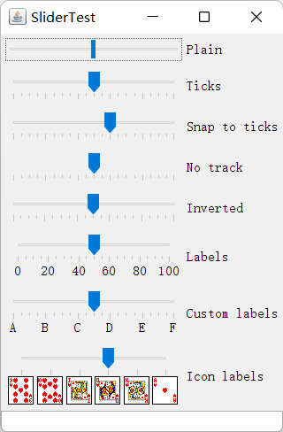

## 菜单

### 菜单创建

创建菜单首先要创建一个菜单栏：

```java
JMenuBar menuBar = new JMenuBar();
```

菜单栏是一个可以添加到任何位置的组件。通常放置在框架的顶部。可以调用`setJMenuBar`方怯将菜单栏添加到框架上：

```java
frame.setJMenuBar(menuBar);
```

需要为每个菜单建立一个菜单对象：

```java
JMenu editMenu = new JMenu("Edit");
```

向菜单对象中添加菜单项、分隔符和子菜单：

```java
JMenuItem pasteItem = new JMenuItem("Paste");
editMent.add(pasteItem);
editMent.addSeparator();
JMenu optionMenu = new JMenu("Option");
editMenu.add(optionMenu);
```

可以使用`JMenu.add(String s)`方法将菜单项插入到菜单的尾部，例如：

```java
editMenu.add("Paste");
```

`add`方法返回创建的子菜单项。可以采用下列方式获取它，并添加监听器：

```java
JMenuItem pasteItem = editMenu.add("Paste");
pasteItem.addActionListener(listener);
```

通常，采用扩展抽象类`AbstractAction`来定义一个实现`Action`接口的类。这里需要在`AbstractAction`对象的构造器中指定菜单项标签井且覆盖`actionPerformed`方法来获得菜单动作处理器。例如：

```java
Action exitAction = new AbstractAction("Exit") {
	public void actionPerformed(ActionEvent event) {
		System.exit(0);
	}
};
```

然后将动作添加到菜单中：

```java
JMenuItem exitItem ＝fileMenu.add(exitAction);
```

这个命令利用动作名将一个菜单项添加到菜单中。这个动作对象将作为它的监听器。等价于：

```
JMenuItem exitItem = new JMenuItem(exitAcion);
fileMenu.add(exitItem);
```

可通过`remove(int index)`或`remove(JMenuItem item)`删除菜单项。

### 菜单项中的图标

菜单项与按钮很相似。实际上，`JMenultem`类扩展`AbstractButton`类。与按钮一样，菜单可以包含文本标签、图标，也可以两者都包含。

```java
JMenuItem cutItem = new JMenuItem("Cut", new ImageIcon("cut.gif"));
```

在默认情况下，菜单项的文本被放置在图标的右侧。如果喜欢将文本放置在左侧，可以调用`JMenultem`类中的`setHorizontalTextPosition`方法（继承自`AbstractButton`类）设置。例如：

```java
cutItem.setHorizonalTextPosition(SwingConstants.LEFT);
```

也可以将一个图标添加到一个动作上：

```java
Action cutAction = new AbstractAction("Cut", [new ImageIcon("cut.gif")]) {
	public void actonPerformed(ActionEvent event) {
		// action code goes here
	}
};
cutAction.putValue(Action.SMALL_ICON, new ImageIcon("cut.gif"));
JMenuItem exitItem = menu.add(cutAction);
```

### 复选框和单选按钮菜单项

除了按钮装饰外，同其他菜单项的处理相同。例如，下面是创建复选框菜单项的代码：

```java
JCheckBoxMenultem readonlyItem = new JCheckBoxItem("Read-only");
optionsMenu.add(readonlyItem);
```

单选按钮菜单项与普通单选按钮的工作方式一样，必须将它们加入到按钮组中。

```java
ButtonGroup group = new ButtonGroup();
JRadioButtonMenuItem insertItem = new JRadioButtonMenultem(”Insert");
insertItem.setSelected(true);
JJRadioButtonMenuItem overtypeItem ＝ new JRadioButtonMenuItem("Overtype");
group.add(insertItem);
group.add(overtypeitem);
optionsMenu.add(insertltem);
optionsMenu.add(overtypeItem);
```

### 弹出菜单

弹出菜单（pop-up menu）是不固定在莱单栏随处浮动动的莱单。

```java
JPopupMenu popup = new JPopupMeu();
```

弹出菜单并不像常规菜单栏那样总是显示在框架的顶部，必须调用`show`方法菜单才能显示出来。调用时需要给出父组件以及相对父组件坐标的显示位置。

```java
popup.show(panel, x, y);
```

要想在用户点击某一个组件时弹出菜单，需要按照下列方式调用方法：

```JAVA
component.setComponentPopupMenu(popup);
```

偶尔会遇到在一个含有弹出菜单的组件中放置一个组件的情况。

```java
child.setInherisPopupMenu(true);
```

### 快捷键和加速器

可以通过在菜单项的构造器中指定一个快捷字母来为菜单项设置快捷键：

```java
JMenu aboutItem = new JMenuItem("About", 'A'); 
```

可以调用`setDisplayedMnemonicIndex`方法指定希望加下划线的字符。例如， 如果在菜单项“ Save As”中使用快捷键“A”，则在第二个“A”（Save <u>A</u>s）下面加下划线更为合理。

如果有一个`Action`对象，就可以把快捷键作为`Action.MNEMONI C_KEY`的键值添加到对象中。如：

```java
cutAction.putValue(Action.MNEMONIC_KEY, new Integer('A'));
```

加速器是在不打开菜单的情况下选择菜单项的快捷键。

```java
openItem.setAccelator(KeyStroke.getKeyStroke("ctrl o"));
```

> 加速器只能关联到菜单项上，不能关联到菜单上。加速器键并不实际打开菜单。它将直接地激活菜单关联的动作事件。

### 启用和禁用菜单项

在有些时候，某个特定的菜单项可能只能够在某种特定的环境下才可用。例如，当文档以只读方式打开时，Save菜单项就没有意义。

```java
public void menuSelected(MenuEvent event) {
	saveAction.setEnabled(readonlyItem.isSelected());
	saveAsAction. setEnabled(readonlyItem.isSelected());
}
```

```java
import javax.swing.*;
import java.awt.*;
import java.awt.event.ActionEvent;
import java.awt.event.ActionListener;

public class MenuTest {
    public static void main(String[] args) {
        EventQueue.invokeLater(() -> {
            MenuFrame frame = new MenuFrame();
            frame.setTitle("MenuTest");
            frame.setDefaultCloseOperation(JFrame.EXIT_ON_CLOSE);
            frame.setVisible(true);
        });
    }
}
class MenuFrame extends JFrame {
    private static final int DEFAULT_WIDTH = 300;
    private static final int DEFAULT_HEIGHT = 200;
    private Action saveAction;
    private Action saveAsAction;
    private JCheckBoxMenuItem readonlyItem;
    private JPopupMenu popup;
    private String plafName = "com.sun.java.swing.plaf.windows.WindowsLookAndFeel";

    class TestAction extends AbstractAction {
        public TestAction(String name) {
            super(name);
        }

        public void actionPerformed(ActionEvent event) {
            System.out.println(getValue(Action.NAME) + " selected.");
        }
    }

    public MenuFrame() {
        try {
            UIManager.setLookAndFeel(plafName);
            SwingUtilities.updateComponentTreeUI(MenuFrame.this);
        } catch (Exception ex) {
            ex.printStackTrace();
        }
        setSize(DEFAULT_WIDTH, DEFAULT_HEIGHT);

        JMenu fileMenu = new JMenu("File");
        fileMenu.add(new TestAction("New"));
        // 显示加速键
        JMenuItem openItem = fileMenu.add(new TestAction("Open"));
        openItem.setAccelerator(KeyStroke.getKeyStroke("ctrl O"));

        fileMenu.addSeparator();

        saveAction = new TestAction("Save");
        JMenuItem saveItem = fileMenu.add(saveAction);
        saveItem.setAccelerator(KeyStroke.getKeyStroke("ctrl S"));

        saveAsAction = new TestAction("Save As");
        fileMenu.add(saveAsAction);
        fileMenu.addSeparator();

        fileMenu.add(new AbstractAction("Exit") {
            public void actionPerformed(ActionEvent event) {
                System.exit(0);
            }
        });

        // 复选框和单选按钮菜单项
        readonlyItem = new JCheckBoxMenuItem("Read-only");
        readonlyItem.addActionListener(new ActionListener() {
            public void actionPerformed(ActionEvent event) {
                boolean saveOk = !readonlyItem.isSelected();
                saveAction.setEnabled(saveOk);
                saveAsAction.setEnabled(saveOk);
            }
        });

        ButtonGroup group = new ButtonGroup();

        JRadioButtonMenuItem insertItem = new JRadioButtonMenuItem("Insert");
        insertItem.setSelected(true);
        JRadioButtonMenuItem overtypeItem = new JRadioButtonMenuItem("Overtype");

        group.add(insertItem);
        group.add(overtypeItem);

        // 显示图标
        TestAction cutAction = new TestAction("Cut");
        cutAction.putValue(Action.SMALL_ICON, new ImageIcon("img\\cut.gif"));
        TestAction copyAction = new TestAction("Copy");
        copyAction.putValue(Action.SMALL_ICON, new ImageIcon("img\\copy.gif"));
        TestAction pasteAction = new TestAction("Paste");
        pasteAction.putValue(Action.SMALL_ICON, new ImageIcon("img\\paste.gif"));

        JMenu editMenu = new JMenu("Edit");
        editMenu.add(cutAction);
        editMenu.add(copyAction);
        editMenu.add(pasteAction);

        // 显示嵌套菜单
        JMenu optionMenu = new JMenu("Options");

        optionMenu.add(readonlyItem);
        optionMenu.addSeparator();
        optionMenu.add(insertItem);
        optionMenu.add(overtypeItem);

        editMenu.addSeparator();
        editMenu.add(optionMenu);

        // 显示快捷键
        JMenu
        helpMenu = new JMenu("Help");
        helpMenu.setMnemonic('H');

        JMenuItem indexItem = new JMenuItem("Index");
        indexItem.setMnemonic('I');
        helpMenu.add(indexItem);

        TestAction aboutAction = new TestAction("About");
        aboutAction.putValue(Action.MNEMONIC_KEY, Integer.valueOf('A'));
        helpMenu.add(aboutAction);

        JMenuBar menuBar = new JMenuBar();
        setJMenuBar(menuBar);
        menuBar.add(fileMenu);
        menuBar.add(editMenu);
        menuBar.add(helpMenu);

        // 弹出菜单
        popup = new JPopupMenu();
        popup.add(cutAction);
        popup.add(copyAction);
        popup.add(pasteAction);

        JPanel panel = new JPanel();
        panel.setComponentPopupMenu(popup);
        add(panel);
    }
}
```

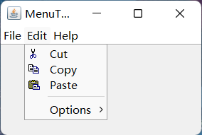

### 工具栏

工具栏是在程序中提供的快速访问常用命令的按钮栏。工具栏的特殊之处在于可以将它随处移动。可以将它拖拽到框架的四个边框上。工具栏可以完全脱离框架。这样的工具栏将包含在自己的框架中。

```java
JToolBar bar = new JToolBar();
bar.add(blueButton);
```

在默认情况下， 工具栏最初为水平的。如果想要将工具栏垂直放置，可以使用下列代码：

```java
bar = new JToolBar(titleString, SwingConstants.VERTICAL);
```

### 工具提示

在Swing 中，可以调用`setToolText`方法将工具提示添加到
`JComponent`上：

```java
exitButton.setToolTipText("Exit");
```

若使用`Action`对象，可以用`SHORT_DESCRIPTION`关联工具提示：

```java
exitAction.putValue(Action.SHORT_DESCRIPTION, "Exit");
```

```java
import javax.swing.*;
import java.awt.*;
import java.awt.event.ActionEvent;

public class ToolBarTest {
    public static void main(String[] args) {
        EventQueue.invokeLater(() -> {
            ToolBarFrame frame = new ToolBarFrame();
            frame.setTitle("ToolBarTest");
            frame.setDefaultCloseOperation(JFrame.EXIT_ON_CLOSE);
            frame.setVisible(true);
        });
    }
}

class ToolBarFrame extends JFrame {
    private static final int DEFAULT_WIDTH = 300;
    private static final int DEFAULT_HEIGHT = 200;
    private JPanel panel;
    private String plafName = "com.sun.java.swing.plaf.windows.WindowsLookAndFeel";

    public ToolBarFrame() {
        try {
            UIManager.setLookAndFeel(plafName);
            SwingUtilities.updateComponentTreeUI(ToolBarFrame.this);
        } catch (Exception ex) {
            ex.printStackTrace();
        }
        setSize(DEFAULT_WIDTH, DEFAULT_HEIGHT);

        panel = new JPanel();
        add(panel, BorderLayout.CENTER);

        // 建立动作（等价于组件）
        Action blueAction = new ColorAction("Blue", new ImageIcon("img\\blue-ball.gif"), Color.BLUE);
        Action yellowAction = new ColorAction("Yellow", new ImageIcon("img\\yellow-ball.gif"),
                Color.YELLOW);
        Action redAction = new ColorAction("Red", new ImageIcon("img\\red-ball.gif"), Color.RED);

        Action exitAction = new AbstractAction("Exit", new ImageIcon("img\\exit.gif")) {
            public void actionPerformed(ActionEvent event) {
                System.exit(0);
            }
        };
        exitAction.putValue(Action.SHORT_DESCRIPTION, "Exit");


        JToolBar bar = new JToolBar(); // 独立的组件，可拖拽至框架外
        bar.add(blueAction);
        bar.add(yellowAction);
        bar.add(redAction);
        bar.addSeparator();
        bar.add(exitAction);
        add(bar, BorderLayout.NORTH);

        JMenu menu = new JMenu("Color");
        menu.add(yellowAction);
        menu.add(blueAction);
        menu.add(redAction);
        menu.add(exitAction);
        JMenuBar menuBar = new JMenuBar();
        menuBar.add(menu);
        setJMenuBar(menuBar);
    }

    class ColorAction extends AbstractAction {
        public ColorAction(String name, Icon icon, Color c) {
            putValue(Action.NAME, name);
            putValue(Action.SMALL_ICON, icon);
            putValue(Action.SHORT_DESCRIPTION, name + " background");
            putValue("Color", c); // 设置颜色
        }

        public void actionPerformed(ActionEvent event) {
            Color c = (Color) getValue("Color");
            panel.setBackground(c);
        }
    }
}
```

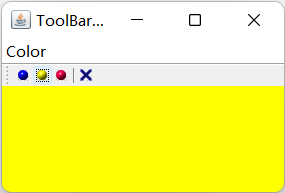

## 复杂的布局管理

Java布局管理器是一种用于组件布局的好方法。应用布局管理器，布局就可以使用。组件间关系的指令来完成布局操作。

Swing设计者有一个**失败**的尝试：为了能够将程序员从使用网格组布局的困难中解脱出来，提出了一种被称为箱式布局（box layout）的布局管理器。在`BoxLayout`类的JDK文档中写到：“采用水平和垂直的不同组合内嵌多个面板将可以夜得与`GridBagLayout`类似的效果，而且降低了复杂度。”然而，由于每个箱子是独立布局的，所以不能使用箱式布局排列水平和垂直方向都相邻的组件“。

Java SEl.4还做了一个尝试：设计一种代替网格组组件的布局一一（spring layout）。这种布局使用一个虚构的弹簧将同一个容器中的所有组件连接起来。当容器改变大小时，弹簧可以伸展或收缩，以便调节组件的位置。这听起来似乎感觉枯燥且不可思义，其实也确实如此。弹簧布局很快就会陷入含糊不清的境地。

### 网格组布局

使用网格组管理器进行布局，必须经过下列过程：

- 建立一个`GridBagLayout`的对象。不需要指定网格的行数和列数。布局管理器会根据后面所给的信息猜测。
- 将`GridBagLayout`对象设置成组件的布局管理器。
- 为每个组仲建立一个`GridBagConstraints`对象。设置`GridBagConstraints`对象的域以便指出组件
  在网格组中的布局方案。
- 添加组件的约束。

```java
GridBagLayout layout = new GridBagLayout();
panel.setLayout(layout);
GridBagConstraints constrains = new GridBagConstraints();
constraint.weightx = 100; // 行增量最大值
constraint.weighty = 100; // 列增量最大值
// 定义组件在网格中位置
constraint.gridx = 0;
constraint.gridy = 2;
// 组件占据的行数和列数
constraint.gridwidth = 2;
constraint.gridheight = 1;
panel.add(component, constraint);
```

- `fill`参数：如果不希望组件拉伸至整个区域， 就需要设置`fill` 约束。它有四个有效值： 
  `NONE` 、`HORIZONTAL` 、`VERTICAL`和`BOTH`。
- `achor`参数：如果组件没有填充整个区域，可以通过设置`anchor`域指定其位置。它有四个有效值：`CENTER`、`NORTH`、`NORTHEAST`、`ESAT`

> AWT文档建议不要将`gridx`和`gridy`设置为绝对位置，应该将它们设置为常量`GridBagConstraints.RELATIVE`。然后，按照标准的顺序，将组件添加到网格组布局中。即第一行从左向右，然后再开始新的一行，以此类推。

使用帮助类管理可简化代码：

```java
add(component, new GBC(1, 2)); // gridx, gridy
add(component, new GBC(1, 2, 3, 4)); // gridx, gridy, gridwidth, gridheight
add(compnent, new GBC(1, 2).setAnchor(GBC.EAST).setWeight(100, 100));
```

```java
import javax.swing.*;
import java.awt.*;
import java.awt.event.ActionListener;

public class GridBagLayoutTest {
    public static void main(String[] args) {
        EventQueue.invokeLater(() -> {
            FontFrame frame = new FontFrame();
            frame.setTitle("GridBagLayoutTest");
            frame.setDefaultCloseOperation(JFrame.EXIT_ON_CLOSE);
            frame.setVisible(true);
        });
    }
}

class FontFrame extends JFrame {
    public static final int TEXT_ROWS = 10;
    public static final int TEXT_COLUMNS = 20;

    private JComboBox<String> face;
    private JComboBox<Integer> size;
    private JCheckBox bold;
    private JCheckBox italic;
    private JTextArea sample;
    private String plafName = "com.sun.java.swing.plaf.windows.WindowsLookAndFeel";

    public FontFrame() {
        try {
            UIManager.setLookAndFeel(plafName);
            SwingUtilities.updateComponentTreeUI(FontFrame.this);
        } catch (Exception ex) {
            ex.printStackTrace();
        }
        GridBagLayout layout = new GridBagLayout();
        setLayout(layout); // 设置布局方式
        ActionListener listener = event -> updateSample(); // 定义监听器

        // 构造组件
        JLabel faceLabel = new JLabel("Face: ");
        face = new JComboBox<>(new String[] { "Serif", "SansSerif", "Monospaced",
                "Dialog", "DialogInput" });
        face.addActionListener(listener);

        JLabel sizeLabel = new JLabel("Size: ");

        size = new JComboBox<>(new Integer[] { 8, 10, 12, 15, 18, 24, 36, 48 });

        size.addActionListener(listener);

        bold = new JCheckBox("Bold");
        bold.addActionListener(listener);

        italic = new JCheckBox("Italic");
        italic.addActionListener(listener);

        sample = new JTextArea(TEXT_ROWS, TEXT_COLUMNS);
        sample.setText("The quick brown fox jumps over the lazy dog");
        sample.setEditable(false);
        sample.setLineWrap(true);
        sample.setBorder(BorderFactory.createEtchedBorder());

        // 布局组件，使用便捷的GBC类
        add(faceLabel, new GBC(0, 0).setAnchor(GBC.EAST));
        add(face, new GBC(1, 0).setFill(GBC.HORIZONTAL).setWeight(100, 0).setInsets(1));
        add(sizeLabel, new GBC(0, 1).setAnchor(GBC.EAST));
        add(size, new GBC(1, 1).setFill(GBC.HORIZONTAL).setWeight(100, 0).setInsets(1));
        add(bold, new GBC(0, 2, 2, 1).setAnchor(GBC.CENTER).setWeight(100, 100));
        add(italic, new GBC(0, 3, 2, 1).setAnchor(GBC.CENTER).setWeight(100, 100));
        add(sample, new GBC(2, 0, 1, 4).setFill(GBC.BOTH).setWeight(100, 100));
        pack();
        updateSample();
    }

    public void updateSample() {
        String fontFace = (String) face.getSelectedItem();
        int fontStyle = (bold.isSelected() ? Font.BOLD : 0)
                + (italic.isSelected() ? Font.ITALIC : 0);
        int fontSize = size.getItemAt(size.getSelectedIndex());
        Font font = new Font(fontFace, fontStyle, fontSize);
        sample.setFont(font);
        sample.repaint();
    }
}

class GBC extends GridBagConstraints {
    public GBC(int gridx, int gridy) {
        this.gridx = gridx;
        this.gridy = gridy;
    }

    public GBC(int gridx, int gridy, int gridwidth, int gridheight) {
        this.gridx = gridx;
        this.gridy = gridy;
        this.gridwidth = gridwidth;
        this.gridheight = gridheight;
    }

    public GBC setAnchor(int anchor) {
        this.anchor = anchor;
        return this;
    }

    public GBC setFill(int fill) {
        this.fill = fill;
        return this;
    }

    public GBC setWeight(double weightx, double weighty) {
        this.weightx = weightx;
        this.weighty = weighty;
        return this;
    }

    public GBC setInsets(int distance) {
        this.insets = new Insets(distance, distance, distance, distance);
        return this;
    }

    public GBC setInsets(int top, int left, int bottom, int right) {
        this.insets = new Insets(top, left, bottom, right);
        return this;
    }

    public GBC setIpad(int ipadx, int ipady) {
        this.ipadx = ipadx;
        this.ipady = ipady;
        return this;
    }
}
```

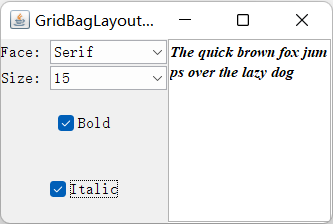

### 不使用布局管理器

将组件放在一个固定的位置上（通常称为绝对定位）。这对于与平台无关的应用程序来说并不是一个好主意，但可用来快速地构造原型。

```java
frame.setLayoyut(null);
JButton ok = new JButton("Ok");
frame.add(ok);
ok.setBounds(10, 10, 30, 15);
```

### 定制布局管理器

原则上，可以通过自己设计`LayoutManager`类来实现特殊的布局方式。

定制布局管理器必须实现`LayoutManager`接口，并且需要定义下面5个方法：

- `void addLayoutComponent(String s, Component c);`
- `void removeLayoutComponent(String s, Component c);`
- `Dimension preferredLayoutSize(Container parent);`
- `Dimension minimumLayout(Container parent);`
- `void layoutContainer(Container parent);`

```java
import javax.swing.*;
import java.awt.*;

public class CircleLayoutTest {
    public static void main(String[] args) {
        EventQueue.invokeLater(() -> {
            CircleLayoutFrame frame = new CircleLayoutFrame();
            frame.setTitle("CircleLayoutTest");
            frame.setDefaultCloseOperation(JFrame.EXIT_ON_CLOSE);
            frame.setVisible(true);
        });
    }
}

class CircleLayoutFrame extends JFrame {
    public CircleLayoutFrame() {
        setLayout(new CircleLayout());
        add(new JButton("Yellow"));
        add(new JButton("Blue"));
        add(new JButton("Red"));
        add(new JButton("Green"));
        add(new JButton("Orange"));
        add(new JButton("Fuchsia"));
        add(new JButton("Indigo"));
        pack();
    }
}

class CircleLayout implements LayoutManager {
    private int minWidth = 0;
    private int minHeight = 0;
    private int preferredWidth = 0;
    private int preferredHeight = 0;
    private boolean sizesSet = false;
    private int maxComponentWidth = 0;
    private int maxComponentHeight = 0;

    public void addLayoutComponent(String name, Component comp) {
    }

    public void removeLayoutComponent(Component comp) {
    }

    public void setSizes(Container parent) {
        if (sizesSet)
            return;
        int n = parent.getComponentCount();

        preferredWidth = 0;
        preferredHeight = 0;
        minWidth = 0;
        minHeight = 0;
        maxComponentWidth = 0;
        maxComponentHeight = 0;
        
        for (int i = 0; i < n; i++) {
            Component c = parent.getComponent(i);
            if (c.isVisible()) {
                Dimension d = c.getPreferredSize();
                maxComponentWidth = Math.max(maxComponentWidth, d.width);
                maxComponentHeight = Math.max(maxComponentHeight, d.height);
                preferredWidth += d.width;
                preferredHeight += d.height;
            }
        }
        minWidth = preferredWidth / 2;
        minHeight = preferredHeight / 2;
        sizesSet = true;
    }

    public Dimension preferredLayoutSize(Container parent) {
        setSizes(parent);
        Insets insets = parent.getInsets();
        int width = preferredWidth + insets.left + insets.right;
        int height = preferredHeight + insets.top + insets.bottom;
        return new Dimension(width, height);
    }

    public Dimension minimumLayoutSize(Container parent) {
        setSizes(parent);
        Insets insets = parent.getInsets();
        int width = minWidth + insets.left + insets.right;
        int height = minHeight + insets.top + insets.bottom;
        return new Dimension(width, height);
    }

    public void layoutContainer(Container parent) {
        setSizes(parent);

        Insets insets = parent.getInsets();
        int containerWidth = parent.getSize().width - insets.left - insets.right;
        int containerHeight = parent.getSize().height - insets.top - insets.bottom;

        int xcenter = insets.left + containerWidth / 2;
        int ycenter = insets.top + containerHeight / 2;

        int xradius = (containerWidth - maxComponentWidth) / 2;
        int yradius = (containerHeight - maxComponentHeight) / 2;
        int radius = Math.min(xradius, yradius);


        int n = parent.getComponentCount();
        for (int i = 0; i < n; i++) {
            Component c = parent.getComponent(i);
            if (c.isVisible()) {
                double angle = 2 * Math.PI * i / n;
                
                int x = xcenter + (int) (Math.cos(angle) * radius);
                int y = ycenter + (int) (Math.sin(angle) * radius);

                Dimension d = c.getPreferredSize();
                c.setBounds(x - d.width / 2, y - d.height / 2, d.width, d.height);
            }
        }
    }
}
```

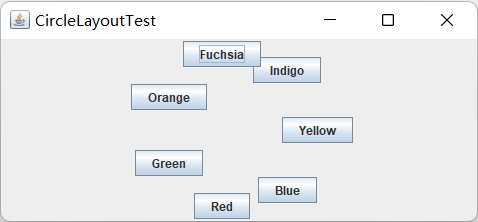

### 遍历顺序

显示时，遍历序列的第一个组件会有键盘焦点。每次用户按下TAB键，下一个组件就会获得焦点。遍历顺序很直观，它的顺序是从左至右，从上至下。如果容器还包含其他的容器当焦点给予另外一个容器时，那个容器左上角的组件就会自动地获得焦点，然后再遍历那个容器中的所有组件。最后，将焦点移交给紧跟着那个容器的组件上。

> 在Java SE 1.3 中，可以调用`JComponent`类中的`setNextFocusableComponent`方法来改变默认的遍历顺序。

## 对话框

与大多数的窗口系统一样， AWT也分为模式对话框和无模式对话框。所谓模式对话框是指在结束对它的处理之前，不允许用户与应用程序的其余窗口进行交互。模式对话框主要用于在程序继续运行之前获取用户提供的信息。无模式对话框是指允许用户同时在对话框和应用程序的其他窗口中输入信息。使用无模式对话框的最好例子就是工具栏。

### 选择对话框

Swing有一套简单的对话悟，用于获取用户的一些简单信息。`JOptionPane`有4个用于显示这些对话框的静态方法：

```java
showMessageDialog // 显示消息等待用户点击OK
showConfirmDialog // 显示消息等待用户确认
showOptionDialog // 显示一条消息在一组选项中选择
showInputDialog // 显示一条消息并获得用户输入的一行文本
```

对话框包含以下组件：

- 一个图标
- 一条消息
- 一个或多个按钮

左侧的图标将由下面5种消息类型决定：

- `ERROR_MESSAGE`
- `INFORMATION_MESSAGE`
- `WARNING_MESSAGE`
- `QUESTION_MESSAGE`
- `PLAIN_MESSAGE`

可以为每个对话框类型指定一条消息。这里的消息既可以是字符串、图标、用户界面组件，也可以是其他类型的对象。

```java
static void showMessageDialog(Component parent, Object message, String title, int messageType , Icon icon);
static int showConfirmDialog(Component parent, Object message , String title , int optionType , int messageType, Icon icon);
static int showOptionDialog( Component parent , Object message , String title, int optionType, int messageType, Icon icon, Object[] options, Object defaultOption);
static Object showInputDialog(Component parent, Object message, String title, int messageType, Icon icon , Object[] values, Object default)
```


```java
import javax.swing.*;
import java.awt.*;
import java.awt.event.ActionEvent;
import java.awt.event.ActionListener;
import java.awt.geom.Rectangle2D;
import java.util.Date;

public class OptionDialogTest {
    public static void main(String[] args) {
        EventQueue.invokeLater(() -> {
            OptionDialogFrame frame = new OptionDialogFrame();
            frame.setTitle("OptionDialogTest");
            frame.setDefaultCloseOperation(JFrame.EXIT_ON_CLOSE);
            frame.setVisible(true);
        });
    }
}

class OptionDialogFrame extends JFrame {
    private ButtonPanel typePanel; // 自定义面板
    private ButtonPanel messagePanel;
    private ButtonPanel messageTypePanel;
    private ButtonPanel optionTypePanel;
    private ButtonPanel optionsPanel;
    private ButtonPanel inputPanel;
    private String messageString = "Message";
    private Icon messageIcon = new ImageIcon("blue-ball.gif");
    private Object messageObject = new Date();
    private Component messageComponent = new SampleComponent();

    public OptionDialogFrame() {
        JPanel gridPanel = new JPanel();
        gridPanel.setLayout(new GridLayout(2, 3));

        typePanel = new ButtonPanel("Type", "Message", "Confirm", "Option", "Input");
        messageTypePanel = new ButtonPanel("Message Type", "ERROR_MESSAGE", "INFORMATION_MESSAGE",
                "WARNING_MESSAGE", "QUESTION_MESSAGE", "PLAIN_MESSAGE");
        messagePanel = new ButtonPanel("Message", "String", "Icon", "Component", "Other",
                "Object[]");
        optionTypePanel = new ButtonPanel("Confirm", "DEFAULT_OPTION", "YES_NO_OPTION",
                "YES_NO_CANCEL_OPTION", "OK_CANCEL_OPTION");
        optionsPanel = new ButtonPanel("Option", "String[]", "Icon[]", "Object[]");
        inputPanel = new ButtonPanel("Input", "Text field", "Combo box");

        gridPanel.add(typePanel);
        gridPanel.add(messageTypePanel);
        gridPanel.add(messagePanel);
        gridPanel.add(optionTypePanel);
        gridPanel.add(optionsPanel);
        gridPanel.add(inputPanel);

        // 用面板显示 show 按钮
        JPanel showPanel = new JPanel();
        JButton showButton = new JButton("Show");
        showButton.addActionListener(new ShowAction()); // 设置监听器
        showPanel.add(showButton);

        add(gridPanel, BorderLayout.CENTER);
        add(showPanel, BorderLayout.SOUTH);
        pack();
    }

    public Object getMessage() { // 获取消息类型
        String s = messagePanel.getSelection();
        if (s.equals("String"))
            return messageString;
        else if (s.equals("Icon"))
            return messageIcon;
        else if (s.equals("Component"))
            return messageComponent;
        else if (s.equals("Object[]")) // 添加多个对象
            return new Object[] { messageString, messageIcon,
                    messageComponent, messageObject };
        else if (s.equals("Other"))
            return messageObject;
        else
            return null;
    }

    // 获取当前选定的选项
    public Object[] getOptions() {
        String s = optionsPanel.getSelection();
        if (s.equals("String[]"))
            return new String[] { "Yellow", "Blue", "Red" };
        else if (s.equals("Icon[]"))
            return new Icon[] { new ImageIcon("img\\yellow-ball.gif"),
                    new ImageIcon("img\\blue-ball.gif"), new ImageIcon("img\\red-ball.gif") };
        else if (s.equals("Object[]"))
            return new Object[] { messageString, messageIcon,
                    messageComponent, messageObject };
        else
            return null;
    }

    // 获取所选消息或选项类型
    public int getType(ButtonPanel panel) {
        String s = panel.getSelection();
        try {
            return JOptionPane.class.getField(s).getInt(null);
        } catch (Exception e) {
            return -1;
        }
    }

    // 根据面板选择不同类型的对话框
    private class ShowAction implements ActionListener {
        public void actionPerformed(ActionEvent event) {
            if (typePanel.getSelection().equals("Confirm"))
                JOptionPane.showConfirmDialog(
                        OptionDialogFrame.this, getMessage(), "Title", getType(optionTypePanel),
                        getType(messageTypePanel)); // 弹出消息对话框
            else if (typePanel.getSelection().equals("Input")) {
                if (inputPanel.getSelection().equals("Text field"))
                    JOptionPane.showInputDialog(
                            OptionDialogFrame.this, getMessage(), "Title", getType(messageTypePanel));
                else
                    JOptionPane.showInputDialog(OptionDialogFrame.this, getMessage(), "Title",
                            getType(messageTypePanel), null, new String[] { "Yellow", "Blue", "Red" },
                            "Blue"); // 下拉列表组件，直接使用字符串数组表示下拉项
            } else if (typePanel.getSelection().equals("Message"))
                JOptionPane.showMessageDialog(
                        OptionDialogFrame.this, getMessage(), "Title", getType(messageTypePanel));
            else if (typePanel.getSelection().equals("Option"))
                JOptionPane.showOptionDialog(
                        OptionDialogFrame.this, getMessage(), "Title", getType(optionTypePanel),
                        getType(messageTypePanel), null, getOptions(), getOptions()[0]); // 对话框默认图标
        }
    }
}

// 绘制组件
class SampleComponent extends JComponent {
    public void paintComponent(Graphics g) {
        Graphics2D g2 = (Graphics2D) g;
        Rectangle2D rect = new Rectangle2D.Double(0, 0, getWidth() - 1, getHeight() - 1);
        g2.setPaint(Color.YELLOW);
        g2.fill(rect);
        g2.setPaint(Color.BLUE);
        g2.draw(rect);
    }

    public Dimension getPreferredSize() {
        return new Dimension(10, 10);
    }
}

class ButtonPanel extends JPanel {
    private ButtonGroup group;

    public ButtonPanel(String title, String... options) {
        setBorder(BorderFactory.createTitledBorder(BorderFactory.createEtchedBorder(), title));
        setLayout(new BoxLayout(this, BoxLayout.Y_AXIS)); // 盒式布局，以垂直盒子方式布局
        group = new ButtonGroup(); // 单选组

        // 为每个选项制作一个单选按钮
        for (String option : options) {
            JRadioButton button = new JRadioButton(option);
            button.setActionCommand(option);
            add(button);
            group.add(button);
            button.setSelected(option == options[0]); // 默认第一项被选中
        }
    }

    // 获取被选择的项
    public String getSelection() {
        return group.getSelection().getActionCommand();
    }
}
```

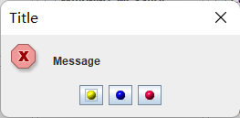

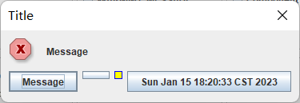

### 创建对话框

要想创建一个对话框，需要从`JDialog`派生一个类。这与应用程序窗口派生于`JFrame`的过程完全一样。具体过程如下：

1. 在对话框构造器中，调用超类JDialog的构造器。
2. 添加对话框的用户界面组件。
3. 添加事件处理器。
4. 设置对话框的大小。

```java
public class DialogTest {
    public static void main(String[] args) {
        EventQueue.invokeLater(() -> {
            DialogFrame frame = new DialogFrame();
            frame.setTitle("DialogTest");
            frame.setDefaultCloseOperation(JFrame.EXIT_ON_CLOSE);
            frame.setVisible(true);
        });
    }
}

class DialogFrame extends JFrame {
    private static final int DEFAULT_WIDTH = 300;
    private static final int DEFAULT_HEIGHT = 200;
    private AboutDialog dialog;
    private String plafName = "com.sun.java.swing.plaf.windows.WindowsLookAndFeel";

    public DialogFrame() {
        try {
            UIManager.setLookAndFeel(plafName);
            SwingUtilities.updateComponentTreeUI(DialogFrame.this);
        } catch (Exception ex) {
            ex.printStackTrace();
        }
        setSize(DEFAULT_WIDTH, DEFAULT_HEIGHT);

        // 构建文件菜单
        JMenuBar menuBar = new JMenuBar();
        setJMenuBar(menuBar);
        JMenu fileMenu = new JMenu("File");
        menuBar.add(fileMenu);

        // 添加菜单项
        JMenuItem aboutItem = new JMenuItem("About");
        aboutItem.addActionListener(event -> {
            if (dialog == null) // 第一次点击
                dialog = new AboutDialog(DialogFrame.this);
            dialog.setVisible(true); // 弹出对话框
        });
        fileMenu.add(aboutItem);

        // 终止程序
        JMenuItem exitItem = new JMenuItem("Exit");
        exitItem.addActionListener(event -> System.exit(0));
        fileMenu.add(exitItem);
    }
}

class AboutDialog extends JDialog {
    public AboutDialog(JFrame owner) { // 所属窗口
        super(owner, "About DialogTest", true); // 有模式对话框

        // 添加 HTML 标签居中
        add(
                new JLabel(
                        "<html><h1><i>Core Java</i></h1><hr>By Cay Horstmann</html>"),
                BorderLayout.CENTER);

        // OK 关闭

        JButton ok = new JButton("OK");
        ok.addActionListener(event -> setVisible(false));

        // 在下方添加 ok 按钮
        JPanel panel = new JPanel();
        panel.add(ok);
        add(panel, BorderLayout.SOUTH);

        pack();
    }
}
```

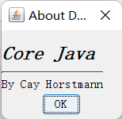

### 数据交换

使用对话框最通常的目的是获取用户的输入信息。构造对话框对象非常简单：首先初始化数据，然后
调用`setVisible(true)`就会在屏幕上显示对话框。对话框应该提供设置默认数据的方法。

```java
import javax.swing.*;
import java.awt.*;
import java.awt.event.ActionEvent;
import java.awt.event.ActionListener;

public class DataExchangeTest {
    public static void main(String[] args) {
        EventQueue.invokeLater(() -> {
            DataExchangeFrame frame = new DataExchangeFrame();
            frame.setTitle("DataExchangeTest");
            frame.setDefaultCloseOperation(JFrame.EXIT_ON_CLOSE);
            frame.setVisible(true);
        });
    }
}

class DataExchangeFrame extends JFrame {
    public static final int TEXT_ROWS = 20;
    public static final int TEXT_COLUMNS = 40;
    private PasswordChooser dialog = null;
    private JTextArea textArea;
    private String plafName = "com.sun.java.swing.plaf.windows.WindowsLookAndFeel";

    public DataExchangeFrame() {
        try {
            UIManager.setLookAndFeel(plafName);
            SwingUtilities.updateComponentTreeUI(DataExchangeFrame.this);
        } catch (Exception ex) {
            ex.printStackTrace();
        }
        JMenuBar mbar = new JMenuBar();
        setJMenuBar(mbar);
        JMenu fileMenu = new JMenu("File");
        mbar.add(fileMenu);

        // 连接菜单项
        JMenuItem connectItem = new JMenuItem("Connect");
        connectItem.addActionListener(new ConnectAction());
        fileMenu.add(connectItem);

        // 退出菜单项
        JMenuItem exitItem = new JMenuItem("Exit");
        exitItem.addActionListener(event -> System.exit(0));
        fileMenu.add(exitItem);
        // 滚动文本区
        textArea = new JTextArea(TEXT_ROWS, TEXT_COLUMNS);
        add(new JScrollPane(textArea), BorderLayout.CENTER);
        pack();
    }

    // 连接监听器
    private class ConnectAction implements ActionListener {
        public void actionPerformed(ActionEvent event) {
            // 第一次构造对话框
            if (dialog == null)
                dialog = new PasswordChooser();
            // 设置默认值
            dialog.setUser(new User("yourname", null));

            // 弹出对话框
            if (dialog.showDialog(DataExchangeFrame.this, "Connect")) {
                // 如果接受，则检索用户输入
                User u = dialog.getUser();
                textArea.append("user name = " + u.getName() + ", password = "
                        + (new String(u.getPassword())) + "\n");
            }
        }
    }
}

class PasswordChooser extends JPanel { // 继承于 JPanel，灵活度更高
    // ，在很多情况下，一个对话框可能会有多个拥有者框架，所以最好在准备显示对话框
    // 时再确定拥有者框架，而不是在构造PasswordChooser对象时，故继承自 JPanel
    private JTextField username;
    private JPasswordField password;
    private JButton okButton;
    JButton cancelButton;
    private boolean ok;
    private JDialog dialog;

    public PasswordChooser() {
        setLayout(new BorderLayout());

        // 构造用户名和密码面板
        JPanel panel = new JPanel();
        panel.setLayout(new GridLayout(2, 2));
        panel.add(new JLabel("User name:"));
        panel.add(username = new JTextField(""));
        panel.add(new JLabel("Password:"));
        panel.add(password = new JPasswordField("")); // 密码框
        add(panel, BorderLayout.CENTER);

        // 创建终止对话框的“确定”和“取消”按钮
        okButton = new JButton("Ok");
        okButton.addActionListener(event -> {
            ok = true; // 显示用户名和密码
            dialog.setVisible(false); // 对话框不可见
        });

        cancelButton = new JButton("Cancel");
        cancelButton.addActionListener(event -> dialog.setVisible(false)); // 与 ok 相同类似

        // 向南部边界添加按钮
        JPanel buttonPanel = new JPanel();
        buttonPanel.add(okButton);
        buttonPanel.add(cancelButton);
        add(buttonPanel, BorderLayout.SOUTH);
    }

    // 设置对话框默认值
    public void setUser(User u) {
        username.setText(u.getName());
    }
    // 获取对话框条目
    public User getUser() {
        return new User(username.getText(), password.getPassword());
    }
    // 在对话框中显示选择器面板
    public boolean showDialog(Component parent, String title) {
        ok = false;

        // 定位所有者框架
        Frame owner = null;
        if (parent instanceof Frame) // parent 是 Frame 的子类
            owner = (Frame) parent;
        else // 在组件层次结构中搜索上面的 parent 的便捷方法，返回它找到的类 owner 的第一个对象
        // 利用任意的parent组件可以很容易地得到它
            owner = (Frame) SwingUtilities.getAncestorOfClass(Frame.class, parent);

        // 如果是第一次，或者所有者已更改，则创建新对话框
        if (dialog == null || dialog.getOwner() != owner) {
            dialog = new JDialog(owner, true);
            dialog.add(this);
            // ．如果用户按下一个触发器键（在大多数“观感”实现中是ENTER）就自动地选择了它。默认按钮通常用加粗的轮廓给予特别的标识。
            dialog.getRootPane().setDefaultButton(okButton); // 在对话框的根窗格中设置默认按钮，相当于与回车
            dialog.pack();
        }

        // 设置标题和显示对话框
        dialog.setTitle(title);
        dialog.setVisible(true);
        return ok;
    }
}

class User {
    private String name;
    private char[] password;

    public User(String aName, char[] aPassword) {
        name = aName;
        password = aPassword;
    }

    public String getName() {
        return name;
    }

    public char[] getPassword() {
        return password;
    }

    public void setName(String aName) {
        name = aName;
    }

    public void setPassword(char[] aPassword) {
        password = aPassword;
    }
}
```

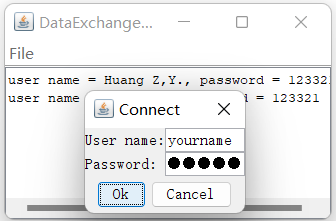

### 文件对话框

一个好的文件对话框应该可以显示文件和目录，可以让用户浏览文件系统，这是很难编写的。Swing 提供了`JFileChooser`类，它可以显示一个文件对话框，其外观与本地应用程序中使用的文件对话框基本一样。`JFileChooser`是一个模式对话框。注意， `JFileChooser`类并不是`JDialog`类的子类。需要调用`showOpenDialog`）显示打开文件的对话框。

下面是建立文件对话框井且获取用户选择信息的步骤：

1. 建立一个`JFileChooser`对象。

   ```java
   JFileChooser chooser = new JFileChooser();
   ```

2. 调用`setCurrentDirectory`方能设置当前目录。

   ```java
   chooser.setCurrentDirectory(new File("."))；
   ```

3. 如果有一个想要作为用户选择的默认文件名，可以使用`setSelectedFile`方法进行指定：

   ```java
   chooser.setSelectedFile(newFile(filename));
   ```

4. 如果允许用户在对话框中选择多个文件，需要调用`setMultiSelectionEnabled`方法。

   ```java
   chooser.setMultiSelectionEnabled(true);
   ```

5. 如果想让对话框仅显示某一种类型的文件，需要设置文件过滤器。

6. 在默认情况下，用户在文件选择器中只能选择文件。如果希望选择目录，需要调用
   `setFileSelectionMode`方法。参数值为： `JFileChooser.FILES_ONLY` （默认值） , `JFileChooser.DIRECTORIES_ONLY`或者`JFileChooser.FILES_AND _DIRECTORIES`。

7. 调用`showOpenDialog` 或者`showSaveDialog`方法显示对话框。

8. 调用`getSelectedFile()`或者`getSelectedFiles()`方法获取用户选择的一个或多个文件。

文件选择器的设计者提供了一种更好的机制：若想限制显示的文件，需要创建一个实现了抽象类`javax .swing. filechooser.FileFilter`的对象。文件选择器将每个文件传递给文件过滤器，只有文件过滤器接受的文件才被最终显示出来。

设计专用文件过滤器非常简单，只要实现`FileFilter`超类中的两个方能即可：

```java
public boolean accept(File f);
public String getDescription();
```

第一个方法检测是否应该接受一个文件，第二个方法返回显示在文件选择器对话框种显示的文件类型的描述信息。

一旦存在文件过滤器对象，就可以调用`JFileChooser`类中的`setFileFilter`方法，将这个对象安装到文件选择器对象中：

```java
chooser.setFileFilter(new FileNameExtension("Image files", "gif", "jpg"));
```

可以为一个文件选择器安装多个过滤器：

```java
chooser.addChoosableFileFilter(filter1);
chooser.addChoosableFileFilter(filter2);
```

```java
import javax.swing.*;
import javax.swing.filechooser.FileFilter;
import javax.swing.filechooser.FileNameExtensionFilter;
import javax.swing.filechooser.FileView;
import java.awt.*;
import java.io.File;

public class FileChooserTest {
    public static void main(String[] args) {
        EventQueue.invokeLater(() -> {
            ImageViewerFrame frame = new ImageViewerFrame();
            frame.setTitle("FileChooserTest");
            frame.setDefaultCloseOperation(JFrame.EXIT_ON_CLOSE);
            frame.setVisible(true);
        });
    }
}

class ImageViewerFrame extends JFrame {
    private static final int DEFAULT_WIDTH = 300;
    private static final int DEFAULT_HEIGHT = 400;
    private JLabel label;
    private JFileChooser chooser;
    private String plafName = "com.sun.java.swing.plaf.windows.WindowsLookAndFeel";

    public ImageViewerFrame() {
        try {
            UIManager.setLookAndFeel(plafName);
            SwingUtilities.updateComponentTreeUI(ImageViewerFrame.this);
        } catch (Exception ex) {
            ex.printStackTrace();
        }
        setSize(DEFAULT_WIDTH, DEFAULT_HEIGHT);

        // 建立菜单栏
        JMenuBar menuBar = new JMenuBar();
        setJMenuBar(menuBar);
        // 建立菜单
        JMenu menu = new JMenu("文件");
        menuBar.add(menu);
        // 打开 菜单项
        JMenuItem openItem = new JMenuItem("打开");
        menu.add(openItem);
        openItem.addActionListener(event -> {
            // 设置文件对话框的初始目录
            chooser.setCurrentDirectory(new File("."));
            // 显示文件过滤器对话框
            int result = chooser.showOpenDialog(ImageViewerFrame.this);
            // 如果接受图像文件，请将其设置为标签的图标
            if (result == JFileChooser.APPROVE_OPTION) {
                String name = chooser.getSelectedFile().getPath();
                label.setIcon(new ImageIcon(name));
                pack();
            }
        });

        JMenuItem exitItem = new JMenuItem("退出");
        menu.add(exitItem);
        exitItem.addActionListener(event -> System.exit(0));

        // 使用标签显示图像
        label = new JLabel();
        add(label);
        // 设置文件选择器
        chooser = new JFileChooser();

        // 接受以  .jpg, .jpeg, .gif 结束的文件
        // 利用给定的描述构造一个文件过滤器。这些描述限定了被接受的所有目录和文件其名称
        // 结尾的句点之后所包含的扩展字符串
        FileNameExtensionFilter filter = new FileNameExtensionFilter(
                "图像文件", "jpg", "jpeg", "gif");
        // 设置文件对话框的文件过滤器。所有让filter.accept 返回true 的文件都会被显示，并且将
        // 过滤器添加到可选过滤器列表中。
        chooser.setFileFilter(filter);
        // chooser.addChoosableFileFilter(filter);
        chooser.setAccessory(new ImagePreviewer(chooser)); // 设置一个附件组件，用于预览文件
        // 设置一个文件视图来提供文件选择器显示信息
        // 本质为 JLabel
        chooser.setFileView(new FileIconView(filter, new ImageIcon("img\\palette.gif"))); // 文件显示图标
    }
}

// 在框架显示图像
class ImagePreviewer extends JLabel {
    public ImagePreviewer(JFileChooser chooser) {
        setPreferredSize(new Dimension(100, 100));
        setBorder(BorderFactory.createEtchedBorder()); //  // 创建蚀刻边框
        chooser.addPropertyChangeListener(event -> {
            if (event.getPropertyName() == JFileChooser.SELECTED_FILE_CHANGED_PROPERTY) { // 所属文件被选中
                // 用户已选择新文件
                File f = (File) event.getNewValue(); // 获取新文件
                if (f == null) {
                    setIcon(null);
                    return;
                }

                // 将图像读入图标
                ImageIcon icon = new ImageIcon(f.getPath());

                // 如果图标太大，无法容纳，缩放
                if (icon.getIconWidth() > getWidth())
                    icon = new ImageIcon(icon.getImage().getScaledInstance(
                            getWidth(), -1, Image.SCALE_DEFAULT));

                setIcon(icon);
            }
        });
    }
}

class FileIconView extends FileView {
    private FileFilter filter;
    private Icon icon;

    public FileIconView(FileFilter aFilter, Icon anIcon) {
        filter = aFilter;
        icon = anIcon;
    }

    public Icon getIcon(File f) {
        if (!f.isDirectory() && filter.accept(f))
            return icon;
        else
            return null;
    }
}
```

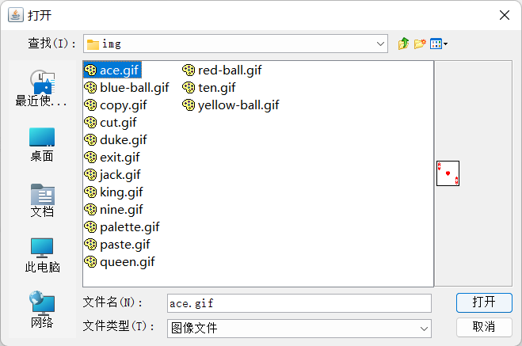

### 颜色选择器

与`JFileChooser`一样，颜色选择器也是一个组件，而不是一个对话框，但是它包含了用于创建包含颜色选择器组件的对话框方法。

利用颜色选择器显示模式对话框：

```java
Color selectedColor = JColorChooser.showDialog(parent, title, initialColor);
```

可以做进一步的改进，将颜色选择立即反馈给用户。如果想要监视颜色的选择，那就需要获得选择器的选择模型井添加改变监听器：

```java
chooser.getSelectionModel().addChangeListener(new
	ChangeListener() {
		public void stateChanged(ChangeEvent event) {
			// code
		}
	})
```

在这种情况下，颜色选择器对话框提供的OK和Cancel没有什么用途。可以将颜色选择器组
件直接添加到一个无模式对话框中：

```java
dialog = new JDialog(parent, false);
dialog.add(chooser);
dialog.pack();
```

```java
package chap9;

import javax.swing.*;
import javax.swing.event.ChangeEvent;
import javax.swing.event.ChangeListener;
import java.awt.*;
import java.awt.event.ActionEvent;
import java.awt.event.ActionListener;

public class ColorChooserTest {
    public static void main(String[] args) {
        EventQueue.invokeLater(new Runnable() {
            @Override
            public void run() {
                ColorChooserFrame ColorChooserFrame = new ColorChooserFrame();
                ColorChooserFrame.setDefaultCloseOperation(JFrame.EXIT_ON_CLOSE);
                ColorChooserFrame.setVisible(true);
            }
        });
    }

}

class ColorChooserFrame extends JFrame {
    public static final int WIDTH = 600;
    public static final int HEIGHT = 400;

    public ColorChooserFrame() {
        setTitle("ColorChooserTest");
        setSize(WIDTH, HEIGHT);
        ColorChooserPanel panel = new ColorChooserPanel();
        add(panel);
    }

    class ColorChooserPanel extends JPanel {

        public ColorChooserPanel() {
            // 有模式颜色选择器
            JButton modalButton = new JButton("Modal");
            modalButton.addActionListener(new ModalListener());
            add(modalButton);
            // 无模式颜色选择器
            JButton modelessButton = new JButton("Modeless");
            modelessButton.addActionListener(new ModelessListener());
            add(modelessButton);
            // 立即显示颜色（无需确认）
            JButton immediateButton = new JButton("Immediate");
            immediateButton.addActionListener(new ImmediateListener());
            add(immediateButton);
        }

        private class ModalListener implements ActionListener {
            @Override
            public void actionPerformed(ActionEvent e) {
                Color defaultColor = getBackground(); // 获取窗体背景颜色
                // 默认形式
                Color selected = JColorChooser.showDialog(ColorChooserPanel.this, "Set background",
                        defaultColor);
                if (selected != null) // 选中的颜色
                    setBackground(selected);
            }
        }

        private class ModelessListener implements ActionListener {
            private JDialog dialog;
            private JColorChooser chooser;

            public ModelessListener() {
                chooser = new JColorChooser(); // 组件而非对话框
                // 建立无模式对话框（直接添加）
                dialog = JColorChooser.createDialog(ColorChooserPanel.this, "Background Color", false, /* 无模式 */
                        chooser, new ActionListener() {
                            @Override
                            public void actionPerformed(ActionEvent e) {
                                setBackground(chooser.getColor());
                            }
                        }, null);
            }

            @Override
            public void actionPerformed(ActionEvent e) {
                chooser.setColor(getBackground());
                dialog.setVisible(true);
            }
        }

        private class ImmediateListener implements ActionListener {
            private JDialog dialog;
            private JColorChooser chooser;

            public ImmediateListener() { // 立即响应
                chooser = new JColorChooser();
                chooser.getSelectionModel().addChangeListener(new ChangeListener() {
                    @Override
                    public void stateChanged(ChangeEvent e) {
                        setBackground(chooser.getColor());
                    }
                });
                // dialog = JColorChooser.createDialog(ColorChooserPanel.this, "Background Color", false, chooser, new  ChangeListener() {
                //    @Override
                //    public void stateChanged(ChangeEvent event) {
                //       setBackground(chooser.getColor());
                //    }
                // }, null);
                dialog = new JDialog((Frame) null, false);
                dialog.add(chooser); // 给对话框添加组件
                dialog.pack();
            }

            @Override
            public void actionPerformed(ActionEvent e) {
                chooser.setColor(getBackground());
                dialog.setVisible(true);
            }
        }
    }

}
```

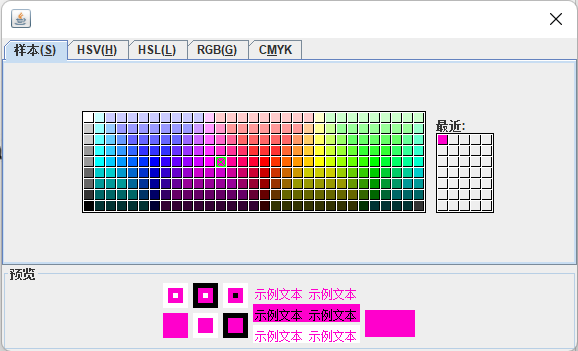
