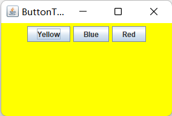
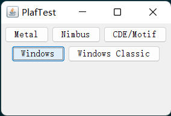
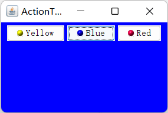
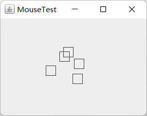
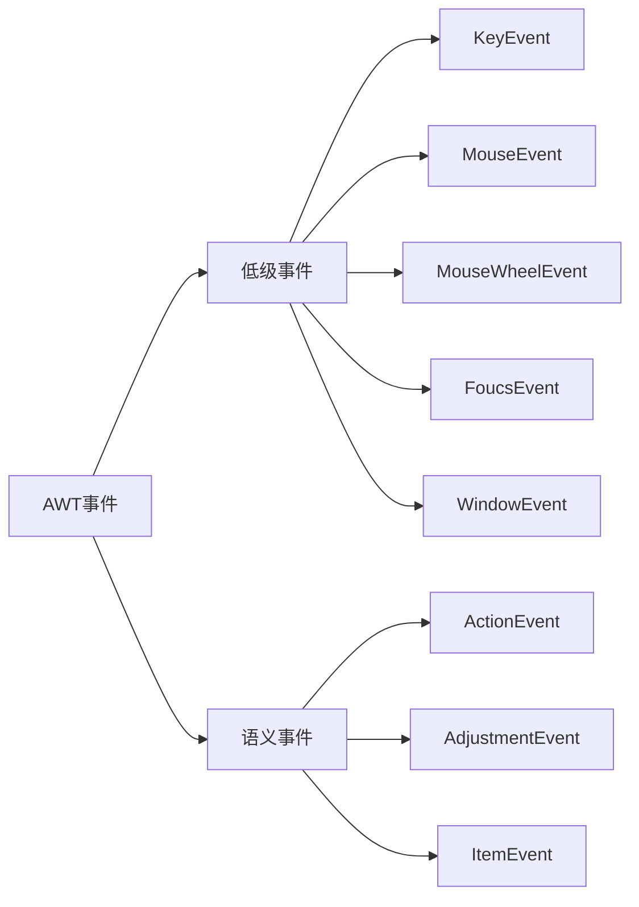

# 第8章 事件处理

## 事件处理基础

任何支持GUI的操作环境都要不断地监视敲击键盘或点击鼠标这样的事件。操作环境将这些事件报告给正在运行的应用程序。

在AWT所知的事件范围内，完全可以控制事件从事件源（event source）到事件监听器（event listener）的传递过程， 并将任何对象指派给事件监听器。不过事实上，应该选择一个能够便于响应事件的对象。这种事件委托模型（event delegation model）与Visual Basic那种预定义监听器模型比较起来更加灵活。

综上所述，下面给出AWT事件处理机制的概要：

- 监听器对象是一个实现了特定监听器接口（listener interface）的类的实例。
- 事件源是一个能够注册监听器对象井发送事件对象的对象。
- 当事件发生时，事件源将事件对象传递给所有注册的监听器。
- 监听器对象将利用事件对象中的信息决定如何对事件做出晌应。

为了实现`ActionListener`接口，监听器类必须有一个被称为`actionPerformed`的方法，该方法接收一个`ActionEvent`对象参数。

```java
class MyListener implements ActionListener {
	public void actionPerformed(ActionEvent e) {
        // 事件处理
        ...
    }
}
```

只要用户激活事件源， 事件源对象就会创建一个`ActionEvent`对象，然后调用`listener.actionPerformed(event)`传递事件对象。可以可将多个监听器对象添加到一个像按钮这样的事件源中。

### 实例：处理按钮点击事件

```java
public class ButtonTest {
    public static void main(String[] args) {
        EventQueue.invokeLater(new Runnable() {
            @Override
            public void run() {
                ButtonFrame frame = new ButtonFrame();
                frame.setDefaultCloseOperation(JFrame.EXIT_ON_CLOSE);
                frame.setVisible(true);
            }
        });
    }
}

class ButtonFrame extends JFrame {
    public ButtonFrame() {
        setTitle("ButtonTest");
        setSize(DEFAULT_WIDTH, DEFAULT_HEIGHT);

        JButton yellowButton = new JButton("Yellow");
        JButton blueButton = new JButton("Blue");
        JButton redButton = new JButton("Red");
        buttonPanel = new JPanel();
        buttonPanel.add(yellowButton);
        buttonPanel.add(blueButton);
        buttonPanel.add(redButton);
        add(buttonPanel);
        ColorAction yellowAction = new ColorAction(Color.YELLOW);
        ColorAction blueAction = new ColorAction(Color.BLUE);
        ColorAction redAction = new ColorAction(Color.RED);
        yellowButton.addActionListener(yellowAction);
        blueButton.addActionListener(blueAction);
        redButton.addActionListener(redAction);
    }

    private class ColorAction implements ActionListener {
        public ColorAction(Color c) {
            backgroundColor = c;
        }
        public void actionPerformed(ActionEvent event) {
            buttonPanel.setBackground(backgroundColor);
        }
        private Color backgroundColor;
    }
    private JPanel buttonPanel;
    public static final int DEFAULT_WIDTH = 300;
    public static final int DEFAULT_HEIGHT = 200;
}
```




### 建议使用内部类

在前面列举的示例中，三个按钮共享同一个监听器类。

可以设计一个辅助方法简化按钮处理的操作：

```java
public void makeButton(String name, Color backgroundColor) {
	JButton button = new JButton(name);
	buttonPanel.add(button);
	ColorAction action = new ColorAction(backgroundColor);
	button.addActionListener(button);
}
makeButton("yellow", Color.YELLOW);
makeButton("blue", Color.BLUE);
makeButton("red", Color.RED);
```

### 创建包含一个方法调用的监听器

在Java SE 1.4中引入了不用内部类来定义简单的事件监听器的机制。例如，假设有一个标签为`Load`的按钮，它的事件处理只包含下面一个方法调用：

```java
frame.loadData();
```

当然可使用匿名内部类：

```java
loadButton.addActionListener(new ActionListener() {
    public void actionPerformed(ActionEvent e) {
        frame.loadData();
    }
});
```

`EventHandler`类可以使用下列调用，自动地创建这样一个监听器：

```java
loadButton.addActionListner(
	EventHandler.create(ActionListener.class, frame, "loadData"));
```

如果事件监听器调用的方法只包含一个从事件处理器继承来的参数，就可以使用另外一种形式的`create`方法。例如，调用：

```java
new ActionListener() {
	public void actionPerformed(ActionEvent event) {
        frame.loadData(((JTextField) event.getSource()).getText());
    }
}
EventHandler.create(ActionListener.class, frame, "loadData", "source.text"); // 需要将属性source和text的名字转换成方法调用getSource和getText
```

### 实例：改变观感

在默认情况下， Swing程序使用Metal观感，可以采用两种方式改变观感。第一种方式是在Java安装的子目录`jre/lib`下有一个文件`swing.properties`。在这个文件中，将属性`swing.defaultlaf`设置为所希望的观感类名。例如，

```java
swing.defaultlaf = com.sum.java.swing.plat.motif.MotifLookAndFeel;
```

> 鉴于版权的原因， Windows和Mac的观感包，只与Windows和Mac版本的Java运行时环境一起发布。

第二种方式是动态地改变观感。这需要调用静态的`UIManager.setLookAndFeel`方法。并提供所想要的观感类名，然后再调用静态方法`SwingUtilities.updateComponentTreeUI`来刷新全部的组件集。

```java
String modifPlaf = "com.sun.java.swing.plaf.motif.MotifLookAndFeel";
private String windowsPlaf = "com.sun.java.swing.plaf.windows.WindowsLookAndFeel";
try {
    UIManager.setLookAtFeel(windowsPlaf);
    SwingUtilities.updateComponentTreeUI(panel); // 刷新全部组件集
} catch (Exception e) {
    e.printStackTrace();
}
```

为了列举安装的所有观感实现，可以调用:

```java
UIManager.LookAndFeelInfo[] infos = UIManager.getInstalledLookAndFeels();
String name = infos[i].getName();
String className = infos[i].getClassName();
```

```java
public class PlafTest {
    public static void main(String[] args) {
        EventQueue.invokeLater(new Runnable() {
            @Override
            public void run() {
                PlafFrame frame = new PlafFrame();
                frame.setDefaultCloseOperation(JFrame.EXIT_ON_CLOSE);
                frame.setVisible(true);
            }
        });
    }
}

class PlafFrame extends JFrame {
    public PlafFrame() {
        setTitle("PlafTest");
        setSize(DEFAULT_WIDTH, DEFAULT_HEIGHT);
        buttonPanel = new JPanel();
        UIManager.LookAndFeelInfo[] infos = UIManager.getInstalledLookAndFeels();
        for (UIManager.LookAndFeelInfo info : infos)
            makeButton(info.getName(), info.getClassName());
        add(buttonPanel);
    }
    void makeButton(String name, final String plafName) {
        JButton button = new JButton(name);
        buttonPanel.add(button);

        button.addActionListener(new ActionListener() {
            @Override
            public void actionPerformed(ActionEvent e) {
                try {
                    UIManager.setLookAndFeel(plafName);
                    System.out.println(plafName);
                    SwingUtilities.updateComponentTreeUI(PlafFrame.this);
                } catch (Exception ex) {
                    ex.printStackTrace();
                }
            }
        });
    }
    private JPanel buttonPanel;
    public static final int DEFAULT_WIDTH = 300;
    public static final int DEFAULT_HEIGHT = 200;
}
```



### 适配器

当程序用户试图关闭一个框架窗口时， `JFrame`对象就是`Window Event`的事件源。如果希望捕获这个事件，就必须有一个合适的监听器对象，并将它添加到框架的窗口监听器列表中。

在`WindowListener`接口中包含7个方法。当发生窗口事件时，框架将调用这些方法响应7个不同的事件。

> 是在Windows下，通常将iconified称为minimized。

```java
public interface WindowListener {
    void windowOpened(WindowEvent e);
    void windowClosing(WindowEvent e);
    void windowClosed(WindowEvent e);
    void windowIconified(WindowEvent e);
    void windowDeiconified(WindowEvent e);
  	void windowActivate(WindowEvent e);
    void windowDeactivate(WindowEvent e);
}
```

> 了能够查看窗口是否被最大化，需要安装`WindowStateListener`

鉴于简化的目的，每个含有多个方法的AWT监听器接口都配有一个过配器（adapter）类，这个类实现了接口中的所有方法，但每个方法没有做任何事情。这意味着适配器类自动地满足了Java实现相关监听器接口的技术需求。可以通过扩展适配器类来指定对某些事件的响应动作，而不必实现接口中的每个方法。

```java
class Terminator extends WindowAdapter {
    public void windowClosing(WindowEvent e) {
        if (user agrees) 
            System.exit(0);
    }
} 
WindowListner listener = new Terminator();
frame.addWindowListener(listener);
```

可进行进一步简化：

```java
frame.addWindowListener(new 
	WindowAdapter() {
		public void windowClosing(WindowEvent e) {
		if (user argees) 
			System.exit(0);
		}
	});
```

## 动作

通常，激活一个命令可以有多种方式。用户可以通过菜单、击键或工具栏上的按钮选择特定的功能。

Swing包提供了一种非常实用的机制来封装命令，井将它们连接到多个事件源，这就是`Action`接口。一个动作是一个封装下列内容的对象：

- 命令的说明
- 执行命令所需要的参数

`Action`接口包含下列方法：

```java
void actionPerformed(ActionEvent event);
void setEnable(boolean b);
boolean isEnable();
void putValues(String key, Object value);
Object getValue(String key);
void addPropertyChangeListener(PropertyChangeListener listener);
void removePropertyChangeListener(PropertyChangeListener listener);
```

`putValue`和`getvalue`方法允许存储和检索动作对象中的任意名／值。有两个重要的预定义字符串： `Action.NAME`和`Action.SMALL_ICON` ，用于将动作的名字和图标存储到一个动作对象中：

```java
action.putValue(Acton.Name, "Blue");
action.putValue(Action.SMALL_ICON, new ImageIcon("blue-ball.gif"));
```

`Action`接口的最后两个方法能够让其他对象在动作对象的属性发生变化时得到通告，尤其是菜单或工具栏触发的动作。

`AbstractAction`类实现了这个接口除`actionPerformed`方法之外的所有方法。

```java
public class ColorAction extends AbstractAction {
	public ColorAction(String name, Icon icon, Color c) {
        putValue(Action.NAME, name);
        putValue(Action.SMALL_ICON, icon);
        putValue("color", c);
        putValue(Action.SHORT_DESCRIPTION, "Set panel to" + name.toLowerCase());
    }
    public void actionPerformed(ActionEvent event) {
        Color c = (Color)getValue("color");
        buttonPanel.setBackground(c);
    }
}
```

为了将动作与击键关联起来，首先需要生成`KeyStroke`类对象，它封装了对键的说明。要想生成一个KeyStroke对象，需要调用`KeyStroke`类中的`getKeyStroke`方法：

```java
KeyStroke ctrlBKey = KeyStroke.getKeyStroke("ctrl B");
```

在Java观感中，具有焦点的按钮在按钮文本周围有一个细的矩形边框。用户可以使用TAB键在组件之间移动焦点。当按下SPACE键时，就点击了拥有焦点的按钮。

在实际情况中，并不希望将击键发送给拥有焦点的组件。否则，每个按钮都需要知道如何处理CTRL+Y 、CTRL+B 和CTRL+R这些组合键。

这是一个常见的问题， Swing设计者给出了一种很便捷的解决方案。每个`JComponent`有三个输入映射（imput maps），每一个映射的`KeyStroke`对象都与动作关联。三个输入映射对应着三个不同的条件。

| 标志                                 | 激活动作                                         |
| ------------------------------------ | ------------------------------------------------ |
| `WHEN_FOCUSED`                       | 当这个组件拥有键盘焦点时                         |
| `WHEN_ANCESTOR_OF FOCUSED_COMPONENT` | 当这个组件包含了拥有键盘焦点的组件时             |
| `WHEN_ IN_FOCUSED_ WINDOW`           | 当这个组件被包含在一个拥有键维焦点组件的窗口中时 |

可以使用`getInputMap`方能从组件中得到输入映射。例如：

```java
InputMap imap = panel.getInputMap(JComponent.WHEN_FOUCUS); // 在当前组件拥有键盘焦点时会查看这个映射
```

用同一个动作响应按钮、菜单项或击键的方式：

- 实现一个扩展于`AbstractAction`类，多个相关的动作可使用同一个类。
- 构造一个动作对象。
- 使用动作对象创建按钮或菜单项。构造器将从动作对象中读取标签文本和图标。
- 为了能够通过击键触发动作，必须额外地执行几步操作。首先定位顶层窗口组件，例如，包含所有其他组件的面板。
- 将得到顶层组件`WHEN_ANCESTOR_OF_FOCUS_COMPONENT`输入映射。为需要的击键创建一个`KeyStrike`对象。创建一个描述动作字符串这样的动作键对象。将（击键，动作键）对添加到输入映射中。
- 最后，得到顶层组件的动作映射。将（动作键，动作对象）添加到映射中。

```java
public class ActionTest {
    public static void main(String[] args) {
        EventQueue.invokeLater(() -> {
            ActionFrame frame = new ActionFrame();
            frame.setTitle("ActionTest");
            frame.setDefaultCloseOperation(JFrame.EXIT_ON_CLOSE);
            frame.setVisible(true);
        });
    }
}

class ActionFrame extends JFrame {
    private JPanel buttonPanel;
    private static final int DEFAULT_WIDTH = 300;
    private static final int DEFAULT_HEIGHT = 200;
    private String plafName = "com.sun.java.swing.plaf.windows.WindowsLookAndFeel";

    public ActionFrame() {
        setSize(DEFAULT_WIDTH, DEFAULT_HEIGHT);

        buttonPanel = new JPanel();
        try {
            UIManager.setLookAndFeel(plafName);
            SwingUtilities.updateComponentTreeUI(ActionFrame.this);
        } catch (Exception ex) {
            ex.printStackTrace();
        }
        // 构造动作对象
        // 使用动作对象创建按钮
        ColorAction yellowAction = new ColorAction("Yellow", new ImageIcon("img\\yellow-ball.gif"),
                Color.YELLOW);
        ColorAction blueAction = new ColorAction("Blue", new ImageIcon("img\\blue-ball.gif"), Color.BLUE);
        ColorAction redAction = new ColorAction("Red", new ImageIcon("img\\red-ball.gif"), Color.RED);

        buttonPanel.add(new JButton(yellowAction));
        buttonPanel.add(new JButton(blueAction));
        buttonPanel.add(new JButton(redAction));
        add(buttonPanel);

        // 定位顶部窗口组件，将（击键，动作键）添加至输入映像
        // WHEN_ANCESTOR_OF_FOCUSED_COMPONENT 条件意味着当这个组件包含了拥有键盘焦点的组件时会查看这个映射
        InputMap inputMap = buttonPanel.getInputMap(JComponent.WHEN_ANCESTOR_OF_FOCUSED_COMPONENT);
        inputMap.put(KeyStroke.getKeyStroke("ctrl Y"), "panel.yellow");
        inputMap.put(KeyStroke.getKeyStroke("ctrl B"), "panel.blue");
        inputMap.put(KeyStroke.getKeyStroke("ctrl R"), "panel.red");

        // 得到顶层组件的动作映射，将（动作键，动作对象）添加至映像
        ActionMap actionMap = buttonPanel.getActionMap();
        actionMap.put("panel.yellow", yellowAction);
        actionMap.put("panel.blue", blueAction);
        actionMap.put("panel.red", redAction);
    }

    class ColorAction extends AbstractAction {
        public ColorAction(String name, Icon icon, Color c) {
            putValue(Action.NAME, name);
            putValue(Action.SMALL_ICON, icon);
            putValue(Action.SHORT_DESCRIPTION, "Set panel color to " + name.toLowerCase());
            putValue("color", c);
        }

        public void actionPerformed(ActionEvent event) {
            Color color = (Color) getValue("color");
            buttonPanel.setBackground(color);
        }
    }
}
```



## 鼠标事件

如果只希望用户能够点击按钮或菜单，那么就不需要显式地处理鼠标事件。鼠标操作将由用户界面中的各种组件内部处理。

当用户点击鼠标按钮时，将会调用三个监听器方法：鼠标
第一次被按下时调用`mousePressed`， 鼠标被辑放时调用
`mouseReleased`， 最后调用`mouseCiicked`。 如果只对最终的点
击事件感兴趣，就可以忽略前两个方法。

用`MouseEvent`类对象作为参数，调用`getX`和`getY` 方法可以获得鼠标被按下时鼠标指针所在的x和y坐标。要想区分单击、双击和三击，需要使用`getClickCount`方法。

可以使用下列代码检测鼠标右键是否被按下：

```java
if ((event.getModifersEx() & InputEvent.BUTTON3_DOWN_MASK) != 0)
	// code for right click
```

可设置鼠标形状，实现这项操作需要使用`Cursor`类中的`getPredefinedCursor`方法。

- `DEFAULT_CURSOR` 箭头
- `CROSSHAIR_CURSOR` 十字
- `HAND_CURSOR` 手
- `MOVE_CURSOR` 方向十字
- `WAIT_CURSOR` 等待
- `N_RESIZE_CURSOR` 北方向箭头
- ...

```java
public void mouseMoved(MouseEvent event) {
	if (find(event.getPoint()) == null) 
		setCursor(Cursor.getDefaultCursor());
	else 
		setCursor(Cursor.getPredefinedCursor(Cursor.CROSSHAIR_CURSOR));
}
```

> 可以利用`Toolkit`中的`createCustomCursor`时的定义光标类型：
>
> ```java
> Toolkit tk = ToolKit.getDefaultToolkit();
> Image img = tk.getImage("dynamite.gif");
> Cursor dynamiteCursor = tk.createCustomCursor(img, new Point(10, 10), 10), "dynamite stick");
> // 光标的“ 热点” 偏移  描述尤标的字符亭。这个字符串可以用于访问性支持
> ```

还有两个鼠标事件方法：`mouseEntered`和`mouseExited`。这两个方能是在鼠标进入或移出组件时被调用。

```java
public class MouseTest {
    public static void main(String[] args) {
        EventQueue.invokeLater(() -> {
            MouseFrame frame = new MouseFrame();
            frame.setTitle("MouseTest");
            frame.setDefaultCloseOperation(JFrame.EXIT_ON_CLOSE);
            frame.setVisible(true);
        });
    }
}

class MouseFrame extends JFrame {
    public MouseFrame() {
        add(new MouseComponent());
        pack();
    }
}

class MouseComponent extends JComponent {
    private static final int DEFAULT_WIDTH = 300;
    private static final int DEFAULT_HEIGHT = 200;

    private static final int SIDELENGTH = 20;
    private ArrayList<Rectangle2D> squares;
    private Rectangle2D current; // 包含鼠标光标的正方形

    public MouseComponent() {
        squares = new ArrayList<>();
        current = null;

        addMouseListener(new MouseHandler());
        addMouseMotionListener(new MouseMotionHandler());
    }

    public Dimension getPreferredSize() {
        return new Dimension(DEFAULT_WIDTH, DEFAULT_HEIGHT);
    }

    public void paintComponent(Graphics g) {
        Graphics2D g2 = (Graphics2D) g;

        // 绘制方格
        for (Rectangle2D r : squares)
            g2.draw(r);
    }

    // 寻找方形
    public Rectangle2D find(Point2D p) {
        for (Rectangle2D r : squares) {
            if (r.contains(p)) // 方块包含该点
                return r;
        }
        return null;
    }

    // 在集合加入方形
    public void add(Point2D p) {
        double x = p.getX();
        double y = p.getY();

        current = new Rectangle2D.Double(x - SIDELENGTH / 2, y - SIDELENGTH / 2,
                SIDELENGTH, SIDELENGTH);
        squares.add(current);
        repaint(); // 刷新
    }
    // 移除方块
    public void remove(Rectangle2D s) {
        if (s == null)
            return;
        if (s == current)
            current = null;
        squares.remove(s);
        repaint();
    }

    private class MouseHandler extends MouseAdapter {
        public void mousePressed(MouseEvent event) {
            // 添加方块如果光标名不在方块
            current = find(event.getPoint()); // 获取光标位置（二维点）
            if (current == null)
                add(event.getPoint()); // 添加
        }

        public void mouseClicked(MouseEvent event) {
            // 双击删除当前方块
            current = find(event.getPoint()); // 寻找当前位置是否存在方块
            if (current != null && event.getClickCount() >= 2) // 存在且双击
                remove(current);
        }
    }

    private class MouseMotionHandler implements MouseMotionListener {
        public void mouseMoved(MouseEvent event) {
            // 如果鼠标光标位于矩形内，则将其设置为十字准线
            if (find(event.getPoint()) == null)
                setCursor(Cursor.getDefaultCursor());
            else
                setCursor(Cursor.getPredefinedCursor(Cursor.CROSSHAIR_CURSOR));
        }

        public void mouseDragged(MouseEvent event) { // 拖拽鼠标
            if (current != null) {
                int x = event.getX(); // 获取鼠标 x 坐标
                int y = event.getY(); // 获取鼠标 y 坐标

                // 拖拽当前方块到 (x, y)
                current.setFrame(x - SIDELENGTH / 2, y - SIDELENGTH / 2, SIDELENGTH, SIDELENGTH);
                repaint();
            }
        }
    }
}
```



## AWT事件继承层次

所有的事件都是由`java.util`包中的`EventObject`类扩展而来。`EventObject`类有一个子类`AWTEvent` ，它是所有AWT事件类的父类。

在必要的时候，可以对传递给监听器对象的事件对象进行分析。可借助`getSource`和`getActionCommand`方法实现对象分析。

### AWT的语义事件和低级事件

AWT将事件分为低级（low-level）事件和语义（semantic）事件。语义事件是表示用户动作的事件，例如，点击按钮。因此，`ActionEvent`是一种语义事件。低级事件是形成那些事件的事件。在点击按钮肘，包含了按下鼠标、连续移动鼠标、抬起鼠标（只有鼠标在按钮区中抬起才引发）事件。



