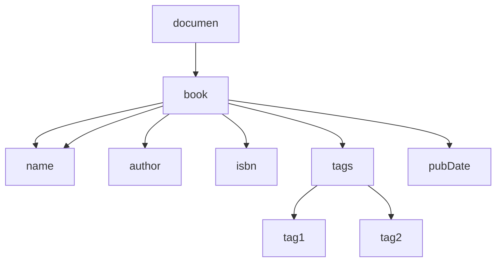

# 第03章 XML

XML是可扩展标记语言（eXtensible Markup Language）的缩写，它是一种数据表示格式，可以描述非常复杂的数据结构，常用于传输和存储数据。

一个描述书籍的XML文档可能如下：

```xml
<?xml version="1.0" encoding="UTF-8" ?>
<!DOCTYPE note SYSTEM "book.dtd">
<book id="1">
    <name>Java核心技术</name>
    <author>Cay S. Horstmann</author>
    <isbn lang="CN">1234567</isbn>
    <tags>
        <tag>Java</tag>
        <tag>Network</tag>
    </tags>
    <pubDate/>
</book>
```

XML特点：1. 纯文本，默认UTF-8编码；2. 可嵌套，适合表示结构化数据；3. 通过网络作为消息传输。

## XML的结构

```xml
<?xml version="1.0"?>
<!-- 文档类型DTD（Document Type Definition） 可选 -->
<!DOCTYPE note SYSTEM "book.dtd">
<!-- 文档内容 -->
<isbn lang="CN">1234567</isbn>
```

| 字符 | 表示    |
| :--- | :------ |
| <    | \&lt;   |
| >    | \&gt;   |
| &    | \&amp;  |
| "    | \&quot; |
| '    | \&apos; |

格式正确的XML（Well Formed）指XML的格式是正确的，可以被解析器正常读取。而合法的XML指不但XML格式正确，而且它的数据结构可以被DTD或者XSD验证。

XML要求严格的格式，任何没有正确嵌套的标签都会导致错误。

## 使用DOM

XML是一种树形结构的文档，它有两种标准的解析API：

- DOM：一次性读取XML，并在内存中表示为树形结构；
- SAX：以流的形式读取XML，使用事件回调。

DOM（Document Object Model）模型就是把XML结构作为一个树形结构处理，从根节点开始，每个节点都可以包含任意个子节点。DOM解析速度慢，内存占用大。

```java
<?xml version="1.0" encoding="UTF-8" ?>
<book id="1">
    <name>Java核心技术</name>
    <author>Cay S. Horstmann</author>
    <isbn lang="CN">1234567</isbn>
    <tags>
        <tag>Java</tag>
        <tag>Network</tag>
    </tags>
    <pubDate/>
</book>
```

解析为DOM结构，树形结构如下：



其中，`document`代表XML文档，是实际的根结点。

Java提供了DOM API来解析XML，它使用以下的对象来表示XML的内容：

- Document：代表整个XML文档；
- Element：代表XML元素；
- Attribute：代表元素的某个属性。

使用DOM API解析一个XML文档的代码如下：

```java
InputStream input = Main.class.getResourceAsStream("/book.xml");
DocumentBuilderFactory dbf = DocumentBuilderFactory.newInstance();
DocumentBuilder db = dbf.newDocumentBuilder();
// 解析一个XML，接收InputStream，File或者URL
Document doc = db.parse(input);
```

若XML解析无误，可以获得一个`Document`对象，该对象描述整个XML的树形结构：

```java
void printNode(Node n, int indent) {
    for (int i = 0; i < indent, i++) {
        System.out.println(' ');
    }
    switch (n.getNodeType()) {
    	case Node.DOCUMENT_NODE // Document结点
        	System.out.println("Document: " + n.getNodeName());
        break;
    case Node.ELEMENT_NODE: // 元素节点
        System.out.println("Element: " + n.getNodeName());
        break;
    case Node.TEXT_NODE: // 文本
        System.out.println("Text: " + n.getNodeName() + " = " + n.getNodeValue());
        break;
    case Node.ATTRIBUTE_NODE: // 属性
        System.out.println("Attr: " + n.getNodeName() + " = " + n.getNodeValue());
        break;
    default: // 其他
        System.out.println("NodeType: " + n.getNodeType() + ", NodeName: " + n.getNodeName());
    }
    for (Node child = n.getFirstChild(); child != null; child = child.getNextSibling()) {
        printNode(child, indent + 1);
    }
}
```

## 使用SAX

SAX（Simple API for XML）是一种基于流的解析方式，边读取XML边解析，并以事件回调的方式让调用者获取数据，占用的内存小。

SAX解析会触发一系列事件：

- startDocument：开始读取XML文档；
- startElement：读取到了一个元素，例如`<book>`；
- characters：读取到了字符；
- endElement：读取到了一个结束的元素，例如`</book>`；
- endDocument：读取XML文档结束。

使用SAX API解析XML，Java代码如下：

```java
InputStream input = Main.class.getResourceAsStream("/book.xml");
SAXParserFactory spf = SAXParserFactory.newInstance();
SAXParser saxParser = spf.newSAXParser();
saxParser.parse(input, new MyHandler());
```

关键代码`SAXParser.parse()`除了需要传入一个`InputStream`外，还需要传入一个回调对象，这个对象要继承自`DefaultHandler`：

```java
class MyHandler extends DefaultHandler {
    public void startDocument() throws SAXException {
        print("start document");
    }

    public void endDocument() throws SAXException {
        print("end document");
    }

    public void startElement(String uri, String localName, String qName, Attributes attributes) throws SAXException {
        print("start element:", localName, qName);
    }

    public void endElement(String uri, String localName, String qName) throws SAXException {
        System.out.println(attributes.getValue(0));
        for (int i = 0; i < attributes.getLength(); i++) {
            System.out.print(attributes.getLocalName(i)+"==");
            System.out.print(attributes.getValue(i));
            System.out.println();
        }
        print("end element:", localName, qName);
    }

    public void characters(char[] ch, int start, int length) throws SAXException {
        print("characters:", new String(ch, start, length));
    }

    public void error(SAXParseException e) throws SAXException {
        print("error:", e);
    }

    void print(Object... objs) {
        for (Object obj : objs) {
            System.out.print(obj);
            System.out.print(" ");
        }
        System.out.println();
    }
}
```

## 使用Jackson

观察XML文档的结构：

```xml
<?xml version="1.0" encoding="UTF-8" ?>
<book id="1">
    <name>Java核心技术</name>
    <author>Cay S. Horstmann</author>
    <isbn lang="CN">1234567</isbn>
    <tags>
        <tag>Java</tag>
        <tag>Network</tag>
    </tags>
    <pubDate/>
</book>
```

XML完全可以对应到一个定义好的JavaBean中：

```java
public class Book {
    public long id;
    public String name;
    public String author;
    public String isbn;
    public List<String> tags;
    public String pubDate;
}
```

开源的第三方库Jackson可以轻松做到XML到JavaBean的转换。

首先添加一个Maven的依赖：

```
com.fasterxml.jackson.dataformat:jackson-dataformat-xml:2.10.1
```

定义好JavaBean，就可使用以下代码解析：

```java
InputStream input = Main.class.getResourceAsStream("/book.xml");
// /表示classpath
JacksonXmlModule module = new JacksonXmlModule();
XmlMapper mapper = new XmlMapper(module);
Book book = mapper.readValue(input, Book.class);
System.out.println(book.id);
System.out.println(book.name);
System.out.println(book.author);
System.out.println(book.isbn);
System.out.println(book.tags);
System.out.println(book.pubDate);
```

## 使用JSON

JSON（JavaScript Object Notation）去除了所有JavaScript执行代码，只保留JavaScript的对象格式。典型JSON如下：

```json
{
    "id": 1,
    "name": "Java核心技术",
    "author": {
        "firstName": "Abc",
        "lastName": "Xyz"
    },
    "isbn": "1234567",
    "tags": ["Java", "Network"]
}
```

JSON作为数据传输的格式，有几个显著的优点：

- 允许使用UTF-8编码，不存在编码问题；
- 只允许使用双引号作为键，特殊字符用`\`转义，格式简单；
- 浏览器内置JSON支持，如果把数据用JSON发送给浏览器，可以用JavaScript直接处理。

浏览器直接支持使用JavaScript对JSON进行读写：

```java
// JSON string to JavaScript object:
jsObj = JSON.parse(jsonStr);

// JavaScript object to JSON string:
jsonStr = JSON.stringify(jsObj);
```

Jackson可以解析JSON。

```java
InputStream input = Jackson.class.getResourceAsStream("/book.json");
ObjectMapper mapper = new ObjectMapper();
// 反序列化时忽略不存在的JavaBean属性
mapper.configure(DeserializationFeature.FAIL_ON_UNKNOWN_PROPERTIES, false);
Book book = mapper.readValue(input, Book.class);
```

实现JavaBean到JSON的序列化：

```java
String json = mapper.writeValueAsString(book);
```

将日期解析为`LocalDate`，需要引入标准的JSR 310关于JavaTime的数据格式定义至Maven：

```
com.fasterxml.jackson.datatype:jackson-datatype-jsr310:2.12.0
```

```java
ObjectMapper mapper = new ObjectMapper().registerModule(new JavaTimeModule());
```

当内置的解析规则和扩展的解析规则不满足我们的需求，需要自定义解析。

```java
public class IsbnDeserializer extends JsonDeserializer<BigInteger> {
    public BigInteger deserialize(JsonParser p, DeserializationContext ctxt) throws IOException, JsonProcessingException {
        // 读取原始的JSON字符串内容:
        String s = p.getValueAsString();
        if (s != null) {
            try {
                return new BigInteger(s.replace("-", ""));
            } catch (NumberFormatException e) {
                throw new JsonParseException(p, s, e);
            }
        }
        return null;
    }
}
```

```java
public class Book {
    public String name;
    // 表示反序列化isbn时使用自定义的IsbnDeserializer:
    @JsonDeserialize(using = IsbnDeserializer.class)
    public BigInteger isbn;
}
```

在反序列化时，Jackson要求Java类（JavaBean）需要一个默认的无参数构造方法，否则，无法直接实例化此类。

> 对于`enum`字段，Jackson按String类型处理。
