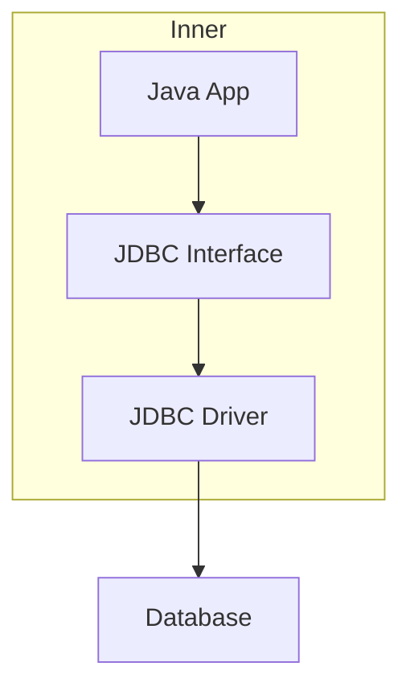
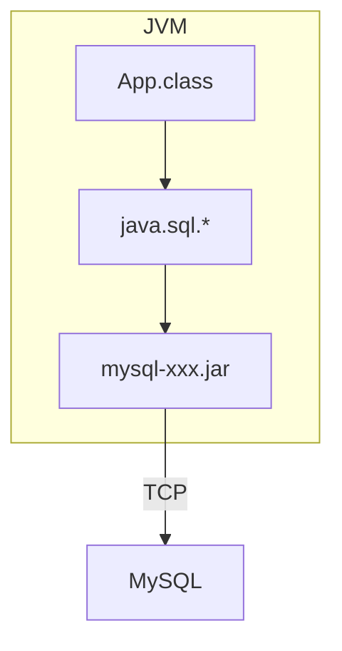

# 第05章 数据库编程

## JDBC简介

JDBC（Java DataBase Connectivity）是Java程序访问数据库的标准接口。



只需要引用Java标准库提供的java.sql包下面的相关接口，由此再间接地通过MySQL驱动的jar包通过网络访问MySQL服务器，所有复杂的网络通讯都被封装到JDBC驱动中。Java程序本身只需要引入一个MySQL驱动的jar包就可以正常访问MySQL服务器：



## JDBC查询

将实现JDBC接口的jar包称为JDBC驱动。

依赖类似如下结构：

```xml
<dependency>
    <groupId>mysql</groupId>
    <artifactId>mysql-connector-java</artifactId>
    <version>5.1.47</version>
    <scope>runtime</scope>
</dependency>
```

添加依赖的`scope`是`runtime`，因为运行时才使用jar包。编译时生成的`com.mysql.jdbc.Connection`易与Java标准库的JDBC接口混淆。

### JDBC连接

Connection代表一个JDBC连接，相当于Java程序到数据库的连接（通常是TCP连接）。

URL是由数据库厂商指定的格式，MySQL的URL为：

```
jdbc:mysql://<hostname>:<port>/<db>?key1=value1&key2=value2
```

```url
// 不使用SSL加密，使用UTF-8作为字符编码
jdbc:mysql://localhost:3306/learnjdbc?useSSL=false&characterEncoding=utf8
```

```java
// JDBC连接的URL
String JDBC_URL = "jdbc:mysql://localhost:3306/test";
String JDBC_USER = "root";
String JDBC_PASSWORD = "password";
// 获取连接
Connection conn = DriverManager.getConnection(JDBC_URL, JDBC_USER, JDBC_PASSWORD);

conn.close();
```

> `DriverManager`会自动扫描classpath，找到所有的JDBC驱动，然后根据我们传入的URL自动挑选一个合适的驱动。

因为JDBC连接是一种昂贵的资源，所以使用后要及时释放。

### JDBC查询

查询数据库分以下几步：

1. 通过`Connection`提供的`createStatement()`方法创建一个`Statement`对象，用于执行一个查询；
2. 执行`Statement`对象提供的`executeQuery("SELECT * FROM students")`并传入SQL语句，执行查询并获得返回的结果集，使用`ResultSet`来引用这个结果集；
3. 反复调用`ResultSet`的`next()`方法并读取每一行结果。

```java
try (Connection conn = DriverManager.getConnection(JDBC_URL, JDBC_USER, JDBC_PASSWORD)) {
    try (Statement stmt = conn.createStatement()) {
        try (ResultSet rs = stmt.executeQuery("SELECT id, grade, name, gender FROM student WHERE gender=1")) {
            while (rs.next()) {
                long id = rs.getLong(1); // 注意：索引从1开始
                long grade = rs.getLong(2);
                String name = rs.getString(3);
                int gender = rs.getInt(4);
                System.out.println(id + "\t" + grade + "\t" + name + "\t" + gender);
            }
        }
    }
}          
```

### SQL注入

```java
User login(String name, String pass) {
    ...
    stmt.executeQuery("SELECT * FROM user WHERE login='" + name + "' AND pass='" + pass + "'");
    ...
}
```

如果用户的输入是一个精心构造的字符串，且符合SQL规范，name = `"bob' OR pass="`, pass = `" OR pass='"`：

```sql
SELECT * FROM user WHERE login='bob' OR pass=' AND pass=' OR pass=''
```

此时，登录就形同虚设。

避免SQL注入攻击，可使用`PreparedStatement`。因为`PreparedStatement`始终使用`?`作为占位符，并且把数据连同SQL本身传给数据库。这样不仅保证每次传入的SQL语句相同，而且可以高效利用数据库本身对查询的缓存。

```java
try (Connection conn = DriverManager.getConnection(JDBC_URL, JDBC_USER, JDBC_PASSWORD)) {
    try (PreparedStatement ps = conn.prepareStatement("SELECT id, grade, name, gender FROM students WHERE gender=? AND grade=?")) {
        ps.setObject(1, "M"); // 注意：索引从1开始
        ps.setObject(2, 3);
        try (ResultSet rs = ps.executeQuery()) {
            while (rs.next()) {
                long id = rs.getLong("id");
                long grade = rs.getLong("grade");
                String name = rs.getString("name");
                String gender = rs.getString("gender");
            }
        }
    }
}
```

`Statement`查询结果总是`ResultSet`，即使使用聚合查询也不例外。

最新的JDBC驱动支持`LocalDate`和`LocalTime`。

## JDBC更新

### 插入

```java
try (Connection conn = DriverManager.getConnection(JDBC_URL, JDBC_USER, JDBC_PASSWORD)) {
    try (PreparedStatement ps = conn.prepareStatement(
            "INSERT INTO students (id, grade, name, gender) VALUES (?,?,?,?)")) {
        ps.setObject(1, 999); // 注意：索引从1开始
        ps.setObject(2, 1); // grade
        ps.setObject(3, "Bob"); // name
        ps.setObject(4, "M"); // gender
        int n = ps.executeUpdate(); // 1
    }
}
```

若数据库的表设置了自增主键，那么在执行`INSERT`语句时，并不需要指定主键，数据库会自动分配主键。

```java
try (Connection conn = DriverManager.getConnection(JDBC_URL, JDBC_USER, JDBC_PASSWORD)) {
    try (PreparedStatement ps = conn.prepareStatement(
            "INSERT INTO students (grade, name, gender, score) VALUES (?,?,?,?)",
            Statement.RETURN_GENERATED_KEYS)) {
        ps.setObject(1, 1); // grade
        ps.setObject(2, "Bob"); // name
        ps.setObject(3, 1); // gender
        ps.setObject(4, 100); // score
        int n = ps.executeUpdate(); // 1
        try (ResultSet rs = ps.getGeneratedKeys()) {
            if (rs.next()) {
                long id = rs.getLong(1); // 注意：索引从1开始
            }
        }
    }
}
```

### 更新

```java
try (Connection conn = DriverManager.getConnection(JDBC_URL, JDBC_USER, JDBC_PASSWORD)) {
    try (PreparedStatement ps = conn.prepareStatement("UPDATE students SET name=? WHERE id=?")) {
        ps.setObject(1, "Bob"); // 注意：索引从1开始
        ps.setObject(2, 999);
        int n = ps.executeUpdate(); // 返回更新的行数
    }
}
```

### 删除

```java
try (Connection conn = DriverManager.getConnection(JDBC_URL, JDBC_USER, JDBC_PASSWORD)) {
    try (PreparedStatement ps = conn.prepareStatement("DELETE FROM students WHERE id=?")) {
        ps.setObject(1, 999); // 注意：索引从1开始
        int n = ps.executeUpdate(); // 删除的行数
    }
}
```

## JDBC事务

数据库事务（Transaction）是由若干个SQL语句构成的一个操作序列。数据库事务具有ACID特性：

- Atomicity：原子性
- Consistency：一致性
- Isolation：隔离性
- Durability：持久性

| 事务隔离级别                 | 脏读 | 不可重复读 | 幻读 |
| ---------------------------- | ---- | ---------- | ---- |
| 读未提交（read-uncommitted） | 是   | 是         | 是   |
| 不可重复读（read-committed） | 否   | 是         | 是   |
| 可重复读（repeatable-read）  | 否   | 否         | 是   |
| 串行化（serializable）       | 否   | 否         | 否   |

在JDBC中执行事务，本质上就是如何把多条SQL包裹在一个数据库事务中执行。

```java
Connection con = DriverManager.getConnection(JDBC_URL, JDBC_USER, JDBC_PASSWORD);
try  {
    // 关闭自动提交
    con.setAutoCommit(false);
    // 执行多条SQL语句
    // 提交
    con.commit();
} catch (SQLException e) {
    // 回滚事务:
    con.rollback();
} finally {
    con.setAutoCommit(true);
    con.close();
}
```

如果要设定事务的隔离级别，可以使用如下代码：

```java
con.setTransactionIsolation(Connection.TRANSACTION_READ_COMMITTED);
```

## JDBC Batch

SQL数据库对SQL语句相同，但只有参数不同的若干语句可以作为batch执行，即批量执行，这种操作有特别优化，速度远远快于循环执行每个SQL。

```java
try (PreparedStatement ps = conn.prepareStatement("INSERT INTO students (name, gender, grade, score) VALUES (?, ?, ?, ?)")) {
    // 对同一个PreparedStatement反复设置参数并调用addBatch():
    for (Student s : students) {
        ps.setString(1, s.name);
        ps.setBoolean(2, s.gender);
        ps.setInt(3, s.grade);
        ps.setInt(4, s.score);
        ps.addBatch(); // 添加到batch
    }
    // 执行batch
    // 可获取每组参数执行后影响的结果数量
    int[] ns = ps.executeBatch();
    for (int n : ns) {
        System.out.println(n + " inserted."); // batch中每个SQL执行的结果数量
    }
}
```

## JDBC连接池

为了避免频繁地创建和销毁JDBC连接，可以通过连接池（Connection Pool）复用已经创建好的连接。

JDBC连接池有一个标准的接口`javax.sql.DataSource`，注意这个类位于Java标准库中，但仅仅是接口。要使用JDBC连接池，我们必须选择一个JDBC连接池的实现。常用的JDBC连接池有：

- HikariCP
- C3P0
- BoneCP
- Druid

```java
HikariConfig config = new HikariConfig();
config.setJdbcUrl("jdbc:mysql://localhost:3306/test");
config.setUsername("root");
config.setPassword("password");
config.addDataSourceProperty("connectionTimeout", "1000"); // 连接超时：1秒
config.addDataSourceProperty("idleTimeout", "60000"); // 空闲超时：60秒
config.addDataSourceProperty("maximumPoolSize", "10"); // 最大连接数：10
DataSource ds = new HikariDataSource(config);
```

通常`DataSource`实例总是作为一个全局变量存储，并贯穿整个应用程序的生命周期。

连接池内部维护了若干个`Connection`实例。第一次调用`ds.getConnection()`，会迫使连接池内部先创建一个`Connection`，再返回给客户端使用。当调用`conn.close()`方法时，不是真正关闭连接，而是释放到连接池中，以便下次获取连接时能直接返回。

