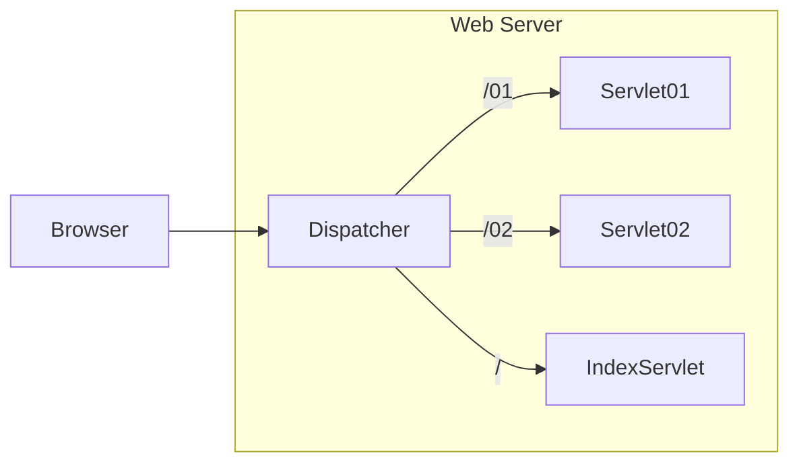
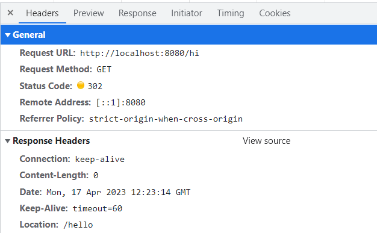
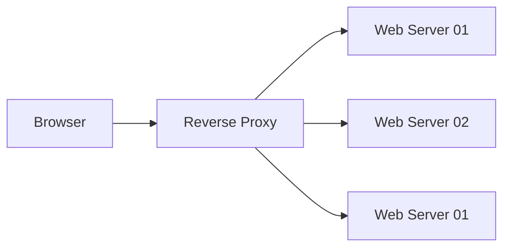
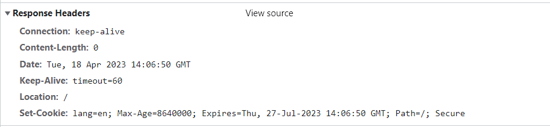
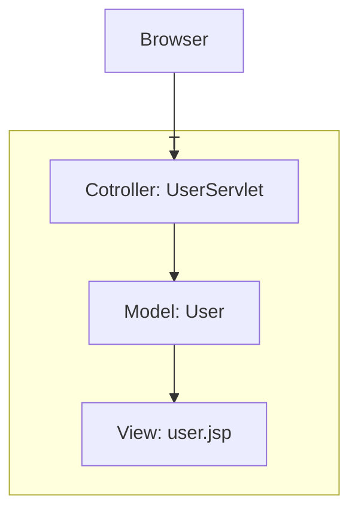
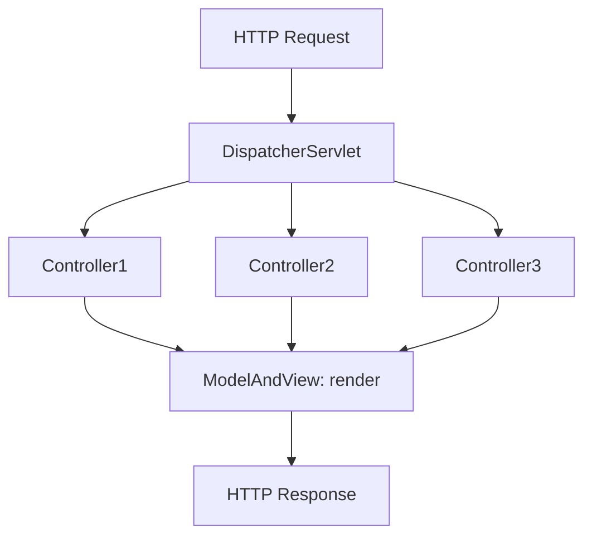

# 第08章 Web开发

## Web基础

大多数网站、APP均基于Browser/Server模式，简称BS架构，其特点是客户端只需要浏览器，应用程序的逻辑和数据都存储在服务器端。浏览器只需要请求服务器，获取Web页面，并将网页传输给用户即可。

### HTTP协议

HTTP协议是一个基于TCP协议之上的请求-响应协议。对于Browser来说，请求页面的流程如下：

1. 与服务器建立TCP连接；
2. 发送HTTP请求；
3. 收取HTTP响应，显示网页。

浏览器发送的HTTP请求如下：

```
GET / HTTP/1.1
// 请求的主机名
Host: www.sina.com.cn
// 标识客户端本身
User-Agent: Mozilla/5.0 xxx
// 浏览器能接收的资源类型
Accept: */*
// 浏览器偏好的语言
Accept-Language: zh-CN,zh;q=0.9,en-US;q=0.8
```

服务器的响应如下：

```
HTTP/1.1 200 OK
Content-Type: text/html
Content-Length: 21932
Content-Encoding: gzip
Cache-Control: max-age=300

<html>...网页数据...
```

服务器响应的首行是`版本号 响应代码 文本`。响应代码由程序识别，文本用于开发者调试。

常见的响应代码如下：

- 200 OK：表示成功；
- 301 Moved Permanently：表示该URL已经永久重定向；
- 302 Found：表示该URL需要临时重定向；
- 304 Not Modified：表示该资源没有修改，客户端可以使用本地缓存的版本；
- 400 Bad Request：表示客户端发送了一个错误的请求，例如参数无效；
- 401 Unauthorized：表示客户端因为身份未验证而不允许访问该URL；
- 403 Forbidden：表示服务器因为权限问题拒绝了客户端的请求；
- 404 Not Found：表示客户端请求了一个不存在的资源；
- 500 Internal Server Error：表示服务器处理时内部出错，例如因为无法连接数据库；
- 503 Service Unavailable：表示服务器此刻暂时无法处理请求。

服务器经常返回的HTTP Header包括：

- Content-Type：表示该响应内容的类型，例如`text/html`，`image/jpeg`；
- Content-Length：表示该响应内容的长度（字节数）；
- Content-Encoding：表示该响应压缩算法，例如`gzip`；
- Cache-Control：指示客户端应如何缓存，例如`max-age=300`表示可以最多缓存300秒。

HTTP请求和响应都由HTTP Header和HTTP Body构成，其中HTTP Header每行都以`\r\n`结束。若出现两个连续的`\r\n`，则后续为HTTP Body。

### 编写HTTP Server

```java
public class Server {
    public static void main(String[] args) throws IOException {
        // 监听指定端口
        ServerSocket ss = new ServerSocket(8080); 
        System.out.println("server is running...");
        for (;;) {
            Socket sock = ss.accept();
            System.out.println("connected from " + sock.getRemoteSocketAddress());
            Thread t = new Handler(sock);
            t.start();
        }
    }
}

class Handler extends Thread {
    Socket sock;

    public Handler(Socket sock) {
        this.sock = sock;
    }

    public void run() {
        try (InputStream input = this.sock.getInputStream()) {
            try (OutputStream output = this.sock.getOutputStream()) {
                handle(input, output);
            }
        } catch (Exception e) {
            try {
                this.sock.close();
            } catch (IOException ioe) {
            }
            System.out.println("client disconnected.");
        }
    }

    private void handle(InputStream input, OutputStream output) throws IOException {
        var reader = new BufferedReader(new InputStreamReader(input, StandardCharsets.UTF_8));
        var writer = new BufferedWriter(new OutputStreamWriter(output, StandardCharsets.UTF_8));
        // TODO: 处理HTTP请求
    }
}
```

在`handle()`方法中，用Reader读取HTTP请求，用Writer发送HTTP响应，即可实现一个最简单的HTTP服务器。

```java
private void handle(InputStream input, OutputStream output) throws IOException {
    var reader = new BufferedReader(new InputStreamReader(input, StandardCharsets.UTF_8));
    var writer = new BufferedWriter(new OutputStreamWriter(output, StandardCharsets.UTF_8));
    // 读取http请求
    boolean requestOk = false;
    String first = reader.readLine();
    if (first.startsWith("GET /HTTP/1.")) {
        requestOk = true;
    }
    for (;;) {
        String header = reader.readLine();
        // 读取到空行，http header读取完毕
        if (header.isEmpty()) {
            break;
        }
        System.out.println(header);
    }
    System.out.println(requestOk ? "Response OK" : "Respond Error");
    if (!requestOk) {
        writer.write("HTTP/1.0 404 Not Found\r\n");
        writer.write("Content-Length: 0\r\n");
        writer.write("\r\n");
    } else {
        String data = "<html><body><h1>Hello, World!</h1></body></html>";
        int length = data.getBytes(StandardCharsets.UTF_8).length;
        writer.write("HTTP/1.0 200 OK\r\n");
        writer.write("Connection: close\r\n");
        writer.write("Content-Type: text/html\r\n");
        writer.write("Content-Length: " + length + "\r\n");
        writer.write("\r\n");
        writer.write(data);
        writer.flush();
    }
}
```

HTTP`1.0`是早期版本，浏览器每次建立TCP连接后，**只发送一个HTTP请求并接收一个**HTTP响应，然后关闭TCP连接。由于创建TCP连接本身就需要消耗一定的时间，因此，HTTP 1.1允许浏览器和服务器在同一个TCP连接上反复发送、接收多个HTTP请求和响应，这样就大大提高了传输效率。

HTTP 2.0可以支持浏览器同时发出多个请求，但每个请求需要唯一标识，服务器可以不按请求的顺序返回多个响应，由浏览器自己把收到的响应和请求对应。

HTTP 3.0为了进一步提高速度，将抛弃TCP协议，改为使用无需创建连接的UDP协议，目前HTTP 3.0仍然处于实验阶段。

## Servlet入门

JavaEE提供了Servlet API，使用Servlet API编写Servlet来处理HTTP请求，Web服务器实现Servlet API接口，实现底层功能。

```java
@WebServlet(urlPatterns = "/")
public class HelloServlet extends HttpServlet {
    protected void doGet(HttpServletRequest req, HttpServletResponse resp)
            throws ServletException, IOException {
        // 设置响应类型
        resp.setContentType("text/html");
        // 获取输出流
        PrintWriter pw = resp.getWriter();
        // 写入响应
        pw.write("<h1>Hello, world!</h1>");
        // 强制输出
        pw.flush();
    }
}
```

一个Servlet总是继承自`HttpServlet`，覆写`doGet()`或`doPost()`方法。

Servlet API是一个jar包，可通过Maven导入：

```xml
<dependency>
    <groupId>jakarta.servlet</groupId>
    <artifactId>jakarta.servlet-api</artifactId>
    <version>5.0.0</version>
    <scope>provided</scope>
</dependency>
```

### Servlet版本

4.0及之前的`servlet-api`由Oracle官方维护，引入的依赖项是`javax.servlet:javax.servlet-api`，编写代码时引入的包名为：

```
import javax.servlet.*;
```

而5.0及以后的`servlet-api`由Eclipse开源社区维护，引入的依赖项为`jakarta.servlet:jakarta.servlet-api`，编写代码时引入的包名为：

```
import jakarta.servlet.*;
```

打包类型不是`jar`，而是`war`，表示Java Web Application Archive：

```xml
<packaging>war</packaging>
```

整个项目结构如下：

```ascii
web-servlet-hello
├── pom.xml
└── src
    └── main
        ├── java
        │   └── com
        │       └── itranswarp
        │           └── learnjava
        │               └── servlet
        │                   └── HelloServlet.java
        ├── resources
        └── webapp
```

运行Maven命令`mvn clean package`，在`target`目录下得到一个`hello.war`文件，该是我们编译打包后的Web应用程序。

运行`war`文件，必须先启动Web服务器，再由Web服务器加载我们编写的`HelloServlet`，这样可以使`HelloServlet`处理浏览器发送的请求。

常用的服务器有：

- [Tomcat](https://tomcat.apache.org/)：由Apache开发的开源免费服务器；
- [Jetty](https://www.eclipse.org/jetty/)：由Eclipse开发的开源免费服务器；
- [GlassFish](https://javaee.github.io/glassfish/)：一个开源的全功能JavaEE服务器。

将`hello.war`复制到Tomcat的`webapps`目录下，然后切换到`bin`目录，执行`startup.sh`或`startup.bat`启动Tomcat服务器。

第一级目录`/hello`表示Web App的名字，后面的`/`才是我们在`HelloServlet`中映射的路径。

> http://localhost:8080/manager 用于部署Web应用于服务器。

实际上，类似Tomcat的服务器也是Java编写的，启动Tomcat服务器实际上是启动Java虚拟机，执行Tomcat的`main()`方法，然后由Tomcat负责加载我们的`.war`文件，并创建一个`HelloServlet`实例，最后以多线程的模式来处理HTTP请求。如果Tomcat服务器收到的请求路径是`/`（假定部署文件为ROOT.war），就转发到`HelloServlet`并传入`HttpServletRequest`和`HttpServletResponse`两个对象。

在`doGet()`或`doPost()`方法中，如果使用了`ThreadLocal`，但没有清理，那么它的状态很可能会影响到下次的某个请求，因为Servlet容器很可能用线程池实现线程复用。故正确编写Servlet，要清晰理解Java的多线程模型，需要同步访问的必须同步。

## Servlet开发

Tomcat的启动流程如下：

1. 启动JVM并执行Tomcat的`main()`方法；
2. 加载war并初始化Servlet；
3. 正常服务。

新建一个`web-servlet-embedded`工程，编写`pom.xml`如下：

```xml
<project xmlns="http://maven.apache.org/POM/4.0.0"
    xmlns:xsi="http://www.w3.org/2001/XMLSchema-instance"
    xsi:schemaLocation="http://maven.apache.org/POM/4.0.0 http://maven.apache.org/xsd/maven-4.0.0.xsd">
    <modelVersion>4.0.0</modelVersion>

    <groupId>com.itranswarp.learnjava</groupId>
    <artifactId>web-servlet-embedded</artifactId>
    <version>1.0-SNAPSHOT</version>
    <packaging>war</packaging>

    <properties>
        <project.build.sourceEncoding>UTF-8</project.build.sourceEncoding>
        <project.reporting.outputEncoding>UTF-8</project.reporting.outputEncoding>
        <maven.compiler.source>17</maven.compiler.source>
        <maven.compiler.target>17</maven.compiler.target>
        <java.version>17</java.version>
        <tomcat.version>10.1.1</tomcat.version>
    </properties>

    <dependencies>
        <dependency>
            <groupId>org.apache.tomcat.embed</groupId>
            <artifactId>tomcat-embed-core</artifactId>
            <version>10.1.7</version>
            <scope>provided</scope>
        </dependency>
        <dependency>
            <groupId>org.apache.tomcat.embed</groupId>
            <artifactId>tomcat-embed-jasper</artifactId>
            <version>${tomcat.version}</version>
            <scope>provided</scope>
        </dependency>
    </dependencies>
</project>
```

当8080端口被占用时，使用命令：

```sh
C:\Windows\System32>netstat -ano|findstr "8080"
  TCP    0.0.0.0:8080           0.0.0.0:0              LISTENING       19784
  TCP    10.118.228.95:58080    113.200.67.200:53      TIME_WAIT       0
  TCP    [::]:8080              [::]:0                 LISTENING       19784

C:\Windows\System32>taskkill /f /t /im 19784
成功: 已终止 PID 8616 (属于 PID 19784 子进程)的进程。
成功: 已终止 PID 19784 (属于 PID 10968 子进程)的进程。
```

```java
不必引入Servlet API，因为引入Tomcat依赖后自动引入了Servlet API。因此，我们可以正常编写Servlet如下：

@WebServlet(urlPatterns = "/")
public class HelloServlet extends HttpServlet {
    protected void doGet(HttpServletRequest req, HttpServletResponse resp) throws ServletException, IOException {
        resp.setContentType("text/html");
        String name = req.getParameter("name");
        if (name == null) {
            name = "world";
        }
        PrintWriter pw = resp.getWriter();
        pw.write("<h1>Hello, " + name + "!</h1>");
        pw.flush();
    }
}
```

编写一个`main()`方法，启动Tomcat服务器：

```
public class Main {
    public static void main(String[] args) throws Exception {
        // 启动Tomcat:
        Tomcat tomcat = new Tomcat();
        tomcat.setPort(Integer.getInteger("port", 8080));
        tomcat.getConnector();
        // 创建webapp:
        Context ctx = tomcat.addWebapp("", new File("src/main/webapp").getAbsolutePath());
        WebResourceRoot resources = new StandardRoot(ctx);
        resources.addPreResources(
                new DirResourceSet(resources, "/WEB-INF/classes", new File("target/classes").getAbsolutePath(), "/"));
        ctx.setResources(resources);
        tomcat.start();
        tomcat.getServer().await();
    }
}
```

直接运行`main()`方法，即可启动嵌入式Tomcat服务器，然后，通过预设的`tomcat.addWebapp("", new File("src/main/webapp")`，Tomcat会自动加载当前工程作为根webapp，可直接在浏览器访问`http://localhost:8080/`。

通过`main()`方法启动Tomcat服务器并加载我们自己的webapp有如下好处：

1. 启动简单，无需下载Tomcat或安装任何IDE插件；
2. 调试方便，可在IDE中使用断点调试；
3. 使用Maven创建war包后，也可以正常部署到独立的Tomcat服务器中。

## Servlet进阶

一个Web App就是由一个或多个Servlet组成的，每个Servlet通过注解说明自己能处理的路径。例如：

```java
// 处理/hello路径的请求
@WebServlet(urlPatterns = "/hello")
public class HelloServlet extends HttpServlet {
    ...
}
```

>  早期的Servlet需要在web.xml中配置映射路径，但最新Servlet版本只需要通过注解即可完成映射。

因为浏览器发送请求时，伴随请求方法（HTTP Method）：即GET、POST、PUT等不同类型的请求。因此，要处理GET请求，我们要覆写`doGet/Post()`方法。

若没有覆盖请求方法，会直接返回405或400错误。

一个Webapp可以有多个Servlet，分别映射不同的路径。



根据路径转发的功能称为Dispatch。映射到`/`的`IndexServlet`比较特殊，它实际上会接收所有未匹配的路径，相当于`/*`，因为Dispatcher的逻辑可以用伪代码实现如下：

```java
String path = ...
if (path.equals("/hello")) {
    dispatchTo(helloServlet);
} else if (path.equals("/signin")) {
    dispatchTo(signinServlet);
} else {
    // 所有未匹配的路径均转发到"/"
    dispatchTo(indexServlet);
}
```

### HttpServletRequest

`HttpServletRequest`封装了一个HTTP请求，它实际上是从`ServletRequest`继承而来。最早设计Servlet时，设计者希望Servlet不仅能处理HTTP，也能处理类似SMTP等其他协议，因此，单独抽出了`ServletRequest`接口，但实际上除了HTTP外，并没有其他协议会用Servlet处理，所以这是一个过度设计。

我们通过`HttpServletRequest`提供的接口方法可以拿到HTTP请求的几乎全部信息，常用的方法有：

- `getMethod()`：返回请求方法，例如，`"GET"`，`"POST"`；
- `getRequestURI()`：返回请求路径，但不包括请求参数，例如，`"/hello"`；
- `getQueryString()`：返回请求参数，例如，`"name=Bob&a=1&b=2"`；
- `getParameter(name)`：返回请求参数，GET请求从URL读取参数，POST请求从Body中读取参数；
- `getContentType()`：获取请求Body的类型，例如，`"application/x-www-form-urlencoded"`；
- `getContextPath()`：获取当前Webapp挂载的路径，对于ROOT来说，总是返回空字符串`""`；
- `getCookies()`：返回请求携带的所有Cookie；
- `getHeader(name)`：获取指定的Header，对Header名称不区分大小写；
- `getHeaderNames()`：返回所有Header名称；
- `getInputStream()`：如果该请求带有HTTP Body，该方法将打开一个输入流用于读取Body；
- `getReader()`：与getInputStream()类似，但返回`Reader`；
- `getRemoteAddr()`：返回客户端的IP地址；
- `getScheme()`：返回协议类型，例如，`"http"`，`"https"`；

### HttpServletResponse

`HttpServletResponse`封装了一个HTTP响应。由于HTTP响应必须先发送Header，再发送Body，所以，操作`HttpServletResponse`对象时，必须先调用设置Header的方法，最后调用发送Body的方法。

- `setStatus(sc)`：设置响应代码，默认是`200`；
- `setContentType(type)`：设置Body的类型，例如，`"text/html"`；
- `setCharacterEncoding(charset)`：设置字符编码，例如，`"UTF-8"`；
- `setHeader(name, value)`：设置一个Header的值；
- `addCookie(cookie)`：给响应添加一个Cookie；
- `addHeader(name, value)`：给响应添加一个Header，因为HTTP协议允许有多个相同的Header；

写入响应时，需要通过`getOutputStream()`获取写入流，或者通过`getWriter()`获取字符流，二者只能获取其中一个。

写入响应前，无需设置`setContentLength()`，因为底层服务器会根据写入的字节数自动设置，如果写入的数据量很小，实际上会先写入缓冲区，如果写入的数据量很大，服务器会自动采用`Chunked编码`让浏览器能识别数据结束符而不需要设置Content-Length头。

写入完毕后必须调用`flush`。因为大部分Web服务器都基于HTTP/1.1协议，会复用TCP连接。如果没有调用`flush()`，将导致缓冲区的内容无法及时发送到客户端。

### Servlet多线程模型

一个Servlet类在服务器中只有一个实例，但对于每个HTTP请求，Web服务器会使用多线程执行请求。因此，一个Servlet的`doGet()`、`doPost()`等处理请求的方法是多线程并发执行的。如果Servlet中定义了字段，要注意多线程并发访问的问题：

```java
public class HelloServlet extends HttpServlet {
    private Map<String, String> map = new ConcurrentHashMap<>();

    protected void doGet(HttpServletRequest req, HttpServletResponse resp) throws ServletException, IOException {
        // 注意读写map字段是多线程并发的:
        this.map.put(key, value);
    }
}
```

对于每个请求，Web服务器会创建唯一的`HttpServletRequest`和`HttpServletResponse`实例，因此，`HttpServletRequest`和`HttpServletResponse`实例只有在当前处理线程中有效，它们总是局部变量，不存在多线程共享的问题。

### 重定向

重定向是指当浏览器请求一个URL时，服务器返回一个重定向指令，告知浏览器地址变更，需要使用新的URL再重新发送新请求。

```java
@WebServlet(urlPatterns = "/hi")
public class RedirectServlet extends HttpServlet {
    protected void doGet(HttpServletRequest req, HttpServletResponse resp) throws ServletException, IOException {
        // 构造重定向的路径
        String name = req.getParameter("name");
        String redirectToUrl = "/hello" + (name == null ? "" : "?name=" + name);
        // 发送重定向响应
        resp.sendRedirect(redirectToUrl);
    }
}
```

若浏览器发送`GET /hi`请求，`RedirectServlet`将处理此请求。由于`RedirectServlet`在内部又发送了重定向响应，因此，浏览器会收到如下响应：

```
HTTP/1.1 302 Found
Location: /hello
```



当浏览器收到302响应后，它会立刻根据`Location`的指示发送一个新的`GET /hello`请求，这个过程就是重定向。

并且浏览器的地址栏路径自动更新为`/hello`。

重定向有两种：一种是302响应，称为临时重定向，一种是301响应，称为永久重定向。重定向的目的是当Web应用升级后，如果请求路径发生了变化，可以将原来的路径重定向到新路径，从而避免浏览器请求原路径找不到资源。

`HttpServletResponse`提供了快捷的`redirect()`方法实现302重定向。若要实现301永久重定向，可写为：

```
resp.setStatus(HttpServletResponse.SC_MOVED_PERMANENTLY); // 301
resp.setHeader("Location", "/hello");
```

### 转发

Forward是指内部转发。当一个Servlet处理请求的时候，它可以决定自己不继续处理，而是转发给另一个Servlet处理。

例如，我们已经编写了一个能处理`/hello`的`HelloServlet`，继续编写一个能处理`/morning`的`ForwardServlet`：

```java
@WebServlet(urlPatterns = "/morning")
public class ForwardServlet extends HttpServlet {
    protected void doGet(HttpServletRequest req, HttpServletResponse resp) throws ServletException, IOException {
        req.getRequestDispatcher("/hello").forward(req, resp);
    }
}
```

### 使用Session

将基于唯一ID识别用户身份的机制称为Session。每个用户第一次访问服务器后，会自动获得一个Session ID。如果用户在一段时间内没有访问服务器，那么Session会自动失效。JavaEE的Servlet机制内建了对Session的支持。

```java
@WebServlet(urlPatterns = "/signin")
public class SignInServlet extends HttpServlet {
    // 模拟数据库
    private Map<String, String> users = Map.of("bob", "bob123", "alice", "alice123", "tom", "tomcat");
    // Get请求时显示登录页面
    protected void doGet(HttpServletRequest req, HttpServletResponse resp) throws ServletException, IOException {
        resp.setContentType("text/html");
        PrintWriter pw = resp.getWriter();
        pw.write("<h1>Sign In</h1>");
        pw.write("<form action=\"/signin\" method=\"post\">");
        pw.write("<p>Username: <input name=\"username\"></p>");
        pw.write("<p>Password: <input name=\"password\" type=\"password\"></p>");
        pw.write("<p><button type=\"submit\">Sign In</button> <a href=\"/\">Cancel</a></p>");
        pw.write("</form>");
        pw.flush();
    }

    // POST请求时处理用户登录
    protected void doPost(HttpServletRequest req, HttpServletResponse resp) throws IOException {
        String name = req.getParameter("username");
        String password = req.getParameter("password");
        String exceptedPassword = users.get(name);
        if (exceptedPassword != null && exceptedPassword.equals(password)) {
            // 登录成功
            req.getSession().setAttribute("user", name);
            resp.sendRedirect("/");
        } else {
            resp.sendError(HttpServletResponse.SC_FORBIDDEN);
        }
    }
}
```

上述`SignInServlet`在判断用户登录成功后，立刻将用户名放入当前`HttpSession`中：

```
HttpSession session = req.getSession();
session.setAttribute("user", name);
```

在`IndexServlet`中，可以从`HttpSession`取出用户名：

```java
@WebServlet(urlPatterns = "/*")
public class IndexServlet extends HttpServlet {
    protected void doGet(HttpServletRequest req, HttpServletResponse resp) throws IOException {
        String user = (String) req.getSession().getAttribute("user");
        resp.setContentType("text/html");
        resp.setCharacterEncoding("UTF-8");
        resp.setHeader("X-Powered-By", "Java EE Servlet");
        PrintWriter pw = resp.getWriter();
        pw.write("<h1>Welcome, " + (user != null ? user : "Guest") + "</h1>");
        if (user == null) {
            pw.write("<p><a href=\"/signin\">Sign In</a></p>");
        } else {
            // 已登录，显示登出链接:
            pw.write("<p><a href=\"/signout\">Sign Out</a></p>");
        }
        pw.flush();
    }
}
```

如果用户已登录，可以通过访问`/signout`登出。登出逻辑为从`HttpSession`中移除用户相关信息：

```java
@WebServlet(urlPatterns = "/signout")
public class SignOutServlet extends HttpServlet {
    protected void doGet(HttpServletRequest req, HttpServletResponse resp) throws ServletException, IOException {
        // 从HttpSession移除用户名
        req.getSession().removeAttribute("user");
        resp.sendRedirect("/");
    }
}
```

对于Web应用程序而言，总是通过`HttpSession`访问当前Session。可认为Web服务器在内存中自动维护了一个ID到`HttpSession`的映射表。

而服务器识别Session的关键就是依靠一个名为`JSESSIONID`的Cookie。在Servlet中第一次调用`req.getSession()`时，Servlet容器自动创建一个Session ID，然后通过一个名为`JSESSIONID`的Cookie发送给浏览器：


`JSESSIONID`是由Servlet容器自动创建的，目的是维护一个浏览器会话，它和我们的登录逻辑没有关系；

登录和登出的业务逻辑是我们自己根据·`HttpSession`是否存在一个`"user"`的Key判断的，登出后，Session ID并不会改变；

即使没有登录功能，仍然可以使用`HttpSession`追踪用户，例如，放入一些用户配置信息等。

除了使用Cookie机制可以实现Session外，还可以通过隐藏表单、URL末尾附加ID来追踪Session。这些机制很少使用，最常用的Session机制仍然是Cookie。

使用Session时，由于服务器把所有用户的Session都存储在内存中，如果遇到内存不足的情况，就需要把部分不活动的Session序列化到磁盘上，这会大大降低服务器的运行效率，因此，放入Session的对象要小，通常放入简单`User`类即可：

```java
public class User {
     // 唯一标识
    public long id;
    public String email;
    public String name;
}
```

在使用多台服务器构成集群时，使用Session会遇到一些额外的问题。通常，多台服务器集群使用反向代理作为网站入口：



若多台Web Server采用无状态集群，那么反向代理总是以轮询方式将请求依次转发给每台Web Server，这会造成一个用户在Web Server 01存储的Session信息，在Web Server 02和03上并不存在，即从Web Server 01登录后，如果后续请求被转发到Web Server 02或03，那么用户显示仍为未登录状态。

要解决这个问题，方案一是在所有Web Server之间进行Session复制，但这样会严重消耗网络带宽，并且，每个Web Server的内存均存储所有用户的Session，内存使用率很低。

Session适用于中小型Web应用程序。对于大型Web应用程序来说，通常需要避免使用Session机制。

### Cookie

Servlet提供的`HttpSession`本质上是通过一个名为`JSESSIONID`的Cookie（存储在本地终端的数据）来跟踪用户会话。

```java
@WebServlet(urlPatterns = "/pref")
public class LanguageServlet extends HttpServlet {

    private static final Set<String> LANGUAGES = Set.of("en", "zh");

    protected void doGet(HttpServletRequest req, HttpServletResponse resp) throws ServletException, IOException {
        String lang = req.getParameter("lang");
        if (LANGUAGES.contains(lang)) {
            // 创建一个新的Cookie:
            Cookie cookie = new Cookie("lang", lang);
            // 该Cookie生效的路径范围
            cookie.setPath("/");
            // 该Cookie有效期
            cookie.setMaxAge(8640000); // 8640000秒=100天
            cookie.setSecure(true); // 在浏览器使用
            // 将该Cookie添加到响应
            resp.addCookie(cookie);
        }
        resp.sendRedirect("/");
    }
}
```



若要读取Cookie，例如，在`IndexServlet`中，读取名为`lang`的Cookie以获取用户设置的语言，可编写方法如下：

```java
private String parseLanguageFromCookie(HttpServletRequest req) {
    // 获取请求附带的所有Cookie:
    Cookie[] cookies = req.getCookies();
    // 如果获取到Cookie:
    if (cookies != null) {
        // 循环每个Cookie:
        for (Cookie cookie : cookies) {
            // 如果Cookie名称为lang:
            if (cookie.getName().equals("lang")) {
                // 返回Cookie的值:
                return cookie.getValue();
            }
        }
    }
    // 返回默认值:
    return "en";
}
```

读取Cookie主要依靠遍历`HttpServletRequest`附带的所有Cookie。

## JSP开发

JSP（Java Server Pages）必须放到`/src/main/webapp`下，文件名必须以`.jsp`结尾，整个文件与HTML并无太大区别，但需要插入变量，或者动态输出的地方，使用特殊指令`<% ... %>`。

```html
<html>
<head>
    <title>Hello World - JSP</title>
</head>
<body>
    <%-- JSP Comment --%>
    <h1>Hello World!</h1>
    <p>
    <%
         out.println("Your IP address is ");
    %>
    <span style="color:red">
        <%= request.getRemoteAddr() %>
    </span>
    </p>
</body>
</html>
```

- 包含在`<%--`和`--%>`之间为JSP的注释；
- 包含在`<%`和`%>`之间的是Java代码，可以编写任意Java代码；
- 使用`<%= xxx %>`可以快捷输出一个变量的值。

JSP页面内置变量表示当前Servlet对象：

- out：表示`HttpServetResponse`的`PrintWriter`；
- session：表示**当前**`HttpSession`对象；
- request：表示`HttpServletRequest`对象。

访问JSP页面时，直接指定完整路径。例如，`http://localhost:8080/hello.jsp`。jsp放置在`webapp`目录下。

JSP和Servlet没有任何区别，在`tomcat`目录的临时目录下，可以找到一个`hello_jsp.java`的源文件。

JSP是无需配置映射路径的Servlet，Web Server会根据路径查找对应的`.jsp`文件，自动编译成Servlet再执行。

### JSP高级功能

JSP页面本身可以通过`page`指令引入Java类：

```html
<%@ page import="java.io.*" %>
<%@ page import="java.util.*" %>
```

使用`include`指令可以引入另一个JSP文件：

```html
<html>
<body>
    <%@ include file="header.jsp"%>
    <h1>Index Page</h1>
    <%@ include file="footer.jsp"%>
</body>
```

### JSP Tag

JSP还允许自定义输出的tag，例如：

```html
<c:out value = "${sessionScope.user.name}"/>
```

JSP Tag需要正确引入taglib的jar包，并且还需要正确声明，使用起来非常复杂，对于页面开发来说，不推荐使用JSP Tag，

JSP本身目前已经很少使用，只需要了解其基本用法即可。

## MVC开发

MVC（Model-View-Controller）制性地使应用程序的输入、处理和输出分离。使用MVC应用程序被分成三个核心部件：模型、视图、控制器。

```javas
@WebServlet(urlPatterns = "/user")
public class UserServlet extends HttpServlet {
    protected void doGet(HttpServletRequest req, HttpServletResponse resp) throws ServletException, IOException {
        // 模拟数据库读取数据
        School school = new School("No.1 Middle School", "101 South Street");
        User user = new User(123, "Bob", school);
        // 放入Request中
        req.setAttribute("user", user);
        // forward给user.jsp
        req.getRequestDispatcher("/WEB-INF/user.jsp").forward(req, resp);
    }
}
```

在`user.jsp`中，我们只负责展示相关JavaBean的信息，不需要编写访问数据库等复杂逻辑：

> WEB-INF 是 Java web 应用的安全目录。所谓安全指客户端无法访问，只有服务端可访问的目录。一般位于webapp目录。

在浏览器访问`http://localhost:8080/user`，请求首先由`UserServlet`处理，然后交给`user.jsp`渲染：

```html
<html>
<head>
    <title>Hello World - JSP</title>
</head>
<body>
<h1>Hello <%= user.name %>!</h1>
<p>School Name:
    <span style="color:red">
        <%= user.school.name %>
    </span>
</p>
<p>School Address:
    <span style="color:red">
        <%= user.school.address %>
    </span>
</p>
</body>
</html>
```



## MVC高级开发

通过结合Servlet和JSP的MVC模式，可以发挥二者各自的优点：

- Servlet实现业务逻辑；
- JSP实现展示逻辑。

但直接把MVC搭在Servlet和JSP之上仍存在缺陷，原因如下：

- Servlet提供的接口仍然偏底层，需要实现Servlet调用相关接口；
- JSP对页面开发不友好，更好的替代品是模板引擎；
- 业务逻辑最好由纯粹的Java类实现，而不是强迫继承自Servlet。

### 设计MVC框架

```java
public class UserController {
    @GetMapping("/signin")
    public ModelAndView signin() {
        ...
    }

    @PostMapping("/signin")
    public ModelAndView doSignin(SignInBean bean) {
        ...
    }

    @GetMapping("/signout")
    public ModelAndView signout(HttpSession session) {
        ...
    }
}
```

实际上`View`即模板的路径，而`Model`使用用`Map<String, Object>`表示，因此，`ModelAndView`定义如下：

```java
public class ModelAndView {
    Map<String, Object> model;
    String view;
}
```

设计MVC框架时，需要创建一个接收所有请求的`Servlet`（`DispatcherServlet`），它总是映射到`/`，然后，根据不同的Controller的方法定义的`@Get`或`@Post`的Path决定调用哪个方法，最后，获得方法返回的`ModelAndView`后，渲染模板，写入`HttpServletResponse`，即完成了整个MVC的处理。



首先，需要存储请求路径到某个具体方法的映射：

```java
@WebServlet(urlPatterns = "/")
public class DispatcherServlet extends HttpServlet {
    private Map<String, GetDispatcher> getMappings = new HashMap<>();
    private Map<String, PostDispatcher> postMappings = new HashMap<>();
}
```

