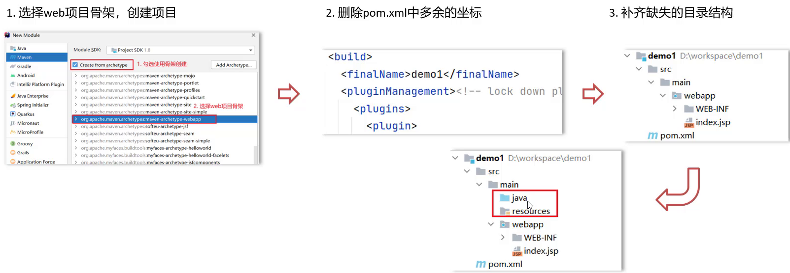

# 第08章 Web开发

## Web技术

### B/S架构

大多数网站、APP均基于Browser/Server模式，简称BS架构，其特点是客户端只需要浏览器，应用程序的逻辑和数据都存储在服务器端。浏览器只需要请求服务器，获取Web页面，并将网页传输给用户即可。

### 静态资源

静态资源主要包含HTML、CSS、JavaScript、图片等，主要负责页面的展示。

### 动态资源

动态资源主要包含Servlet、JSP等，主要用来负责逻辑处理。

动态资源处理完逻辑后会把得到的结果交给静态资源来进行展示，动态资源和静态资源要结合一起使用。

### HTTP协议

HTTP（HyperText Transfer Protocol）协议是一个基于TCP协议之上的请求-响应协议。

HTTP特点如下：

* 基于TCP协议：面向连接，安全

* 基于请求-响应模型：一次请求对应一次响应

* HTTP协议是无状态协议:对于事物处理没有记忆能力。每次请求-响应都是独立的。

  * 缺点:多次请求间不能共享数据
  * 优点:速度快

对于Browser来说，请求页面的流程如下：

1. 与服务器建立TCP连接；
2. 发送HTTP请求；
3. 收取HTTP响应，显示网页。

请求数据格式分为三部分：

- **请求行**

  GET[请求方式] /[请求URL路径] HTTP/1.1[HTTP协议及版本]

- **请求头**

  格式为key: value形式。请求头中会包含若干个属性，常见的HTTP请求头有：

  ```
  Host: 表示请求的主机名
  User-Agent: 浏览器版本,例如Chrome浏览器的标识类似Mozilla/5.0 ...Chrome/79，IE浏览器的标识类似Mozilla/5.0 (Windows NT ...)like Gecko；
  Accept：表示浏览器能接收的资源类型，如text/*，image/*或者*/*表示所有；
  Accept-Language：表示浏览器偏好的语言，服务器可以据此返回不同语言的网页；
  Accept-Encoding：表示浏览器可以支持的压缩类型，例如gzip, deflate等。
  ```

- **请求体**

  POST请求特有，使用`&`分隔请求内容。

浏览器发送的HTTP请求如下：

```
POST / HTTP/1.1
// 请求的主机名
Host: www.sina.com.cn
// 标识客户端本身
User-Agent: Mozilla/5.0 xxx
// 浏览器能接收的资源类型
Accept: */*
// 浏览器偏好的语言
Accept-Language: zh-CN,zh;q=0.9,en-US;q=0.8

username=huangzy&password=123
```

请求数据格式分为三部分：

- **响应行**

  HTTP/1.1[HTTP协议及版本] 200[响应状态码] ok[状态码的描述]

- **响应头**

  格式为key：value形式

  响应头中会包含若干个属性，常见的HTTP响应头有：

  ```
  Content-Type：表示该响应内容的类型，例如text/html，image/jpeg；
  Content-Length：表示该响应内容的长度（字节数）；
  Content-Encoding：表示该响应压缩算法，例如gzip；
  Cache-Control：指示客户端应如何缓存，例如max-age=300表示可以最多缓存300秒
  ```

- **响应体**

  一般为html格式，与响应头之间用一个空行隔开。

服务器的响应如下：

```
HTTP/1.1 200 OK
Content-Type: text/html
Content-Length: 21932
Content-Encoding: gzip
Cache-Control: max-age=300

<html>...网页数据...
```

常见的响应代码如下：

- 200 OK：表示成功；
- 301 Moved Permanently：表示该URL已经永久重定向；
- 302 Found：表示该URL需要临时重定向；
- 304 Not Modified：表示该资源没有修改，客户端可以使用本地缓存的版本；
- 400 Bad Request：表示客户端发送了一个错误的请求，例如参数无效；
- 401 Unauthorized：表示客户端因为身份未验证而不允许访问该URL；
- 403 Forbidden：表示服务器因为权限问题拒绝了客户端的请求；
- **404 Not Found**：表示客户端请求了一个不存在的资源；
- 500 Internal Server Error：表示服务器处理时内部出错，例如因为无法连接数据库；
- 503 Service Unavailable：表示服务器此刻暂时无法处理请求。

服务器经常返回的HTTP Header包括：

- Content-Type：表示该响应内容的类型，例如`text/html`，`image/jpeg`；
- Content-Length：表示该响应内容的长度（字节数）；
- Content-Encoding：表示该响应压缩算法，例如`gzip`；
- Cache-Control：指示客户端应如何缓存，例如`max-age=300`表示可以最多缓存300秒。

HTTP请求和响应都由HTTP Header和HTTP Body构成，其中HTTP Header每行都以`\r\n`结束。若出现两个连续的`\r\n`，则后续为HTTP Body。

### 自定义服务器

```java
public class Server {
    public static void main(String[] args) throws IOException {
        // 监听指定端口
        ServerSocket ss = new ServerSocket(8080); 
        System.out.println("server is running...");
        for (;;) {
            Socket sock = ss.accept();
            System.out.println("connected from " + sock.getRemoteSocketAddress());
            Thread t = new Handler(sock);
            t.start();
        }
    }
}

class Handler extends Thread {
    Socket sock;

    public Handler(Socket sock) {
        this.sock = sock;
    }

    public void run() {
        try (InputStream input = this.sock.getInputStream()) {
            try (OutputStream output = this.sock.getOutputStream()) {
                handle(input, output);
            }
        } catch (Exception e) {
            try {
                this.sock.close();
            } catch (IOException ioe) {
            }
            System.out.println("client disconnected.");
        }
    }

    private void handle(InputStream input, OutputStream output) throws IOException {
        var reader = new BufferedReader(new InputStreamReader(input, StandardCharsets.UTF_8));
        var writer = new BufferedWriter(new OutputStreamWriter(output, StandardCharsets.UTF_8));
        // TODO: 处理HTTP请求
    }
}
```

在`handle()`方法中，用Reader读取HTTP请求，用Writer发送HTTP响应，即可实现一个最简单的HTTP服务器。

```java
private void handle(InputStream input, OutputStream output) throws IOException {
    var reader = new BufferedReader(new InputStreamReader(input, StandardCharsets.UTF_8));
    var writer = new BufferedWriter(new OutputStreamWriter(output, StandardCharsets.UTF_8));
    // 读取http请求
    boolean requestOk = false;
    String first = reader.readLine();
    if (first.startsWith("GET /HTTP/1.")) {
        requestOk = true;
    }
    for (;;) {
        String header = reader.readLine();
        // 读取到空行，http header读取完毕
        if (header.isEmpty()) {
            break;
        }
        System.out.println(header);
    }
    System.out.println(requestOk ? "Response OK" : "Respond Error");
    if (!requestOk) {
        writer.write("HTTP/1.0 404 Not Found\r\n");
        writer.write("Content-Length: 0\r\n");
        writer.write("\r\n");
    } else {
        String data = "<html><body><h1>Hello, World!</h1></body></html>";
        int length = data.getBytes(StandardCharsets.UTF_8).length;
        writer.write("HTTP/1.0 200 OK\r\n");
        writer.write("Connection: close\r\n");
        writer.write("Content-Type: text/html\r\n");
        writer.write("Content-Length: " + length + "\r\n");
        writer.write("\r\n");
        writer.write(data);
        writer.flush();
    }
}
```

HTTP`1.0`是早期版本，浏览器每次建立TCP连接后，**只发送一个HTTP请求并接收一个**HTTP响应，然后关闭TCP连接。由于创建TCP连接本身就需要消耗一定的时间，因此，HTTP 1.1允许浏览器和服务器在同一个TCP连接上反复发送、接收多个HTTP请求和响应，这样就大大提高了传输效率。

HTTP 2.0可以支持浏览器同时发出多个请求，但每个请求需要唯一标识，服务器可以不按请求的顺序返回多个响应，由浏览器自己把收到的响应和请求对应。

HTTP 3.0为了进一步提高速度，将抛弃TCP协议，改为使用无需创建连接的UDP协议，目前HTTP 3.0仍然处于实验阶段。

## Tomcat

### 简介

Web服务器是一个应用程序，对HTTP协议的操作进行封装，使得程序员不必直接对协议进行操作，让Web开发更加便捷。

Web服务器是安装在服务器端的一款软件，将Web项目部署到Web Tomcat服务器软件中，当Web服务器软件启动后，部署在Web服务器软件中的页面可以直接通过浏览器来访问。

运行`war`文件，必须先启动Web服务器，再由Web服务器加载我们编写的`HelloServlet`，这样可以使`HelloServlet`处理浏览器发送的请求。

常用的服务器有：

- [Tomcat](https://tomcat.apache.org/)：由Apache开发的开源免费服务器；
- [Jetty](https://www.eclipse.org/jetty/)：由Eclipse开发的开源免费服务器；
- [GlassFish](https://javaee.github.io/glassfish/)：一个开源的全功能JavaEE服务器。

Tomcat是Apache软件基金会一个核心项目，是一个开源免费的轻量级Web服务器，支持Servlet/JSP少量JavaEE规范。

因为Tomcat支持Servlet/JSP规范，所以Tomcat也被称为Web容器、Servlet容器。

### 基本使用

#### 启动           

双击: bin\startup.bat即可启动Tomcat服务器。

启动后，通过浏览器访问 `http://localhost:8080`能看到Apache Tomcat的内容就说明Tomcat已经启动成功。

启动的过程中，控制台有中文乱码，需要修改`conf/logging.prooperties`

```java
java.util.logging.ConsoleHandler.encoding = GBK;
```

#### 关闭

关闭有三种方式 

* 直接x掉运行窗口：强制关闭[不建议]
* `bin\shutdown.bat`：正常关闭
* `ctrl+c`： 正常关闭

#### 部署

-  将项目放置到webapps目录下，即部署完成。
- 一般JavaWeb项目会被打包称`war`包，然后将war包放到Webapps目录下，Tomcat会自动解压缩war文件。

运行Maven命令`mvn clean package`，在`target`目录下得到一个`hello.war`文件，该是我们编译打包后的Web应用程序。

> http://localhost:8080/manager 用于部署Web应用于服务器。

### Maven创建Web项目

* 开发项目通过执行Maven打包命令`package`，可以获取到部署的Web项目目录；
* 编译后的Java字节码文件和resources的资源文件，会被放到WEB-INF下的classes目录下；
* `pom.xml`中依赖坐标对应的jar包，会被放入WEB-INF下的`lib`目录下

```
web-servlet-hello
├── pom.xml
└── src
    └── main
        ├── java
        │   └── com
        │       └── itranswarp
        │           └── learnjava
        │               └── servlet
        │                   └── HelloServlet.java
        ├── resources
        └── webapp
```

#### 使用骨架

1. 创建Maven项目

2. 选择使用Web项目骨架

   

3. 输入Maven项目坐标创建项目

4. 确认Maven相关的配置信息后，完成项目创建

5. 删除pom.xml中多余内容

6. 补齐Maven Web项目缺失的目录结构：

   默认没有java和resources目录

   ```
   tomcat-demo
   ├── pom.xml
   └── src
       └── main
           ├── java
           ├── resources
           └── webapp
               └── WEB-INF
                   └── web.xml
               └── index.jsp
   ```



#### 不使用骨架

1. 创建Maven项目
2. 选择不使用Web项目骨架
3. 输入Maven项目坐标创建项目
4. 在pom.xml设置打包方式为war
5. 补齐Maven Web项目缺失webapp的目录结构
6. 补齐Maven Web项目缺失WEB-INF/web.xml的目录结构


### IDEA使用Tomcat

#### 集成本地Tomcat

1. 打开添加本地Tomcat的面板（Edit Configuration)

2. 指定本地Tomcat具体路径

3. 修改Tomcat名称（可选）

4. 将开发项目部署项目到Tomcat中

   > *Artifacts*是maven中的一个概念，表示某个module要如何打包。
   >
   > war模式是将WEB工程打成war包，把war包发布到Tomcat服务器上，war模式部署成功后，Tomcat的webapps目录下会有部署的项目内容；
   >
   > war exploded模式是将WEB工程以当前文件夹的位置关系发布到Tomcat服务器上，war exploded模式部署成功后，Tomcat的webapps目录下没有，而使用的是项目的target目录下的内容进行部署

5. 启动成功后，可以通过浏览器进行访问测试

#### Tomcat Maven插件

1. 在pom.xml中添加Tomcat插件

   ```xml
   <build>
       <plugins>
       	<!--Tomcat插件 -->
           <plugin>
               <groupId>org.apache.tomcat.maven</groupId>
               <artifactId>tomcat7-maven-plugin</artifactId>
               <version>2.2</version>
           </plugin>
       </plugins>
   </build>
   ```

2. 使用Maven Helper插件快速启动项目，选中项目，右键-->Run Maven --> tomcat7:run

当8080端口被占用时，使用命令：

```sh
C:\Windows\System32>netstat -ano|findstr "8080"
  TCP    0.0.0.0:8080           0.0.0.0:0              LISTENING       19784
  TCP    10.118.228.95:58080    113.200.67.200:53      TIME_WAIT       0
  TCP    [::]:8080              [::]:0                 LISTENING       19784

C:\Windows\System32>taskkill /f /t /im 19784
成功: 已终止 PID 8616 (属于 PID 19784 子进程)的进程。
成功: 已终止 PID 19784 (属于 PID 10968 子进程)的进程。
```

不必引入Servlet API，因为引入Tomcat依赖后自动引入了Servlet API。因此，我们可以正常编写Servlet如下：

```java
@WebServlet(urlPatterns = "/")
public class HelloServlet extends HttpServlet {
    protected void doGet(HttpServletRequest req, HttpServletResponse resp) throws ServletException, IOException {
        resp.setContentType("text/html");
        String name = req.getParameter("name");
        if (name == null) {
            name = "world";
        }
        PrintWriter pw = resp.getWriter();
        pw.write("<h1>Hello, " + name + "!</h1>");
        pw.flush();
    }
}
```

编写一个`main()`方法，启动Tomcat服务器：

```
public class Main {
    public static void main(String[] args) throws Exception {
        // 启动Tomcat:
        Tomcat tomcat = new Tomcat();
        tomcat.setPort(Integer.getInteger("port", 8080));
        tomcat.getConnector();
        // 创建webapp:
        Context ctx = tomcat.addWebapp("", new File("src/main/webapp").getAbsolutePath());
        WebResourceRoot resources = new StandardRoot(ctx);
        resources.addPreResources(
                new DirResourceSet(resources, "/WEB-INF/classes", new File("target/classes").getAbsolutePath(), "/"));
        ctx.setResources(resources);
        tomcat.start();
        tomcat.getServer().await();
    }
}
```

直接运行`main()`方法，即可启动嵌入式Tomcat服务器，然后，通过预设的`tomcat.addWebapp("", new File("src/main/webapp")`，Tomcat会自动加载当前工程作为根webapp，可直接在浏览器访问`http://localhost:8080/`。

通过`main()`方法启动Tomcat服务器并加载我们自己的webapp有如下好处：

1. 启动简单，无需下载Tomcat或安装任何IDE插件；
2. 调试方便，可在IDE中使用断点调试；
3. 使用Maven创建war包后，也可以正常部署到独立的Tomcat服务器中。

## Servlet

### 简介

Servlet是JavaWeb最为核心的内容，它是Java提供的一门动态web资源开发技术。

JavaEE提供了Servlet API，使用Servlet API编写Servlet来处理HTTP请求，Web服务器实现Servlet API接口，实现底层功能。

```java
@WebServlet(urlPatterns = "/")
public class HelloServlet extends HttpServlet {
    protected void doGet(HttpServletRequest req, HttpServletResponse resp)
            throws ServletException, IOException {
        // 设置响应类型
        resp.setContentType("text/html");
        // 获取输出流
        PrintWriter pw = resp.getWriter();
        // 写入响应
        pw.write("<h1>Hello, world!</h1>");
        // 强制输出
        pw.flush();
    }
}
```

一个Servlet总是继承自`HttpServlet`，覆写`doGet()`或`doPost()`方法。

Servlet API是一个jar包，可通过Maven导入：

```xml
<dependency>
    <groupId>jakarta.servlet</groupId>
    <artifactId>jakarta.servlet-api</artifactId>
    <version>5.0.0</version>
    <scope>provided</scope>
</dependency>
```

### 执行流程

浏览器发出`http://localhost:8080/web-demo/demo1`请求，从请求中可以解析出三部分内容，分别是`localhost:8080`、`web-demo`、`demo1`

* 根据`localhost:8080`可以找到要访问的Tomcat Web服务器
* 根据`web-demo`可以找到部署在Tomcat服务器上的web-demo项目
* 根据`demo1`可以找到要访问的是项目中具体的Servlet类，根据`@WebServlet`后面的值进行匹配

### 生命周期

Servlet运行在Servlet容器（web服务器）中，其生命周期由容器来管理，分为4个阶段：

1. **加载实例化**：

   如果创建Servlet比较耗时，配置`@WebServlet(urlPatterns = "/demo1",loadOnStartup = 1)`
   loadOnstartup的取值有两类情况：

   ​	(1) 负整数：第一次访问时创建Servlet对象

   ​	(2) 0或正整数：服务器启动时创建Servlet对象，数字越小优先级越高

2. **初始化**

   在Servlet实例化之后，容器将调用Servlet的`init()`方法初始化这个对象，完成一些如加载配置文件、创建连接等初始化的工作。该方法只**调用一次**

3. **请求处理**

   每次请求Servlet时，Servlet容器都会调用Servlet的`service()`方法对请求进行处理

4. **服务终止**

   当需要释放内存或容器关闭时，容器调用Servlet实例的`destroy()`方法完成资源的释放。在`destroy()`方法调用之后，容器会释放这个Servlet实例，该实例随后会被Java的垃圾收集器所回收

### 方法介绍

* 初始化方法，在Servlet被创建时执行，只执行一次

```java
void init(ServletConfig config) 
```

* 提供服务方法， 每次Servlet被访问，都会调用该方法

```java
void service(ServletRequest req, ServletResponse res)
```

* 销毁方法，当Servlet被销毁时，调用该方法。在内存释放或服务器关闭时销毁Servlet

```java
void destroy() 
```

- 获取`Servlet`信息

```java
String getServletInfo() 
// //该方法用来返回Servlet的相关信息，没有什么太大的用处，一般我们返回一个空字符串即可
public String getServletInfo() {
    return "";
}
```

- 获取`ServletConfig`对象

```java
ServletConfig getServletConfig()
```

Tomcat Web服务器在创建Servlet对象的时候会调用`init`方法，必定会传入一个`ServletConfig`对象，我们只需要将服务器传过来的`ServletConfig`进行返回即可。

### 体系结构


由于开发B/S架构的web项目，均针对HTTP协议，所以自定义的`Servlet`，会通过继承自`HttpServlet`。

具体编写格式如下：

```java
@WebServlet("/demo4")
public class ServletDemo4 extends HttpServlet {
    @Override
    protected void doGet(HttpServletRequest req, HttpServletResponse resp) throws ServletException, IOException {
        // GET 请求方式处理逻辑
        System.out.println("get...");
    }
    @Override
    protected void doPost(HttpServletRequest req, HttpServletResponse resp) throws ServletException, IOException {
        // Post 请求方式处理逻辑
        System.out.println("post...");
    }
}
```

在`doGet()`或`doPost()`方法中，如果使用了`ThreadLocal`，但没有清理，那么它的状态很可能会影响到下次的某个请求，因为Servlet容器很可能用线程池实现线程复用。故正确编写Servlet，要清晰理解Java的多线程模型，需要同步访问的必须同步。

为实现代码重用，可以在`service`进行请求方式业务逻辑的判断：

```java
import javax.servlet.*;
import javax.servlet.http.HttpServletRequest;
import java.io.IOException;

public class MyHttpServlet implements Servlet {
    public void init(ServletConfig config) throws ServletException {

    }

    public ServletConfig getServletConfig() {
        return null;
    }

    public void service(ServletRequest req, ServletResponse res) throws ServletException, IOException {
        HttpServletRequest request = (HttpServletRequest)req;
        // 获取请求方式
        String method = request.getMethod();
        // 判断
        if("GET".equals(method)){
            // get方式的处理逻辑
            doGet(req,res);
        }else if("POST".equals(method)){
            // post方式的处理逻辑
            doPost(req,res);
        }
    }

    protected void doPost(ServletRequest req, ServletResponse res) {
    }

    protected void doGet(ServletRequest req, ServletResponse res) {
    }

    public String getServletInfo() {
        return null;
    }

    public void destroy() {

    }
}

```

`HttpServlet`的`service`方法不仅可以处理GET和POST还可以处理其他五种请求方式。

### urlPattern配置

Servlet类编写好后，要想实现访问，需要配置其访问路径（urlPattern）。

一个Servlet,可以配置多个urlPattern：

```java
@WebServlet(urlPattern = {"/demo1", "/demo2"})
```

`/user/*`中的`/*`代表的是零或多个层级访问目录，同时精确匹配优先级高于目录匹配。

拓展名匹配：

```java
@WebServlet("*.do")
```

> `/`与`/*`的区别
>
> - 当我们的项目中的Servlet配置了 "/",会覆盖掉tomcat中的DefaultServlet，当其他的url-pattern都匹配不上时都会执行该Servlet，最终导致静态资源不能被访问
> - 当我们的项目中配置了"/*"，意味着匹配任意访问路径

### XML配置

`@WebServlet`是Servlet从3.0版本后开始支持注解配置，3.0版本前只支持XML配置文件的配置方法。

对于XML的配置步骤有两步：

* 编写`Servlet`类
* 在web.xml中配置该Servlet

```xml
<?xml version="1.0" encoding="UTF-8"?>
<web-app xmlns="http://xmlns.jcp.org/xml/ns/javaee"
         xmlns:xsi="http://www.w3.org/2001/XMLSchema-instance"
         xsi:schemaLocation="http://xmlns.jcp.org/xml/ns/javaee http://xmlns.jcp.org/xml/ns/javaee/web-app_4_0.xsd"
         version="4.0">
    
    
    
    <!-- 
        Servlet 全类名
    -->
    <servlet>
        <!-- servlet的名称，名字任意-->
        <servlet-name>demo13</servlet-name>
        <!--servlet的类全名-->
        <servlet-class>com.itheima.web.ServletDemo13</servlet-class>
    </servlet>

    <!-- 
        Servlet 访问路径
    -->
    <servlet-mapping>
        <!-- servlet的名称，要和上面的名称一致-->
        <servlet-name>demo13</servlet-name>
        <!-- servlet的访问路径-->
        <url-pattern>/demo13</url-pattern>
    </servlet-mapping>
</web-app>
```

4.0及之前的`servlet-api`由Oracle官方维护，引入的依赖项是`javax.servlet:javax.servlet-api`，编写代码时引入的包名为：

```
import javax.servlet.*;
```

而5.0及以后的`servlet-api`由Eclipse开源社区维护，引入的依赖项为`jakarta.servlet:jakarta.servlet-api`，编写代码时引入的包名为：

```
import jakarta.servlet.*;
```

打包类型不是`jar`，而是`war`，表示Java Web Application Archive：

```xml
<packaging>war</packaging>
```

整个项目结构如下：

## Request Response

### Request Response概述

**request  获取请求数据**

* 浏览器会发送HTTP请求到后台服务器[Tomcat]，HTTP的请求中包含很多请求数据[请求行+请求头+请求体]，后台服务器会对HTTP请求中的数据进行解析并把解析结果存入到一个对象中。
* 所存入的对象即为request对象，所以我们可以从request对象中获取请求的相关参数。获取到数据后就可以继续后续的业务，比如获取用户名和密码就可以实现登录操作的相关业务

**response  设置响应数据**

* 业务处理完后，后台就需要给前端返回业务处理的结果即响应数据，将响应数据封装到response对象中
* 后台服务器[Tomcat]会解析response对象,按照[响应行+响应头+响应体]格式拼接结果，浏览器最终解析结果，把内容展示在浏览器给用户浏览

```java
import javax.servlet.ServletException;
import javax.servlet.annotation.WebServlet;
import javax.servlet.http.HttpServlet;
import javax.servlet.http.HttpServletRequest;
import javax.servlet.http.HttpServletResponse;
import java.io.IOException;

@WebServlet("/demo3")
public class ServletDemo3 extends HttpServlet {
    @Override
    protected void doGet(HttpServletRequest request, HttpServletResponse response)
            throws IOException {
        // 使用request对象 获取请求数据
        String name = request.getParameter("name");//url?name=zhangsan

        // 使用response对象 设置响应数据
        response.setHeader("content-type","text/html;charset=utf-8");
        response.getWriter().write("<h1>"+name+",欢迎您！</h1>");
    }

    @Override
    protected void doPost(HttpServletRequest request, HttpServletResponse response)
            throws ServletException, IOException {
        System.out.println("Post...");
    }
}
```

### Request对象


`ServletRequest`和`HttpServletRequest`均为接口，无法创建对象，需要使用`RequestFacade`（Tomcat定义的实现类）。

* 该类实现了`HttpServletRequest`接口，也间接实现了`ServletRequest`接口。
* `Servlet`类中的`service`方法、`doGet`方法或者是`doPost`方法最终都是由Web服务器[Tomcat]调用的，所以Tomcat提供了方法参数接口的具体实现类，并完成了对象的创建。

#### Request获取请求数据

##### 请求行

* 获取请求方式： `GET`

```java
String getMethod()
```

* 获取虚拟目录（项目访问路径）： `/request-demo`

```java
String getContextPath()
```

* 获取URL（统一资源定位符）：`http://localhost:8080/request-demo/req1`

```java
StringBuffer getRequestURL()
```

* 获取URI（统一资源标识符）：`/request-demo/req1`

```java
String getRequestURI()
```

* 获取请求参数（GET方式）：`username=zhangsan&password=123`

```java
String getQueryString()
```

##### 请求头

对于请求头的数据，格式为`key: value`

所以根据请求头名称获取对应值的方法为：

```java
String getHeader(String name)
```

```java
protected void doGet(HttpServletRequest req, HttpServletResponse resp) throws ServletException, IOException {
        //获取请求头: user-agent: 浏览器的版本信息
        String agent = req.getHeader("user-agent");
		System.out.println(agent);
    }
```

##### 请求体

对于请求体中的数据，Request对象提供了如下两种方式来获取其中的数据，分别是:

* 获取字节输入流，如果前端发送的是字节数据，比如传递的是文件数据，则使用该方法

```java
ServletInputStream getInputStream()
```

* 获取字符输入流，如果前端发送的是纯文本数据，则使用该方法

```java
BufferedReader getReader()
```

```html
<!DOCTYPE html>
<html lang="en">
<head>
  <meta charset="UTF-8">
  <title>Title</title>
</head>
<body>
<!--
    action:form表单提交的请求地址
    method:请求方式，指定为post
-->
<form action="/mvn-test/req1" method="post">
  <input type="text" name="username">
  <input type="password" name="password">
  <input type="submit">
</form>
</body>
</html>
```

```java
@WebServlet("/req1")
public class RequestDemo1 extends HttpServlet {
    @Override
    protected void doGet(HttpServletRequest req, HttpServletResponse resp) throws ServletException, IOException {
    }
    @Override
    protected void doPost(HttpServletRequest req, HttpServletResponse resp) throws ServletException, IOException {
        BufferedReader br = req.getReader();
        String line = br.readLine();
        System.out.println(line);
    }
}
```

request对象提供如下方法用于获取参数值：

* 获取所有参数Map集合

```java
Map<String,String[]> getParameterMap()
```

* 根据名称获取参数值（数组）

```java
String[] getParameterValues(String name)
```

* 根据名称获取参数值（单个值）

```java
String getParameter(String name)
```

```java
// 获取所有参数的Map集合
Map<String, String[]> map = req.getParameterMap();
for (String key : map.keySet()) {
    // username:zhangsan lisi
    System.out.print(key+":");

    // 获取值
    String[] values = map.get(key);
    for (String value : values) {
        System.out.print(value + " ");
    }

    System.out.println();
}
System.out.println("------------");
String[] hobbies = req.getParameterValues("hobby");
for (String hobby : hobbies) {
    System.out.println(hobby);
}
System.out.println("------------");
String username = req.getParameter("username");
String password = req.getParameter("password");
System.out.println(username);
System.out.println(password);
```

```
username:21 
password:1234 
hobby:1 2 
------------
1
2
------------
21
1234
```

通常使用`req.getParameter()`获取参数值。

为实现代码复用，按照如下格式编写请求方法：

```java
public class RequestDemo1 extends HttpServlet {
    @Override
    protected void doGet(HttpServletRequest req, HttpServletResponse resp) throws ServletException, IOException {
       // 采用request提供的获取请求参数的通用方式来获取请求参数
       // 编写其他的业务代码...
    }
    @Override
    protected void doPost(HttpServletRequest req, HttpServletResponse resp) throws ServletException, IOException {
        this.doGet(req,resp);
    }
}
```

若出现乱码，可通过`request.setCharacterEncoding("utf-8")`设置request处理流的编码。

浏览器把中文参数按照`UTF-8`进行URL编码，Tomcat对获取到的内容进行了`ISO-8859-1`的URL解码。为解决乱码问题，可采取以下步骤：

```java
public class URLDemo {

  public static void main(String[] args) throws UnsupportedEncodingException {
        String username = "张三";
        // URL编码
        String encode = URLEncoder.encode(username, "utf-8");
        System.out.println(encode);
        // URL解码
        String decode = URLDecoder.decode(encode, "ISO-8859-1");

        System.out.println(decode); // 此处打印的是对应的乱码数据

        // 转换为字节数据,编码
        byte[] bytes = decode.getBytes("ISO-8859-1");
        for (byte b : bytes) {
            System.out.print(b + " ");
        }
		// 此处打印的是:-27 -68 -96 -28 -72 -119
        // 将字节数组转为字符串，解码
        String s = new String(bytes, "utf-8");
        System.out.println(s); //此处打印的是张三
    }
}
```

#### Request请求转发

Forward是指内部转发。当一个Servlet处理请求的时候，它可以决定自己不继续处理，而是转发给另一个Servlet处理。

请求转发的实现方式：

```java
req.getRequestDispatcher("资源B路径").forward(req, resp);
```

```java
@WebServlet("/req5")
public class RequestDemo5 extends HttpServlet {
    @Override
    protected void doGet(HttpServletRequest request, HttpServletResponse response) throws ServletException, IOException {
        System.out.println("demo5...");
        request.getRequestDispatcher("/req6").forward(request, response);
    }

    @Override
    protected void doPost(HttpServletRequest request, HttpServletResponse response) throws ServletException, IOException {
        this.doGet(request, response);
    }
}
```

```java
@WebServlet("/req6")
public class RequestDemo6 extends HttpServlet {
    @Override
    protected void doGet(HttpServletRequest request, HttpServletResponse response)
            throws IOException {
        System.out.println("demo6...");
    }

    @Override
    protected void doPost(HttpServletRequest request, HttpServletResponse response)
            throws ServletException, IOException {
        this.doGet(request, response);
    }
}
```

只能转发到当前服务器的内部资源，不能从一个服务器通过转发访问另一台服务器。一次请求，在转发的资源可使用`request`共享数据。

### Response对象


#### Response设置响应数据

##### 响应行

[HTTP协议/版本 响应状态码 状态码描述]

设置响应状态码：

```java
void setStatus(int sc);
```

##### 响应头

```java
void setHeader(String name, String value);
```

##### 响应体

获取字符输出流:

```java
PrintWriter getWriter();
```

获取字节输出流

```java
ServletOutputStream getOutputStream();
```

#### Response请求重定向

Response重定向(redirect)：一种资源跳转方式。重定向是指当浏览器请求一个URL时，服务器返回一个重定向指令，告知浏览器地址变更，需要使用新的URL再重新发送新请求。

浏览器接收到响应状态码为302就会重新发送请求到location对应的访问地址去访问资源2。

实现方式：

```java
resp.setStatus(302);
resp.setHeader("location", "资源2的访问路径");
```

request对象提供简化的重定向方式：

```java
resposne.sendRedirect("/request-demo/resp2")
```

重定向特点如下：

- 浏览器地址栏路径发送变化
- 可以重定向到任何位置的资源（服务内容、外部均可）
- 两次请求，不能在多个资源使用request共享数据

重定向有两种：一种是302响应，称为临时重定向，一种是301响应，称为永久重定向。重定向的目的是当Web应用升级后，如果请求路径发生了变化，可以将原来的路径重定向到新路径，从而避免浏览器请求原路径找不到资源。

`HttpServletResponse`提供了快捷的`redirect()`方法实现302重定向。若要实现301永久重定向，可写为：

```java
resp.setStatus(HttpServletResponse.SC_MOVED_PERMANENTLY); // 301
resp.setHeader("Location", "/hello");
```

对于路径问题：

* 浏览器使用:需要加虚拟目录（项目访问路径）
* 服务端使用:不需要加虚拟目录

对于转发而言，因为是在服务端进行的，所以不需要加虚拟目录

对于重定向而言，路径最终是由浏览器来发送请求，需要添加虚拟目录。

```java
// 简化方式完成重定向
// 动态获取虚拟目录
String contextPath = request.getContextPath();
response.sendRedirect(contextPath+"/resp2");
```

#### Response响应字符数据

```java
PrintWriter writer = response.getWriter();
// content-type，告诉浏览器返回的数据类型是HTML类型数据，这样浏览器才会解析HTML标签
response.setHeader("content-type","text/html");
writer.write("<h1>aaa</h1>");
```

> 一次请求响应结束后，response对象就会被销毁掉，所以不要手动关闭流。

返回中文的字符串，需要手动设置响应数据编码：

```java
// 设置响应的数据格式及数据的编码
response.setContentType("text/html;charset=utf-8");
writer.write("你好");
```

#### Response响应字节数据

```java
// 1. 读取文件
FileInputStream fis = new FileInputStream("d://a.jpg");
// 2. 获取response字节输出流
ServletOutputStream os = response.getOutputStream();
// 3. 完成流的copy
byte[] buff = new byte[1024];
int len = 0;
while ((len = fis.read(buff))!= -1) {
    os.write(buff,0,len);
}
fis.close();
```

可使用已提供的方法简化代码开发：

首先在pom.xml添加依赖：

```
<dependency>
    <groupId>commons-io</groupId>
    <artifactId>commons-io</artifactId>
    <version>2.7</version>
</dependency>
```

```java
// fis:输入流
// os:输出流
IOUtils.copy(fis,os);
```

## JSP

### JSP概述

JSP（Java Server Pages）是Java 服务端页面，是一种动态的网页技术，其中既可以定义 HTML、JS、CSS等静态内容，还可以定义 Java代码的动态内容。JSP的作用是简化开发，避免了在Servlet中直接输出HTML标签。

首先需要在pom.xml中导入jsp依赖：

```xml
<dependency>
    <groupId>javax.servlet.jsp</groupId>
    <artifactId>jsp-api</artifactId>
    <version>2.2</version>
    <scope>provided</scope>
</dependency>
```

该依赖的 `scope` 必须设置为 `provided`，因为 tomcat 中包含这个jar包，所以在打包时我们是不希望将该依赖打进到我们工程的war包中。

```html
<%@ page contentType="text/html;charset=UTF-8" language="java" %>
<html>
<head>
  <title>Title</title>
</head>
<body>
<h1>hello jsp</h1>

<%
  System.out.println("hello,jsp~");
%>
</body>
</html>
```

### JSP原理

JSP 本质上是一个 Servlet。`tomcat` 会将 `*.jsp` 转换为名为 `*_jsp.java` 的一个 `Servlet`，`tomcat` 再将转换的 `servlet` 编译成字节码文件 `hello_jsp.class`，`tomcat` 会执行该字节码文件，向外提供服务。

其中有一个名为 `_jspService()` 的方法，该方法就是每次访问 `jsp` 时自动执行的方法，和 `servlet` 中的 `service` 方法类似 。

### JSP脚本

JSP脚本用于在 JSP页面内定义 Java代码。

JSP 脚本有如下三个分类：

* `<% %>`：内容会直接放到`_jspService()`方法之中
* `<% %>`：内容会放到`out.print()`中，作为`out.print()`的参数
* `<%! %>`：内容会放到`_jspService()`方法之外，被类直接包含
* `<%@ %>`：引入另一个JSP文件

```jsp
<%
for (int i = 0; i < brands.size(); i++) {
    Brand brand = brands.get(i);
    %>

<tr align="center">
    <td><%=brand.getId()%></td>
    <td><%=brand.getBrandName()%></td>
    <td><%=brand.getCompanyName()%></td>
    <td><%=brand.getOrdered()%></td>
    <td><%=brand.getDescription()%></td>
    <td><%=brand.getStatus() == 1 ? "启用":"禁用"%></td>
    <td><a href="#">修改</a> <a href="#">删除</a></td>
</tr>

<%
}
%>
```

### JSP缺点

JSP由于书写麻烦，复杂度高，占内存和磁盘，调试困难，不利于团队协作等一系列问题，已逐渐退出历史舞台。开发更多的是使用HTML +  Ajax来替代。

### EL表达式

EL（Expression Language ）表达式语言，用于简化 JSP 页面内的 Java 代码。

EL 表达式的主要作用是获取数据。其实就是从域对象中获取数据，然后将数据展示在页面上。

```java
// 1. 准备数据
List<Brand> brands = new ArrayList<Brand>();
brands.add(new Brand(1,"三只松鼠","三只松鼠",100,"三只松鼠，好吃不上火",1));
brands.add(new Brand(2,"优衣库","优衣库",200,"优衣库，服适人生",0));
brands.add(new Brand(3,"小米","小米科技有限公司",1000,"为发烧而生",1));

// 2. 存储到request域中
request.setAttribute("brands",brands);

// 3. 转发到 el-demo.jsp
request.getRequestDispatcher("/el-demo.jsp").forward(request, response);
```

JavaWeb中有四大域对象，分别是：

* page：当前页面有效
* request：当前请求有效
* session：当前会话有效
* application：当前应用有效

EL 表达式获取数据，会依次从这4个域中寻找，直到找到为止。

> 需要设置`isELIgnored="false"`启用EL表达式。

### JSTL标签

JSP标准标签库（Jsp Standarded Tag Library） ，使用标签取代JSP页面上的Java代码。如下代码就是JSTL标签：

```java
<c:if test="${flag == 1}">
    男
</c:if>
<c:if test="${flag == 2}">
    女
</c:if>
```

JSTL 的使用分为如下步骤：

导入坐标：

```xml
<dependency>
    <groupId>jstl</groupId>
    <artifactId>jstl</artifactId>
    <version>1.2</version>
</dependency>
<dependency>
    <groupId>taglibs</groupId>
    <artifactId>standard</artifactId>
    <version>1.1.2</version>
</dependency>
```

在JSP页面上引入JSTL标签库：

```jsp
<%@ taglib prefix="c" uri="http://java.sun.com/jsp/jstl/core" %> 
```

#### if标签

test，用于定义条件表达式：

```jsp
<c:if test="${status == 1}">
    启用
</c:if>

<c:if test="${status == 0}">
    禁用
</c:if>
```

#### forEach标签

相当于 for 循环。java中有增强for循环和普通for循环，JSTL 中的 `<c:forEach>` 也有两种用法：

类似于Java增强`for`循环，涉及到的属性如下：

* items：被遍历的容器

* var：遍历产生的临时变量

* varStatus：遍历状态对象（通常用于计数`status.count`）

```xml
<c:forEach items="${brands}" var="brand">
    <tr align="center">
        <td>${brand.id}</td>
        <td>${brand.brandName}</td>
        <td>${brand.companyName}</td>
        <td>${brand.description}</td>
    </tr>
</c:forEach>
```

类似于 Java 中的普通for循环。涉及到的 `<c:forEach>` 中的属性如下

* begin：开始数

* end：结束数

* step：步长

```jsp
<c:forEach begin="0" end="10" step="1" var="i">
    ${i}
</c:forEach>
```

## MVC模式

MVC 是一种分层开发的模式，其中：

* M：Model，业务模型，处理业务

* V：View，视图，界面展示

* C：Controller，控制器，处理请求，调用模型和视图

控制器（serlvlet）用来接收浏览器发送过来的请求，控制器调用模型（JavaBean）来获取数据，比如从数据库查询数据；控制器获取到数据后再交由视图（JSP）进行数据展示。


### 三层架构

三层架构是将我们的项目分成了三个层面，分别是 表现层、业务逻辑层、数据访问层。

* 数据访问层：对数据库的CRUD基本操作
* 业务逻辑层：对业务逻辑进行封装，组合数据访问层层中基本功能，形成复杂的业务逻辑功能。例如 注册业务功能 ，我们会先调用 数据访问层 的 `selectByName()` 方法判断该用户名是否存在，如果不存在再调用 数据访问层 的 insert() 方法进行数据的添加操作
* 表现层：接收请求，封装数据，调用业务逻辑层，响应数据

而整个流程是，浏览器发送请求，表现层的Servlet接收请求并调用业务逻辑层的方法进行业务逻辑处理，而业务逻辑层方法调用数据访问层方法进行数据的操作，依次返回到serlvet，然后servlet将数据交由 JSP 进行展示。

三层架构的每一层都有特有的包名称：

* 表现层： `com.itheima.controller` 或者 `com.itheima.web`
* 业务逻辑层：`com.itheima.service`
* 数据访问层：`com.itheima.dao` 或者 `com.itheima.mapper`

可以将 MVC 模式 理解成是一个大的概念，而 三层架构 是对 MVC 模式 实现架构的思想。 

## 会话技术

会话（Session）用户打开浏览器，访问web服务器的资源，会话建立，直到有一方断开连接，会话结束。在一次会话中可以包含多次请求和响应。

实现会话技术主要有两种：

- 客户端会话跟踪技术：Cookie

- 服务端会话跟踪技术：Session

两者最大的区别是Cookie是存储在浏览器端而Session是存储在服务器端。

### Cookie

Cookie：客户端会话技术，将数据保存到客户端，以后每次请求都携带Cookie数据进行访问。

Cookie工作流程如下：

* 服务端提供了两个Servlet，分别是ServletA和ServletB
* 浏览器发送HTTP请求1给服务端，服务端ServletA接收请求并进行业务处理
* 服务端ServletA在处理的过程中可以创建一个Cookie对象并将`name=zs`的数据存入Cookie
* 服务端ServletA在响应数据的时候，会把Cookie对象响应给浏览器
* 浏览器接收到响应数据，会把Cookie对象中的数据存储在浏览器内存中，此时浏览器和服务端就**建立了一次会话**
* **在同一次会话**中浏览器再次发送HTTP请求2给服务端ServletB，浏览器会携带Cookie对象中的所有数据
* ServletB接收到请求和数据后，就可以获取到存储在Cookie对象中的数据，这样同一个会话中的多次请求之间就实现了**数据共享**

#### Cookie基本使用

##### 发送Cookie

```java
// 创建Cookie对象
Cookie cookie = new Cookie("key", "value");
// 发送Cookie到客户端
response.addCookie(cookie);
```

##### 获取Cookie

```java
Cookie[] cookies = request.getCookies();
for (Cookie cookie : cookies) {
    System.out.println(cookie.getName() + ": " + 
                      cookie.getValue());
}
```

#### Cookie原理分析

对于Cookie的实现原理是基于HTTP协议的,其中设计到HTTP协议中的两个请求头信息:

* 响应头：set-cookie
* 请求头：cookie

假设现在有两个servlet：`ServletA`和`ServletB`。

对于`AServlet`响应数据的时候，Tomcat服务器都是基于HTTP协议来响应数据。当Tomcat发现后端要返回的是一个Cookie对象之后，Tomcat就会在响应头中添加一行数据`Set-Cookie:username=xx`。

浏览器获取到响应结果后，从响应头中就可以获取到`Set-Cookie`对应值`username=xx`，并将数据存储在浏览器的内存中。

浏览器再次发送请求给`BServlet`时，浏览器会自动在请求头中添加`Cookie: username=xx`发送给服务端BServlet，Request对象会把请求头中cookie对应的值封装成一个`Cookie`对象数组。

`BServlet`通过`Request`对象获取到`Cookie[]`后，就可以从中获取自己需要的数据。

#### Cookie使用细节

##### Cookie的存活时间

默认情况下，Cookie存储在浏览器内存中，当浏览器关闭，内存释放，则Cookie被销毁。

为实现Cookie持久化存储，可使用`setMaxAge`：

```java
setMaxAge(int seconds)
```

1. 正数：将Cookie写入浏览器所在电脑的硬盘，持久化存储。到时间自动删除

2. 负数：默认值，Cookie在当前浏览器内存中，当浏览器关闭，则Cookie被销毁

3. 0：删除对应Cookie

##### Cookie存储中文

Cookie不能直接存储中文，需要进行编码解码操作。

```java
// 编码
String value = "张三";
// 对中文进行URL编码
value = URLEncoder.encode(value, "UTF-8");
System.out.println("存储数据：" + value);

// 解码
String value = cookie.getValue();
// URL解码
value = URLDecoder.decode(value, "UTF-8");
System.out.println(name+":" + value);
```

### Session

Session：服务端会话跟踪技术：将数据保存到服务端。存储在客户端的数据容易被窃取和截获，存在很多不安全的因素。

Servlet提供的`HttpSession`本质上是通过一个名为`JSESSIONID`的Cookie（存储在本地终端的数据）来跟踪用户会话。

将基于唯一ID识别用户身份的机制称为Session。每个用户第一次访问服务器后，会自动获得一个Session ID。如果用户在一段时间内没有访问服务器，那么Session会自动失效。JavaEE的Servlet机制内建了对Session的支持。

工作流程如下：

* 在服务端的AServlet获取一个Session对象，把数据存入其中
* 在服务端的BServlet获取到相同的Session对象，从中取出数据
* 实现一次会话中多次请求之间的数据共享。

#### Session基本使用

```java
// 获取Session对象
HttpSession session = request.getSession();
// 存储到session域
void setAttribute(String name, Object o)
// 获取值
Object getAttribute(String name)
// 删除键值对
void removeAttribute(String name)
```

#### Session原理分析

Session要想实现一次会话多次请求之间的数据共享，就必须要保证多次请求获取Session的对象是同一个。

不同浏览器或者重新打开浏览器后，打印的Session不同。

所以Session实现的也是一次会话中的多次请求之间的数据共享。

Session通过如下方式保证在一次会话中获取的Session对象是同一个：

demo1在第一次获取session对象时，session对象存在一个唯一的标识，假如是`id:10`。demo1在session中存入其他数据并处理完成所有业务后，需要通过Tomcat服务器响应结果给浏览器。Tomcat服务器发现业务处理中使用了session对象，就会把session的唯一标识`id:10`当做一个cookie，添加`Set-Cookie:JESSIONID=10`到响应头中，并响应给浏览器。

浏览器接收到响应结果后，会把响应头中的coookie数据存储到浏览器的内存中。

浏览器在同一会话中访问demo2的时候，会把cookie中的数据按照`cookie: JESSIONID=10`的格式添加到请求头中并发送给服务器Tomcat

demo2获取到请求后，从请求头中就读取cookie中的JSESSIONID值为10，然后就会到**服务器内存**中寻找`id:10`的session对象，若查找成功，就直接返回该对象，否则新创建一个session对象。

关闭打开浏览器后，因为浏览器的cookie已被销毁，所以就没有JESSIONID的数据，服务端获取到的session就是一个全新的session对象。

#### Session使用细节

##### Session钝化与活化

只要服务器是正常关闭和启动，session中的数据是可以被保存。

钝化：在服务器正常关闭后，Tomcat会自动将Session数据写入硬盘的文件中。钝化的数据路径为:`项目目录\target\tomcat\work\Tomcat\localhost\项目名称\SESSIONS.ser`

活化：再次启动服务器后，从文件中加载数据到Session中。数据加载到Session中后，路径中的`SESSIONS.ser`文件会被删除。

浏览器被关闭启动后，重新建立的连接就已经是一个全新的会话，获取的session数据也是一个**新的对象**。

##### Session销毁

默认情况下，无操作，30分钟自动销毁。

对于这个失效时间，可以通过配置进行修改：

```xml
<?xml version="1.0" encoding="UTF-8"?>
<web-app xmlns="http://xmlns.jcp.org/xml/ns/javaee"
         xmlns:xsi="http://www.w3.org/2001/XMLSchema-instance"
         xsi:schemaLocation="http://xmlns.jcp.org/xml/ns/javaee http://xmlns.jcp.org/xml/ns/javaee/web-app_3_1.xsd"
         version="3.1">

    <session-config>
        <session-timeout>100</session-timeout>
    </session-config>
</web-app>
```

调用Session对象的`invalidate()`进行销毁：

```java
session.invalidate();
```

该销毁方法一般会在用户退出的时候，需要将session销毁。

Cookie最大3KB，Session无大小限制，Cookie不占服务器资源，Session占用服务器资源。

* Cookie是用来保证用户在未登录情况下的身份识别
* Session是用来保存用户登录后的数据

```java
@WebServlet(urlPatterns = "/signin")
public class SignInServlet extends HttpServlet {
    // 模拟数据库
    private Map<String, String> users = Map.of("bob", "bob123", "alice", "alice123", "tom", "tomcat");
    // Get请求时显示登录页面
    protected void doGet(HttpServletRequest req, HttpServletResponse resp) throws ServletException, IOException {
        resp.setContentType("text/html");
        PrintWriter pw = resp.getWriter();
        pw.write("<h1>Sign In</h1>");
        pw.write("<form action=\"/signin\" method=\"post\">");
        pw.write("<p>Username: <input name=\"username\"></p>");
        pw.write("<p>Password: <input name=\"password\" type=\"password\"></p>");
        pw.write("<p><button type=\"submit\">Sign In</button> <a href=\"/\">Cancel</a></p>");
        pw.write("</form>");
        pw.flush();
    }

    // POST请求时处理用户登录
    protected void doPost(HttpServletRequest req, HttpServletResponse resp) throws IOException {
        String name = req.getParameter("username");
        String password = req.getParameter("password");
        String exceptedPassword = users.get(name);
        if (exceptedPassword != null && exceptedPassword.equals(password)) {
            // 登录成功
            req.getSession().setAttribute("user", name);
            resp.sendRedirect("/");
        } else {
            resp.sendError(HttpServletResponse.SC_FORBIDDEN);
        }
    }
}
```

上述`SignInServlet`在判断用户登录成功后，立刻将用户名放入当前`HttpSession`中：

```
HttpSession session = req.getSession();
session.setAttribute("user", name);
```

在`IndexServlet`中，可以从`HttpSession`取出用户名：

```java
@WebServlet(urlPatterns = "/*")
public class IndexServlet extends HttpServlet {
    protected void doGet(HttpServletRequest req, HttpServletResponse resp) throws IOException {
        String user = (String) req.getSession().getAttribute("user");
        resp.setContentType("text/html");
        resp.setCharacterEncoding("UTF-8");
        resp.setHeader("X-Powered-By", "Java EE Servlet");
        PrintWriter pw = resp.getWriter();
        pw.write("<h1>Welcome, " + (user != null ? user : "Guest") + "</h1>");
        if (user == null) {
            pw.write("<p><a href=\"/signin\">Sign In</a></p>");
        } else {
            // 已登录，显示登出链接:
            pw.write("<p><a href=\"/signout\">Sign Out</a></p>");
        }
        pw.flush();
    }
}
```

如果用户已登录，可以通过访问`/signout`登出。登出逻辑为从`HttpSession`中移除用户相关信息：

```java
@WebServlet(urlPatterns = "/signout")
public class SignOutServlet extends HttpServlet {
    protected void doGet(HttpServletRequest req, HttpServletResponse resp) throws ServletException, IOException {
        // 从HttpSession移除用户名
        req.getSession().removeAttribute("user");
        resp.sendRedirect("/");
    }
}
```

对于Web应用程序而言，总是通过`HttpSession`访问当前Session。可认为Web服务器在内存中自动维护了一个ID到`HttpSession`的映射表。

而服务器识别Session的关键就是依靠一个名为`JSESSIONID`的Cookie。在Servlet中第一次调用`req.getSession()`时，Servlet容器自动创建一个Session ID，然后通过一个名为`JSESSIONID`的Cookie发送给浏览器：


`JSESSIONID`是由Servlet容器自动创建的，目的是维护一个浏览器会话，它和我们的登录逻辑没有关系；

登录和登出的业务逻辑是我们自己根据·`HttpSession`是否存在一个`"user"`的Key判断的，登出后，Session ID并不会改变；

即使没有登录功能，仍然可以使用`HttpSession`追踪用户，例如，放入一些用户配置信息等。

除了使用Cookie机制可以实现Session外，还可以通过隐藏表单、URL末尾附加ID来追踪Session。这些机制很少使用，最常用的Session机制仍然是Cookie。

使用Session时，由于服务器把所有用户的Session都存储在内存中，如果遇到内存不足的情况，就需要把部分不活动的Session序列化到磁盘上，这会大大降低服务器的运行效率，因此，放入Session的对象要小，通常放入简单`User`类即可：

```java
public class User {
     // 唯一标识
    public long id;
    public String email;
    public String name;
}
```

在使用多台服务器构成集群时，使用Session会遇到一些额外的问题。通常，多台服务器集群使用反向代理作为网站入口：


若多台Web Server采用无状态集群，那么反向代理总是以轮询方式将请求依次转发给每台Web Server，这会造成一个用户在Web Server 01存储的Session信息，在Web Server 02和03上并不存在，即从Web Server 01登录后，如果后续请求被转发到Web Server 02或03，那么用户显示仍为未登录状态。

要解决这个问题，方案一是在所有Web Server之间进行Session复制，但这样会严重消耗网络带宽，并且，每个Web Server的内存均存储所有用户的Session，内存使用率很低。

Session适用于中小型Web应用程序。对于大型Web应用程序来说，通常需要避免使用Session机制。

## Filter Listener Ajax

### Filter

过滤器可以把对资源的请求拦截（权限设置），从而实现一些特殊的功能。过滤器还可以实现统一编码处理、 敏感字符处理等功能。

#### 开发步骤

```java
// 2. 配置拦截路径 
@WebFilter("/*")
// 1. 实现类，重写方法
public class FilterDemo implements Filter {
    @Override
    public void init(FilterConfig filterConfig) throws ServletException {
    }

    @Override
    public void doFilter(ServletRequest servletRequest, ServletResponse servletResponse, FilterChain filterChain)
            throws IOException, ServletException {
        System.out.println("该资源被放行");
        // 放行
        filterChain.doFilter(servletRequest, servletResponse);
    }

    @Override
    public void destroy() {
    }
}
```

#### Filter执行流程

放行后访问对应资源，资源访问完成后，资源返回Filter。

访问完资源后，会回到 **放行后逻辑**，执行该部分代码。

#### 过滤器链

使用的是注解配置Filter，而这种配置方式的优先级是按照过滤器类名（字符串）的自然排序。

#### Filter拦截路径配置

拦截路径有如下四种配置方式：

* 拦截具体的资源：`/index.jsp`：只有访问index.jsp时才会被拦截
* 目录拦截：`/user/*`：访问/user下的所有资源均会被拦截
* 后缀名拦截：`*.jsp`：访问后缀名为jsp的资源均会被拦截
* 拦截所有：`/*`：访问所有资源均会被拦截

### Listener

监听器（Listener）可以监听是在 `application`，`session`，`request` 三个对象创建、销毁或者往其中添加修改删除属性时自动执行代码的功能组件。

`ServletContext` 代表整个web应用，在服务器启动的时候，tomcat会自动创建该对象。在服务器关闭时会自动销毁该对象。

`ServletContextListener` 接口中有以下两个方法

* `void contextInitialized(ServletContextEvent sce)`：`ServletContext` 对象被创建了会自动执行的方法。
* `void contextDestroyed(ServletContextEvent sce)`：`ServletContext` 对象被销毁时会自动执行的方法。

```java
@WebListener
public class ContextLoaderListener implements ServletContextListener {
    @Override
    public void contextInitialized(ServletContextEvent sce) {
        //加载资源
        System.out.println("ContextLoaderListener...");
    }

    @Override
    public void contextDestroyed(ServletContextEvent sce) {
        //释放资源
    }
}
```

### Ajax

`AJAX` (Asynchronous JavaScript And XML)：异步的 JavaScript 和 XML。

AJAX 作用有以下两方面：

- **与服务器进行数据交换**：通过AJAX可以给服务器发送请求，服务器将数据直接响应回给浏览器。
- 可以在==不重新加载整个页面==的情况下，与服务器交换数据并**更新部分网页**的技术，如：搜索联想、用户名是否可用校验。

### Axios

Axios 对原生的AJAX进行封装，简化书写。

#### 基本使用

- 引入 axios 的 js 文件

```javascript
<script src="js/axios-0.18.0.js"></script>
```

- 使用axios 发送请求，并获取响应结果

  - 发送get请求

  ```javascript
  axios({
      method:"get",
      url:"http://localhost:8080/ajax-demo1/aJAXDemo1?username=zhangsan"
  }).then(function (resp){
      alert(resp.data);
  })
  ```

  - 发送post请求

  ```java
  axios({
      method:"post",
      url:"http://localhost:8080/ajax-demo1/aJAXDemo1",
      data:"username=zhangsan"
  }).then(function (resp){
      alert(resp.data);
  });
  ```

`then()` 需要传递一个匿名函数。我们将 `then()` 中传递的匿名函数称为 回调函数，该在发送请求时不会被调用，而是在成功响应后调用的函数。而该回调函数中的 `resp` 参数是对响应的数据进行封装的对象，通过 `resp.data` 可以获取到响应的数据。

## JSON

JSON（JavaScript Object Notation）是JavaScript 对象表示法。采用如下定义格式：

```js
{
	name:"zhangsan",
	age:23,
	city:"北京"
}
```

由于其语法格式简单，层次结构鲜明，现多用于作为数据载体，在网络中进行数据传输。

### 定义格式

`JSON` 本质就是一个字符串，但是该字符串内容是有一定的格式要求的。 定义格式如下：

```java
var 变量名 = '{"key":value,"key":value,...}';
```

`JSON` 串的键要求必须使用双引号括起来，而值根据要表示的类型确定。value 的数据类型分为如下

* 数字（整数或浮点数）
* 字符串（使用双引号括起来）
* 逻辑值（true或者false）
* 数组（在方括号中）
* 对象（在花括号中）
* null

JS 提供了一个对象 `JSON` ，该对象有如下两个方法：

* `parse(str)` ：将 JSON串转换为 js 对象：

```js
var jsObject = JSON.parse(jsonStr);
```

* `stringify(obj)` ：将 js 对象转换为 JSON 串。

```js
var jsonStr = JSON.stringify(jsObject)
```

> WEB-INF 是 Java web 应用的安全目录。所谓安全指客户端无法访问，只有服务端可访问的目录。一般位于webapp目录。

### Fastjson

Fastjson是阿里巴巴提供的一个Java语言编写的高性能功能完善的 `JSON` 库，是目前Java语言中最快的 `JSON` 库，可以实现 `Java` 对象和 `JSON` 字符串的相互转换。

首先需要导入依赖：

```java
<dependency>
    <groupId>com.alibaba</groupId>
    <artifactId>fastjson</artifactId>
    <version>1.2.62</version>
</dependency>
```

Java对下个转为JSON：

```java
String jsonStr = JSON.toJSONString(obj);
```

JSON字符串转为Java对象：

```java
User user = JSON.parseObject(jsonStr, User.class);
```

```java
public class FastJsonDemo {
    public static void main(String[] args) {
        // 将Java对象转为JSON字符串
        User user = new User();
        user.setId(1);
        user.setUsername("zhangsan");
        user.setPassword("123");

        String jsonString = JSON.toJSONString(user);
        System.out.println(jsonString);//{"id":1,"password":"123","username":"zhangsan"}

        // 将JSON字符串转为Java对象
        User u = JSON.parseObject("{\"id\":1,\"password\":\"123\",\"username\":\"zhangsan\"}", User.class);
        System.out.println(u);
    }
}
```


MVC（Model-View-Controller）制性地使应用程序的输入、处理和输出分离。使用MVC应用程序被分成三个核心部件：模型、视图、控制器。

```javas
@WebServlet(urlPatterns = "/user")
public class UserServlet extends HttpServlet {
    protected void doGet(HttpServletRequest req, HttpServletResponse resp) throws ServletException, IOException {
        // 模拟数据库读取数据
        School school = new School("No.1 Middle School", "101 South Street");
        User user = new User(123, "Bob", school);
        // 放入Request中
        req.setAttribute("user", user);
        // forward给user.jsp
        req.getRequestDispatcher("/WEB-INF/user.jsp").forward(req, resp);
    }
}
```

在`user.jsp`中，我们只负责展示相关JavaBean的信息，不需要编写访问数据库等复杂逻辑：

在浏览器访问`http://localhost:8080/user`，请求首先由`UserServlet`处理，然后交给`user.jsp`渲染：

```html
<html>
<head>
    <title>Hello World - JSP</title>
</head>
<body>
<h1>Hello <%= user.name %>!</h1>
<p>School Name:
    <span style="color:red">
        <%= user.school.name %>
    </span>
</p>
<p>School Address:
    <span style="color:red">
        <%= user.school.address %>
    </span>
</p>
</body>
</html>
```

## 设计MVC框架

通过结合Servlet和JSP的MVC模式，可以发挥二者各自的优点：

- Servlet实现业务逻辑；
- JSP实现展示逻辑。

但直接把MVC搭在Servlet和JSP之上仍存在缺陷，原因如下：

- Servlet提供的接口仍然偏底层，需要实现Servlet调用相关接口；
- JSP对页面开发不友好，更好的替代品是模板引擎；
- 业务逻辑最好由纯粹的Java类实现，而不是强迫继承自Servlet。

```java
public class UserController {
    @GetMapping("/signin")
    public ModelAndView signin() {
        ...
    }

    @PostMapping("/signin")
    public ModelAndView doSignin(SignInBean bean) {
        ...
    }

    @GetMapping("/signout")
    public ModelAndView signout(HttpSession session) {
        ...
    }
}
```

实际上`View`即模板的路径，而`Model`使用用`Map<String, Object>`表示，因此，`ModelAndView`定义如下：

```java
public class ModelAndView {
    Map<String, Object> model;
    String view;
}
```

设计MVC框架时，需要创建一个接收所有请求的`Servlet`（`DispatcherServlet`），它总是映射到`/`，然后，根据不同的Controller的方法定义的`@Get`或`@Post`的Path决定调用哪个方法，最后，获得方法返回的`ModelAndView`后，渲染模板，写入`HttpServletResponse`，即完成了整个MVC的处理。


首先，需要存储请求路径到某个具体方法的映射：

```java
@WebServlet(urlPatterns = "/")
public class DispatcherServlet extends HttpServlet {
    private Map<String, GetDispatcher> getMappings = new HashMap<>();
    private Map<String, PostDispatcher> postMappings = new HashMap<>();
}
```

处理一个GET请求是通过`GetDispatcher`对象完成的，它需要如下信息：

```java
class GetDispatcher {
    Object instance;  // Controller实例
    Method method;  // Controller方法
    String[] parameterNames; // 方法参数名称
    Class<?>[] parameterClass; // 方法参数类型
    
    // 通过构造某个方法需要的所有参数列表，使用反射调用该方法后返回结果
    public ModelAndView invoke(HttpServletRequest request, HttpServletResponse response) {
        Object[] arguments = new Object[parameterClasses.length];
        for (int i = 0; i < parameterClasses.length; i++) {
            String parameterName = parameterNames[i];
            Class<?> parameterClass = parameterClasses[i];
            if (parameterClass == HttpServletRequest.class) {
                arguments[i] = request;
            } else if (parameterClass == HttpServletResponse.class) {
                arguments[i] = response;
            } else if (parameterClass == HttpSession.class) {
                arguments[i] = request.getSession();
            } else if (parameterClass == int.class) {
                arguments[i] = Integer.valueOf(getOrDefault(request, parameterName, "0"));
            } else if (parameterClass == long.class) {
                arguments[i] = Long.valueOf(getOrDefault(request, parameterName, "0"));
            } else if (parameterClass == boolean.class) {
                arguments[i] = Boolean.valueOf(getOrDefault(request, parameterName, "false"));
            } else if (parameterClass == String.class) {
                arguments[i] = getOrDefault(request, parameterName, "");
            } else {
                throw new RuntimeException("Missing handler for type: " + parameterClass);
            }
        }
        return (ModelAndView) this.method.invoke(this.instance, arguments);
    }

    private String getOrDefault(HttpServletRequest request, String name, String defaultValue) {
        String s = request.getParameter(name);
        return s == null ? defaultValue : s;
    }
}
```

和GET请求不同，POST请求不能有URL参数，所有数据都应当从Post Body中读取。这里我们为了简化处理，只支持JSON格式的POST请求，这样，把Post数据转化为JavaBean就非常容易。

```java
class PostDispatcher {
    ...
    public ModelAndView invoke(HttpServletRequest request, HttpServletResponse response) {
        Object[] arguments = new Object[parameterClasses.length];
        for (int i = 0; i < parameterClasses.length; i++) {
            Class<?> parameterClass = parameterClasses[i];
            if (parameterClass == HttpServletRequest.class) {
                arguments[i] = request;
            } else if (parameterClass == HttpServletResponse.class) {
                arguments[i] = response;
            } else if (parameterClass == HttpSession.class) {
                arguments[i] = request.getSession();
            } else {
                // 读取JSON并解析为JavaBean:
                BufferedReader reader = request.getReader();
                arguments[i] = this.objectMapper.readValue(reader, parameterClass);
            }
        }
        return (ModelAndView) this.method.invoke(instance, arguments);
    }
}
```

具体实践如下：

```java
public class DispatcherServlet extends HttpServlet {
    ...
    @Override
    protected void doGet(HttpServletRequest req, HttpServletResponse resp) throws ServletException, IOException {
        resp.setContentType("text/html");
        resp.setCharacterEncoding("UTF-8");
        String path = req.getRequestURI().substring(req.getContextPath().length());
        // 根据路径查找GetDispatcher
        GetDispatcher dispatcher = this.getMappings.get(path);
        if (dispatcher == null) {
            // 未找到返回404
            resp.sendError(404);
            return;
        }
        // 调用Controller方法获得返回值
        ModelAndView mv = dispatcher.invoke(req, resp);
        // 允许返回null:
        if (mv == null) {
            return;
        }
        // 允许返回`redirect:`开头的view表示重定向
        if (mv.view.startsWith("redirect:")) {
            resp.sendRedirect(mv.view.substring(9));
            return;
        }
        // 将模板引擎渲染的内容写入响应
        PrintWriter pw = resp.getWriter();
        this.viewEngine.render(mv, pw);
        pw.flush();
    }
}
```

最后一步是在`DispatcherServlet`的`init()`方法中初始化所有Get和Post的映射，以及用于渲染的模板引擎：

```java
public class DispatcherServlet extends HttpServlet {
    private Map<String, GetDispatcher> getMappings = new HashMap<>();
    private Map<String, PostDispatcher> postMappings = new HashMap<>();
    private ViewEngine viewEngine;

    @Override
    public void init() throws ServletException {
        this.getMappings = scanGetInControllers();
        this.postMappings = scanPostInControllers();
        this.viewEngine = new ViewEngine(getServletContext());
    }
    ...
}
```

实现渲染：

```java
public class ViewEngine {
    public void render(ModelAndView mv, Writer writer) throws IOException {
        String view = mv.view;
        Map<String, Object> model = mv.model;
        // 根据view找到模板文件
        Template template = getTemplateByPath(view);
        // 渲染并写入Writer
        template.write(writer, model);
    }
}
```

Java有很多开源的模板引擎，常用的有：

- [Thymeleaf](https://www.thymeleaf.org/)
- [FreeMarker](https://freemarker.apache.org/)
- [Velocity](https://velocity.apache.org/)

模板引擎[Pebble](https://pebbletemplates.io/)s，语法简单，支持模板继承，编写出来的模板类似：

```html
<html>
<body>
  <ul>
  
    <li><a href="{{ user.url }}">{{ user.username }}</a></li>
  
  </ul>
</body>
</html>
```

变量用`{{ xxx }}`表示，控制语句用``表示。

```java
public class ViewEngine {
    private final PebbleEngine engine;

    public ViewEngine(ServletContext servletContext) {
        // 定义一个ServletLoader用于加载模板
        ServletLoader loader = new ServletLoader(servletContext);
        // 模板编码
        loader.setCharset("UTF-8");
        // 模板前缀，这里默认模板必须放在`/WEB-INF/templates`目录:
        loader.setPrefix("/WEB-INF/templates");
        // 模板后缀
        loader.setSuffix("");
        // 创建Pebble实例:
        this.engine = new PebbleEngine.Builder()
            .autoEscaping(true) // 默认打开HTML字符转义，防止XSS攻击
            .cacheActive(false) // 禁用缓存使得每次修改模板可以立刻看到效果
            .loader(loader).build();
    }

    public void render(ModelAndView mv, Writer writer) throws IOException {
        // 查找模板
        PebbleTemplate template = this.engine.getTemplate(mv.view);
        // 渲染
        template.evaluate(writer, mv.model);
    }
}
```
