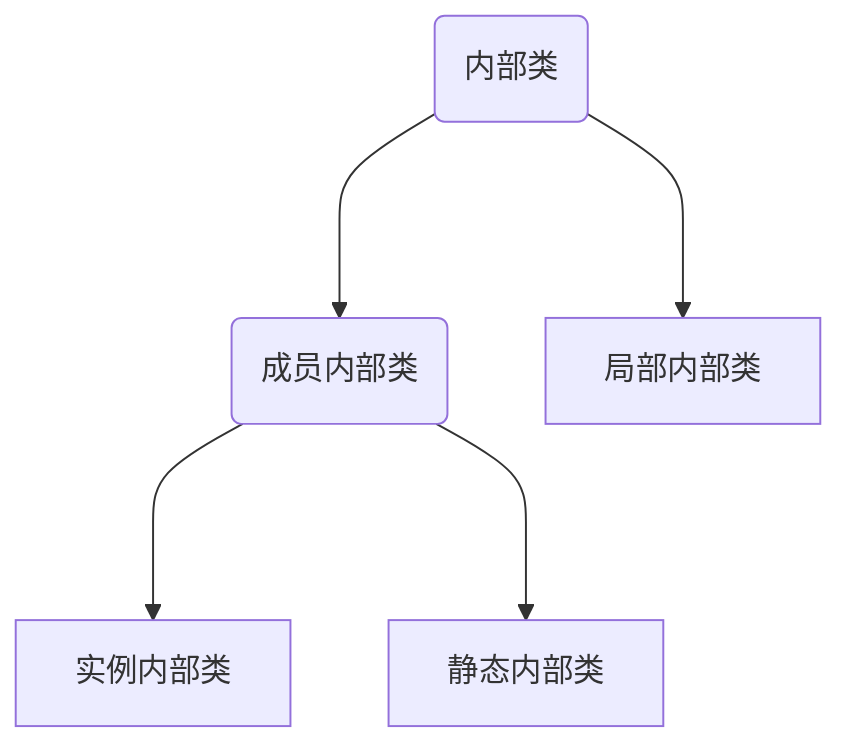
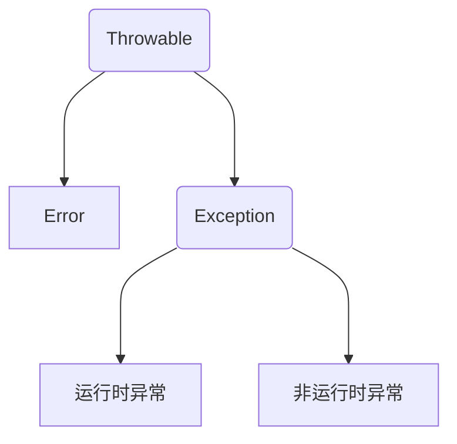

# 内部类与异常处理

## 内部类

Java支持在一个类中定义另一个类，这样的类叫做内部类，包含内部类的类称为内部类的外嵌套。

内部类的类体不能声明类变量和类方法，内部类仅供外嵌使用，其他类不可用某个类的内部类声明对象。

内部类可以很好地实现隐藏，一般的非内部类是不允许有 `private` 与 `protected` 权限的，但内部类允许。内部类拥有外部类的所有元素的访问权限。

```java
public class RedCowFarm {
	static String farmName;
	RedCow cow;  // 内部声明对象
	RedCowFarm() {}
	RedCowFarm(String s) {
		cow = new RedCow(150, 112, 5000);
		farmName = s;
	}
	public void showCowMess() {
		cow.speak();
	}
	class RedCow { 	// 内部类的声明
		String cowName = "红牛";
		int height, weight, price;
		RedCow(int h, int w, int p)	{
			height = h;
			weight = w;
			price = p;
		}
		void speak() {
			System.out.printf("我是%s, 身高%d, 体重%d, 生活在%s\n", cowName, height, weight, farmName);
		}
	}
}
```

```java
public class Test {
	public static void main(String args[]) {
		RedCowFarm farm = new RedCowFarm("红牛农场");
		farm.showCowMess();
		farm.cow.speak();
	}
}
```

```
我是红牛, 身高150, 体重112, 生活在红牛农场
我是红牛, 身高150, 体重112, 生活在红牛农场
```

Java编译器生成的内部类是字节码文件名格式为：外嵌类名$内部类名，内部类可被修饰为`static`内部类，程序就可在其他类中使用`static`内部类创建对象，但此时不能操作外嵌套的实例成员变量。

注意：非内部类不可是`static`类。




```java
class Test {
	public class InnerClass {
		public int getSum(int x, int y) {
			return x + y;
		}
	}
    public static void main(String args[]) {
    	Test.InnerClass ti = new Test().new InnerClass();
    	int i = ti.getSum(2, 3);
    	System.out.println(i);
    }
}
```

- 外部类只有两种访问级别：`public` 和默认；内部类则有 4 种访问级别：`public`、`protected`、 `private` 和默认。
- 在外部类中可以直接通过内部类的类名访问内部类。

### 实例内部类

```java
class Outer {
    int i = 10;
	class Inner1 {
		
	}
	Inner1 i = new Inner1();
	
	public void method1() {			// 不需要创建
		Inner1 i = new Inner1();
        i = 20;						// 在内部类可访问所有外部类的成员变量和成员方法
	}
	public static void method2() {	// 必须创建实例
		Inner1 i = new Outer().new Inner1(); 
	}
	
	class Inner2 {
		Inner1 i = new Inner1();	// 不需要创建外部类的实例
	}
}

class OtherClass {
	Outer.Inner1 i = new Outer().new Inner1();	
}
```

在实例内部类中不能定义 `static` 成员，除非同时使用 `final` 和 `static` 修饰。

### 静态内部类

在创建静态内部类的实例时，不需要创建外部类的实例。

```java
class Outer {
	static class Inner {
		int a = 0;
		static int b = 0;
	}
}
class OtherClass {
	Outer.Inner oi = new Outer.Inner();
	int a2 = oi.a;
	int b2 = Outer.Inner.b;
}
```

静态内部类可以直接访问外部类的静态成员，如果要访问外部类的实例成员，则需要通过外部类的实例去访问。

### 局部内部类

局部内部类是指在一个方法中定义的内部类，局部内部类与局部变量一样，不能使用访问控制修饰符（`public`、`private` 和 `protected`）和 `static` 修饰符修饰；局部内部类中不能定义 static 成员。

在局部内部类中**只**可以访问当前方法中 `final` 类型的参数与变量。

```java
class Test {
	int a = 0;
	int d = 0;
	public void method() {
		int b = 0;
		final int c = 0;
		final int d = 10;
		class Inner {
			int a2 = a;			// 访问外部类中成员
			// int b2 = b;		不可访问方法内变量
			int c2 = c;
			int d2 = d;
			int d3 = Test.this.d;	// 访问外部内的成员
		}
		Inner i = new Inner();
		System.out.println(i.d2);
		System.out.println(i.d3);
	}
    public static void main(String args[]) {
    	Test t = new Test();
    	t.method();
    }
}
```

```
10
0
```

## 内部类实现多重继承

```java
class Father {
	public int strong() {
		return 9;
	}
}
class Mother {
	public int kind() {
		return 8;
	}
}

class Son {
	class Father_1 extends Father {
		public int string() {
			return super.strong();
		}
	}
	class Mother_1 extends Mother {
		public int kind() {
			return super.kind();
		}
	}
	public int getStrong() {
		return new Father_1().strong();
	}
	public int getKind() {
		return new Mother_1().kind();
	}
}

class Test {
    public static void main(String args[]) {
    	Son son = new Son();
    	System.out.println("Son的强壮指数：" + son.getStrong());
    	System.out.println("Son的友好指数：" + son.getKind());
    }
}
```

内部类可以继承一个与外部类无关的类，从而保证内部类的独立性。正是基于这一点，多重继承才会成为可能。

## 匿名类

若没有显式声明一个类的子类，而需要创建子类对象，可使用类的子类类体创建一个子类对象。匿名类一般为内部类，不可声明为`static`成员和方法，在使用匿名类创建对象时，需要直接使用父类的构造方法。

一般匿名对象只使用一次，而且匿名对象只在堆内存中开辟空间，而不存在栈内存的引用。

```java
abstract class OutputAlphabet {
	public abstract void output();
}

public class Test {
	public static void main(String args[]) {
		ShowBoard board = new ShowBoard();
		board.showMess(new OutputEnglish());
		
		board.showMess(new OutputAlphabet() {
            public void output() {
                for (char c = 'a'; c <= 'ω'; c++) {
                    System.out.printf("%3c", c);
                }
            }
        });
	}
}
```

```java
public class OutputEnglish extends OutputAlphabet {
	public void output() {
		for (char c = 'a'; c <= 'z'; c++) {
			System.out.printf("%3c", c);
		}
	}
}
```

```java
class Student implements Cloneable {
	private String name;
	private int age;
	public Student(String name, int age) {
		this.name = name;
		this.age = age;
	}
	public Student() {
		this.name = "name";
		this.age = 0;
	}
	public String toString() {
		return "姓名：" + name + ", 年龄：" + age;
	}
	public void tell() {
		System.out.println(this.toString());
	}
}
public class Test {
    public static void main(String[] args) {
    	new Student("张三", 2).tell();
    }
}
```

```java
class Out {
	void show() {
		System.out.println("调用Out类的show()方法");
	}
}
public class TestAnonymousInterClass {
	private void show() {
		Out anonyInter = new Out() {
			// 获得匿名类中的实例
			void show() {
				System.out.println("调用匿名类中的show()方法");
			}
		};
		anonyInter.show();
	}
	public static void main(String[] args) {
		TestAnonymousInterClass test = new TestAnonymousInterClass();
		test.show();
	}
}
```

```
调用匿名类中的show()方法
```

匿名类中允许使用非静态代码块进行成员初始化操作，匿名类的非静态代码块会在父类的构造方法之后被执行。

```java
Out annoyInter = new Out() {
	int i; {
		i = 10;		// 成员初始化，即构造方法
	}
	public void show() {
		System.out.println(i);
	}
};
```

### 和接口类有关的匿名类

Java允许直接用接口名和类体创建一个匿名对象：

```java
interface SpeakHello {
	void speak();
}

class HelloMachine {
	public void turnOn(SpeakHello hello) {
		hello.speak();
	}
}

public class Test {
	public static void main(String args[]) {
		HelloMachine machine = new HelloMachine();
		machine.turnOn(new SpeakHello()
				{
					public void speak() {
						System.out.println("你好，欢迎光临！");
					}
				});
	}
}
```

Java 中局部内部类和匿名内部类访问的局部变量必须由 `final` 修饰，以保证内部类和外部类的数据一致性。但从 Java 8 开始，我们可以不加 `final` 修饰符，由系统默认添加。

```java
public class Test {
    public static void main(String[] args) {
        [final] String name = "C语言中文网";
        new Runnable() {
            @Override
            public void run() {
                System.out.println(name);
            }
        };
    }
}
```

## Lambda表达式

```java
// 使用匿名内部类计算
interface Calculable {
	int calculateInt(int a, int b);
}

public class Test  {
	/**
	 * 
	 * @param opr操作符
	 * @return 实现Calculable接口对象
	 */
	public static Calculable calculate(char opr) {
		Calculable result;				// 接口对象用于保存结果
		if (opr  == '+' ) {
			result = new Calculable() {
				@Override
				public int calculateInt(int a, int b) {
					return a + b;
				}
			};
		} else {
			result = new Calculable() {
				@Override
				public int calculateInt(int a, int b) {
					return a - b;
				}
			};
		}
		return result;
	}
    public static void main(String[] args) {
        int n1 = 10;
        int n2 = 20;
        Calculable f1 = calculate('+');			// 用于计算整数加法的接口对象
        Calculable f2 = calculate('-');			// 用于计算整数减法的接口对象
        System.out.println(n1 + "+" + n2 + "=" + f1.calculateInt(n1, n2));
        
        System.out.println(n1 + "-" + n2 + "=" + f1.calculateInt(n1, n2));
    }
}
```

```java
// 使用Lambda表达式替换匿名内部类
interface Calculable {
	int calculateInt(int a, int b);
}

public class Test  {
	public static Calculable calculate(char opr) {
		Calculable result;
		if (opr == '+') {
			result = (int a, int b)-> {
				return a + b;
			};
		} else {
			result = (int a, int b) -> {
				return a - b;
			};
		}
		return result;
	}
    public static void main(String[] args) {
        int n1 = 10;
        int n2 = 20;
        Calculable f1 = calculate('+');			// 用于计算整数加法的接口对象
        Calculable f2 = calculate('-');			// 用于计算整数减法的接口对象
        System.out.println(n1 + "+" + n2 + "=" + f1.calculateInt(n1, n2));
        
        System.out.println(n1 + "-" + n2 + "=" + f1.calculateInt(n1, n2));
    }
}
```

优点：

- 代码简洁，开发迅速
- 方便函数式编程
- 非常容易进行并行计算
- Java 引入 Lambda，改善了集合操作（引入 `Stream` API）


缺点：

- 代码可读性变差
- 在非并行计算中，很多计算未必有传统的 `for` 性能要高
- 不容易进行调试

### 函数式接口

Lambda 表达式实现的接口不是普通的接口，而是函数式接口。如果一个接口中，有且只有一个抽象的方法（Object 类中的方法不包括在内），那这个接口就可以被看做是函数式接口。

这说明该接口不是函数式接口，为了防止在函数式接口中声明多个抽象方法，Java 8 提供了一个声明函数式接口注解 `@FunctionalInterface`。

```java
@FunctionalInterface
interface Calculable {
	// 计算两个int数值
	int calculateInt(int a, int b);
}
```

在接口之前使用 `@FunctionalInterface` 注解修饰，那么试图增加一个抽象方法时会发生编译错误。但可以添加默认方法和静态方法。

提示：Lambda 表达式是一个匿名方法代码，Java 中的方法必须声明在类或接口中，那么 Lambda 表达式所实现的匿名方法是在函数式接口中声明的。

```java
@FunctionalInterface
interface Calculable {
	int calculateInt(int a);
}

public class Test  {
	public static Calculable calculate(int power) {
		Calculable result;
		if (power == 2) {
			// 标准形式
			result = (int a) -> {
				return a * a;
			};
		} else {
			// 省略大括号和return
			result = a -> a * a * a;
		};
		return result;
	}
    public static void main(String[] args) {
        int n1 = 10;
        int n2 = 20;
        Calculable f1 = calculate(2);			
        Calculable f2 = calculate(3);			
        System.out.println(n1 + "的2次方" + f1.calculate(2));
        System.out.println(n1 + "的3次方" + f2.calculate(3));
    }
}
```

### 访问变量

#### 访问成员变量

```java
@FunctionalInterface
// 函数式接口
interface Calculable {
	int calculateInt(int a, int b);
}
class LambdaDemo {
	private int value;
	private static int staticValue = 5;
	// 返回接口对象的方法
	public static Calculable add() {
		// 实现接口
		Calculable result = (int a, int b) -> {	
			staticValue++;
			int c = a + b + staticValue;
			return c;
		};
		return result;
	}
	public Calculable sub() {
		// 实现接口
		Calculable result = (int a, int b) -> {
			staticValue++;
			this.value++;
			int c = a - b - staticValue - this.value;
			return c;
		};
		return result;
	}
}
public class Test  {
	public static void main(String[] args) {
		LambdaDemo demo = new LambdaDemo();
		Calculable calAdd =  demo.add();		// 实现加法的接口
		Calculable calSub = demo.sub();			// 实现减法的接口
		
		System.out.println(calAdd.calculateInt(1, 2));
		System.out.println(calSub.calculateInt(1, 2));
	}
}
```

#### 访问局部变量

Lambda表达式只能访问局部变量而不能修改，否则会发生编译错误，但对静态变量和成员变量可读可写。

```java
@FunctionalInterface
// 函数式接口
interface Calculable {
	int calculateInt(int a, int b);
}

class LambdaDemo {
	private int value;
	private static int staticValue = 5;
	public static Calculable add() {
		// 编译错误
		int localValue = 20;
		Calculable result = (int a, int b) -> {
//			localValue++;	编译错误
			int c = a + b + localValue;
			return c;
		};
		return result;
	}
	public Calculable sub() {
		final int localValue = 20;
		Calculable result = (int a, int b) -> {
//			localValue--;	编译错误
			int c = a - b - localValue;
			return c;
		};
		return result;
	}
}
```

### 方法引用

方法引用可以理解为 Lambda 表达式的快捷写法，它比 Lambda 表达式更加的简洁，可读性更高，有很好的重用性。

```java
interface Calculable {
	int calculateInt(int a, int b);
}

class LambdaDemo {
	public static int add(int a, int b) {
		return a + b;
	}
	public int sub(int a, int b) {
		return a - b;
	}
}
class Test {
	public static void main(String[] args) {
		int n1 = 10;
		int n2 = 5;
		display(LambdaDemo::add, n1, n2);	// 使用方法引用，不用实例化接口方法
		LambdaDemo d = new LambdaDemo();
		display(d::sub, n1, n2);
	}
	
	public static void display(Calculable calc, int n1, int n2) {
		System.out.println(calc.calculateInt(n1, n2));
	}
}
```

```java
@FunctionalInterface
interface Displayable {
	void display();
	default int add(int a, int b) {
		return a + b;
	}
}
public class LambdaAndInner {
	private int age = 12;
	private static String name = "Hello, Java";
	
	public void test() {
		String address = "java.cn";
		Displayable dis = () -> {
			// 访问局部变量
			System.out.println("局部变量address为：" + address);
			System.out.println("外部类age实例变量：" + age);
			System.out.println("外部类name类变量：" + name);
		};
		dis.display();
		// 继承dis对象从接口中继承的add()方法
		System.out.println(dis.add(3, 5));
	}
	public static void main(String[] args) {
		LambdaAndInner lambda = new LambdaAndInner();
		lambda.test();
	}
}
```

Lambda 表达式与匿名内部类主要存在如下区别。

- 匿名内部类可以为任意接口创建实例，只要匿名内部类实现所有的抽象方法即可；但 Lambda 表达式只能为函数式接口创建实例。
- 匿名内部类可以为抽象类甚至普通类创建实例；但 Lambda 表达式只能为函数式接口创建实例。
- 匿名内部类实现的抽象方法的方法体允许调用接口中定义的默认方法；但 Lambda 表达式的代码块**内部**不允许调用接口中定义的默认方法。

```java
int d = add(1, 3);	// error，Lambda表达式内部不能调用默认方法
```

```java
public void test() {
    String address = "java.cn";
    Displayable dis = new Displayable() {
        @Override
        public void display() {					// public不可省略
            System.out.println("address局部变量为:" + address);
            // 访问外部类的实例变量和类变量
            System.out.println("外部类的age实例变量为：" + age);
            System.out.println("外部类的name类变量为：" + name);
            System.out.println(add(3, 5));		// 可使用抽象类的普通方法
        }
    };
}
```


## 异常类

异常处理将改变程序的控制流程，让程序有机会对错误做出处理。

 Java 中一个异常的产生，主要有如下三种原因：

- Java 内部错误发生异常，Java 虚拟机产生的异常。
- 编写的程序代码中的错误所产生的异常，例如空指针异常、数组越界异常等。
- 通过 `throw` 语句手动生成的异常，一般用来告知该方法的调用者一些必要信息。

### 异常类型



`Exception` 类用于用户程序可能出现的异常情况，它也是用来创建自定义异常类型类的类。

`Error` 定义了在通常环境下不希望被程序捕获的异常。一般指的是 JVM 错误，如堆栈溢出。

本节不讨论关于 `Error` 类型的异常处理，因为它们通常是灾难性的致命错误，不是程序可以控制的。接下来将讨论 `Exception` 类型的异常处理。

运行时异常都是 `RuntimeException` 类及其子类异常，如 `NullPointerException`、`IndexOutOfBoundsException` 等，这些异常是不检查异常，程序中可以选择捕获处理，也可以不处理。这些异常一般由程序逻辑错误引起，程序应该从逻辑角度尽可能避免这类异常的发生。

非运行时异常是指 `RuntimeException` 以外的异常，类型上都属于 `Exception` 类及其子类。从程序语法角度讲是必须进行处理的异常，如果不处理，程序就不能编译通过。如 `IOException`、`ClassNotFoundException` 等以及用户自定义的 `Exception` 异常（一般情况下不自定义检查异常）。

运行时异常（`RuntimeException`）：

- `NullPropagation`：空指针异常；

- `ClassCastException`：类型强制转换异常

- `IllegalArgumentException`：传递非法参数异常

- `IndexOutOfBoundsException`：下标越界异常

- `NumberFormatException`：数字格式异常


非运行时异常：

- `ClassNotFoundException`：找不到指定 class 的异常
- `IOException`：IO 操作异常


错误（Error）：

- `NoClassDefFoundError`：找不到 class 定义异常
- `StackOverflowError`：深递归导致栈被耗尽而抛出的异常
- `OutOfMemoryError`：内存溢出异常

```java
class StackOverflow {
	public static void test(int i) {
		if (i == 0) {
			return;
		} else {
			test(i++);
		}
	}
}
public class ErrorEg {
	public static void main(String[] args) {
		StackOverflow.test(5);
	}
}
```

```
	at Test.StackOverflow.test(ErrorEg.java:8)
	at Test.StackOverflow.test(ErrorEg.java:8)
	at Test.StackOverflow.test(ErrorEg.java:8)
	at Test.StackOverflow.test(ErrorEg.java:8)
	at Test.StackOverflow.test(ErrorEg.java:8)
	at Test.StackOverflow.test(ErrorEg.java:8)
	...
	at Test.StackOverflow.test(ErrorEg.java:8)
	at Test.StackOverflow.test(ErrorEg.java:8)
```


```java
int number = Integer.parseInt("ab89");
```

方法`parseInt`在执行过程中抛出`NumberFormatException`对象，即程序出现`NumberFormatException`异常。

异常对象可调用如下方法得到或输出相关异常信息。

```java
public String getMessage();
public String printStackTrace();
public String toString();
```

### `try-catch`语句

Java使用`try-catch`语句处理异常，将可能出现异常的部分放入`try`部分，一旦`try`部分抛出遗产对象，或调用某个可能抛出异常对象的方法，`try`立即结束执行，转向执行相应的`catch`部分。

各个`catch`参数中的异常类都是`Exception`的某个子类。

对于处理不了的异常或者要转型的异常，在方法的声明处通过 `throws` 语句拋出异常，即由上层的调用方法来处理。

```java
try {
    逻辑程序块
} catch (ExceptionType1 e) {
    处理代码块1
} catch (ExceptionType2 e) {
    处理代码块2
    throw(e);		// 抛出异常
} finally {
    释放资源代码块
}
```

可以使用以下 3 个方法输出相应的异常信息。

- `printStackTrace()` 方法：指出异常的类型、性质、栈层次及出现在程序中的位置。
- `getMessage()` 方法：输出错误的性质。
- `toString()` 方法：给出异常的类型与性质。

```java
public class Test {
	public static void main(String[] args) {
		Scanner scanner = new Scanner(System.in);
		System.out.println("-------学生信息录入-------");
		String name = "";
		int age = 0;
		String sex = "";
		try {
			System.out.println("请输入学生姓名：");
			name = scanner.next();
			System.out.println("请输入学生年龄：");
			age = scanner.nextInt();
			System.out.println("请输入学生性别：");
			sex = scanner.next();
		} catch (Exception e) {
			e.printStackTrace();
			String mess = e.getMessage();
			System.out.println("输入有误，" + mess);
		}
		System.out.println("姓名：" + name);
		System.out.println("年龄：" + age);
	}
}
```

```java
请输入学生姓名：
ua
请输入学生年龄：
uan
输入有误，null
姓名：ua
年龄：0
```

```java
public class Test {
	public static void main(String args[]) {
		int n = 0, m = 0, t = 1000;
		try {
			m = Integer.parseInt("8888");
			n = Integer.parseInt("ab89");
			t = 7777;
		} catch (NumberFormatException e) {
			System.out.println("发生异常：" + e.getMessage());
		}
		System.out.printf("m = %d, n = %d, t = %d\n", m, n, t);
		try {
			System.out.println("故意抛出I/O异常！");
			throw new java.io.IOException("我是故意的");
		} catch (java.io.IOException e) {
			System.out.println("发生异常：" + e.getMessage());
		}
	}
}
```

```
发生异常：For input string: "ab89"
m = 8888, n = 0, t = 1000
故意抛出I/O异常！
发生异常：我是故意的
```

### 多重`catch`语句

注意：当捕获的多个异常类之间存在父子关系时，捕获异常时一般先捕获子类，再捕获父类。所以子类异常必须在父类异常的前面，否则子类捕获不到。

```java
public class Test {
    public static void main(String[] args) {
        Date date = readDate();
        System.out.println("读取的日期 = " + date);
    }

    public static Date readDate() {
        FileInputStream readfile = null;
        InputStreamReader ir = null;
        BufferedReader in = null;
        try {
            readfile = new FileInputStream("readme.txt");
            ir = new InputStreamReader(readfile);
            in = new BufferedReader(ir);
            // 读取文件中的一行数据
            String str = in.readLine();
            if (str == null) {
                return null;
            }
            DateFormat df = new SimpleDateFormat("yyyy-MM-dd");
            Date date = df.parse(str);
            return date;
        } catch (FileNotFoundException e) {
            System.out.println("处理FileNotFoundException...");
            e.printStackTrace();
        } catch (IOException e) {
            System.out.println("处理IOException...");
            e.printStackTrace();
        } catch (ParseException e) {
            System.out.println("处理ParseException...");
            e.printStackTrace();
        }
        return null;
    }
}
```

```java
import java.util.InputMismatchException;
import java.util.Scanner;
public class Test {
	public static void main(String[] args) {
		Scanner input = new Scanner(System.in);
		try {
			System.out.println("请输入班级总人数");
			int count = input.nextInt();
			System.out.println("请输入总成绩：");
			int score = input.nextInt();
			int avg = score / count;
			System.out.println("本次考试的平均分：" + avg);
		} catch (InputMismatchException e1) {
			System.out.println("输入有误");
		} catch (ArithmeticException e) {
			System.out.println("输入的总人数不为0！");
		} catch (Exception e3) {
			e3.printStackTrace();
			System.out.println("发生错误" + e3.getMessage());
		}
	}
}
```

```
请输入班级总人数
0
请输入总成绩：
200
输入的总人数不为0！
```

```
请输入班级总人数
50a
输入有误
```

### `try-catch-finally`语句

所以为了确保一定能回收 `try` 块中打开的物理资源，异常处理机制提供了 `finally` 代码块，并且 Java 7 之后提供了自动资源管理（Automatic Resource Management）技术。

1. ```java
   try {
       // 可能会发生异常的语句
   } catch (ExceptionType e) {
       // 处理异常语句
   } finally {
       // 清理代码块
   }
   ```

   `try catch finally` 语句块的执行情况可以细分为以下 3 种情况：

   1. 如果 `try` 代码块中没有拋出异常，则执行完`try`代码块之后直接执行 `finally` 代码块，然后执行 `try catch finally` 语句块之后的语句。
   2. 如果 try 代码块中拋出异常，并被`catch`子句捕捉，那么在拋出异常的地方终止 `try` 代码块的执行，转而执行相匹配的`catch`代码块，之后执行 `finally` 代码块。如果 `finally` 代码块中没有拋出异常，则继续执行 `try catch finally` 语句块之后的语句；如果 `finally` 代码块中拋出异常，则把该异常传递给该方法的调用者。
   3. 如果`try`代码块中拋出的异常没有被任何`catch`子句捕捉到，那么将直接执行`finally`代码块中的语句，并把该异常传递给该方法的调用者。

   ```java
   import java.util.Scanner;
   public class Test {
   	public static void main(String[] args) {
   		Scanner input = new Scanner(System.in);
   		System.out.println("Windows系统已启动");
   		String[] pros = {"记事本", "计算机", "浏览器"};
   		try {
   			for (int i = 0; i < pros.length; i++) {
   				System.out.println(i + 1 + ": " + pros[i]);
   			}
   			System.out.println("是否运行程序：");
   			String answer = input.next();
   			if (answer.equals("y")) {
   				System.out.println("请输入程序编号：");
   				int no = input.nextInt();
   				System.out.println("正在运行程序{" + pros[no-1] + "]");
   			}
   		} catch (Exception e) {
   			e.printStackTrace();
   		} finally {
   			System.out.println("谢谢使用！");
   		}
   	}
   }
   ```

```
Windows系统已启动
1: 记事本
2: 计算机
3: 浏览器
是否运行程序：
y
请输入程序编号：
2
正在运行程序{计算机]
谢谢使用！
```

```
Windows系统已启动
1: 记事本
2: 计算机
3: 浏览器
是否运行程序：
ead
谢谢使用！
```

## `finally`和`return`的执行顺序

#### `try`和`catch`中带有`return`

```java
public class Test {
	public static int show() {
		try {
			return 1;
		} catch (Exception e) {
			return 2;
		} finally {
			System.out.println("执行finally模块");
		}
	}
	public static void main(String[] args) {
		System.out.println(show());
	}
}
```

```
执行finally模块
1
```

### `finally`中带有`return`

```java
public class Test {
	public static int show() {
		try {
			int a = 8 / 0;
			return 1;
		} catch (Exception e) {
			return 2;
		} finally {
			System.out.println("执行finally模块");
			return 3;
		}
	}
	public static void main(String[] args) {
		System.out.println(show());
	}
}
```

```
执行finally模块
3
```

当`finally`有返回值时，会直接返回该值，不会去返回`try`代码块或者`catch`代码块中的返回值。

注意：`finally`代码块中最好不要包含`return`语句，否则程序会提前退出。

####  `finally`中改变返回值

```java
public class Test {
	public static int show() {
		int result = 0;
		try {
			return result;
		} finally {
			System.out.println("执行finally模块");
			result = 1;
		}
	}
	public static void main(String[] args) {
		System.out.println(show());
	}
}
```

```
执行finally模块
0
```

在`finally`代码块中改变返回值并不会改变最后返回的内容。

```java
public class Test {
	public static Object show() {
		Object obj = new Object();
		try {
			return obj;
		} finally {
			System.out.println("执行finally模块");
			obj = null;
		}
	}
	public static void main(String[] args) {
		System.out.println(show());
	}
}
```

```
执行finally模块
java.lang.Object@515f550a
```

- 当`try`代码块和`catch`代码块中有`return`语句时，`finally`仍然会被执行。
- 执行`try`代码块或`catch`代码块中的`return`语句之前，都会先执行`finally`语句。
- 无论在`finally`代码块中是否修改返回值，返回值都不会改变，仍然是执行`finally`代码块之前的值。
- `finally`代码块中的`return`语句一定会执行。

### Java 9增强的自动资源管理

当程序使用`finally`块关闭资源时，程序会显得异常臃肿：

```java
public class Test {
	public static void main(String[] args) {
		FileInputStream fis = null;
		try {
			fis = new FileInputStream("a.txt");
		} catch (FileNotFoundException e) {
			e.printStackTrace();
		} finally {
			if (fis != null) {
				try {
					fis.close();
				} catch (IOException e) {
					e.printStackTrace();
				}
			}
		}
	}
}
```

为了解决这种问题，Java 7 增加了一个新特性，该特性提供了另外一种管理资源的方式，这种方式能自动关闭文件，被称为自动资源管理（Automatic Resource Management）。该特性是在`try`语句上的扩展，主要释放不再需要的文件或其他资源。

自动资源管理替代了`finally`代码块，并优化了代码结构和提高程序可读性。

```java
try (声明或初始化资源语句) {
    // 可能会生成异常语句
} catch(Throwable e1){
    // 处理异常e1
} catch(Throwable e2){
    // 处理异常e1
} catch(Throwable eN){
    // 处理异常eN
}
```

当`try`代码块结束时，自动释放资源。不再需要显式的调用`close()`方法；

注意：

1. `try`语句中声明的资源被隐式声明为`final`，资源的作用局限于带资源的`try`语句。
2. 可以在一条`try`语句中声明或初始化多个资源，每个资源以`;`隔开即可。
3. 需要关闭的资源必须实现了`AutoCloseable`或`Closeable`接口。

```java
public class AutoCloseTest {
	public static void main(String[] args) throws IOException {
		try (
				// 声明、初始化两个可关闭的资源
				// try语句会自动关闭这两个资源
				BufferedReader br = new BufferedReader(new FileReader("AutoCloseTest.java"));
				PrintStream ps = new PrintStream(new FileOutputStream("a.txt"))) {
			System.out.println(br.readLine());
			ps.println("Java");
		}
	}
}
```

上面程序中粗体字代码分别声明、初始化了两个`IO`流，`BufferedReader`和`PrintStream`都实现了`Closeable`接口，并在`try`语句中进行了声明和初始化，所以`try`语句会自动关闭它们。自动关闭资源的`try`语句相当于包含了隐式的`finally`块（这个`finally`块用于关闭资源）。

### 声明和抛出异常

#### `throws`声明异常

```java
returnType method_name(paramList) throws Exception 1,Exception2,…{…}
```

```java
public class Test {
	// 可能出现IO错误，该方法中不做任何处理，将可能发生的异常交给调用者处理
	public void readFile() throws IOException {
		FileInputStream file = new FileInputStream("read.txt");
		int f;
		while ((f = file.read()) != -1) {
			System.out.println((char)f);
			f = file.read();
		}
		file.close();
	}
	public static void main(String[] args) {
		Test t = new Test();
		try {
			t.readFile();
		} catch (IOException e) {
			System.out.println(e);
		}
	}
}
```

子类方法声明抛出的异常类型应该是父类方法声明抛出的异常类型的子类或相同，子类方法声明抛出的异常不允许比父类方法声明抛出的异常多

```java
import java.io.FileInputStream;
import java.io.IOException;

public class OverrideTest {
	public void test() throws IOException {
		FileInputStream fis = new FileInputStream("a.txt");
	}
}

class Sub extends OverrideThrows {
	public void test() throws Exception {
		// 错误，子类抛出比父类更大的异常
	}
}
```

#### `throw`拋出异常

`throw`语句用来直接拋出一个异常，后接一个可拋出的异常类对象，其语法格式如下：

```java
throw ExceptionObject;
```

`ExceptionObject`必须是`Throwable`类或其子类的对象。如果是自定义异常类，也必须是`Throwable`的直接或间接子类。例如，以下语句在编译时将会产生语法错误：

```java
throw new String();
```

当`throw`语句执行时，它后面的语句将不执行，此时程序转向调用者程序，寻找与之相匹配的`catch`语句，执行相应的异常处理程序。

`throw`关键字不会单独使用，它的使用完全符合异常的处理机制，但是，一般来讲用户都在避免异常的产生，所以不会手工抛出一个新的异常类的实例，而往往会抛出程序中已经产生的异常类的实例。

```java
import java.util.Scanner;
public class Test {
	public boolean validateUserName(String username) {
		boolean con = false;
		if (username.length() > 8) {
			for (int i = 0; i < username.length(); i++) {
				char ch = username.charAt(i);
				if (Character.isDigit(ch) || Character.isAlphabetic(ch)) {
					con = true;
				} else {
					con = false;
					throw new IllegalArgumentException("用户名必须为数字或字母");
				}
			}
		}else {
				throw new IllegalArgumentException("用户名长度需大于8位");
		}
		return con;
	}
	public static void main(String[] args) {
		Test t = new Test();
		Scanner input = new Scanner(System.in);
		System.out.println("请输入用户名：");
		String username = input.next();
		try {
			boolean con = t.validateUserName(username);
			if (con) {
				System.out.println("用户名输入正确！");
			}
		} catch (IllegalArgumentException e) {
			e.printStackTrace();
		}
	}
}
```

```
请输入用户名：
2691386627
用户名输入正确！
```

`throws`通常不用显示地捕获异常，可由系统自动将所有捕获的异常信息抛给上级方法； `throw`则需要用户自己捕获相关的异常，而后再对其进行相关包装，最后将包装后的异常信息抛出。

### 多异常捕获

```java
try{
    // 可能会发生异常的语句
} catch (IOException | ParseException e) {
    // 调用方法methodA处理
}
```

注意：由于 `FileNotFoundException`属于`IOException`异常，`IOException`异常可以捕获它的所有子类异常。所以不能写成 `FileNotFoundException | IOException | ParseException`。

```java
public class ExceptionTest {
	public static void main(String[] args) {
		try {
			int a = Integer.parseInt(args[0]);
			int b = Integer.parseInt(args[1]);
			int c = a / b;
			System.out.println("你输入两个数相除的结果为：" + c);
		} catch (IndexOutOfBoundsException | NumberFormatException | ArithmeticException e) {
			System.out.println("程序发生数组越界、数字格式化异常、算术异常之一");
			// 异常变量默认final修饰
//			e = new ArithmeticException("test");  不允许修改
		} catch (Exception e) {
			System.out.println("未知异常");
			// 当捕获一种异常时，异常变量没有final修饰
			e = new RuntimeException("test");
		}
	}
}
```

### 自定义异常类

在编写程序时可以扩展`Exception`类定义自己的异常类，然后根据程序需要规定可能产生异常的方法。一个方法在声明时可以使用`throws`关键字声明要产生的若干个异常，并在该方法的方法体中具体给出产生异常的操作。

```java
public class BankException extends Exception {
	String message;
	public BankException(int m, int n) {
		message = "入账资金" + m + "是负数或支出" + n + "是正数，不符合系统要求";
	}
	public String warnMess() {
		return message;
	}
}
```

```java
public class Bank {
	private int money;
	public void income(int in, int out) throws BankException {
		if (in <= 0 || out > 0 || in + out <= 0) {
			throw new BankException(in, out);
		}
		int netIncome = in + out;
		System.out.printf("本次计算的纯收入是：%d元\n", netIncome);
		money = money + netIncome;
	}
	public int getMoney() {
		return money;
	}
}
```

```java
public class Test {
	public static void main(String args[]) {
		Bank bank = new Bank();				// 调用者自身处理异常
		try {
			bank.income(200, -100);
			bank.income(300, -100);
			bank.income(9999, 100);
			System.out.printf("银行目前有%d元\n", bank.getMoney());
		} catch (BankException e){
			System.out.println(e.warnMess());
		}
		System.out.printf("银行目前有%d元\n", bank.getMoney());
	}
}
```

自定义异常类一般包含两个构造方法：一个是无参的默认构造方法，另一个构造方法以字符串的形式接收一个定制的异常消息，并将该消息传递给超类的构造方法。

```java
class IntegerRangeException extends Exception {
    public IntegerRangeException() {
        super();
    }
    public IntegerRangeException(String s) {
        super(s);
    }
}
```

```java
class MyException extends Exception {
    public MyException() {
        super();
    }
    public MyException(String s) {
        super(s);
    }
}
public class ExceptionTest {
	public static void main(String[] args) {
		int age;
		Scanner input = new Scanner(System.in);
		System.out.println("请输入您的年龄：");
		try {
			age = input.nextInt();
			if (age < 0) {
				throw new MyException("您输入的年龄为负数！");
			} else if (age > 150) {
				throw new MyException("您输入的年龄有误！");
			} else {
				System.out.println("您输入的年龄为：" + age);
			}
		} catch (InputMismatchException e1) {
			System.out.println("您输入的年龄不是数字！");
		} catch (MyException e2) {
			System.out.println(e2.getMessage());
		}
	}
}
```

```java
class LoginException extends Exception {
	public LoginException() {
		super();
	}
	public LoginException(String msg) {
		super(msg);
	}
}
public class Test {
	public boolean validateLogin(String username, String pwd) {
		boolean con = false;			// 用户名和密码是否正确
		boolean conUname = false;		// 用户名格式是否正确
		try {
			if (username.length() > 6 && username.length() <= 10) {
				for (int i = 0; i < username.length(); i++) {
					char ch = username.charAt(i);
					if (Character.isDigit(ch)) {
						conUname = true;
					} else {
						conUname = false;
						throw new LoginException("用户名中包含有非数字字符！");
					}
				}
			} else {
				throw new LoginException("用户名长度必须在6~10位间");
			}
			if (conUname) {
				if (pwd.length() == 6) {
					con = true;
				} else {
					con = false;
					throw new LoginException("密码长度必须为6位");
				}
			}
		} catch (LoginException e) {
			System.out.println(e.getMessage());
		}
		return con;
	}
	public static void main(String[] args) {
		Scanner input = new Scanner(System.in);
		System.out.println("用户名：");
		String username = input.next();
		System.out.println("密码：");
		String passwd = input.next();
		Test t = new Test();
		boolean con = t.validateLogin(username, passwd);
		if (con) {
			System.out.println("登录成功！");
		}
	}
}
```

```java
class Compute {
	private int[] num = new int[2];
	public int[] getNum() {
		return num;
	}
	public void setNum(int[] num) {
		this.num = num;
	}
}
public class Test {
	public static void main(String[] args) {
		Compute c = new Compute();
		int array[] = c.getNum();
		int res = 0;
		String YorN = null;
		Scanner in = new Scanner(System.in);
		try {
			System.out.println("请输入第一个整数：");
			array[0] = in.nextInt();
			System.out.println("请输入第二个整数：");
			array[1] = in.nextInt();
			res = array[0] / array[1];
			System.out.println("是否保存结果，请输入Y/N");
			YorN = in.next();
			if (YorN.equals("Y")) {
				array[2] = res;
			}
			System.out.println(array[0] + "/" + array[1] + "的结果为：" + res);
		} catch (ArrayIndexOutOfBoundsException e) {
			System.out.println("出现数组越界，下标过大或过小");
		} catch (ArithmeticException e) {
			System.out.println("出现算术运算错误，除数不能为0");
		} catch (InputMismatchException e) {
			System.out.println("输入类型不匹配，只能输入整数");
		} catch (Exception e) {
			System.out.println("发生未知错误");
		}
	}
}
```

### 异常处理规则

#### 不要过度使用异常

对于完全已知和普通的错误，应该编写处理这种错误处理代码，增加程序的健壮性；只有对外部的、不能确定和预知的运行时错误才使用异常。异常处理机制的效率比正常的流程控制效率差，所以不要使用异常处理来代替正常的程序流程控制。

#### 不要使用过于庞大的`try`块

把大块的`try`块分割成多个可能出现异常的程序段落，并把它们放在单独的`try`块中，从而分别捕获并处理异常。

#### 避免使用Catch All语句

```java
try {
    // 可能引发Checked异常的代码
} catch (Throwsble t) {
    // 进行异常处理
    t.printStackTrace();
}
```

Catch All语句不过是一种通过避免错误处理而加快编程进度的机制，应尽量避免在实际应用中使用这种语句。

#### 不要忽略捕获到的异常

对异常进行合适的修复，然后绕过异常发生的地方继续执行；或者用别的数据进行计算，以代替期望的方法返回值；或者提示用户重新操作等。总之，对于 `Checked`异常，程序应该尽量修复。

## 记录日志类

日志用来记录程序的运行轨迹，方便查找关键信息，也方便快速定位解决问题。

JDK Logging把日志分为如下表7个级别，等级依次降低。

| 级别     | SEVERE     | WARNING     | INFO     | CONFIG     | FINE     | FINER     | FINEST     |
| -------- | ---------- | ----------- | -------- | ---------- | -------- | --------- | ---------- |
| 调用方法 | `severe()` | `warning()` | `info()` | `config()` | `fine()` | `finer()` | `finest()` |
| 含义     | 严重       | 警告        | 信息     | 配置       | 良好     | 较好      | 最好       |

`Logger`的默认级别是`INFO`，比`INFO`级别低的日志将不显示。

可以使用`setLevel`方法设置级别，例如`logger.setLevel(Level.FINE);`可以将 FINE 和更高级别的都记录下来。另外，还可以使用`Level.ALL`开启所有级别的记录，或者使用`Level.OFF`关闭所有级别的记录。

若要生成简单日志记录，可以使用全局日志记录器并调用其`info`方法：

```java
Logger.getGlobal().info("打印信息");
```

```java
public class Test {
	private static Logger log = Logger.getLogger(Test.class.toString());
	public static void main(String[] args) {
		log.finest("finest");
        log.finer("finer");
        log.fine("fine");
        log.config("config");
        log.info("info");
        log.warning("warning");
        log.severe("server");
	}
}
```

```
10月 07, 2022 12:26:13 下午 Test.Test main
信息: info
10月 07, 2022 12:26:13 下午 Test.Test main
警告: warning
10月 07, 2022 12:26:13 下午 Test.Test main
严重: server
```

## 断言

断言对调试代码阶段十分有意义，一般用于程序不准备通过捕捉异常来处理的错误。

```java
public class Test {
	public static void main(String args[]) {
		int[] score = {-120, 98, 89, 120, 99};
		int sum = 0;
		for (int num : score) {
			assert num >= 0 : "负数不能是成绩";
			sum += num;
		}
		System.out.println("总成绩" + sum);
	}
}
```

- Java保存的文件名必须与类名一致
- 如果文件中只有一个类，文件名必须与类名一致
- 一个Java文件中只能有一个`public`类
- 如果文件中不止一个类，文件名必须与`public`类名一致
- 如果文件中不止一个类，而且没有`public`类，文件名可与任一类名一致