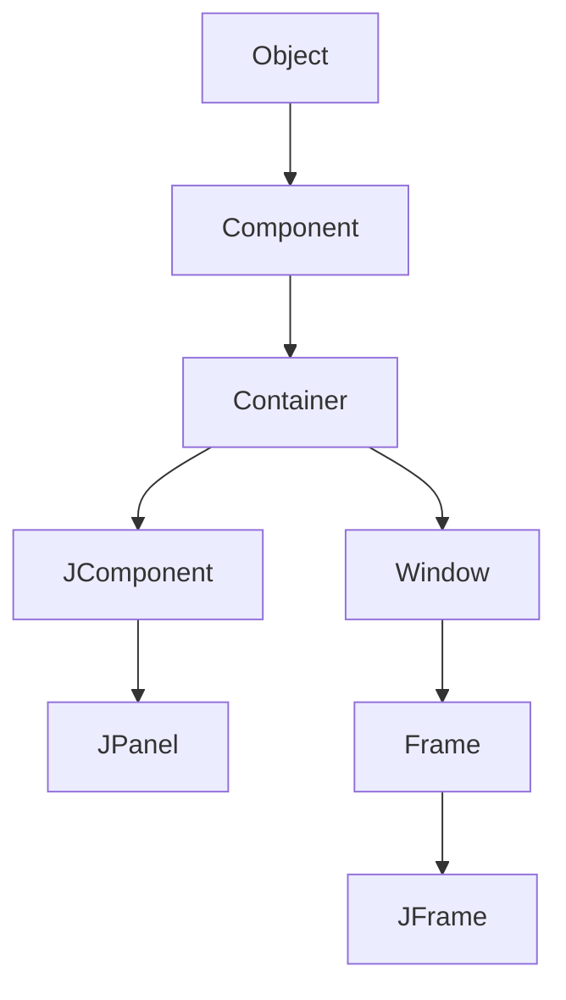
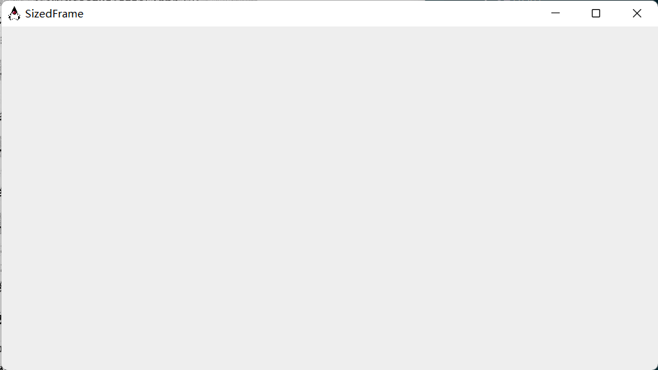
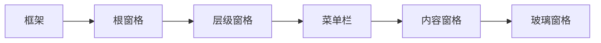

# 第7章 图形程序设计

## Swing概述

在Java 1.0刚刚出现的时候，包含了一个用于基本GUI程序设计的类库， Sun将它称为抽象窗口工具箱（Abstract Window Toolkit, AWT）。基本AWT库采用将处理用户界面元素的任务委派给每个目标平台的本地GUI工具箱的方式，由本地GUI工具箱负责用户界面元素的创建和动作。因此Sun公司是口号是“一次编写，随处使用”。

要想编写依赖于本地用户界面元素的高质量、可移植的图形库就会暴露出一些缺陷。一些图形环境（虫日Xl 1/Motif）并没有像Windows或Macintosh这样丰富的用户界面组件集合。这也就将基于对等体的可移植库限制在了“最小公分母”的范围内。

在1996年， Netscape创建了一种称为IFC (Internet Foundation Class ）的GUI库，它采用了与AWT完全不同的工作方式。它将按钮、菜单这样的用户界面元素绘制在空白窗口上，而对等体只需要创建和绘制窗口。因此， Netscape的IFC组件在程序运行的所有平台上的外观和动作都相同。Sun与Netscape合作完善了这种方式，创建了一个名为Swing的用户界面库。Swing可作为Java 1.1的扩展部分使用，现己成为Java SE 1.2标准库的一部分。

现在，Swing是不对等基于GUI 工具箱的正式名字。它已是Java基础类库（ Java Foundation Class, JFC）的一部分。完整的JFC十分庞大，其中包含的内容远远大于Swing GUI工具箱。JFC特性不仅仅
包含了Swing组件，而且还包含了一个可访问的API 、一个2D API和一个可拖拽的API 。

> Swing没有完全替代AWT ，而是基于AWT架构之上。Swing仅仅提供了能力史加强大的用户界面组件。尤其在采用Swing编写均程序中， 还需共使用基本的AWT处理事件。
> 从现在开始， Swing是指“被绘制的”**用户界面类**； AWT是指像事件处理这样的窗口工具箱的**低层机制**。

在用户屏幕上显示基于Swing用户界面的元素要比显示AWT的基于对等体组件的速度慢一些。由于下列几点无挂抗拒的原因，人们选择Swing：

- Swing拥有一个丰富、便捷的用户界面元素集合。
- Swing对底层平台依赖很少，因此与平台相关的bug很少。
- Swing不用的平台用户一致性高。

为使界面元素与本地空间一致，Sun开发了一种称为Metal 的独立于平台的观感。现在，市场上人们将它称为“Java观感”。在Java SE 6中， Sun改进了对Windows和GTK本地观感的支持。Swing应用程序将会支持色彩主题的个性化设置，逼真地表现着动态按钮和变得十分时尚的滚动条。

## 创建框架

在Java中，顶层窗口（就是没有包含在其他窗口中的窗口）被称为框架（frame）。在AWT库中有一个称为`Frame`的类，用于描述顶层窗口。这个类的Swing版本名为`JFrame` ，它扩展于`Frame`类。`JFrame`是极少数几个不绘制在画布上的Swing组件之一。因此，它的修饰部件（按钮、标题栏、图析、等）由用户的窗口系统绘制，而不是由Swing绘制。

```java
public class SimpleFrameTest {
    public static void main(String[] args) {
        SimpleFrame frame = new SimpleFrame();
        frame.setDefaultCloseOperation(JFrame.EXIT_ON_CLOSE);
        frame.setVisible(true);
    }
}

class SimpleFrame extends JFrame {
    public SimpleFrame() {
        setSize(DEFAULT_WIDTH, DEFAULT_HEIGHT);
    }
    public static final int DEFAULT_WIDTH = 300;
    public static final int DEFAULT_HEIGHT = 200;
}
```

在每个Swing程序中，有两点技术需要强调。

- 所有的Swing组件必须由事件调度线程（event dispatch thread）进行配置，线程将鼠标点击和键盘敲击控制转移到用户接口组件。下面的代码片断是事件调度线程中的执行代码：

  ```
  EventQueue.invokeLater(new Runnable() {
  	public void run() {
  		statements
  	}
  });
  ```

  > 许多Swing程序并没有在事件调度线程中初始化用户接口。在主线程中完成初始化是通常采用的方式。遗憾的是，由于Swing组件十分复杂， Sun的程序员无法克保证这种方式的安全性。

- 定义一个用户关闭这个框架时的响应动作。

在Java SE 5.0 以前的版本中，可以使用`JFame`类从超类`Window`继承`show`方法。`Window `类的超类是`Component` ，其中也有一个`show`方法。在Java SE 1 .2 中不提倡使用`Component.show`。

Swing库负责绘制**框架内**的所有内容。在这个程序中，只用默认的背景色填充了框架。

## 框架定位

`JFrame`类本身只包含若干个改变框架外观的方法。

- `setLocation`和`setBounds`设置框架位置。
- `setIconImage`用于告诉窗口系统在标题栏、任务切换窗口等位置显示哪个图标。
- `setTitle`用于改变标题栏的文字。
- `setResizable`利用一个`boolean`值确定框架的大小是否允许用户改变。



## 框架属性

组件类的很多方法是以获取／设置这一对操作形式出现。例如，Frame类中的下列方法：

```java
public String getTitle();
public void setTitle(String title);
```

这样的一个获取／设置对被称为一种属性。属性包含属性名和类型。

对于类型为`boolean`的属性，获取类方法由is开头：`public boolean isLocationByPlantform()`

## 决定框架的大小

如果没有明确地指定框架的大小，所有框架的默认值为0 × 0像素。对于专业应用程序来说，应该检查屏幕的分辨率， 并根据其分辨率编写代码重置框架的大小。

为了得到屏幕的大小，需要按照下列步骤操作。调用`Toolkit`类的静态方法`getDefaultToolkit`得到一个`Toolkit` 对象（包含很多与本地窗口系统有关的方法）。然后，调用`getScreenSize`方法，这个方法以`Dimension`对象的形式返回屏幕的大小。

```java
Toolkit kit = Toolkit.getDefaultTookKit();
Dimension screenSize = kit.getScreenSize();
int screenWidth = screen.width;
int screenHeight = screen.height;
```

由于图像的描述与系统有关，所以需要再次使用工具箱加载图像。然后，将这个图像设置为框架的图标。

```java
Image img = kit.getImage(".//img//duke.gif");
setIconImage(img);
```

```java
public class SizedFrameTest {
    public static void main(String[] args) {
        EventQueue.invokeLater(new Runnable() {
            public void run() {
                SizedFrame frame = new SizedFrame();
                frame.setDefaultCloseOperation(JFrame.EXIT_ON_CLOSE);
                frame.setVisible(true);
                frame.setExtendedState(Frame.MAXIMIZED_BOTH / 2); // 等效
            }
        });
    }
}

class SizedFrame extends JFrame {
    public SizedFrame() {
        Toolkit kit = Toolkit.getDefaultToolkit();
        Dimension screenSize = kit.getScreenSize();
        int screenHeight = screenSize.height;
        int screenWidth = screenSize.width;

        setSize(screenWidth / 2, screenHeight / 2);
        setLocationByPlatform(true);

        Image img = kit.getImage(".//img//duke.gif");
        setIconImage(img);
        setTitle("SizedFrame");
    }
}
```



## 在组件中显示时信息



Swing程序员最关心的是内容窗格（content pane），在设计框架时，需要将组件添加到内容窗格：

```
Container contentPane = frame.getContentPane();
Component c = ...;
contentPane.add(c);
```

Java SE 5.0后，可直接调用`frame.add(c)`。

绘制一个组件需要定义一个扩展的`Component`的类，并覆盖其中的`paintComponent`方法。

`paintComponent`方法有一个`Graphics`类型的参数，这个参数保存着用于绘制图像和文本的设置，例如，设置的字体或当前的颜色。在Java中，所有的绘制都必须使用`Graphics`对象，其中包含了绘制图案、图像和文本的方法。

一定不要自己调用`paintComponent`方法。在应用程序需要重新绘图的时候，这个方法将被自动地调用， 不要人为地干预这个自动的处理过程。用户扩大窗口或极小化窗口，然后又恢复窗口的大小时会引发重新绘图。  如果需要强制刷新屏幕，就需要调用`repaint`方法。

> 些程序员史喜欢扩展`JPanel` ，而不是`JComponent`。`JPanel`是一个可以包含其他组件的容器（container），但同样也可以在其上面进行绘制。有一点不同之处是，面板不透明，这意味着需要在面板的边界内绘制所有的像素。

```java
public class NotHelloWorld {
    public static void main(String[] args) {
        EventQueue.invokeLater(new Runnable() {
            public void run() {
                NotHelloWorldFrame frame = new NotHelloWorldFrame();
                frame.setDefaultCloseOperation(JFrame.EXIT_ON_CLOSE);
                frame.setVisible(true);
            }
        });
    }
}

class NotHelloWorldFrame extends JFrame {
    public NotHelloWorldFrame() {
        setTitle("NotHelloWorld");
        setSize(DEFAULT_WIDTH, DEFAULT_HEIGHT);
        NotHelloWorldPanel pane = new NotHelloWorldPanel();
        add(pane);
    }
    public static final int DEFAULT_WIDTH = 300;
    public static final int DEFAULT_HEIGHT = 200;
}

class NotHelloWorldPanel extends JPanel {
    public void paintComponent(Graphics g) {
        g.drawString("Not a Hello, World program", MESSAGE_X, MESSAGE_Y);
    }
    public static final int MESSAGE_X = 75;
    public static final int MESSAGE_Y = 100;
}
```

## 2D图形

Java SE 1.2引人了Java 2D库，这个库实现了一组功能强大的图形操作。在本章中，只介绍Java 20库的基础部分，有关高级功能的详细内容请参看卷II的高级AWT章节。

Java 2D库采用面向对象的方式将几何图形组织起来。包含描述直线、矩形的椭圆的类：

- `Line2D`
- `Rectangle2D`
- `Ellipse2D`

这些类实现了`Shape`接口。

Java 2D采用浮点坐标，当创建一个`Rectangle2D.Float`对象时，应提供`float`型数值坐标。

```java
Rectangle2D.Float floatRect = new Rectangle2D.Float(10.0F, 25.0F, 22.5F, 20.0F);
Rectangle2D.Double doubleRect = new Rectangle2D.Double(10.0, 25.0, 22.5, 20.0);
```

> 直接使用`Double` 图形类可以避免处理`float`类型的值，然而如果需要创建上千个图形对象，还是应该考虑使用`Float`类，这样可以节省存储空间。

`Rectangle2D`方法的参数和返回值均为`double`类型。例如，即使`Rectangle2D.Float`对象存储`float`类型的宽度， `getWidth`方法也返回一个`double`值。

`Rectangle2D`和`Ellipse2D`对象易于构造。只需给出左上角的`x`和`y`坐标以及宽和高。
对于椭圆，这些内容代表外接矩形。

```java
public class DrawTest {
    public static void main(String[] args) {
        EventQueue.invokeLater(new Runnable() {
            @Override
            public void run() {
                DrawFrame frame = new DrawFrame();
                frame.setDefaultCloseOperation(JFrame.EXIT_ON_CLOSE);
                frame.setVisible(true);
            }
        });
    }
}

class DrawFrame extends JFrame {
    public DrawFrame() {
        setTitle("DrawTest");
        setSize(DEFAULT_WIDTH, DEFAULT_HEIGHT);
        DrawComponent component = new DrawComponent();
        add(component);
    }
    public static final int DEFAULT_WIDTH = 400;
    public static final int DEFAULT_HEIGHT = 400;
}

class DrawComponent extends JComponent {
    public void paintComponent(Graphics g) {
        Graphics2D g2 = (Graphics2D) g;

        // 绘制矩形
        double leftX = 100;
        double topY = 100;
        double width = 200;
        double height = 150;
        Rectangle2D rect = new Rectangle2D.Double(leftX, topY, width, height);
        g2.draw(rect);

        // 绘制椭圆
        Ellipse2D ellipse = new Ellipse2D.Double();
        ellipse.setFrame(rect);
        g2.draw(ellipse);

        // 绘制对角线
        g2.draw(new Line2D.Double(leftX, topY, leftX + width, topY + height));

        // 绘制圆
        double centerX = rect.getCenterX();
        double centerY = rect.getCenterY();
        double radius = 150;
        Ellipse2D circle = new Ellipse2D.Double();
        circle.setFrameFromCenter(centerX, centerY, centerX + radius, centerY + radius);
        g2.draw(circle);
    }
}
```


