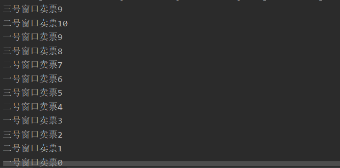
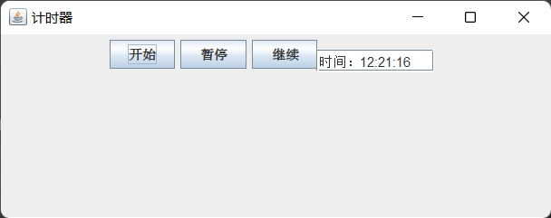

# 多线程机制

## 进程与线程

程序：对数程序：对数据描述与操作的代码的集合，用某种语言编写，是应用程序执行的一段静态的代码。

进程：被加载到内存中执行的程序执行过程，是操作系统分配资源的基本单位。程序是静态的，进程是动态的。

系统运行程序即是一个进程从创建、运行到消亡的过程。

多任务：同一时间允许两个或以上的进程处于运行状态。

比进程更小的执行单位；是程序中单个顺序的控制流。一个进程可包含多个线程。

## Java线程

### 线程的生命周期

一个线程在其生命周期内存在5种状态：

1. 新建：当一个`Thread`类或其子类的对象被声明并创建时，新生的线程对象处于新建状态。该线程具有了内存空间和其它资源。

2. 就绪：处于新建状态的线程调用`start()`启动后，将进入线程队列等待CPU时间片，此时它已具备了运行的条件。

3. 运行：当就绪的线程被调度并获得处理器资源时，便进入运行状态，`run()`方法定义了线程的操作和功能，程序员只负责改写`run()`方法，它被JVM调用执行。

4. 阻塞：在某种特殊情况下，让出CPU并临时中止自己

   的执行，进入阻塞状态。如：让出CPU使用权，使用`sleep()`，使用wait(), 使用`synchronized`互斥。

5. 死亡：线程完成了它的全部工作或线程被提前强制性地中止。如：使用了`stop()`或`destroy()`。

### 线程调度与优先级

每个线程都有自己的优先级，通常用三个常量表示：

- `MAX_PRIORITY 10`

- `MIN_PRIORITY 1`

- `NORM_PRIORITY 5 // 默认优先级`

`getPriority()`  返回线程的优先级；

`setPriority(int newPriority)`  设置线程的优先级；

每个线程都继承其父线程的优先级。每个Java程序启动后，虚拟机将自动创建一个`main`线程，`main`线程的优先级是`NORM_PRIORITY`。

虽然Java提供了10个优先级级别，但不同的操作系统对优先级的支持并不相同，例如Win2000仅提供了7个优先级。因此应该尽量使用以上三个常量来设置线程的优先级，这样才可以保证程序具有更好的可移植性。

优先级较高的线程获得较多的执行机会，并不代表比优先级低的线程先执行完毕。

## Thread类与线程创建

Java中有两种方式创建线程：

- 继承`java.lang.Thread`类；

- 实现`java.lang.Runnable`接口；

Java程序都有一个隐藏的主线程，即main方法。要实现多线程，必须主线程中创建新的线程。

### Thread类

常用方法：

- `static Thread currentThread()`：返回当前正在执行的线程对象的引用；

- `String getName() `：返回该线程的名称；

- `String setName(String name)`：设置该线程的名字；

- `void start()`：使线程进入就绪状态，等待JVM调度；

- `public void run()` 线程运行时执行的操作，需要被改写；

### 继承`Thread`类

```java
public class Runner extends Thread {
    public Runner(String str) {
        setName(str);
    }
	@Override
    public void run() {
        for (int i = 1; i <= 10; i++) {
            System.out.println(this.getName() + "\t" + this.getPriority() + "\t" + i);
        }
    }
}

public class PriorityTest {
    public static void main(String[] args) {
        Thread t1 = new Runner("1st");
        Thread t2 = new Runner("2nd");
        t1.start();
        t2.start();
    }
}
```

### 实现`Runnable`接口

1. 定义一个实现`Runnable`接口的类；

2. 在该类中实现`run()`方法；

3. 这个类实例化，得到目标对象；

4. `new Thread(目标对象)`，生成线程对象；

5. 线程对象`.start()` 方法启动线程。

在实际开发中，要完成一个多线程的操作，更多通过实现`Runnable`接口完成（适合于资源的共享）。

```java
public class MyThread implements Runnable {
    String name;
    public MyThread(String name) {
        this.name = name;
    }
    public void run() {
        for (int i = 1; i <= 10; i++) {
            System.out.println("线程运行, " + this.name + ", i = " + i);
        }
    }
}

public class ThreadDemo01 {
    public static  void main(String[] args) {
        MyThread mt1 = new MyThread("线程a");
        MyThread mt2 = new MyThread("线程b");
        Thread t1 = new Thread(mt1);
        Thread t2 = new Thread(mt2);
        t1.start();
        t2.start();
    }
}
```

### 两种方式的区别

```java
public class MyThread1 extends Thread {
    private int ticket = 10;
    private String name;
    public MyThread1(String name) {
        this.name = name;
    }

    public void run() {
        for (int i = 0; i < 20; i++) {
            if (this.ticket > 0) {
                System.out.println(this.name + "卖票" + this.ticket--);

            }
        }
    }
}

public class ThreadTicket {
    public static void main(String[] args) {
        MyThread1 mt1 = new MyThread1("一号窗口");
        MyThread1 mt2 = new MyThread1("二号窗口");
        MyThread1 mt3 = new MyThread1("三号窗口");
        mt1.start();
        mt2.start();
        mt3.start();
    }
}
```

根据输出结果可见，多个线程分别完成自己的任务，不能共享一个目标对象。

```java
public class MyThread2 implements Runnable {
    private int ticket = 10;
    private String name;
    @Override
    public void run() {
        for (int i = 0; i < 500; i++) {
            if (this.ticket > 0) {
                System.out.println(Thread.currentThread().getName() + "卖票" + this.ticket--);
            }
        }
    }
}

public class ThreadTicket {
    public static void main(String[] args) {
        MyThread2 mt2 = new MyThread2();
        Thread t1 = new Thread(mt2, "一号窗口");
        Thread t2 = new Thread(mt2, "二号窗口");
        Thread t3 = new Thread(mt2, "三号窗口");
        t1.start();
        t2.start();
        t3.start();
    }
}
```

根据输出结果可见，多个线程共享同一个目标对象，共同完成目标对象任务。

## 常用方法

### `sleep()`方法

静态方法，该方法用来使一个线程暂停运行一段固定的时间，在线程睡眠时间内，将运行别的线程。

格式如下：

```java
static void sleep(long mills) // 休眠时间精确到ms
 static void sleep(long millis, int nanos)  // 休眠时间精确到ns
```

`sleep()`方法被打断时产生`InterruptedException`异常，因此必须添加异常处理。

```java
public class SleepTest {
    public static void main(String[] args) throws InterruptedException {
        for (int i = 0; i < 10; i++) {
            System.out.println("当前时间" + new Date());
            Thread.sleep(1000);
        }
    }
}
```

### `isAlive()`方法

当线程的状态未知时，用isAlive()确定线程是否活着。返回`true`意味着线程已经启动，但还没有运行结束。

此一个线程的引用调用start()之后，不要重复为该引用生成新的线程对象：

```java
Thread thread = new Thread(target);
thread.start();
thread = new Thread(target);  // 导致前一个成为垃圾线程
```

### `currentThread()`方法

只是返回现有的线程引用，并没有创建新线程。

### `interrept()`方法

如果一个线程`t`在调用`sleep()`、`join()`、`wait()`等方法被阻塞时，则t.interrupt()方法将中断t的阻塞状

态，使`t`重新排队等待CPU资源。

### `join()`方法

一个线程`A`在占有CPU资源时，可以让其他线程调用`join()`和本线程联合，则`A`线程将立刻中断执行，

直至联合线程执行完毕。

 `join()`：如当前线程发出调用`t.join()`，则当前线程将等待线程`t`结束后再继续执行。

`join(long millis)`：如当前线程发出调用`t.join(millis)`，则当前线程将等待线程`t`结束或最多等待`mills`毫秒后在继续执行。

```java
public class ThreadJoin implements Runnable {
    Cake cake;
    Thread customer, cakeMaker;
    public void setThread(Thread ...t) {
        customer = t[0];
        cakeMaker = t[1];
    }

    @Override
    public void run() {
        if (Thread.currentThread() == customer) {
            System.out.println(customer.getName() + "等待" + cakeMaker.getName() + "制作蛋糕");
            try {
                cakeMaker.start();
                cakeMaker.join();  // 当前进程等待cakeMaker进程结束后执行
            } catch (InterruptedException e) {
                throw new RuntimeException(e);
            }
            System.out.println(customer.getName() + "买了" + cake.name + "价钱" + cake.price);
        } else if (Thread.currentThread() == cakeMaker) {
            System.out.println(cakeMaker.getName() + "开始制作生日蛋糕，稍等");
            try {
                Thread.sleep(1000);
            } catch (InterruptedException e) {
                throw new RuntimeException(e);
            }
            cake = new Cake("生日蛋糕", 158);
            System.out.println(cakeMaker.getName() + "制作完成");
        }
    }
}

class Cake {
    int price;
    String name;
    Cake(String name, int price) {
        this.name = name;
        this.price = price;
    }
}

public class Example_Join {
    public static void main(String[] args) {
        ThreadJoin a = new ThreadJoin();
        Thread customer = new Thread(a);
        Thread cakeMaker = new Thread(a);
        customer.setName("顾客");
        cakeMaker.setName("蛋糕师");
        a.setThread(customer, cakeMaker);
        customer.start();
    }
}
```

## 线程守护

线程可分为守护线程与用户线程。

线程默认是用户线程，可以调用`setDeamon()`将自己设置成守护线程。

守护（Daemon）线程：并不是程序运行不可或缺的部分。

用户线程（非守护线程）结束时，整个进程就结束了，不会执行其它守护线程。用户可使用守护线程做一些不是很严格的工作，随时结束不会产生什么不良后果。

```java
public class Daemon implements Runnable {
    Thread a, b;
    Daemon() {
        a = new Thread(this);
        b = new Thread(this);
    }

    public void run() {
        if (Thread.currentThread() == a) {
            for (int i = 0; i < 8; i++) {
                System.out.println("i = " + i);
            }
            try {
                Thread.sleep(1000);
            } catch (InterruptedException e) {
                throw new RuntimeException(e);
            }
        } else if (Thread.currentThread() == b) {
            while (true) {
                System.out.println("线程b为非守护线程");
                try {
                    Thread.sleep(1000);
                } catch (InterruptedException e) {
                    throw new RuntimeException(e);
                }
            }
        }
    }
}

public class Example_Daemon {
    public static void main(String[] args) {
        Daemon d = new Daemon();
        d.a.start();
        d.b.setDaemon(true);  // 设置为守护线程
        d.b.start();
    }
}
```

## 线程同步

为了处理共享资源竞争，可以使用同步机制。从而确保在任何时刻一个共享对象只被一个线程使用。

线程同步是指两个线程同时操作一个对象时，应该保持对象数据的统一性和整体性。

若不进行同步处理，线程`sleep(100)`过程中，系统将执行权交给另一个线程引起。

```java
public void run() {
    while (this.ticket > 0) {
        try {
            Thread.sleep(100);
        } catch (InterruptedException e) {
            throw new RuntimeException(e);
        }
        System.out.println(Thread.currentThread().getName() + "卖票" + this.ticket--);
    }
}
```



### 线程同步方法

使用关键字`synchronized`修饰的方法

`synchronized void method{}`

也可以表示为：`void method { synchronized(this){} };`

当一个线程`A`使用一个`synchronized`修饰的方法时，其他线程想使用这个方法时就必须等待，直到线程`A`使用完该方法（除非线程A使用`wait`主动让出CPU资源）。

多个同步方法中，一次只能有一个同步方法是活动的，其它同步方法必须等待该方法访问完共享数据之后才能访问共享数据。

```java
public class MyThread3 implements Runnable {
    private int ticket = 10;
    public synchronized void sell() {
        try {
            Thread.sleep(200);
        } catch (InterruptedException e) {
            throw new RuntimeException(e);
        }
        System.out.println(Thread.currentThread().getName() + "卖票" + this.ticket--);
    }
    @Override
    public void run() {
        while (ticket > 0) {
            sell();
        }
    }
}
```

### 线程同步代码块

`synchronized (obj) {}`

同步监视器应该为一个对象

-  一般选择线程可共享的资源作为同步监视器；

- 任何时刻只能有一个线程锁定同步监视器；

- 同步方法的监视器默认为`this`；

```java
public class DrawThread extends Thread {
    Account account;
    int draw;
    public DrawThread(String name, Account account, int draw) {
        super(name);
        this.account = account;
        this.draw = draw;
    }

    public void run() {
        synchronized (account) {
            if (account.sum >= draw) {
                System.out.println(getName() + "取出：" + draw + "成功！");
                try {
                    Thread.sleep(10);
                } catch (InterruptedException e) {
                    throw new RuntimeException(e);
                }
                account.withDraw(draw);
                System.out.println("余额：" + account.sum);
            } else {
                System.out.println("余额不足，" + getName() + "交易失败");
            }

        }
    }
}

class Account {
    String no;
    int sum;
    Account(String no, int sum) {
        this.no = no;
        this.sum = sum;
    }

    void withDraw(int draw) {
        sum -= draw;
    }
}

public class Example_01 {
    public static void main(String[] args) {
        Account account = new Account("1234", 1000);
        DrawThread dt1 = new DrawThread("张三", account, 800);
        DrawThread dt2 = new DrawThread("李四", account, 800);
        dt1.start();
        dt2.start();
    }
}
```

- `synchronized`关键字不能继承，若子类修改了父类的同步方法，子类的方法不是同步方法，除非再次加上synchronized修饰

- `synchronized`不能用来修饰成员变量

- 定义接口方法时不能使用`synchronized`

- 构造方法不能使用synchronized，但可以使用同步块

- `synchronized`也可以修饰静态方法

### `wait-notify`机制

当`synchronized`方法中的`wait()`方法被调用时，当前线程将

被中断运行，并且放弃该对象的锁。一旦线程调用了`wait ()`方法，它便进入该对象的等待列表。

要从等待列表中删除该线程，使它有机会继续运行，其它线程须调用同一个对象上的`notify()`或者`notifyAll()`方法。

当线程再次成为可运行的线程后，它便试图重新进入该对象。

三个方法都是`Object`的`final`方法，必须在`synchronized`结构中使用，不允许被重写。

```java
public class TicketHouse implements Runnable {
    int fiveAmount = 2, tenAmount = 0, twentyAmount = 0;

    public void run() {
        if (Thread.currentThread().getName().equals("张飞")) {
            scaleTicket(20);
        } else if (Thread.currentThread().getName().equals("李逵")) {
            scaleTicket(5);
        }
    }

    private synchronized void scaleTicket(int money) {
        if (money == 5) {
            fiveAmount += 1;
            System.out.println("给" + Thread.currentThread().getName() + "入场券，" + "钱正好");
        } else if (money == 20) {
            while (fiveAmount < 3) {  // 一般为循环而非判断
                try {
                    System.out.println("\n" + Thread.currentThread().getName() + "靠边等...");
                    wait();  // 当前线程等待
                    System.out.println("继续售票");
                } catch (InterruptedException e) {
                    throw new RuntimeException(e);
                }
                fiveAmount -= 3;
                twentyAmount += 1;
                System.out.println("给" + Thread.currentThread().getName() + "入场券，" + "找零15元");
            }
            notifyAll();
        }
    }
}

public class Example_02 {
    public static void main(String[] args) {
        TicketHouse officer = new TicketHouse();
        Thread zhangfei, likui;
        zhangfei = new Thread(officer, "张飞");
        likui = new Thread(officer, "李逵");
        zhangfei.start();
        likui.start();
    }
}
```

##  GUI线程

若Java程序包含图形界面，Java虚拟机在运行程序会启用更多线程。其中有两个重要线程，`AWT_EventQuecue`线程和`AWT_Windows`线程。前者负责处理GUI事件，后者负责将窗体或组件绘制到桌面。

```java
public class WindowTyped extends JFrame implements ActionListener, Runnable {
    JTextField inputLetter;
    Thread giveLetter;
    JLabel showLetter, showScore;
    Color c;
    int score;
    WindowTyped() {
        setLayout(new FlowLayout());
        giveLetter = new Thread(this);
        showLetter = new JLabel(" ", JLabel.CENTER);
        inputLetter = new JTextField(6);
        showScore = new JLabel("分数：");
        showLetter.setFont(new Font("Arial", Font.BOLD, 20));
        add(new JLabel("显示字母"));
        add(showLetter);
        add(new JLabel("输入显示的字母"));
        add(inputLetter);
        add(showScore);
        inputLetter.addActionListener(this);
        setBounds(100, 100, 400, 280);
        setVisible(true);
        setDefaultCloseOperation(JFrame.DISPOSE_ON_CLOSE);
        giveLetter.start();  // 在AWT_Windows线程中启动giveLetter
    }

    @Override
    public void run() {
        char c = 'a';
        while (true) {
            showLetter.setText(" " + c + " ");
            validate();
            c = (char)(c + 1);
            if (c > 'z') {
                c = 'a';
            }
            try {
                Thread.sleep(1000);
            } catch (InterruptedException e) {}
        }
    }

    @Override
    public void actionPerformed(ActionEvent e) {
        String s = showLetter.getText().trim();
        String letter = inputLetter.getText().trim();
        if (s.equals(letter)) {
            score++;
            showScore.setText("得分：" + score);
            inputLetter.setText(null);
            validate();
            giveLetter.interrupt();  // 叫醒休眠的线程，以便加快字母显示速度
        }
    }
}

public class Example_03 {
    public static void main(String[] args) {
        WindowTyped win = new WindowTyped();
        win.setTitle("打字游戏");
    }
}
```

## 计时器线程

当某些操作需要周期性执行，可使用计时器。`Timer`对象可以作为事件源，使用其它监视器监视它的`ActionEvent`事件，如果发生，则调用`actionPerformed(ActionEvent e)`处理。

当使用`Timer(int a, Object b)`创建计时器时，对象`b`自动成为计时器的监视器，不必像其他组件获取监视器，但负责创建监视器的类必须实现`ActionListener`接口。

```java
public class Example_04 {
    public static void main(String[] args) {
        WindowTime win = new WindowTime();
        win.setTitle("计时器");
    }
}

public class WindowTime extends JFrame implements ActionListener {
    JTextField text;
    JButton bStart, bStop, bContinue;
    Timer time;
    SimpleDateFormat m;
    int n = 0, start = 1;
    WindowTime() {
        time = new Timer(1000, this);  // 每隔1秒执行一次
        m = new SimpleDateFormat("hh:mm:ss");
        text = new JTextField(10);
        bStart = new JButton("开始");
        bStop = new JButton("暂停");
        bContinue = new JButton("继续");
        bStart.addActionListener(this);
        bStop.addActionListener(this);
        bContinue.addActionListener(this);
        setLayout(new FlowLayout());
        add(bStart);
        add(bStop);
        add(bContinue);
        add(text);
        setSize(500, 200);
        validate();
        setVisible(true);
        setDefaultCloseOperation(JFrame.EXIT_ON_CLOSE);
    }

    public void actionPerformed(ActionEvent e) {
        if (e.getSource() == time) {
            Date date = new Date();
            text.setText("时间：" + m.format(date));
            int x = text.getBounds().x;
            int y = text.getBounds().y;
            y = y + 2;
            x = x - 2;
            text.setLocation(x, y);
        } else if (e.getSource() == bStart) {
            time.start();
        } else if (e.getSource() == bStop) {
            time.stop();
        } else {
            time.restart();
        }
    }
}
```

