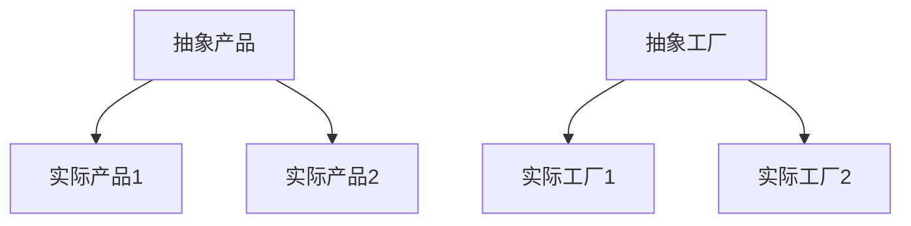

# 设计模式

## 创建型模式

### 工厂方法

工厂方法即Factory Method，是一种对象创建型模式。

工厂方法的目的是使创建对象和使用对象分离，并且客户端总是引用抽象工厂和抽象产品：

```ascii
┌─────────────┐      ┌─────────────┐
│   Product   │      │   Factory   │
└─────────────┘      └─────────────┘
       ▲                    ▲
       │                    │
┌─────────────┐      ┌─────────────┐
│ ProductImpl │<─ ─ ─│ FactoryImpl │
└─────────────┘      └─────────────┘
```

实现解析字符串到`Number`的`factory`，定义如下：

```java
public interface NumberFactory {
 	Number parse(String s);  
};
```

实现工厂接口后，再编写一个工厂的实现类：

```java
public class NumberFactoryImpl implments NumberFactory {
    public Number parse(String s) {
        return new BigDecimal(s);
    }
}
```

而产品接口是`Number`，`NumberFactoryImpl`返回的实际产品是`BigDecimal`。

通常我们会在接口`Factory`中定义一个静态方法`getFactory()`来返回真正的子类：

```java
public interface NumberFactory {
    static NumberFactory impl = new NumberFactoryImpl();
    Number parse(String s);
    
    // 获取工厂实例
    static NumberFactory getFactory() {
        return impl;
    }
}
```

对于客户端：

```java
NumberFactory factory = NumberFactory.getFactory();
Number result = factory.parse("123.456");
```

调用方可以完全忽略真正的工厂`NumberFactoryImpl`和实际的产品`BigDecimal`，这样做的好处是允许创建产品的代码独立地变换，而不会影响到调用方。

实际上大多数情况下我们并不需要抽象工厂，而是通过静态方法直接返回产品，即：

```java
public class NumberFactory {
    public static Number parse(String s) {
        return new BigDecimal(s);
    }
}
```

这种简化的使用静态方法创建产品的方式称为**静态工厂方法**（Static Factory Method）。静态工厂方法广泛地应用在Java标准库中。例如：

```java
Integer n = Integer.valueOf(100);
```

`Integer`既是产品又是静态工厂。它提供了静态方法`valueOf()`来创建`Integer`。

```java
public final class Integer {
    public static Integer valueOf(int i) {
        if (i >= IntegerCache.low && i <= IntegerCache.high)
            return IntegerCache.cache[i + (-IntegerCache.low)];
        return new Integer(i);
    }
    ...
}
```

它的好处在于，`valueOf()`内部可能会使用`new`创建一个新的`Integer`实例，但也可能直接返回一个缓存的`Integer`实例。如果调用方直接使用`Integer n = new Integer(100)`，那么就失去了使用缓存优化的可能性。

我们经常使用的另一个静态工厂方法是`List.of()`，符合里氏替换原则：返回实现接口的任意子类都可以满足该方法的要求，且不影响调用方。

### 抽象工厂

抽象工厂模式和工厂方法不太一样，它要解决的问题比较复杂，不但工厂是抽象的，产品是抽象的，而且有多个产品需要创建。因此，这个抽象工厂会对应到多个实际工厂，每个实际工厂负责创建多个实际产品。

假设希望为用户提供一个Markdown文本转换为HTML和Word的服务，它的接口定义如下：

```java
/* 抽象工厂 */
public interface AbstractFactory {
    // 创建Html文档:
    HtmlDocument createHtml(String md);
    // 创建Word文档:
    WordDocument createWord(String md);
}

/* 抽象产品 */
// Html文档接口:
public interface HtmlDocument {
    String toHtml();
    void save(Path path) throws IOException;
}

// Word文档接口:
public interface WordDocument {
    void save(Path path) throws IOException;
}
```

```java
public class FastHtmlDocument implements HtmlDocument {
    public String toHtml() {
        ...
    }
    public void save(Path path) throws IOException {
        ...
    }
}

public class FastWordDocument implements WordDocument {
    public void save(Path path) throws IOException {
        ...
    }
}
```

FastDoc Soft必须提供一个实际的工厂来生产这两种产品，即`FastFactory`：

```java
// 实际工厂
public class FastFactory implements AbstractFactory {
    public HtmlDocument createHtml(String md) {
        return new FastHtmlDocument(md);
    }
    public WordDocument createWord(String md) {
        return new FastWordDocument(md);
    }
}
```

创建实例：

> 先使用工厂方法创建产品实例

```java
AbstractFactory factory = new FastFactory();
// 生成Html文档:
HtmlDocument html = factory.createHtml("#Hello\nHello, world!");
html.save(Paths.get(".", "fast.html"));
// 生成Word文档:
WordDocument word = factory.createWord("#Hello\nHello, world!");
word.save(Paths.get(".", "fast.doc"));
```



### 生成器

生成器模式（Builder）是使用多个小型工厂来最终创建出一个完整对象。

例如可以将Markdown转HTML看作一行一行的转换，每一行根据语法，使用不同的转换器：

- 如果以`#`开头，使用`HeadingBuilder`转换；
- 如果以`>`开头，使用`QuoteBuilder`转换；
- 如果以`---`开头，使用`HrBuilder`转换；
- 其余使用`ParagraphBuilder`转换。

```java
public class HeadingBuilder {
    public String buildHeading(String line) {
        int n = 0;
        while (line.charAt(0) == '#') {
            n++;
            line = line.substring(1);
        }
        return String.format("<h%d>%s</h%d>", n, line.strip(), n);
    }
}
```

可见，使用Builder模式时，适用于创建的对象比较复杂，最好一步一步创建出零件，最后再装配起来。

```java
StringBuilder sb = new StringBuilder();
builder.append(secure ? "https://" : "http://")
    .append("www.baidu.com")
    .append("/")
    .append("?t=0");
String url = builder.toString();
```

可以使用Builder模式编写一个`URLBuilder`，调用方式如下：

```java
String url = URLBuilder.builder() // 创建Builder
        .setDomain("www.liaoxuefeng.com") // 设置domain
        .setScheme("https") // 设置scheme
        .setPath("/") // 设置路径
        .setQuery(Map.of("a", "123", "q", "K&R")) // 设置query
        .build(); // 完成build
```

### 原型

原型模式，即Prototype，是指创建新对象的时候，根据现有的一个原型创建。

实现一个`Cloneable`接口来标识一个对象是可复制的：

```java
public class Student implements Cloneable {
    private int id;
    private String name;
    private int score;

    // 复制新对象并返回:
    public Object clone() {
        Student std = new Student();
        std.id = this.id;
        std.name = this.name;
        std.score = this.score;
        return std;
    }
}
```

使用的时候，因为`clone()`的方法签名是定义在`Object`中，返回类型也是`Object`，所以要强制转型。

实际上，使用原型模式更好的方式是定义一个`copy()`方法，返回明确的类型：

```java
public class Student {
    private int id;
    private String name;
    private int score;

    public Student copy() {
        Student std = new Student();
        std.id = this.id;
        std.name = this.name;
        std.score = this.score;
        return std;
    }
}
```

原型模式应用不是很广泛，因为很多实例会持有类似文件、Socket这样的资源，而这些资源是无法复制给另一个对象共享的，只有存储简单类型的值对象可以复制。

### 单例

单例模式（Singleton）的目的是为了保证在一个进程中，某个类有且仅有一个实例。

单例的构造方法必须是`private`，这样就防止了调用方自己创建实例，但是在类的内部，是可以用一个静态字段来引用唯一创建的实例的：

```java
// 静态方法
public class Singleton {
    // 静态字段引用唯一实例:
    private static final Singleton INSTANCE = new Singleton();

    // 通过静态方法返回实例:
    public static Singleton getInstance() {
        return INSTANCE;
    }

    // private构造方法保证外部无法实例化:
    private Singleton() {
    }
}

// 将实例直接暴露在外
public class Singleton {
    // 静态字段引用唯一实例:
    private static final Singleton INSTANCE = new Singleton();

    // private构造方法保证外部无法实例化:
    private Singleton() {
    }
}
```

Java标准库有一些类就是单例，例如`Runtime`：

```java
Runtime runtime = Runtime.getRuntime();
```

延迟加载指在调用方第一次调用`getInstance()`时才初始化全局唯一实例：

```java
public class Singleton {
    private static Singleton INSTANCE = null;
    
    public static Singleton getInstance() {
        if (INSTANCE == null) {
            return new Singleton;
        }
        return INSTANCE;
    }
    
    private Singleton() {
    }
}
```

在多线程时，竞争过程中会创造出多个实例，必须对整个对象加锁：

```java
public synchronied static Singleton getInstance() {
    if (INSTANCE == null) {
        INSTANCE = new Singleton();
    }
    return INSTANCE;
}
```

要真正实现延迟加载，只能通过Java的ClassLoader机制完成。如果没有特殊的需求，使用Singleton模式的时候，最好不要延迟加载，这样会使代码更简单。

另一种实现Singleton的方式是利用Java的`enum`，因为Java保证枚举类的每个枚举都是单例，所以我们只需要编写一个只有一个枚举的类即可：

```java
public enum World {
    // 唯一枚举:
	INSTANCE;

	private String name = "world";

	public String getName() {
		return this.name;
	}

	public void setName(String name) {
		this.name = name;
	}
}

String name = World.INSTANCE.getName();
```

大部分服务类都应该被视作Singleton，通常是通过约定让框架（例如Spring）来实例化这些类，保证只有一个实例，调用方自觉通过框架获取实例而不是`new`操作符：

```java
// 表示一个单例组件
@Component
public class MyService {
    ...
}
```

除非确有必要，否则Singleton模式一般以约定为主，不会刻意实现它。

## 结构型模式

### 适配器

适配器模式是Adapter，也称Wrapper。

```java
public class Task implements Callable<Long> {
	private long num;
    public Task(long num) {
        this.num = num;
    }

    public Long call() throws Exception {
        long r = 0;
        for (long n = 1; n <= this.num; n++) {
            r = r + n;
        }
        System.out.println("Result: " + r);
        return r;
    }
}
```

使用一个Adapter，把这个`Callable`接口变转化为`Runnable`接口，这样，就可以正常编译：

```java
Callable<Long> callable = new Task(12345000L);
Thread thread = new Thread(new RunableAdapter(callable));
thread.start();
```

`RunnableAdapter`实现如下：

```java
public class RunnableAdapter implements Runnable {
    // 引用待转换接口
    private Callable<?> callable;

    public RunnableAdapter(Callable<?> callable) {
        this.callable = callable;
    }

    // 实现指定接口
    public void run() {
        // 将指定接口调用委托给转换接口调用:
        try {
            callable.call();
        } catch (Exception e) {
            throw new RuntimeException(e);
        }
    }
}
```

适配器模式在Java标准库中有广泛应用。注意到`List<T> Arrays.asList(T[])`就相当于一个转换器，它可以把数组转换为`List`。  

`InputStreamReader`就是Java标准库提供的`Adapter`，它负责把一个`InputStream`适配为`Reader`。类似的还有`OutputStreamWriter`。

> 持有高层（底层）接口不但代码更灵活，而且把各种接口组合起来也更容易。

### 桥接

桥接模式就是为了避免直接继承带来的子类爆炸。

在桥接模式中，通过一个抽象的修正类，以组合的形式引入。躯体实现如下：

```java
public abstract class Car {
    // 引用Engine:
    protected Engine engine;

    public Car(Engine engine) {
        this.engine = engine;
    }

    public abstract void drive();
}
```

`Engine`的定义如下：

```java
public interface Engine {
    void start();
}
```

在一个修正的抽象类`RefinedCar`中定义一些额外操作：

```java
public abstract class RefinedCar extends Car {
    public RefinedCar(Engine engine) {
        super(engine);
    }
    
    public void drive() {
        this.engine.start();
        System.out.println("Drive " + getBrand() + " car...");
    }
    
    public abstract String getBrand();
}
```

最终的不同品牌继承自`RefinedCar`，针对每一种引擎，继承自`Engine`。

客户端通过自己选择一个品牌，再配合一种引擎，得到最终的Car：

```java
RefinedCar car = new BossCar(new HybridEngine());
car.drive();
```

桥接模式实现比较复杂，实际应用也非常少，但它提供的设计思想值得借鉴，即不要过度使用继承，而是优先拆分某些部件，使用组合的方式来扩展功能。

### 组合

组合模式（Composite）经常用于树形结构，为了简化代码，使用Composite可以把一个叶子节点与一个父节点统一起来处理。

```java
public class Main {
    public static void main(String[] args) {
        Node root = new ElementNode("school");
        root.add(new ElementNode("classA")
                .add(new TextNode("Tom"))
                .add(new TextNode("Alice")));
        root.add(new ElementNode("classB")
                .add(new TextNode("Bob"))
                .add(new TextNode("Grace"))
                .add(new CommentNode("comment...")));
        System.out.println(root.toXml());
    }
}
interface Node {
    // 添加一个节点为子节点
    Node add(Node node);
    // 获取子节点
    List<Node> children();
    // 输出为XML
    String toXml();
}

class ElementNode implements Node {
    private String name;
    private List<Node> list = new ArrayList<>();

    public ElementNode(String name) {
        this.name = name;
    }

    public Node add(Node node) {
        list.add(node);
        return this;
    }

    public List<Node> children() {
        return list;
    }

    public String toXml() {
        String start = "<" + name + ">\n";
        String end = "</" + name + ">\n";
        StringJoiner sj = new StringJoiner("", start, end);
        list.forEach(node -> {
            sj.add(node.toXml() + "\n");
        });
        return sj.toString();
    }
}

class TextNode implements Node {
    private String text;

    public TextNode(String text) {
        this.text = text;
    }

    public Node add(Node node) {
        throw new UnsupportedOperationException();
    }

    public List<Node> children() {
        return List.of();
    }

    public String toXml() {
        return text;
    }
}

class CommentNode implements Node {
    private String text;

    public CommentNode(String text) {
        this.text = text;
    }

    public Node add(Node node) {
        throw new UnsupportedOperationException();
    }

    public List<Node> children() {
        return List.of();
    }

    public String toXml() {
        return "<!-- " + text + " -->";
    }
}
```

作为容器节点的`ElementNode`又可以添加任意个`Node`，这样就可以构成层级结构。

文件夹和文件、GUI窗口的各种组件，都符合Composite模式的定义，因为它们是层级结构。

### 装饰器

装饰器（Decorator）模式，是一种在运行期动态给某个对象的实例增加功能的方法。

Java标准库中，`InputStream`是抽象类，`FileInputStream`、`ServletInputStream`、`Socket.getInputStream()`这些`InputStream`都是最终数据源。

Decorator模式的目的就是把一个一个的附加功能，用Decorator的方式给一层一层地累加到原始数据源上，最终，通过组合获得我们想要的功能。

```java
// 创建原始的数据源
InputStream fis = new FileInputStream("test.gz");
// 增加缓冲功能
InputStream bis = new BufferedInputStream(fis);
// 增加解压缩功能
InputStream gis = new GZIPInputStream(bis);
```

或一次性写成这样：

```java
InputStream input = new GZIPInputStream( // 第二层装饰
                        new BufferedInputStream( // 第一层装饰
                            new FileInputStream("test.gz") // 核心功能
                        ));
```

`Decorator`模式实际上把核心功能和附加功能给分开了。核心功能指`FileInputStream`这些真正读数据的源头，附加功能指加缓冲、压缩、解密这些功能。

### 外观

外观模式，即Facade，是一个比较简单的模式。类似于客户端与子系统沟通的中介。

我们以注册公司为例，假设注册公司需要三步：

1. 向工商局申请公司营业执照；
2. 在银行开设账户；
3. 在税务局开设纳税号。

```java
// 工商注册
public class AdminOfIndustry {
    public Company register(String name) {
        ...
    }
}

// 银行开户
public class Bank {
    public String openAccount(String companyId) {
        ...
    }
}

// 纳税登记
public class Taxation {
    public String applyTaxCode(String companyId) {
        ...
    }
}
```

如果子系统比较复杂，并且客户对流程也不熟悉，那就把这些流程全部委托给中介：

```java
public class Facade {
    public Company openCompany(String name) {
        Company c = this.admin.register(name);
        String bankAccount = this.bank.openAccount(c.getId());
        c.setBankAccount(bankAccount);
        String taxCode = this.taxation.applyTaxCode(c.getId());
        c.setTaxCode(taxCode);
        return c;
    }
}
```

很多Web程序，内部有多个子系统提供服务，经常使用一个统一的Facade入口，例如一个`RestApiController`，使得外部用户调用的时候，只关心Facade提供的接口，不用实现细节。

### 享元

享元（Flyweight）的核心思想为：如果一个对象实例一经创建就不可变，那么反复创建相同的实例就没有必要，直接向调用方返回一个共享的实例就行，这样即节省内存，又可以减少创建对象的过程，提高运行速度。

享元模式在Java标准库中有很多应用。我们知道，包装类型如`Byte`、`Integer`都是不变类，因此，反复创建同一个值相同的包装类型是没有必要的。以`Integer`为例，如果我们通过`Integer.valueOf()`这个静态工厂方法创建`Integer`实例，当传入的`int`范围在`-128`~`+127`之间时，会直接返回缓存的`Integer`实例：

```java
public class Main {
    public static void main(String[] args) throws InterruptedException {
        Integer n1 = Integer.valueOf(100);
        Integer n2 = Integer.valueOf(100);
        // true
        System.out.println(n1 == n2); 
    }
}
```

对于`Byte`来说，因为它一共只有256个状态，所以，通过`Byte.valueOf()`创建的`Byte`实例，全部都是缓存对象。

在实际应用中，享元模式主要应用于缓存，即客户端如果重复请求某些对象，不必每次查询数据库或者读取文件，而是直接返回内存中缓存的数据。

```java
public class Student {
    // 持有缓存:
    private static final Map<String, Student> cache = new HashMap<>();

    // 静态工厂方法:
    public static Student create(int id, String name) {
        String key = id + "\n" + name;
        // 先查找缓存:
        Student std = cache.get(key);
        if (std == null) {
            // 未找到,创建新对象:
            System.out.println(String.format("create new Student(%s, %s)", id, name));
            std = new Student(id, name);
            // 放入缓存:
            cache.put(key, std);
        } else {
            // 缓存中存在:
            System.out.println(String.format("return cached Student(%s, %s)", std.id, std.name));
        }
        return std;
    }

    private final int id;
    private final String name;

    public Student(int id, String name) {
        this.id = id;
        this.name = name;
    }
}
```

在实际应用中，我们经常使用成熟的缓存库，例如[Guava](https://github.com/google/guava)的[Cache](https://github.com/google/guava/blob/master/guava/src/com/google/common/cache/Cache.java)，因为它提供了最大缓存数量限制、定时过期等实用功能。

### 代理

代理模式，即Proxy，用于控制对这个对象的访问。

```java
public class AProxy implements A {
    private A a;
    public AProxy(A a) {
        this.a = a;
    }
    public void a() {
        this.a.a();
    }
}
```

通过代理，可是实现权限检查。

```java
public void a() {
    if (getCurrentUser().isRoot()) {
        this.a.a();
    } else {
        throw new SecurityException("Forbidden");
    }
}
```

用Proxy实现这个权限检查，我们可以获得更清晰、更简洁的代码：

- A接口：只定义接口；
- ABusiness类：只实现A接口的业务逻辑；
- APermissionProxy类：只实现A接口的权限检查代理。

#### 远程代理

远程代理（Remote Proxy），本地的调用者持有的接口实际上是一个代理，这个代理负责把对接口的方法访问转换成远程调用，然后返回结果。Java内置的RMI机制就是一个完整的远程代理模式。

#### 虚代理

虚代理即Virtual Proxy，它让调用者先持有一个代理对象，但真正的对象尚未创建。如果没有必要，这个真正的对象是不会被创建的，直到客户端需要真的必须调用时，才创建真正的对象。JDBC的连接池返回的`Connection`对象就可以是一个虚代理，即获取连接时根本没有任何实际的数据库连接，直到第一次执行JDBC查询或更新操作时，才真正创建实际的JDBC连接。

#### 保护代理

保护代理即Protection Proxy，它用代理对象控制对原始对象的访问，常用于鉴权。

#### 智能引用

智能引用即Smart Reference，它也是一种代理对象，如果有很多客户端对它进行访问，通过内部的计数器可以在外部调用者都不使用后自动释放它。

应用代理模式编写一个JDBC连接池（`DataSource`）。我们首先来编写一个虚代理，即如果调用者获取到`Connection`后，并没有执行任何SQL操作，那么这个Connection Proxy实际上并不会真正打开JDBC连接。

调用代码如下：

```java
DataSource lazyDataSource = new LazyDataSource(jdbcUrl, jdbcUsername, jdbcPassword) {
    System.out.println("get lazy connection...");
    try (Connection conn1 = new lazyDataSource.getConnection()) {
        // 并没有实际打开Connection
    }
    System.out.println("get lazy connection...");
    try (Connection conn2 = lazyDataSource.getConnection()) {
        // 获取到realConnection，打开连接
        try (PreparedStatement ps = conn2.prepareStatement("SELECT * FROM students")) {
            try (ResultSet rs = ps.executeQuery()) {
                while (rs.next()) {
                    System.out.println(rs.getString("name"));
                }
            }
        }
    }
}
```

实现`Connection`接口定义方法，简化代码：

```java
/**
 * 代理类
 */
public abstract class AbstractConnectionProxy implements Connection {
    // 抽象方法获取实际的Connection
    protected abstract Connection getConnection();
    
    // 实现Connection的每一个方法
    public Statement createStatement() throws SQLException {
        return getRealConnection().createStatement();
    }
    
    public PreparedStatement prepareStatement(String sql) throws SQLException {
        return getRealConnection().prepareStatement(sql);
    }    
}
```

`LazyConnectionProxy`实现如下：

```java
public class LazyConnectionProxy extends AbstractConnectionProxy {
    private Suppiler<Connecction> supplier;
    private Connection target = null;
    public LazyConnectionProxy(Supplier<Connection> supplier) {
        this.supplier = supplier;
    }
     // 覆写close方法：只有target不为null时才需要关闭:
    public void close() throws SQLException {
        if (target != null) {
            System.out.println("Close connection: " + target);
            super.close();
        }
    }
    @Override
    protected Connection getRealConnection() {
        if (target == null) {
            target = supplier.get();
        }
        return target;
    }
}
```

编写一个`LazyDataSource`来支持这个`LazyConnectionProxy`：

```java
public class LazyDataSource implements DataSource {
    private String url;
    private String username;
    private String password;

    public LazyDataSource(String url, String username, String password) {
        this.url = url;
        this.username = username;
        this.password = password;
    }

    public Connection getConnection(String username, String password) throws SQLException {
        return new LazyConnectionProxy(() -> {
            try {
                Connection conn = DriverManager.getConnection(url, username, password);
                System.out.println("Open connection: " + conn);
                return conn;
            } catch (SQLException e) {
                throw new RuntimeException(e);
            }
        });
    }
    ...
}
```

但区别在于：Decorator模式让调用者自己创建核心类，然后组合各种功能，而Proxy模式决不能让调用者自己创建再组合，否则就失去了代理的功能。

## 行为型模式

### 责任链

责任链模式（Chain of Responsibility）是一种处理请求的模式，它让多个处理器都有机会处理该请求，直到其中某个处理成功为止。

用责任链模式设计流程时，每个处理器只关心自己责任范围内的请求，并且处理它。对于超出自己处理能力，扔给下一个审核者处理，若后续添处理器者的时候，不用改动现有逻辑。

首先，我们要抽象出请求对象，它将在责任链上传递：

```java
public class Request {
    private String name;
    private BigDecimal amount;

    public Request(String name, BigDecimal amount) {
        this.name = name;
        this.amount = amount;
    }

    public String getName() {
        return name;
    }

    public BigDecimal getAmount() {
        return amount;
    }
}
```

其次，我们要抽象出处理器：

```java
public interface Handler {
    // 返回Boolean.TRUE = 成功
    // 返回Boolean.FALSE = 拒绝
    // 返回null = 交下一个处理
	Boolean process(Request request);
}
```

```java
以ManagerHandler为例：

public class ManagerHandler implements Handler {
    public Boolean process(Request request) {
        // 如果超过1000元，处理不了，交下一个处理:
        if (request.getAmount().compareTo(BigDecimal.valueOf(1000)) > 0) {
            return null;
        }
        // 对Bob有偏见:
        return !request.getName().equalsIgnoreCase("bob");
    }
}
```

客户端组装出责任链，然后用责任链来处理请求：

```java
public class HandlerChain {
    // 持有所有Handler
    private List<Handler> handlers = new ArrayList<>();

    public void addHandler(Handler handler) {
        this.handlers.add(handler);
    }

    public boolean process(Request request) {
        // 依次调用每个Handler
        for (Handler handler : handlers) {
            Boolean r = handler.process(request);
            if (r != null) {
                // 如果返回TRUE或FALSE，处理结束
                System.out.println(request + " " + (r ? "Approved by " : "Denied by ") + handler.getClass().getSimpleName());
                return r;
            }
        }
        throw new RuntimeException("Could not handle request: " + request);
    }
}

HandlerChain chain = new HandlerChain();
chain.addHandler(new ManagerHandler());
chain.addHandler(new DirectorHandler());
chain.addHandler(new CEOHandler());
// 处理请求:
chain.process(new Request("Bob", new BigDecimal("123.45")));
chain.process(new Request("Alice", new BigDecimal("1234.56")));
chain.process(new Request("Bill", new BigDecimal("12345.67")));
chain.process(new Request("John", new BigDecimal("123456.78")));
```

还有一些责任链模式，每个`Handler`都有机会处理`Request`，通常这种责任链被称为拦截器（Interceptor）或者过滤器（Filter），它的目的不是找到某个`Handler`处理掉`Request`，而是每个`Handler`都做一些工作，比如：

- 记录日志；
- 检查权限；
- 准备相关资源；

JavaEE的Servlet规范定义的`Filter`就是一种责任链模式，它不但允许每个`Filter`都有机会处理请求，还允许每个`Filter`决定是否将请求下放给下一个`Filter`：

```java
public class AuditFilter implements Filter {
    public void doFilter(ServletRequest req, ServletResponse resp, FilterChain chain) throws IOException, ServletException {
        log(req);
        if (check(req)) {
            // 放行
            chain.doFilter(req, resp);
        } else {
            // 拒绝
            sendError(resp);
        }
    }
}
```

### 命令

命令模式（Command）是指，把请求封装成一个命令，然后执行该命令。
