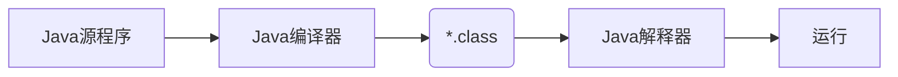

# Java简介

## Java简介

Java最早是由SUN公司（已被Oracle收购）的詹姆斯·高斯林在上个世纪90年代初开发的一种编程语言，最初被命名为Oak。

Java介于编译型语言和解释型语言之间，具有很好的兼容性。

其实，Java 还是一个平台。Java 平台由 Java 虚拟机（Java Virtual Machine，JVM）和 Java 应用编程接口（Application Programming Interface，API）构成。Java 应用编程接口为此提供了一个独立于操作系统的标准接口，可分为基本部分和扩展部分。在硬件或操作系统平台上安装 Java 平台后，Java 应用程序就可运行。

Java EE > Java SE > Java ME，Java SE（Java Platform Standard Edition），即标准版，包含标准的JVM和标准库， 包含了支持 Java Web 服务开发的类，并为 Java EE 提供基础，如 Java 语言基础、JDBC 操作、I/O 操作、网络通信以及多线程等技术。而Java EE（Java Platform Enterprise Edition）为企业版，它只是在Java SE的基础上加上了大量的API和库，以便方便开发Web应用、数据库、消息服务等，Java EE的应用使用的虚拟机和Java SE完全相同。Java ME（Java Platform Micro Edition）为微型版，为在移动设备和嵌入式设备（比如手机、PDA、电视机顶盒和打印机）上运行的应用程序提供一个健壮且灵活的环境。

- JDK：Java Development Kit
- JRE：Java Runtime Environment

简单地说，JRE就是运行Java字节码的虚拟机。但是，如果只有Java源码，要编译成Java字节码，就需要JDK，因为JDK除了包含JRE，还提供了**编译器**、**调试器**等开发工具。

```ascii
  ┌─    ┌──────────────────────────────────┐
  │     │     Compiler, debugger, etc.     │
  │     └──────────────────────────────────┘
 JDK ┌─ ┌──────────────────────────────────┐
  │  │  │                                  │
  │ JRE │      JVM + Runtime Library       │
  │  │  │                                  │
  └─ └─ └──────────────────────────────────┘
        ┌───────┐┌───────┐┌───────┐┌───────┐
        │Windows││ Linux ││ macOS ││others │
        └───────┘└───────┘└───────┘└───────┘
```

- JDK：Java Development Kit，Java开发工具包，包含JRE
- JRE：Java Runtime Environment，Java运行时环境，包含JVM
- JVM：Java Virtual Machine，Java虚拟机

**JRE = JVM + 核心类库**，JDK开发Java程序，JRE允许Java程序；**JDK = JRE + 开发工具**。

- JSR规范：Java Specification Request
- JCP组织：Java Community Process

为了保证Java语言的规范性，SUN公司确立了JSR规范，为Java平台添加功能，需要先创建一个JSR规范，定义好接口，确保兼容性；JCP负责审核JSP。

一个JSR规范发布时，还需同时发布“参考实现”，以及“兼容性测试套件”：

- RI：Reference Implementation
- TCK：Technology Compatibility Kit

Java规定，某个类定义的`public static void main(String[] args)`是Java程序的固定入口方法。

```ascii
┌──────────────────┐
│    Hello.java    │◀── source code
└──────────────────┘
          │ compile
          ▼
┌──────────────────┐
│   Hello.class    │◀── byte code
└──────────────────┘
          │ execute
          ▼
┌──────────────────┐
│    Run on JVM    │
└──────────────────┘
```

```java
public class Hello {
	public static void main(String[] args) {
		System.out.println("Hello, world!");
	}
}
```

## Java语言特点

- **面向对象**

Java 是一种面向对象的语言，它对对象中的类、对象、继承、封装、多态、接口、包等均有很好的支持。为了简单起见，Java 只支持类之间的单继承，但是可以使用接口来实现多继承。使用 Java 语言开发程序，需要采用完全的面向对象的思想设计程序和编写代码。

- **平台无关性**

平台无关性的具体表现在于，Java 是“一次编写，到处运行（Write Once，Run any Where）”的语言，因此采用 Java 语言编写的程序具有很好的可移植性，而保证这一点的正是 Java 的虚拟机机制。在引入虚拟机之后，Java 语言在不同的平台上运行**不需要重新编译**。

Java 语言使用 Java 虚拟机机制屏蔽了具体平台的相关信息，使得 Java 语言编译的程序只需生成虚拟机上的目标代码，就可以在多种平台上不加修改地运行。

- **简单性**

Java语言语法与C和C++非常接近，在运行文件时，Java 的解释器对这些字节码进行解释执行，执行过程中需要加入的类在连接阶段被载入到运行环境中。

- **多线程**

Java 语言是多线程的，这也是 Java 语言的一大特性，它必须由 `Thread` 类和它的子类来创建。Java 支持多个线程同时执行，并提供多线程之间的同步机制。任何一个线程都有自己的 `run()` 方法，要执行的方法就写在 `run()` 方法体内。

- **解释执行**

Java 程序在 Java 平台运行时会被编译成字节码文件，然后可以在有 Java 环境的操作系统上运行。在运行文件时，Java 的解释器对这些字节码进行解释执行，执行过程中需要加入的类在连接阶段被载入到运行环境中。

- **分布式**

Java 语言支持 Internet 应用的开发，在 Java 的基本应用编程接口中就有一个网络应用编程接口，它提供了网络应用编程的类库，包括 `URL`、`URLConnection`、`Socket` 等。Java 的 RIM 机制也是开发分布式应用的重要手段。

- **健壮性**

Java 的强类型机制、异常处理、垃圾回收机制等都是 Java 健壮性的重要保证。对指针的丢弃是 Java 的一大进步。另外，Java 的异常机制也是健壮性的一大体现。

- **高性能**

Java 的高性能主要是相对其他高级脚本语言来说的，随着 JIT（Just in Time）的发展，Java 的运行速度也越来越高。

- **安全性**

Java 通常被用在网络环境中，为此，Java 提供了一个安全机制以防止恶意代码的攻击。除了 Java 语言具有许多的安全特性以外，Java 还对通过**网络下载的类**增加一个安全防范机制，分配不同的名字空间以防替代本地的同名类，并包含安全管理机制。

## Java编译与反编译

### Java编译

`Hello.class`为编译生成的字节码文件，为JVM上的可执行文件

```
> javac Hello
ls
-- Hello.class
> java Hello
```

### Java反编译

将编译器得到的字节码还原为源文件。由于Java字节码不是最终的机器码，需要当前平台解释器解释为机器码，故给反编译留下了空间。

```shell
$ javap Hello.class
```

如果想反编译类库中的类，可使用`javap`命令：

```shell
$ java java.util.Date.class
```

### 运行过程



字节码文件是一种和任何具体机器环境及操作系统环境无关的中间代码。它是一种二进制文件，是 Java 源文件由 Java 编译器编译后生成的目标代码文件。编程人员和计算机都无法直接读懂字节码文件，它必须由专用的 Java 解释器来解释执行，因此 Java 是一种在编译基础上进行解释运行的语言。

Java 解释器负责将字节码文件翻译成具体硬件环境和操作系统平台下的机器代码，以便执行。因此 Java 程序不能直接运行在现有的操作系统平台上，它必须运行在被称为 Java 虚拟机的软件平台之上。

Java 虚拟机（JVM）是运行 Java 程序的软件环境，Java 解释器是 Java 虚拟机的一部分。在运行 Java 程序时，首先会启动 JVM，然后由它来负责解释执行 Java 的字节码程序，并且 Java 字节码程序只能运行于 JVM 之上。这样利用 JVM 就可以把 Java 字节码程序和具体的硬件平台以及操作系统环境分隔开来，只要在不同的计算机上安装了针对特定平台的 JVM，Java 程序就可以运行，而不用考虑当前具体的硬件平台及操作系统环境，也不用考虑字节码文件是在何种平台上生成的。

JVM 把这种不同软、硬件平台的具体差别隐藏起来，从而实现了真正的二进制代码级的跨平台移植。JVM 是 Java 平台架构的基础，Java 的跨平台特性正是通过在 JVM 中运行 Java 程序实现的。

### 安装目录

- `bin`：提供 JDK 工具程序，包括 `javac`、`java`、`javadoc`、`appletviewer` 等可执行程序。
- `include`：存放用于本地访问的文件。
- `jre`：存放 Java 运行环境文件。
- `lib`：存放 Java 的类库文件，工具程序实际上使用的是 Java 类库。JDK 中的工具程序，大多也由 Java 编写而成。
- `src.zip`：Java 提供的 API 类的源代码压缩文件。如果需要查看 API 的某些功能是如何实现的，可以査看这个文件中的源代码内容。

## Java就业方向

### Web开发

Java 在开发高访问、高并发、集群化的大型网站方面有很大的优势。

### Android 开发

Android 是全球最大的智能手机操作系统，它的主要开发语言就是 Java。

### 客户端开发

Java 客户端开发主要面向政府、事业单位和大型企业，如医疗、学校、OA、邮箱、投票、金融、考试、物流、矿山等信息方面的系统。

### 游戏开发

国内游戏行业近年来发展十分迅速，专业的游戏人才一直存在需求缺口。目前有一些游戏脚本语言可以与 Java 开发语言进行无缝交互，Java 开发语言本身也可以编写游戏脚本。因此学会 Java 开发后，也可以选择成为一名游戏开发人员。

## Java与C/C++的不同

- C++ 支持指针，而 Java 没有指针的概念。
- C++ 支持多继承，而 Java 不支持多重继承，但允许一个类实现多个接口。
- Java 是完全面向对象的语言，并且还取消了 C/C++ 中的结构和联合，使编译程序更加简洁
- Java 自动进行无用内存回收操作，不再需要程序员进行手动删除，而 C++ 中必须由程序释放内存资源，这就增加了程序员的负担。
- Java 不支持操作符重载，操作符重载则被认为是 C++ 的突出特征。
- Java 允许预处理，但不支持预处理器功能，所以为了实现预处理，它提供了引入语句（import），但它与 C++ 预处理器的功能类似。
- Java 不支持缺省参数函数，而 C++ 支持 。
- C 和 C++ 不支持字符串变量，在 C 和 C++ 程序中使用`NULL`终止符代表字符串的结束。在 Java 中字符串是用类对象（`String` 和 `StringBuffer`）来实现的
- `goto` 语句是 C 和 C++ 的“遗物”，Java 不提供 goto 语句，虽然 Java 指定 `goto` 作为关键字，但不支持它的使用，这使程序更简洁易读
- Java 不支持 C++ 中的自动强制类型转换，如果需要，必须由程序显式进行强制类型转换。

## JavaWeb开发框架

Rickard Oberg（WebWork 的开发者和 JBoss 的创始人之一）说过：“框架的强大之处不是源自它能让你做什么，而是它不能让你做什么。”Rickard 强调框架另一个层面的含义：框架能使混乱的内容变得结构化。框架保证了程序结构风格的统一。

从企业的角度来说，框架也降低了人员培训和软件维护的成本。框架在结构统一和创造力之间维持着一个合适的平衡。

### 主流开发框架

#### Spring框架

Spring 框架是一个轻量级的框架，渗透了 Java EE 技术的方方面面。Spring 框架是由于软件开发的复杂性而创建的，是一个开源框架。

Spring 框架的用途不仅限于服务器端的开发，从简单性、可测试性和松耦合性角度而言，绝大部分 Java 应用都可以从 Spring 框架中受益。

#### Spring MVC 框架

Spring MVC 框架属于 SpringFrameWork 的后续产品，已经融合在 Spring Web Flow 中，是结构清晰的 MVC Model2 的实现。

Spring 框架提供了构建 Web 应用程序的全功能 MVC 模块，并且拥有高度的可配置性，支持多种视图技术。它还可以进行定制化开发，使用相当灵活。

####  MyBatis 框架

MyBatis 框架是一个优秀的数据持久层框架，可在实体类和 SQL 语句之间建立映射关系，是一种半自动化的 ORM 实现。

Mybatis 的封装性要低于 Hibernate 框架，且性能优异、简单易学，因此应用较为广泛。

#### Hibernate 框架

Hibernate 框架不仅是一个优秀的持久化框架，也是一个开放源代码的对象关系映射框架。它对 JDBC 进行了轻量级的对象封装，将 POJO 与数据库表建立映射关系，形成一个全自动的 ORM 框架。

Hibernate 框架可以自动生成 SQL 语句，且自动执行，使 Java 程序员可以随心所欲地使用对象编程思维来操纵数据库。
