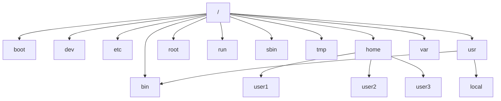
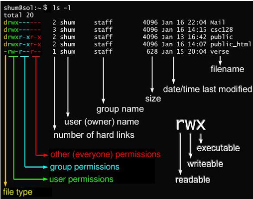

# Linux概述

## Linux历史

同一套操作系统是无法在不同的硬件平台上面运行。Linux提供了一个完整的操作系统当中最底层的硬件控制与资源管理的完整架构， 这个架构是沿袭了Unix良好的传统。

Linux的核心是由Linus Torvalds在1991年开发的。

最开始由于硬件与操作系统的改良，使得后来可以使用键盘来进行信息的输入。 但主机只能一次接入一部外设。1960年相容分时系统（Compatible
Time-Sharing System, CTSS ），可以让大型主机通过提供数个终端机（terminal）以连线进入主机，来利用主机的资源进行运算工作。这也是近代操作系统的起源（多线程）。为了更加强化大型主机的功能，以让主机的资源可以提供更多使用者来利用，由Bell、MIT发起Multics计划。Multics计划的目的是想要让大型主机可以达成提供300个以上的终端机连线使用的目标。最后以失败告终。

Thompson因为自己的需要，希望开发一个小小的操作系统以提供自己的需求。经过四个星期的奋斗，他终于以组合语言（Assembler）写出了一组核心程序，同时包括一些核心工具程序， 以及一个小小的文件系统。那个系统就是Unix的原型。

Thompson 的这个文件系统有两个重要的概念，分别是：

- 所有的程序或系统设备都是文件
- 不管建构编辑器还是附属文件，所写的程序只有一个目的，且要有效的完成目标。

后来Thompson与Ritchie合作想将Unics改以高阶程序语言来撰写。当时现成的高阶程序语言有B语言。 但是由B语言所编译出来的核心性能不是很好。后来Dennis Ritchie将B语言重新改写成C语言，再以C语言重新改写与编译Unics的核心， 最后正名与发行出Unix的正式版本。

柏克莱大学的Bill Joy在取得了Unix的核心源代码后，着手修改成适合自己机器的版本， 并且同时增加了很多工具软件与编译程序，最终将它命名为Berkeley Software Distribution（BSD）。这个BSD是Unix很重要的一个分支，后来也成为Sun公司的创立者。

由于Unix的高度可移植性与强大的性能，加上当时并没有版权的纠纷， 所以让很多商业公司开始了Unix操作系统的发展。

不过因为AT&T由于商业的考虑，以及在当时现实环境下的思考，于是将Unix的版权收回。

由于研究相关，谭宁邦教授于是乎自己动手写了Minix这个Unix Like的核心程序，并且完全没有参照Unix核心代码。

Richard Mathew Stallman（史托曼）在1984年发起的GNU（GNU's Not Unix）计划，这个计划的目的是：创建一个自由、开放的Unix操作系统（Free Unix）。后来开发出GNU C Compiler（gcc）和Emacs。

到了1985年，为了避免GNU所开发的自由软件被其他人所利用而成为专利软件， 所以他与律师草拟了有名的通用公共许可证（General Public License, GPL）， 并且称呼他为copyleft（相对于专利软件的copyright）。

有鉴于图形使用者接口（Graphical User Interface, GUI） 的需求日益加重，在1984年由MIT与其他协力厂商首次发表了X Window System ，并且更在1988年成立了非营利性质的XFree86这个组织。

1991年，芬兰的赫尔辛基大学的Linus Torvalds在BBS上面贴了一则消息， 宣称他以bash, gcc等 GNU 的工具写了一个小小的核心程序。”版权制度是
促进社会进步的手段， 版权本身不是自然权力“。

> "Free software" is a matter of liberty, not price. To understand the concept, you should think of "free speech", not "free beer". "Free software" refers to the users' freedom to run, copy, distribute, study, change, and improve the software.

而Linux的发展就是依据这个POSIX（Portable Operating System Interface，重点在规范核心与应用程序之间的接口）的标准规范，Unix上面的软件也是遵循这个规范来设计的， 如此一来，让Linux很容易就与Unix相容共享互有的软件。

Linux由于托瓦兹是针对386写的，跟386硬件的相关性很强，所以， 早期的Linux确实是不具有移植性的。不过，由于Open source，Linux不断茁壮。

Linux核心版本（4.0）与distribution 的版本并不相同。“Kernel（Real Time Operating System，实时操作系统） + Softwares + Tools + 可完整安装程序”称为Linux distribution， 一般中文翻译成可完整安装套件，或者Linux发布商套件等。

## Linux应用领域

目前市面上较知名的发行版有：Ubuntu、RedHat、CentOS、Debian、Fedora、SuSE、OpenSUSE、Arch Linux、SolusOS 等。

今天各种场合都有使用各种 Linux 发行版，从嵌入式设备到超级计算机，并且在服务器领域确定了地位，通常服务器使用 LAMP（Linux + Apache + MySQL + PHP）或 LNMP（Linux + Nginx+ MySQL + PHP）组合。

目前 Linux 不仅在家庭与企业中使用，并且在政府中也很受欢迎。

> Linux图形界面依照发布版不同而不同，可能互不兼容。大部分软件可自由获取，同时功能软件选择较少。

## Linux 系统目录结构



- `/bin`：

  bin 是 Binaries (二进制文件) 的缩写, 这个目录存放着最经常使用的命令。

- `/boot`：

  这里存放的是启动 Linux 时使用的一些核心文件，包括一些连接文件以及镜像文件。

- `/dev`：

  dev 是 Device(设备) 的缩写, 该目录下存放的是 Linux 的外部设备，在 Linux 中访问设备的方式和访问文件的方式是相同的。
  
- `/etc`：

  etc 是 Etcetera（等等）的缩写,这个目录用来存放所有的系统管理所需要的**配置文件**和**子目录**。

- `/home`：

  etc 是 Etcetera(等等) 的缩写,这个目录用来存放所有的系统管理所需要的配置文件和子目录。

- `/lib`：

  lib 是 Library(库) 的缩写这个目录里存放着系统最基本的动态连接共享库，其作用类似于 Windows 里的 DLL 文件。

- `+lost+found`：

  这个目录一般情况下是空的，当系统非法关机后，这里就存放了一些文件。

- `/media`：

  linux 系统会自动识别一些设备，例如U盘、光驱等等，当识别后，Linux 会把识别的设备挂载到这个目录下。

- `/mnt`：

  系统提供该目录是为了让用户临时挂载别的文件系统的，我们可以将光驱挂载在 /mnt/ 上，然后进入该目录即可以查看光驱里的内容。

- `/tmp`：
  tmp 是 temporary(临时) 的缩写这个目录是用来存放一些临时文件的。

- `/usr`：

   usr 是 unix shared resources(共享资源) 的缩写，这是一个非常重要的目录，用户的很多应用程序和文件都放在这个目录下，类似于 windows 下的 Program Files 目录。

- `usr/bin`：

  系统用户使用的应用程序。

- `/var`：

  var 是 variable(变量) 的缩写，这个目录中存放着在不断扩充着的东西，我们习惯将那些经常被修改的目录放在这个目录下。包括各种日志文件。

- `/run`：

  是一个临时文件系统，存储系统启动以来的信息。当系统重启时，这个目录下的文件应该被删掉或清除。如果你的系统上有 `/var/run` 目录，应该让它指向 run。

## Linux文件基本属性

Linux 系统是一种典型的多用户系统，不同的用户处于不同的地位，拥有不同的权限。

在 Linux 中我们通常使用以下两个命令来修改文件或目录的所属用户与权限：

- `chown`（change owner）：修改所属用户与组
- `chmod`（change mode）：修改用户的权限。

在 Linux 中我们可以使用 `ll` 或者 `ls –l` 命令来显示一个文件的属性以及文件所属的用户和组。

```shell
# ls -l
total 64
dr-xr-xr-x   2 root root 4096 Dec 14  2012 bin
dr-xr-xr-x   4 root root 4096 Apr 19  2012 boot
...
```

`d` 在 Linux 中代表该文件是一个目录文件；`-`为文件；`l`表示链接文档；`b`表示为装置文件里面的可供储存的接口设备（可随机存取装置）；`c`表示为装置文件里面的串行端口设备（一次性读取装置）。

接下来的字符中，以三个为一组，且均为 `rwx` 的三个参数的组合。其中， `r` 代表可读(read)、 `w` 代表可写(write)、 `x` 代表可执行(execute)。 

```
文件类型 	属主权限	属组权限	其他用户权限	

   0	     1 2 3		4 5 6		  7 8 9
```



### Linux文件属主和属组

对于文件来说，它都有一个特定的所有者，也就是对该文件具有所有权的用户。

同时，在Linux系统中，用户是按组分类的，一个用户属于一个或多个组。文件所有者以外的用户又可以分为文件所属组的同组用户和其他用户。

> 对于 root 用户来说，一般情况下，文件的权限对其不起作用。

### 更改文件属性

#### `chgrp`：更改文件属组

```shell
chgrp [-R] 属组名 文件名
```

`-R`：递归更改文件属组

```shell
chgrp s2021013122 feb
```

#### `chown`：更改文件属主/属组

```shell
chown [-R] 属主名 文件名
chown [-R] 属主名:属组名 文件名
```

```shell
chown s2021013122:s2021013122 hello.c
```

#### `chmod`：更改文件的属性

Linux文件属性有两种设置方法，一种是数字，一种是符号。

- r: 4
- w: 2
- x: 1

```shell
chmod 777 hello.c
chomd u=rwx, o= hello.c
```

## Linux文件与目录管理

Linux 的目录结构为树状结构，最顶级的目录为根目录 `/`。

### 处理目录命令

#### `ls`：列出目录

`ls`为list缩写

选项与参数：

- `-a` ：全部的文件，连同隐藏文件( 开头为 . 的文件) 一起列出来
- `-d` ：仅列出**目录**本身，而不是列出目录内的文件数据
- `-l` ：长数据串列出，包含文件的属性与权限等等数据；

#### `cd`：切换目录

`cd`是Change Directory的缩写，这是用来变换工作目录的命令。

```shell
# 相对路径
cd ./dir2
# 返回家目录
cd ~
# 返回上一级目录
cd ..
```

#### `pwd`：显示当前所在目录

`pwd` 是 Print Working Directory 的缩写，也就是显示目前所在目录的命令。

选项与参数：

- `-P` ：显示出确实的路径，而非使用链接 (link) 路径。

#### `mkdir`：创建目录

```shell
mkdir [-mp] dirname
```

- `-m` ：配置文件的权限喔！直接配置，忽略默认权限 (umask)
- `-p`：帮助你直接将所需要的目录(包含上一级目录)递归创建。

```shell
[s2021013123@centos8 /]$ cd tmp
[s2021013123@centos8 tmp]$ mkdir test
[s2021013123@centos8 tmp]$ mkdir test1/test2/test3/test4
mkdir: 无法创建目录 “test1/test2/test3/test4”: 没有那个文件或目录
[s2021013123@centos8 tmp]$ mkdir -p test1/test2/test3/test4


[s2021013123@centos8 tmp]$ mkdir -m 711 test2
[s2021013123@centos8 tmp]$ ls -al test2
总用量 12
drwx--x--x.   2 s2021013123 s2021013123    6 3月  17 11:24 .
```

#### `rmdir`：删除目录

```sh
rmdir [-p] dirname
```

- `-p` ：从该目录起，一次删除多级空目录

```sh
[s2021013123@centos8 tmp]$ rmdir test1/test2/test3/test4
[s2021013123@centos8 tmp]$ ls
temp
test
test1
[s2021013123@centos8 tmp]$ rmdir -p test1/test2/test3
[s2021013123@centos8 tmp]$ ls
temp
test
```

#### `cp`：复制文件或目录

```sh
cp [-adfilprsu] src dest
cp [options] src1 src2 ... dest
```

- `-a`：相当于 `-pdr` 的意思，至于`pdr` 请参考下列说明；(常用)
- `-d`：若来源档为链接档的属性(link file)，则复制链接档属性而非文件本身；
- `-f`：强制(force)，若目标文件已经存在且无法开启，则移除后再尝试一次；
- `-i`：若目标档(destination)已经存在时，在覆盖时会先询问动作的进行(常用)
- `-l`：进行硬式链接(hard link)的链接档创建，而非复制文件本身；
- `-p`：连同文件的属性一起复制过去，而非使用默认属性(备份常用)；
- `-r`：递归持续复制，用于目录的复制行为；
- `-s`：复制成为符号链接档 (symbolic link)，亦即『捷径』文件；
- `-u`：若 destination 比 source 旧才升级 destination。

```sh
# 覆盖前询问
[s2021013123@centos8 tmp]$ cp -i hello.c test/hello.c
cp：是否覆盖'test/hello.c'？ y

# 复制文件夹
[s2021013123@centos8 tmp]$ mkdir test1
[s2021013123@centos8 tmp]$ cp test1 test/test1
cp: 未指定 -r；略过目录'test1'
[s2021013123@centos8 tmp]$ cp -r test1 test/test1

# 同步改变文件属性
[s2021013123@centos8 tmp]$ cp -p hello.c test
```

#### `rm`：移除文件或目录

```sh
rm [-fir] file or dir
```

- `-f` ：就是 force 的意思，忽略不存在的文件，不会出现警告信息；
- `-i` ：互动模式，在删除前会询问使用者是否动作
- `-r` ：递归删除啊！最常用在目录的删除。这是非常危险的选项

```javascript
[s2021013123@centos8 tmp]$ rm -i t.c
rm：是否删除普通文件 't.c'？y

[s2021013123@centos8 tmp]$ rm -f t.c
```

#### `mv`：移动文件或目录

- `-f` ：force 强制的意思，如果目标文件已经存在，不会询问而直接覆盖；
- `-i` ：若目标文件 (destination) 已经存在时，就会询问是否覆盖。
- `-u` ：若目标文件已经存在，且 source 比较新，才会升级 (update)

### 内容查看命令

#### `cat`：显示文件内容

```sh
cat [-AbEnTv]
```

- `-A` ：相当於 `-vET` 的整合选项，可列出一些特殊字符而不是空白而已；
- `-b` ：列出行号，仅针对非空白行做行号显示，空白行不标行号。
- `-E` ：将结尾的断行字节 $ 显示出来；
- `-n` ：列印出行号，连同空白行也会有行号，与 -b 的选项不同；
- `-T` ：将 [tab] 按键以 ^I 显示出来；
- `-v` ：列出一些看不出来的特殊字符

```sh
# 列出一些特殊字符而不是空白而已
[s2021013123@centos8 tmp]$ cat -A hello.c
#include <stdio.h>$
$
int main()$
{$
    printf(M-bM-^@M-^\Hello WorldM-bM-^@M-^]);$
$
    return 0;$
}$
# 列出行号，仅针对非空白行做行号显示
[s2021013123@centos8 tmp]$ cat -b hello.c
     1  #include <stdio.h>

     2  int main()
     3  {
     4      printf(“Hello World”);

     5      return 0;
     6  }
# 显示Tab
[s2021013123@centos8 tmp]$ cat -T hello.c
#include <stdio.h>

int main()
{
    printf(“Hello World”);

    return 0;
}
# 显示不可见字符
[s2021013123@centos8 tmp]$ cat -v hello.c
#include <stdio.h>

int main()
{
    printf(M-bM-^@M-^\Hello WorldM-bM-^@M-^]);

    return 0;
}
# 显示行号（常用）
[s2021013123@centos8 tmp]$ cat -n hello.c
     1  #include <stdio.h>
     2
     3  int main()
     4  {
     5      printf(“Hello World”);
     6
     7      return 0;
     8  }

```

#### `tac`：从最后一行开始显示

```sh
[s2021013123@centos8 tmp]$ tac  hello.c
}
    return 0;

    printf(“Hello World”);
{
int main()

#include <stdio.h>
```

#### `nl`：显示行号

```sh
nl [-bnw] filename
```

- `-b` ：指定行号指定的方式，主要有两种：
  `-b a` ：表示不论是否为空行，也同样列出行号(类似 cat -n)；
  `-b t` ：如果有空行，空的那一行不要列出行号(默认值)；
- `-n` ：列出行号表示的方法，主要有三种：
  `-n ln` ：行号在荧幕的最左方显示；
  `-n rn` ：行号在自己栏位的最右方显示，且不加 0 ；
  `-n rz` ：行号在自己栏位的最右方显示，且加 0 ；

```sh
[s2021013123@centos8 tmp]$ nl hello.c
     1  #include <stdio.h>

     2  int main()
     3  {
     4      printf(“Hello World”);

     5      return 0;
     6  }
     
[s2021013123@centos8 tmp]$ nl -n ln a.txt
1       Hello, World
[s2021013123@centos8 tmp]$ nl -n rn a.txt
     1  Hello, World
[s2021013123@centos8 tmp]$ nl -n rz a.txt
000001  Hello, World
```

#### `more`：页面翻动

```sh
[s2021013123@centos8 ~]$ more pw
```

- 空白键 (space)：代表向下翻一页；
- Enter     ：代表向下翻『一行』；
- /字串     ：代表在这个显示的内容当中，向下搜寻『字串』这个关键字；
- :f      ：立刻显示出档名以及目前显示的行数；
- q       ：代表立刻离开 more ，不再显示该文件内容。
- b 或 [ctrl]-b ：代表往回翻页，不过这动作只对文件有用，对管线无用。

#### `less`：页面翻动

```sh
less filename
```

- 空白键  ：向下翻动一页；
- [pagedown]：向下翻动一页；
- [pageup] ：向上翻动一页；
- /字串   ：向下搜寻『字串』的功能；
- ?字串   ：向上搜寻『字串』的功能；
- n     ：重复前一个搜寻 (与 / 或 ? 有关！)
- N     ：反向的重复前一个搜寻 (与 / 或 ? 有关！)
- q     ：离开 less 这个程序；

> `less`可以按键盘上下方向键显示上下文内容，`more`不能通过上下方向键控制显示（但是可以用b实现向上翻页，空格键实现向下翻页）
>
> 2、`less`不必读整个文件，加载速度会比`more`更快
>
> 3、`less`退出后shell不会留下刚显示的内容，而`more`退出后会在shell上留下刚显示的内容

```sh
[s2021013123@centos8 ~]$ less pw
```

#### `head`：取出前几行

```java
head [-n number] filename
```

- `-n` ：后面接数字，代表显示几行

```sh
[s2021013123@centos8 tmp]$ head -n 2 hello.c
#include <stdio.h>

```

#### `tail`：取出后几行

```sh
head [-n number] filename
```

- `-n` ：后面接数字，代表显示几行的意思
- `-f` ：表示持续侦测后面所接的档名，要等到按下[ctrl]-c才会结束tail的侦测

```sh
[s2021013123@centos8 tmp]$ tail hello.c
#include <stdio.h>

int main()
{
    printf(“Hello World”);

    return 0;
}
```

## Linux链接

### 硬连接

硬连接指通过索引节点来进行连接。在 Linux 的文件系统中，保存在磁盘分区中的文件不管是什么类型都给它分配一个编号，称为索引节点号(Inode Index)。在 Linux 中，多个文件名指向同一索引节点是存在的。比如：A 是 B 的硬链接（A 和 B 都是文件名），则 A 的目录项中的 inode 节点号与 B 的目录项中的 inode 节点号相同，即一个 inode 节点对应两个不同的文件名，两个文件名指向同一个文件，A 和 B 对文件系统来说是完全平等的。删除其中任何一个都不会影响另外一个的访问。

硬连接的作用是允许一个文件拥有多个有效路径名，这样用户就可以建立硬连接到重要文件，以**防止“误删”**的功能。其原因如上所述，因为对应该目录的索引节点有一个以上的连接。只删除一个连接并不影响索引节点本身和其它的连接，只有当最后一个连接被删除后，文件的数据块及目录的连接才会被释放。也就是说，文件真正删除的条件是与之相关的所有硬连接文件均被删除。

### 软连接

另外一种连接称之为符号连接（Symbolic Link），也叫软连接。软链接文件有类似于 Windows 的**快捷方式**。它实际上是一个特殊的文件。在符号连接中，文件实际上是一个文本文件，其中包含的有另一文件的位置信息。比如：A 是 B 的软链接（A 和 B 都是文件名），A 的目录项中的 inode 节点号与 B 的目录项中的 inode 节点号不相同，A 和 B 指向的是两个不同的 inode，继而指向两块不同的数据块。但是 A 的数据块中存放的只是 B 的路径名（可以根据这个找到 B 的目录项）。A 和 B 之间是“主从”关系，如果 B 被删除了，A 仍然存在（因为两个是不同的文件），但指向的是一个无效的链接。

```sh
[s2021013123@centos8 tmp]$ vi test1.txt						# 创建测试文件
[s2021013123@centos8 tmp]$ ln test1.txt test_demo1.txt		# 创建硬连接
[s2021013123@centos8 tmp]$ ln -s test1.txt test_demo2.txt	# 创建软连接
[s2021013123@centos8 tmp]$ ls -li							# -i参数显示文件的inode节点信息
17907285 -rw-rw-r--. 2 s2021013123 s2021013123  12 3月  17 16:36 test1.txt
17907285 -rw-rw-r--. 2 s2021013123 s2021013123  12 3月  17 16:36 test_demo1.txt
17055473 lrwxrwxrwx. 1 s2021013123 s2021013123   9 3月  17 16:37 test_demo2.txt -> test1.txt
```

## Linux磁盘管理

### `df`：列出磁盘使用量

`df`（disk free）命令参数功能：检查文件系统的磁盘空间占用情况。可以利用该命令来获取硬盘被占用了多少空间，目前还剩下多少空间等信息。

```sh
df [-ahikHTm] file
```

- `-a` ：列出所有的文件系统，包括系统特有的 /proc 等文件系统；
- `-k` ：以 KBytes 的容量显示各文件系统；
- `-m` ：以 MBytes 的容量显示各文件系统；
- `-h` ：以人们较易阅读的 GBytes, MBytes, KBytes 等格式自行显示；
- `-H` ：以 M=1000K 取代 M=1024K 的进位方式；
- `-T` ：显示文件系统类型, 连同该 partition 的 filesystem 名称 (例如 ext3) 也列出；
- `-i` ：不用硬盘容量，而以 inode 的数量来显示

```sh
[s2021013123@centos8 ~]$ df -k /
文件系统          1K-块    已用     可用 已用% 挂载点
/dev/sda5      26940568 5447576 21492992   21% /
```

### `du`：列出磁盘使用情况

 `du`（disk usage）命令也是查看使用空间的，但是与 df 命令不同的是 Linux du 命令是对文件和目录磁盘使用的空间的查看。

```sh
du [-ahskm] 文件或目录名称
```

- `-a` ：列出所有的文件与目录容量，因为默认仅统计目录底下的文件量。
- `-h` ：以人们较易读的容量格式 (G/M) 显示；
- `-s` ：列出总量而已，而不列出每个各别的目录占用容量；
- `-S` ：不包括子目录下的总计，与 -s 有点差别。
- `-k`：以 KBytes 列出容量显示；
- `-m` ：以 MBytes 列出容量显示；

```sh
[s2021013123@centos8 ~]$ du -h
0       ./.mozilla/extensions
0       ./.mozilla/plugins
0       ./.mozilla
32K     ./.config/pulse
0       ./.config/procps
32K     ./.config
0       ./dir2/dir21
0       ./dir2/dir22
0       ./dir2/dir23
0       ./dir2/dir24
0       ./dir2
0       ./dir3/dir31/dir311/dir3111
0       ./dir3/dir31/dir311
0       ./dir3/dir31
0       ./dir3
224K    .
```

