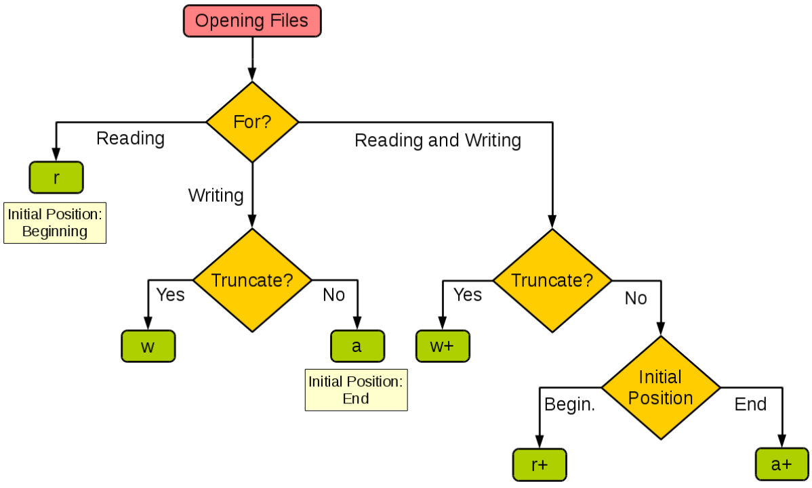

# Python3基础教程

## Python3简介

Python 是一个高层次的结合了**解释性**、**编译性**、**互动性**和**面向对象**的**脚本**语言。

Python 的设计具有很强的可读性，相比其他语言经常使用英文关键字，其他语言的一些标点符号，它具有比其他语言更有特色语法结构。

```shell
$python -V
Python 3.10.0
```

### 第一个Python程序

```shell
$python
Python 3.10.0 (tags/v3.10.0:b494f59, Oct  4 2021, 19:00:18) [MSC v.1929 64 bit (AMD64)] on win32
Type "help", "copyright", "credits" or "license" for more information.
>>> print("Hello, world")
Hello, world
```

### Python的发展历史

Python 是由 Guido van Rossum 在八十年代末和九十年代初，在荷兰国家数学和计算机科学研究所设计出来的。

Python 本身也是由诸多其他语言发展而来的,这包括 ABC、Modula-3、C、C++、Algol-68、SmallTalk、Unix shell 和其他的脚本语言等等。

像 Perl 语言一样，Python 源代码同样遵循 GPL(GNU General Public License)协议。

现在 Python 是由一个核心开发团队在维护，Guido van Rossum 仍然占据着至关重要的作用，指导其进展。

Python 2.0 于 2000 年 10 月 16 日发布，增加了实现完整的垃圾回收，并且支持 Unicode。

Python 3.0 于 2008 年 12 月 3 日发布，此版不完全兼容之前的 Python 源代码。不过，很多新特性后来也被移植到旧的Python 2.6/2.7版本。

Python 3.0 版本，常被称为 Python 3000，或简称 Py3k。相对于 Python 的早期版本，这是一个较大的升级。

Python 2.7 被确定为最后一个 Python 2.x 版本，它除了支持 Python 2.x 语法外，还支持部分 Python 3.1 语法。

### Python特点

- 易于学习：Python有相对较少的关键字，结构简单，和一个明确定义的语法，学习起来更加简单。
- 易于阅读：Python代码定义的更清晰。
- 易于维护：Python的成功在于它的源代码是相当容易维护的。
- 一个广泛的标准库：Python的最大的优势之一是丰富的库，**跨平台**，在UNIX，Windows和Macintosh兼容很好。
- 互动模式：互动模式的支持，您可以从终端输入执行代码并获得结果的语言，互动的测试和调试代码片断。
- 可移植：基于其开放源代码的特性，Python已经被移植（也就是使其工作）到许多平台。
- 可扩展：如果你需要一段运行很快的关键代码，或者是想要编写一些不愿开放的算法，你可以使用C或C++完成那部分程序，然后从你的Python程序中调用。
- 数据库：Python提供所有主要的商业数据库的接口。
- GUI编程：Python支持GUI可以创建和移植到许多系统调用。
- 可嵌入: 你可以将Python嵌入到C/C++程序，让你的程序的用户获得"脚本化"的能力。

### Python应用

-  **云计算**：云计算最热的语言，典型的应用OpenStack
-  **WEB开发**：许多优秀的 WEB 框架，许多大型网站是Python开发、YouTube、Dropbox、Douban……典型的Web框架包括Django
-  **科学计算和人工智能**：典型的图书馆NumPy、SciPy、Matplotlib、Enided图书馆、熊猫
-  **系统操作和维护**：操作和维护人员的基本语言
-  **金融**：定量交易、金融分析，在金融工程领域，Python 不仅使用最多，而且其重要性逐年增加。
-  **图形 GUI**：PyQT，WXPython，TkInter

## Python3基础语法

### 编码

默认情况下，Python 3 源码文件以 **UTF-8** 编码，所有字符串都是 unicode 字符串。 当然你也可以为源码文件指定不同的编码：

```python
# -*- coding: cp-1252 -*-
```

### 标识符

- 第一个字符必须是字母表中字母或下划线 `_ `。
- 标识符的其他的部分由字母、数字和下划线组成。
- 标识符对大小写敏感。

在 Python 3 中，可以用中文作为变量名，允许非ASCII字符作为标识符。

### Python保留字

```python
>>> import keyword
>>> keyword.kwlist
['False', 'None', 'True', 'and', 'as', 'assert', 'async', 'await', 'break', 'class', 'continue', 'def', 'del', 'elif', 'else', 'except', 'finally', 'for', 'from', 'global', 'if', 'import', 'in', 'is', 'lambda', 'nonlocal', 'not', 'or', 'pass', 'raise', 'return', 'try', 'while', 'with', 'yield']
```

### 注释

Python中单行注释以 `# `开头，多行注释可以用多个 `#` 号，还有` '''` 和 `"""`：

```python
# 一个注释

'''
注释
'''

"""
注释
"""

print("Hello, world")
```

### 行与缩进

python最具特色的就是使用缩进来表示代码块，不需要使用大括号 `{}` 。

缩进的空格数是可变的，但是同一个代码块的语句必须包含相同的缩进空格数。实例如下：

```python
if True:
    print("Answer")
    print("True")
else:
    print("Answer")
    print("False")
```

### 多行语句

Python 通常是一行写完一条语句，但如果语句很长，我们可以使用反斜杠`\`来实现多行语句，例如：

```python
total = item_one + \
        item_two + \
        item_three
```

## Python3基本数据类型

Python 中的变量不需要声明。每个变量在使用前都必须赋值，变量赋值以后该变量才会被创建。

```python
counter = 100
miles = 1000.0
name = "hello"

print(counter)
print(miles)
print(name)
```

Python允许你同时为多个变量赋值。例如：

```python
a = b = c = 1
a, b, c = 1, 2.0, "3.0"
```

### 基本数据类型

Python3 中有六个标准的数据类型：

- `Number`（数字）
- `String`（字符串）
- `List`（列表）
- `Tuple`（元组）
- `Set`（集合）
- `Dictionary`（字典）

**不可变数据：**Number、String、Tuple；

**可变数据：**List、Dictionary、Set。

### 数字

#### 数字类型

Python3支持`int`、`float`、`bool`、`complex`。

在Python 3里，只有一种整数类型 `int`，表示为长整型，没有 python2 中的 `long`。

内置的`type()` 函数可以用来查询变量所指的对象类型。

```python
>>> a, b, c, d = 20, 5.5, True, 3 + 4j
>>> print(type(a), type(b), type(c), type(d))
<class 'int'> <class 'float'> <class 'bool'> <class 'complex'>
```

此外还可以用` isinstance` 来判断：

```python
>>> a = 111
>>> isinstance(a, int)
True
```

#### 删除对象

您可以通过使用`del`语句删除单个或多个对象

```python
del var
del var_a, var_b
```

#### 数值运算

```python
>>> 5 + 1
6
>>> 4.3 - 2
2.3
>>> 2 / 4
0.5
>>> 2 // 4
0
>>> 17 % 3
2
>>> 2 ** 5
32
```

注：数值的除法包含两个运算符：`/` 返回一个浮点数，`//` 返回一个整数。

Python 还支持复数，复数由实数部分和虚数部分构成，可以用 `a + bj`，或者 `complex(a, b)` 表示， 复数的实部 `a` 和虚部 `b` 都是浮点型。

#### 相关函数

##### 数学函数

```python
abs(x)      # 绝对值
ceil(x)     # 向上取整
cmp(x, y)   # 比大小，已弃用
exp(x)      # 返回e的2次
fabs(x)     # 绝对值
log(x)      # 取自然对数，math.log(math.e)
log10(x)    # 取以10为底对数
max(x, y..) # 返回较大值
min(x, y..) # 返回较小值
modify(x)   # 返回x的整数部分和小数部分
pow(x, y)   # x**y
round(x,[n])# 返回四舍五入的值，n表示保留的位数
sqrt(x)	    # 返回数字x的平方根
```

##### 随机数函数

```python
import random

a = random.choice(range(10)) # 从序列随机挑选一个元素
print(a)

# 从指定范围内，按指定基数递增的集合中获取一个随机数，基数默认值为 1
b = random.randrange(1, 100, 2) 
print(b)

# 随机生成下一个实数，它在[0,1)范围内。
c = random.random()
print(c)

# 改变随机数生成器的种子seed
random.seed(1)

set = [x for x in range(10)]
# 对序列重新洗牌
random.shuffle(set) 
print(set)

# 生成指定区间的随机数
d = random.uniform(1, 3) 
print(d)
```

##### 三角函数

```python
import math

print(math.acos(1))
print(math.cos(math.pi / 2))
print(math.atan2(1, 1)) # 给定y, x坐标的反正切 
print(math.hypot(3, 4)) # 返回欧几里得范数
print(math.degrees(math.pi / 2)) # 将弧度转化为角度
print(math.radians(90)) # 将角度转化为弧度
```

##### 数字常量

```python
print(math.pi)
print(math.e)
```

```
3.141592653589793
2.718281828459045
```

### 字符串

Python中的字符串用单引号 `'` 或双引号 `"` 括起来，同时使用反斜杠 `\` 转义特殊字符。

#### 访问字符串

字符串的截取的语法格式如下：

```python
变量[头下标:尾下标]
```

索引值以 0 为开始值，-1 为从末尾的开始位置。

```python
print(str)
print(str[0:-1]) #左闭右开
print(str[0])
print(str[2:5])
print(str[2:])
print(str * 2)
print(str + "!")
```

#### 转义字符

Python 使用反斜杠 `\` 转义特殊字符，如果你不想让反斜杠发生转义，可以在字符串前面添加一个 `r`，表示原始字符串：

```python
>>> print('Ru\noob')
Ru
oob
>>> print(r'Ru\noob')
Ru\noob
```

另外，反斜杠`\`可以作为续行符，表示下一行是上一行的延续。也可以使用 `"""..."""` 或者 `'''...'''` 跨越多行。

```python
print("Hello\
      world")   # 续行
print("\\")     # 反斜杠
print("\'")     # 单引号
print("\"")     # 双引号
print("\a")     # 响铃
print("H\bHi")  # 退格
print("\t\n\f") # 水平制表换行换页
print("hhh\rt") # 回车
print("\078")   # 8进制数
print("\x123")  # 16进制数
```

```
Hello      world
\
'
"

Hi


thh
8
3
```

与 C 字符串不同的是，Python 字符串不能被改变。向一个索引位置赋值，比如 `word[0] = 'm'` 会导致错误。

注意，Python 没有单独的字符类型，一个字符就是长度为1的字符串。

#### 字符串格式化

```python
>>> print('我叫% s 今年 %d 岁！' % ('小明', 10))
我叫小明 今年 10 岁！
```

| 符  号 | 描述                                 |
| :----- | :----------------------------------- |
| `%c`   | 格式化字符及其ASCII码                |
| `%s`   | 格式化字符串                         |
| `%d`   | 格式化整数                           |
| `%u`   | 格式化无符号整型                     |
| `%o`   | 格式化无符号八进制数                 |
| `%x`   | 格式化无符号十六进制数               |
| `%X`   | 格式化无符号十六进制数（大写）       |
| `%f`   | 格式化浮点数字，可指定小数点后的精度 |
| ` %e`  | 用科学计数法格式化浮点数             |
| `%E`   | 作用同`%e`，用科学计数法格式化浮点数 |
| `%g`   | `%f`和`%e`的简写                     |
| `%G`   | `%f` 和 `%E` 的简写                  |
| `%p`   | 用十六进制数格式化变量的地址         |

#### 三引号

```python
str = """ Ni
    Tab

    jjj
"""
print(str)
```

#### f-string

`f-string` 格式化字符串以 `f` 开头，后面跟着字符串，字符串中的表达式用大括号 {} 包起来，它会将变量或表达式计算后的值替换进去。

```python
>>> name = 'HZY'
>>> f'Hello {name}'
'Hello HZY'
>>> f'{1 + 2}'
'3'
```

#### 相关方法

```python
str = "Hello"
# 首字母大写
print(str.capitalize())
# 返回一个指定的宽度 width 居中的字符串，fillchar 为填充的字符，默认为空格      
print(str.center(10, '#'))      
# 返回 str 在 string 里面出现的次数，如果beg或者end指定则返回指定范围内str出现的次数
print(str.count('l', 0, len(str)))
# 检测 str 是否包含在字符串中，如果指定范围beg和end，则检查是否包含在指定范围内，如果包含返回开始的索引值，否则返回-1
print(str.find('l', 0, len(str)))
# 跟find()方法一样，只不过如果str不在字符串中会报一个异常
print(str.index('l', 0, len(str)))
# 如果字符串至少有一个字符并且所有字符都是字母或数字
print(str.isalnum())
# 以指定字符串作为分隔符，将seq中所有的元素(的字符串表示)合并为一个新的字符串
seq = ("h", "e", "l", "l", "o")
print("-".join(seq))
# 把 将字符串中的old替换成new,如果max指定，则替换不超过max次
print("11111".replace("1", "2", 3))
# 删除字符串末尾的空格或指定字符
txt = "banana,,,,,ssqqqww....."
print(txt.rstrip(",.qsw"))
# 删除字符串首的空格或指定字符
s = "     bannna"
print(s.lstrip())
# 以 str 为分隔符截取字符串，如果num有指定值，则仅截取num+1个子字符串
set = str.split()
print(set)
# 在字符串上执行 lstrip()和 rstrip()
print("    ss  ".strip())
# 返回"标题化"的字符串,就是说所有单词都是以大写开始，其余字母均为小写
print(str.title())
```

```
Hello
##Hello###
2
2
2
True
h-e-l-l-o
22211
banana
bannna
['Hello']
ss
Hello
```

### 列表

List 是 Python 中使用最频繁的数据类型。

列表可以完成大多数集合类的数据结构实现。列表中元素的类型可以不相同，它支持数字，字符串甚至可以包含列表（所谓嵌套）。

列表是写在方括号 `[]` 之间、用逗号分隔开的元素列表。

#### 访问列表

```python
list = ['abcd', 789, 2.34, True, complex(2, 3)]
tiny_list = [123, 34.2]

print(list)
print(list[0])
print(list[1:3])
print(tiny_list * 2)
print(list + tiny_list)
```

```
['abcd', 789, 2.34, True, (2+3j)]
abcd
[789, 2.34]
[123, 34.2, 123, 34.2]
['abcd', 789, 2.34, True, (2+3j), 123, 34.2]
```

与Python字符串不一样的是，列表中的元素是可以改变的：

```python
>>> a = [1, 2, 3, 4, 5]
>>> a[0] = 9
>>> a
[9, 2, 3, 4, 5]
>>> a[2:5] = []
>>> a
[9, 2]
```

Python 列表截取可以接收第三个参数，参数作用是截取的步长：

```python
>>> a = [1, 2, 3, 4, 5, 6, 7, 8, 9, 10]
>>> a[1::2]
[2, 4, 6, 8, 10]
```

如果第三个参数为负数表示逆向读取。

#### 列表比较

列表比较需要引入`operator` 模块的 `eq` 方法：

```python
import operator

a = [1, 2]
b = [2, 3]
c = [2, 3]
print("operator.eq(a,b): ", operator.eq(a,b))
print("operator.eq(c,b): ", operator.eq(c,b))
```

```
operator.eq(a,b):  False
operator.eq(c,b):  True
```

#### 相关方法

```python
list = [1, 2, 3]

# 在列表尾添加新对象
list.append(4)  
# 统计某个元素出现个数
print(list.count(1))
seq = [5, 6, 7]
# 在末尾一次性追加多值
list.extend(seq)
# 从列表中找出某个值第一个匹配项的索引位置
print(list.index(1))
# 将对象插入列表
list.insert(0, 0)
print(list)
# 移除列表中的一个元素（默认最后一个元素），并且返回该元素的值
print(list.pop())
# 移除列表中某个值的第一个匹配项
list.remove(1)
# 反向列表元素
list.reverse()
print(list)
list.sort(reverse=False)
print(list)
# 拷贝列表
copy_list = list.copy()
print(copy_list)
```

### 元组

元组（tuple）与列表类似，不同之处在于元组的元素不能修改。元组写在小括号 `()` 里，元素之间用逗号隔开。

元组中的元素类型也可以不相同：

```python
tuple = ['abcd', 789, 2.34, True, complex(2, 3)]
tiny_tuple = [123, 34.2]

print(tuple)
print(tuple[0])
print(tuple[1:3])
print(tiny_tuple * 2)
print(tuple + tiny_tuple)
```

虽然`tuple`的元素不可改变，但它可以包含可变的对象，比如list列表。

### 集合

集合（set）是由一个或数个形态各异的大小整体组成的，构成集合的事物或对象称作元素或是成员。

基本功能是进行成员关系测试和删除重复元素。

#### 创建集合

创建格式：

```python
parame = {value01, value02, ...}
set(value)
```

```python
sites = {'Google', 'IE', 'Facebook', 'Twiter'}

print(sites)  # 输出集合，重复的元素被自动去掉

if 'Google' in sites:

  print('Google在集合中')

else:

  print('Google不在集合中')

a = set('abracadabra')
b = set('alacazam')

print(a)
print(a - b)   # a 和 b 的差集
print(a | b)   # a 和 b 的并集
print(a & b)   # a 和 b 的交集
print(a ^ b)   # a 和 b 中不同时存在的元素
```

```
Google在集合中
{'r', 'a', 'b', 'd', 'c'}
{'r', 'b', 'd'}
{'l', 'r', 'a', 'z', 'm', 'b', 'd', 'c'}
{'a', 'c'}
{'m', 'b', 'd', 'l', 'r', 'z'}
```

#### 相关方法

```python
set = {1, 2}
print(set)
# 移除集合中的所有元素
set.clear() 
print(set)
# 为集合添加元素
set.add(1)
set.add(2)
# 返回多个集合的差集
print(set.difference({1, 3}))
# 删除集合中指定的元素
set.discard(2)
# 返回集合的交集
print(set.intersection({1}))
# 判断两个集合是否包含相同的元素
print(set.isdisjoint({1, 2}))
# 判断指定集合是否为该方法参数集合的子集
print(set.issubset({1}))
# 判断该方法的参数集合是否为指定集合的子集
print(set.issuperset({1}))
# 随机删除元素
set.pop()
# 移出指定元素
set.add(1)
set.remove(1)
# 返回两个集合的并集
set = set.union({3, 4})
# 给集合添加元素（迭代器）
set.update({1, 2})
print(set)
```


### 字典

字典（dictionary）是Python中另一个非常有用的内置数据类型。

列表是有序的对象集合，字典是无序的对象集合。两者之间的区别在于：字典当中的元素是通过键来存取的，而不是通过偏移存取。

字典是一种映射类型，字典用 `{}` 标识，它是一个无序的 键（`key`） : 值（`value`） 的集合。

键(key)必须使用不可变类型。

在同一个字典中，键必须是唯一的。

#### 访问字典

```python
dict = {}
dict['one'] = "Hello"
dict[2] = "World"

tiny_dict = {'name': 'hzy', 'birth': '2002-12-18'}

print(dict['one'])
print(dict[2])
print(tiny_dict.keys())
print(tiny_dict.values())
```

```
Hello
World
dict_keys(['name', 'birth'])
dict_values(['hzy', '2002-12-18'])
```

构造函数 `dict()` 可以直接从键值对序列中构建字典如下：

```python
>>> dict([('2',3), ('3', 5)])
{'2': 3, '3': 5}
>>> dict(One=1, Two=2)
{'One': 1, 'Two': 2}
```

#### 相关方法

```python
dic = dict([('2',3), ('3',4)])
print(dic)
print(dic.get('4', 5))
# 返回一个视图对象
print(dic.items())
# 返回一个视图对象
print(dic.keys())
# 但如果键不存在于字典中，将会添加键并将值设为default
dic.setdefault('4', 5)
dic2 = {'5':6, '6':7}
dic.update(dic)
# 把字典dict2的键/值对更新到dict里
print(dic)
print(dic.values())
# 删除字典 key（键）所对应的值，返回被删除的值
print(dic.pop('2'))
# 返回并删除字典中的最后一对键和值
print(dic.popitem()) 
print(dic)
```

### 类型转换

```python
x = int(2.8)        # 将浮点数转换为整数
y = int("2")        # 将字符串转换为整数
z = float("3.2")    # 将字符串转换为浮点数 
a = str(3.0)        # 将浮点数转换为字符串
b = int('16', 16)   # 将16进制转换为为10进制
c = repr("Hello")   # 将对象转化为供解释器读取的形式。
d = frozenset({1})  # 转换为不可变集合
e = hex(16)         # 16进制
f = oct(16)         # 8进制
g = eval('x * 2')   # 计算在字符串中的有效Python表达式

print(x, y, z)
print(a, b, c, d, e, f, g)
```

## Python3推导式

### 列表推导式

列表推导式格式为：

```python
[表达式 for 变量 in 列表 if 条件] 
[out_exp_res for out_exp in input_list if condition]
```

```python
>>> names = ['Bob', 'Tom', 'Jerry', 'Herry']
>>> new_names = [name.upper() for name in names if len(name) > 3]
>>> print(new_names)
['JERRY', 'HERRY']
```

计算 30 以内可以被 3 整除的整数：

```python
>>> multiples = [i for i in range(30) if i % 3 == 0]
>>> print(multiples)
[0, 3, 6, 9, 12, 15, 18, 21, 24, 27]
```

### 字典推导式

字典推导式基本格式：

```python
{ key_expr: value_expr for value in collection if condition }
```

```python
>>> listdemo = ['Google', 'Baidu', 'Taobao']
>>> new_dict = {key : len(key) for key in listdemo}
>>> print(new_dict)
{'Google': 6, 'Baidu': 5, 'Taobao': 6}
```

提供三个数字，以三个数字为键，三个数字的平方为值来创建字典：

```python
>>> dict = {x: x**2 for x in (2, 4, 6)}
>>> dict
{2: 4, 4: 16, 6: 36}
```

### 集合推导式

集合推导式基本格式：

```python
{ expression for item in Sequence if conditional }
```

```python
>>> set = {i**2 for i in range(4)}
>>> set
{0, 1, 4, 9}
```

### 元组推导式

元组推导式基本格式：

```python
(expression for item in Sequence if conditional )
```

元组推导式和列表推导式的用法也完全相同，只是元组推导式是用` () `圆括号将各部分括起来，而列表推导式用的是中括号` []`，另外元组推导式返回的结果是一个生成器对象。

```python
>>> a = (x for x in range(1,10))
>>> a
<generator object <genexpr> at 0x7faf6ee20a50>  # 返回的是生成器对象

>>> tuple(a)       # 使用 tuple() 函数，可以直接将生成器对象转换成元组
(1, 2, 3, 4, 5, 6, 7, 8, 9)
```

```python
list1 = ['python', 'test1', 'test2']
list2 = [word.title() if word.startswith('p') else word.upper() for word in list1]
print(list2)
```

## Python3解释器

### 交互式编程

当键入一个多行结构时，续行是必须的。

```python
>>> flag = True
>>> if flag:
...     print("True")
... else:
...     print("False")
True
```

### 脚本式编程

将如下代码拷贝至 `hello.py`文件中：

```python
print ("Hello, Python!");
```

通过以下命令执行该脚本：

```shell
python3 hello.py
```

输出结果为：

```python
Hello, Python!
```

## Python3控制语句

### 条件控制

#### `if`语句

```python
if condition_1:
    statement_block_1
elif condition_2:
    statement_block_2
else:
    statement_block_3
```

```python
age = int(input("请输入狗的年龄: "))
print("")
if age <= 0:
    print("输入错误!")
elif age == 1:
    print("相当于 14 岁的人。")
elif age == 2:
    print("相当于 22 岁的人。")
elif age > 2:
    human = 22 + (age -2)*5
    print("对应人类年龄: ", human)
 
### 退出提示
input("点击 enter 键退出")
```

#### `if`嵌套

```python
if 表达式1:
    语句
    if 表达式2:
        语句
    elif 表达式3:
        语句
    else:
        语句
elif 表达式4:
    语句
else:
    语句
```

#### `match-case`语句

语法格式如下：

```python
match subject:
    case <pattern_1>:
        <action_1>
    case <pattern_2>:
        <action_2>
    case <pattern_3>:
        <action_3>
    case _:
        <action_wildcard>
```

`case _:` 类似于 C 和 Java 中的 `default:`，当其他 case 都无法匹配时，匹配这条，保证永远会匹配成功。

```python
def http_error(status):
    match status:
        case 400:
            return "Bad request"
        case 404:
            return "Not found"
        case 418:
            return "I'm a teapot"
        case _:
            return "Something's wrong with the internet"

mystatus = 400
print(http_error(400))
```

### 循环控制

#### `while`循环

```python
while 判断条件(condition)：
    执行语句(statements)……
```

以下实例使用了 `while` 来计算 1 到 100 的总和：

```python
n = 100
sum = 0
counter = 1
while counter <= n:
    sum = sum + counter
    counter += 1

print("1 到 %d 之和为 %d" % (n, sum))
```

#### `for`语句

```python
for <variable> in <sequence>:
    <statements>
else:
    <statements>
```

```python
sites = ["Baidu", "Google","Runoob","Taobao"]
for site in sites:
    if site == "Runoob":
        print("Python教程")
        break
    print("循环数据 " + site)
else:
    print("没有循环数据")
print("完成循环")
```

#### `range`函数

使用内置`range()`函数生成数列。

```python
>>> for i in range(5):
...     print(i)
...
0
1
2
3
4
```

```python
>>> for i in range(5, 9):
...     print(i)
...
5
6
7
8
```

#### `pass`语句

Python`pass`是空语句，是为了保持程序结构的完整性。

`pass`不做任何事情，一般用做占位语句，如下实例：

```python
>>> while True:
... 	pass
```

## Python3 迭代器与生成器

### 迭代器

#### 使用迭代器

迭代是Python最强大的功能之一，是访问集合元素的一种方式。

迭代器是一个可以记住遍历的位置的对象。

迭代器对象从集合的第一个元素开始访问，直到所有的元素被访问完结束。迭代器只能往前不会后退。

迭代器有两个基本的方法：`iter()` 和 `next()`。

字符串，列表或元组对象都可用于创建迭代器：

```python
>>> list = [i for i in range(10)]
>>> it = iter(list)
>>> print(next(it))
0
>>> print(next(it))
1
```

```python
list = [1, 2, 3, 4]
it = iter(list)
for x in it:
    print(x, end = " ")
```

#### 创建迭代器

把一个类作为一个迭代器使用需要在类中实现两个方法`iter()`与 `next()` 。

- `__iter__()` 方法返回一个特殊的迭代器对象， 这个迭代器对象实现了 `__next()__` 方法并通过 StopIteration 异常标识迭代的完成。

- `__next()__` 方法（Python 2 里是 next()）会返回下一个迭代器对象。

```python
class MyNumbers:
    def __iter__(self):
        self.a = 1
        return self
    
    def __next__(self):
        x = self.a
        self.a += 1
        return x

myclass = MyNumbers()
myiter = iter(myclass)

print(next(myiter))
print(next(myiter))
print(next(myiter))
print(next(myiter))
```

#### StopIteration

StopIteration 异常用于标识迭代的完成，防止出现无限循环的情况，在` __next__() `方法中我们可以设置在完成指定循环次数后触发 StopIteration 异常来结束迭代。

```python
class MyNumbers:
    def __iter__(self):
        self.a = 1
        return self
    
    def __next__(self):
        if self.a <= 20:
            x = self.a
            self.a += 1
            return x
        else:
            raise StopIteration

myclass = MyNumbers()
myiter = iter(myclass)

for x in myiter:
    print(x)
```

### 生成器 

在 Python 中，使用了`yield` 的函数被称为生成器（generator）。

跟普通函数不同的是，生成器是一个返回迭代器的函数，只能用于迭代操作，更简单点理解生成器就是一个迭代器。

在调用生成器运行的过程中，每次遇到 yield 时函数会暂停并保存当前所有的运行信息，返回 `yield` 的值, 并在下一次执行 `next()` 方法时从当前位置继续运行。

调用一个生成器函数，返回的是一个迭代器对象。

```python
import sys

def fibonacci(n):
    a, b, counter = 0, 1, 0
    while True:
        if counter > n:
            return
        yield a
        a, b = b, a + b
        counter += 1

f = fibonacci(10)
while True:
    try:
        print(next(f), end = " ")
    except StopIteration:
        sys.exit()
```

执行以上程序，输出结果如下：

```
0 1 1 2 3 5 8 13 21 34 55
```

## Python3函数

函数是组织好的，可重复使用的，用来实现单一，或相关联功能的代码段。

函数能提高应用的模块性，和代码的重复利用率。

### 函数定义

- 函数代码块以 `def` 关键词开头，后接函数标识符名称和圆括号 `()`。
- 任何传入参数和自变量必须放在圆括号中间，圆括号之间可以用于定义参数。
- 函数的第一行语句可以选择性地使用文档字符串—用于存放函数说明。
- 函数内容以冒号 **:** 起始，并且缩进。
- `return [exp]` 结束函数，选择性地返回一个值给调用方，不带表达式的`return`相当于返回 `None`。

语法格式如下：

```python
def 函数名 (参数列表):
	函数体
```

```python
def hello():
    print("Hello, world")
hello()

def max(a, b):
    if a > b:
        return a
    else:
        return b
print(max(4, 5))
```

### 函数调用

函数调用可以通过另一个函数调用执行，也可以直接从 Python 命令提示符执行。

### 参数传递

在 python 中，类型属于对象，对象有不同类型的区分，变量是没有类型的。

#### 可更改与不可更改对象

`strings`, `tuples`和 `numbers` 是不可更改的对象，而 `list`，`dict` 等则是可以修改的对象。

- **不可变类型：**类似 C++ 的值传递，如整数、字符串、元组。如 fun(a)，传递的只是 a 的值，没有影响 a 对象本身。如果在 fun(a) 内部修改 a 的值，则是新生成一个 a 的对象。
- **可变类型：**类似 C++ 的引用传递，如 列表，字典。如 fun(la)，则是将 la 真正的传过去，修改后 fun 外部的 la 也会受影响

python 中一切都是对象，严格意义我们不能说值传递还是引用传递，我们应该说传不可变对象和传可变对象。

```python
'''
不可变对象
'''
def change(a):
    print(id(a))
    a = 10
    print(id(a))

a = 1
print(id(a))
change(a)

'''
可变对象
'''
def change_list(mylist):
    mylist.extend([1, 2, 3, 4])

mylist = [10, 20, 30]
change_list(mylist)
print(mylist)
```

### 参数

#### 必需参数

 必需参数须以正确的顺序传入函数。调用时的数量必须和声明时的一样。

```python
def printme(str):
    print(str)
    return
print("hhh")
```

#### 关键字参数

```python
def printinfo(name, age):
    print("姓名：", name)
    print("年龄：", age)
    return

printinfo(age = 50, name = "HZY")
```

#### 默认参数

```python
def printinfo(name, age = 35):
   "打印任何传入的字符串"
   print ("名字: ", name)
   print ("年龄: ", age)
   return
 
#调用printinfo函数
printinfo(name="HZY")
```

#### 不定长参数

```python
def functionname([formal_args,] *var_args_tuple ):
   "函数_文档字符串"
   function_suite
   return [expression]
```

加了星号 `*` 的参数会以元组(tuple)的形式导入，存放所有未命名的变量参数。

```python
def printinfo(arg1, *vartuple):
    print("输出：")
    print(arg1)
    print(vartuple)
printinfo(70, 60, 50)
```

```
70
(60, 50)
```

加了两个星号 `**` 的参数会以字典的形式导入。

```python
def printinfo(arg1, **vardict):
    print("输出：")
    print(arg1)
    print(vardict)
printinfo(1, a = 2, b = 3)
```

```
1
{'a': 2, 'b': 3}
```

### 匿名函数

Python 使用`lambda`来创建匿名函数。

语法格式如下：

```python
lambda [arg1 [,arg2,.....argn]]:expression
```

```python
x = lambda a :  a + 10
print(x(5))
sum = lambda a, b: a + b
print(sum(10, 2))
```

我们可以将匿名函数封装在一个函数内，这样可以使用同样的代码来创建多个匿名函数。

```python
def myfunc(n):
    return lambda a : a * n
print(myfunc(2)(2))
print(myfunc(3)(2))
```

### 强制位置参数

Python3.8 新增了一个函数形参语法` /` 用来指明函数形参必须使用指定位置参数，不能使用关键字参数的形式。

```python
def f(a, b, /, c, d, *, e, f):
    print(a, b, c, d, e, f)
# 形参 a 和 b 必须使用指定位置参数，c 或 d 可以是位置形参或关键字形参，而 e 和 f 要求为关键字形参:
```

```python
f(10, b=20, c=30, d=40, e=50, f=60)   # b 不能使用关键字参数的形式
f(10, 20, 30, 40, 50, f=60)           # e 必须使用关键字参数的形式
```

## Python3数据结构

### 堆栈

列表方法使得列表可以很方便的作为一个堆栈来使用，堆栈作为特定的数据结构，最先进入的元素最后一个被释放（后进先出）。用 `append()` 方法可以把一个元素添加到堆栈顶。用不指定索引的 `pop()` 方法可以把一个元素从堆栈顶释放出来。

```python
>>> stack = [3, 4, 5]
>>> stack.append(6)
>>> stack.append(7)
>>> stack
[3, 4, 5, 6, 7]
>>> stack.pop()
7
>>> stack.pop()
6
```

### 队列

可以把列表当做队列用，只是在队列里第一加入的元素，第一个取出来；但是拿列表用作这样的目的效率不高。在列表的最后添加或者弹出元素速度快，然而在列表里插入或者从头部弹出速度慢。

```python
>>> queue = [1, 2, 3]
>>> queue.append(4)
>>> queue.append(5)
>>> queue.remove(queue[0])
>>> queue
[2, 3, 4, 5]
```

使用`collections`中的双端队列可有效提高效率。

```
>>> queue = deque([1, 2, 3])
>>> queue.append(4)
>>> queue.append(5)
>>> queue.popleft()
1
>>> queue.popleft()
2
>>> queue
deque([3, 4, 5])
```

### 列表推导式

列表推导式提供了从序列创建列表的简单途径。通常应用程序将一些操作应用于某个序列的每个元素，用其获得的结果作为生成新列表的元素，或者根据确定的判定条件创建子序列。

```python
>>> vec = [2, 4, 6]
>>> [[x, x ** 2] for x in vec]
[[2, 4], [4, 16], [6, 36]]
>>> [3 * x for x in vec if x > 3]
[12, 18]
```

### 嵌套列表

```python
>>> matrix = [
...     [1, 2, 3, 4],
...     [5, 6, 7, 8],
...     [9, 10, 11, 12]]
>>> matrix
[[1, 2, 3, 4], [5, 6, 7, 8], [9, 10, 11, 12]]
>>> [[row[i] for row in matrix] for i in range(4)]
[[1, 5, 9], [2, 6, 10], [3, 7, 11], [4, 8, 12]]
```

### 遍历

在字典中遍历时，关键字和对应的值可以使用 items() 方法同时解读出来：

```python
>>> knights = {'gallahad': 'the pure', 'robin': 'the brave'}
>>> for k, v in knights.items():
...     print(k, v)
...
gallahad the pure
robin the brave
```

在序列中遍历时，索引位置和对应值可以使用 `enumerate() `函数同时得到：

```python
>>> for k, v in enumerate(['a', 'b', 'c']):
...     print(k, v)
...
0 a
1 b
2 c
```

同时遍历两个或更多的序列，可以使用 `zip()` 组合：

```python
>>> questions = ['name', 'quest', 'favorite color']
>>> answers = ['lancelot', 'the holy grail', 'blue']
>>> for q, a in zip(questions, answers):
...     print('What is you {0}? It is {1}.'.format(q, a))
...
What is you name? It is lancelot.
What is you quest? It is the holy grail.
What is you favorite color? It is blue.
```

要按顺序遍历一个序列，使用` sorted() `函数返回一个已排序的序列，并不修改原值：

```python
>>> basket = ['apple', 'orange', 'apple', 'pear', 'orange', 'banana']
>>> for f in sorted(basket):
...     print(f)
...
apple
apple
banana
orange
orange
pear
```

## Python3模块

模块是一个包含所有你定义的函数和变量的文件，其后缀名是.py。模块可以被别的程序引入，以使用该模块中的函数等功能。这也是使用 python 标准库的方法。

```python
import sys

print('命令行参数如下：')
for i in sys.argv:
    print(i)

print('\nPython路径为：', sys.path, '\n')
```

### `import`语句

想使用 Python 源文件，只需在另一个源文件里执行 import 语句，语法如下：

```python
import module1[, module2[,... moduleN]
```

当解释器遇到` import `语句，如果模块在当前的搜索路径就会被导入。

```python
def print_func(par):
    print("Hello: ", par)
    return
#---
import print_func
print_func.print_func("HZY")
```

一个模块只会被导入一次，不管你执行了多少次 `import`。这样可以防止导入模块被一遍又一遍地执行。

搜索路径是在 Python 编译或安装的时候确定的，安装新的库应该也会修改。搜索路径被存储在 sys 模块中的 path 变量，做一个简单的实验，在交互式解释器中，输入以下代码：

```python
>>> import sys
>>> sys.path
['', '/usr/lib/python3.4', '/usr/lib/python3.4/plat-x86_64-linux-gnu', '/usr/lib/python3.4/lib-dynload', '/usr/local/lib/python3.4/dist-packages', '/usr/lib/python3/dist-packages']
>>> 
```

### `from … import` 语句

Python 的 from 语句让你从模块中导入一个指定的部分到当前命名空间中，语法如下：

```
from modname import name1[, name2[, ... nameN]]
```

例如，要导入模块 `fibo` 的 `fib `函数，使用如下语句：

```python
>>> from fibo import fib, fib2
>>> fib(500)
1 1 2 3 5 8 13 21 34 55 89 144 233 377
```

这个声明不会把整个`fibo`模块导入到当前的命名空间中，它只会将`fibo`里的`fib`函数引入进来。

### `from … import *`语句

把一个模块的所有内容全都导入到当前的命名空间也是可行的，只需使用如下声明：

```python
from modname import *
```

这提供了一个简单的方法来导入一个模块中的所有项目。然而这种声明不该被过多地使用。

### `__name__`属性

一个模块被另一个程序第一次引入时，其主程序将运行。如果我们想在模块被引入时，模块中的某一程序块不执行，我们可以用`__name__`属性来使该程序块仅在该模块自身运行时执行。

```python
if __name__ == '__main__':
    print("程序自身在运行")
else:
    print('来自另一模块')
```

### `dir()`函数

内置的函数 dir() 可以找到模块内定义的所有名称。以一个字符串列表的形式返回：

```python
>>> import sys
>>> dir(sys)
['__breakpointhook__', '__displayhook__', '__doc__', '__excepthook__', '__interactivehook__', '__loader__', '__name__', '__package__', '__spec__', '__stderr__', '__stdin__', '__stdout__', '__unraisablehook__', '_base_executable', '_clear_type_cache', '_current_exceptions', '_current_frames', '_deactivate_opcache', '_debugmallocstats', '_enablelegacywindowsfsencoding', '_framework', '_getframe', '_git', '_home', '_xoptions', 'addaudithook', 'api_version', 'argv', 'audit', 'base_exec_prefix', 'base_prefix', 'breakpointhook', 'builtin_module_names', 'byteorder', 'call_tracing', 'copyright', 'displayhook', 'dllhandle', 'dont_write_bytecode', 'exc_info', 'excepthook', 'exec_prefix', 'executable', 'exit', 'flags', 'float_info', 'float_repr_style', 'get_asyncgen_hooks', 'get_coroutine_origin_tracking_depth', 'getallocatedblocks', 'getdefaultencoding', 'getfilesystemencodeerrors', 'getfilesystemencoding', 'getprofile', 'getrecursionlimit', 'getrefcount', 'getsizeof', 'getswitchinterval', 'gettrace', 'getwindowsversion', 'hash_info', 'hexversion', 'implementation', 'int_info', 'intern', 'is_finalizing', 'last_traceback', 'last_type', 'last_value', 'maxsize', 'maxunicode', 'meta_path', 'modules', 'orig_argv', 'path', 'path_hooks', 'path_importer_cache', 'platform', 'platlibdir', 'prefix', 'ps1', 'ps2', 'pycache_prefix', 'set_asyncgen_hooks', 'set_coroutine_origin_tracking_depth', 'setprofile', 'setrecursionlimit', 'setswitchinterval', 'settrace', 'stderr', 'stdin', 'stdlib_module_names', 'stdout', 'thread_info', 'unraisablehook', 'version', 'version_info', 'warnoptions', 'winver']
```

如果没有给定参数，那么 dir() 函数会罗列出当前定义的所有名称：

```python
>>> dir()
['__annotations__', '__builtins__', '__doc__', '__loader__', '__name__', '__package__', '__spec__', 'a', 'answers', 'b', 'basket', 'c', 'd', 'deque', 'dict', 'f', 'flag', 'i', 'it', 'k', 'keyword', 'knights', 'list', 'listdemo', 'math', 'matrix', 'multiples', 'name', 'names', 'new_dict', 'new_names', 'q', 'questions', 'queue', 'set', 'stack', 'str', 'sys', 'tiny_tuple', 'tuple', 'v', 'vec']
```

### 标准模块

Python 本身带着一些标准的模块库。

有些模块直接被构建在解析器里，这些虽然不是一些语言内置的功能，但是他却能很高效的使用，甚至是系统级调用也没问题。

这些组件会根据不同的操作系统进行不同形式的配置，比如 `winreg` 这个模块就只会提供给 Windows 系统。

### 包

包是一种管理 Python 模块命名空间的形式，采用"点模块名称"。

比如一个模块的名称是` A.B`， 那么他表示一个包 `A`中的子模块 `B` 。

## Python3输入输出

### 输出格式

如果你希望将输出的值转成字符串，可以使用 repr() 或 str() 函数来实现。

- `str()`： 函数返回一个用户易读的表达形式。
- `repr()`： 产生一个解释器易读的表达形式。

```python
>>> for x in range(1, 11):
...     print(repr(x).rjust(2), repr(x * x).rjust(3), end = ' ')
...     print(repr(x * x * x).rjust(4))
...
 1   1    1
 2   4    8
 3   9   27
 4  16   64
 5  25  125
 6  36  216
 7  49  343
 8  64  512
 9  81  729
10 100 1000
```

`zfill()`在数字的左边填充 `0`：

```python
>>> '12'.zfill(10)
'0000000012'
```

`str.format() `的基本使用如下:

```python
>>> print('{}网址： "{}!"'.format('Google', 'www.google.com'))
```

如果在` format() `中使用了关键字参数, 那么它们的值会指向使用该名字的参数。

```python
>>> print('站点列表 {0}, {1}, 和 {other}。'.format('Google', 'Baidu', other = 'Edge'))
站点列表 Google, Baidu, 和 Edge。
```

可选项 `:` 和格式标识符可以跟着字段名。 这就允许对值进行更好的格式化。

```python
>>> print('常量 PI 的近似值为：{0:.3f}'.format(math.pi))
常量 PI 的近似值为：3.142
```

在`:`后传入一个整数，可保证该域的最小宽度。

```python
>>> table = {'Google': 1, 'Baidu': 2, 'Taobao': 3}
>>> for name, number in table.items():
...     print('{0:10} ==> {1:10}'.format(name, number))
...
Google     ==>          1
Baidu      ==>          2
Taobao     ==>          3
```

如果你有一个很长的格式化字符串, 而你不想将它们分开, 那么在格式化时通过变量名而非位置会是很好的事情。

最简单的就是传入一个字典, 然后使用方括号 `[]` 来访问键值 :

```python
>>> table = {'Google': 1, 'Runoob': 2, 'Taobao': 3}
>>> **print**('Runoob: {0[Runoob]:d}; Google: {0[Google]:d}; Taobao: {0[Taobao]:d}'.format(table))
Runoob: 2; Google: 1; Taobao: 3
```

也可以通过在 `table` 变量前使用 `**` 来实现相同的功能：

```python
>>> table = {'Google': 1, 'Baidu': 2, 'Taobao': 3}
>>> print('Baidu: {Baidu:d}; Google: {Google:d}; Taobao: {Taobao:d}'.format(**table))
Baidu: 2; Google: 1; Taobao: 3
```

### 旧式字符串格式化

```python
>>> import math
>>> print('常量 PI 的近似值为：%5.3f。' %math.pi)
常量 PI 的近似值为：3.142。
```

### 读取键盘输入

Python 提供了`input()` 内置函数从标准输入读入一行文本，默认的标准输入是键盘。

```python
>>> str = input('请输入：')
请输入：Hello World
>>> print(str)
Hello World
```

### 读和写文件

`open() `将会返回一个`file`对象，基本语法格式如下：

```python
open(filename, mode)
```



| 模式 | 描述                                                         |
| ---- | ------------------------------------------------------------ |
| `r`  | 以只读方式打开文件。文件的指针将会放在文件的开头。这是默认模式。 |
| `b`  | 以二进制形式打开                                             |
| `r+` | 打开一个文件用于读写。文件指针将会放在文件的开头。           |
| `w`  | 打开一个文件只用于写入。如果该文件已存在则打开文件，并从开头开始编辑，即原有内容会被删除。如果该文件不存在，创建新文件。 |
| `a`  | 打开一个文件用于追加。如果该文件已存在，文件指针将会放在文件的结尾。 |

```python
f = open("hello.txt", "w")
str = f.write("Hello World")
f.close()
```

### 文件对象的方法

#### `read()`

为了读取一个文件的内容，调用` f.read(size)`， 这将读取一定数目的数据, 然后作为字符串或字节对象返回。

`size` 是一个可选的数字类型的参数。 当 `size `被忽略了或者为负, 那么该文件的所有内容都将被读取并且返回。

#### `readline()`

`f.readline()` 会从文件中读取单独的一行。换行符为 `'\n'`。`f.readline() `如果返回一个空字符串, 说明已经已经读取到最后一行。

```python
str = f.readline()
while str != "":
    print(str, end = '')
    str = f.readline()
f.close()
```

#### `f.readlines()`

`f.readlines()` 将返回该文件中包含的所有行。

如果设置可选参数 `sizehint`， 则读取指定长度的字节, 并且将这些字节按行分割。

```python
str = f.readlines()
print(str)

f.close()
```

```python
['Hello World\n', 'Hello Python']
```

另一种方式是迭代一个文件对象然后读取每行：

```python
for line in f:
    print(line, end = '')

f.close()
```

#### `write()`

`f.write(string) `将 `string` 写入到文件中, 然后返回写入的字符数。

```python
num = f.write("\nPython is a easy language.")
print(num) # 27
```

#### `tell()`

`f.tell()` 返回文件对象当前所处的位置, 它是从文件开头开始算起的字节数。

```python
offset = f.tell()
print(offset) # 53
```

#### `seek()`

如果要改变文件指针当前的位置, 可以使用 `f.seek(offset, from_what)` 函数。

`from_what `的值, 如果是` 0 `表示开头, 如果是` 1` 表示当前位置，` 2` 表示文件的结尾。

```python
f = open("hello.txt", "rb+")

f.write(b'0123456789abcdef')
f.seek(5)
print(f.read(1))
f.seek(-3, 2)
print(f.read(1))
```

#### `f.close()`

在文本文件中 (那些打开文件的模式下没有 b 的), 只会相对于文件起始位置进行定位。

当你处理完一个文件后, 调用 f.close() 来关闭文件并释放系统的资源，如果尝试再调用该文件，则会抛出异常。

### `pickle` 模块

python的`pickle`模块实现了基本的数据序列和反序列化。

通过`pickle`模块的序列化操作我们能够将程序中运行的对象信息保存到文件中去，永久存储。

通过`pickle`模块的反序列化操作，我们能够从文件中创建上一次程序保存的对象。

基本接口：

```python
pickle.dump(obj, file, [,protocol])
```

有了 pickle 这个对象, 就能对 file 以读取的形式打开:

```python
x = pickle.load(file)
```

```python
import pickle

data1 = [x for x in range(1, 10)]
data1.append('Google')
output = open("C:\\Users\\86158\\Desktop\\WebDev\\hello.txt", "wb")
# 序列化
pickle.dump(data1, output)
output.close()

# 反序列化
input = open("C:\\Users\\86158\\Desktop\\WebDev\\hello.txt", "rb")
data2 = pickle.load(input)
print(data2)
input.close()
```

## 错误和异常

### 异常

运行期检测到的错误被称为异常。大多数的异常都不会被程序处理，都以错误信息的形式展现在错误信息的前面部分显示了异常发生的上下文，并以调用栈的形式显示具体信息。

```python
>>> 1 / 0
Traceback (most recent call last):
  File "<stdin>", line 1, in <module>
ZeroDivisionError: division by zero
```

### 异常处理

#### `try/except`

```python
while True:
    try:
        x = int(input("请输入一个数字："))
        break
    except ValueError:
        print("您输入的不是数字，请重新输入")
print(x)
```

一个`except`子句可以同时处理多个异常，这些异常将被放在一个括号里成为一个元组，例如:

```python
except (RuntimeError, TypeError, NameError):
    pass
```

#### `try/except...else`

`else` 子句将在 `try` 子句没有发生任何异常的时候执行。

```python
def this_fails():
    x = 1 / 0

try:
    this_fails()
except ZeroDivisionError as err:
    print('Handling run-time error:', err)
else:
    print('ok')
```

#### `try-finally`

`try-finally` 语句无论是否发生异常都将执行最后的代码。

```python
def this_fails():
    x = 1 / 0

try:
    this_fails()
except ZeroDivisionError as err:
    print('Handling run-time error:', err)
finally:
    print('ok')
```

### 抛出异常

Python 使用 `raise` 语句抛出一个指定的异常。

```python
x = 10
if x > 5:
    raise Exception(f'x 不能大于 5。x的值为 {x}')
```

```
Traceback (most recent call last):
  File "c:\Users\86158\Desktop\WebDev\test.py", line 3, in <module>
    raise Exception(f'x 不能大于 5。x的值为 {x}')
Exception: x 不能大于 5。x的值为 10
```

`raise` 唯一的一个参数指定了要被抛出的异常。它必须是一个异常的实例或者是异常的类（也就是 `Exception` 的子类）。

如果你只想知道这是否抛出了一个异常，并不想去处理它，那么一个简单的` raise` 语句就可以再次把它抛出。

```python
try:
    raise NameError('HiThere')
except NameError:
    print('An exception flew away')
    raise
```

```
Traceback (most recent call last):
  File "c:\Users\86158\Desktop\WebDev\test.py", line 2, in <module>
    raise NameError('HiThere')
NameError: HiThere
```

### 用户自定义异常

你可以通过创建一个新的异常类来拥有自己的异常。异常类继承自 `Exception` 类，可以直接继承，或者间接继承。

```python
class MyError(Exception):
    def __init__(self, value):
        self.value = value
    def __str__(str):
        return repr(self.value)

try:
    raise MyError(2 * 2)
except MyError as e:
    print('My exception occured, value: ', e.value)
```

## 断言

Python `assert`（断言）用于判断一个表达式，在表达式条件为 `False` 的时候触发异常。

断言可以在条件不满足程序运行的情况下直接返回错误，而不必等待程序运行后出现崩溃的情况，例如我们的代码只能在 Linux 系统下运行，可以先判断当前系统是否符合条件。

语法格式如下：

```python
assert expression [, arg]
```

等价于：

```python
if not expression:
    raise AssertionError(arg)
```

```
>>> assert True
>>> assert False
Traceback (most recent call last):
  File "<stdin>", line 1, in <module>
AssertionError
>>> assert 1 == 2, '1 不等于 2'
Traceback (most recent call last):
  File "<stdin>", line 1, in <module>
AssertionError: 1 不等于 2
```

## Python3 面向对象

### 类定义

语法格式如下：

```python
class ClassName:
    <statement-1>
    .
    .
    .
    <statement-N>
```

类实例化后，可以使用其属性，实际上，创建一个类之后，可以通过类名访问其属性。

### 类对象

类对象支持两种操作：属性引用和实例化。

属性引用使用和 Python 中所有的属性引用一样的标准语法：`obj.name`。

类对象创建后，类命名空间中所有的命名都是有效属性名。

```python
class MyClass:
    i = 12345
    def f(self):
        return 'Hello World'
    
x = MyClass()
print(x.i)
print(x.f())
```

当然， `__init()__` 方法可以有参数，参数通过 `__init()__` 传递到类的实例化操作上。

```python
class Complex:
    def __init__(self, realpart, imagepart):
        self.r = realpart
        self.i = imagepart
x = Complex(3.0, -4.5)
print(x.r, x.i)
```

**self代表类的实例，而非类**

```python
class Test:
    def prt(self):
        print(self)
        print(self.__class__)
t = Test()
t.prt()
```

```
<__main__.Test object at 0x000002B1922D2230>
<class '__main__.Test'>
```

从执行结果可以很明显的看出，`self` 代表的是类的实例，代表当前对象的地址，而 `self.class` 则指向类。

`self `不是 python 关键字，可换为任何标识符。

### 类的方法

在类的内部，使用 `def `关键字来定义一个方法，与一般函数定义不同，类方法必须包含参数 `self`， 且为第一个参数，`self` 代表的是类的实例。

```python
class People:
    name = ''
    age = 0
    def __init__(self, n, a):
        self.name = n
        self.age = a
    def speak(self):
        print('%s 说：我 %d 岁。' %(self.name, self.age))

p = People('HZY', 20)
p.speak()
```

### 继承

基本语法格式如下：

```python
class DerivedClassName(BaseClassName):
    <statement-1>
    .
    .
    .
    <statement-N>
```

```python
class People:
    #定义基本属性
    name = ''
    age = 0
    #定义私有属性,私有属性在类外部无法直接进行访问
    __weight = 0
    #定义构造方法
    def __init__(self, n, a, w):
        self.name = n
        self.age = a
        self.__weight = w
    def speak(self):
        print("%s 说: 我 %d 岁。" %(self.name,self.age))
 
#单继承示例
class Student(People):
    grade = ''
    def __init__(self, n, a, w, g):
        #调用父类的构函
        People.__init__(self, n, a, w)
        self.grade = g
    #覆写父类的方法
    def speak(self):
        print("%s 说: 我 %d 岁了，我在读 %d 年级"%(self.name,self.age,self.grade))

s = Student('ken',10,60,3)
s.speak()
```

### 多继承

```python
class DerivedClassName(Base1, Base2, Base3):
    <statement-1>
    .
    .
    .
    <statement-N>
```

需要注意圆括号中父类的顺序，若是父类中有相同的方法名，而在子类使用时未指定，python从左至右搜索 即方法在子类中未找到时，从左到右查找父类中是否包含方法。

### 方法重写

如果你的父类方法的功能不能满足你的需求，你可以在子类重写你父类的方法。

### 类属性和方法

#### 类的私有属性

`__private_attrs`：两个下划线开头，声明该属性为私有，不能在类的外部被使用或直接访问。

#### 类的方法

在类的内部，使用 def 关键字来定义一个方法，与一般函数定义不同，类方法必须包含参数 `self`，且为第一个参数，`self` 代表的是类的实例。

#### 类的私有方法

`__private_method`：两个下划线开头，声明该方法为私有方法，只能在类的内部调用 ，不能在类的外部调用。

#### 类的专有方法

| 方法          | 功能                       |
| ------------- | -------------------------- |
| `__init__`    | 构造函数，在生成对象时调用 |
| `__del__`     | 析构函数，释放对象时使用   |
| `__repr__ `   | 打印，转换                 |
| `__setitem__` | 按照索引赋值               |
| `__getitem__` | 按照索引获取值             |
| `__len__`     | 获得长度                   |
| `__cmp__`     | 比较运算                   |
| `__call__`    | 函数调用                   |
| `__add__`     | 加运算                     |
| `__sub__`     | 减运算                     |
| `__mul__`     | 乘运算                     |
| `__truediv__` | 除运算                     |
| `__mod__`     | 求余运算                   |
| `__pow__`     | 乘方                       |

```python
class Vector:
    def __init__(self, a, b):
      self.a = a
      self.b = b
 

    def __str__(self):
      return 'Vector (%d, %d)' % (self.a, self.b)
   
    def __add__(self, other):
      return Vector(self.a + other.a, self.b + other.b)

    def __del__(self):
        print('该对象已析构')
 
v1 = Vector(2, 10)
v2 = Vector(5, -2)
print (v1 + v2)
```

```
Vector (7, 8)
该对象已析构
该对象已析构
该对象已析构
```

## Python3命名空间和作用域

### 命名空间

命名空间（Namespace）是从名称到对象的映射，大部分的命名空间都是通过 Python 字典来实现的。

命名空间提供了在项目中避免名字冲突的一种方法。各个命名空间是独立的，没有任何关系的，所以一个命名空间中不能有重名，但不同的命名空间是可以重名而没有任何影响。

一般有三种命名空间：

- **内置名称（built-in names**）， Python 语言内置的名称，比如函数名 abs、char 和异常名称 BaseException、Exception 等等。
- **全局名称（global names）**，模块中定义的名称，记录了模块的变量，包括函数、类、其它导入的模块、模块级的变量和常量。
- **局部名称（local names）**，函数中定义的名称，记录了函数的变量，包括函数的参数和局部定义的变量。（包括类定义）

### 作用域

作用域就是一个 Python 程序可以直接访问命名空间的正文区域。

#### 全局变量和局部变量

在一个 python 程序中，直接访问一个变量，会从内到外依次访问所有的作用域直到找到，否则会报未定义的错误。


```python
total = 0 # 这是一个全局变量
# 可写函数说明
def sum( arg1, arg2 ):
    #返回2个参数的和."
    total = arg1 + arg2 # total在这里是局部变量.
    print ("函数内是局部变量 : ", total)
    return total
 
# 调用sum函数
sum( 10, 20 )
print ("函数外是全局变量 : ", total)
```

```
函数内是局部变量 :  30
函数外是全局变量 :  0
```

#### `global` 和 `nonlocal`关键字

```python
num = 1
def fun1():
    global num
    num = 100
fun1()
print(num)
```

