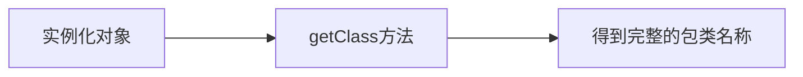

# 反射机制

## 基本概念

### 基本概念

Java 反射机制是在运行状态中，对于任意一个类，都能够知道这个类的所有属性和方法；对于任意一个对象，都能够调用它的任意方法和属性；这种动态获取信息以及动态调用对象方法的功能称为 Java 语言的反射机制。简单来说，反射机制指的是程序在运行时能够获取自身的信息。在 Java 中，只要给定类的名字，就可以通过反射机制来获得类的所有信息。

Java 反射机制在服务器程序和中间件程序中得到了广泛运用。在服务器端，往往需要根据客户的请求，动态调用某一个对象的特定方法。此外，在 ORM 中间件的实现中，运用 Java 反射机制可以读取任意一个 JavaBean 的所有属性，或者给这些属性赋值。

正常方式：


反射方式：



### 功能

Java 反射机制主要提供了以下功能，这些功能都位于`java.lang.reflect`包。

- 在运行时判断任意一个对象所属的类。
- 在运行时构造任意一个类的对象。
- 在运行时判断任意一个类所具有的成员变量和方法。
- 在运行时调用任意一个对象的方法。
- 生成动态代理。

| 类型     | 访问方法                    | 返回值类型           | 功能                               |
| -------- | --------------------------- | -------------------- | ---------------------------------- |
| 包路径   | `getPackage()`              | `Package`对象        | 获取该类的存放路径                 |
| 类名称   | `getName()`                 | `String`对象         | 获取该类的名称                     |
| 继承类   | `getSuperclass()`           | `Class`对象          | 获取该类继承的类                   |
| 实现接口 | `getInteface()`             | `Class`型数组        | 获取该类实现的所有接口             |
| 构造方法 | `getConstructors()`         | `Constructor` 型数组 | 获取所有权限为 public 的构造方法   |
| 构造方法 | `getDeclaredContruectors()` | `Constructor` 对象   | 获取当前对象的所有构造方法         |
| 成员变量 | `getFields()`               | `Field` 型数组       | 获取所有权限为 `public` 的成员变量 |
| 成员变量 | `getDeclareFileds()`        | `Field` 对象         | 获取当前对象的所有成员变量         |
| 方法     | `getMethods()`              | `Methods` 型数组     | 获取所有权限为 `public` 的方法     |
| 方法     | `getDeclareFileds()`        | `Field` 对象         | 获取当前对象的所有成员变量         |


### 反射机制的优缺点

#### 优点

- 能够运行时动态获取类的实例，大大提高系统的灵活性和扩展性。
- 与 Java 动态编译相结合，可以实现无比强大的功能。
- 对于 Java 这种先编译再运行的语言，能够让我们很方便的创建灵活的代码，这些代码可以在运行时装配，无需在组件之间进行源代码的链接，更加容易实现面向对象。

#### 缺点

- 反射会消耗一定的系统资源，因此，如果不需要动态地创建一个对象，那么就不需要用反射；
- 反射调用方法时可以忽略权限检查，获取这个类的私有方法和属性，因此可能会破坏类的封装性而导致安全问题。

## 反射机制API

### `java.lang.Class` 类

`java.lang.Class` 类是实现反射的关键所在，Class 类的一个实例表示 Java 的一种数据类型，包括类、接口、枚举、注解（Annotation）、数组、基本数据类型和 void。Class 没有公有的构造方法，Class 实例是由 JVM 在类加载时自动创建的。

在程序代码中获得 `Class` 实例可以通过如下代码实现：

```java
public class Test {
    public static void main(String[] args) {
        // 获得Class实例
        // 1.通过类型class静态变量
        Class clz1 = String.class;
        String str = "Hello";
        // 2.通过对象的getClass()方法
        Class clz2 = str.getClass();
        // 获得int类型Class实例
        Class clz3 = int.class;
        // 获得Integer类型Class实例
        Class clz4 = Integer.class;
        System.out.println("clz2类名称：" + clz2.getName());
        System.out.println("clz2是否为接口：" + clz2.isInterface());
        System.out.println("clz2是否为数组对象：" + clz2.isArray());
        System.out.println("clz2父类名称：" + clz2.getSuperclass().getName());
        System.out.println("clz2是否为基本类型：" + clz2.isPrimitive());
        System.out.println("clz3是否为基本类型：" + clz3.isPrimitive());
        System.out.println("clz4是否为基本类型：" + clz4.isPrimitive());
    }
}
```

```
clz2类名称：java.lang.String
clz2是否为接口：false
clz2是否为数组对象：false
clz2父类名称：java.lang.Object
clz2是否为基本类型：false
clz3是否为基本类型：true
clz4是否为基本类型：false
```

### `java.lang.reflect` 包

`java.lang.reflect` 包提供了反射中用到类，主要的类说明如下：

- `Constructor` 类：提供类的构造方法信息。
- `Field` 类：提供类或接口中成员变量信息。
- `Method` 类：提供类或接口成员方法信息。
- `Array` 类：提供了动态创建和访问 Java 数组的方法。
- `Modifier` 类：提供类和成员访问修饰符信息。

```java
public class Test {
    public static void main(String[] args) {
        try {
            // 动态加载xx类的运行时对象
            Class c = Class.forName("java.lang.String");
            // 获取成员方法集合
            Method[] methods = c.getDeclaredMethods();
            // 遍历成员方法集合
            for (Method method : methods) {
                // 打印权限修饰符，如public、protected、private
                System.out.print(Modifier.toString(method.getModifiers()));
                // 打印返回值类型名称
                System.out.print(" " + method.getReturnType().getName() + " ");
                // 打印方法名称
                System.out.println(method.getName() + "();");
            }
        } catch (ClassNotFoundException e) {
            System.out.println("找不到指定类");
        }
    }
}
```

```java
完整代码：
import java.lang.reflect.Field;
import java.lang.reflect.*;
import java.util.*;

public class Test {
	public static void main(String[] args) {
		// 通过类型class的静态变量
		Class clz1 = String.class;
		String str = "Hello";
		Class clz2 = str.getClass();
		
		System.out.println("包路径: " + clz2.getPackageName());
		System.out.println("类名称: " + clz2.getName());
		System.out.println("实现接口: ");
		for (Class interFace : clz2.getInterfaces()) {
			System.out.println(interFace);
		}
		System.out.println("成员变量: ");
		for (Field f : clz2.getFields()) {
			System.out.println(f);
		}
		System.out.println("成员方法: ");
		for (Method method : clz2.getMethods()) {
			System.out.println(method);
		}
	}
}
```

```
包路径: java.lang
类名称: java.lang.String
实现接口: 
interface java.io.Serializable
interface java.lang.Comparable
interface java.lang.CharSequence
interface java.lang.constant.Constable
interface java.lang.constant.ConstantDesc
成员变量: 
public static final java.util.Comparator java.lang.String.CASE_INSENSITIVE_ORDER
成员方法: 
public boolean java.lang.String.equals(java.lang.Object)
...
public final native void java.lang.Object.notifyAll()

```

## 通过反射访问构造方法

为了能够**动态获取**对象构造方法的信息，首先需要通过下列方法之一创建一个 `Constructor` 类型的对象或者数组。

- `getConstructors()`
- `getConstructor(Class<?>…parameterTypes)`
- `getDeclaredConstructors()`
- `getDeclaredConstructor(Class<?>...parameterTypes)`

创建的每个 `Constructor` 对象表示一个构造方法，然后利用 `Constructor` 对象的方法操作构造方法。

| 方法名称                          | 说明                                                         |
| --------------------------------- | ------------------------------------------------------------ |
| `isVarArgs`                       | 查看该构造方法是否允许带可变数量的参数                       |
| `getParameterTypes`               | 按照声明顺序以`Class`数组形式获取各个参数类型                |
| `getExceptionTypes`               | 以`Class`数组形式获取可能抛出的异常                          |
| `newInstance(Object... initargs)` | 通过该构造方法利用指定参数创建一个该类型的对象，如果未设置参数则表示，采用默认无参的构造方法 |

```java
class Book {
	String name;;
	int id, price;
	private Book() {
	}
	
	protected Book(String name, int id) {
		this.name = name;
		this.id = id;
	}
	public Book(String...strings) throws NumberFormatException {
		if (strings.length > 0) {
			id = Integer.valueOf(strings[0]);
		}  
		if (strings.length > 1) {
			System.out.println(strings[1]);
		}
	}
	public void print() {
		System.out.println("name" + name);
		System.out.println("id" + id);
		System.out.println("price" + price);
	}
}
public class Test {
    public static void main(String[] args) {
        Class book = Book.class;
        Constructor[] declaredConstructors = book.getDeclaredConstructors();
        
        for (int i = 0; i < declaredConstructors.length; i++) {
        	Constructor con = declaredConstructors[i];
        	System.out.println("查看是否允许带可变参数: " + con.isVarArgs());
        	System.out.println("该构造方法的入口参数类型依次为：");
        	Class[] parameterTypes = con.getParameterTypes();
        	for (int j = 0; j < parameterTypes.length; j++) {
        		System.out.println(" " + parameterTypes[j]);
        	}
        	 System.out.println("该构造方法可能拋出的异常类型为：");
             // 获取所有可能拋出的异常类型
             Class[] exceptionTypes = con.getExceptionTypes();
             for (int j = 0; j < exceptionTypes.length; j++) {
                 System.out.println(" " + parameterTypes[j]);
             }
             Book book1 = null;
             while (book1 == null) {
                 try { // 如果该成员变量的访问权限为private，则拋出异常
                     if (i == 1) {
                         // 通过执行带两个参数的构造方法实例化book1
                         book1 = (Book) con.newInstance("Java 教程", 10);
                     } else if (i == 2) {
                         // 通过执行默认构造方法实例化book1
                         book1 = (Book) con.newInstance();
                     } else {
                         // 通过执行可变数量参数的构造方法实例化book1
                         Object[] parameters = new Object[] { new String[] { "100", "200" } };
                         book1 = (Book) con.newInstance(parameters);
                     }
                 } catch (Exception e) {
                     System.out.println("在创建对象时拋出异常，下面执行 setAccessible() 方法");
                     con.setAccessible(true); // 设置允许访问 private 成员
                 }
             }
             book1.print();
             System.out.println("=============================\n");
        }
        
    }
}
```

```
查看是否允许带可变参数: true
该构造方法的入口参数类型依次为：
 class [Ljava.lang.String;
该构造方法可能拋出的异常类型为：
 class [Ljava.lang.String;
200
namenull
id100
price0
=============================

查看是否允许带可变参数: false
该构造方法的入口参数类型依次为：
 class java.lang.String
 int
该构造方法可能拋出的异常类型为：
nameJava 教程
id10
price0
=============================

查看是否允许带可变参数: false
该构造方法的入口参数类型依次为：
该构造方法可能拋出的异常类型为：
在创建对象时拋出异常，下面执行 setAccessible() 方法
namenull
id0
price0
=============================
```

## 通过反射访问成员变量

`Field` 类的常用方法如表所示：

| 方法名称                      | 说明                                                         |
| ----------------------------- | ------------------------------------------------------------ |
| `getName()`                   | 获得成员变量的名称                                           |
| `getType()`                   | 获取表示该成员变量的`Class`对象                              |
| `get(Object obj)`             | 获得指定对象 `obj` 中成员变量的值，返回值为 `Object` 类型    |
| `getlnt(0bject obj)`          | 获得指定对象 `obj` 中成员类型为 int 的成员变量的值           |
| `getModifiers()`              | 获得可以解析出该方法所采用修饰符的整数                       |
| `setAccessible(boolean flag)` | 此方法可以设置是否忽略权限直接访问 `private` 等私有权限的成员变量 |

```java
class Book {
	String name;;
	public int id;
	private float price;
	protected boolean isLoan;
}
public class Test {
    public static void main(String[] args) {
    	Book book = new Book();
    	Class class1 = book.getClass();
    	Field[] declaredFields = class1.getDeclaredFields();
    	for (int i = 0; i < declaredFields.length; i++) {
    		Field field = declaredFields[i];
    		System.out.println("成员变量名称为：" + field.getName());
    		Class fieldType = field.getType();
    		System.out.println("成员类型为：" + fieldType);
    		boolean isTurn = true;
    		while (isTurn) {
    			try {
    				isTurn = false;
    				System.out.println("修改前成员的值为：" + field.getByte(book));
    				if (fieldType.equals(int.class)) {
    					System.out.println("利用setInt()方法修改成员变量的值");
    					field.setInt(book, 100);
    				} else if (fieldType.equals(float.class)) {
    					System.out.println("利用setFloat()方法修改成员的值");
    					field.setFloat(book, 29.826f);
    				} else if (fieldType.equals(boolean.class)) {
    					System.out.println("利用setBoolean()方法修改成员的值");
    					field.setBoolean(book, true);
    				} else {
    					System.out.println("利用set()方法修改成员值");
    					field.set(book, "Java编程");
    				}
    				System.out.println("修改后的成员的值为：" + field.getByte(book));
    			}
    			catch (Exception e) {
    				System.out.println("在设置成员变量值时抛出异常，下面执行setAccessible()方法");
    				field.setAccessible(true);
    				isTurn = true;
    			}
    		}
    		System.out.println("================================");
    	}
    }
}
```

```
成员变量名称为：name
成员类型为：class java.lang.String
================================
成员变量名称为：id
成员类型为：int
================================
成员变量名称为：price
成员类型为：float
================================
成员变量名称为：isLoan
成员类型为：boolean
================================
```

## 在远程方法调用中运用反射机制

本案例将介绍反射机制在网络编程中的应用，实现如何在客户端通过远程方法调用服务器端的方法。

```java
import java.util.Date;

public interface HelloService {
	public String echo(String msg);
	public Date getTime();
}
```

```java
import java.util.Date;

public class HelloServiceImpl implements HelloService {
	@Override
	public String echo(String msg) {
		return "echo:" + msg;
	}
	@Override
	public Date getTime() {
		return new Date();
	}
}
```


```java
public class SimpleClient {
	public void invoke() throws Exception {
		Socket socket = new Socket("localhost", 8000);
		OutputStream out = socket.getOutputStream();
		ObjectOutputStream oos = new ObjectOutputStream(out);
		InputStream in = socket.getInputStream();
        ObjectInputStream ois = new ObjectInputStream(in);
        // 创建一个远程调用对象
        Call call = new Call("ch12.HelloService", "echo", new Class[] { String.class }, new Object[] { "Java" });
        oos.writeObject(call); 			// 向服务器发送Call对象
        call = (Call) ois.readObject(); // 接收包含了方法执行结果的Call对象
        System.out.println(call.getResult());
        ois.close();
        oos.close();
        socket.close();
    }
    public static void main(String args[]) throws Exception {
        new SimpleClient().invoke();
    }
}
```

## 通过反射访问操作数组

在 `java.lang.reflect` 包下提供了一个 Array 类，Array 对象可以代表所有的数组。程序可以通过使用 Array 来动态地创建数组，操作数组元素等。

Array 提供了如下几类方法。

- `static Object newInstance(Class<?> componentType, int…length)`：创建一个具有指定的元素类型、指定维度的新数组。
- `static xxx getXxx(Object array, int index)`：返回 array 数组中第 index 个元素。其中 xxx 是各种基本数据类型，如果数组元素是引用类型，则该方法变为 `get(Object array, int index)`。
- `static void setXxx(Object array, int index, xxx val)`：将 array 数组中第 index 个元素的值设为 val。

```java
public class Test {
    public static void main(String[] args) {
    	try {
    		Object arr = Array.newInstance(String.class, 10);
    		Array.set(arr, 5, "Java");
    		Array.set(arr, 6, "C");
    		Array.set(arr, 7, "C++");
    		Object course1 = Array.get(arr, 5);
    		System.out.println(course1);
    	}
    	catch (Throwable e) {
    		System.out.println(e);
    	}
    }
}
```

