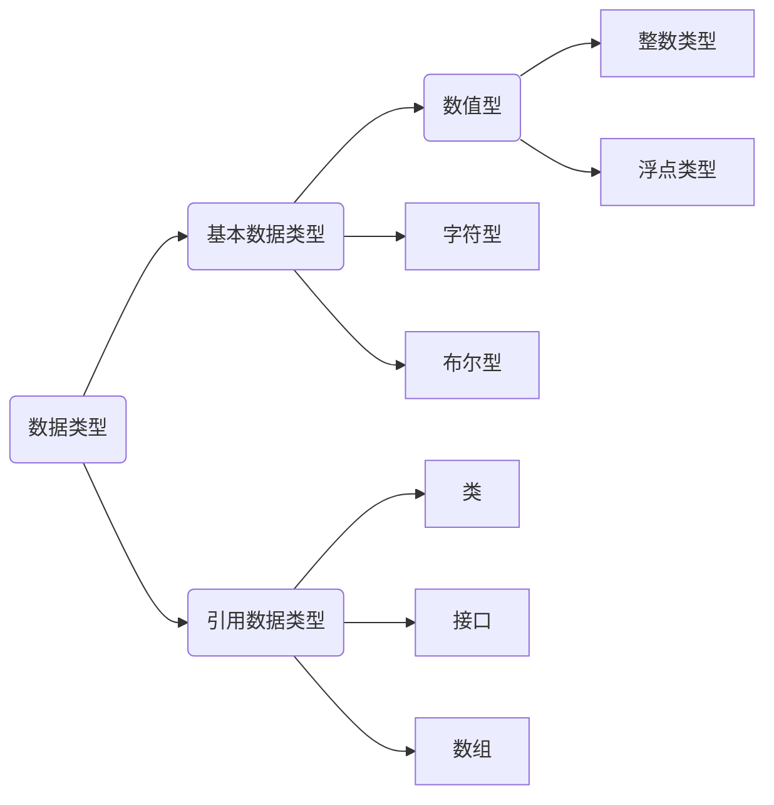

# Java程序基础

## Java程序基本结构

```java
/**
 * 可以用来自动创建文档的注释
 */
public class Hello {
    public static void main(String[] args) {
        // 向屏幕输出文本:
        System.out.println("Hello, world!");
        /* 多行注释开始
        注释内容
        注释结束 */
    }
} // class定义结束
```

特殊的多行注释，以`/**`开头，以`*/`结束，如果有多行，每行通常以星号开头，可以用于自动创建文档，一般用在类、方法和变量上面，用来描述其作用。注释后，鼠标放在类和变量上面会自动显示出我们注释的内容。

`Javadoc` 是 Sun 公司提供的一种工具，它可以从程序源代码中抽取类、方法、成员等注释，然后形成一个和源代码配套的 API 帮助文档。

```java
/**
* @author Huang Z.Y.
* @version jdk1.8.0
*/
public class Test {
    /**
     * 求输入两个参数范围以内整数的和
     * @param n 接收的第一个参数，范围起点
     * @param m 接收的第二个参数，范围终点
     * @return 两个参数范围以内整数的和
     */
    public int add(int n, int m) {
        int sum = 0;
        for (int i = n; i <= m; i++) {
            sum = sum + i;
        }
        return sum;
    }
} 
```

```shell
$ javadoc -encoding UTF-8 -charset UTF-8  Test.java
```


## 变量和数据类型

Java有50个关键词，不可作为标识符使用。

```java
public class Main {
	public static void main(String[] args) {
		int x = 100;   // 定义变量x，并赋初值
		System.out.println(x);  // 打印变量值
	}
}
```

```ascii
       ┌───┐
  byte │   │
       └───┘
       ┌───┬───┐
 short │   │   │
       └───┴───┘
       ┌───┬───┬───┬───┐
   int │   │   │   │   │
       └───┴───┴───┴───┘
       ┌───┬───┬───┬───┬───┬───┬───┬───┐
  long │   │   │   │   │   │   │   │   │
       └───┴───┴───┴───┴───┴───┴───┴───┘
       ┌───┬───┬───┬───┐
 float │   │   │   │   │
       └───┴───┴───┴───┘
       ┌───┬───┬───┬───┬───┬───┬───┬───┐
double │   │   │   │   │   │   │   │   │
       └───┴───┴───┴───┴───┴───┴───┴───┘
       ┌───┬───┐
  char │   │   │
       └───┴───┘
```

对于`float`类型，需要加上`f`后缀。

浮点数可表示的范围非常大，`float`类型可最大表示3.4x1038，而`double`类型可最大表示1.79x10308。

```java
float f1 = 3.14f;
float f2 = 3.14e38f;  // 科学计数法表示3.14*10^38
double d = 1.79e308;
```

论上存储布尔类型只需要1 bit，但是通常JVM内部会把`boolean`表示为4字节整数。

Java的`char`类型除了可表示标准的ASCII外，还可以表示一个Unicode字符：

```java
public class Main 
{
	public static void main(String[] args)
	{
		char a = 'A';
		char zh = '中';
		System.out.println(a);
		System.out.println(zh);
	}
}
```

引用类型最常用的就是`String`字符串：

```java
String s = "Hello";
```

Java语言是强类型（Strongly Typed）语言，强类型包含以下两方面的含义：

- 所有的变量必须先声明、后使用。
- 指定类型的变量只能接受类型与之匹配的值。

在定义常量时，需要注意如下内容：

- 在定义常量时就需要对该常量进行初始化。
- `final` 关键字不仅可以用来修饰基本数据类型的常量，还可以用来修饰对象的引用或者方法。
- 为了与变量区别，常量取名一般都用大写字符。

```java
final double PI = 3.14;
```

若想省略变量类型，可使用`var`关键字：

```java
var sb = new StringBuilder();
```

- 变量是类或者结构中的字段，如果没有显式地初始化，默认状态下创建变量并默认初始值为 0。
- 方法中的变量必须显式地初始化，否则在使用该变量时就会出错。

```java
class Data {
	String name;
	int age;
	
	static final String website = "nwafu.edu.cn";
	static String URL = "http://nwafu.edu.net";
}

public class Test {
	public static void main(String args[]) {
		Data d = new Data();
		
		System.out.println(d.name);
		System.out.println(d.age);
		
		System.out.println(d.website);
		System.out.println(d.URL);
		
		System.out.println(Data.website);
		System.out.println(Data.URL);
	}
}
```

```
null
0
nwafu.edu.cn
http://nwafu.edu.net
nwafu.edu.cn
http://nwafu.edu.net
```




## 整数运算

```java
public class Main 
{
	public static void main(String[] args)
	{
		int i = (100 + 200) * (99 - 88);
		System.out.println(i);
		i = i >> 2;
		System.out.println.println(i);
	}
}
```

## 浮点数运算

由于浮点数存在运算误差，所以比较两个浮点数是否相等常常会出现错误的结果。正确的比较方法是判断两个浮点数之差的绝对值是否小于一个很小的数：

```java
double x = 3.14;
double y = 3.14;
double r = Math.abs(x - y);
if (r < 0.00001)
{
    System.out.println("x == y");
}
else
{
    System.out.println(" x != y");
}
```

## 布尔运算

```java
boolean isGreater = 5 > 3;
int age = 12;
boolean isZero = age == 0;
```

关系运算符的优先级从高到低依次是：

- `!`
- `>`，`>=`，`<`，`<=`
- `==`，`!=`
- `&&`
- `||`

## 字符类型

`''`括起的Unicode表中的任一字符。

```
char ch = 'A', home = '家', handsome = '酷';
```

## 引用类型

引用数据类型建立在基本数据类型的基础上，包括数组、类和接口。引用数据类型是由用户自定义，用来限制其他数据的类型。另外，Java 语言中不支持 C++中的指针类型、结构类型、联合类型和枚举类型。

引用类型还有一种特殊的 `null` 类型。所谓引用数据类型就是对一个对象的引用，对象包括实例和数组两种。实际上，引用类型变量本质为指针。

## 逻辑运算符

算术运算符优先级较高，关系和逻辑运算符优先级较低。多数运算符具有左结合性，**单目运算符**、**三目运算符**、**赋值运算符**具有右结合性。

源代码就是一份文档，源代码的可读性比代码运行效率更重要。 因此在这里要提醒大家：

- 不要把一个表达式写得过于复杂，如果一个表达式过于复杂，则把它分成几步来完成。
- 不要过多地依赖运算符的优先级来控制表达式的执行顺序，这样可读性太差，尽量使用`()`来控制表达式的执行顺序。

## 字符串类型

关于字符串直接量有一点需要指出，当程序第一次使用某个字符串直接量时，Java 会使用常量池（constant pool）来缓存该字符串直接量，如果程序后面的部分需要用到该字符串直接量时，Java 会直接使用常量池（constantpool）中的字符串直接量。

提示：

- 由于 `String` 类是一个典型的不可变类，因此 `String` 对象创建出来的就不可能改变，因此无需担心共享 String 对象会导致混乱。
- 常量池（constant pool）指的是在编译期被确定，并被保存在已编译的 `.class` 文件中的一些数据，它包括关于类、方法、接口中的常量，也包括字符串直接量。

```java
String s0 = "hello";
String s1 = "hello";
String s2 = "he" + "llo";
System.out.println(s0 == s1);		// true
System.out.println(s0 == s1);		// true
```

Java 会确保每个字符串常量只有一个，不会产生多个副本。

## 输入、输出数据

`Scanner`是JDK 1.5新增的一个类，可创建一个对象：

```java
import java.util.Scanner;

public class Main {
	public static void main(String[] args) {
		System.out.println("请输入若干个数，每输入一个回车确认");
		System.out.println("最后输入数字0结束操作");
		Scanner reader = new Scanner(System.in);
		double sum = 0;
		double x = reader.nextDouble();
		while (x != 0) {
			sum = sum + x;
			x = reader.nextDouble();
		}
		System.out.println("sum = " + sum);
	}
}
```

`System.out.println()`输出后换行，`System.out.print()`输出后不换行。输出不可出现回车：

```java
System.out.println("Hello " + 
                   "World");
```

JDK 1.5添加与C语言类似的`printf`函数：

```java
System.out.printf("A = %d", 5);
```

## 数组

### 声明数组

```java
float boy[];
char cat[][];
int[] a, b;
```

### 为数组分配元素

```java
float[] boy = new float[4];
boy[0] = 12;
boy[2] = 29.8f;
```

二维数组类似：

```java
char cat[][] = new int [3][4];
```

二维数组的每一维不必有相同的长度：

```java
int a[][] = new int [3][];					// 不规则数组
a[0] = new int[6];
a[1] = new int[7];
a[3] = new int[8];
int[] number = new int[]{1, 2, 3, 5, 8};
```

尽管数组可以存储一组基本数据类型的元素，但是数组整体属于引用数据类型。当声明一个数组变量时，其实是创建了一个类型为“数据类型`[]`”（如 `int[]`、`double[]`、`String[]`）的数组对象。

```java
public class Test {
	public static void main(String[] args) {
	    double[][] class_score = {{100, 99, 99}, {100, 98, 97}, 
	    						  {100, 100, 99.5}, {99.5, 99, 98.5}};
	    for (double[] row : class_score) {
	        for (double value : row) {
	            System.out.println(value);
	        }
	    }
	}
}
```

### `Arrays`类

`Arrays` 类是一个工具类，其中包含了数组操作的很多方法。这个 Arrays 类里均为 static 修饰的方法。

- `int binarySearch(type[] a, type key)`

使用二分法查询 `key` 元素值在 `a` 数组中出现的索引，如果 `a` 数组不包含 `key` 元素值，则返回负数。调用该方法时要求数组中元素己经按升序排列，这样才能得到正确结果。

- `int binarySearch(type[] a, int fromIndex, int toIndex, type key)`

这个方法与前一个方法类似，但它只搜索 `a` 数组中 `fromIndex` 到 `toIndex` 索引的元素。调用该方法时要求数组中元素己经按升序排列，这样才能得到正确结果。

- `type[] copyOf(type[] original, int length)`

这个方法将会把 `original` 数组复制成一个新数组，其中 `length` 是新数组的长度。如果 `length` 小于 `original` 数组的长度，则新数组就是原数组的前面 `length` 个元素，如果 `length` 大于 `original` 数组的长度，则新数组的前面元索就是原数组的所有元素，后面补充 0（数值类型）、`false`（布尔类型）或者 `null`（引用类型）。

- `type[] copyOfRange(type[] original, int from, int to)`

这个方法与前面方法相似，但这个方法只复制 `original` 数组的 `from` 索引到 `to` 索引的元素。

- `boolean equals(type[] a, type[] a2)`

如果 `a` 数组和 `a2` 数组的长度相等，而且 `a` 数组和 `a2` 数组的数组元素也一一相同，该方法将返回 true。

- `void fill(type[] a, type val)`

该方法将会把 `a` 数组的所有元素都赋值为 `val`。

- `void fill(type[] a, int fromIndex, int toIndex, type val)`

该方法与前一个方法的作用相同，区别只是该方法仅仅将 `a` 数组的 `fromIndex` 到 `toIndex` 索引的数组元素赋值为 `val`。

`void sort(type[] a)`

- 该方法对 `a` 数组的数组元素进行排序。

`void sort(type[] a, int fromIndex, int toIndex)`

该方法与前一个方法相似，区别是该方法仅仅对 `fromIndex` 到 `toIndex` 索引的元素进行排序。

- `String toString(type[] a)`

该方法将一个数组转换成一个字符串。该方法按顺序把多个数组元素连缀在一起，多个数组元素使用英文逗号`,`和空格隔开。

```java
public class Test {
	public static void main(String[] args) {
	    int[] a = new int[] {3, 4, 5, 6};
	    int[] a2 = new int[] {3, 4, 5, 6};
	    
	    System.out.println("a和a2数组是否相等：" + Arrays.equals(a, a2));
	    int[] b = Arrays.copyOf(a, 6);
	    System.out.println("a数组和b数组是否相等：" + Arrays.equals(a, b));
        System.out.println("b 数组的元素为：" + Arrays.toString(b));
        Arrays.fill(b, 2, 4, 1);	// 从2-4填充1
        System.out.println("b 数组的元素为：" + Arrays.toString(b));
        Arrays.sort(b);
        System.out.println("b数组的元素为：" + Arrays.toString(b));
        System.out.println(Arrays.binarySearch(a, 4));
        
        char[] arr = { 'a', 'b', 'c' };
		String string = String.copyValueOf(arr);
		System.out.println(string); // 输出abc
	}
}
```

```
a和a2数组是否相等：true
a数组和b数组是否相等：false
b 数组的元素为：[3, 4, 5, 6, 0, 0]
b 数组的元素为：[3, 4, 1, 1, 0, 0]
b数组的元素为：[0, 0, 1, 1, 3, 4]
1
```

### `length`的使用

	float a[] = new float[12];
	System.out.println(a.length);

### 数组的初始化

```
float boy[] = { 2.1f, 3.4f };
int a[][] = { {2, 1}, {3, 4, 5} };
```

### 数组的引用

```java
import java.util.Scanner;

public class Main {
	public static void main(String[] args) {
		int a[] = {1, 2, 3};
		int b[] = {4, 5, 6, 7};
		a = b;
		
		for (int i = 0; i < a.length; i++)
		{
			System.out.printf("a[%d] = %d ", i, a[i]);
		}
	}
}
```

### 数组的复制

#### `copyOf()`方法

```java
Arrays.copyOf(dataType[] srcArray,int length);
```

```java
import java.util.Arrays;
public class Test {
    public static void main(String[] args) {
        // 定义长度为 5 的数组
        int scores[] = new int[] {57,81,68,75,91};

        // 输出原数组
        System.out.println("原数组内容如下：");

        // 循环遍历原数组
        for(int i = 0;i < scores.length; i++) {
            // 将数组元素输出
            System.out.print(scores[i] + "\t");
        }

        // 定义一个新的数组，将 scores 数组中的 5 个元素复制过来
        // 同时留 3 个内存空间供以后开发使用
        int[] newScores = (int[])Arrays.copyOf(scores, 8);
        System.out.println("\n复制的新数组内容如下：");

        // 循环遍历复制后的新数组
        for(int j = 0; j < newScores.length; j++) {
            // 将新数组的元素输出
            System.out.print(newScores[j] + "\t");
        }
    }
}
```

#### `copyRange()`方法

```java
Arrays.copyOfRange(dataType[] srcArray,int startIndex,int endIndex)
```

```java
import java.util.Arrays;
public class Test {
    public static void main(String[] args) {
        // 定义长度为8的数组
        int scores[] = new int[] {57, 81, 68, 75, 91, 66, 75, 84};
        System.out.println("原数组内容如下：");

        // 循环遍历原数组
        for (int i = 0; i < scores.length; i++) {
            System.out.print(scores[i] + "\t");
        }

        // 复制原数组的前5个元素到newScores数组中
        int newScores[] = (int[]) Arrays.copyOfRange(scores, 0, 5);
        System.out.println("\n复制的新数组内容如下：");

        // 循环遍历目标数组，即复制后的新数组
        for (int j = 0; j < newScores.length; j++) {
            System.out.print(newScores[j] + "\t");
        }
    }
}
```

```
原数组内容如下：
57	81	68	75	91	66	75	84	
复制的新数组内容如下：
57	81	68	75	91
```

####  `arraycopy()`方法

```java
System.arraycopy(dataType[] srcArray,int srcIndex,int destArray,int destIndex,int length)
```

 使用此方法复制数组时，`length + srcIndex` 必须小于等于 `srcArray.length`，同时 `length + destIndex` 必须小于等于 `destArray.length`。

```java
public class Test {
    public static void main(String[] args) {
        // 定义原数组，长度为8
        int scores[] = new int[] {100, 81, 68, 75, 91, 66, 75, 100};

        // 定义目标数组
        int newScores[] = new int[] {80, 82, 71, 92, 68, 71, 87, 88, 81, 79, 90, 77};

        System.arraycopy(scores, 0, newScores, 2, 8);

        // 复制原数组中的一部分到目标数组中
        System.out.println("替换元素后的目标数组内容如下：");

        // 循环遍历替换后的数组
        for (int k = 0; k < newScores.length; k++) {
            System.out.print(newScores[k] + "\t");
        }
    }
}
```

#### `clone()`方法

```java
int[] targetArray = (int[])sourceArray.clone();
```

```java
public class Test {
    public static void main(String[] args) {
        // 定义原数组，长度为8
        int scores[] = new int[] {100, 81, 68, 75, 91, 66, 75, 100};
        System.out.println("原数组中的内容如下：");

        // 遍历原数组
        for (int i = 0; i < scores.length; i++) {
            System.out.print(scores[i] + "\t");
        }

        // 复制数组，将Object类型强制转换为int[]类型
        int newScores[] = (int[]) scores.clone();
        System.out.println("\n目标数组内容如下：");

        // 循环遍历目标数组
        for (int k = 0; k < newScores.length; k++) {
            System.out.print(newScores[k] + "\t");
        }
    }
}
```

### 数组的排序

#### 升序

```java
Arrays.sort(type[] array);
```

#### 降序

```java
sort(type[] array, Collections.reverseOrder())
```

#### 自定义排序

```java
import java.util.Arrays;
import java.util.Comparator;
public class Test {
    public static void main(String[] args) {
        // 定义原数组，长度为8
        Integer[] a = {100, 81, 68, 75, 91, 66, 75, 100};
      	// 注意，要想改变默认的排列顺序，不能使用基本类型（int,double,char）而要使用它们对应的类
             
        
        Comparator cmp = new MyComparator();
        Arrays.sort(a, cmp);
        
        for (int elem : a) {
        	System.out.print(elem + " ");
        }
    }
}
class MyComparator implements Comparator<Integer> {
	@Override
	public int compare(Integer o1, Integer o2) {
		return o2 - o1;
	}
}
```

