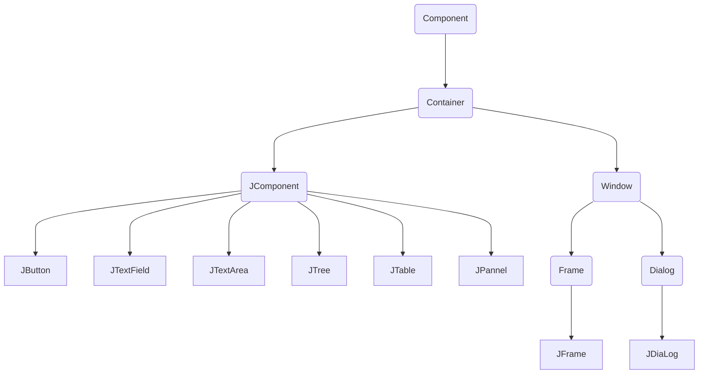

# 组件及事件处理

## `Java Swing`概述

通过图形用户界面，用户与程序之间可以更为方便地进行交互。Java的`java.*awt`表，即Java抽象窗口工具类（Abstract Window Toolkit）提供很多用于设计GUI的组件类。

容器类（Container）和组件类（Component）是GUI编程的两个基本概念。`java.swing`包中的`JComponent`类是`Container`和组件类`Component`的间接子类。

Java将`Component`类的子类或间接子类创建的对象称为一个组件

Java将`Container`的子类或间接子类创建的对象称为一个容器

容器调用`removeAll()`方法可移除容器中全部组件，调用`remove(Component c)`方法可移出容器中的参数c指定的组件

可将一个容器添加进另一个容器实现容器的嵌套。

每当容器添加新的组件时，应调用`validate()`方法以保证容器的组件正常显示。



## 窗口

底层容器是基于GUI的应用程序应提供与操作系统直接交互的容器，通常称为窗口。窗口也是容器，可向窗口添加组件。

### `JFrame`窗口

- `JFrame(String s)`   创建标题为s的窗体
- `public void setBounds(int a, int width, int height)`    初始位置为(a, b)
- `public void setSize(int width, int height) `  设置窗口大小
- `public void setLocation(x, y)`  设置位置，默认(0, 0)
- `public void setVisible(boolean b)`  设置窗口是否可见，默认不可见
- `public void reSizeable(boolean b)`   设置是否可调整大小，默认可调整大小
- `public void dispose()`  撤销当前窗口，并释放当前窗口的所有资源
- `public void setExtendState(int state)`  设置窗口扩展状态，`MAXIMIZED_HORIZ`水平方向最大，`MAXIMIZED_VERT`垂直方向最大，`MAXIMIZED_BOTH`水平、垂直方向均最大化
- `public void setDefaultCloseOperatyion(int operation)`  设置单击窗体右上角的关闭图标后，程序处理方式：`DO_NOTHING_ON_CLOSE`什么也不做，`HIDE_ON_CLOSE`隐藏当前窗口，`DISPOSE_ON_CLOSE`隐藏当前窗口并释放窗体的其他资源，`EXIT_ON_CLOSE`结束窗口所在应用程序。

```java
public class Test {  
	public static void main(String args[]) { 
		JFrame window1 = new JFrame("第一个窗口");
		JFrame window2 = new JFrame("第二个窗口");
		Container con = window1.getContentPane();						// 设置窗口的背景色
		con.setBackground(Color.yellow);								// 设置为黄色
		window1.setBounds(60, 100, 188, 108);
		window2.setBounds(260, 100, 188, 108);
		window1.setVisible(true);										// 默认不可见
		window1.setDefaultCloseOperation(JFrame.DISPOSE_ON_CLOSE);		// 隐藏当前窗口
		window2.setDefaultCloseOperation(JFrame.EXIT_ON_CLOSE);			// 退出当前程序, 相当于exit
		window2.setVisible(true);
    }	
}
```


### 菜单条、菜单、菜单项

`JMenu`负责创建菜单，`JMenuItem`负责创建菜单项，`ImageIcon`负责创建图标，`JMenuBar`负责创建菜单栏对象。

```java
class WindowMenu extends JFrame {
	JMenuBar menuBar;					// 菜单条
	JMenu menu, subMenu;				// 菜单
	JMenuItem item1, item2;
	public WindowMenu() {}
	public WindowMenu(String s, int x, int y, int w, int h) {
		init(s);
		setLocation(x, y);
		setVisible(true);
		setSize(w, h);
		setDefaultCloseOperation(DISPOSE_ON_CLOSE);
	}
	
	void init(String s) {
		setTitle(s);
		menuBar = new JMenuBar();   		// 创建菜单条, 相当于容器, 添加多个菜单
		menu = new JMenu("菜单");			// 设置菜单
		subMenu = new JMenu("软件项目");	
		item1 = new JMenuItem("Java话题");	// 设置菜单项 
		item2 = new JMenuItem("动画话题");	
		item1.setAccelerator(KeyStroke.getKeyStroke('A'));   // 设置快捷键
		item2.setAccelerator(KeyStroke.getKeyStroke(KeyEvent.VK_S, InputEvent.CTRL_MASK));
		menu.add(item1);					// 将菜单项添加至所设菜单
		menu.addSeparator();				// 将一个分隔线或连字符添加到菜单的当前位置
		menu.add(item2);
		menu.add(subMenu);
		subMenu.add(new JMenuItem("农场销售系统"));
		subMenu.add(new JMenuItem("农场信息系统"));
		menuBar.add(menu);
		setJMenuBar(menuBar);
	}
}
public class Test {  
	public static void main (String args[]) { 
		WindowMenu win = new WindowMenu("我的菜单", 20, 30, 200, 190);    
	}	
}
```


## 常用组件与布局

```java
C:javap javax.swing.JComponent
```

### 常用组件

- `JTextFeild`（文本框）
- `JTextArea`（文本区）
- `JButton`（按钮）
- `JLabel`（标签）
- `JCheckBox`（复选框）
- `JRadioBox`（单选列表）
- `JComoBox`（下拉列表）
- `JPasswordField`（密码框）

```java
import java.awt.FlowLayout;
import javax.swing.ButtonGroup;
import javax.swing.JCheckBox;
import javax.swing.JComboBox;
import javax.swing.JFrame;
import javax.swing.JRadioButton;
import javax.swing.JTextField;

class ComponentInWindow extends JFrame {
	JCheckBox checkBox1, checkBox2; // 复选框
	JRadioButton radioM, radioF;  	// 单选框
	ButtonGroup group;			 	// 为一组按钮创建一个多斥（multiple-exclusion）作用域
	JComboBox<String> comboBox;  	// 下拉列表
	JTextField textField;
	
	public ComponentInWindow() {
		init();
		setVisible(true);
		setDefaultCloseOperation(JFrame.EXIT_ON_CLOSE);	// 关闭退出程序
	}
	void init() {
		setLayout(new FlowLayout());
		group = new ButtonGroup();
		textField = new JTextField();
		textField.setText("姓名");						// 设置文本框名
		
		add(textField);
		comboBox = new JComboBox<String>();
		checkBox1 = new JCheckBox("喜欢(G)I-DLE");
		checkBox2 = new JCheckBox("喜欢Red Velvet");
		radioM = new JRadioButton("男");
		radioF = new JRadioButton("女");  				// 归组才能实现单选, 归入group
		group.add(radioM);
		group.add(radioF);
		add(checkBox1);
		add(checkBox2);
		add(radioM);
		add(radioF);
		comboBox.addItem("K-POP天地");					// 添加下拉列表项
		comboBox.addItem("H-POP");
		add(comboBox);
	}
} 

public class Test {
	public static void main(String[] args) {
		ComponentInWindow win = new ComponentInWindow();
		win.setBounds(100, 100, 450, 260);
		win.setTitle("常用组件");
	}
}
```


### 常用容器

- `JComponent`提供了一些用于添加组件的容器，相对于`JFrame`底层容器，被称为中间容器，中间容器必须被添加到底层容器才能发挥作用。
- `JPanel`面板：默认布局为`FlowLayout`布局
- `JTablePane`选项卡窗格：当用户向`JTablePane`添加一个组件时，其会自动为该组件指定一个对应的选项卡，各个选项卡对应的组件层叠式放入`JTablePane`容器，当用户单击选项卡时，该容器将显示该选项卡对应的组件。选项卡默认放在`JTablePane`容器的顶部，从左向右依次排列，`add(String text, Component c)`将组件c添加进容器，文本提示为`text`。可使用构造方法`JTablePan(int tabPlacement)`指定布局，有效值为`TOP`、`BOTTOM`、`LEFT`和`RIGHT`。
- 滚动窗格`JScrollPane`：滚动窗格只可添加一个组件，将该组件放入滚动窗格中，通过滚动窗格条来观看该组件，`JTextArea`不自带滚动条，故可将其放入一个滚动窗格中。
- `JSplitPane`：拆分窗格即将容器分为两部分，分为水平拆分和垂直拆分，`JSplitPane(int a, boolean b, Component c, Component d)`，`a`取`HORIZONAL_SPLIT`和`VERTICAL_SPLIT`，`b`表示当拆分线移动时，组件是否连续变化。
- `JLayeredPane`：若容器需要处理重叠问题，可考虑将组建添加到分层窗格。`add(JComponent com, int layer)`。

### 常用布局

- `FlowLayout`：创建居中对齐的布局对象，若需改变大小，需调用`public void setPreferenceSize(new Dimension(m, n))`设置大小，可使用`setAlignment`重新设置布局的对齐方式，取值为`FlowLayout.LEFT`、`FlowLayout.CENTER`、`FlowLatout.RIGHT`

- `BorderLayout`：一种简单的布局策略，容器空间被分为东、西、南、北、中五个区域，中间区域最大。加入的组件需指明所处区域，可使用静态常量`CENTER`、`NORTH`、`SOUTH`、`WEST`、`EAST`表示。

- `CardLayout`：组件层叠放入容器，同一时间只能显示其中一张，被显示组件占据所有空间，具体步骤如下：
  - 创建对象：`CardLayout card = new CardLayout()`
  
  - 使用`setLayout`方法为容器设置布局：`con.setLayout(card);`
  
  - 容器调用`add(String s, Component b)`将组件`b`加入容器，组件编号为`s`
  
  - 显示容器：`card.show(con, s)`，也可按顺序显示容器，`card.first(con)`
  
- `GridLayout`：基本策略为将容器划分为若干行若干列的网格区域，组件强制与网格大小相同

- `null`布局：空布局可以准确定位组件在容器中的位置和大小，利用`setBounds(int a, int b, int width, int height)`设置容器本身大小和容器中的位置
- `BoxLayout`：`javax.swing`包中的`Box`容器称为盒式容器，可利用容器嵌套，嵌入若干盒式容器，达到布局目的。常用构造方法为`creatHorizontalStru(int width)`和`creatVerticalStruct(int height)`

```java
import java.awt.BorderLayout;
import java.awt.Color;
import java.awt.GridLayout;
import java.awt.Label;
import javax.swing.JButton;
import javax.swing.JFrame;
import javax.swing.JPanel;
import javax.swing.JTabbedPane;
import javax.swing.JTextField;

public class Test {
	public static void main(String args[]) {
		new ShowLayout();
	}
} 
class ShowLayout extends JFrame {
	PanelGridLayout panelGrid;   // 网格布局的面板
	PanelNullLayout panelNull;   // 空布局面板
	JTabbedPane p;               // 选项卡窗格(非常重要)
	
	ShowLayout() {  // 显示面板
		panelGrid = new PanelGridLayout();   
		panelNull = new PanelNullLayout();
		p = new JTabbedPane();
		p.add("网格布局的面板", panelGrid);
		p.add("空布局的面板", panelNull);
		add(p, BorderLayout.CENTER);			// 选项卡窗格居中显示
		add(new JButton("窗体是BorderLayout布局"), BorderLayout.NORTH);
		add(new JButton("南"), BorderLayout.SOUTH);
		add(new JButton("西"), BorderLayout.WEST);
		add(new JButton("东"), BorderLayout.EAST);
		
		setBounds(10, 10, 570, 390);
		setVisible(true);
		setDefaultCloseOperation(JFrame.DISPOSE_ON_CLOSE);
		validate();
	}
}

class PanelGridLayout extends JPanel { // 添加面板
	PanelGridLayout() {
		GridLayout gird = new GridLayout(12, 12);	// 设置为网格布局
		setLayout(gird);
		Label label[][] = new Label[12][12];
		for (int i = 0; i < 12; i++) {
			for (int j = 0; j < 12; j++) {
				label[i][j] = new Label();
				if ((i + j) % 2 == 0) 
					label[i][j].setBackground(Color.black);
				else
					label[i][j].setBackground(Color.white);
				add(label[i][j]);
			}
		}
	}
}

class PanelNullLayout extends JPanel {
	JButton button;
	JTextField text;
	PanelNullLayout() {
		setLayout(null);
		button = new JButton("确定");
		text = new JTextField();
		add(text);    // 添加组件
		add(button);
		text.setBounds(100, 30, 90, 30);   // 设置文本框大小
		button.setBounds(190, 30, 66, 30);   // 设置按键大小, 确保大小一致
	}
}
```


```java
import javax.swing.Box;
import javax.swing.JFrame;
import javax.swing.JLabel;
import javax.swing.JTextField;

public class Test {
	public static void main(String args[]) {
		new WindowBoxLayout();   // 创建窗口对象
	}
} 

class WindowBoxLayout extends JFrame
{
	Box boxH;							// 创建几种影响布局的不可见组件
	Box boxVOne, boxVTwo;
	// 构造函数
	public WindowBoxLayout() {
		setLayout(new java.awt.FlowLayout());
		init();  // 初始化窗口
		setVisible(true);  // 窗口可视
		setBounds(10, 10, 400, 200);
		setDefaultCloseOperation(JFrame.DISPOSE_ON_CLOSE);   // 隐藏当前窗口，并释放窗体所占用的其他资源
	}
	// 初始化函数
	void init() {
		boxH = Box.createHorizontalBox();
		boxVOne = Box.createVerticalBox();		
		boxVTwo = Box.createVerticalBox();
		boxVOne.add(new JLabel("姓名："));
		boxVOne.add(new JLabel("职业："));
		boxVOne.add(new JLabel("密码："));
		boxVTwo.add(new JTextField("请输入姓名：", 10));
		boxVTwo.add(new JTextField("请输入职业：", 10));
		boxH.add(boxVOne);
		boxH.add(Box.createVerticalStrut(10));  // 垂直支撑，高度为10
		boxH.add(boxVTwo);
		
		add(boxH);
	}
}
```


## 处理事件

### 事件处理模式

- 事件源：能产生事件的对象

- 监视器：对发生的事件做出处理，事件源通过调用相应的方法将某个对象注册为自己的监视器，对文本框：`addActionListener(监视器)`

  对于注册监视器的文本框，在文本框输入<u>焦点</u>后，Java运行环境自动使用`ActionEvent`创建一个对象，即发生`ActionEvent`事件。

- 处理事件的接口：Java要求监视器必须与处理事件的方法绑定，故要求创建监视器的类必须实现Java规定的接口，该接口专用于处理事件的方法

### `ActionEvent`事件

事件源触发`ActionEvent`事件后，监视器调用接口中的方法`actionPerformed(ActionEvent e)`对发生的事件做出处理。

`ActionEvent`常用方法有：`public Object getSource()`获取事件源对象的引用；`getActionCommand()`：获取与事件相关的字符串，可通过`setCommands(String s)`事先预设。

```java
import java.awt.FlowLayout;
import java.awt.TextField;
import java.awt.event.ActionEvent;
import java.awt.event.ActionListener;

import javax.swing.JFrame;
import javax.swing.JLabel;

public class Test {
	public static void main(String args[]) {
		new WindowActionEvent();
	}
}

class WindowActionEvent extends JFrame {
	TextField text;            // 文本框
	ActionListener listener;   // 监视器
	public WindowActionEvent() {
		setLayout(new FlowLayout());         // 浮动布局
		text = new TextField(10);
		setBounds(10, 10, 400, 300);
		add(new JLabel("请输入字符串"));
		add(text);
		listener = new ReaderListen();    // 创建监视器
		text.addActionListener(listener);   // text将listener注册为其监视器
		setVisible(true);
		setDefaultCloseOperation(JFrame.EXIT_ON_CLOSE);
	}
}

class ReaderListen implements ActionListener { // 负责创建监视器
	public void actionPerformed(ActionEvent e) {
		String str = e.getActionCommand();    		// 获取封装在事件中的命令字符串
		System.out.println(str + ": " + str.length());
	}
}
```


```java
public class Test {
	public static void main(String args[]) {
		new WindowActionEvent();
	}
}

class WindowActionEvent extends JFrame {
	public JTextField inputText;
	public JTextArea textShow;
	public JButton button;
	PoliceListener listener;
	public WindowActionEvent() {
		init();
		setBounds(10, 10, 500, 400);
		setVisible(true);
		setDefaultCloseOperation(JFrame.DISPOSE_ON_CLOSE);
	}
	
	void init() {
		setLayout(new FlowLayout());
		Font font = new Font("宋体", Font.PLAIN, 20);
		inputText = new JTextField(20);
		inputText.setFont(font);
		button = new JButton("确定");
		textShow = new JTextArea(9,30);
		textShow.setFont(font);
		listener = new PoliceListener();
		listener.setView(this);
		inputText.addActionListener(listener);			// 一个监视器可同时监视多个事件源
		button.addActionListener(listener);
		add(inputText);
		add(button);
		add(new JScrollPane(textShow));
	}
}

class PoliceListener implements ActionListener {
	WindowActionEvent view;
	public void setView(WindowActionEvent view) {		// 实现交互
		this.view = view;
	}
	public void actionPerformed(ActionEvent e) {
		if (e.getSource() == view.inputText) {
			String str = view.inputText.getText();
			view.textShow.append("\"" + str + "\"的长度为：" + str.length() + "\n");
		} else if (e.getSource() == view.button) {
			String str = view.button.getText();
			view.textShow.append(str + "\n");
		}
	}
}
```


### `ItemEvent`事件

选择框、下拉框均可触发`ItemEvent`事件，当选择框选中时触发事件。使用`addItemListener`作为实现`ItemListener`事件源的监视器。该接口仅含有一个方法，即`itemStateChanged(ItemEvent e)`，通过该方法对事件做出处理。`ItemEvent`事件可使用`getSource`和`getItemSelected`返回事件源。


```java
import java.awt.FlowLayout;
import java.awt.Font;
import java.awt.event.ActionEvent;
import java.awt.event.ActionListener;
import java.awt.event.ItemEvent;
import java.awt.event.ItemListener;
import javax.swing.JButton;
import javax.swing.JComboBox;
import javax.swing.JFrame;
import javax.swing.JScrollPane;
import javax.swing.JTextArea;
import javax.swing.JTextField;

public class Test {
	public static void main(String args[]) {
		NumberView win = new NumberView();
		win.setBounds(100, 100, 600, 360);
		win.setTitle("简单计算器");
	}
}

class NumberView extends JFrame {
	public JTextField inputNumberOne, inputNumberTwo;
	public JComboBox<String> choiceSign;
	public JTextArea textShow;
	public JButton button;
	public OperatorListener operator;
	public ComputerListener computer;
	public NumberView() {
		init();
		setVisible(true);
		setDefaultCloseOperation(JFrame.EXIT_ON_CLOSE);
	}
	void init() {
		setLayout(new FlowLayout());
		Font font = new Font("宋体", Font.BOLD, 22);
		inputNumberOne = new JTextField(5);
		inputNumberTwo = new JTextField(5);
		inputNumberOne.setFont(font);
		inputNumberTwo.setFont(font);
		choiceSign = new JComboBox<String>();
		choiceSign.setFont(font);
		button = new JButton("计算");
		button.setFont(font);
		choiceSign.addItem("选择运算符号：");
		String a[] = {"+", "-", "*", "/"};
		for (int i = 0; i < a.length; i++) {
			choiceSign.addItem(a[i]);			// 添加下拉框项目
		}
		choiceSign.setSelectedIndex(-1);		// 初始无被选中
		textShow = new JTextArea(9, 30);
		textShow.setFont(font);
		operator = new OperatorListener();
		computer = new ComputerListener();
		operator.setView(this);					// 与事件源关联，显示监视器处理的信息
		computer.setView(this);
		choiceSign.addItemListener(operator);
		choiceSign.addActionListener(operator);
		button.addActionListener(computer);
		add(inputNumberOne);
		add(choiceSign);
		add(inputNumberTwo);
		add(button);
		add(new JScrollPane(textShow));		// 可选的垂直和水平滚动条以及可选的行和列标题视口
	}
}
class OperatorListener implements ItemListener, ActionListener {
	NumberView view;
	public void setView(NumberView view) {
		this.view = view;
	}
	public void itemStateChanged(ItemEvent e) {		// ItemEvent特有方法
		String sign = view.choiceSign.getSelectedItem().toString();
		view.computer.setSign(sign);
	}
	public void actionPerformed(ActionEvent e) {
		String sign = view.choiceSign.getSelectedItem().toString();
		view.computer.setSign(sign);
	}
}
class ComputerListener implements ActionListener {
	NumberView view;
	String sign;
	public void setView(NumberView view) {
		this.view = view;
	}
	public void setSign(String sign) {
		this.sign = sign;
	}
	public void actionPerformed(ActionEvent e) {
		try {
			double number1 = 
			Double.parseDouble(view.inputNumberOne.getText());
			double number2 = 
					Double.parseDouble(view.inputNumberTwo.getText());
			double result = 0;
			boolean isShow = true;
			if (sign.equals("+")) {
				result = number1 + number2;
			} else if (sign.equals("-")) {
				result = number1 - number2;
			} else if (sign.equals("*")) {
				result = number1 * number2;
			} else if (sign.equals("/")) {
				result = number1 / number2;
			} else {
				isShow = false;
			}
			if (isShow) {
				view.textShow.append(number1 + "+" + number2 + "=" + result + "\n");
			}
		} catch (Exception exp) {
			view.textShow.append("请输入数字字符");
		}
	}
}
```

### `DocumentEvent`事件

文本区含有实现`Document`接口的实例，该实例称文本维护的文档，调用`getDocument()`方法返回伟维护的文档。使用`addDocumentListener()`方法注册事件源的监视器。

`DocumentEvent`事件含有3个接口：

1. `public void changeUpdate()`
2. `public void removeUpdate()`
3. `public void insertUpdate()`


```java
import java.lang.reflect.Field;
import java.awt.FlowLayout;
import java.awt.event.ActionEvent;
import java.awt.event.ActionListener;
import java.util.*;
import javax.swing.JFrame;
import javax.swing.JMenu;
import javax.swing.JMenuBar;
import javax.swing.JMenuItem;
import javax.swing.JScrollPane;
import javax.swing.JTextArea;
import javax.swing.KeyStroke;
import javax.swing.event.DocumentEvent;
import javax.swing.event.DocumentListener;
import javax.swing.text.Document;


public class Test {
    public static void main(String[] args) {
    	WindowDocument win = new WindowDocument();
    	win.setBounds(100, 100, 900, 500);
    	win.setTitle("排序单词");
    }
}

class WindowDocument extends JFrame {
	JTextArea inputText, showText;
	JMenuBar menuBar;
	JMenu menu;
	JMenuItem itemCopy, itemCut, itemPaste;
	HandleListener handleListener;
	TextListener textChangeListener;
	WindowDocument() {
		init();
		setLayout(new FlowLayout());
		setVisible(true);
		setDefaultCloseOperation(JFrame.EXIT_ON_CLOSE);
	}
	void init() {
		inputText = new JTextArea(10, 28);
		showText = new JTextArea(10, 28);
		showText.setWrapStyleWord(true);		// 则当行的长度大于所分配的宽度时，将在单词边界（空白）处换行
		menuBar = new JMenuBar();
		menu = new JMenu("编辑");
		itemCopy = new JMenuItem("复制（C）");
		itemCut = new JMenuItem("剪切（T）");
		itemPaste = new JMenuItem("粘贴（P）");
		itemCopy.setAccelerator(KeyStroke.getKeyStroke('c'));
		itemCut.setAccelerator(KeyStroke.getKeyStroke('t'));
		itemPaste.setAccelerator(KeyStroke.getKeyStroke('p'));
		itemCopy.setActionCommand("copy");
		itemCopy.setActionCommand("cut");
		itemPaste.setActionCommand("paste");
		menu.add(itemCopy);
		menu.add(itemCut);
		menu.add(itemPaste);
		menuBar.add(menu);
		setJMenuBar(menuBar);
		add(new JScrollPane(inputText));
		add(new JScrollPane(showText));
		textChangeListener = new TextListener();
		handleListener = new HandleListener();
		textChangeListener.setView(this);
		handleListener.setView(this);
		Document document = inputText.getDocument();
		document.addDocumentListener(textChangeListener);
		itemCopy.addActionListener(handleListener);
		itemCut.addActionListener(handleListener);
		itemPaste.addActionListener(handleListener);
	}
}

class TextListener implements DocumentListener {
	WindowDocument view;
	public void setView(WindowDocument view) {
		this.view = view;
	}
	@Override
	public void changedUpdate(DocumentEvent e) {	// 给出属性或属性集发生了更改的通知
		String str = view.inputText.getText();
		String regex = "[\\s\\d\\p{Punct}]+";
		String[] words = str.split(regex);
		Arrays.sort(words);
		view.showText.setText(null);
		for (int i = 0; i < words.length; i++) {
			view.showText.append(words[i] + " ");
		}
	}
	@Override
	public void removeUpdate(DocumentEvent e) {	// 给出属性或属性集发生了移除的通知	
		changedUpdate(e);
	}
	@Override
	public void insertUpdate(DocumentEvent e) {	// 给出属性或属性集插入的通知
		changedUpdate(e);
	}
}

class HandleListener implements ActionListener {
	WindowDocument view;
	public void setView(WindowDocument view) {
		this.view = view;
	}
	public void actionPerformed(ActionEvent e) {
		String str = e.getActionCommand();		// 返回与此动作相关的命令字符串
		if (str.equals("copy")) {
			view.showText.copy();
		} else if (str.equals("cut")) {
			view.showText.cut();
		} else if (str.equals("paste")) {
			view.showText.paste();
		}
	}
}
```

### `MouseEvent`事件

