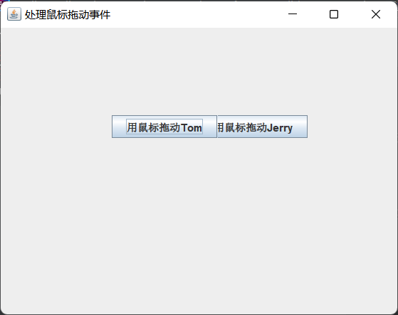
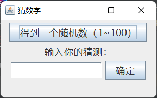
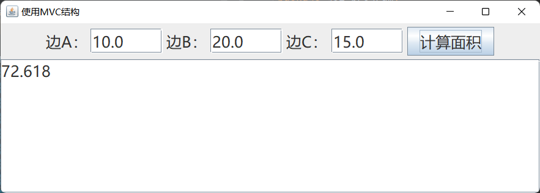
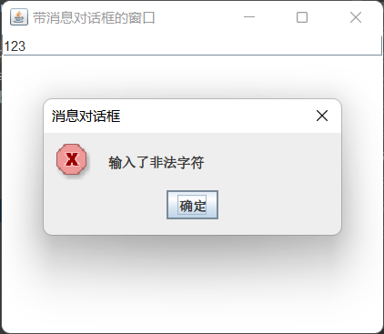
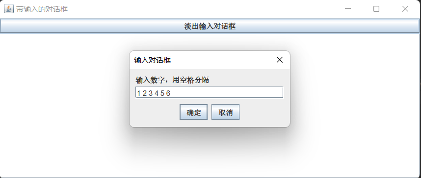
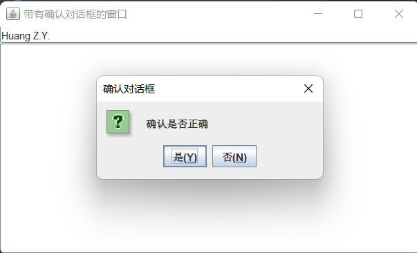
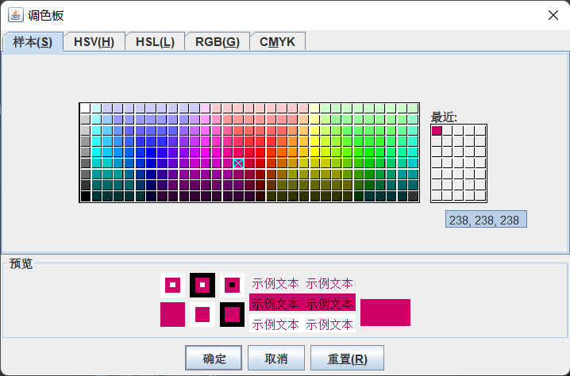
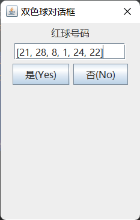
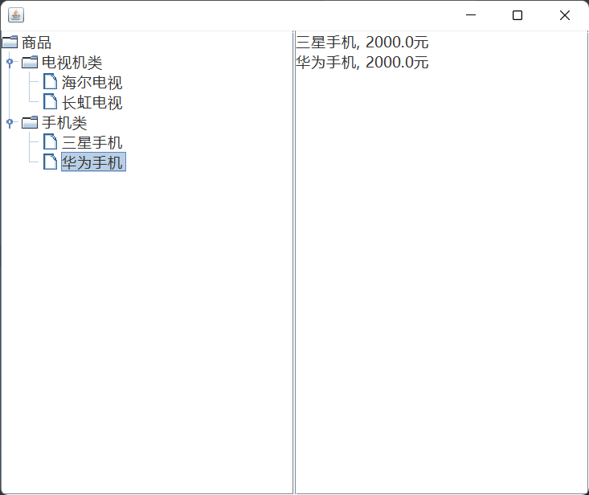
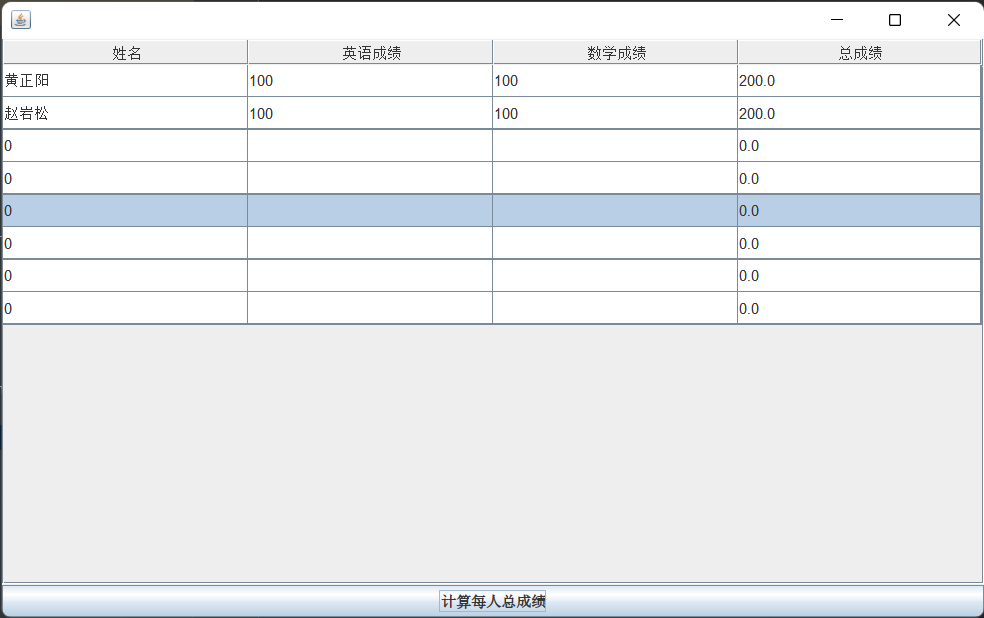

# 组件及事件处理

## `Java Swing`概述

通过图形用户界面，用户与程序之间可以更为方便地进行交互。Java的`java.*awt`表，即Java抽象窗口工具类（Abstract Window Toolkit）提供很多用于设计GUI的组件类。

容器类（Container）和组件类（Component）是GUI编程的两个基本概念。`java.swing`包中的`JComponent`类是`Container`和组件类`Component`的间接子类。

Java将`Component`类的子类或间接子类创建的对象称为一个组件

Java将`Container`的子类或间接子类创建的对象称为一个容器

容器调用`removeAll()`方法可移除容器中全部组件，调用`remove(Component c)`方法可移出容器中的参数c指定的组件

可将一个容器添加进另一个容器实现容器的嵌套。

每当容器添加新的组件时，应调用`validate()`方法以保证容器的组件正常显示。


## 窗口

底层容器是基于GUI的应用程序应提供与操作系统直接交互的容器，通常称为窗口。窗口也是容器，可向窗口添加组件。

### `JFrame`窗口

- `JFrame(String s)`   创建标题为s的窗体
- `public void setBounds(int a, int width, int height)`    初始位置为(a, b)
- `public void setSize(int width, int height) `  设置窗口大小
- `public void setLocation(x, y)`  设置位置，默认(0, 0)
- `public void setVisible(boolean b)`  设置窗口是否可见，默认不可见
- `public void reSizeable(boolean b)`   设置是否可调整大小，默认可调整大小
- `public void dispose()`  撤销当前窗口，并释放当前窗口的所有资源
- `public void setExtendState(int state)`  设置窗口扩展状态，`MAXIMIZED_HORIZ`水平方向最大，`MAXIMIZED_VERT`垂直方向最大，`MAXIMIZED_BOTH`水平、垂直方向均最大化
- `public void setDefaultCloseOperatyion(int operation)`  设置单击窗体右上角的关闭图标后，程序处理方式：`DO_NOTHING_ON_CLOSE`什么也不做，`HIDE_ON_CLOSE`隐藏当前窗口，`DISPOSE_ON_CLOSE`隐藏当前窗口并释放窗体的其他资源，`EXIT_ON_CLOSE`结束窗口所在应用程序。

```java
public class Test {  
	public static void main(String args[]) { 
		JFrame window1 = new JFrame("第一个窗口");
		JFrame window2 = new JFrame("第二个窗口");
		Container con = window1.getContentPane();						// 设置窗口的背景色
		con.setBackground(Color.yellow);								// 设置为黄色
		window1.setBounds(60, 100, 188, 108);
		window2.setBounds(260, 100, 188, 108);
		window1.setVisible(true);										// 默认不可见
		window1.setDefaultCloseOperation(JFrame.DISPOSE_ON_CLOSE);		// 隐藏当前窗口
		window2.setDefaultCloseOperation(JFrame.EXIT_ON_CLOSE);			// 退出当前程序, 相当于exit
		window2.setVisible(true);
    }	
}
```


### 菜单条、菜单、菜单项

`JMenu`负责创建菜单，`JMenuItem`负责创建菜单项，`ImageIcon`负责创建图标，`JMenuBar`负责创建菜单栏对象。

```java
class WindowMenu extends JFrame {
	JMenuBar menuBar;					// 菜单条
	JMenu menu, subMenu;				// 菜单
	JMenuItem item1, item2;
	public WindowMenu() {}
	public WindowMenu(String s, int x, int y, int w, int h) {
		init(s);
		setLocation(x, y);
		setVisible(true);
		setSize(w, h);
		setDefaultCloseOperation(DISPOSE_ON_CLOSE);
	}
	
	void init(String s) {
		setTitle(s);
		menuBar = new JMenuBar();   		// 创建菜单条, 相当于容器, 添加多个菜单
		menu = new JMenu("菜单");			// 设置菜单
		subMenu = new JMenu("软件项目");	
		item1 = new JMenuItem("Java话题");	// 设置菜单项 
		item2 = new JMenuItem("动画话题");	
		item1.setAccelerator(KeyStroke.getKeyStroke('A'));   // 设置快捷键
		item2.setAccelerator(KeyStroke.getKeyStroke(KeyEvent.VK_S, InputEvent.CTRL_MASK));
		menu.add(item1);					// 将菜单项添加至所设菜单
		menu.addSeparator();				// 将一个分隔线或连字符添加到菜单的当前位置
		menu.add(item2);
		menu.add(subMenu);
		subMenu.add(new JMenuItem("农场销售系统"));
		subMenu.add(new JMenuItem("农场信息系统"));
		menuBar.add(menu);
		setJMenuBar(menuBar);
	}
}
public class Test {  
	public static void main (String args[]) { 
		WindowMenu win = new WindowMenu("我的菜单", 20, 30, 200, 190);    
	}	
}
```


## 常用组件与布局

```java
C:javap javax.swing.JComponent
```

### 常用组件

- `JTextFeild`（文本框）
- `JTextArea`（文本区）
- `JButton`（按钮）
- `JLabel`（标签）
- `JCheckBox`（复选框）
- `JRadioBox`（单选列表）
- `JComoBox`（下拉列表）
- `JPasswordField`（密码框）

```java
import java.awt.FlowLayout;
import javax.swing.ButtonGroup;
import javax.swing.JCheckBox;
import javax.swing.JComboBox;
import javax.swing.JFrame;
import javax.swing.JRadioButton;
import javax.swing.JTextField;

class ComponentInWindow extends JFrame {
	JCheckBox checkBox1, checkBox2; // 复选框
	JRadioButton radioM, radioF;  	// 单选框
	ButtonGroup group;			 	// 为一组按钮创建一个多斥（multiple-exclusion）作用域
	JComboBox<String> comboBox;  	// 下拉列表
	JTextField textField;
	
	public ComponentInWindow() {
		init();
		setVisible(true);
		setDefaultCloseOperation(JFrame.EXIT_ON_CLOSE);	// 关闭退出程序
	}
	void init() {
		setLayout(new FlowLayout());
		group = new ButtonGroup();
		textField = new JTextField();
		textField.setText("姓名");						// 设置文本框名
		
		add(textField);
		comboBox = new JComboBox<String>();
		checkBox1 = new JCheckBox("喜欢(G)I-DLE");
		checkBox2 = new JCheckBox("喜欢Red Velvet");
		radioM = new JRadioButton("男");
		radioF = new JRadioButton("女");  				// 归组才能实现单选, 归入group
		group.add(radioM);
		group.add(radioF);
		add(checkBox1);
		add(checkBox2);
		add(radioM);
		add(radioF);
		comboBox.addItem("K-POP天地");					// 添加下拉列表项
		comboBox.addItem("H-POP");
		add(comboBox);
	}
} 

public class Test {
	public static void main(String[] args) {
		ComponentInWindow win = new ComponentInWindow();
		win.setBounds(100, 100, 450, 260);
		win.setTitle("常用组件");
	}
}
```


### 常用容器

- `JComponent`提供了一些用于添加组件的容器，相对于`JFrame`底层容器，被称为中间容器，中间容器必须被添加到底层容器才能发挥作用。
- `JPanel`面板：默认布局为`FlowLayout`布局
- `JTablePane`选项卡窗格：当用户向`JTablePane`添加一个组件时，其会自动为该组件指定一个对应的选项卡，各个选项卡对应的组件层叠式放入`JTablePane`容器，当用户单击选项卡时，该容器将显示该选项卡对应的组件。选项卡默认放在`JTablePane`容器的顶部，从左向右依次排列，`add(String text, Component c)`将组件c添加进容器，文本提示为`text`。可使用构造方法`JTablePan(int tabPlacement)`指定布局，有效值为`TOP`、`BOTTOM`、`LEFT`和`RIGHT`。
- 滚动窗格`JScrollPane`：滚动窗格只可添加一个组件，将该组件放入滚动窗格中，通过滚动窗格条来观看该组件，`JTextArea`不自带滚动条，故可将其放入一个滚动窗格中。
- `JSplitPane`：拆分窗格即将容器分为两部分，分为水平拆分和垂直拆分，`JSplitPane(int a, boolean b, Component c, Component d)`，`a`取`HORIZONAL_SPLIT`和`VERTICAL_SPLIT`，`b`表示当拆分线移动时，组件是否连续变化。
- `JLayeredPane`：若容器需要处理重叠问题，可考虑将组建添加到分层窗格。`add(JComponent com, int layer)`。

### 常用布局

- `FlowLayout`：创建居中对齐的布局对象，若需改变大小，需调用`public void setPreferenceSize(new Dimension(m, n))`设置大小，可使用`setAlignment`重新设置布局的对齐方式，取值为`FlowLayout.LEFT`、`FlowLayout.CENTER`、`FlowLatout.RIGHT`

- `BorderLayout`：一种简单的布局策略，容器空间被分为东、西、南、北、中五个区域，中间区域最大。加入的组件需指明所处区域，可使用静态常量`CENTER`、`NORTH`、`SOUTH`、`WEST`、`EAST`表示。

- `CardLayout`：组件层叠放入容器，同一时间只能显示其中一张，被显示组件占据所有空间，具体步骤如下：
  - 创建对象：`CardLayout card = new CardLayout()`
  
  - 使用`setLayout`方法为容器设置布局：`con.setLayout(card);`
  
  - 容器调用`add(String s, Component b)`将组件`b`加入容器，组件编号为`s`
  
  - 显示容器：`card.show(con, s)`，也可按顺序显示容器，`card.first(con)`
  
- `GridLayout`：基本策略为将容器划分为若干行若干列的网格区域，组件强制与网格大小相同

- `null`布局：空布局可以准确定位组件在容器中的位置和大小，利用`setBounds(int a, int b, int width, int height)`设置容器本身大小和容器中的位置
- `BoxLayout`：`javax.swing`包中的`Box`容器称为盒式容器，可利用容器嵌套，嵌入若干盒式容器，达到布局目的。常用构造方法为`creatHorizontalStru(int width)`和`creatVerticalStruct(int height)`

```java
import java.awt.BorderLayout;
import java.awt.Color;
import java.awt.GridLayout;
import java.awt.Label;
import javax.swing.JButton;
import javax.swing.JFrame;
import javax.swing.JPanel;
import javax.swing.JTabbedPane;
import javax.swing.JTextField;

public class Test {
	public static void main(String args[]) {
		new ShowLayout();
	}
} 
class ShowLayout extends JFrame {
	PanelGridLayout panelGrid;   // 网格布局的面板
	PanelNullLayout panelNull;   // 空布局面板
	JTabbedPane p;               // 选项卡窗格(非常重要)
	
	ShowLayout() {  // 显示面板
		panelGrid = new PanelGridLayout();   
		panelNull = new PanelNullLayout();
		p = new JTabbedPane();
		p.add("网格布局的面板", panelGrid);
		p.add("空布局的面板", panelNull);
		add(p, BorderLayout.CENTER);			// 选项卡窗格居中显示
		add(new JButton("窗体是BorderLayout布局"), BorderLayout.NORTH);
		add(new JButton("南"), BorderLayout.SOUTH);
		add(new JButton("西"), BorderLayout.WEST);
		add(new JButton("东"), BorderLayout.EAST);
		
		setBounds(10, 10, 570, 390);
		setVisible(true);
		setDefaultCloseOperation(JFrame.DISPOSE_ON_CLOSE);
		validate();
	}
}

class PanelGridLayout extends JPanel { // 添加面板
	PanelGridLayout() {
		GridLayout gird = new GridLayout(12, 12);	// 设置为网格布局
		setLayout(gird);
		Label label[][] = new Label[12][12];
		for (int i = 0; i < 12; i++) {
			for (int j = 0; j < 12; j++) {
				label[i][j] = new Label();
				if ((i + j) % 2 == 0) 
					label[i][j].setBackground(Color.black);
				else
					label[i][j].setBackground(Color.white);
				add(label[i][j]);
			}
		}
	}
}

class PanelNullLayout extends JPanel {
	JButton button;
	JTextField text;
	PanelNullLayout() {
		setLayout(null);
		button = new JButton("确定");
		text = new JTextField();
		add(text);    // 添加组件
		add(button);
		text.setBounds(100, 30, 90, 30);   // 设置文本框大小
		button.setBounds(190, 30, 66, 30);   // 设置按键大小, 确保大小一致
	}
}
```


```java
import javax.swing.Box;
import javax.swing.JFrame;
import javax.swing.JLabel;
import javax.swing.JTextField;

public class Test {
	public static void main(String args[]) {
		new WindowBoxLayout();   // 创建窗口对象
	}
} 

class WindowBoxLayout extends JFrame
{
	Box boxH;							// 创建几种影响布局的不可见组件
	Box boxVOne, boxVTwo;
	// 构造函数
	public WindowBoxLayout() {
		setLayout(new java.awt.FlowLayout());
		init();  // 初始化窗口
		setVisible(true);  // 窗口可视
		setBounds(10, 10, 400, 200);
		setDefaultCloseOperation(JFrame.DISPOSE_ON_CLOSE);   // 隐藏当前窗口，并释放窗体所占用的其他资源
	}
	// 初始化函数
	void init() {
		boxH = Box.createHorizontalBox();
		boxVOne = Box.createVerticalBox();		
		boxVTwo = Box.createVerticalBox();
		boxVOne.add(new JLabel("姓名："));
		boxVOne.add(new JLabel("职业："));
		boxVOne.add(new JLabel("密码："));
		boxVTwo.add(new JTextField("请输入姓名：", 10));
		boxVTwo.add(new JTextField("请输入职业：", 10));
		boxH.add(boxVOne);
		boxH.add(Box.createVerticalStrut(10));  // 垂直支撑，高度为10
		boxH.add(boxVTwo);
		
		add(boxH);
	}
}
```


## 处理事件

### 事件处理模式

- 事件源：能产生事件的对象

- 监视器：对发生的事件做出处理，事件源通过调用相应的方法将某个对象注册为自己的监视器，对文本框：`addActionListener(监视器)`

  对于注册监视器的文本框，在文本框输入<u>焦点</u>后，Java运行环境自动使用`ActionEvent`创建一个对象，即发生`ActionEvent`事件。

- 处理事件的接口：Java要求监视器必须与处理事件的方法绑定，故要求创建监视器的类必须实现Java规定的接口，该接口专用于处理事件的方法

### `ActionEvent`事件

事件源触发`ActionEvent`事件后，监视器调用接口中的方法`actionPerformed(ActionEvent e)`对发生的事件做出处理。

`ActionEvent`常用方法有：`public Object getSource()`获取事件源对象的引用；`getActionCommand()`：获取与事件相关的字符串，可通过`setCommands(String s)`事先预设。

```java
import java.awt.FlowLayout;
import java.awt.TextField;
import java.awt.event.ActionEvent;
import java.awt.event.ActionListener;

import javax.swing.JFrame;
import javax.swing.JLabel;

public class Test {
	public static void main(String args[]) {
		new WindowActionEvent();
	}
}

class WindowActionEvent extends JFrame {
	TextField text;            // 文本框
	ActionListener listener;   // 监视器
	public WindowActionEvent() {
		setLayout(new FlowLayout());         // 浮动布局
		text = new TextField(10);
		setBounds(10, 10, 400, 300);
		add(new JLabel("请输入字符串"));
		add(text);
		listener = new ReaderListen();    // 创建监视器
		text.addActionListener(listener);   // text将listener注册为其监视器
		setVisible(true);
		setDefaultCloseOperation(JFrame.EXIT_ON_CLOSE);
	}
}

class ReaderListen implements ActionListener { // 负责创建监视器
	public void actionPerformed(ActionEvent e) {
		String str = e.getActionCommand();    		// 获取封装在事件中的命令字符串
		System.out.println(str + ": " + str.length());
	}
}
```


```java
public class Test {
	public static void main(String args[]) {
		new WindowActionEvent();
	}
}

class WindowActionEvent extends JFrame {
	public JTextField inputText;
	public JTextArea textShow;
	public JButton button;
	PoliceListener listener;
	public WindowActionEvent() {
		init();
		setBounds(10, 10, 500, 400);
		setVisible(true);
		setDefaultCloseOperation(JFrame.DISPOSE_ON_CLOSE);
	}
	
	void init() {
		setLayout(new FlowLayout());
		Font font = new Font("宋体", Font.PLAIN, 20);
		inputText = new JTextField(20);
		inputText.setFont(font);
		button = new JButton("确定");
		textShow = new JTextArea(9,30);
		textShow.setFont(font);
		listener = new PoliceListener();
		listener.setView(this);
		inputText.addActionListener(listener);			// 一个监视器可同时监视多个事件源
		button.addActionListener(listener);
		add(inputText);
		add(button);
		add(new JScrollPane(textShow));
	}
}

class PoliceListener implements ActionListener {
	WindowActionEvent view;
	public void setView(WindowActionEvent view) {		// 实现交互
		this.view = view;
	}
	public void actionPerformed(ActionEvent e) {
		if (e.getSource() == view.inputText) {
			String str = view.inputText.getText();
			view.textShow.append("\"" + str + "\"的长度为：" + str.length() + "\n");
		} else if (e.getSource() == view.button) {
			String str = view.button.getText();
			view.textShow.append(str + "\n");
		}
	}
}
```


### `ItemEvent`事件

选择框、下拉框均可触发`ItemEvent`事件，当选择框选中时触发事件。使用`addItemListener`作为实现`ItemListener`事件源的监视器。该接口仅含有一个方法，即`itemStateChanged(ItemEvent e)`，通过该方法对事件做出处理。`ItemEvent`事件可使用`getSource`和`getItemSelected`返回事件源。


```java
import java.awt.FlowLayout;
import java.awt.Font;
import java.awt.event.ActionEvent;
import java.awt.event.ActionListener;
import java.awt.event.ItemEvent;
import java.awt.event.ItemListener;
import javax.swing.JButton;
import javax.swing.JComboBox;
import javax.swing.JFrame;
import javax.swing.JScrollPane;
import javax.swing.JTextArea;
import javax.swing.JTextField;

public class Test {
	public static void main(String args[]) {
		NumberView win = new NumberView();
		win.setBounds(100, 100, 600, 360);
		win.setTitle("简单计算器");
	}
}

class NumberView extends JFrame {
	public JTextField inputNumberOne, inputNumberTwo;
	public JComboBox<String> choiceSign;
	public JTextArea textShow;
	public JButton button;
	public OperatorListener operator;
	public ComputerListener computer;
	public NumberView() {
		init();
		setVisible(true);
		setDefaultCloseOperation(JFrame.EXIT_ON_CLOSE);
	}
	void init() {
		setLayout(new FlowLayout());
		Font font = new Font("宋体", Font.BOLD, 22);
		inputNumberOne = new JTextField(5);
		inputNumberTwo = new JTextField(5);
		inputNumberOne.setFont(font);
		inputNumberTwo.setFont(font);
		choiceSign = new JComboBox<String>();
		choiceSign.setFont(font);
		button = new JButton("计算");
		button.setFont(font);
		choiceSign.addItem("选择运算符号：");
		String a[] = {"+", "-", "*", "/"};
		for (int i = 0; i < a.length; i++) {
			choiceSign.addItem(a[i]);			// 添加下拉框项目
		}
		choiceSign.setSelectedIndex(-1);		// 初始无被选中
		textShow = new JTextArea(9, 30);
		textShow.setFont(font);
		operator = new OperatorListener();
		computer = new ComputerListener();
		operator.setView(this);					// 与事件源关联，显示监视器处理的信息
		computer.setView(this);
		choiceSign.addItemListener(operator);
		choiceSign.addActionListener(operator);
		button.addActionListener(computer);
		add(inputNumberOne);
		add(choiceSign);
		add(inputNumberTwo);
		add(button);
		add(new JScrollPane(textShow));		// 可选的垂直和水平滚动条以及可选的行和列标题视口
	}
}
class OperatorListener implements ItemListener, ActionListener {
	NumberView view;
	public void setView(NumberView view) {
		this.view = view;
	}
	public void itemStateChanged(ItemEvent e) {		// ItemEvent特有方法
		String sign = view.choiceSign.getSelectedItem().toString();
		view.computer.setSign(sign);
	}
	public void actionPerformed(ActionEvent e) {
		String sign = view.choiceSign.getSelectedItem().toString();
		view.computer.setSign(sign);
	}
}
class ComputerListener implements ActionListener {
	NumberView view;
	String sign;
	public void setView(NumberView view) {
		this.view = view;
	}
	public void setSign(String sign) {
		this.sign = sign;
	}
	public void actionPerformed(ActionEvent e) {
		try {
			double number1 = 
			Double.parseDouble(view.inputNumberOne.getText());
			double number2 = 
					Double.parseDouble(view.inputNumberTwo.getText());
			double result = 0;
			boolean isShow = true;
			if (sign.equals("+")) {
				result = number1 + number2;
			} else if (sign.equals("-")) {
				result = number1 - number2;
			} else if (sign.equals("*")) {
				result = number1 * number2;
			} else if (sign.equals("/")) {
				result = number1 / number2;
			} else {
				isShow = false;
			}
			if (isShow) {
				view.textShow.append(number1 + "+" + number2 + "=" + result + "\n");
			}
		} catch (Exception exp) {
			view.textShow.append("请输入数字字符");
		}
	}
}
```

### `DocumentEvent`事件

文本区含有实现`Document`接口的实例，该实例称文本维护的文档，调用`getDocument()`方法返回伟维护的文档。使用`addDocumentListener()`方法注册事件源的监视器。

`DocumentEvent`事件含有3个接口：

1. `public void changeUpdate()`
2. `public void removeUpdate()`
3. `public void insertUpdate()`


```java
import java.lang.reflect.Field;
import java.awt.FlowLayout;
import java.awt.event.ActionEvent;
import java.awt.event.ActionListener;
import java.util.*;
import javax.swing.JFrame;
import javax.swing.JMenu;
import javax.swing.JMenuBar;
import javax.swing.JMenuItem;
import javax.swing.JScrollPane;
import javax.swing.JTextArea;
import javax.swing.KeyStroke;
import javax.swing.event.DocumentEvent;
import javax.swing.event.DocumentListener;
import javax.swing.text.Document;


public class Test {
    public static void main(String[] args) {
    	WindowDocument win = new WindowDocument();
    	win.setBounds(100, 100, 900, 500);
    	win.setTitle("排序单词");
    }
}

class WindowDocument extends JFrame {
	JTextArea inputText, showText;
	JMenuBar menuBar;
	JMenu menu;
	JMenuItem itemCopy, itemCut, itemPaste;
	HandleListener handleListener;
	TextListener textChangeListener;
	WindowDocument() {
		init();
		setLayout(new FlowLayout());
		setVisible(true);
		setDefaultCloseOperation(JFrame.EXIT_ON_CLOSE);
	}
	void init() {
		inputText = new JTextArea(10, 28);
		showText = new JTextArea(10, 28);
		showText.setWrapStyleWord(true);		// 则当行的长度大于所分配的宽度时，将在单词边界（空白）处换行
		menuBar = new JMenuBar();
		menu = new JMenu("编辑");
		itemCopy = new JMenuItem("复制（C）");
		itemCut = new JMenuItem("剪切（T）");
		itemPaste = new JMenuItem("粘贴（P）");
		itemCopy.setAccelerator(KeyStroke.getKeyStroke('c'));
		itemCut.setAccelerator(KeyStroke.getKeyStroke('t'));
		itemPaste.setAccelerator(KeyStroke.getKeyStroke('p'));
		itemCopy.setActionCommand("copy");
		itemCopy.setActionCommand("cut");
		itemPaste.setActionCommand("paste");
		menu.add(itemCopy);
		menu.add(itemCut);
		menu.add(itemPaste);
		menuBar.add(menu);
		setJMenuBar(menuBar);
		add(new JScrollPane(inputText));
		add(new JScrollPane(showText));
		textChangeListener = new TextListener();
		handleListener = new HandleListener();
		textChangeListener.setView(this);
		handleListener.setView(this);
		Document document = inputText.getDocument();
		document.addDocumentListener(textChangeListener);
		itemCopy.addActionListener(handleListener);
		itemCut.addActionListener(handleListener);
		itemPaste.addActionListener(handleListener);
	}
}

class TextListener implements DocumentListener {
	WindowDocument view;
	public void setView(WindowDocument view) {
		this.view = view;
	}
	@Override
	public void changedUpdate(DocumentEvent e) {	// 给出属性或属性集发生了更改的通知
		String str = view.inputText.getText();
		String regex = "[\\s\\d\\p{Punct}]+";
		String[] words = str.split(regex);
		Arrays.sort(words);
		view.showText.setText(null);
		for (int i = 0; i < words.length; i++) {
			view.showText.append(words[i] + " ");
		}
	}
	@Override
	public void removeUpdate(DocumentEvent e) {	// 给出属性或属性集发生了移除的通知	
		changedUpdate(e);
	}
	@Override
	public void insertUpdate(DocumentEvent e) {	// 给出属性或属性集插入的通知
		changedUpdate(e);
	}
}

class HandleListener implements ActionListener {
	WindowDocument view;
	public void setView(WindowDocument view) {
		this.view = view;
	}
	public void actionPerformed(ActionEvent e) {
		String str = e.getActionCommand();		// 返回与此动作相关的命令字符串
		if (str.equals("copy")) {
			view.showText.copy();
		} else if (str.equals("cut")) {
			view.showText.cut();
		} else if (str.equals("paste")) {
			view.showText.paste();
		}
	}
}
```

### `MouseEvent`事件

任何组件均可发生鼠标事件，即导致`MouseEvent`类自动创建一个事件对象。事件源注册监听器的方式为`addMouseListener`。

#### `MouseListener`接口

使用`MouseListener`接口可处理5种操作触发的事件，即按下鼠标键、释放鼠标键、单击鼠标、鼠标进入事件、鼠标退出事件。

在`MouseEvent`中有以下重要方法：

| 方法            | 功能                                                         |
| --------------- | ------------------------------------------------------------ |
| `getX`          | 获取鼠标指针事件源坐标系的X坐标                              |
| `getY`          | 获取鼠标指针事件源坐标系的Y坐标                              |
| `getButton`     | 获取鼠标的键，鼠标的左、中、右键分别使用`MouseEvent`中的常量`BUTTON`、`BUTTON2`和`BUTTON3`获取 |
| `getClickCount` | 获取鼠标被单击的次数                                         |
| `getSource`     | 获取鼠标事件的事件源                                         |

在`MouseListenr`有如下方法：

| 方法                        | 功能                                           |
| --------------------------- | ---------------------------------------------- |
| `mousePressed(MouseEvent)`  | 按下鼠标键对事件进行处理                       |
| `mouseReleased(MouseEvent)` | 释放鼠标键对事件进行处理                       |
| `mouseEntered(MouseEvent)`  | 当鼠标指针进入组件监视器调用方法对事件进行处理 |
| `mouseExited(MouseEvent)`   | 当鼠标指针离开组件监视器调用方法对事件进行处理 |
| `mouseClicked(MouseEvent)`  | 单击鼠标对事件进行处理                         |


```java
package gui_program;

public class Example_MouseEvent {
    public static void main(String[] args) {
        WindowMouse win = new WindowMouse();
        win.setTitle("处理鼠标事件");
        win.setBounds(10, 10, 460, 360);
    }
}
```

```java
package gui_program;

import javax.swing.*;
import java.awt.event.MouseEvent;
import java.awt.event.MouseListener;

public class MousePolice implements MouseListener {
    WindowMouse view;
    public void setView(WindowMouse view) {
        this.view = view;
    }
    public void mousePressed(MouseEvent e) {
        if (e.getSource() == view.button && e.getButton() == MouseEvent.BUTTON1) {
            view.area.append("在按钮按下左键:\n");
            view.area.append(e.getX() + ", " + e.getY() + "\n");
        } else if (e.getSource() == view && e.getButton() == MouseEvent.BUTTON1) {
            view.area.append("在窗体按下左键:\n");
            view.area.append(e.getX() + ", " + e.getY() + "\n");
        }
    }
    public void mouseReleased(MouseEvent e) {}
    public void mouseEntered(MouseEvent e) {
        if (e.getSource() instanceof JButton) {
            view.area.append("\n鼠标进入按键，位置：" + e.getX() + ", " + e.getY() + "\n");
        }
        if (e.getSource() instanceof  JFrame) {
            view.area.append("\n鼠标进入按键，位置：" + e.getX() + ", " + e.getY() + "\n");
        }
    }
    public void mouseExited(MouseEvent e) {}
    public void mouseClicked(MouseEvent e) {
        if (e.getClickCount() >= 2) {
            view.area.setText("鼠标连击\n");
        }
    }
}
```

```java
package gui_program;

import javax.swing.*;
import java.awt.*;
import java.awt.event.MouseListener;

public class WindowMouse extends JFrame {
    JButton button;
    JTextArea area;
    MousePolice police;
    WindowMouse() {
        init();
        setVisible(true);
        setDefaultCloseOperation(JFrame.DISPOSE_ON_CLOSE);
    }
    void init() {
        setLayout(new FlowLayout());
        area = new JTextArea(10, 28);
        Font font = new Font("宋体", Font.PLAIN, 22);
        area.setFont(font);
        police = new MousePolice();
        police.setView(this);
        button = new JButton("按键");
        button.addMouseListener(police);
        addMouseListener(police);
        add(button);
        add(new JScrollPane(area));
    }
}
```


#### `MouseMotionListener`接口

使用`MouseMotionListener`接口可处理两种操作触发的鼠标事件，即再书简源拓攻鼠标，子啊世家源移动鼠标。

事件源注册监视器的方法为`addMouseMotionListener`，在`MouseMotionListener`接口有如下方法：

| 方法                       | 功能                   |
| -------------------------- | ---------------------- |
| `mouseDragged(MouseEvent)` | 拖动鼠标对事件进行处理 |
| `mouseMoved(MouseEvent)`   | 移动鼠标对事件进行处理 |

```java
package gui_program;

public class Example_MouseMotion {
    public static void main(String[] args) {
        WindowMove win = new WindowMove();
        win.setTitle("处理鼠标拖动事件");
        win.setBounds(10, 10, 460, 360);
    }
}
```

```java
package gui_program;

import javax.swing.*;
import javax.swing.border.Border;
import java.awt.*;

public class WindowMove extends JFrame {
    LP layeredPane;
    WindowMove() {
        layeredPane = new LP();
        add(layeredPane, BorderLayout.CENTER);
        setVisible(true);
        setBounds(12, 12, 300, 300);
        setDefaultCloseOperation(JFrame.EXIT_ON_CLOSE);
    }
}
```

```java
package gui_program;

import javax.swing.*;
import java.awt.*;
import java.awt.event.MouseEvent;
import java.awt.event.MouseListener;
import java.awt.event.MouseMotionListener;

public class LP extends JLayeredPane
implements MouseListener, MouseMotionListener {
    JButton buttonTom, buttonJerry;
    int x, y, a, b, x0, y0;
    LP() {
        buttonTom = new JButton("用鼠标拖动Tom");
        buttonTom.addMouseListener(this);				// 注册监视器
        buttonTom.addMouseMotionListener(this);
        buttonJerry = new JButton("用鼠标拖动Jerry");
        buttonJerry.addMouseListener(this);
        buttonJerry.addMouseMotionListener(this);
        setLayout(new FlowLayout());
        add(buttonTom, JLayeredPane.DEFAULT_LAYER);
        add(buttonJerry, JLayeredPane.DEFAULT_LAYER);	// 允许组件在需要时互相重叠
    }
    @Override
    public void mouseClicked(MouseEvent e) {}

    @Override
    public void mousePressed(MouseEvent e) {
        JComponent com = null;
        com = (JComponent)e.getSource();
        setLayer(com, JLayeredPane.DRAG_LAYER);
        a = com.getBounds().x;					// 获取组件x坐标
        b = com.getBounds().y;					// 获取组件y坐标
        x0 = e.getX();
        y0 = e.getY();
    }

    @Override
    public void mouseReleased(MouseEvent e) {
        JComponent com = null;
        com = (JComponent) e.getSource();
        setLayer(com, JLayeredPane.DEFAULT_LAYER);
    }

    @Override
    public void mouseEntered(MouseEvent e) {}

    @Override
    public void mouseExited(MouseEvent e) {}

    @Override
    public void mouseDragged(MouseEvent e) {
        Component com = null;
        if (e.getSource() instanceof Component) {
            com = (Component) e.getSource();
            a = com.getBounds().x;
            b = com.getBounds().y;
            e.x = getX();
            e.y = getY();
            a = a + x;
            b = b + y;
            com.setLocation(a - x0, b - y0);
        }
    }

    @Override
    public void mouseMoved(MouseEvent e) {}
}
```



### `FocusEvent`事件

组件可使用`addFoucsListener(FoucusListener)`注册焦点事件发生器。当组件获得焦点监听器后，若组件从无输入焦点变为有输入焦点或从有输入焦点变为无输入焦点，均会触发`FocusEvent`事件。无输入到有输入组件触发`focusGained`方法，反之触发`focusLost`方法。对于有输入焦点能力的组件，例如`JButton`按钮，`JTextField`文本框，用户单击组件即可使该组件具有输入焦点。若想使可见窗体获得输入焦点，可调用`requestFocusWindow()`方法获得焦点。

### `KeyEvent`事件

当一个组件处于激活状态，敲击键盘即可触发键盘事件。其含有`KeyPressed(KeyEvent)`、`KeyTyped(KeyEvent)`和`KeyReleased(KeyEvent)`方法。

`getKeyCode`方法可判断哪个键被按下、敲击或释放。

```java
package gui_program;

public class Example_KeyEvent {
    public static void main(String[] args) {
        Win win = new Win();
        win.setTitle("输入序列号");
        win.setBounds(10, 10, 460, 200);
    }
}
```

```java
package gui_program;

import javax.swing.*;
import java.awt.*;

public class Win extends JFrame {
    JTextField text[] = new JTextField[3];
    Police police;
    JButton button;
    public Win() {
        setLayout(new FlowLayout());
        Font font = new Font("微软雅黑", Font.BOLD, 20);
        police = new Police();
        police.setView(this);
        for (int i = 0; i < 3; i++) {
            text[i] = new JTextField(20);
            text[i].addKeyListener(police);
            text[i].addFocusListener(police);
            add(text[i]);
            text[i].setFont(font);
        }
        button = new JButton("确定");
        button.addFocusListener(police);
        button.setFont(font);
        add(button);
        setVisible(true);                       // 必须先使窗体可见
        text[0].requestFocusInWindow();         // 首先使text[0]具有输入焦点
        setDefaultCloseOperation(JFrame.DISPOSE_ON_CLOSE);
    }
}
```

```java
package gui_program;

import javax.swing.*;
import java.awt.event.FocusEvent;
import java.awt.event.FocusListener;
import java.awt.event.KeyEvent;
import java.awt.event.KeyListener;

public class Police implements KeyListener, FocusListener {
    Win view;
    public void setView(Win view) {
        this.view = view;
    }
    @Override
    public void focusGained(FocusEvent e) { // 不可少, 使组件获取输入焦点
        if (e.getSource() == view.button) {
            for (int i = 0; i < 3; i++) {
                view.text[i].setEnabled(true);
            }
        }
        if (e.getSource() instanceof JTextField) {
            JTextField text = (JTextField) e.getSource();
            text.setText(null);
        }
    }

    @Override
    public void focusLost(FocusEvent e) {}

    @Override
    public void keyTyped(KeyEvent e) {
        JTextField text = (JTextField) e.getSource();
        if (text.getText().length() == 6) {         // 对text[i]设置限定
            text.setEnabled(false);
            text.transferFocus();                   // 将焦点转移到下一个组件
        }
    }

    @Override
    public void keyPressed(KeyEvent e) {}

    @Override
    public void keyReleased(KeyEvent e) {}
}

```


### `WindowEvent`事件

若准备处理`WindowEvent`事件，必须保证窗口默认的关闭方式为`DO_NOTHING_ON_CLOSE`。

#### `WindowListener`窗口

当一个窗口被激活、撤销激活、打开、关闭、图标化或撤销图标化触发`WindowEvent`事件。`WindowEvent`创建的事件对象调用`getWindow()`方法可获取发生在窗口事件的窗口，`addWindowListener()`方法获得监视器。

| 方法                                           | 功能                   |
| ---------------------------------------------- | ---------------------- |
| `public void windowActivated(WindowEvent e)`   | 窗口从非激活到激活状态 |
| `public void windowDeactivated(WindowEvent e)` | 窗口从激活到非激活状态 |
| `public void windowClosing(WindowEvent e)`     | 窗口正在被关闭         |
| `public void windowClosed(WindowEvent w)`      | 窗口关闭后             |
| `public void windowIconified(WindowEvent e)`   | 窗体图标化             |
| `public void windowDeiconified(WindowEvent e)` | 窗体撤销图标化         |
| `public void windowOpened(WindowEvent e)`      | 窗口打开               |

#### 适配器

适配器可代替接口处理事件，其实现了监听器的接口方法。

```java
public class Example_Adapter {
    public static  void main(String[] args) {
        new MyFrame("窗口");
    }
}
```

```java
import javax.swing.*;

public class MyFrame extends JFrame {
    Boy police;
    MyFrame(String s) {
        super(s);
        police = new Boy();
        setBounds(100, 100, 200, 300);
        setVisible(true);
        addWindowListener(police);
        validate();
    }
}
```

```java
import java.awt.event.WindowAdapter;
import java.awt.event.WindowEvent;

public class Boy extends WindowAdapter {		// 实现WindowListener的方法
    @Override
    public void windowClosing(WindowEvent e) {
        System.exit(0);
    }
}
```

### 匿名类实例、窗口或Lambda表达式做监视器

```java
public class Example_Anonymous {
    public static void main(String[] args) {
        WindowGuess win = new WindowGuess();
        win.setTitle("猜数字");
        win.setBounds(10, 10, 460, 160);
    }
}
```

```java
public class SetFont {
    public static void setFont(Font f, JComponent ...component) {
        for (JComponent c: component) {
            c.setFont(f);
        }
    }
}
```

```java
package gui_program;

import javax.swing.*;
import java.awt.*;
import java.awt.event.ActionEvent;
import java.awt.event.ActionListener;

public class WindowGuess extends JFrame implements ActionListener {
    int number;
    byte count;
    JLabel hintLabel;
    JTextField inputGuess;
    JButton buttonGetNumber, buttonEnter;
    public WindowGuess() {
        number = (int)(Math.random() * 100) + 1;
        setLayout(new FlowLayout());
        buttonGetNumber = new JButton("得到一个随机数（1~100）");
        add(buttonGetNumber);
        hintLabel = new JLabel("输入你的猜测：", JLabel.CENTER);
        hintLabel.setBackground(Color.cyan);
        inputGuess = new JTextField(10);
        add(hintLabel);
        add(inputGuess);
        buttonEnter = new JButton("确定");
        add(buttonEnter);
        buttonEnter.addActionListener(this);         // 按原定义执行
        buttonGetNumber.addActionListener((e) -> {      // Lambda表达式做监视器
            number = (int)(Math.random() * 100) + 1;
            count = 0;
            hintLabel.setText("输入你的猜测：");
            inputGuess.setText(null);
            buttonEnter.setEnabled(true);
        });
        Font font = new Font("微软雅黑", Font.PLAIN, 15);
        SetFont.setFont(font, hintLabel, buttonEnter, buttonGetNumber, inputGuess);// 统一设置字体
        setBounds(100, 100, 150, 150);
        setVisible(true);
        setDefaultCloseOperation(JFrame.DISPOSE_ON_CLOSE);
        validate();
    }

    @Override
    public void actionPerformed(ActionEvent e) {
        buttonGetNumber.setEnabled(false);
        int guess = 0;
        try {
            guess = Integer.parseInt(inputGuess.getText());
            count++;
            if (guess == number) {
                hintLabel.setText("猜对了，猜测次数" + count);
                buttonEnter.setEnabled(false);
                buttonGetNumber.setEnabled(true);
            } else if (guess > number) {
                hintLabel.setText("猜大了，猜测次数" + count);
                inputGuess.setText(null);
            } else {
                hintLabel.setText("猜小了，猜测次数" + count);
                inputGuess.setText(null);
            }
        } catch (NumberFormatException event) {
            hintLabel.setText("请输入数字字符");
        }
    }
}
```



## 使用MVC结构

MVC（Model-View-Controller，模型-视图-控制器）是一种先进的设计结构，其目的为以会话模式提供方便的GUI支持。

MVC是一种通过3种不同部分构造软件或组件的理性方式。

1. 模型：用于存储数据
2. 视图：为模型提供数据显示的对象，即负责请求控制器修改模型中的数据，并负责显示模型中的数据
3. 控制器：处理用户交互操作。

```java
public class Example_MVC {
    public static void main(String[] args) {
        WindowTriangleView win = new WindowTriangleView();
        win.setTitle("使用MVC结构");
        win.setBounds(100, 100, 720, 260);
    }
}
```

```java
package gui_program;

public class Triangle {
    double sideA, sideB, sideC;
    double area;
    boolean isTriangle;
    public double getArea() {
        if (isTriangle) {
            double p = (sideA + sideB + sideC) / 2.0;
            area = Math.sqrt(p * (p - sideA) * (p - sideB) * (p - sideC));
            return area;
        } else {
            area = Double.NaN;
            return area;
        }
    }

    public void setSideB(double sideB) {
        this.sideB = sideB;
        isAvailable();
    }

    public void setSideA(double sideA) {
        this.sideA = sideA;
        isAvailable();
    }

    public void setSideC(double sideC) {
        this.sideC = sideC;
        isAvailable();
    }

    void isAvailable() {
        if (sideA + sideB > sideC && sideA + sideC > sideB && sideB + sideC > sideA) {
            isTriangle = true;
        }
        else {
            isTriangle = false;
        }
    }
}
```

```java
package gui_program;

import javax.swing.*;
import java.awt.*;

public class WindowTriangleView extends JFrame {
    Triangle triangle;
    JTextField textA, textB, textC;
    JTextArea showArea;
    JButton button;
    Controller controller;
    WindowTriangleView() {
        init();
        setVisible(true);
        setDefaultCloseOperation(JFrame.DISPOSE_ON_CLOSE);
    }

    void init() {
        triangle = new Triangle();
        textA = new JTextField(5);
        textB = new JTextField(5);
        textC = new JTextField(5);
        showArea = new JTextArea();
        button = new JButton("计算面积");
        JPanel pNorth = new JPanel();
        JLabel hintA = new JLabel("边A：");
        JLabel hintB = new JLabel("边B：");
        JLabel hintC = new JLabel("边C：");
        pNorth.add(hintA);
        pNorth.add(textA);
        pNorth.add(hintB);
        pNorth.add(textB);
        pNorth.add(hintC);
        pNorth.add(textC);
        pNorth.add(button);
        controller = new Controller();
        controller.setView(this);
        button.addActionListener(controller);
        add(pNorth, BorderLayout.NORTH);
        Font f = new Font("微软雅黑", Font.PLAIN, 20);
        SetFont.setFont(f, hintA, hintB, hintC, textA, textB, textC, showArea, button);
        add(new JScrollPane(showArea), BorderLayout.CENTER);
    }
}
```



## 对话框

`JDialog`类和`JFrame`均为`Window`的子类，两者的实例均是底层容器。有模式对话框会阻塞当前进程执行，即不可激活其他窗口。`JDialog`默认为无模式对话框，可调用`public void setModel(boolean b)`确定。

### 消息对话框

消息对话框为有模式对话框，在进行重要操作前最好弹出消息对话框。可用`javax.swing`包中的`JOptionPane`类的静态方法：

```java
public static void showMessageDialog(Component parentComponent, String message, String title, int messageVale);
```

其中，`messageValue`的取值为`INFORMATION`、`MESSAGE`、`WARNING_MESSAGE`、`ERROR_MESSAGE`、`QUESTION_MESSAGE`、`PLAN_MESSAGE`。

```java
public class Example_DialogMess {
    public static void main(String[] args) {
        WindowMess win = new WindowMess();
        win.setTitle("带消息对话框的窗口");
        win.setBounds(80, 90, 350, 300);
    }
}
```

```java
import javax.swing.*;
import java.awt.*;
import java.awt.event.ActionEvent;
import java.awt.event.ActionListener;

public class WindowMess extends JFrame implements ActionListener {
    JTextField inputEnglish;
    JTextArea show;
    String regex = "[a-zA-z]+";
    WindowMess() {
        inputEnglish = new JTextField(22);
        inputEnglish.addActionListener(this);
        show = new JTextArea();
        add(inputEnglish, BorderLayout.NORTH);
        add(show, BorderLayout.CENTER);
        setVisible(true);
        setDefaultCloseOperation(JFrame.EXIT_ON_CLOSE);
    }
    @Override
    public void actionPerformed(ActionEvent e) {
        if (e.getSource() == inputEnglish) {
            String str = inputEnglish.getText();
            if (str.matches(regex)) {
                show.append(str + " ");
            } else {
                JOptionPane.showMessageDialog(this, "输入了非法字符",
                        "消息对话框", JOptionPane.ERROR_MESSAGE);
                inputEnglish.setText(null);
            }
        }
    }
}
```



### 输入对话框

输入对话框含有供用户输入的文本框，一个确定按钮和一个取消按钮，是有模式对话框。

```java
public static String sowInputDialog(Component, Object message, String title, int messageType)
```

当按下确定或取消均可使对话框消失。

```java
public class Example_DialogInput {
    public static void main(String[] args) {
        WindowInput win = new WindowInput();
        win.setTitle("带输入的对话框");
        win.setBounds(80, 90, 700, 300);
    }
}
```

```java
package gui_program;

import javax.swing.*;
import java.awt.*;
import java.awt.event.ActionEvent;
import java.awt.event.ActionListener;
import java.util.InputMismatchException;
import java.util.Scanner;

public class WindowInput extends JFrame implements ActionListener {
    JTextArea showResult;
    JButton openInput;
    WindowInput() {
        openInput= new JButton("淡出输入对话框");
        showResult = new JTextArea();
        Font f = new Font("微软雅黑", Font.PLAIN, 23);
        showResult.setFont(f);
        add(openInput, BorderLayout.NORTH);
        add(new JScrollPane(showResult), BorderLayout.CENTER);
        openInput.addActionListener(this);
        setVisible(true);
        setDefaultCloseOperation(JFrame.EXIT_ON_CLOSE);
    }
    @Override
    public void actionPerformed(ActionEvent e) {
        String str = JOptionPane.showInputDialog(this, "输入数字，用空格分隔",
                "输入对话框", JOptionPane.PLAIN_MESSAGE);
        if (str != null) {
            Scanner scanner = new Scanner(str);
            double sum = 0;
            int k = 0;
            while (scanner.hasNext()) {
                try {
                    double number = scanner.nextDouble();
                    if (k == 0) {
                        showResult.append("" + number);
                    } else {
                        showResult.append(" + " + number);
                    }
                    sum = sum + number;
                    k++;
                } catch (InputMismatchException exp) {
                    String temp = scanner.next();
                }
            }
            showResult.append(" = " + sum + "\n");
        }
    }
}
```



### 确认对话框

确认对话框为有模式对话框，使用`JOptionPane`类静态方法：

```java
public static int showConfirmDialog(Component, Object message, String titlt, int optionType)
```

其中，`optionType`可取有效值为`YES_NO_OPTION`、`YES_NO_CANCEL_OPTION`和`OK_CANCEL_OPTION`。

```java
public class Example_DialogConfirm {
    public static void main(String[] args) {
        WindowEnter win = new WindowEnter();
        win.setTitle("带有确认对话框的窗口");
        win.setBounds(80, 90, 500, 300);
    }
}
```

```java
import javax.swing.*;
import java.awt.*;
import java.awt.event.ActionEvent;
import java.awt.event.ActionListener;

public class WindowEnter extends JFrame implements ActionListener {
    JTextField inputName;
    JTextArea save;
    WindowEnter() {
        inputName = new JTextField(22);
        inputName.addActionListener(this);
        save = new JTextArea();
        add(inputName, BorderLayout.NORTH);
        add(new JScrollPane(save), BorderLayout.CENTER);
        setVisible(true);
        setDefaultCloseOperation(JFrame.EXIT_ON_CLOSE);
    }
    @Override
    public void actionPerformed(ActionEvent e) {
        String s = inputName.getText();
        int n = JOptionPane.showConfirmDialog(this, "确认是否正确",
                "确认对话框", JOptionPane.YES_NO_OPTION);
        if (n == JOptionPane.YES_OPTION) {
            save.append("\n" + s);
        } else if (n == JOptionPane.NO_OPTION) {
            inputName.setText(null);
        }
    }
}
```



### 颜色对话框

用户可使用`javax.swing`包中的`JColorChooser`类的静态方法：

```java
public static Color showDialog(Component component, String title, Color color)
```

```java
public class Example_DialogColor {
    public static void main(String[] args) {
        WindowColor win = new WindowColor();
        win.setTitle("猜数字");
        win.setBounds(10, 10, 200, 300);
    }
}
```

```java
import javax.swing.*;
import java.awt.*;
import java.awt.event.ActionEvent;
import java.awt.event.ActionListener;

public class WindowColor extends JFrame implements ActionListener {
    JButton button;
    WindowColor() {
        button = new JButton("打开颜色对话框");
        button.addActionListener(this);
        setLayout(new FlowLayout());
        add(button);
        setVisible(true);
        setDefaultCloseOperation(JFrame.EXIT_ON_CLOSE);
    }

    @Override
    public void actionPerformed(ActionEvent e) {
        Color newColor = JColorChooser.showDialog(this, "调色板",
                getContentPane().getBackground());
        if (newColor != null) {
            getContentPane().setBackground(newColor);
        }
    }
}
```



```java
public class Example_DoubleColor {
    public static void main(String args[]) {
        MyWindow win = new MyWindow();
        win.setTitle("带自定义对话框的窗口");
        win.setSize(420,260);
    }
}
```

```java
package gui_program;

import java.awt.*;
import javax.swing.*;
import java.util.Arrays;
public class MyWindow extends JFrame  {
    JButton button;
    JTextArea  showRedBall;   //存放红球号码
    int[]  redNumber;         // 存放随机数
    MyWindow() {
        init();
        setVisible(true);
        setDefaultCloseOperation(JFrame.EXIT_ON_CLOSE);
    }
    void init() {
        button = new JButton("得到双色球彩票的一组红球");
        showRedBall = new JTextArea();
        showRedBall.setForeground(Color.red);
        add(button,BorderLayout.NORTH);
        add(new JScrollPane(showRedBall), BorderLayout.CENTER);
        button.addActionListener((e) -> {
            redNumber = MyDialog.showRandomArrayDiolog
                    (this,"红球号码","双色球对话框", MyDialog.YES_NO_OPTION,33,6);
            if(redNumber != null) {
                Arrays.sort(redNumber);
                showRedBall.append(Arrays.toString(redNumber) + "\n");
            }
        });
        Font f = new Font("微软雅黑", Font.PLAIN, 15);
        SetFont.setFont(f, button, showRedBall);
    }
}
```

```java
package gui_program;

import java.awt.*;
import javax.swing.*;
import java.util.Random;
import java.util.Arrays;
public class MyDialog  {
    public static final int YES_NO_OPTION = 1;
    static int backNumber[] = null; //该返回的数组
    public static int[] showRandomArrayDiolog
            (Component parentComponent, String message, String title, int optionType, int max, int amount) {
        JDialog dialog = new JDialog((JFrame)parentComponent);
        dialog.setModal(true);
        dialog.setTitle(title);
        JLabel mess = new JLabel(message);
        JTextField showArray = new JTextField(20);//显示得到的一组随机数
        int [] arraysNumber = getRandomNumber(max, amount);
        showArray.setText(Arrays.toString(arraysNumber));
        dialog.setLayout(new FlowLayout());
        JButton yesButton = new JButton();
        JButton noButton = new JButton();
        if(optionType == YES_NO_OPTION) {
            yesButton.setText("是(Yes)");
            noButton.setText("否(No)");
        }
        else {
            JOptionPane.showMessageDialog
                    (parentComponent,"参数取值不正确","消息",JOptionPane.ERROR_MESSAGE);
            return backNumber;
        }
        dialog.add(mess);
        dialog.add(showArray);
        dialog.add(yesButton);
        dialog.add(noButton);
        yesButton.addActionListener((e)->{
            backNumber = arraysNumber;
            dialog.setVisible(false);

        });
        noButton.addActionListener((e)->{
            dialog.setVisible(false);
        });
        Font f = new Font("微软雅黑", Font.PLAIN, 28);
        SetFont.setFont(f, mess, showArray, yesButton, noButton);
        dialog.setBounds(500,60,600,300);
        dialog.setDefaultCloseOperation(JDialog.DISPOSE_ON_CLOSE);
        dialog.setVisible(true);
        return backNumber;
    }
    private static int [] getRandomNumber(int max,int amount) {
        // 1至max之间的amount个不同随机整数（包括1和max）
        int [] randomNumber = new int[amount];
        Random random = new Random();
        int count = 0;
        while(count < amount) {
            int number = random.nextInt(max)+1;
            boolean isInArrays = false;
            for(int m : randomNumber) {//m依次取数组randomNumber元素的值
                if(m == number) {
                    isInArrays = true;  //number在数组里了
                    break;
                }
            }
            if(isInArrays == false) {
                //如果number不在数组randomNumber中:
                randomNumber[count] = number;
                count++;
            }
        }
        return  randomNumber;
    }
}
```

       

## 数组件与表格组件

### 树组件

`JTree`类的对象称为树组件。

- `DefaultMutableTreeNode`结点

  构造树组件，必须创建结点对象。用户可双击结点图标或单击图标前的开关使结点扩展或收缩。

  `javax.swing.tree`包中提供的`DefaultMultableTreeNode`类是实现`MultableTreeNode`接口的类，可使用这个类创建树的结点，构造方法如下：

  ```java
  DefaultMutableTreeNode(Object userObject);  // 默认可添加子节点
  DefaultMutableTreeNode(Object userObject, boolean allowChild);
  ```

  在创建若干结点并规定好父子关系后，再使用`JTree`的构造方法创建根节点是`root`的树事件。

- 树上的`TreeSelectionEvent`事件

  树使用`addTreeSelectionListener`方法获得监视器。当鼠标单击树上结点时，系统将自动用`TreeSelectionEvent`创建事件对象。

  树使用`getLastSelectionPathCompenent()`方法获取选中的结点。

  ```java
  public class Example_Tree {
      public static void main(String[] args) {
          TreeWin win = new TreeWin();
      }
  }
  ```

  ```java
  import javax.swing.*;
  import javax.swing.event.TreeSelectionEvent;
  import javax.swing.event.TreeSelectionListener;
  import javax.swing.tree.DefaultMutableTreeNode;
  import java.awt.*;
  import java.util.Set;
  
  public class TreeWin extends JFrame implements TreeSelectionListener {
      JTree tree;
      JTextArea showText;
      TreeWin() {
          DefaultMutableTreeNode root = new DefaultMutableTreeNode("商品");
          DefaultMutableTreeNode nodeTV = new DefaultMutableTreeNode("电视机类");
          DefaultMutableTreeNode nodePhone = new DefaultMutableTreeNode("手机类");
          DefaultMutableTreeNode tv1 =
                  new DefaultMutableTreeNode(new Goods("海尔电视", 7832));
          DefaultMutableTreeNode tv2 =
                  new DefaultMutableTreeNode(new Goods("长虹电视", 2121));
          DefaultMutableTreeNode phone1 =
                  new DefaultMutableTreeNode(new Goods("三星手机", 2000));
          DefaultMutableTreeNode phone2 =
                  new DefaultMutableTreeNode(new Goods("华为手机", 2000));
          root.add(nodeTV);
          root.add(nodePhone);
          nodeTV.add(tv1);
          nodeTV.add(tv2);
          nodePhone.add(phone1);
          nodePhone.add(phone2);
          tree = new JTree(root);
          tree.addTreeSelectionListener(this);
          showText = new JTextArea();
          setLayout(new GridLayout(1, 2));
          add(new JScrollPane(tree));
          add(new JScrollPane(showText));
          setDefaultCloseOperation(JFrame.EXIT_ON_CLOSE);
          setBounds(80, 80, 600, 500);
          setVisible(true);
          Font f = new Font("微软雅黑", Font.PLAIN, 15);
          SetFont.setFont(f, showText, tree);
          validate();
          ;
      }
  
      @Override
      public void valueChanged(TreeSelectionEvent e) {
          DefaultMutableTreeNode node =
                  (DefaultMutableTreeNode) tree.getLastSelectedPathComponent();
          if (node == null) {
              return;
          }
          if (node.isLeaf()) {
              Goods s = (Goods)node.getUserObject();
              showText.append(s.name + ", " + s.price + "元\n");
          } else {
              showText.setText(null);
          }
      }
  }
  ```

  ```java
  public class Goods {
      String name;
      double price;
      Goods(String n, double p) {
          name = n;
          price = p;
      }
      @Override
      public String toString() {
          return name;
      }
  }
  ```

  

### 表格组件

表格组件允许用户对表格中的数据进行编辑，常用构造方法如下：

1. `JTable()`：创建默认表格模型；
2. `JTable(int a, int b)`：创建行为`a`，列为`b`的表格模型；
3. `JTable(Object data[][], Object columnName[])`；

```java
public class Example_Table {
    public static void main(String[] args) {
        WinTable win = new WinTable();
    }
}
```

```java
import javax.swing.*;
import java.awt.*;

public class WinTable extends JFrame {
    JTable table;
    Object a[][];
    Object name[] = {"姓名", "英语成绩", "数学成绩", "总成绩"};
    JButton button;
    ButtonListener buttonListener;
    WinTable() {
        a = new Object[8][4];
        for (int i = 0; i < 8; i++) {
            for (int j = 0; j < 4; j++) {
                if (j != 0) {
                    a[i][0] = "0";
                }
            }
        }
        button = new JButton("计算每人总成绩");
        buttonListener = new ButtonListener();
        buttonListener.setView(this);
        table = new JTable(a, name);
        table.setRowHeight(table.getRowHeight() + 10);
        button.addActionListener(buttonListener);
        add(new JScrollPane(table), BorderLayout.CENTER);
        add(button, BorderLayout.SOUTH);
        JLabel hint = new JLabel("修改或录入数据后，需回车确认");
        add(hint, BorderLayout.SOUTH);
        add(button, BorderLayout.SOUTH);
        Font f = new Font("微软雅黑", Font.PLAIN, 22);
        setSize(800, 500);
        setVisible(true);
        validate();
        setDefaultCloseOperation(JFrame.DISPOSE_ON_CLOSE);
    }
}
```



