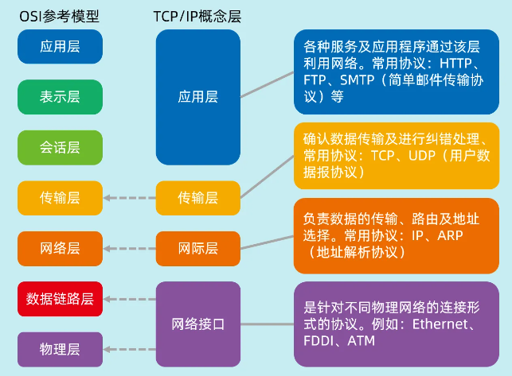
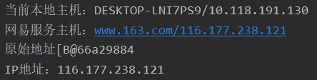
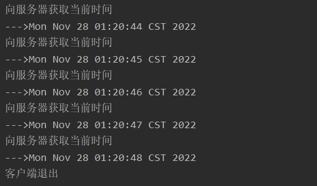

# 网络编程

## 网络基础

网络编程的目的：直接或间接地通过网络协议与其他终端进行通信。



### IP和端口

- IP：互联网中唯一标识一台计算机。

  - IPV4：32位，点分四组， eg.202.117.179.110

  - IPV6：128位，8组4位16进制

    eg. FE80:0000:0000:0000:AAAA:0000:00C2:0002

- 端口：网络通信时同一台机器上的不同进程的标识。

  1~1023为系统保留端口，端口的范围：0~65535

- 域名：IP地址不方便记忆，因此将IP地址与一个字符串对应，该

  字符串为域名，DNS（域名解析器）负责IP与域名的解析。

### 传输控制协议

传输控制协议 (Transmission Control Protocol[TCP]）是一种面向连接的保证可靠传输的协议，采用“三次握手”方式。通过TCP协议传输，得到的是一个顺序的无差错的数据流，可进行大数据量传输，传输完毕，需释放已建立的连接，效率低。

### 用户数据报协议 

用户数据报协议 (User Datagram Protocol[UDP]）是一种无连接的协议，每个数据报都是一个独立的信息，包括完整的源地址或目的地址，它在网络上以任何可能的路径传往目的地，因此能否到达目的地，到达目的地的时间以及内容的正确性都是不能被保证的，结束无需释放资源，速度快。

## URL类

URL（Uniform Resource Locator，统一资源定位器），是Internet中对网络资源进行统一定位和管理的标识，通俗地讲，一个URL对象封装着网络上某资源的地址信息。

URL基本结构：`<传输协议>://<主机名> [:<端口>]/<资源>`·

- `Protocol`： HTTP，FTP，File

-  `Hostname`：可以是IP地址或者域名
- `Port`： 用来区分一台计算机中的不同进程或服务

- `Filename`: 文件的完整路径。

URL类支持的常用协议：

| 协议名 | 说明                             |
| ------ | -------------------------------- |
| `file` | 访问本地计算机中的文件           |
| `http` | 超文本传输协议，浏览器和网络服务 |
| `ftp`  | 文本传输协议，用于互联网双向传输 |

## URL

### 构造方法

```java
import java.net.MalformedURLException;
import java.net.URL;

public class Example_01 {
    public static void main(String[] args) throws MalformedURLException {
        URL url1 = new URL("http://www.sina.com.cn/index.html");
        URL url2 = new URL("http", "www.sina.com", "index.html");

        System.out.println("传输协议：" + url1.getProtocol());
        System.out.println("主机名：" + url1.getHost());
        System.out.println("端口：" + url2.getPort());
        System.out.println("资源文件：" + url2.getFile());
    }
}
```

### 常用方法

- `InputStream opeenStream()`  打开到此`URL` 的连接并返回一个用于从该连接读入的`InputStream`。

```java
public class ReadHTML {
    public static void main(String[] ars) throws IOException {
        URL url = new URL("http://www.sina.com.cn");
        InputStream is = url.openStream();  // 读入字节数组
        // 桥接器，将字节转换为字符
        BufferedReader br = new BufferedReader(new InputStreamReader(is,"utf-8"));
        File file = new File("./src/sina.html");
        BufferedWriter bw = new BufferedWriter(new FileWriter(file));
        String str;
        while ((str = br.readLine()) != null) {
            bw.write(str);
            bw.newLine();
        }
        bw.close();
        br.close();
        is.close();
    }
}
```

## InetAddress类

`InetAddress`类用于实现主机名和IP地址的转换。

 `210.27.80.3`等价于www.nwsuaf.edu.cn。

`InetAddress`类描述了32位（Inet4Address，即IPv4）或128位（Inet6Address，即IPv6）的IP地址，其不含有构造方法，不能直接创建`InetAddress`对象，通过静态方法获取其对象。

`InetAddress.getByteName(String s)`。

### 其他方法

| 方法                      | 说明                                  |
| ------------------------- | ------------------------------------- |
| `byte[] getAddress()`     | 返回此`InetAddress`对象的原始IP地址   |
| `String getHostAddress()` | 返回此`InetAddress`对象的IP地址字符串 |
| `String getHostName() `   | 返回此`InetAddress`对象的主机名称     |

```java
public class InetAddressDemo {
    public static void main(String[] args) {
        try {
            InetAddress add1 = InetAddress.getLocalHost();
            System.out.println("当前本地主机：" + add1);
            InetAddress add2 = InetAddress.getByName("www.163.com");
            System.out.println("网易服务主机：" + add2);
            System.out.println("原始地址" + add2.getAddress());
            System.out.println("IP地址：" + add2.getHostAddress());
        } catch (UnknownHostException e) {
            throw new RuntimeException(e);
        }
    }
}
```



## 套接字

### 概述

套接字（Socket）是代表计算机之间网络连接的对象，用于建立计算机之间的TCP（Transmission Control Protocol）连接。

一个`Socket`由一个IP地址和一个端口号唯一确定，通信的两端都要有`Socket`，是两台机器间通信的端点。

`Socket`允许程序把网络连接当成一个流，数据在两个`Socket`间通过IO传输。

### 客户端套接字

客户端用`Socket`类来建立套接字对象，该对象负责连接到服务器：

1. 创建一个流套接字并将其连接到指定主机上的指定端口号：

   ```java
   try {
       Socket mySocket = new Socket("192.168.0.4",9527);
   } catch (IOException e) {
       System.out.println("连接服务器失败");
   }
   ```

2. 创建一个流套接字并将其连接到指定 IP 地址的指定端口号：

   ```java
   try {
       InetAddress address= InetAddress.getName("192.168.0.4");
       Socket mySocket=new Socket(address,9527);
   } catch (IOException e) {
       System.out.println("连接服务器失败");
   }
   ```

3. 创建未连接套接字：

   ```java
   try {
       Socket mySocket = new Socket();
       InetSocketAddress address = new InetSocketAddress("192.168.0.4", 9527);
       mySocket.connect(address);
   } catch (IOException e) {
   	System.out.println("连接服务器失败");
   }
   ```

   `InetAddress`描述IP地址，`InetSocketAddress`描述套接字地址（IP地址 + 端口）。

### 服务端的套接字

#### 常用构造方法

   1. 申请特定端口，如果申请的端口已被占用，则抛出`IOException`异常：

      ```java
      try {
          ServerSocket server = new ServerSocket(9527);
      } catch (IOException e) {
          System.out.println("申请端口失败！");
      }
      ```

   2. 指定的端口号和客户端连接的最大数目：

      ```
      try {
          ServerSocket server = new ServerSocket(9527, 5);
      } catch (IOException e) {
          System.out.println("申请端口失败！");
      }
      ```

#### `accept`方法

      `accept()`的返回值是`Socket`类型，作用是在服务器端生成一个和客户端的`Socket`对象相连接的`Socket`对象。
    
      ```java
      public static void main(String[] args) {
          try {
              OutputStream serverOut;
              InputStream serverIn;
              ServerSocket server = new ServerSocket(9527, 5);
              Socket sc = server.accept();
              serverOut = sc.getOutputStream(); // 服务器输出流
              serverIn = sc.getInputStream(); // 服务器输入流
          } catch (IOException e) {
              System.out.println("申请端口失败！");
          }
      }
      ```

### 建立连接与通信

   1. 服务器主机先运行，等待连接，线程进入等待状态；
   2. 建立`Socket`对象，客户机请求连接；
   3. 传送数据；
   4. 关闭连接；

   ```java
   import java.io.DataInputStream;
   import java.io.DataOutputStream;
   import java.io.IOException;
   import java.net.ServerSocket;
   import java.net.Socket;
   import java.util.Date;
   
   public class Server {
       ServerSocket server;
       Socket socket;
       DataOutputStream out;
       DataInputStream in;
   
       public void work() {
           try {
               server = new ServerSocket(5555);
               System.out.println("服务器等待客户端连接...");
               socket = server.accept();
               System.out.println(socket.getPort());
               out = new DataOutputStream(socket.getOutputStream());
               in = new DataInputStream(socket.getInputStream());
               System.out.println("已经取得客户端连接，等待请求...");
               while(true) {
                   String str = in.readUTF();
                   if(str.equals("Time")) {
                       Date date = new Date();
                       out.writeUTF(date.toString());
                   } else if(str.equals("Exit")) {
                       in.close();
                       out.close();
                       socket.close();
                       server.close();
                   }
               }
           } catch (IOException e) {
               throw new RuntimeException(e);
           }
       }
       public static void main(String[] args) {
           new Server().work();
       }
   }
   ```

   ```java
   import java.io.*;
   import java.net.Socket;
   import java.net.UnknownHostException;
   
   public class Client {
       Socket clientSocket;
       DataInputStream in;
       DataOutputStream out;
   
       public void work() {
           try {
               clientSocket = new Socket("127.0.0.1", 5555);
               in = new DataInputStream(clientSocket.getInputStream());
               out = new DataOutputStream(clientSocket.getOutputStream());
               for (int i = 0; i < 5; i++) {
                   System.out.println("向服务器获取当前时间");
                   out.writeUTF("Time");
                   System.out.println("--->" + in.readUTF());
                   Thread.sleep(1000);
               }
               System.out.println("客户端退出");
               out.writeUTF("Exit");
               in.close();
               out.close();
               clientSocket.close();
           } catch (IOException e) {
               throw new RuntimeException(e);
           } catch (InterruptedException e) {
               throw new RuntimeException(e);
           }
       }
       public static void main(String[] args) {
           new Client().work();
       }
   }
   ```

   

### 服务器使用多线程

`accept()`会导致线程阻塞，如果把它放在主线程中，当前服务器只能等待一个客户端要想使服务器处理多客户端需求，需使用多线程机制。

- 服务器端：主线程的任务：
  1. 生成一个`ServerSocket` 对象，该对象可以存在于主线程。
  2. 生成多个`Socket`对象，每个`Socket`对象对应一个独立的线程和客户端Socket通信。

- 客户端：每个客户端都是一个独立的`Socket`进程。