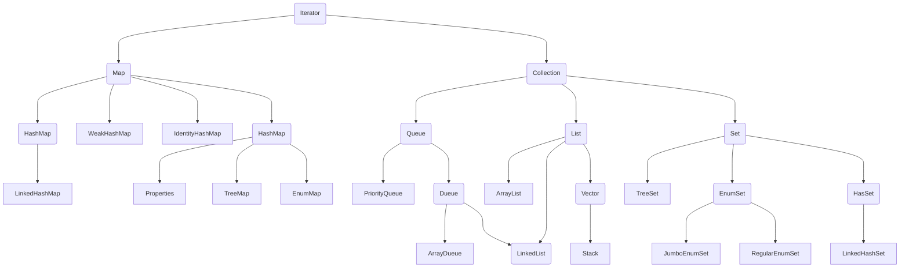

# 集合、泛型和枚举

为了保存数量不确定的数据，以及保存具有映射关系的数据（也被称为关联数组），Java提供了集合类。集合类主要负责保存、盛装其他数据，因此集合类也被称为容器类。Java所有的集合类都位于`java.util`包下，提供了一个表示和操作对象集合的统一构架，包含大量集合接口，以及这些接口的实现类和操作它们的算法。

集合只能保存对象（引用），Java集合类型分为`Collection`和`Map`：



| 接口名称         | 作  用                                                       |
| ---------------- | ------------------------------------------------------------ |
| `Iterator`接口   | 集合的输出接口，主要用于遍历输出（即迭代访问）`Collection`集合中的元素，`Iterator`对象被称之为迭代器。迭代器接口是集合接口的父接口，实现类实现`Collection`时就必须实现`Iterator`接口。 |
| `Collection`接口 | 是`List`、`Set`和`Queue`的父接口，是存放一组单值的最大接口。所谓的单值是指集合中的每个元素都是一个对象。一般很少直接使用此接口直接操作。 |
| `Queue`接口      | `Queue`是 Java 提供的队列实现，类似于`List`。                |
| `Dueue`接口      | 是`Queue`的一个子接口，为双向队列。                          |
| `List`接口       | 是最常用的接口。是有序集合，允许有相同的元素。使用`List`能够精确地控制每个元素插入的位置，用户能够使用索引（元素在 List 中的位置，类似于数组下标）来访问`List`中的元素，与数组类似。 |
| `Set`接口        | 不能包含重复的元素。                                         |
| `Map`接口        | 是存放一对值的最大接口，即接口中的每个元素都是一对，以key-value的形式保存。 |

| 类名称       | 作用                                                         |
| ------------ | ------------------------------------------------------------ |
| `HashSet`    | 为优化査询速度而设计的`Set`。它是基于`HashMap`实现           |
| `TreeSet`    | 实现了`Set`接口，是一个有序的`Set`，这样就能从`Set`里面提取一个有序序列 |
| `ArrayList`  | 一个用数组实现的`List`，能进行快速的随机访问，效率高而且实现了可变大小的数组 |
| `ArrayDueue` | 是一个基于数组实现的双端队列，按“先进先出”的方式操作集合元素 |
| `LinkedList` | 对顺序访问进行了优化，但随机访问的速度相对较慢。此外它还有`addFirst()`、`addLast()`、`getFirst()`、`getLast()`、`removeFirst()`和 `removeLast()`等方法，能把它当成栈（`Stack`）或队列（`Queue`）来用 |
| `HsahMap`    | 按哈希算法来存取键对象                                       |
| `TreeMap`    | 可以对键对象进行排序                                         |

## `Collection`接口详解

| 方法名称                            | 说明                                                         |
| ----------------------------------- | ------------------------------------------------------------ |
| `boolean add(E e)`                  | 向集合中添加一个元素，如果集合对象被添加操作改变了，则返回`true`。`E`是元素的数据类型 |
| `boolean addAll(Collection c)`      | 向集合中添加集合`c`中的所有元素，如果集合对象被添加操作改变了，则返回`true`。 |
| `void clear()`                      | 清除集合中的所有元素，将集合长度变为`0`。                    |
| `boolean contains(Object o)`        | 判断集合中是否存在指定元素                                   |
| `boolean containsAll(Collection c)` | 判断集合中是否包含集合`c`中的所有元素                        |
| `boolean isEmpty()`                 | 判断集合是否为空                                             |
| `Iterator<E>iterator()`             | 返回一个`Iterator`对象，用于遍历集合中的元素                 |
| `boolean remove(Object o)`          | 从集合中删除一个指定元素，当集合中包含了一个或多个元素`o`时，该方法只删除第一个符合条件的元素，该方法将返回`true`。 |
| `boolean removeAll(Collection c)`   | 从集合中删除所有在集合`c`中出现的元素（相当于把调用该方法的集合减去集合 c）。如果该操作改变了调用该方法的集合，则该方法返回`true`。 |
| `boolean retainAll(Collection c)`   | 从集合中删除集合`c`里不包含的元素（相当于把调用该方法的集合变成该集合和集合`c`的交集），如果该操作改变了调用该方法的集合，则该方法返回`true`。 |
| `int size()`                        | 返回集合中元素的个数                                         |
| `Object[] toArray()`                | 把集合转换为一个数组，所有的集合元素变成对应的数组元素。     |

```java
public class Test {
	private static Logger log = Logger.getLogger(Test.class.toString());
	public static void main(String[] args) {
		ArrayList list1 = new ArrayList();
		ArrayList list2 = new ArrayList();
		list1.add("one");
		list1.add("two");
		list2.addAll(list1);
		list2.add("three");
		System.out.println("list2集合中的元素如下：");
		Iterator it1 = list2.iterator();
		while (it1.hasNext()) {
			System.out.println(it1.next() + " ");
		}
	}
}
```

## `ArrayList`和`LinkedList`类

`List`是一个有序、可重复的集合，集合中每个元素都有其对应的顺序索引。List 集合允许使用重复元素，可以通过索引来访问指定位置的集合元素。`List`集合默认按元素的添加顺序设置元素的索引

### `ArrayList`类

`ArrayList`类实现了可变数组的大小，存储在内的数据称为元素。它还提供了快速基于索引访问元素的方式，对尾部成员的增加和删除支持较好。

| 方法名称                                      | 说明                                                         |
| --------------------------------------------- | ------------------------------------------------------------ |
| `E get(int index)`                            | 获取此集合中指定索引位置的元素，`E`为集合中元素的数据类型    |
| `int index(Object o)`                         | 返回此集合中第一次出现指定元素的索引，如果此集合不包含该元 素，则返回`-1` |
| `int lastIndexOf(Object o)`                   | 返回此集合中最后一次出现指定元素的索引，如果此集合不包含该 元素，则返回`-1` |
| `E set(int index, Eelement)`                  | 将此集合中指定索引位置的元素修改为 element 参数指定的对象。 此方法返回此集合中指定索引位置的原元素 |
| `List<E> subList(int fromlndex, int tolndex)` | 返回一个新的集合，新集合中包含`fromlndex`和`tolndex`索引之间 的所有元素。包含`fromlndex`处的元素，不包含`tolndex`索引处的 元素 |

```java
public class Product {
	private int id;
	private String name;
	private float price;
	
	public Product(int id, String name, float price) {
		this.id = id;
		this.name = name;
		this.price = price;
	}
	
	public String toString() {
		return "商品编号：" + id + ", " + "名称：" + name + ", " + "价格：" + price;
	}
}
```

```java
public class Test {
	public static void main(String[] args) {
		Product pd1 = new Product(4, "木糖醇", 10);
		Product pd2 = new Product(5, "洗发水", 20);
		Product pd3 = new Product(3, "热水壶", 20);
		List list = new ArrayList();
		list.add(pd1);				// 添加操作
		list.add(pd2);
		list.add(pd3);
		for (int i = 0; i < list.size(); i++) {
			Product product = (Product)list.get(i);
			System.out.println(product);
		}
	}
}
```

```java
public class Test {
	public static void main(String[] args) {
		List list = new ArrayList();
		for (int i = 0; i < 50; i++) {
			list.add(i);
		}
		List subList = list.subList(0, 50);
		Iterator it = list.iterator();
		
		while (it.hasNext()) {
			System.out.println(it.next());
		}
	}
}
```

### `LinkedList`类

`LinkedList`类采用链表结构保存对象，这种结构的优点是便于向集合中插入或者删除元素。需要频繁向集合中插入和删除元素时，使用`LinkedList`类比`ArrayList`类效果高，但是 LinkedList 类随机访问元素的速度则相对较慢。

| 方法名称             | 说明                         |
| -------------------- | ---------------------------- |
| `void addFirst(E e)` | 将指定元素添加到此集合的开头 |
| `void addLast(E e)`  | 将指定元素添加到此集合的末尾 |
| `E getFirst()`       | 返回此集合的第一个元素       |
| `E getLast()`        | 返回此集合的最后一个元素     |
| `E removeFirst()`    | 删除此集合中的第一个元素     |
| `E removeLast()`     | 删除此集合中的最后一个元素   |

```java
public class Test {
	public static void main(String[] args) {
		LinkedList list = new LinkedList();
		
		for (int i = 1; i <= 10; i++) {
			list.add(i);
		}
		System.out.println(list.getFirst());
		System.out.println(list.getLast());
		list.addFirst(0);
		list.addLast(11);
		list.set(5, 3);
		
		Iterator it = list.iterator();
		while (it.hasNext()) {
			System.out.print(it.next() + " ");
		}
	}
}
```

`ArrayList`是基于动态数组数据结构的实现，访问元素速度优于`LinkedList`。`LinkedList`是基于链表数据结构的实现，占用的内存空间比较大，但在批量插入或删除数据时优于`ArrayList`。

对于快速访问对象的需求，使用`ArrayList` 实现执行效率上会比较好。需要频繁向集合中插入和删除元素时，使用`LinkedList`类比`ArrayList`类效果高。

## `HashSet`和`TreeSet`类

`Set`集合中的对象不按特定的方式排序，只是简单地把对象加入集合。`Set`集合中不能包含重复的对象，并且最多只允许包含一个 `null`元素。

`Set`实现了`Collection`接口，它主要有两个常用的实现类：`HashSet` 类和`TreeSet`类。

### `HashSet`类

HashSet 具有以下特点：

- 不能保证元素的排列顺序，顺序可能与添加顺序不同，顺序也有可能发生变化。
- `HashSet`不是同步的，如果多个线程同时访问或修改一个 `HashSet`，则必须通过代码来保证其同步。
- 集合元素值可以是`null`。

```java
public class Test {
	public static void main(String[] args) {
		HashSet<String>	map = new HashSet();
		map.add("C语言");
		map.add("计算机组成原理");
		map.add("操作系统");
		map.add("数据库");
		
		Iterator it = map.iterator();
		while (it.hasNext()) {
			System.out.println(it.next());
		}
	}
}
```

### `TreeSet`类

`TreeSet`类同时实现了`Set`接口和`SortedSet` 接口。SortedSet 接口是`Set`接口的子接口，可以实现对集合进行自然排序，因此使用 `TreeSet`类实现的`Set`接口默认情况下是自然排序的，这里的自然排序指的是升序排序。

`TreeSet`只能对实现了`Comparable`接口的类对象进行排序

| 方法名称                                         | 说明                                                         |
| ------------------------------------------------ | ------------------------------------------------------------ |
| `E first()`                                      | 返回此集合中的第一个元素。其中，E 表示集合中元素的数据类型   |
| `E last()`                                       | 返回此集合中的最后一个元素                                   |
| `E poolFirst()`                                  | 获取并移除此集合中的第一个元素                               |
| `E poolLast()`                                   | 获取并移除此集合中的最后一个元素                             |
| `SortedSet<E> subSet(E fromElement,E toElement)` | 返回一个新的集合，新集合包含原集合中`fromElement`对象与`toElement`对象之间的所有对象。包含`fromElement`对象，不包含 `toElement`对象 |
| `SortedSet<E> headSet<E toElement〉`             | 返回一个新的集合，新集合包含原集合中`toElement`对象之前的所有对象。 不包含`toElement`对象 |
| `SortedSet<E> tailSet(E fromElement)`            | 返回一个新的集合，新集合包含原集合中`fromElement`对象之后的所有对 象。包含`fromElement`对象 |

```java
public class Test {
	public static void main(String[] args) {
		TreeSet<Integer> tree = new TreeSet();
		Scanner input = new Scanner(System.in);
		int temp = 0;
		System.out.println("请输入学生成绩：");
		while (input.hasNextInt()) {
			temp = input.nextInt();
			tree.add(temp);
		}
		System.out.println("学生成绩如下：");
		Iterator it = tree.iterator();
		int count = 0;
		while (it.hasNext()) {
			++count;
			System.out.print(count + ": " + it.next() + " ");
		}
		SortedSet s1 = tree.headSet(60);
		Iterator it1 = s1.iterator();
		System.out.println("\n不及格的成绩如下：");
		while (it1.hasNext()) {
			System.out.print(it1.next() + " ");
		}
		SortedSet s2 = tree.tailSet(90);
		Iterator it2 = s2.iterator();
		System.out.println("\n优秀的成绩如下：");
		while (it2.hasNext()) {
			System.out.print(it2.next() + " ");
		}
	}
}
```

```
请输入学生成绩：
20 59 60 89 90 100 56 q
学生成绩如下：
1: 20 2: 56 3: 59 4: 60 5: 89 6: 90 7: 100 
不及格的成绩如下：
20 56 59 
优秀的成绩如下：
90 100
```

## `Map`类

### 基本方法

`Map`是一种键-值对（key-value）集合，`Map`集合中的每一个元素都包含一个键（key）对象和一个值（value）对象。用于保存具有映射关系的数据。

`Map`中的`key`和`value`之间存在单向一对一关系，即通过指定的 `key`，总能找到唯一的、确定的`value`。从`Map`中取出数据时，只要给出指定的`key`，就可以取出对应的`value`。

`Map`接口主要有两个实现类：`HashMap`类和`TreeMap`类。其中，`HashMap`类按哈希算法来存取键对象，`TreeMap`类可以对键对象进行排序。

| 方法名称                                   | 说明                                                         |
| ------------------------------------------ | ------------------------------------------------------------ |
| `void clear()`                             | 删除该`Map`对象中的所有 key-value 对。                       |
| `boolean containsKey(Object key)`          | 查询`Map`中是否包含指定的 `key`，如果包含则返回`true`。      |
| `boolean containsValue(Object value)`      | 查询`Map`中是否包含一个或多个 `value`，如果包含则返回`true`。 |
| `V get(Object key)`                        | 返回`Map`集合中指定键对象所对应的值。V 表示值的数据类型      |
| `V put(K key, V value)`                    | 向`Map`集合中添加键-值对，如果当前`Map`中已有一个与该`key`相等的key-value对，则新的key-value对会覆盖原来的key-value 对。 |
| `void putAll(Map m)`                       | 将指定`Map`中的 key-value 对复制到本`Map`中。                |
| `V remove(Object key)`                     | 从`Map`集合中删除`key`对应的键-值对，返回`key`对应的`value`，如果该`key`不存在，则返回`null` |
| `boolean remove(Object key, Object value)` | Java 8 新增方法，删除指定 `key`、`value` 所对应的 key-value 对。如果从该 Map 中成功地删除该 key-value 对，该方法返回`true`，否则返回`false`。 |
| `Set entrySet()`                           | 返回`Map`集合中所有键-值对的`Set`集合，此`Set`集合中元素的数据类型为`Map.Entry` |
| `Set keySet()`                             | 返回`Map`集合中所有键对象的`Set`集合                         |
| `boolean isEmpty()`                        | 查询该`Map`是否为空（即不包含任何 key-value 对），如果为空则返回 true。 |
| `int size()`                               | 返回该`Map`里 key-value 对的个数                             |
| `Collection values()`                      | 返回该`Map`里所有`value`组成的`Collection`                   |

```java
public class Test {
	public static void main(String[] args) {
		HashMap users = new HashMap();
		users.put("11", "Sam");
		users.put("22", "Tom");
		users.put("23", "Tim");
		users.put("25", "John");
		System.out.println("***学生列表***");
		Iterator it = users.keySet().iterator();
		while (it.hasNext()) {
			Object key = it.next();
			Object val = users.get(key);
			System.out.println("学号：" + key + ", 姓名：" + val);
		}
		Scanner input = new Scanner(System.in);
		System.out.println("请输入要删除的学生学号：");
		int num = input.nextInt();
		if (users.containsKey(String.valueOf(num))) {
			users.remove(String.valueOf(num));
		} else {
			System.out.println("该学生不存在");
		}
		
		it = users.keySet().iterator();
		while (it.hasNext()) {
			Object key = it.next();
			Object val = users.get(key);
			System.out.println("学号：" + key + ", " + val);
		}
	}
}
```

### 遍历集合

- `for`循环使用`entries`实现Map的遍历

  ```java
  public class Test {
  	public static void main(String[] args) {
  		Map<String, Integer> map = new HashMap<String, Integer>();
  		map.put("hello", 5);
  		map.put("each", 4);
  		
  		for (Map.Entry<String, Integer> entry : map.entrySet()) {
  			String mapKey = entry.getKey();
  			Integer mapValue = entry.getValue();
  			System.out.println(mapKey + ": " + mapValue);
  		}
  	}
  }
  ```

  

- 使用for-each遍历key或values，性能更好

  ```java
  for (String key : map.keySet()) {
      System.out.println(key);
  }
  ```

- 使用迭代器

  ```java
  Iterator<Entry<String, Integer>> entries = map.entrySet().iterator();
  
  while (entries.hasNext()) {
      Entry<String, Integer> entry = entries.next();
      String key = entry.getKey();
      Integer value = entry.getValue();
      System.out.println(key + ": " + value);
  }
  ```

- 通过键找值遍历

  ```java
  for (String key : map.keySet()) {
      String value = map.get(key);
      System.out.println(key + ": " + value);
  }
  ```

### `Map`新增方法

```java
	public static void main(String[] args) {
		Map<String, Integer> map = new HashMap<String, Integer>();
		map.put("hello", 5);
		map.put("each", 4);
		map.put("world", 24);
		
		map.replace("hello", 40);
		System.out.println(map);
		
		map.merge("each", 25, (oldVal, param) -> oldVal + param);
		System.out.println(map); // 25 + 4
		
		map.computeIfAbsent("c", (key) -> (key).length());
		System.out.println(map);
		
		map.computeIfPresent("world", (key, value) -> 2);
		System.out.println(map);
	}
```

## `Collections`类操作

### 排序

- `void reverse(List list)`：对指定`List`集合元素进行逆向排序。
- `void shuffle(List list)`：对`List`集合元素进行随机排序（shuffle方法模拟了洗牌动作）。
- `void sort(List list)`：根据元素的自然顺序对指定`List`集合的元素按升序进行排序。
- `void sort(List list, Comparator c)`：根据指定`Comparator`产生的顺序对`List`集合元素进行排序。
- `void swap(List list, int i, int j)`：将指定`List`集合中的`i`处元素和`j`处元素进行交换。
- `void rotate(List list, int distance)`：当`distance`为正数时，将`list`集合的后 `distance`个元素“整体”移到前面；当`distance`为负数时，将`list`集合的前 distance 个元素整体移到后面。该方法不会改变集合的长度。

```java
public static void main(String[] args) {
    List<Integer> list = new ArrayList<Integer>();

    list.add(3);
    list.add(5);
    list.add(7);
    list.add(1);
    list.add(0);
    list.add(50);

    System.out.println(list);

    Collections.sort(list);
    System.out.println(list);

    Collections.reverse(list);
    System.out.println(list);

    Collections.shuffle(list);
    System.out.println(list);

    Collections.sort(list, new Comparator<Integer>() {
        @Override
        public int compare(Integer o1, Integer o2) {
            return o2 - o1;			// 从大到小排序
        }
    });
    System.out.println(list);

    Collections.rotate(list, 2);
    System.out.println(list);
}
```

### 查找、替换操作

- `int binarySearch(List list, Object key)`：使用二分搜索法搜索指定的`List`集合，以获得指定对象在`List`集合中的索引。如果要使该方法可以正常工作，则必须保证`List`中的元素已经处于有序状态。
- `Object max(Collection coll)`：根据元素的自然顺序，返回给定集合中的最大元素。
- `Object max(Collection coll, Comparator comp)`：根据`Comparator`指定的顺序，返回给定集合中的最大元素。
- `Object min(Collection coll)`：根据元素的自然顺序，返回给定集合中的最小元素。
- `Object min(Collection coll, Comparator comp)`：根据`Comparator`指定的顺序，返回给定集合中的最小元素。
- `void fill(List list, Object obj)`：使用指定元素`obj`替换指定`List`集合中的所有元素。
- `int frequency(Collection c, Object o)`：返回指定集合中指定元素的出现次数。
- `int indexOfSubList(List source, List target)`：返回子`List`对象在父`List`对象中第一次出现的位置索引；如果父`List`中没有出现这样的子`List`，则返回 -1。
- `int lastIndexOfSubList(List source, List target)`：返回子`List`对象在父 List 对象中最后一次出现的位置索引；如果父`List`中没有岀现这样的子`List`，则返回-1。
- `boolean replaceAll(List list, Object oldVal, Object newVal)`：使用一个新值`newVal`替换`List`对象的所有旧值`oldVal`。

```java
	public static void main(String[] args) {
		List<Integer> list = new ArrayList<Integer>();
		
		list.add(3);
		list.add(5);
		list.add(7);
		list.add(1);
		list.add(0);
		list.add(50);
		list.add(7);
		
		List<Integer> subList = new ArrayList<Integer>();
		subList.add(3);
		System.out.println("元素2位于" + Collections.binarySearch(list, 2));
		System.out.println("最大元素为" + Collections.max(list));
		System.out.println("最小元素为" + Collections.min(list));
		System.out.println("元素7的出现次数" + Collections.frequency(list, 7));
		System.out.println("subList在list第一次出现位置" + Collections.frequency(list, subList));
		
		Collections.fill(list, 2);
		System.out.println(list);
		Collections.replaceAll(list, 2, 0);
		System.out.println(list);
	}
```

```
元素2位于-6
最大元素为50
最小元素为0
元素7的出现次数2
subList在list第一次出现位置0
[2, 2, 2, 2, 2, 2, 2]
[0, 0, 0, 0, 0, 0, 0]
```

### 复制

`Collections`类的`copy()`静态方法用于将指定集合中的所有元素复制到另一个集合中。执行`copy()`方法后，目标集合中每个已复制元素的索引将等同于源集合中该元素的索引。

`copy()`方法的语法格式如下：

```java
void copy(List <? super T> dest,List<? extends T> src)
```

```java
public static void main(String[] args) {
List<Integer> srcList = new ArrayList<Integer>();
List<Integer> destList = new ArrayList<Integer>(6);
srcList.add(3);
srcList.add(5);
srcList.add(1);
destList.add(0);
destList.add(50);
destList.add(7);

Collections.copy(destList, srcList);			// 长度必须相同

System.out.println(destList);

}
```

### Lambda表达式遍历集合元素

利用`Collection`的`forEach`方法实现遍历：

```java
Collection objs = new HashSet();
objs.add("Java");
objs.add("Python");
objs.add("C");
// 调用forEach()方法遍历集合
objs.forEach(obj -> System.out.println("迭代集合元素：" + obj));
```

```
迭代集合元素：Java
迭代集合元素：C
迭代集合元素：Python
```

### `Iterator`遍历集合元素

当使用`Iterator`迭代访问`Collection`集合元素时，`Collection`集合里的元素不能被改变，只有通过`Iterator`的`remove()`方法删除上一次`next()`方法返回的集合元素才可以，否则将会引发java.util.ConcurrentModificationException异常

```java
		Collection objs = new HashSet();
        objs.add("Java");
        objs.add("Python");
        objs.add("C");
        
        Iterator it = objs.iterator();
        
        while (it.hasNext()) {
        	String obj = (String) it.next();
        	it.remove();
//        	objs.remove(obj); error
        }
```

### 使用Lambda表达式遍历Iterator迭代器

使用`Iterator`的`forEachRemaining`方法实现遍历：

```java
	public static void main(String[] args) {
		Collection objs = new HashSet();
        objs.add("Java");
        objs.add("Python");
        objs.add("C");
        
        Iterator it = objs.iterator();
        
        it.forEachRemaining(obj -> System.out.println(obj));
	}
```

### 使用foreach循环遍历集合

```java
Collection objs = new HashSet();
objs.add("Java");
objs.add("Python");
objs.add("C");

for (Object obj : objs) {
    System.out.println(obj);
}
```

### Predicate操作集合

Java 8起为`Collection`集合新增了一个`removeIf(Predicate filter)`方法，该方法将会批量删除符合`filter`条件的所有元素。该方法需要一个`Predicate`对象作为参数，`Predicate`也是函数式接口，因此可使用Lambda表达式作为参数。

```java
public static void main(String[] args) {
    Collection objs = new HashSet();
    objs.add("Java");
    objs.add("Python");
    objs.add("C");

    objs.removeIf(ele -> ((String) ele).length() < 3);

    System.out.println(objs);
}
```

```
[Java, Python]
```

### `Stream`操作集合

Java 8还新增了`Stream`、`IntStream`、`LongStream`、`DoubleStream`等流式 API，这些API代表多个支持串行和并行聚集操作的元素。上面 4 个接口中，`Stream`是一个通用的流接口，而`IntStream`、`LongStream`、 `DoubleStream` 则代表元素类型为`int`、`long`、`double`的流。

独立使用`Stream`的步骤如下：

- 使用`Stream`的`builder()`类方法创建该`Stream`对应的`Builder`。
- 重复调用`Builder`的`add()`方法向该流中添加多个元素。
- 调用`Builder`的`build()`方法获取对应的`Stream`。
- 调用`Stream`的聚集方法。

```java
	public static void main(String[] args) {
		IntStream is = IntStream.builder().add(20).add(30).add(3).build();
		
		// // 下面调用聚集方法的代码每次只能执行一行
		System.out.println("is所有元素最大值：" + is.max().getAsInt());
		System.out.println("is 所有元素的最小值：" + is.min().getAsInt());
        System.out.println("is 所有元素的总和：" + is.sum());
        System.out.println("is 所有元素的总数：" + is.count());
	}
```

`Stream`提供了大量的方法进行聚集操作，这些方法既可以是中间的（intermediate），也可以是末端的（terminal）。

- 中间方法：中间操作允许流保持打开状态，并允许直接调用后续方法。上面程序中的`map()`方法就是中间方法。中间方法的返回值是另外一个流。
- 末端方法：末端方法是对流的最终操作。当对某个`Stream`执行末端方法后，该流将会被消耗且不再可用。上面程序中的`sum()`、`count()`、`average()` 等方法都是末端方法。

 `Stream`常用的中间方法：

| 方法                             | 说明                                                         |
| -------------------------------- | ------------------------------------------------------------ |
| `filter(Predicate predicate)`    | 过滤`Stream`中所有不符合 predicate 的元素                    |
| `mapToXxx(ToXxxFunction mapper)` | 使用`ToXxxFunction`对流中的元素执行一对一的转换，该方法返回的新流中包含了`ToXxxFunction`转换生成的所有元素。 |
| `peek(Consumer action)`          | 依次对每个元素执行一些操作，该方法返回的流与原有流包含相同的元素。该方法主要用于调试。 |
| `distinct()`                     | 该方法用于排序流中所有重复的元素（判断元素重复的标准是使用`equals()`比较返回 true）。这是一个有状态的方法。 |
| `sorted()`                       | 该方法用于保证流中的元素在后续的访问中处于有序状态。这是一个有状态的方法。 |
| `limit(long maxSize)`            | 该方法用于保证对该流的后续访问中最大允许访问的元素个数。这是一个有状态的、短路方法。 |

```java
public static void main(String[] args) {
    IntStream is = IntStream.builder().add(20).add(30).add(3).build();

    IntStream newIs = is.filter(elem -> (elem > 1));

    IntStream newIs2 = newIs.sorted();
    newIs2.forEach(System.out::println);
}
```

`Stream`常用的末端方法：

| 方法                             | 说明                                                       |
| :------------------------------- | ---------------------------------------------------------- |
| `forEach(Consumer action)`       | 遍历流中所有元素，对每个元素执行`action`                   |
| `toArray()`                      | 将流中所有元素转换为一个数组                               |
| `reduce()`                       | 该方法有三个重载的版本，都用于通过某种操作来合并流中的元素 |
| `min()`                          | 返回流中所有元素的最小值                                   |
| `max()`                          | 返回流中所有元素的最大值                                   |
| `count()`                        | 返回流中所有元素的数量                                     |
| `anyMatch(Predicate predicate)`  | 判断流中是否至少包含一个元素符合Predicate条件。            |
| `allMatch(Predicate predicate)`  | 判断流中是否每个元素都符合Predicate条件                    |
| `noneMatch(Predicate predicate)` | 判断流中是否所有元素都不符合Predicate条件                  |
| `findFirst()`                    | 返回流中的第一个元素                                       |
| `findAny()`                      | 返回流中的任意一个元素                                     |

```java
public class Test {
	public static void main(String[] args) {
		Collection objs = new HashSet();
		objs.add(new String("C"));
		objs.add(new String("Java"));
		objs.add(new String("Python"));
		objs.add(new String("C++"));
		
		System.out.println(objs.stream().filter(elem -> ((String) elem).length() > 2).count());
		
		objs.stream().mapToInt(ele -> ((String) ele).length()).forEach(System.out::println);
	}
}
```

### 不可变集合

程序直接调用`Set`、`List`、`Map`的`of()`方法即可创建包含`N`个元素的不可变集合不可变意味着程序不能向集合中添加元素，也不能从集合中删除元素。

```java
public class Test {
	public static void main(String[] args) {
		Set set = Set.of("Java", "Python", "C", "C++");
		
		System.out.println(set);
//		set.remove("Java");
		
		List list = List.of(32, -25, 67);
		System.out.println(list);
		
		Map map = Map.of("语文", 20, "数学", 39);
		System.out.println(map);
		
		Map map2 = Map.ofEntries(Map.entry("语文", 89), Map.entry("数学", 99));
		System.out.println(map2);
	}
}
```

```
[C++, Python, C, Java]
[32, -25, 67]
{语文=20, 数学=39}
{语文=89, 数学=99}
```

## 菱形语法

上面两条语句中等号右边的尖括号部分完全是多余的，Java 7版本以前是必需的，不能省略。从Java 7开始，Java允许在构造器后不带完整的泛型信息，只要给出一对尖括号`<>`即可。Java 可以推断出尖括号里应该是什么泛型信息。

即上面两条语句可以改写为如下形式：

```java
List<String> strList = new ArrayList<>();
Map<String, Integer> scores = new HashMap<>();
```

Java 9再次增强了“菱形”语法，它甚至允许在创建匿名内部类时使用菱形语法，Java可根据上下文来推断匿名内部类中泛型的类型。

```java
interface Foo<T> {
	void test(T t);
}

public class AnnoymousTest {
	public static void main(String[] args) {
        // Foo泛型为String
		Foo<String> f = new Foo<>() {
			public void test(String t) {
				System.out.println("test的方法t的参数为：" + t);
			}
		};
        // 使用泛型通配符，此时相当于上限为Object
		Foo<?> fo = new Foo<>() {
			public void test(Object t) {
				System.out.println("test的方法的参数为：" + t);
			}
		};
        // 使用泛型通配符，泛型上限为Number
		Foo<? extends Number> fn = new Foo<>() {
			public void test(Number t) {
				System.out.println("test的方法的参数为：" + t);
			}
		};
	}
}
```

## 泛型类简介

### 泛型集合

泛型本质上是提供类型的“类型参数”，也就是参数化类型。我们可以为类、接口或方法指定一个类型参数，通过这个参数限制操作的数据类型，从而保证类型转换的绝对安全。

```java
class Book {
    private int Id; 								// 图书编号
    private String Name; 							// 图书名称
    private int Price; 								// 图书价格

    public Book(int id, String name, int price) { 	// 构造方法
        this.Id = id;
        this.Name = name;
        this.Price = price;
    }

    public String toString() { 						// 重写 toString()方法
        return this.Id + ", " + this.Name + "，" + this.Price;
    }
}
public class Test {
    public static void main(String[] args) {
        // 创建3个Book对象
        Book book1 = new Book(1, "唐诗三百首", 8);
        Book book2 = new Book(2, "小星星", 12);
        Book book3 = new Book(3, "成语大全", 22);
        Map<Integer, Book> books = new HashMap<Integer, Book>(); // 定义泛型 Map 集合
        books.put(1001, book1); 					// 将第一个 Book 对象存储到 Map 中
        books.put(1002, book2); 					// 将第二个 Book 对象存储到 Map 中
        books.put(1003, book3); 					// 将第三个 Book 对象存储到 Map 中
        System.out.println("泛型Map存储的图书信息如下：");

        for (Map.Entry<Integer, Book> entry : books.entrySet()) {
        	System.out.println(entry.getKey() + "————" + entry.getValue());
        }
        List<Book> bookList = new ArrayList<Book>(); // 定义泛型的 List 集合
        bookList.add(book1);
        bookList.add(book2);
        bookList.add(book3);
        System.out.println("泛型List存储的图书信息如下：");
        for (int i = 0; i < bookList.size(); i++) {
            System.out.println(bookList.get(i)); 	// 这里不需要类型转换
        }
    }
}
```

### 泛型类

除了可以定义泛型集合之外，还可以直接限定泛型类的类型参数。语法格式如下：

```java
public class class_name<data_type1,data_type2,…> {}
```

```java
class Student<N, A, S> {
	private N name;
	private A age;
	private S sex;
	
	public Student(N name, A age, S sex) {
		this.setName(name);
		this.setAge(age);
		this.setSex(sex);
	}

	public N getName() {
		return name;
	}

	public void setName(N name) {
		this.name = name;
	}

	public A getAge() {
		return age;
	}

	public void setAge(A age) {
		this.age = age;
	}

	public S getSex() {
		return sex;
	}

	public void setSex(S sex) {
		this.sex = sex;
	}
	
}
public class Test {
    public static void main(String[] args) {
    	Student<String, Integer, Character> stu = new Student<String, Integer, Character>("张", 2, '男');
    	String name = stu.getName();
        Integer age = stu.getAge();
        Character sex = stu.getSex();
        System.out.println("学生信息如下：");
        System.out.println("学生姓名：" + name + "，年龄：" + age + "，性别：" + sex);
    }
}
```

### 泛型方法

是否拥有泛型方法，与其所在的类是不是泛型没有关系。

```java
public class Test {
	public static <T> void show(T obj) {
		if (obj != null) {
			System.out.println(obj);
		}
	}
    public static void main(String[] args) {
    	show(new String("Java"));
    }
}
```

### 泛型的高级用法

#### 限制泛型可用类型

在 Java 中默认可以使用任何类型来实例化一个泛型类对象。当然也可以对泛型类实例的类型进行限制，语法格式如下：

```java
class 类名称<T extends anyClass>
```

```java
public class Test<T extends List> {
    public static void main(String[] args) {
    	Test<ArrayList> lc1 = new Test<ArrayList>();
    	List<LinkedList> lc2 = new Test<LinkedList>();
    }
}
```

#### 使用类型通配符

使用泛型类型通配符的语法格式如下：

```java
泛型类名称<? extends List>a = null;
```

```java
public class Test<T extends List> {
    public static void main(String[] args) {
    	A<? extends List> a = null;
    	a = new A<ArrayList>();
    	b = new A<LinkedList>();
    	c = new A<HashMap>();
    }
}
```

#### 继承泛型类和实现泛型接口

定义为泛型的类和接口也可以被继承和实现。例如下面的示例代码演示了如何继承泛型类。

```java
public class FatherClass<T1> {}
public class SonClass<T1, T2, T3> extents FatherClass<T1>{}
```

```java
interface interface1<T1>{}
interface SubClass<T1, T2, T3> implements Interface1<T2> {}
```

## 枚举类型

### 声明枚举

声明枚举时必须使用 `enum` 关键字，然后定义枚举的名称、可访问性、基础类型和成员等。枚举声明的语法如下：

```java
enum-modifiers enum enumname:enum-base {
    enum-body,
}
```

```java
enum Signal {
	GREEN, YELLOW, RED;
}

public class TrafficLight {
	Signal color = Signal.RED;
	public void change() {
		switch (color) {
			case RED:
				color = Signal.GREEN;
				break;
			case YELLOW:
				color = Signal.RED;
				break;
			case GREEN:
				color = Signal.YELLOW;
				break;
		}
	}
}
```

Java 中的每一个枚举都继承自 `java.lang.Enum` 类。当定义一个枚举类型时，每一个枚举类型成员都可以看作是 Enum 类的实例，这些枚举成员默认都被 `final`、`public`, `static` 修饰，当使用枚举类型成员时，直接使用枚举名称调用成员即可。

### 枚举类

所有枚举实例都可以调用 Enum 类的方法：

| 方法名称      | 描述                             |
| ------------- | -------------------------------- |
| `values()`    | 以数组形式返回枚举类型的所有成员 |
| `valueOf()`   | 将普通字符串转换为枚举实例       |
| `compareTo()` | 比较两个枚举成员在定义时的顺序   |
| `ordinal()`   | 获取枚举成员的索引位置           |

```java
public class TrafficLight {
	public static void main(String[] args) {
		for (int i = 0; i < Signal.values().length; i++) {
			System.out.println("枚举成员：" + Signal.values()[i]);
		}
	}
}
```

```
枚举成员：GREEN
枚举成员：YELLOW
枚举成员：RED
```

```java
public class Test {
	enum Sex {
		male, female;
	}
	public static void main(String[] args) {
		compare(Sex.valueOf("male"));
	}
	public static void compare(Sex s) {
		for (int i = 0; i < Sex.values().length; i++) {
			System.out.println(s + "与" + Sex.values()[i] + "的比较结果为" + s.compareTo(Sex.values()[i]));
		}
	}
}
```

```
male与male的比较结果为0
male与female的比较结果为-1
```

### 为枚举添加方法

```java
public enum WeekDay {
    Mon("Monday"), Tue("Tuesday"), Wed("Wednesday"),
    Thu("Thursday"), Fri("Friday"), Sat("Saturday"), Sun("Sunday");
    // 以上是枚举的成员，必须先定义，而且使用分号结束
    private final String day;
    private WeekDay(String day) {
        this.day = day;
    }
    public static void printDay(int i) {
        switch(i) {
            case 1:
                System.out.println(WeekDay.Mon);
                break;
            case 2:
                System.out.println(WeekDay.Tue);
                break;
            case 3:
                System.out.println(WeekDay.Wed);
                break;
            case 4:
                System.out.println(WeekDay.Thu);
                break;
            case 5:
                System.out.println(WeekDay.Fri);
                break;
            case 6:
                System.out.println(WeekDay.Sat);
                break;
            case 7:
                System.out.println(WeekDay.Sun);
                break;
            default:
                System.out.println("wrong number!");
        }
    }
    public String getDay() {
        return day;
    }
    public static void main(String[] args) {
    	for (WeekDay day : WeekDay.values()) {
    		System.out.println(day + "===>" + day.getDay());
    	}
    	WeekDay.printDay(5);
    }
}

```

Java 中的 `enum` 还可以跟 `Class` 类一样覆盖基类的方法

### `EnumMap`与 `EnumSet`

为了更好地支持枚举类型，java.util 中添加了两个新类：`EnumMap` 和 `EnumSet`。使用它们可以更高效地操作枚举类型。

#### `EnumMap` 类

```java
// 定义数据库类型枚举
public enum DataBaseType {
    MYSQUORACLE,DB2,SQLSERVER
}
// 某类中定义的获取数据库URL的方法以及EnumMap的声明
private EnumMap<DataBaseType,String>urls = new EnumMap<DataBaseType,String>(DataBaseType.class);
public DataBaseInfo() {
    urls.put(DataBaseType.DB2,"jdbc:db2://localhost:5000/sample");
    urls.put(DataBaseType.MYSQL,"jdbc:mysql://localhost/mydb");
    urls.put(DataBaseType.ORACLE,"jdbc:oracle:thin:@localhost:1521:sample");
    urls.put(DataBaseType.SQLSERVER,"jdbc:microsoft:sqlserver://sql:1433;Database=mydb");
}
//根据不同的数据库类型，返回对应的URL
// @param type DataBaseType 枚举类新实例
// @return
public String getURL(DataBaseType type) {
    return this.urls.get(type);
}
```

#### `EnumSet` 类

EnumSet 是枚举类型的高性能 Set 实现，它要求放入它的枚举常量必须属于同一枚举类型。EnumSet 提供了许多工厂方法以便于初始化。
